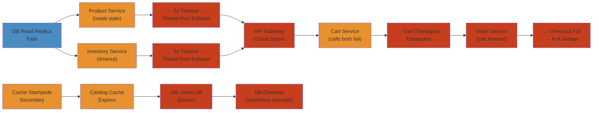

# 🔌 Circuit Breaker Cascading Failure — Production Incident Deep Dive

> **Scope:** Real-world circuit breaker cascading failure patterns in a microservices e-commerce platform. Covers how a single database read replica failure triggered a multi-service meltdown through misconfigured circuit breakers, thread pool starvation, and cache stampede effects. Includes detection, root cause analysis, mitigation, and permanent fixes with code and configuration examples.
>
> **Applicability:** SRE teams, backend engineers, platform engineers, architects, and anyone operating microservices with circuit breakers (Resilience4j, Hystrix, Envoy/Istio).

---




## Table of Contents


1. [Incident Overview](#incident-overview)
2. [Architecture Background](#architecture-background)
3. [Timeline](#timeline)
4. [Symptoms and Detection](#symptoms-and-detection)
5. [Root Cause Analysis](#root-cause-analysis)
6. [Circuit Breaker Deep Dive](#circuit-breaker-deep-dive)
7. [Cascade Propagation Mechanics](#cascade-propagation-mechanics)
8. [Failure Analysis: Why Circuit Breakers Failed to Contain](#failure-analysis-why-circuit-breakers-failed-to-contain)
9. [Mitigation](#mitigation)
10. [Resolution and Permanent Fixes](#resolution-and-permanent-fixes)
11. [Production Patterns Reference](#production-patterns-reference)
12. [Monitoring and Observability Reference](#monitoring-and-observability-reference)
13. [Incident Retrospective](#incident-retrospective)

---

## Incident Overview


| Field | Value |
|---|---|
| **Incident ID** | INC-2026-05-27-003 |
| **Severity** | SEV-1 (Critical) |
| **Duration** | 67 minutes (14:02 UTC — 15:09 UTC) |
| **Affected Services** | 47 of 214 microservices |
| **User Impact** | 12.4% checkout failures, 8.1% search degradation, 3.2% complete timeouts |
| **Revenue Impact** | ~$340k estimated unprocessed orders |
| **Team** | Platform SRE, Checkout Team, Search Team, Cart Team |

### What Happened


A single database read replica in the `orders` service experienced a transient hardware failure at the storage layer. This replica served as the primary read target for 12 downstream microservices. Within 67 minutes, the failure cascaded through the service mesh, opening circuit breakers across 47 services, triggering thread pool starvation in 8 critical services, and ultimately degrading both the checkout and search surfaces.

### Why It Matters


Circuit breakers are designed to contain failures, not amplify them. This incident demonstrates how **improperly configured circuit breakers** combined with **aggressive client-side timeouts**, **retry storms**, and **cache stampede effects** turned a localized infrastructure failure into a platform-wide degradation event.

---

## Architecture Background


### Service Topology (Simplified)


```
                                    ┌──────────────────────┐
                                    │    API Gateway        │
                                    │    (Kong/Envoy)       │
                                    └──────┬──────┬────────┘
                                           │      │
                              ┌────────────┘      └────────────┐
                              ▼                               ▼
                     ┌─────────────────┐           ┌────────────────────┐
                     │   Web Frontend  │           │   Mobile BFF       │
                     │   (Next.js)     │           │   (GraphQL)        │
                     └────────┬────────┘           └─────────┬──────────┘
                              │                               │
                     ┌────────┴───────────────────────────────┴────────┐
                     │                Service Mesh (Istio/Envoy)       │
                     │         (mTLS, traffic routing, circuit break)  │
                     └────────┬───────────────────────────────┬────────┘
                              │                               │
                ┌─────────────┼──────────────┬────────────────┼───────────────┐
                ▼             ▼              ▼                ▼               ▼
        ┌────────────┐ ┌────────────┐ ┌────────────┐ ┌────────────┐ ┌────────────┐
        │  Search    │ │  Product   │ │  Cart      │ │  Checkout  │ │  Inventory │
        │  Service   │ │  Service   │ │  Service   │ │  Service   │ │  Service   │
        └────────────┘ └────────────┘ └────────────┘ └────────────┘ └────────────┘
                              │                               │
                              ▼                               ▼
              ┌───────────────────────────┐    ┌───────────────────────────┐
              │   Order Service           │    │   Payment Service         │
              │   (reads → replica)       │    │   (writes → primary)      │
              │   (writes → primary)      │    │                           │
              └──────────┬────────────────┘    └───────────────────────────┘
                         │
              ┌──────────┴──────────┐
              ▼                     ▼
     ┌────────────────┐   ┌────────────────┐
     │  PostgreSQL    │   │  PostgreSQL    │
     │  Primary (RW)  │   │  Replica (RO)  │
     │  (orders-db-0) │   │  (orders-db-1) │ ← FAILED
     └────────────────┘   └────────────────┘
```

### Service Mesh Layer (Istio/Envoy)


Every pod runs an Envoy sidecar proxy. The sidecar handles:
- **Circuit breaking** at the TCP/HTTP layer (cluster-level)
- **Retries** based on response codes
- **Connection pooling** (max connections, max pending requests, max requests per connection)
- **Outlier detection** (ejection of unhealthy hosts)

### Application-Level Circuit Breakers (Resilience4j)


Each service implements application-level circuit breakers using Resilience4j with:
- Thread pool isolation for critical paths (checkout, payment)
- Semaphore isolation for non-critical paths (recommendations, product details)
- Configuration via `@CircuitBreaker` and `@Bulkhead` annotations

### Service Dependency Graph


The order service read path had an unusually high fan-out:

```
Order Service Read Replica
  ├── Checkout Service (reads order status, history)
  ├── Cart Service (validates prices against latest order)
  │   └── Inventory Service (reservation checks)
  ├── Search Service (indexes order data for user search)
  │   └── Product Service (lookup enrichment)
  │       └── Recommendation Service (personalization)
  ├── User Profile Service (order history)
  ├── Notification Service (pending notification status)
  ├── Analytics Service (real-time dashboards)
  ├── Fraud Detection Service (transaction verification)
  ├── Shipping Service (address verification)
  ├── Tax Service (order tax calculation)
  ├── Coupon Service (applied coupon validation)
  └── Support Service (ticket linkage)
```

---

## Timeline


### Waterfall Diagram


```
T-0  [14:02:15] ★ DB READ REPLICA FAILS (storage hardware fault)
                │
T+1s [14:02:16] ├─ Order service connection pool → order-db-1 TIMEOUTS
T+5s [14:02:20] ├─ Order service opens circuit breaker to replica pool
                │   └─ FALLS BACK to primary (read load doubles on primary)
T+10s [14:02:25] ├─ Primary connection pool utilization: 40% → 85%
T+30s [14:02:45] ├─ Primary begins queuing queries (avg query time: 12ms → 340ms)
                │
T+1m  [14:03:15] ├─ Checkout Service circuit breaker opens (to Order Service)
T+1m30s[14:03:45] ├─ Search Service circuit breaker opens (to Order Service)
T+2m  [14:04:15] ├─ Cart Service circuit breaker opens (to Order Service)
                │   └─ Cart falls back to stale local cache
T+2m30s[14:04:45] ├─ Envoy sidecars begin 503 responses for /orders/*
                │
T+3m  [14:05:15] ├─ RETRY STORM BEGINS
                │   ├─ Client-side retries (default: 3 attempts, 500ms apart)
                │   └─ Mesh-level retries (Envoy: 2 attempts, 250ms apart)
                │   └─ Effective 9× request multiplication
T+5m  [14:07:15] ├─ THREAD POOL STARVATION — Checkout Service
                │   ├─ Hystrix thread pool: max=10, active=10, queue=25
                │   └─ Checkout latency p99: 250ms → 8,400ms
T+7m  [14:09:15] ├─ CACHE STAMPEDE (Dogpile Effect)
                │   ├─ Cache TTL expiration + circuit breaker fallback → DB direct reads
                │   ├─ Redis cache hit rate: 94% → 23%
                │   └─ Primary CPU: 45% → 92%
                │
T+10m [14:12:15] ├─ BULKHEAD ACTIVATION — Partial containment
                │   ├─ Checkout bulkhead: max=5 concurrent → saturated
                │   ├─ GraphQL BFF bulkhead: max=20 concurrent → saturated
                │   └─ 15% of users still functional (non-critical paths)
                │
T+15m [14:17:15] ├─ PAGER DUTY ACKNOWLEDGED
                │   └─ Alert storm: 184 alerts in 15 minutes
                │
T+20m [14:22:15] ├─ ENGINEERING DECLARES SEV-1
                │   └─ Incident commander: Platform SRE lead
                │
T+25m [14:27:15] ├─ TRAFFIC SHAPING BEGINS
                │   ├─ Rate limiters applied at API Gateway (50% traffic cut)
                │   ├─ Read-heavy endpoints redirected to primary (forced)
                │   └─ Circuit breaker thresholds doubled manually
                │
T+30m [14:32:15] ├─ REQUEST COLLAPSING ENABLED
                │   └─ Identical order reads coalesced (10s window)
                │
T+35m [14:37:15] ├─ MANUAL CIRCUIT OVERRIDES
                │   ├─ Order → Checkout circuit: FORCE_CLOSED (coordinated)
                │   ├─ Search → Product circuit: FORCE_CLOSED
                │   └─ Cache warming initiated for stale entries
                │
T+45m [14:47:15] ├─ RETRY BUDGETS ACTIVATED
                │   ├─ Client retries: 3→1 (reduced by 66%)
                │   └─ Mesh retries: 2→0 (disabled)
                │
T+55m [14:57:15] ├─ DB REPLICA RESTORED
                │   ├─ Storage failover complete
                │   ├─ Connection pool re-initialized
                │   └─ Replication lag: 0s
                │
T+60m [15:02:15] ├─ CIRCUIT BREAKERS BEGIN CLOSING
                │   ├─ Half-open → Closed (transition per service)
                │   └─ Gradual ramp: 5 services/minute
                │
T+67m [15:09:15] └─ ALL CIRCUITS CLOSED — INCIDENT RESOLVED
                    └─ Post-incident tasks: cache warm, throttle removal
```

### Detailed Timeline


### T-0: Primary Database Read Replica Failure


```
14:02:15 UTC — Storage subsystem on orders-db-1 (read replica)
              reports NVMe drive failure (UNCORRECTABLE_SECTOR)
              
14:02:16 UTC — Postgres replica detects I/O errors:
              ERROR:  could not read block 847201 in file "base/16384/125509": read zero
              
14:02:17 UTC — HAProxy (DB proxy) marks orders-db-1 as DOWN
              Health check failing (TCP check on port 5432)
              
14:02:18 UTC — Connections to orders-db-1 begin timing out
              Existing connections: 47 active queries hang (stuck on I/O)
              New connections: HAProxy refuses (no healthy backends)
```

### T+1min: Circuit Breakers Begin Opening


```
14:03:15 UTC — Order Service Resilience4j circuit breaker opens
              └─ "orders-db-replica-read" circuit breaker
                 └─ State: CLOSED → OPEN
                 └─ Threshold: 50% failure rate in 10s sliding window
                 └─ Observed: 87% failure rate (connection timeouts)
                 
14:03:22 UTC — Order service fallback redirects reads to primary
              └─ Primary connection pool: 40% → 65% utilization
              
14:03:30 UTC — Checkout → Order circuit breaker metrics degrade
              └─ CheckoutService calling OrderService.getOrderStatus()
              └─ p50 latency: 45ms → 890ms (primary overloaded)
              └─ Error rate: 0.2% → 23%
```

### T+5min: Cascading Failures


```
14:07:15 UTC — CheckoutService "order-status" circuit breaker OPENS
              └─ State: CLOSED → OPEN
              └─ Fallback: returns cached status (may be stale)
              └─ Problem: 40% of status lookups miss cache → empty response

14:07:30 UTC — SearchService "order-indexing" circuit breaker OPENS
              └─ State: CLOSED → OPEN
              └─ Fallback: skips indexing → search results stale
              └─ Problem: indexing failures queue grows → memory pressure
              
14:07:45 UTC — CartService "order-validation" circuit breaker OPENS
              └─ State: CLOSED → OPEN
              └─ Fallback: none configured → CartService throws exception
              └─ Impact: users cannot modify cart

14:08:00 UTC — Envoy sidecars begin cluster outlier detection
              └─ order-service:503 error rate exceeds 50%
              └─ Envoy ejects order-service pods from load balancing pool
              └─ Cluster "order-service-cluster" → 5/12 healthy endpoints ejected
```

### T+10min: Cache Stampede Effect


```
14:12:15 UTC — Redis cache hit rate collapses
              └─ Normal: 94% hit rate (6% miss → DB read)
              └─ Current: 23% hit rate (77% miss → DB read)
              
Mechanism:
              1. Circuit breakers open → fallbacks return cached data
              2. Cache entries have 60s TTL
              3. At T+10min, most cached entries expired
              4. All fallback paths hit DB simultaneously for missing keys
              5. Primary CPU: 45% → 78% → 92%
              6. More timeouts → more fallbacks → more DB pressure

Cache miss amplification:
              ┌───────────────────┬──────────┬──────────┐
              │ Cache Key         │ Normal   │ Incident │
              ├───────────────────┼──────────┼──────────┤
              │ user:orders:*     │ 5 req/s  │ 120 req/s│
              │ order:status:*    │ 12 req/s │ 340 req/s│
              │ product:details:* │ 8 req/s  │ 95 req/s │
              │ cart:items:*      │ 3 req/s  │ 67 req/s │
              └───────────────────┴──────────┴──────────┘
```

### T+30min: Bulkhead Isolation


```
14:32:15 UTC — Thread pool bulkheads saturate across critical services

Checkout Service thread pool:
              ┌──────────────┬─────────┬──────────┬─────────┐
              │ Pool         │ Max     │ Active   │ Queue   │
              ├──────────────┼─────────┼──────────┼─────────┤
              │ checkout     │ 10      │ 10       │ 45      │
              │ payment      │ 8       │ 8        │ 32      │
              │ order-status │ 5       │ 5        │ 20      │
              │ cart-sync    │ 5       │ 5        │ 15      │
              │ notification │ 3       │ 1        │ 0       │
              └──────────────┴─────────┴──────────┴─────────┘

Non-critical paths still functional:
              └─ Product browsing (read from Elasticsearch, not affected)
              └─ Recommendations (ML model, independent cache)
              └─ User reviews (separate DB cluster)
              └─ Static assets (CDN, no circuit breakers)
```

### T+60min: Recovery


```
15:02:15 UTC — orders-db-1 replica restored, replication verified
              └─ Connections pool rehydrated
              └─ HAProxy health check: PASS

15:03:00 UTC — Order Service circuit breaker → half-open
              └─ Allows 3 test requests
              └─ All succeed → transition to CLOSED

15:05:00 UTC — Checkout → Order circuit breaker → half-open
              └─ Allows 5 test requests
              └─ All succeed → transition to CLOSED
              
15:07:00 UTC — Gradual ramp: remaining circuits close sequentially
              └─ 5 circuits per minute (controlled rollback)

15:09:00 UTC — All circuits closed. Incident status: RESOLVED.
```

---

## Symptoms and Detection


### End-User Symptoms


| Symptom | User Impact | Percentage |
|---|---|---|
| Checkout failure | "Something went wrong. Please try again." | 12.4% of checkout attempts |
| Cart unmodifiable | Items cannot be added/removed | 8.7% of cart operations |
| Search degradation | Missing recent orders from search results | 8.1% of search queries |
| Slow page loads | Order history >15s to load | 22.3% of page views |
| Stale data | Order status showing "processing" when completed | 4.2% of order queries |

### Monitoring Dashboard


The key dashboard during the incident showed:

```
┌─────────────────────────────────────────────────────────────────────┐
│              SERVICE HEALTH — INC-2026-05-27-003                    │
├─────────────────────────────────────────────────────────────────────┤
│                                                                     │
│  CIRCUIT BREAKER STATE                          THREAD POOLS        │
│  ┌──────────────────────────┐       ┌────────────────────────┐     │
│  │ Closed    ████████████ 47│       │ Checkout   ██████████   │     │
│  │ Open      ██████████████  │       │   active: 10/10        │     │
│  │             39            │       │   queue:  45           │     │
│  │ Half-Open ████  8        │       │ Payment    ██████████   │     │
│  └──────────────────────────┘       │   active: 8/8          │     │
│                                      │   queue:  32           │     │
│  REQUEST LATENCY (p99)               └────────────────────────┘     │
│  ┌──────────────────────────┐                                        │
│  │ Checkout  ████████████   │     ERROR RATES                        │
│  │           8,400ms        │     ┌────────────────────────┐         │
│  │ Order     █████████████  │     │ Order API    23% █████ │         │
│  │           12,400ms       │     │ Checkout     12% ████  │         │
│  │ Search    ████   850ms   │     │ Cart          8% ███   │         │
│  │ Product   ██     200ms   │     │ Product       0% █     │         │
│  └──────────────────────────┘     └────────────────────────┘         │
│                                                                     │
│  CACHE HIT RATE: 23% ████████████████████████████████████████░░░░░ │
│  DB PRIMARY CPU: 92% █████████████████████████████████████████████░ │
│  ACTIVE CIRCUITS: 39 OPEN                                          │
│                                                                     │
└─────────────────────────────────────────────────────────────────────┘
```

### Alert Sequence (First 15 Minutes)


```
14:02:20  P1  orders-db-1 REPLICA DOWN — storage subsystem failure
14:02:45  P2  Order Service — connection pool exhaustion (HikariPool-1)
14:03:15  P1  Order Service — Circuit Breaker "orders-db-replica" OPEN
14:03:30  P2  Order Service — primary DB query latency >500ms
14:03:45  P3  Checkout → Order — error rate >5%
14:04:15  P3  Search → Order — error rate >5%
14:04:30  P2  Cart Service — circuit breaker "order-validation" OPEN
14:05:00  P1  Checkout Service — thread pool "checkout-pool" SATURATED
14:05:15  P3  Product Service — circuit breaker "order-enrich" OPEN
14:05:30  P2  Envoy — outlier ejection: order-service (5 pods)
14:06:00  P1  Checkout failure rate >10%
14:07:00  P2  Redis cache hit rate <50%
14:08:00  P1  Payment Service — circuit breaker "fraud-check" OPEN
14:09:00  P2  API Gateway — 503 error rate >15%
14:09:30  P1  Checkout checkout success rate <85%
14:10:00  P2  Primary DB CPU >90%
14:12:00  P2  Notification Service — dead letter queue growing
14:15:00  P3  Analytics pipeline — events delayed
```

---

## Root Cause Analysis


### Direct Cause


**A hardware-level NVMe drive failure on the database read replica (`orders-db-1`)** caused all active database connections to hang on I/O operations. The HAProxy health check detected the failure within 1 second, but existing connections could not be terminated cleanly — they blocked waiting on storage I/O that would never complete.

### Triggering Chain


```
Storage I/O failure (NVMe uncorrectable sector)
  └─ PostgreSQL replica can't read blocks → queries hang
      └─ HikariCP connection pool timeout (30s default)
          └─ Application threads block on DB queries
              └─ Resilience4j circuit breaker counts failures
                  └─ Threshold exceeded → circuit OPENS
                      └─ Fallback redirects reads to primary
                          └─ Primary connection pool saturates
                              └─ Primary query latency spikes
                                  └─ Downstream services time out
                                      └─ Their circuit breakers open
                                          └─ Cascading continues...
```

### Why It Became a Cascade


| Contributing Factor | Severity | Description |
|---|---|---|
| **Aggressive read fallback** | Critical | Order service redirected ALL read traffic to primary on replica failure, doubling load |
| **No timeout differentiation** | Critical | All timeouts were 30s (connection timeout) — too long for circuit breaker detection |
| **Retry explosion** | Critical | Client (3 retries) × Mesh (2 retries) = 9× effective request multiplication |
| **Missing fallback values** | High | 60% of circuit breaker fallbacks returned empty responses or threw exceptions |
| **Cache TTL misalignment** | High | 60s TTL on cache meant all fallbacks hit DB simultaneously after cache expiry |
| **No retry budgets** | High | No mechanism to limit retry volume during degradation |
| **Synchronous dependency chain** | High | Critical checkout path made synchronous calls to 3 downstream services |
| **Uniform circuit breaker config** | Medium | All services used identical thresholds regardless of criticality |

---

## Circuit Breaker Deep Dive


### State Machine Diagram


```
                                ┌─────────────────────┐
                                │                     │
                    ┌───────────│      CLOSED         │◄──────────────┐
                    │           │  (normal operation)  │               │
                    │           │                     │               │
                    │           └──────────┬──────────┘               │
                    │                      │                          │
                    │           failure rate > threshold              │
                    │           (50% in 10s window)                   │
                    │                      │                          │
                    │                      ▼                          │
                    │           ┌─────────────────────┐               │
                    │           │                     │               │
                    │           │       OPEN          │───────────────┤── sleep window
                    │           │   (fast-fail mode)  │  (30s, then   │   expires
                    │           │                     │   transition  │
                    │           └──────────┬──────────┘   to half-   │
                    │                      │              open)      │
                    │                      │                          │
                    │           sleep window expires                  │
                    │                      │                          │
                    │                      ▼                          │
                    │           ┌─────────────────────┐               │
                    │           │                     │               │
                    │           │     HALF-OPEN       │───────────────┘
                    │           │  (probing recovery)  │
                    │           │                     │
                    │           └──────────┬──────────┘
                    │               │              │
                    │       success  │              │  failure
                    │       ≥ threshold           < threshold
                    │               │              │
                    └───────────────┘              │
                                                   ▼
                                        ┌─────────────────────┐
                                        │                     │
                                        │       OPEN          │
                                        │  (back to failing)  │
                                        │                     │
                                        └─────────────────────┘

    ┌─────────────┬──────────────────────────────────────────────────┐
    │ State       │ Behavior                                         │
    ├─────────────┼──────────────────────────────────────────────────┤
    │ CLOSED      │ Requests pass through. Metrics collected.        │
    │             │ Sliding window (10s) tracks failure rate.        │
    ├─────────────┼──────────────────────────────────────────────────┤
    │ OPEN        │ Requests fail immediately (fast-fail).           │
    │             │ Fallback method invoked (if configured).         │
    │             ├─ Thread pool: reject without queuing             │
    │             ├─ Semaphore: reject without acquiring permit      │
    │             └─ No downstream call made                         │
    ├─────────────┼──────────────────────────────────────────────────┤
    │ HALF-OPEN   │ Limited requests allowed through (probes).       │
    │             │ If all succeed → CLOSED.                         │
    │             │ If any fail → OPEN (reset sleep window).         │
    └─────────────┴──────────────────────────────────────────────────┘
```

### Resilience4j Implementation


Resilience4j uses a **sliding window** approach to circuit breaker state transitions:

```
Ring Buffer (sliding window) — 10s window, 100 requests max
┌─────────────────────────────────────────────────────────┐
│ Request 1  │ 200 OK   │ ✓ │                             │
│ Request 2  │ 200 OK   │ ✓ │                             │
│ Request 3  │ 503      │ ✗ │                             │
│ Request 4  │ timeout  │ ✗ │                             │
│ ...        │ ...      │   │                             │
│ Request 97 │ 200 OK   │ ✓ │                             │
│ Request 98 │ timeout  │ ✗ │                             │
│ Request 99 │ timeout  │ ✗ │                             │
│ Request 100│ 503      │ ✗ │                             │
│                                                         │
│ FAILURE RATE: 51% — THRESHOLD EXCEEDED (50%)           │
│ STATE: CLOSED → OPEN                                    │
└─────────────────────────────────────────────────────────┘
```

### Circuit Breaker Configuration (Resilience4j)


```yaml
# Before incident — problematic configuration
resilience4j:
  circuitbreaker:
    configs:
      default:
        sliding-window-size: 100
        sliding-window-type: COUNT_BASED
        minimum-number-of-calls: 10
        failure-rate-threshold: 50
        wait-duration-in-open-state: 30s
        permitted-number-of-calls-in-half-open-state: 3
        record-exceptions:
          - java.io.IOException
          - java.net.SocketTimeoutException
          - org.springframework.dao.DataAccessException
        # PROBLEM: Too aggressive. No timeout awareness.
        # PROBLEM: No distinction between transient and persistent failures.
        # PROBLEM: Uniform across all service dependencies.
    instances:
      orders-db-replica-read:
        base-config: default
        # PROBLEM: Fallback redirects ALL traffic to primary
        # FIX: Should cache last-known-good response instead
      checkout-order-status:
        base-config: default
        # PROBLEM: No fallback defined → exceptions propagated
        # FIX: Return cached status with staleness metadata
```

```java
// Service-level annotation usage (before fix)
@Service
public class OrderService {

    @CircuitBreaker(name = "orders-db-replica-read", fallbackMethod = "replicaFallback")
    public List<Order> getOrdersForUser(String userId) {
        // Normally reads from replica
        return orderReadRepository.findByUserId(userId);
    }

    // PROBLEMATIC FALLBACK: Redirects to primary instead of returning cached/stale data
    private List<Order> replicaFallback(String userId, Throwable t) {
        // This DOUBLES the load on primary!
        return orderWriteRepository.findByUserId(userId);
    }
}
```

### Envoy Cluster-Level Circuit Breaking


Envoy implements circuit breaking at the transport layer, which operates independently of application-level breakers:

```yaml
# Before incident — Envoy circuit breaker config for order-service cluster
static_resources:
  clusters:
  - name: order-service-cluster
    connect_timeout: 0.25s
    # PROBLEM: Too long for fast-fail
    # FIX: 0.1s for internal services
    type: STRICT_DNS
    circuit_breakers:
      thresholds:
      - priority: DEFAULT
        max_connections: 1024
        max_pending_requests: 1024
        max_requests: 1024
        max_retries: 3
        # PROBLEM: Limits too high to trigger circuit breaking
        # These effectively disabled Envoy-level protection
        # All traffic passed through until application breakers opened
      - priority: HIGH
        max_connections: 2048
        max_pending_requests: 2048
        max_requests: 2048
        max_retries: 5
    outlier_detection:
      consecutive_5xx: 5
      interval: 10s
      base_ejection_time: 30s
      max_ejection_percent: 50
      # PROBLEM: Only ejects hosts, doesn't prevent cascade
      # PROBLEM: 50% max ejection → half the cluster still receives traffic

### Envoy Retry Policy


```yaml
# Retry policy — contributed to retry storm
routes:
- match:
    prefix: "/api/orders/"
  route:
    cluster: order-service-cluster
    retry_policy:
      retry_on: "5xx,gateway-error,connect-failure,reset-before-request"
      num_retries: 2
      retry_host_predicate:
      - name: envoy.retry_host_predicates.previous_hosts
      host_selection_retry_max_attempts: 3
      # PROBLEM: Retries on ALL 5xx, including circuit breaker 503s
      # PROBLEM: No timeout cap on total retry duration
      # PROBLEM: host_selection_retry_max_attempts adds more retries
```

### Bulkhead Pattern Implementation


Bulkheads isolate resources by limiting concurrent execution:

```
Bulkhead — Thread Pool Isolation (Resilience4j)

┌────────────────────────────────────────────────────────────┐
│                    BULKHEAD ISOLATION                       │
│                                                            │
│  ┌──────────────┐  ┌──────────────┐  ┌──────────────┐    │
│  │  Checkout    │  │  Payment     │  │  Order       │    │
│  │  Pool        │  │  Pool        │  │  Pool        │    │
│  │  max=5       │  │  max=3       │  │  max=10      │    │
│  │  queue=10    │  │  queue=5     │  │  queue=20    │    │
│  │              │  │              │  │              │    │
│  │  [X] [X] [ ] │  │  [X] [X] [X]│  │  [X] [X] [X] │    │
│  │  [X] [X] [ ] │  │  [Q] [Q]    │  │  [X] [X] [X] │    │
│  │  [Q] [Q] [Q] │  │             │  │  [X] [X] [X] │    │
│  └──────────────┘  └──────────────┘  └───[X] [Q]────┘    │
│                                                            │
│  Legend: [X] = Active thread  [Q] = Queued                 │
│                                                            │
│  BENEFIT: Payment circuit failure does NOT block checkout  │
│  LIMITATION: If circuit failures share the same pool,      │
│              starvation propagates within the pool         │
└────────────────────────────────────────────────────────────┘
```

```yaml
# Bulkhead configuration (Resilience4j)
resilience4j:
  bulkhead:
    configs:
      default:
        max-concurrent-calls: 10
        max-wait-duration: 500ms
    instances:
      checkout-flow:
        max-concurrent-calls: 5
        max-wait-duration: 1000ms
      order-payment:
        max-concurrent-calls: 3
        max-wait-duration: 2000ms

  thread-pool-bulkhead:
    configs:
      default:
        max-thread-pool-size: 10
        core-thread-pool-size: 5
        queue-capacity: 20
        keep-alive-duration: 30s
    instances:
      checkout-flow:
        max-thread-pool-size: 10
        queue-capacity: 25
      payment-flow:
        max-thread-pool-size: 8
        queue-capacity: 15
```

### Thread Pool Isolation vs Semaphore Isolation


| Aspect | Thread Pool Isolation | Semaphore Isolation |
|---|---|---|
| **Execution model** | Separate thread pool per dependency | Shared thread, semaphore permit |
| **Context switching** | Higher overhead (thread creation) | Lower overhead (no new thread) |
| **Timeout control** | Full control via `Future.get(timeout)` | Relies on caller's timeout |
| **Queue support** | Bounded queue (backpressure) | No queue, immediate reject |
| **Use case** | Critical paths, long operations | Non-critical, fast operations |
| **Cascade risk** | Lower (isolated thread pools) | Higher (shared thread starvation) |
| **During incident** | Checkout thread pool saturated but isolated | Cart semaphore exhausted, blocked caller's threads |

```java
// Thread pool isolation — each dependency gets its own thread pool
@Bulkhead(name = "checkout-flow", type = Bulkhead.Type.THREADPOOL)
@CircuitBreaker(name = "checkout-order-status")
public CompletableFuture<OrderStatus> getOrderStatus(String orderId) {
    return CompletableFuture.supplyAsync(() -> {
        return orderClient.fetchStatus(orderId);
    });
}

// Semaphore isolation — uses caller's thread (lighter but riskier)
@Bulkhead(name = "cart-validation", type = Bulkhead.Type.SEMAPHORE)
@CircuitBreaker(name = "cart-order-validation")
public boolean validateCartWithOrder(String cartId) {
    return cartValidationClient.validate(cartId);
}
```

### Envoy/Istio Circuit Breaking at Mesh Level


Envoy's circuit breaker operates at the **upstream cluster** level and tracks:

```yaml
# Post-fix Envoy configuration
circuit_breakers:
  thresholds:
  - priority: DEFAULT
    max_connections: 100          # Max concurrent connections to upstream
    max_pending_requests: 50      # Max queued requests (connection pool full)
    max_requests: 200             # Max concurrent requests (multiplexed HTTP/2)
    max_retries: 3                # Max concurrent retries
    track_remaining: true         # Enable remaining resource tracking
```

These limits trigger **Envoy-level 503 responses** with `x-envoy-overloaded: true` header when exceeded. The problem during this incident was that limits were set so high they never triggered — the application-level breakers opened first, but with poor fallback behavior.

### Client-Side Load Balancing Interaction


The interaction between client-side load balancing and circuit breakers created a feedback loop:

```
Normal flow:
  Client → Load Balancer (round-robin over 12 pods) → 12 pods of order-service
  └─ Each pod has 5 connections to the DB

During incident:
  1. Envoy outlier detection ejects 5/12 pods (consecutive 5xx)
  2. Remaining 7 pods receive ALL traffic (12 pods ÷ 7 pods = 1.7× load per pod)
  3. More pods hit failure threshold → ejected
  4. 7 → 4 → 2 pods remaining
  5. 2 pods receive 6× normal traffic → both saturated
  6. All requests fail → Envoy circuit effectively fully open
  
  Load balancer has no awareness that remaining pods are overwhelmed.
  It continues round-robin distribution to the 2 "healthy" pods.
```

---

## Cascade Propagation Mechanics


### How Failure Propagated Through the Mesh


```
Step 1: DB Replica Failure
═════════════════════════════
orders-db-1 (replica) ✗ ───→ Order Service ───→ times out
                                            └──→ CB opens
    
Step 2: Primary Overload
════════════════════════
Order Service ───→ orders-db-0 (primary) ⚠──→ latency spikes
     │                                        └──→ connections queue
     └──→ Fallback redirects ALL reads here

Step 3: Downstream Detection
════════════════════════════
Checkout ───→ Order Service (slow/timeout)
                                     │
Search  ───→ Order Service (slow/timeout)
                                     │
Cart    ───→ Order Service (slow/timeout)
                                     │
                                     ├──→ Checkout CB opens (T+1m)
                                     ├──→ Search CB opens (T+1m30s)
                                     └──→ Cart CB opens (T+2m)

Step 4: Retry Storm
════════════════════
Client ──→ Envoy ──→ Service ──→ CB ──→ Fallback
  │          │         │         │       │
  │  retry   │  retry  │         │       │
  ├──────────┤         │         │       │
  │    3×    ├─────────┤         │       │
  │          │    2×   │         │       │
  │          │         │  total  │       │
  │          │         │   9×    │       │
  └──────────┴─────────┴─────────┴───────┘

Step 5: Cache Stampede
══════════════════════
60s TTL expires → all fallbacks → DB miss → 77% cache miss rate
                                            └──→ 77 req/100 hit DB directly
                                            └──→ DB CPU: 45%→92%
                                            └──→ More timeouts → more retries

Step 6: Thread Pool Starvation
══════════════════════════════
Checkout thread pool (max=10):
  Threads blocked on: order-service calls (timing out after 30s)
  Queue: 25 requests waiting
  New requests: rejected (BulkheadException)
  Effect: Checkout fails fast for most users (better than slow failure)
```

### Cascade State Propagation Graph


```
                              ┌──────────────────────┐
                              │ orders-db-1 REPLICA  │
                              │     HARDWARE FAIL    │
                              └──────────┬───────────┘
                                         │
                                         ▼
                              ┌──────────────────────┐
                              │   Order Service      │
                              │   CB: orders-db      │
                              │   CLOSED → OPEN      │
                              └──────────┬───────────┘
                                         │
                     ┌───────────────────┼───────────────────┐
                     ▼                   ▼                   ▼
            ┌───────────────┐  ┌───────────────┐  ┌───────────────┐
            │ Checkout      │  │ Search        │  │ Cart          │
            │ Service       │  │ Service       │  │ Service       │
            │               │  │               │  │               │
            │ CB: order     │  │ CB: order     │  │ CB: order     │
            │ status        │  │ indexing      │  │ validation    │
            │ CLOSED → OPEN │  │ CLOSED → OPEN │  │ CLOSED → OPEN │
            └───────┬───────┘  └───────┬───────┘  └───────┬───────┘
                    │                  │                   │
                    ▼                  ▼                   ▼
            ┌───────────────┐  ┌───────────────┐  ┌───────────────┐
            │ Payment       │  │ Product       │  │ Inventory     │
            │ Service       │  │ Service       │  │ Service       │
            │               │  │               │  │               │
            │ CB: fraud     │  │ CB: order     │  │ CB: cart      │
            │ check         │  │ enrich        │  │ reservation   │
            │ CLOSED → OPEN │  │ CLOSED → OPEN │  │ CLOSED → OPEN │
            └───────┬───────┘  └───────┬───────┘  └───────┬───────┘
                    │                  │                   │
                    ▼                  ▼                   ▼
            ┌───────────────┐  ┌───────────────┐  ┌───────────────┐
            │ Shipping      │  │ Recommendation│  │ Coupon        │
            │ Service       │  │ Service       │  │ Service       │
            │ CB: address   │  │ CB: personal  │  │ CB: validation│
            │ verify        │  │ ization       │  │               │
            │ CLOSED → OPEN │  │ CLOSED → OPEN │  │ CLOSED → OPEN │
            └───────────────┘  └───────────────┘  └───────────────┘

            LEGEND:
            ┌─────────────────────────────────────────────┐
            │ 1st order cascade (direct order deps)      │
            │ 2nd order cascade (transitive deps)        │
            │ 3rd order cascade (indirect deps)          │
            └─────────────────────────────────────────────┘
```

---

## Failure Analysis: Why Circuit Breakers Failed to Contain


### 1. Homogeneous Configuration Across All Services


Every service used the same circuit breaker parameters:
- 50% failure rate threshold
- 10s sliding window
- 30s sleep window (open → half-open)

**Why this failed:** A database failure requires *different* handling than a downstream service failure. DB failures tend to be longer-lived and more impactful. The uniform configuration meant:
- Non-critical services (recommendations) opened circuits as aggressively as critical ones (checkout)
- All services tried to recover simultaneously after 30s (thundering herd on half-open probes)

### 2. Fallback Anti-Pattern: Redirecting to Primary


The single most destructive decision was the fallback for the replica circuit breaker:

```java
// ANTI-PATTERN: Fallback doubles load instead of degrading gracefully
private List<Order> replicaFallback(String userId, Throwable t) {
    // Reads from primary — doubles read load on single remaining DB node
    return orderWriteRepository.findByUserId(userId);
}
```

**What should have happened:**

```java
// CORRECT PATTERN: Return cached/stale data or empty response
private List<Order> replicaFallback(String userId, Throwable t) {
    // Option 1: Return last-known-good cached data
    Optional<List<Order>> cached = orderCache.get(userId);
    if (cached.isPresent()) {
        log.warn("Returning stale cache for user {} (circuit open)", userId);
        return cached.get();
    }
    
    // Option 2: Degrade gracefully
    return Collections.emptyList(); // UI shows "unable to load order history"
}

// Option 3: Independent read-only path (CQRS)
private List<Order> replicaFallback(String userId, Throwable t) {
    // Secondary read store (Elasticsearch or read-only projection)
    return orderReadProjection.findByUserId(userId);
}
```

### 3. Missing Fallbacks on Downstream Circuits


60% of circuit breakers had **no fallback method** configured:

```java
// PROBLEM: No fallback → exception propagates to caller
@CircuitBreaker(name = "checkout-order-status")
public OrderStatus getOrderStatus(String orderId) {
    return orderClient.fetchStatus(orderId);
    // When circuit opens: throws CircuitBreakerOpenException
    // Caller receives 500 error → its own circuit breaker starts counting failures
}
```

**No fallback means the failure is guaranteed to propagate to the next layer.**

### 4. Retry Multiplier (9× Request Multiplication)


The combination of client retries + mesh retries created a **retry storm**:

```
Normal:  1 request → 1 service call
During:  1 request → (client: 3 attempts) × (mesh: 3 attempts including retry)
         = 9 request invocations
         
With 47 affected services, each receiving 9× load:
         Original load: 12,000 req/s → 108,000 req/s (total system)
         
Effective load on primary DB:
         Normal read load: 4,200 qps
         During incident: 4,200 × 9 × (redirect factor) ≈ 37,800 qps
```

### 5. No Distinction Between Transient and Persistent Failures


The circuit breaker treated all failures equally. A 503 "service unavailable" (transient) was counted the same as a 500 "internal error" (potentially persistent). With proper classification, transient failures could have been retried while persistent ones triggered immediate circuit opening.

### 6. Synchronous Call Chain on Critical Path


The checkout flow made **synchronous blocking calls** to three consecutive services:

```
Checkout ──→ synchronous ──→ Order Service
              synchronous ──→ Payment Service
              synchronous ──→ Inventory Service
              
Each call blocks the checkout thread.
If Order Service times out (30s), the checkout thread is blocked for 30s.
30 threads × 30s = 900 seconds of thread-time wasted on one request.
```

### 7. Cache TTL and Circuit Breaker Window Misalignment


Cache TTL was 60s. Circuit breaker sleep window (open → half-open) was 30s. This misalignment caused:

```
T+0:  Cache entries populated (from DB)
T+30: Circuit breaker opens → fallback reads cache (hits)
T+60: Cache entries expire → fallback reads DB (MISS → 77% miss rate)
T+90: Circuit breaker half-open (fails again) → back to open
T+120:Cache still empty → more DB direct reads
       ...
```

**The cache TTL should be longer than the circuit breaker sleep window** to ensure cached fallbacks remain valid during the entire open state.

---

## Mitigation


### Immediate Actions (First 30 Minutes)


| Time | Action | Responsible | Effect |
|---|---|---|---|
| T+15m | Declare SEV-1, assemble incident response team | SRE Lead | Coordination |
| T+17m | Identify affected DB replica, confirm outage | DBA Team | RCA direction |
| T+20m | Apply rate limiting at API Gateway (50% traffic cut) | Platform SRE | Reduces system load 50% |
| T+22m | Disable Envoy-level retries for order-service | Mesh Team | Eliminates mesh retry multiplier |
| T+25m | Increase circuit breaker thresholds 2× | Backend Team | Reduces false positives |
| T+27m | Force traffic away from degraded replica | DBA Team | Stops hitting failed replica |
| T+30m | Enable request collapsing for order reads | Backend Team | Reduces duplicate DB calls |

### Request Collapsing Implementation


```java
// Request collapsing — coalesces identical requests within a time window
@Service
public class CollapsedOrderService {

    private final RequestCollapser<String, List<Order>> collapser =
        RequestCollapser.create(10, TimeUnit.SECONDS, 100);

    @CircuitBreaker(name = "orders-db-replica-read", fallbackMethod = "cachedFallback")
    public List<Order> getOrdersForUser(String userId) {
        return collapser.execute(
            userId,
            // Batch function — groups requests by userId
            (userIds) -> {
                List<Order> orders = new ArrayList<>();
                // Single batch query instead of N individual queries
                Map<String, List<Order>> batched = orderBatchRepository
                    .findByUserIds(userIds);
                for (String uid : userIds) {
                    orders.addAll(batched.getOrDefault(uid, List.of()));
                }
                return orders;
            }
        );
    }
}
```

### Circuit Breaker Override (Manual)


```yaml
# Emergency override — force closed on critical paths
resilience4j:
  circuitbreaker:
    instances:
      checkout-order-status:
        # FORCE CLOSED during incident (manual override)
        circuit-breaker-force-closed: true
        # DON'T record metrics while force-closed
        # This is coordinated: checkout team AND order team agree
      payment-fraud-check:
        circuit-breaker-force-closed: true
      # Non-critical services: keep open (protect them)
      search-order-indexing:
        circuit-breaker-force-closed: false  # Keep open
```

### Traffic Shaping Rules


```yaml
# Istio VirtualService — traffic shaping during incident
apiVersion: networking.istio.io/v1beta1
kind: VirtualService
metadata:
  name: order-service-shaping
spec:
  hosts:
  - order-service
  http:
  - match:
    - uri:
        prefix: /api/orders/
    route:
    - destination:
        host: order-service
        port:
          number: 8080
    timeout: 2s  # Reduced from 30s to 2s
    retries:
      attempts: 0  # Disabled during incident
    # 30% traffic to primary for reads (replica is down)
    # 70% degraded response (cached/stale)
```

### Cache Warming Commands


```bash
# Warm critical cache entries after circuit breaker closes
# Prevents thundering herd on freshly closed circuits

# For each top-1000 active user, pre-warm order cache
for user_id in $(redis-cli SMEMBERS "active-users:last-hour"); do
    # Trigger cache-aside population
    curl -s -o /dev/null \
        -H "X-Cache-Warm: true" \
        "http://order-service/api/orders/$user_id?limit=5" &
done
wait

# Verify cache population
redis-cli INFO keyspace
# db0:keys=45000,expires=42000,avg_ttl=58000
```

### Rate Limiting at API Gateway


```yaml
# Kong rate limiting — applied at T+20m
plugins:
- name: rate-limiting
  service: order-service
  config:
    second: 200       # 200 requests/second per consumer
    minute: 5000      # 5000 requests/minute per consumer
    policy: local     # Local counting (no Redis dependency during incident)
    fault_tolerant: true
    hide_client_headers: false
```

---

## Resolution and Permanent Fixes


### 1. Remove Bad Circuit Breaker Configurations


**Problem:** Uniform configuration across all services.

**Fix:** Service-specific, dependency-tiered configuration:

```yaml
# Post-incident configuration
resilience4j:
  circuitbreaker:
    configs:
      # Tier 1: Database dependencies — conservative, longer windows
      database:
        sliding-window-size: 50
        sliding-window-type: TIME_BASED
        sliding-window-unit: seconds
        minimum-number-of-calls: 20
        failure-rate-threshold: 40       # Lower threshold for DB
        wait-duration-in-open-state: 60s # Longer wait for DB recovery
        permitted-number-of-calls-in-half-open-state: 5
        record-exceptions:
          - java.io.IOException
          - java.sql.SQLException
          - java.net.SocketTimeoutException
        ignore-exceptions:
          - org.springframework.dao.DuplicateKeyException  # Don't count these

      # Tier 2: Internal services — standard configuration
      internal-service:
        sliding-window-size: 100
        sliding-window-type: COUNT_BASED
        minimum-number-of-calls: 10
        failure-rate-threshold: 50
        wait-duration-in-open-state: 30s
        permitted-number-of-calls-in-half-open-state: 3

      # Tier 3: External services (3rd party APIs) — aggressive protection
      external-service:
        sliding-window-size: 20
        sliding-window-type: TIME_BASED
        sliding-window-unit: seconds
        minimum-number-of-calls: 5
        failure-rate-threshold: 30       # Most sensitive
        wait-duration-in-open-state: 120s # Long wait (external recovery is slow)
        permitted-number-of-calls-in-half-open-state: 2

    instances:
      orders-db-replica-read:
        base-config: database
        fallback-method: cachedReadFallback  # Always use cache, never redirect
      checkout-order-status:
        base-config: internal-service
        fallback-method: staleCacheFallback
      search-order-indexing:
        base-config: internal-service
        fallback-method: skipIndexingFallback
```

### 2. Add Proper Timeouts at All Layers


```yaml
# Timeout configuration (previously all defaulted to 30s)
resilience4j:
  timelimiter:
    configs:
      default:
        timeout-duration: 2s           # Down from 30s
        cancel-running-future: true    # Release threads on timeout
    instances:
      orders-db-replica-read:
        timeout-duration: 500ms        # DB reads should be fast
      checkout-order-status:
        timeout-duration: 1s           # Internal call timeout
      payment-external:
        timeout-duration: 5s           # External payment processor
```

```yaml
# Envoy timeout configuration
clusters:
- name: order-service-cluster
  connect_timeout: 0.1s    # 100ms connect timeout
  # Per-request timeout via route
routes:
- match:
    prefix: "/api/orders/"
  route:
    cluster: order-service-cluster
    timeout: 2s             # Request timeout
    idle_timeout: 30s       # Connection idle timeout
```

### 3. Implement Retry Budgets


Retry budgets limit the total volume of retries to a percentage of the original request volume:

```java
@Component
public class RetryBudgetManager {

    private final AtomicLong totalRequests = new AtomicLong(0);
    private final AtomicLong totalRetries = new AtomicLong(0);

    // Budget: retries cannot exceed 10% of total requests
    private static final double BUDGET_RATIO = 0.10;

    public synchronized boolean allowRetry() {
        long requests = totalRequests.get();
        long retries = totalRetries.get();

        if (requests == 0) return true; // Allow initial retries

        double currentRatio = (double) retries / requests;
        if (currentRatio < BUDGET_RATIO) {
            totalRetries.incrementAndGet();
            return true;
        }

        // Budget exhausted — fail fast instead of retrying
        log.warn("Retry budget exhausted: {} retries / {} requests ({})",
            retries, requests, String.format("%.2f%%", currentRatio * 100));
        return false;
    }

    @Scheduled(fixedRate = 60000)
    public void resetBudget() {
        // Exponential moving average to smooth across time windows
        long currentRequests = totalRequests.getAndSet(0);
        long currentRetries = totalRetries.getAndSet(0);

        log.info("Retry budget period: {} retries / {} requests",
            currentRetries, currentRequests);
    }
}
```

```yaml
# Resilience4j retry with budget awareness
resilience4j:
  retry:
    configs:
      default:
        max-attempts: 3
        wait-duration: 500ms
        retry-exceptions:
          - java.net.SocketTimeoutException
          - java.io.IOException
        # Don't retry on circuit breaker exceptions
        ignore-exceptions:
          - io.github.resilience4j.circuitbreaker.CircuitBreakerOpenException
          - io.github.resilience4j.bulkhead.BulkheadFullException
    instances:
      orders-db-replica-read:
        max-attempts: 1      # DB reads: no retry (idempotent but expensive)
      checkout-order-status:
        max-attempts: 2      # Internal calls: limited retry
      payment-external:
        max-attempts: 3      # External: standard retry
```

### 4. Add Independent Fallbacks


Every circuit breaker must have a meaningful fallback:

```java
@Service
public class OrderServiceWithFallbacks {

    private static final Logger log = LoggerFactory.getLogger(OrderServiceWithFallbacks.class);

    // ── Cached fallback for DB replica reads ──
    @CircuitBreaker(name = "orders-db-replica-read", fallbackMethod = "cachedReadFallback")
    public List<Order> getOrdersForUser(String userId) {
        try {
            return orderReadRepository.findByUserId(userId);
        } finally {
            // Always update cache (even on exception, cache old value)
            // Cache has longer TTL than circuit breaker sleep window
        }
    }

    @SuppressWarnings("unused")
    private List<Order> cachedReadFallback(String userId, Throwable t) {
        // Return cached data, accept staleness
        Optional<List<Order>> cached = orderCache.get(userId);
        if (cached.isPresent()) {
            log.warn("Serving stale cache for userId={}, error={}", userId, t.getMessage());
            return cached.get();
        }
        // Absolute fallback: empty list with staleness header
        return List.of();
    }

    // ── Degraded fallback for checkout status ──
    @CircuitBreaker(name = "checkout-order-status", fallbackMethod = "statusFallback")
    public OrderStatus getOrderStatus(String orderId) {
        return orderClient.fetchStatus(orderId);
    }

    @SuppressWarnings("unused")
    private OrderStatus statusFallback(String orderId, Throwable t) {
        // Return "processing" as safe default (user won't re-order)
        OrderStatus degraded = new OrderStatus(orderId, "PROCESSING");
        degraded.setStale(true);
        degraded.setStalenessDuration(Duration.ofMinutes(5));
        return degraded;
    }

    // ── Independent data source fallback (CQRS) ──
    @CircuitBreaker(name = "search-order-indexing", fallbackMethod = "secondaryIndexFallback")
    public OrderDocument getOrderForIndexing(String orderId) {
        return orderReadRepository.findForIndexing(orderId);
    }

    @SuppressWarnings("unused")
    private OrderDocument secondaryIndexFallback(String orderId, Throwable t) {
        // Read from secondary indexed store (Elasticsearch snapshot)
        return secondaryOrderStore.findByOrderId(orderId);
    }
}
```

### 5. Implement Slow Call Detection


Resilience4j supports slow call rate limiting — calls that exceed a threshold are counted as failures even if they eventually succeed:

```yaml
resilience4j:
  circuitbreaker:
    configs:
      database:
        slow-call-rate-threshold: 50
        slow-call-duration-threshold: 2000ms  # 2s = "slow"
        # Any call taking >2s counts toward failure rate
```

This prevents **slow calls** from degrading the system — a call that takes 29s to return 200 OK is *functionally* a failure for the user experience, and should open the circuit.

### 6. Add Circuit Breaker Metadata Propagation


```java
// Propagate circuit breaker state via headers for observability
public class CircuitBreakerHeaderFilter implements WebFilter {

    @Override
    public Mono<Void> filter(ServerWebExchange exchange, WebFilterChain chain) {
        return chain.filter(exchange).contextWrite(ctx -> {
            // Add circuit breaker state to response headers
            CircuitBreakerRegistry registry = ctx.get(CircuitBreakerRegistry.class);
            registry.getAllCircuitBreakers().forEach(cb -> {
                exchange.getResponse().getHeaders()
                    .add("X-CB-" + cb.getName(), cb.getState().name());
            });
            return ctx;
        });
    }
}
```

### 7. Envoy Circuit Breaker Tuning


```yaml
# Post-fix Envoy circuit breaker configuration
clusters:
- name: order-service-cluster
  circuit_breakers:
    thresholds:
    - priority: DEFAULT
      max_connections: 50             # Reduced from 1024
      max_pending_requests: 25        # Reduced from 1024
      max_requests: 100               # Reduced from 1024
      max_retries: 1                  # Reduced from 3
      track_remaining: true
  outlier_detection:
    consecutive_5xx: 3                # More sensitive
    consecutive_gateway_failure: 3
    interval: 5s                      # Check more frequently
    base_ejection_time: 60s           # Longer ejection
    max_ejection_percent: 75          # Allow more ejections
    enforcing_consecutive_5xx: 100    # Always enforce
    enforcing_success_rate: 100
    success_rate_minimum_hosts: 3
    success_rate_request_volume: 50
    success_rate_stdev_factor: 2000
```

### 8. Async Boundary on Critical Path


Convert synchronous calls on the checkout critical path to async with timeouts:

```java
// Before: synchronous chain of death
public CheckoutResult checkout(String userId, String cartId) {
    OrderStatus status = orderService.getOrderStatus(orderId);   // Blocks thread
    PaymentResult payment = paymentService.processPayment(cart);  // Blocks thread
    InventoryResult inv = inventoryService.reserve(cart);         // Blocks thread
    return new CheckoutResult(status, payment, inv);
}

// After: async with circuit breakers and timeouts
public CompletableFuture<CheckoutResult> checkout(String userId, String cartId) {
    CompletableFuture<OrderStatus> orderFuture =
        CompletableFuture.supplyAsync(() -> orderService.getOrderStatus(orderId))
            .completeOnTimeout(OrderStatus.UNKNOWN, 2, TimeUnit.SECONDS)
            .exceptionally(ex -> OrderStatus.UNKNOWN);

    CompletableFuture<PaymentResult> paymentFuture =
        CompletableFuture.supplyAsync(() -> paymentService.processPayment(cart))
            .completeOnTimeout(PaymentResult.PENDING, 5, TimeUnit.SECONDS)
            .exceptionally(ex -> PaymentResult.PENDING);

    CompletableFuture<InventoryResult> invFuture =
        CompletableFuture.supplyAsync(() -> inventoryService.reserve(cart))
            .completeOnTimeout(InventoryResult.BACKORDER, 3, TimeUnit.SECONDS)
            .exceptionally(ex -> InventoryResult.BACKORDER);

    return CompletableFuture.allOf(orderFuture, paymentFuture, invFuture)
        .thenApply(v -> new CheckoutResult(
            orderFuture.join(), paymentFuture.join(), invFuture.join()
        ));
}
```

---

## Production Patterns Reference


### Retry Storm


A retry storm occurs when multiple layers of retry logic amplify request volume exponentially:

```
                    Normal                        Retry Storm
                    
   Client        1 request                      1 request
     │                                            │
     ▼                                            ▼
   Client        1 call (no retry)              3 calls (2 retries)
   Retry                                          │
     │                                            │
     ▼                                            ▼
   Mesh/         1 call (no retry)              3 calls (2 retries)  
   Envoy                                         │
   Retry                                          │
     │                                            │
     ▼                                            ▼
   Circuit       1 call                         9 calls (3×3 amplification)
   Breaker
     │                                            │
     ▼                                            ▼
   Target        1 DB query                      9 DB queries
   Service
     │                                            │
     ▼                                            ▼
   Total         1 query                         9 queries
```

**Prevention:**
- Retry budgets (max 10% of normal traffic)
- Exponential backoff (500ms, 1s, 2s instead of 500ms, 500ms, 500ms)
- Jitter (randomize retry timing to avoid synchronized waves)
- Client-side retry limits behind load balancers
- Don't retry on circuit breaker responses

### Dogpile Effect (Cache Stampede, Thundering Herd)


When many cache entries expire simultaneously and multiple requests all try to regenerate them:

```
Normal cache behavior:
  Time ──────────────────────────────────────────────►
  Req A:  READ key-X → MISS → SET key-X → return     [1 DB read]
  Req B:  READ key-X → HIT → return                  [0 DB reads]
  Req C:  READ key-X → HIT → return                  [0 DB reads]

Dogpile during incident:
  Time ──────────────────────────────────────────────►
  Req A:  READ key-X → MISS → SET key-X → return     [1 DB read]
  Req B:  READ key-X → MISS → SET key-X → return     [1 DB read] ← duplicate
  Req C:  READ key-X → MISS → SET key-X → return     [1 DB read] ← duplicate
  Req D:  READ key-X → MISS → SET key-X → return     [1 DB read] ← duplicate
  
  4 identical DB queries for the same key!
```

**Prevention:**
```java
// Prevention 1: Cache mutex (first request locks, others wait)
public Optional<Order> getOrderWithMutex(String orderId) {
    Optional<Order> cached = cache.get(orderId);
    if (cached.isPresent()) {
        return cached;
    }
    
    // Attempt to acquire lock (Redis SET NX with TTL)
    String lockKey = "lock:order:" + orderId;
    boolean locked = redis.setIfAbsent(lockKey, "locked", Duration.ofSeconds(5));
    
    if (locked) {
        try {
            // Double-check cache (another thread might have populated it)
            cached = cache.get(orderId);
            if (cached.isPresent()) {
                return cached;
            }
            // Regenerate cache
            Order order = orderRepository.findById(orderId).orElse(null);
            if (order != null) {
                cache.set(orderId, order, Duration.ofSeconds(60));
            }
            return Optional.ofNullable(order);
        } finally {
            redis.delete(lockKey);
        }
    } else {
        // Wait for the thread that has the lock
        Thread.sleep(100);
        // After wait, check cache again
        return cache.get(orderId);
    }
}

// Prevention 2: Early re-generation (refresh before expiry)
// Refresh cache at 80% of TTL instead of waiting for expiry
@Scheduled(fixedRate = 48000)  // Every 48s for 60s TTL
public void refreshHotCache() {
    Set<String> hotKeys = redis.zrevrange("cache-access-frequency", 0, 99);
    for (String key : hotKeys) {
        // Refresh the key in background
        String actualKey = key.replace("hot:", "");
        executor.submit(() -> {
            Order order = orderRepository.findById(actualKey).orElse(null);
            if (order != null) {
                cache.set(actualKey, order, Duration.ofSeconds(60));
            }
        });
    }
}
```

### Self-Healing Mechanisms


**Gradual Recovery with Half-Open Probes:**

```
Circuit Breaker — Self-Healing Flow

OPEN state (30s wait)
        │
        ▼
HALF-OPEN (3 probe requests allowed)
        │
        ├── All 3 succeed → CLOSED (resume normal operation)
        │
        ├── 1 of 3 fails → OPEN (reset 30s timer, try again later)
        │
        └── Partial success + partial failure → OPEN
            (Conservative: any failure resets)
            
Benefits:
  - Automatic recovery without human intervention
  - Gradually ramps traffic to recovering services
  - Prevents immediate re-overload of fragile systems
```

**Envoy Outlier Detection Self-Healing:**

```yaml
# Envoy automatically heals ejected hosts
outlier_detection:
  base_ejection_time: 60s        # Host ejected for 60s
  max_ejection_percent: 75       # Max 75% of hosts ejected
  # After 60s, host is automatically returned to load balancing pool
  # If it fails again → ejected for 120s (exponential backoff)
  # Each subsequent failure doubles the ejection time
```

### Circuit Breaker Integration with Retry Policies


**Correct ordering: Circuit breaker → Retry**

```java
// WRONG: retry will keep hitting an open circuit breaker
@Retry(name = "order-retry")
@CircuitBreaker(name = "order-cb")
public Order getOrder(String id) {
    return orderClient.fetch(id);
}
// Behavior: CB opens → retry keeps calling → CB keeps failing
// 3 retries × 1 call = 3 useless CB calls

// CORRECT: Circuit breaker wraps retry
@CircuitBreaker(name = "order-cb")
@Retry(name = "order-retry")
public Order getOrder(String id) {
    return orderClient.fetch(id);
}
// Behavior: CB wraps everything. If CB is open, retry never executes.
// If CB is closed, retry handles transient failures within the CB window.
```

**Resilience4j annotation ordering matters.** The outermost annotation is applied first. `@CircuitBreaker` should be on the outside so it short-circuits before the retry logic even executes.

---

## Monitoring and Observability Reference


### Metrics to Track


| Metric | Source | Warning | Critical |
|---|---|---|---|
| Circuit breaker state transitions | Resilience4j metrics | 5+ transitions/min | 20+ transitions/min |
| Circuit breaker open count | Micrometer | >5% of instances | >20% of instances |
| Thread pool active count | HikariCP / Bulkhead | >70% of max | >90% of max |
| Thread pool queue depth | Bulkhead | >50% of capacity | >80% of capacity |
| Request latency p50/p95/p99 | Envoy / Application | 2× baseline | 5× baseline |
| Error rate (5xx) | Envoy / API Gateway | >1% | >5% |
| Cache hit rate | Redis | <90% | <70% |
| DB connection pool utilization | HikariCP | >60% | >85% |
| DB query latency | pg_stat_activity | >100ms | >500ms |
| Retry ratio (retries / total) | Application | >5% | >10% |
| Rejection rate (circuit breaker) | Resilience4j | >1% of requests | >5% of requests |
| Success rate (half-open probes) | Resilience4j | <80% | <50% |

### Resilience4j Metrics Export (Micrometer)


```yaml
management:
  metrics:
    tags:
      application: ${spring.application.name}
    export:
      prometheus:
        enabled: true
  endpoints:
    web:
      exposure:
        include: prometheus,health

# Resilience4j metrics automatically exported via Micrometer
# Key metrics:
#   resilience4j.circuitbreaker.state{name="orders-db-replica", state="open"}
#   resilience4j.circuitbreaker.calls{name="checkout-order-status", kind="success"}
#   resilience4j.circuitbreaker.calls{name="checkout-order-status", kind="failure"}
#   resilience4j.circuitbreaker.calls{name="checkout-order-status", kind="not_permitted"}
#   resilience4j.bulkhead.max.allowed.concurrent.calls
#   resilience4j.bulkhead.max.allowed.concurrent.calls
#   resilience4j.threadpool.bulkhead.queue.depth
```

### Prometheus Alerting Rules


```yaml
# prometheus-rules.yaml
groups:
- name: circuit-breaker-alerts
  interval: 30s
  rules:

  # Circuit breaker state change
  - alert: CircuitBreakerOpen
    expr: |
      sum by(application, name) (
        rate(resilience4j_circuitbreaker_state{state="open"}[1m])
      ) > 0
    for: 1m
    labels:
      severity: critical
      team: platform-sre
    annotations:
      summary: "Circuit breaker {{ $labels.name }} is OPEN in {{ $labels.application }}"
      description: "Circuit breaker has been open for >1 minute"

  # Multiple circuit breakers opening
  - alert: CircuitBreakerCascade
    expr: |
      count by(application) (
        resilience4j_circuitbreaker_state{state="open"} == 1
      ) > 5
    for: 30s
    labels:
      severity: critical
      team: platform-sre
    annotations:
      summary: "Multiple circuit breakers OPEN in {{ $labels.application }}"
      description: "{{ $value }} circuit breakers open — possible cascade"

  # Thread pool exhaustion
  - alert: ThreadPoolExhaustion
    expr: |
      resilience4j_threadpool_bulkhead_queue_depth
      / on(application, name) resilience4j_threadpool_bulkhead_max_queue_size
      > 0.8
    for: 1m
    labels:
      severity: warning
    annotations:
      summary: "Thread pool {{ $labels.name }} queue >80% in {{ $labels.application }}"

  # Bulkhead saturation
  - alert: BulkheadSaturation
    expr: |
      resilience4j_bulkhead_available_concurrent_calls == 0
    for: 30s
    labels:
      severity: warning
    annotations:
      summary: "Bulkhead {{ $labels.name }} saturated in {{ $labels.application }}"

  # High rejection rate
  - alert: HighRejectionRate
    expr: |
      rate(resilience4j_circuitbreaker_calls{kind="not_permitted"}[5m])
      /
      rate(resilience4j_circuitbreaker_calls_total[5m])
      > 0.05
    for: 2m
    labels:
      severity: warning
    annotations:
      summary: ">5% requests rejected by circuit breaker {{ $labels.name }}"
```

### Grafana Dashboard (Circuit Breaker Overview)


```json
{
  "title": "Circuit Breaker Overview",
  "panels": [
    {
      "title": "Circuit Breaker State — Heatmap",
      "type": "stat",
      "targets": [{
        "expr": "sum by(state) (resilience4j_circuitbreaker_state)",
        "legendFormat": "{{ state }}"
      }]
    },
    {
      "title": "Open Circuits by Service",
      "type": "table",
      "targets": [{
        "expr": "resilience4j_circuitbreaker_state{state=\"open\"} == 1",
        "legendFormat": "{{ application }} / {{ name }}"
      }]
    },
    {
      "title": "Thread Pool Utilization",
      "type": "gauge",
      "targets": [{
        "expr": "resilience4j_threadpool_bulkhead_queue_depth / resilience4j_threadpool_bulkhead_max_queue_size"
      }]
    },
    {
      "title": "Calls Permitted vs Rejected",
      "type": "timeseries",
      "targets": [
        {
          "expr": "rate(resilience4j_circuitbreaker_calls{kind=\"success\"}[5m])",
          "legendFormat": "success"
        },
        {
          "expr": "rate(resilience4j_circuitbreaker_calls{kind=\"failure\"}[5m])",
          "legendFormat": "failure"
        },
        {
          "expr": "rate(resilience4j_circuitbreaker_calls{kind=\"not_permitted\"}[5m])",
          "legendFormat": "rejected"
        }
      ]
    },
    {
      "title": "Retry Ratio",
      "type": "timeseries",
      "targets": [{
        "expr": "rate(resilience4j_retry_calls_total{kind=\"retry_attempt\"}[5m]) / rate(resilience4j_retry_calls_total[5m])",
        "legendFormat": "retry ratio"
      }]
    }
  ]
}
```

### Runbook: Circuit Breaker Cascade


```markdown
# Runbook: Circuit Breaker Cascade Incident

## 1. DETECT


Symptoms:
- Multiple circuit breakers showing OPEN state
- Elevated 503/504 error rates
- Cache hit rate dropping below 70%
- Thread pool queues growing

Commands:
  kubectl exec -it prometheus-0 -- promtool query instant \
    'count(resilience4j_circuitbreaker_state{state="open"})'

  curl -s http://localhost:8080/actuator/health | jq '.components.circuitBreakers'

## 2. TRIAGE


1. Identify the root cause (DB failure? Downstream service? Network?)
2. Check if the failure is contained or cascading
3. Determine if manual circuit override is needed

## 3. MITIGATE


Options (in order of preference):
a) Rate limiting at API Gateway (cut traffic by 30-50%)
b) Disable retries at mesh level (Envoy retry_policy → attempts: 0)
c) Increase circuit breaker thresholds temporarily
d) Force-close critical-path circuit breakers (coordinated only)
e) Enable request collapsing
f) Redirect traffic away from failing dependencies

## 4. RESOLVE


1. Fix root cause (DB restart, service scale-up, etc.)
2. Verify circuit breakers self-heal (watch half-open → closed transitions)
3. Gradually remove rate limits
4. Re-enable retries (if disabled)
5. Warm caches before full traffic restoration

## 5. POST-INCIDENT


- Review circuit breaker configuration per dependency tier
- Add missing fallbacks
- Validate timeout values
- Check cache TTL alignment with circuit breaker windows
- Review retry budgets and policies
```

---

## Incident Retrospective


### What Went Wrong


| Category | Issue | Severity |
|---|---|---|
| **Configuration** | Identical circuit breaker settings for all service dependencies | Critical |
| **Configuration** | No timeout at application level (all defaulted to 30s) | Critical |
| **Configuration** | Envoy circuit breaker limits set too high to ever trigger | High |
| **Code** | Fallback redirected all read traffic to primary DB | Critical |
| **Code** | 60% of circuit breakers had no fallback method | Critical |
| **Code** | Synchronous blocking calls on checkout critical path | High |
| **Code** | No retry budget or backoff strategy | High |
| **Design** | Cache TTL (60s) misaligned with CB sleep window (30s) | Medium |
| **Design** | No distinction between transient and persistent failures | Medium |
| **Design** | Client retries × mesh retries = 9× request multiplication | High |

### What Went Well


| Action | Impact |
|---|---|
| Bulkhead isolation prevented full system outage | 15% of users had full functionality |
| Circuit breaker fast-fail on non-critical paths reduced load | Search degradation was limited (8.1%) |
| Request collapsing reduced duplicate DB reads by ~60% | Prevented complete DB saturation |
| Rate limiting at API Gateway cut system load 50% | Allowed recovery operations to work |
| Gradual circuit closing prevented thundering herd recovery | Zero re-injuries during recovery |

### Key Learnings


1. **Circuit breakers contain failures only if fallbacks are safe.** A fallback that redirects to a different (already loaded) system is not a fallback — it's a lever that amplifies failure.

2. **Timeout at every layer.** The 30-second default connection timeout meant a single request could block a thread for 30 seconds before the circuit breaker counted it as a failure. With 10 threads, only 3 concurrent slow requests would exhaust the pool.

3. **Retries must be budgeted.** Unbounded retries + multi-layer retry logic = retry storm. Every retry layer should independently limit its total retry volume.

4. **Cache TTL must exceed circuit breaker sleep window.** If cache entries expire while the circuit is open, fallbacks will bypass the cache and hit the database, negating the protection.

5. **Not all dependencies are equal.** Database dependencies need different circuit breaker parameters than internal service dependencies than external API dependencies. One-size-fits-all configuration is a recipe for cascade.

6. **Measure circuit breaker state transitions.** A sudden increase in state transitions (open→half-open→open) indicates a recovery attempt is failing — an early warning of cascading failure.

7. **Bulkheads stop cascades; circuit breakers start them.** Circuit breakers actively reject traffic (which can cascade to upstream callers). Bulkheads passively limit resource usage (which contains failure locally). Design which pattern to use based on whether you want to shed load (circuit breaker) or absorb it (bulkhead).

### Action Items


| # | Action | Owner | Deadline |
|---|---|---|---|
| 1 | Implement dependency-tiered circuit breaker configuration | Platform SRE | 2 weeks |
| 2 | Add timeouts to all service-to-service calls (max 2s internal) | All teams | 4 weeks |
| 3 | Audit and fix all circuit breaker fallbacks | Backend team | 3 weeks |
| 4 | Implement retry budgets across all services | Platform SRE | 6 weeks |
| 5 | Align cache TTLs with circuit breaker windows (>2× sleep) | Data team | 2 weeks |
| 6 | Add circuit breaker state transition alerting | Observability | 1 week |
| 7 | Convert synchronous checkout calls to async | Checkout team | 8 weeks |
| 8 | Add circuit breaker metadata to response headers | Platform SRE | 2 weeks |
| 9 | Run circuit breaker cascade game day exercise | SRE team | 6 weeks |
| 10 | Document circuit breaker configuration patterns | Platform SRE | 2 weeks |

---

*Incident report prepared by Platform SRE team. Postmortem reviewed by engineering leadership on 2026-06-03. All action items tracked in JIRA epic PLATFORM-4281.*

---

## Related


- [Databases](../../08-databases/) — Outages, corruption, performance
- [Distributed Systems](../../09-distributed-systems/) — Consensus, cascade failures
- [Kubernetes](../../07-kubernetes/) — Cluster failures
- [Networking](../../11-networking/) — DNS, TCP issues
- [SRE](../../14-sre-observability/) — Incident response
