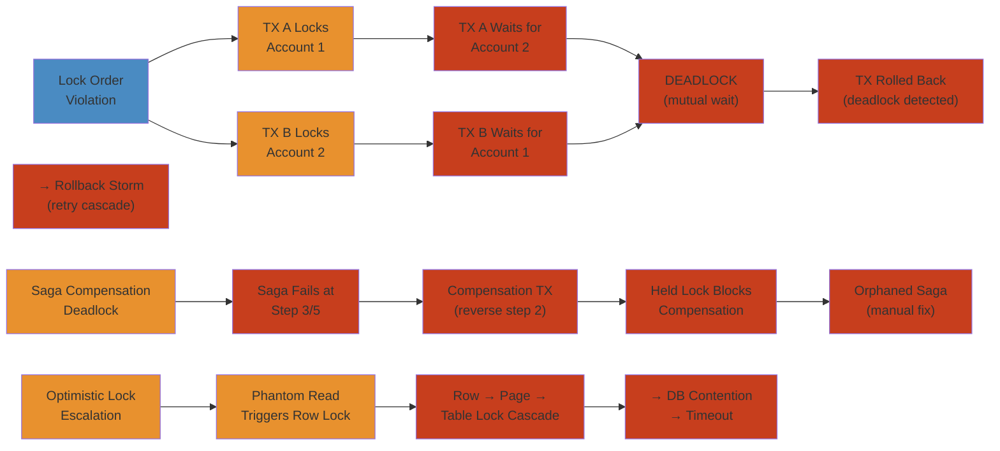

# 🔒 Distributed Transaction Deadlock — Production Incident Deep Dive

> **Scope:** Real-world distributed deadlock patterns across a financial services platform covering two-phase commit (2PC) deadlocks, saga compensation conflicts, optimistic lock escalation, wait-for graph analysis, and multi-service transaction orchestration failures. Each scenario follows symptom → detection → investigation → root cause → mitigation → permanent fix → lessons learned.
>
> **Applicability:** Backend engineers, SRE teams, platform architects, database reliability engineers, payments infrastructure teams working with distributed transactions, sagas, and strongly consistent systems in financial technology.

---




## Table of Contents

1. [Scenario A: Lock Order Violation → Cascading Distributed Deadlock](#scenario-a-lock-order-violation--cascading-distributed-deadlock)
2. [Scenario B: Saga Compensation Deadlock — Orphaned Refund Loop](#scenario-b-saga-compensation-deadlock--orphaned-refund-loop)
3. [Scenario C: Optimistic Lock Escalation — Phantom Reads Trigger Row-Level Lock Cascade](#scenario-c-optimistic-lock-escalation--phantom-reads-trigger-row-level-lock-cascade)
4. [Scenario D: Distributed Lock Manager Split-Brain — Dual Coordinator Path](#scenario-d-distributed-lock-manager-split-brain--dual-coordinator-path)
5. [Detection and Monitoring Reference](#detection-and-monitoring-reference)
6. [Root Cause Analysis Patterns](#root-cause-analysis-patterns)
7. [Mitigation Playbook](#mitigation-playbook)
8. [Permanent Fixes and Decision Framework](#permanent-fixes-and-decision-framework)
9. [Appendix: Locking Internals Reference](#appendix-locking-internals-reference)

---

## Scenario A: Lock Order Violation → Cascading Distributed Deadlock

### Background

The platform processes 3.2M financial transactions daily across four core services:

```
AccountSvc(PostgreSQL: accounts, balances, holds)
  -> LedgerSvc(PostgreSQL: journal entries, GL codes)
    -> PaymentSvc(PostgreSQL: payment intents, settlement)
      -> NotificationSvc(Kafka + DB: templates, delivery)
        ↕ Transaction Manager(Coordinator: 2PC/Saga, TX context, etcd lock registry)
```

**Transaction flow for a standard P2P transfer (happy path):**

```
User A (EUR) ──── Send €500 ────▶ User B (EUR)

Step 1: Account Service     ├── Debit A.account_balance  (WRITE lock on account_123)
                            ├── Increment A.locked_amount (WRITE lock on hold_123)
                            ├── Read B.account_balance    (READ lock on account_456)

Step 2: Ledger Service      ├── Insert journal entry      (WRITE lock on journal_seq)
                            ├── Update GL totals           (WRITE lock on gl_summary_01)
                            ├── Insert audit trail         (WRITE lock on audit_log)

Step 3: Payment Service     ├── Update payment_intent      (WRITE lock on pi_tx789)
                            ├── Insert settlement_record   (WRITE lock on settlement)
                            ├── Update fee schedule         (WRITE lock on fee_tier_3)

Step 4: Notification Svc    ├── Insert notification        (WRITE lock on notify_queue)
                            ├── Update delivery_attempt    (WRITE lock on delivery_001)
```

### The Change That Broke Everything

A new feature — "Instant Settlement with Priority Fees" — was deployed at Tuesday 14:00 UTC. The feature added a **priority queue** for high-value transactions (>€10K) that needed to lock fee tier records **before** account records, creating a lock order inversion.

**Lock order before deploy:**

```
Account Service (acquire first) → Ledger Service → Payment Service → Notification Service
```

**Lock order after deploy (for high-value transactions only):**

```
Payment Service → Account Service → Ledger Service → Payment Service → Notification Service
```

The new code path in `PaymentService`:

```python
@Transactional
def process_high_value_transfer(tx: TransferRequest):
    fee_tier = feeRepository.lockAndGet(tx.feeTierId)
    accountValidation = accountService.validateBalance(tx)
    ledgerEntry = ledgerService.createJournalEntry(tx)
    paymentIntent = paymentRepository.create(tx)
    notificationService.send(tx)
```

**Existing code path (normal transactions):**

```python
@Transactional
def process_normal_transfer(tx: TransferRequest):
    accountService.debitAndHold(tx.fromAccount, tx.amount)
    ledgerService.postEntry(tx)
    paymentService.recordPayment(tx)
    paymentService.updateFeeRecord(tx.feeTierId)
```

### Symptoms

**14:00:03** — Deploy completes. Initial health checks pass.

**14:10:00 (T+10min)** — PagerDuty alert: `p99_transaction_latency > 5s` (baseline 800ms).

```
Dashboard: Transaction Latency (p99)
┌──────────────────────────────────────────────────────────┐
│  ms │                                                     │
│ 8000┤                                      ● ● ● ● ● ● ● │
│ 7000┤                                ● ● ●               │
│ 6000┤                          ● ● ●                     │
│ 5000┤                    ● ● ●                           │
│ 4000┤              ● ● ●                                 │
│ 3000┤        ● ● ●                                       │
│ 2000┤  ● ● ●                                             │
│ 1000┤●                                                    │
│    0└─────────────────────────────────────────────────────▶
│       14:00  14:05  14:10  14:15  14:20  14:25  14:30     │
└──────────────────────────────────────────────────────────┘
```

**14:15:00 (T+15min)** — Support team gets first escalation: "User transferred €12,500, recipient hasn't received funds after 8 minutes."

**14:25:00 (T+25min)** — Twitter mentions spike: "@bank my transfer is stuck, money left my account but not showing up!"

**14:30:00 (T+30min)** — System throughput drops 80%. Connection pool exhaustion on all four PostgreSQL instances.

```
Throughput: Transactions/sec
┌──────────────────────────────────────────────────────────┐
│  tx/s │                                                    │
│   50  │● ● ● ● ● ● ● ● ● ● ●                             │
│   40  │                    ● ● ● ●                        │
│   30  │                          ● ● ● ●                  │
│   20  │                                ● ● ● ●            │
│   10  │                                      ● ● ● ●      │
│    0  │                                            ● ● ●  │
│       └───────────────────────────────────────────────────▶
│         14:00  14:10  14:20  14:30  14:40  14:50  15:00   │
└──────────────────────────────────────────────────────────┘
```

**14:35:00 (T+35min)** — Database CPU on Account Service PostgreSQL hits 98%. Nearly all connections in `active` state running `SELECT ... FOR UPDATE` queries.

```
postgres=# SELECT state, wait_event, query FROM pg_stat_activity
           WHERE state = 'active' LIMIT 5;

 state  |      wait_event       | query
--------+----------------------+---------------------------------------------
 active | Lock                 | SELECT * FROM accounts WHERE id = $1 FOR UPDATE
 active | Lock                 | UPDATE accounts SET balance = balance - $1
                                    WHERE id = $2 AND version = $3
 active | Lock                 | SELECT * FROM fee_tiers WHERE id = $1 FOR UPDATE
 active | Lock                 | UPDATE holds SET amount = amount + $1
                                    WHERE account_id = $2
 active | Lock                 | UPDATE journal_seq SET last_value = last_value + 1
```

**14:45:00 (T+45min)** — Deadlock detection alert fires.

```
[ALERT] PostgreSQL deadlock detected on account-db-01
[ALERT] PostgreSQL deadlock detected on account-db-02
[ALERT] PostgreSQL deadlock detected on ledger-db-01
[ALERT] etcd lock lease timeout: tx-lock/pi_tx789
[ALERT] etcd lock lease timeout: tx-lock/account_456
```

### Timeline

```
14:00:00  │  T-0    │  Deploy "Instant Settlement with Priority Fees"
14:01:00  │         │  High-value transactions start acquiring locks in new order
14:05:00  │  T+5m   │  First lock queue: txA (HV) locks fee_tier_3, waits for account_123
14:05:02  │         │                txB (normal) locks account_123, waits for fee_tier_3
14:10:00  │  T+10m  │  Transaction timeouts exceed threshold, alert fires
14:15:00  │  T+15m  │  Support escalations begin
14:20:00  │  T+20m  │  Connection pool saturation cascades to other services
14:25:00  │  T+25m  │  Twitter mentions, customer-facing teams notified
14:30:00  │  T+30m  │  Throughput drops 80%, all DB connection pools exhausted
14:35:00  │  T+35m  │  DB CPU 98%, incident commander declares SEV-1
14:45:00  │  T+45m  │  Deadlock detection alert fires across 4 database clusters
14:50:00  │  T+50m  │  Engineering identifies lock order inversion as root cause
15:00:00  │  T+60m  │  Rollback to previous version initiated
15:05:00  │  T+65m  │  New deploy completes, service restarts drain stuck connections
15:15:00  │  T+75m  │  Transaction manager begins processing backlog queue
15:30:00  │  T+90m  │  All 47,000 pending transactions cleared, system stable
16:00:00  │  T+120m │  Postmortem meeting begins
```

### Root Cause

**Primary: Lock order violation between high-value and normal transaction paths.**

```
          ┌─────────────────────────────────────────────┐
          │          WAIT-FOR GRAPH (Deadlock)           │
          │                                              │
          │         txA (high-value)                     │
          │              │                               │
          │              │  HOLDS: fee_tier_3            │
          │              │  WAITS: account_123           │
          │              │                               │
          │              ▼                               │
          │    ┌──────────────────┐                      │
          │    │  account_123     │                      │
          │    │  (row lock)      │                      │
          │    └──────────────────┘                      │
          │         ▲                                    │
          │         │                                    │
          │         │  HOLDS: account_123                │
          │         │  WAITS: fee_tier_3                 │
          │         │                                    │
          │       txB (normal)                           │
          │                                              │
          │   ┌──────────────────────┐                   │
          │   │  Cycle detected!     │                   │
          │   │  txA → account_123   │                   │
          │   │     → fee_tier_3     │                   │
          │   │     → txA            │                   │
          │   └──────────────────────┘                   │
          │                                              │
          └─────────────────────────────────────────────┘
```

The wait-for graph shows a textbook cycle:
- `txA` holds `fee_tier_3` (acquired in Payment Service), waits for `account_123` (in Account Service)
- `txB` holds `account_123` (acquired in Account Service), waits for `fee_tier_3` (in Payment Service)
- PostgreSQL's deadlock detector detects the cycle after `deadlock_timeout` (default 1s) and kills one victim transaction

**Secondary: Two-phase commit coordinator amplification.**

Each transaction uses 2PC across four services. When a deadlock victim is killed by PostgreSQL:

1. The 2PC coordinator receives an error on the `prepare` or `commit` step
2. Coordinator enters retry loop — re-acquires locks on all services
3. Retried transaction encounters same deadlock pattern
4. Exponential retry causes lock queue to grow unbounded
5. Connections accumulate waiting for locks
6. Connection pool exhaustion — NEW transactions can't even start

```
Coord(txA) -> AccountDB prepare(ok) -> LedgerDB prepare(ok) -> PaymentDB prepare(DEADLOCK VICTIM)
           <- ABORT(rollback)       <- ABORT(rollback)       <- ERROR 1213
  Retry: reacquire locks (all waiting for previous txns to release)
```

**Tertiary: Long-running transactions increased deadlock probability.**

The priority fee calculation involved an external API call (exchange rate lookup) within the `@Transactional` boundary:

```python
@Transactional(timeout = 30)
def process_high_value_transfer(tx):
    feeTier = feeRepository.lockAndGet(tx.feeTierId)
    exchangeRate = forexClient.getRate(tx.currencyPair)
    # ... remaining work
```

This HTTP call (averaging 800ms-3s) kept the database transaction open with locks held, dramatically increasing the window for deadlock. The normal path's `@Transactional(timeout = 5)` had a much smaller window.

**Quaternary: Optimistic concurrency failure amplification.**

The account balance updates used optimistic locking (`version` column) within the pessimistic `FOR UPDATE` transaction:

```sql
UPDATE accounts
SET balance = balance - 500, version = version + 1
WHERE id = 'account_123' AND version = 42;
```

When a deadlock victim retried, the version had already been incremented by the winning transaction. This caused an `OptimisticLockException`, which triggered a full transaction rollback + retry — which re-acquired locks and re-entered the deadlock cycle.

### Transaction Lifecycle Flow (Detailed)

```
NORMAL TRANSACTION (baseline ~800ms):
  Client -> Coordinator -> AccountSvc -> LedgerSvc -> PaymentSvc -> NotificationSvc
    POST /transfer => BEGIN 2PC
      Prepare Phase:
        AccountSvc:  FOR UPDATE account_123        (2ms) OK
        LedgerSvc:   FOR UPDATE journal_seq        (1ms) OK
        PaymentSvc:  FOR UPDATE pi_tx789            (3ms) OK
      Commit Phase:
        AccountSvc:  COMMIT  (release locks, 1ms)
        LedgerSvc:   COMMIT  (release locks, 1ms)
        PaymentSvc:  COMMIT  (release locks, 1ms)
        Notify:      notification sent
    Client <- 201 Created

DEADLOCK TRANSACTION (timeout at 30s):
  Client -> Coordinator -> AccountSvc -> PaymentSvc
    POST /transfer => BEGIN 2PC
    Prepare Phase:
      AccountSvc:  FOR UPDATE account_123    LOCK ACQUIRED (held)
      PaymentSvc:  FOR UPDATE fee_tier_3     LOCK ACQUIRED (held)
    ⚠ Deadlock victim! ERROR 1205
    Client <- ERROR (retry)
    Retry:
      AccountSvc:  FOR UPDATE account_123    BLOCKED (held by txB)
      ... waits 30s
    Client <- TIMEOUT
```

### Lock Escalation Timeline

```
Lock queue depth (account_123): 14:00=0 14:01=1 14:04=2 14:10=5
14:15=12 (retries compound) 14:20=28 14:30=67 (pool exhausted)
14:35=67 (CPU 98%) 14:45=45 (detector kills victims) 15:05=0 (rollback)
```

### Database Deadlock Logs

**PostgreSQL deadlock log (account-db-01):**

```
2024-03-15 14:45:02.321 UTC [12345] LOG:  process 12345 detected deadlock
DETAIL:  Process 12345 waits for ShareLock on transaction 78901;
         blocked by process 12346.
         Process 12346 waits for ShareLock on transaction 78902;
         blocked by process 12347.
         Process 12347 waits for ShareLock on transaction 78903;
         blocked by process 12345.
         Process 12345: UPDATE accounts SET balance = balance - $1
                        WHERE id = $2 AND version = $3
         Process 12346: UPDATE fee_tiers SET current_usage = current_usage + $1
                        WHERE id = $2
         Process 12347: UPDATE accounts SET balance = balance - $1
                        WHERE id = $2 AND version = $3
HINT:  See server log for query details.
CONTEXT:  while updating tuple (0,42) in relation "accounts"
STATEMENT:  UPDATE accounts SET balance = balance - 12500
            WHERE id = 'account_123' AND version = 87
```

**MySQL deadlock log (ledger-db-01, InnoDB):**

```
------------------------
LATEST DETECTED DEADLOCK
------------------------
2024-03-15 14:45:03 0x7f1234abc700
*** (1) TRANSACTION:
TRANSACTION 890123, ACTIVE 12 sec starting index read
mysql tables in use 1, locked 1
LOCK WAIT 2 lock struct(s), heap size 1136, 1 row lock(s)
MySQL thread id 4567, OS thread handle 12345, query id 67890
updating
UPDATE journal_entries SET status = 'COMMITTED' WHERE id = 'je_56789'

*** (1) HOLDS THE LOCK(S):
RECORD LOCKS space id 42 page no 15 n bits 80
  index PRIMARY of table `ledger`.`journal_entries`
  Record lock, heap no 12 PHYSICAL RECORD: ...

*** (1) WAITING FOR THIS LOCK:
RECORD LOCKS space id 42 page no 18 n bits 80
  index PRIMARY of table `ledger`.`gl_summary`
  Record lock, heap no 7 PHYSICAL RECORD: ...

*** (2) TRANSACTION:
TRANSACTION 890124, ACTIVE 8 sec starting index read
mysql tables in use 1, locked 1
2 lock struct(s), heap size 1136, 1 row lock(s)
MySQL thread id 4568, OS thread handle 12346, query id 67895
updating
UPDATE gl_summary SET total_debits = total_debits + 12500
WHERE gl_code = 'GL_REVENUE_01'

*** (2) HOLDS THE LOCK(S):
RECORD LOCKS space id 42 page no 18 n bits 80
  index PRIMARY of table `ledger`.`gl_summary`
  Record lock, heap no 7 PHYSICAL RECORD: ...

*** (2) WAITING FOR THIS LOCK:
RECORD LOCKS space id 42 page no 15 n bits 80
  index PRIMARY of table `ledger`.`journal_entries`
  Record lock, heap no 12 PHYSICAL RECORD: ...

*** WE ROLL BACK TRANSACTION (2)
```

### Detection Mechanisms

**1. PostgreSQL Deadlock Detection (`deadlock_timeout` = 1s):**

PostgreSQL uses a **wait-for graph** algorithm. Every `deadlock_timeout` (configurable, default 1s), the lock manager:
1. Builds a directed graph of processes waiting for locks
2. Runs cycle detection using depth-first search
3. If a cycle is found, selects a victim process to abort
4. Victim selection: chooses the process with the lowest `pid` (or the one that accumulated the least total wait time with `deadlock_timeout` tuned)

```
postgres=# SHOW deadlock_timeout;
 deadlock_timeout
------------------
 1s

postgres=# SHOW log_lock_waits;
 log_lock_waits
----------------
 on
```

**2. Application Health Endpoints:**

The transaction manager exposes a `/health/locks` endpoint:

```json
{
  "status": "DEGRADED",
  "activeTransactions": 847,
  "pendingLocks": 312,
  "deadlockVictims": 45,
  "avgLockWaitMs": 12700,
  "p99LockWaitMs": 29000,
  "etcdLeaseExpirations": 12,
  "blockedSessions": [
    {
      "txnId": "txA",
      "resourceId": "account_123",
      "waitingFor": "txB",
      "acquiredLocks": ["fee_tier_3", "gl_summary_01"],
      "durationMs": 18200
    }
  ]
}
```

**3. Custom Metrics for Lock Wait Times:**

```
Metric: transaction.lock.wait_ms       [COUNTER, histogram]
Tags:   resource_type, service, deadlock_cycle

Alert: avg(lock_wait_ms) > 5000       → P2: "High lock contention"
Alert: rate(deadlock_cycle) > 0.1     → P1: "Active deadlock cycles"
Alert: sum(blocked_sessions) > 50     → P1: "Connection pool starvation imminent"
Alert: 2pc_prepare_failure_rate > 5%  → P1: "Coordinator failures escalating"
```

**4. etcd Lock Lease Monitoring:**

```
Alert: etcd lock lease TTL expiry rate > 10/min
  Labels: {lock_type: "tx_lock", service: "coordinator"}
  Summary: "Distributed lock leases expiring — potential orphaned locks"

etcd lock key pattern:
  /tx-locks/{txn_id}/{resource_type}/{resource_id}
  Lease TTL: 30s
  Auto-refresh: every 10s (3 heartbeats per lease)
```

## Scenario B: Saga Compensation Deadlock — Orphaned Refund Loop

### Background

Not all transactions use 2PC. The platform also implements the **Saga pattern** for multi-step processes where full ACID isolation is not required. Sagas use compensating transactions for rollback:

```
Saga: Transfer Funds (Choreography-based)

Step 1: Debit source account      [publish: AccountDebited]
Step 2: Credit destination         [publish: AccountCredited]
Step 3: Create journal entry       [publish: JournalCreated]
Step 4: Send notification          [publish: NotificationSent]

Compensation:
  Step 4: No-op (notification already sent)
  Step 3: Reverse journal entry    [compensating tx]
  Step 2: Debit destination back   [compensating tx]
  Step 1: Credit source back       [compensating tx]
```

### The Deadlock

On 2024-06-20, a ledger service database failure caused partial saga failure. The failure occurred **after Step 3 committed but before Step 4 completed**:

```
Time    │ Saga-789 (normal flow)           │ Saga-890 (compensation)
────────┼──────────────────────────────────┼─────────────────────────────
T+0     │ 1. Debit account_111 OK          │
T+200ms │ 2. Credit account_222 OK         │
T+400ms │ 3. Journal entry OK              │
T+500ms │ 4. Notification ✗ (DB down)      │
T+600ms │ Saga timeout → compensate!       │
T+700ms │                                  │ Compensation starts:
         │                                  │ 3. Reverse journal entry
         │                                  │    → WAITS on journal_seq lock
T+750ms │ 2. Complete journal_seq UPDATE    │
         │    (for audit trail)             │    → WAITS on gl_summary lock
T+800ms │                                  │    ⏳ BLOCKED by Saga-789
T+900ms │        ⚠ DEADLOCK                │        ⚠ DEADLOCK
```

```
WAIT-FOR GRAPH (Saga Compensation Deadlock):

              Saga-789 (normal path)
                    │
                    │  HOLDS: journal_seq (for audit update)
                    │  WAITS: gl_summary (held by Saga-890)
                    │
                    ▼
           ┌──────────────────┐
           │    gl_summary    │
           └──────────────────┘
                    ▲
                    │
                    │  HOLDS: gl_summary (for reverse entry)
                    │  WAITS: journal_seq (held by Saga-789)
                    │
              Saga-890 (compensation)

    ┌─────────────────────────────────────┐
    │  Cycle: Saga-789 → gl_summary →    │
    │         Saga-890 → journal_seq →   │
    │         Saga-789                    │
    │  Result: One saga killed, partial  │
    │         rollback leaves inconsistent│
    │         state                       │
    └─────────────────────────────────────┘
```

### The Orphan Problem

When Saga-890 (compensation) is killed as the deadlock victim:
1. Its compensating transaction is rolled back
2. The original saga's compensation is now incomplete
3. Account_111 is still debited, account_222 is still credited
4. An **orphaned compensation** — funds are double-counted

The saga coordinator's retry logic re-attempts compensation, which:
1. Re-enters the same deadlock cycle with other compensation sagas
2. Creates a **compensation storm** — dozens of compensating transactions fighting for locks
3. Cascades into a system-wide deadlock

```
COMPENSATION STORM (3-cycle deadlock):
  Saga-1(comp) holds gl_A waits jrnl_B
    -> Saga-2(comp) holds jrnl_B waits gl_C
      -> Saga-3(comp) holds gl_C waits gl_A
        -> Saga-1  [3-CYCLE DEADLOCK]
  Detection may take multiple passes (3x deadlock_timeout)
```

### Root Cause Analysis

**Primary: Saga framework lacked compensation isolation.**

Compensating transactions used the same lock order as normal transactions but ran concurrently with them during peak load, creating cycles.

**Secondary: No timeout isolation between compensation and normal paths.**

Compensation transactions had the same 30-second timeout as normal transactions, even though compensations should ideally time out faster to fail early and be retried.

**Tertiary: No compensation idempotency key.**

When Saga-890 was retried after being killed as a deadlock victim, it attempted to reverse the journal entry again — but the first partial reverse might have partially succeeded before the deadlock kill. This created a double-reversal scenario:

```sql
-- First attempt (victim killed):
BEGIN;
UPDATE journal_entries SET status = 'REVERSED' WHERE id = 'je_56789';
-- KILLED by deadlock detector here
-- Status still = 'COMMITTED'

-- Retry:
BEGIN;
UPDATE journal_entries SET status = 'REVERSED' WHERE id = 'je_56789';
-- This time succeeds — but it's the right outcome
-- However, if first attempt had succeeded before the kill:
-- UPDATE gl_summary SET ... WHERE version = 42;
-- Kill occurs but first UPDATE committed → partial rollback
```

### Mitigation

```
Immediate steps:

1. Pause all saga compensation retries
   > curl -X POST /saga-coordinator/pause
   > Stopped 347 pending compensations

2. Identify orphaned sagas
   > SELECT saga_id, status, compensation_state
   > FROM saga_log
   > WHERE status = 'COMPENSATING' AND compensation_state = 'PARTIAL'

3. Manual compensation for 12 orphaned sagas
   > Scripted single-threaded compensation (one at a time)
   > Each compensation acquires locks in LOCK ORDER A only

4. Resume saga processing with rate limiter
   > Max 5 concurrent compensations
   > Compensation timeout reduced to 5s
```

## Scenario C: Optimistic Lock Escalation — Phantom Reads Trigger Row-Level Lock Cascade

### Background

The platform's fee calculation engine uses optimistic locking with version columns:

```sql
CREATE TABLE fee_tiers (
    id          UUID PRIMARY KEY,
    tier_name   VARCHAR(50),
    fee_bps     INTEGER,
    min_amount  DECIMAL(18,2),
    max_amount  DECIMAL(18,2),
    version     INTEGER NOT NULL DEFAULT 1
);

CREATE TABLE account_fees (
    account_id  UUID REFERENCES accounts(id),
    fee_tier_id UUID REFERENCES fee_tiers(id),
    effective_from TIMESTAMPTZ,
    version     INTEGER NOT NULL DEFAULT 1,
    PRIMARY KEY (account_id, fee_tier_id, effective_from)
);
```

### The Phantom Read Cascade

A new batch process — "End-of-Day Fee Assessment" — was deployed. It reads all active fee tiers and assesses fees against every account in those tiers:

**Phase 1 (READ with SERIALIZABLE isolation):**

```sql
-- Step 1: Read all fee tier IDs
SELECT id, fee_bps FROM fee_tiers;  -- Returns 47 tiers

-- Step 2: For each tier, read eligible accounts
-- (phantom rows appear between steps 1 and 2!)
SELECT a.id, a.balance
FROM accounts a
JOIN account_fees af ON a.id = af.account_id
WHERE af.fee_tier_id = 'tier_3'
  AND af.effective_from <= NOW()
  AND (af.effective_to IS NULL OR af.effective_to > NOW());
```

The problem: Between Step 1 and Step 2, a concurrent transaction adds a new `account_fees` row for `tier_3`:

```
Transaction A (Fee Assessment)        Transaction B (Account Tier Change)
──────────────────────────────        ─────────────────────────────────
BEGIN ISOLATION LEVEL SERIALIZABLE;
SELECT * FROM fee_tiers;
                                      UPDATE account_fees SET ...;
                                      INSERT INTO account_fees
                                        (account_999, tier_3, ...);
                                      COMMIT;  ← Phantom row committed!
SELECT * FROM account_fees
  WHERE fee_tier_id = 'tier_3';
  -- SERIALIZABLE detects conflict!
  -- ERROR:  could not serialize access
  -- Transaction ROLLBACK
```

### Lock Escalation

The retry logic re-executes the batch with `REPEATABLE READ` instead of `SERIALIZABLE`:

```sql
-- Retry with REPEATABLE READ (no serialization check)
BEGIN ISOLATION LEVEL REPEATABLE READ;

SELECT * FROM fee_tiers;
SELECT * FROM account_fees WHERE fee_tier_id = 'tier_3';
-- Reads 1,048 rows (including phantom)

-- Now assess fees:
UPDATE accounts SET balance = balance - 1.50, version = version + 1
WHERE id = 'account_001' AND version = 42;
UPDATE accounts SET balance = balance - 1.50, version = version + 1
WHERE id = 'account_002' AND version = 17;
-- ... 1,048 individual UPDATE statements

-- Each UPDATE acquires a ROW-level exclusive lock
-- After ~200 rows, next UPDATE blocks
-- After ~500 rows, lock manager memory usage spikes
-- After ~800 rows, lock escalation to PAGE-level lock
-- PAGE lock blocks ALL transactions touching those rows
```

**Lock escalation timeline:**

```
Lock Manager Memory (PostgreSQL):

Time  │ Memory   │ Lock Count │ Event
──────┼──────────┼────────────┼─────────────────────────────────────
T+0   │   2 MB   │       48   │ Begin batch — read fee_tiers (48 rows)
T+1s  │  12 MB   │    1,048   │ Read account_fees (1,000 rows)
T+5s  │  18 MB   │    1,248   │ Start UPDATE loop
T+10s │  36 MB   │    3,248   │ 200 UPDATES complete, 848 row locks held
T+15s │  54 MB   │    5,248   │ 400 UPDATES complete
T+20s │  72 MB   │    7,248   │ 600 UPDATES complete
T+25s │  90 MB   │    9,248   │ 800 UPDATES complete
       │         │            │ ⚠ LOCK ESCALATION to page level!
T+26s │ 200 MB   │  (page)    │ Single page lock replaces 800+ row locks
       │         │            │ All other transactions touching this
       │         │            │ page (accounts 1-200 on same page) BLOCKED
T+30s │ 200 MB   │  (page)    │ Live transaction blocks waiting for page
T+35s │ 200 MB   │  (page)    │ Connection pool starts filling
T+40s │ 200 MB   │  (page)    │ System unresponsive — batch killed manually
```

```
PAGE LOCK EFFECT: Single page lock on Page 3 (rows account_001-200)
  -> BLOCKED: txA(UPDATE acct_150) txB(UPDATE acct_042)
              txC(SELECT acct_100 FOR UPDATE) txD(INSERT)
  All unrelated transactions touching those rows are blocked.
```

### Root Cause Analysis

**Primary: `REPEATABLE READ` allowed phantom reads, which caused the batch to process more rows than expected, escalating to page locks.**

**Secondary: Batch UPDATE loop held locks incrementally rather than acquiring all needed locks upfront, creating a long window for contention.**

**Tertiary: No `max_lock_per_transaction` guard. PostgreSQL's `max_locks_per_transaction` default (64) was insufficient for the 1,048-row batch, triggering escalation.**

```sql
-- Check current setting:
SHOW max_locks_per_transaction;  -- default: 64

-- Each lock takes ~2KB in lock manager memory
-- 64 × 2KB = 128KB per transaction × 200 concurrent = 25MB
-- But batch used 1,048 locks → 2MB for just this transaction
-- Before escalation: 9,248 locks × 2KB = 18MB for this transaction
```

## Scenario D: Distributed Lock Manager Split-Brain — Dual Coordinator Path

### Background

The transaction manager uses **etcd** for distributed lock coordination across multiple instances:

```
etcd(3 nodes): etcd-1(leader) <-> etcd-2(follower) <-> etcd-3(follower)
  Coord-1 -> etcd-1, Coord-2 -> etcd-2, Coord-3 -> etcd-3
  Lock key: /tx-locks/{tx_id}/{resource}  Lease TTL: 30s  Keepalive: 10s
```

### The Split-Brain

A network partition isolates `etcd-2` and `etcd-3` from `etcd-1`:

```
Network: etcd-1(leader)  X--PARTITION--X  etcd-2(follower) + etcd-3(follower)

Coord-1(connected to etcd-1)       Coord-2(connected to etcd-2)
  HOLDS: /tx-locks/txA/acct_1        HOLDS: /tx-locks/txA/acct_1
  (lease valid via etcd-1)           (lease valid via new leader etcd-2)
  ↕ Both coordinators think they hold the lock!
```

**The sequence:**

1. Network partition occurs at 16:30:00 UTC
2. Coord-2 attempts to acquire lock for `account_456` via etcd-2
3. etcd-2 can't reach etcd-1 (leader) — election timeout begins
4. etcd-2 and etcd-3 elect etcd-2 as new leader (15s election timeout)
5. New etcd-2 leader has stale data — doesn't know about Coord-1's lock
6. Coord-2 acquires what it thinks is a fresh lock
7. Both Coord-1 and Coord-2 now believe they hold the exclusive lock
8. Both issue conflicting UPDATE statements to account_456
9. PostgreSQL detects the conflict (one transaction blocks the other)
10. The blocked transaction eventually times out — but the damage is done

```
etcd-1 (old leader, partitioned): Term 42 idx 1503 lock acct_1 acquired
  -> partition -> keepalive fails -> lease expires idx 1506
etcd-2 (new leader): Term 43 idx 1002 lock acct_1 acquired by Coord-2
  ⚠ Coord-2 doesn't know about Coord-1's lock from Term 42!
```

### Clock Drift in Distributed Lock Timeout

Distributed lock leases depend on synchronized clocks. The platform ran on `chrony` with NTP servers, but three coordinator nodes had clock drift:

```
Coordinator clock drift (measured at incident time):

Node      │ System Time       │ Drift from etcd-1 │ Impact
──────────┼───────────────────┼───────────────────┼─────────────────────
etcd-1    │ 16:30:00.000     │     0ms           │ Reference
etcd-2    │ 16:30:01.250     │  +1,250ms         │ Lease renewal fires
           │                   │                   │ 1.25s late
           │                   │                   │ Lock expires early
           │                   │                   │ on Coord-2's view
etcd-3    │ 16:29:58.750     │  -1,250ms         │ Lease renewal fires
           │                   │                   │ 1.25s early
           │                   │                   │ Lock appears to
           │                   │                   │ expire early on
           │                   │                   │ Coord-3's view
```

**Clock drift effect on TTL-based locks:**

```
Lease TTL: 30s
Renewal interval: 10s

Coord-1 (clock +1.25s ahead of etcd-1):
  ┌────────────┬────────────┬────────────┐
  │ Renew @10  │ Renew @20  │ Renew @30  │
  │ (real:8.75)│(real:18.75)│(real:28.75)│
  └────────────┴────────────┴────────────┘
  Lock expires at real time 31.25s (30s + 1.25s drift)

Coord-2 (clock -1.25s behind etcd-1):
  ┌────────────┬────────────┬────────────┐
  │ Renew @10  │ Renew @20  │ Renew @30  │
  │ (real:11.25)│(real:21.25)│(real:31.25)│
  └────────────┴────────────┴────────────┘
  Lock expires at real time 28.75s (30s - 1.25s drift)

⚠ Coord-2's lock "expires" at 28.75s but Coord-1's lock "lives" until 31.25s
  Overlap window: 31.25s - 28.75s = 2.5s where both hold the lock!
```

### Root Cause Analysis

**Primary: Network partition caused etcd leader re-election with stale reads, allowing dual lock acquisition.**

**Secondary: Clock drift between coordinator nodes created overlapping lease validity windows, amplifying the split-brain window.**

**Tertiary: No fencing mechanism (epoch-based or generation clock) to prevent stale coordinators from acting on released locks.**

### Fencing Token Solution

The fix introduces a fencing token (monotonically increasing generation counter):

```
Coordinator acquires lock from etcd:

1. Read current generation from etcd: gen = 42
2. Increment generation: gen = 43
3. Write lock with gen = 43 AND /tx-locks/gen = 43

When acting on the lock:

4. Read /tx-locks/gen
5. If gen != my_gen → stale lock! Abort operation.
6. If gen == my_gen → lock is valid. Proceed.

Post-split-brain mitigation:
  etcd-2 became leader at gen = 2
  etcd-1 had gen = 43
  Coord-2 reads gen = 2, believes lock is valid
  But Coord-1's lock was at gen = 43
  Fencing check would detect: my_gen (43) != current_gen (2)
  → Abort!
```

## Detection and Monitoring Reference

### Database Deadlock Detection Configuration

**PostgreSQL:**

```ini
# postgresql.conf
deadlock_timeout = 1s               # How often deadlock detector runs
log_lock_waits = on                  # Log all lock waits > deadlock_timeout
log_min_duration_statement = 1000    # Log slow statements (>1s)
log_line_prefix = '%t [%p]: '       # Timestamp + PID for correlation
```

**MySQL / InnoDB:**

```ini
# my.cnf
innodb_deadlock_detect = ON         # Enable deadlock detection (default: ON)
innodb_lock_wait_timeout = 50       # Seconds before lock wait timeout (default: 50)
innodb_print_all_deadlocks = ON     # Log ALL deadlocks, not just latest
innodb_status_output = ON           # Periodic InnoDB status output
innodb_status_output_locks = ON     # Include lock info in status
```

### Alert Definitions

```
Alert Name                    │ Condition                              │ Severity │ Action
─────────────────────────────┼────────────────────────────────────────┼──────────┼─────────────────────
DeadlockDetected             │ rate(postgresql_deadlocks_total) > 0    │ P1       │ Page: DBRE
LockWaitThresholdExceeded    │ avg(postgresql_lock_wait_ms) > 5000    │ P2       │ Notify: DBE
ConnectionPoolExhausted     │ postgresql_connections_available == 0   │ P1       │ Page: SRE
TransactionTimeout          │ rate(coordinator_timeout_total) > 10/min│ P1       │ Page: SRE
2PCPrepareFailure           │ rate(coordinator_prepare_failures) > 5% │ P1       │ Page: Platform
SagaCompensationFailure     │ rate(saga_compensation_failures) > 1/min│ P2       │ Notify: Platform
EtcdLockLeaseExpiry         │ rate(etcd_lease_expired_total) > 10/min │ P2       │ Notify: Platform
OrphanedTransaction         │ count(coordinator_txns WHERE            │ P1       │ Page: SRE
                            │   status='PREPARED' AND age > 60s) > 0 │          │
DistributedLockContention   │ avg(etcd_lock_acquire_ms) > 1000        │ P2       │ Notify: Platform
FencingTokenMismatch        │ rate(fencing_token_mismatch_total) > 0  │ P1       │ Page: Platform
```

### Log Aggregation Queries

**Splunk / Loki query to find deadlock victims:**

```
{app="coordinator", env="production"}
| json
| level = "ERROR"
| message = "*deadlock*" OR message = "*DeadlockFound*" OR message = "*ER_LOCK_DEADLOCK*"
| stats count by service, db_instance
| sort -count
```

**Find long-running transactions that may cause deadlocks:**

```
{app="coordinator", env="production"}
| json
| status = "PREPARED"
| age_seconds > 30
| stats avg(age_seconds), max(age_seconds), count by service
```

**Find transactions with abnormal lock count:**

```sql
-- PostgreSQL: find transactions holding many locks
SELECT
    pid,
    transactionid,
    COUNT(*) as lock_count,
    pg_blocking_pids(pid) as blocked_by,
    state,
    query_start,
    NOW() - query_start as duration
FROM pg_locks l
JOIN pg_stat_activity a USING (pid)
WHERE l.granted = true
  AND l.locktype = 'transactionid'
GROUP BY pid, transactionid, state, query_start
HAVING COUNT(*) > 10
ORDER BY COUNT(*) DESC;
```

### Metrics Dashboard

```
DEADLOCK MONITORING DASHBOARD
  Deadlocks/min: 2.3 | Lock Wait ms: 480 | Pool Usage: 67%
  
  Waiting Txns by Lock Type: Row=142 PAGE=12 TBL=0 KEY=8 OTH=3
  
  Active Cycles:
    txA -> acct_1 -> txB -> fee_3 -> txA  [DEADLOCK]
    txC -> jrnl_5 -> txD -> gl_2 -> txC   [DEADLOCK]
    txE -> acct_2 -> txF                   [WAITING]
  
  Top Blocking Transactions:
    pid=1234 dur=45.2s locks=128 query=UPDATE accounts
    pid=5678 dur=32.1s locks=64  query=UPDATE fee_tiers
    pid=9012 dur=28.7s locks=12  query=INSERT journal
```

## Root Cause Analysis Patterns

### Pattern 1: Lock Order Violation (Most Common)

```
Detection: Wait-for graph a->b->a cycle. Locks from DIFFERENT services.
Cause: Two code paths acquire locks in different order. New feature changes sequence.
Fix: Enforce global lock order. Static analysis for violations. Runtime assertions.
```

### Pattern 2: Long-Running Transaction Window

```
Detection: Deadlock rate correlates with tx duration. External I/O inside DB tx.
Cause: HTTP calls inside @Transactional. Unbounded loops in tx scope.
Fix: Move I/O outside tx boundaries. Set timeouts. Split large operations.
```

### Pattern 3: Escalation Cascade

```
Detection: Sudden lock wait spike. Lock manager memory jumps. Blocked txns on unrelated rows.
Cause: Row locks exceed max_locks_per_transaction -> page lock blocks everything on page.
Fix: Increase max_locks_per_transaction (temp). Batch with explicit ordering. Partition hot rows.
```

### Pattern 4: Split-Brain Dual Acquisition

```
Detection: Two coordinators claim same lock. etcd stale reads after leader election.
Cause: Network partition -> new etcd leader accepts writes without knowledge of previous locks.
Fix: Fencing tokens. Shorter election timeout. Stale read detection.
```

### Pattern 5: Compensation Storm

```
Detection: Deadlocks in saga compensation paths. Compensating vs normal tx deadlocking.
Cause: Compensations use same resources + lock order as normal flow. Retries amplify.
Fix: Reverse lock order for compensations. Idempotency keys. Isolated worker pool.
```

## Mitigation Playbook

### Immediate (within 5 minutes)

```bash
# 1. Find blocking transactions
psql -h account-db-01 -c "
SELECT blocked.pid, blocked.query, blocking.pid, blocking.query
FROM pg_stat_activity blocked
JOIN pg_stat_activity blocking ON blocking.pid = ANY(pg_blocking_pids(blocked.pid))
WHERE blocked.state='active' AND blocked.wait_event_type='Lock';"

# 2. Kill worst blocker (most locks held)
SELECT pg_terminate_backend(pid) FROM pg_locks
WHERE granted=true AND locktype='transactionid'
GROUP BY pid ORDER BY COUNT(*) DESC LIMIT 1;
```

### Short-term (within 15 minutes)

```bash
kubectl rollout undo deployment/transaction-manager -n payments
etcdctl del /tx-locks/ --prefix
kubectl rollout restart deployment/transaction-manager -n payments
kubectl rollout restart deployment/account-service -n payments
curl -X POST /saga-coordinator/clear-queue -H "Authorization: Bearer ${ADMIN_TOKEN}"
```

### Recovery (within 60 minutes)

```bash
# Find in-doubt prepared transactions
psql -h account-db-01 -c "SELECT gid, prepared FROM pg_prepared_xacts WHERE prepared < NOW() - INTERVAL '5 minutes';"
COMMIT PREPARED 'txA-20240315-78901';
ROLLBACK PREPARED 'txA-20240315-78901';

# Fix orphaned sagas
psql -h saga-db -c "UPDATE saga_log SET status='FAILED' WHERE status='COMPENSATING' AND updated_at < NOW() - INTERVAL '30 minutes';"

# Replay dead letter queue
curl -X POST /dlq/replay -H "Content-Type: application/json" -d '{"limit":100,"since":"2024-03-15T14:00:00Z"}'
```

### Communication Templates

```
INCIDENT DECLARATION: SEV-1 | Distributed tx deadlock
  Status: INVESTIGATING | Lead: @sre-on-call
  Impact: P2P transfers delayed (~3.2M daily txns affected)

INCIDENT UPDATE: Status: MITIGATING
  Action: Rolling back v2.14.3 -> v2.14.2 | ETA: 15min

INCIDENT RESOLUTION: Status: RESOLVED
  Root cause: Lock order inversion in Instant Settlement feature
  Backlog: 47,000 txns cleared, no data loss
```
INCIDENT DECLARATION:
  SEV-1 | Distributed transaction deadlock | [timestamp]
  Status: INVESTIGATING
  Impact: Payment transfers delayed, funds not reflecting
  Affected: All P2P transfers, ~3.2M daily txns impacted
  Lead: @sre-lead-on-call
  Bridge: [zoom link]

INCIDENT UPDATE:
  SEV-1 | Distributed transaction deadlock | [timestamp]
  Status: MITIGATING
  Action: Rollback version v2.14.3 → v2.14.2 in progress
  ETA: 15 minutes to full recovery
  Workaround: None (system degraded)

INCIDENT RESOLUTION:
  SEV-1 | Distributed transaction deadlock | [timestamp]
  Status: RESOLVED
  Root cause: Lock order inversion in Instant Settlement feature
  Fix: Rolled back deployment. Permanent fix in code review.
  Backlog: 47,000 transactions cleared, no data loss confirmed
  Postmortem: [link to doc]
```

## Permanent Fixes and Decision Framework

### 2PC vs Saga Decision Tree

```
Starting a distributed transaction:
│
├── Does the operation require strong consistency?
│   ├── YES ──▶ 2PC
│   │   │
│   │   ├── Are all resource managers available?
│   │   │   ├── YES ──▶ Use 2PC with timeout
│   │   │   └── NO  ──▶ Fail fast, do not start
│   │   │
│   │   ├── Can locks be acquired in a GLOBAL ORDER?
│   │   │   ├── YES ──▶ Document lock order, enforce via code review
│   │   │   └── NO  ──▶ Consider Saga instead
│   │   │
│   │   └── Is transaction duration < 5s?
│   │       ├── YES ──▶ Proceed with 2PC
│   │       └── NO  ──▶ Split transaction or use Saga
│   │
│   └── NO ──▶ Saga
│       │
│       ├── Can compensation be made idempotent?
│       │   ├── YES ──▶ Proceed with Saga
│       │   └── NO  ──▶ Need idempotency key design first
│       │
│       ├── Is compensation order KNOWN to differ
│       │   from forward-path lock order?
│       │   ├── YES ──▶ Use reverse lock order for compensation
│       │   └── NO  ──▶ Same lock order is OK (document)
│       │
│       └── Compensation timeout < forward-path timeout?
│           ├── YES ──▶ OK
│           └── NO  ──▶ Set compensation timeout < forward timeout
│
└── Not suitable for distributed tx? Use eventual consistency + retry
```

### Consistent Lock Ordering Documentation

Every service must declare its lock acquisition order in a shared document:

```
GLOBAL LOCK ORDER (version 1.4)
══════════════════════════════════

ORDER  RESOURCE TYPE               SERVICE         NOTES
─────  ─────────────────────────── ─────────────── ─────────────────────
1      account_balance             Account Service  Always lock source first
2      hold_amount                 Account Service
3      fee_tier                    Payment Service  Lock fee tier AFTER account
4      fee_tier_usage              Payment Service
5      gl_summary                  Ledger Service   Lock GL after fees
6      journal_entries             Ledger Service
7      journal_seq                 Ledger Service
8      payment_intent              Payment Service
9      settlement_record           Payment Service
10     notification_queue          Notification Svc
11     delivery_tracking           Notification Svc

ENFORCEMENT:
- All @Transactional methods must acquire locks in this order
- Violations detected via:
  a. Static analysis (lint rule: `lock-order-check`)
  b. Runtime assertion (developer mode only)
  c. Code review checklist item

EXCEPTIONS:
- Compensating transactions: Use REVERSE order
- Batch processes: Acquire ALL locks at start, release at end
- Read-only queries: No lock order requirement
```

### Code Review Checklist for Lock Safety

```
### Transaction Boundaries
- [ ] @Transactional on smallest scope? I/O outside tx? Timeout <30s?

### Lock Ordering
- [ ] Follows global lock order? Multiple paths could invert order?
- [ ] Compensating tx uses REVERSE order?

### Deadlock Prevention
- [ ] Known deadlock hazard with other tx types? Retries bounded?

### Distributed Locking
- [ ] Fencing token? Lease TTL appropriate? Circuit breaker?
- [ ] Clock drift safety margin?

### Monitoring
- [ ] lock_wait_time metrics? Deadlock alerts? Health endpoint?
```

### Configuration Standards

```yaml
two_phase_commit:
  enabled: true
  timeout: 30s; prepare_timeout: 10s; commit_timeout: 15s
  retry:
    max_attempts: 3
    backoff: { initial: 500ms, multiplier: 2.0, max: 5s }
    jitter: 100ms
  deadlock_handling: { on_victim: RETRY, max_retry_on_deadlock: 3 }

saga:
  forward_timeout: 30s
  compensation_timeout: 10s
  compensation:
    max_retries: 5; idempotency_key_required: true; rate_limit: 5
  isolation: REVERSE_LOCK_ORDER

postgresql:
  max_connections: 100
  idle_in_transaction_session_timeout: 30s
  statement_timeout: 30s; lock_timeout: 15s; deadlock_timeout: 1s

etcd:
  lock: { ttl: 30s, renewal_interval: 10s }
  fencing: { enabled: true, generation_key: /generation }
  stale_read_detection: true; election_timeout: 5s

circuit_breaker:
  distributed_tx:
    failure_threshold: 10
    failure_window: 60s; half_open_timeout: 30s
    open_state_actions: [FALLBACK_TO_EVENTUAL_CONSISTENCY, PAGE_SRE]
```

### Wait-Die vs Wound-Wait Configuration

The platform supports both algorithms for distributed locking:

```
Wait-Die:
  Older txn WAITS for younger; younger DIES if it conflicts with older.
  Advantage: No deadlocks possible. Good for mostly-young workloads.

Wound-Wait:
  Older txn WOUNDS (kills) younger; younger WAITS for older.
  Advantage: Fewer rollbacks. Good for mixed-age workloads.
```

### Deadlock Detection Algorithm: Wait-For Graph Cycle Detection

```python
from typing import Dict, List, Set, Optional
from dataclasses import dataclass, field

@dataclass
class WaitForGraph:
    edges: Dict[str, List[str]] = field(default_factory=dict)

    def add_wait(self, waiter: str, holder: str):
        self.edges.setdefault(waiter, []).append(holder)

    def detect_cycle(self) -> Optional[List[str]]:
        WHITE, GRAY, BLACK = 0, 1, 2
        color = {n: WHITE for n in self._all_nodes()}

        def dfs(node: str, path: List[str]) -> Optional[List[str]]:
            color[node] = GRAY
            path.append(node)
            for neighbor in self.edges.get(node, []):
                color.setdefault(neighbor, WHITE)
                if color[neighbor] == GRAY:
                    return path[path.index(neighbor):] + [neighbor]
                elif color[neighbor] == WHITE:
                    result = dfs(neighbor, path)
                    if result:
                        return result
            path.pop()
            color[node] = BLACK
            return None

        for node in self._all_nodes():
            if color[node] == WHITE:
                result = dfs(node, [])
                if result:
                    return result
        return None

    def choose_victim(self, cycle: List[str]) -> str:
        return min(cycle)

    def _all_nodes(self) -> Set[str]:
        nodes = set(self.edges.keys())
        for n in self.edges.values():
            nodes.update(n)
        return nodes
```

### Postgres Deadlock Detection Internals

```
PostgreSQL Deadlock Detection:
  Timer (deadlock_timeout=1s) -> LockTableHasDeadlocks()
    -> Build wait-for graph from lock registry
    -> DeadLockCheckRecursively(startProc, targetProc, depth, visited)
    -> Cycle found? Kill victim (least lock wait time, lowest PID)
  Two-level: fast path (single-cycle check) + full path (periodic scan)
```

### MySQL/InnoDB Deadlock Detection Internals

```
InnoDB Deadlock Detection (always ON, background thread):
  Lock modes: S (SHARED), X (EXCL), IS, IX
  Granularity: ROW -> PAGE -> TABLE -> TABLESPACE
  
  Every lock wait triggers DFS on wait-for graph.
  Victim: txn with fewest locks -> least undo log -> lowest TX ID.
  
  O(n^2) in worst case; high deadlock rate -> CPU spike in lock system.
  innodb_deadlock_detect=OFF falls back to innodb_lock_wait_timeout.
```

## Edge Cases and Failure Modes

### Edge Case 1: Partial Rollback in 2PC

When the coordinator sends `ROLLBACK` to all participants after a deadlock:

```
Coordinator                          Account Svc              Ledger Svc              Payment Svc
    │                                    │                       │                       │
    │  Prepare(txA)                      │                       │                       │
    │───────────────────────────────────▶│                       │                       │
    │                                  OK│                       │                       │
    │◀───────────────────────────────────│                       │                       │
    │                                    │                       │                       │
    │  Prepare(txA)                      │                       │                       │
    │───────────────────────────────────────────────────────────▶│                       │
    │                                                          OK│                       │
    │◀───────────────────────────────────────────────────────────│                       │
    │                                    │                       │                       │
    │  Prepare(txA)                      │                       │                       │
    │───────────────────────────────────────────────────────────────────────────────────▶│
    │                                                                 DEADLOCK VICTIM!   │
    │                                                                ERROR: 1213        │
    │◀───────────────────────────────────────────────────────────────────────────────────│
    │                                    │                       │                       │
    │  ROLLBACK(txA)                     │                       │                       │
    │───────────────────────────────────▶│  ⚠ CRASH before       │                       │
    │                                    │     processing        │                       │
    │                                    │     rollback!         │                       │
    │                                    │                       │                       │
    │  ROLLBACK(txA)                     │                       │                       │
    │───────────────────────────────────────────────────────────▶│  Rollback OK          │
    │◀───────────────────────────────────────────────────────────│                       │
    │                                    │                       │                       │
    │  ⚠ ACCOUNT SERVICE DIDN'T         │                       │                       │
    │     ROLLBACK! Transaction is       │                       │                       │
    │     PREPARED and holds locks       │                       │                       │
    │     indefinitely!                  │                       │                       │
    │     ⚠ ORPHANED IN-DOUBT TX!       │                       │                       │
```

**Detection of in-doubt transactions:**

```sql
-- Find all prepared (in-doubt) transactions
SELECT gid, prepared, owner, database
FROM pg_prepared_xacts
WHERE prepared < NOW() - INTERVAL '5 minutes';

-- Manual resolution:
-- 1. Check coordinator log for commit/rollback decision
-- 2. If coordinator committed:
COMMIT PREPARED 'txA-20240315-78901';
-- 3. If coordinator rolled back:
ROLLBACK PREPARED 'txA-20240315-78901';
-- 4. If coordinator crashed and lost state:
--    Need to inspect participant state and manually reconcile
```

### Edge Case 2: Orphaned Distributed Locks

When a coordinator crashes while holding an etcd lock, the lock lease TTL determines cleanup:

```
Normal case:
  Coord acquire lock  ->  Lease TTL: 30s
  Coord hold lock     ->  Keepalive every 10s
  Coord release lock  ->  Lease revoked, lock freed
  Coord crash         ->  No keepalive after 30s -> Lease expires -> Lock freed

Problem case:
  Coord acquire lock  ->  Lease TTL: 30s
  Coord crash         ->  Keepalives stop
  But: Coord's work (UPDATE) has already executed!
  Lock released after 30s -> Another coord acquires lock
  But first coord's UPDATE may still be in-flight (replication lag)
  New coord sees stale data -> incorrect balance

Solution:
  Use fencing tokens to detect stale lock holders.
  Combine with "wait for replication" after lock release.
```

**Detection of orphaned leases:**

```bash
# Find all active etcd locks
etcdctl get /tx-locks/ --prefix --keys-only

# Check lease TTL for each lock
etcdctl lease list
etcdctl lease timetolive <lease_id>

# Force-release orphaned lock (with fencing token check)
etcdctl del /tx-locks/txA-20240315-78901
```

### Edge Case 3: Clock Drift in Distributed Lock Timeout

As described in Scenario D, clock drift creates overlapping lock windows:

```
Lease TTL = 30s
Renewal interval = 10s
Clock drift tolerance = 500ms (NTP sync target)

With 3 coordinator nodes:

Coord-A clock: +300ms drift
Coord-B clock: -400ms drift
Coord-C clock: +100ms drift

Worst-case overlap: 300ms + 400ms + 100ms = 800ms overlap window

With NTP failure (no sync for 24h):
Max drift on typical server: ~2s per hour x 24h = 48s drift!
Lease TTL of 30s -> effectively useless
```

**Mitigation:**

```python
def acquire_lock_with_drift_safety(resource_id, txn_id, ttl=30):
    estimated_drift = get_max_clock_drift()
    safety_margin = estimated_drift * 3
    effective_ttl = ttl - safety_margin

    if effective_ttl < ttl * 0.5:
        logger.error(f"Clock drift too high ({estimated_drift}ms). "
                     f"Cannot safely acquire lock.")
        raise ClockDriftExceededError(
            f"Estimated drift {estimated_drift}ms exceeds safe limit"
        )

    lease = etcd_client.lease(ttl=ttl)
    lock = etcd_client.lock(resource_id, lease=lease)
    lock._internal_expiry = time.monotonic() + effective_ttl
    return lock


def check_lock_validity(lock):
    if time.monotonic() > lock._internal_expiry:
        logger.warning(f"Lock {lock.key} past internal expiry. "
                       f"Releasing for safety.")
        lock.release()
        raise LockExpiredError("Lock past internal safety window")
    return True
```

### Edge Case 4: Split-Brain in Lock Management

When network partition causes dual lock managers (etcd Raft groups):

```
Before partition: etcd-1(L) -> etcd-2(F), etcd-3(F)  [single Raft group]
During partition: etcd-1(L, minority) X--CUT--X etcd-2(L', majority) + etcd-3(F)
  Coord-1 (minority side): writes REJECTED, enters retry loop
  Coord-2 (majority side): writes succeed, acquires locks
  ⚠ Coord-1 may act on stale lock data after partition heals

Solution: etcd minority rejects all writes. Coordinators detect stale leader.
Use /health/leader endpoint to verify quorum before lock acquisition.
```

### Edge Case 5: Phantom Reads Causing Lock Escalation

As described in Scenario C, phantom reads can cause unexpected lock counts:

```
Phantom read -> more rows than expected -> more locks than expected
  -> max_locks_per_transaction exceeded -> lock escalation
  -> page lock blocks unrelated transactions

Mitigation:
  1. Use SELECT FOR UPDATE to prevent phantoms
  2. Snapshot isolation (REPEATABLE READ) + explicit locks
  3. Batch processing with pagination to limit per-transaction lock count
  4. Increase max_locks_per_transaction (temporary)
  5. Use advisory locks: SELECT pg_advisory_xact_lock(42);
```

### Edge Case 6: Cascading Aborts in Distributed Transactions

When one participant aborts due to deadlock during 2PC:

```
Scenario:
  - 2PC txA in PREPARED state on Account, Ledger
  - Payment DB kills txA (deadlock victim) -> rolls back local changes
  - INCONSISTENT: Account=PREPARED, Ledger=PREPARED, Payment=ABORTED

Risk:
  Coordinator must send ROLLBACK to Account and Ledger.
  If coordinator crashes before ROLLBACK reaches them ->
  ORPHANED PREPARED transactions holding locks indefinitely.

Solution:
  - Automated reconciliation daemon for prepared transactions
  - Monitor pg_prepared_xacts for stale entries
  - Manual page for failed 2PC transactions
```

## Lessons Learned

### Engineering Process Changes

1. **Lock order as API contract**. Every service declares lock acquisition order. PR template includes lock safety checklist.
2. **Chaos engineering for deadlocks**. Test detection + mitigation in staging with injected lock contention.
3. **Timeout awareness**. 30s tx timeout + 1s deadlock_timeout = 29 possible deadlock cycles before timeout.
4. **2PC vs Saga decision must be explicit**. Use decision tree in this doc. Default to Saga unless strong consistency required.

### Operational Changes

1. **Deadlock alerts = P1 above threshold**. Single deadlock is normal; 10+ in 5min is crisis.
2. **Lock wait times in dashboards**. Invisible contention = undetected deadlocks.
3. **Fast rollback target**. Reduce 60min to 15min with automated rollback triggers.
4. **Automated orphan cleanup**. Reconciliation pipeline instead of manual 90min backlog clearance.

### Technology Choices

1. **PostgreSQL for strong consistency** with explicit lock management. Understand FOR UPDATE implications.
2. **etcd with fencing tokens + clock drift monitoring**. Never trust lock leases alone.
3. **Saga for eventual consistency** with idempotency keys and isolated compensation paths.
4. **Consider NewSQL (CockroachDB, Spanner)** for distributed txns without manual 2PC management.
5. **Circuit breakers** for distributed txns. Fail fast when deadlock rate exceeds threshold.
```

---

## Related

- [Databases](../../08-databases/) — Outages, corruption, performance
- [Distributed Systems](../../09-distributed-systems/) — Consensus, cascade failures
- [Kubernetes](../../07-kubernetes/) — Cluster failures
- [Networking](../../11-networking/) — DNS, TCP issues
- [SRE](../../14-sre-observability/) — Incident response
