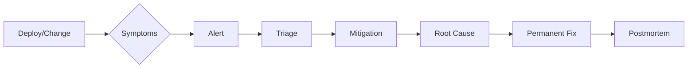

# Production Stories — Complete Incident Catalog 🔥

Production stories are **real-world incidents** that teach us how systems fail and how they recover. Each story documents symptoms, root cause, investigation process, mitigation, and permanent fix.

**Related**: [SRE & Observability](../14-sre-observability/README.md) · [Databases](../08-databases/README.md) · [Kubernetes](../07-kubernetes/README.md) · [Distributed Systems](../09-distributed-systems/README.md)

---

## Table of Contents

- [Incident Framework](#-incident-framework)
- [Infrastructure Incidents](#1-infrastructure-incidents-)
- [Database Incidents](#2-database-incidents-)
- [Messaging & Queue Incidents](#3-messaging--queue-incidents-)
- [Networking Incidents](#4-networking-incidents-)
- [Application Incidents](#5-application-incidents-)
- [Security Incidents](#6-security-incidents-)
- [Cloud Incidents](#7-cloud-incidents-)
- [Patterns & Lessons](#8-patterns--lessons-)
- [Postmortem Template](#-postmortem-template)
- [Related Domains](#-related-domains)
- [Simplest Mental Model](#-simplest-mental-model)

---

## 🎯 Incident Framework

### Anatomy of an Incident


### Common Incident Categories
```
Infrastructure:
  - Node failures, disk full, network partition
  - Cloud provider outages, DNS propagation

Database:
  - Connection pool exhaustion, replication lag
  - Query performance degradation, deadlocks

Application:
  - Memory leaks, OOM kills, GC storms
  - Deadlocks, race conditions, corruption

Messaging:
  - Queue backpressure, broker failures
  - Rebalance storms, message ordering

Security:
  - Data breaches, account takeover
  - DDoS attacks, supply chain attacks
```

### Timeline Template
```
YYYY-MM-DD Incident Name

14:02 UTC — Deploy of v2.3.1
14:05 UTC — Error rate spike (5xx → 15%)
14:08 UTC — PagerDuty alert (SEV1)
14:15 UTC — Incident declared, on-call triages
14:22 UTC — Initial hypothesis: DB overload
14:35 UTC — Deploy rollback initiated
14:40 UTC — Error rate dropping
14:52 UTC — Confirmed: query change caused full table scan
15:10 UTC — Postmortem started
```

---

## 1. Infrastructure Incidents 🏗️

### Kubernetes Node Failure Cascade
**Symptoms**: Pods crashing, services unreachable, error rate spike

**Investigation**: `kubectl get nodes` showed 3 nodes NotReady. `kubectl describe node` revealed disk pressure on all 3 due to log rotation failure.

**Root Cause**: Log rotation pod had a bug: it created empty log files instead of rotating. /var/log filled up (100% disk), kubelet evicted pods.

**Mitigation**: Manually removed old log files, `kubectl cordon` affected nodes, drained pods to healthy nodes.

**Permanent Fix**: Fixed log rotation script, added disk usage monitoring (Prometheus alert at 80%), added `logrotate` with `maxage` policy.

**Lesson**: Disk full scenarios should be tested. Monitor disk on ALL nodes.

### AWS EBS Volume Limit Exceeded
**Symptoms**: New EC2 instances failing to attach volumes, deployment pipeline failing

**Investigation**: AWS API errors: `VolumeLimitExceeded`. Account had 50TB of EBS provisioned, limit was 50TB.

**Root Cause**: Teams provisioned EBS volumes for stateful workloads without cleanup. No lifecycle management for orphaned volumes.

**Mitigation**: Requested AWS limit increase (50TB → 200TB) via support ticket.

**Permanent Fix**: Automated volume lifecycle (tag volumes, delete unattached volumes after 7 days), set up AWS Budget alerts for storage usage, implemented Terraform state checks.

**Lesson**: Cloud resource limits are real. Monitor usage against limits proactively.

### DNS Propagation Delay + Stale Cache
**Symptoms**: Some users seeing old site, some seeing new site. Support tickets about "site broken"

**Investigation**: `dig` showed different results from different resolvers. New IP was live but TTL was set to 86400s (24h).

**Root Cause**: DNS record changed without lowering TTL first. Old IP was serving stale content for 24 hours.

**Mitigation**: Lowered TTL to 60s, waited for propagation.

**Permanent Fix**: DNS change procedure documented: lower TTL → wait → change record → raise TTL. Add TTL check to DNS change runbook.

**Lesson**: Always lower DNS TTL before making changes. DNS caching ruins rollbacks.

---

## 2. Database Incidents 🗄️

### PostgreSQL Connection Pool Exhaustion
**Symptoms**: All services failing to reach database, application returning 503

**Investigation**: `SELECT count(*) FROM pg_stat_activity` showed 500 connections (max_connections=100). Connection pooler (PgBouncer) was bypassed by recent config change.

**Root Cause**: A deploy removed PgBouncer config from the connection string. Services connected directly to PostgreSQL, exhausting max_connections.

**Mitigation**: Added PgBouncer back to connection string, restarted affected services, killed idle connections with `pg_terminate_backend()`.

**Permanent Fix**: Infrastructure-as-code validation (verify PgBouncer always in connection string). Added monitoring on `pg_stat_activity` connection count. Connection leak test in integration tests.

**Lesson**: Connection pooling is not optional. Validate infrastructure changes in CI.

### MySQL Replication Lag Spike
**Symptoms**: Read replicas 30 minutes behind master. User-facing read requests returning stale data.

**Investigation**: `SHOW SLAVE STATUS` showed `Seconds_Behind_Master: 1800`. `SHOW PROCESSLIST` revealed long-running analytics query on the read replica.

**Root Cause**: Analytics team ran a heavy aggregation query directly on the read replica during business hours. The query locked rows and blocked replication SQL thread.

**Mitigation**: Killed the analytics query. Replication caught up within 2 minutes.

**Permanent Fix**: Analytics queries moved to dedicated read replica. Added query timeout (max_execution_time=30s). Monitoring on replication lag (alert at 60s). READ-ONLY flag for analytics connections.

**Lesson**: Read replicas are not free-for-all. Separate analytics from production reads.

### MongoDB Slow Query Overload
**Symptoms**: Database CPU at 100%, query latency > 10s, app requests timing out

**Investigation**: `currentOp()` showed thousands of unindexed queries. Collection had no index on the queried field.

**Root Cause**: A deploy changed query pattern from using indexed field to a non-indexed field. Full collection scan for every query.

**Mitigation**: Created index on the new query field (blocking but fast). Rolled back deploy.

**Permanent Fix**: Add query analysis to CI (EXPLAIN in test), query audit log, index change review process.

**Lesson**: Every query should be explain-analyzed in staging. Index changes require review.

### Cassandra GC Pause Caused Timeouts
**Symptoms**: Intermittent request timeouts, some nodes marked as down by gossip

**Investigation**: Node logs showed long GC pauses (up to 15s). During GC pause, node didn't respond to gossip probes. Other nodes marked it as down.

**Root Cause**: Heap too large (32GB) for G1GC. Long GC pauses caused by concurrent marking phase with region scanning.

**Mitigation**: Restarted nodes, reduced heap to 16GB, switched to CMS temporarily.

**Permanent Fix**: Switched to ZGC (sub-millisecond pauses). Reduced heap per node, added more nodes. G1GC tuning: `-XX:G1HeapRegionSize=16m`, `-XX:ConcGCThreads=4`.

**Lesson**: JVM GC tuning is crucial for latency-sensitive distributed systems. Cassandra is particularly sensitive to pause times.

---

## 3. Messaging & Queue Incidents 📨

### Kafka Broker Disk Full
**Symptoms**: Producers failing with `NotLeaderOrFollower`, consumers lagging

**Investigation**: Kafka broker logs: `java.io.IOException: No space left on device`. Broker crashed.

**Root Cause**: Retention.ms was set too high for the log volume. Messages accumulated faster than they were cleaned up. Disk filled to 100%.

**Mitigation**: Added disk, restarted broker. Repartitioned lagging consumers.

**Permanent Fix**: Set retention based on throughput (not just time). Monitoring on disk usage per broker (alert at 70%, 85%, 95%). Automated log compaction tuning.

**Lesson**: Kafka disk usage grows unboundedly if retention vs throughput isn't balanced.

### RabbitMQ Queue Backpressure
**Symptoms**: Messages stuck in queue, publishers timing out, consumers slow

**Investigation**: Queue depth growing (100K → 1M → 10M). Consumers processing messages slowly. `rabbitmqctl list_queues` showed queue depth > 10M.

**Root Cause**: Downstream API (database) was slow. Consumers blocked on DB writes, couldn't process messages fast enough.

**Mitigation**: Added more consumers (horizontal scaling). Rate-limited publishers. Increased queue max length.

**Permanent Fix**: Circuit breaker on downstream DB calls. Backpressure mechanism (publisher confirms, flow control). Monitoring on queue depth (alert at 10K).

**Lesson**: Queue depth is a lagging indicator. Monitor consumer processing rate, not just queue depth.

### Kafka Rebalance Storm
**Symptoms**: Consumer group not making progress, constant rebalancing

**Investigation**: Kafka consumer logs: "Revoking... Assigning... Revoking..." in a loop. Every rebalance pauses all consumers while group stabilizes.

**Root Cause**: Consumer session.timeout.ms was too low (5s). Network latency spikes caused consumers to miss heartbeats. Each timeout triggered rebalance.

**Mitigation**: Increased session.timeout.ms to 30s. Set `max.poll.interval.ms` higher.

**Permanent Fix**: Static group membership (cooperative rebalancing). `group.instance.id` for sticky assignment. Tuned heartbeat interval.

**Lesson**: Rebalance storms are self-reinforcing. Conservative timeouts prevent cascading failures.

---

## 4. Networking Incidents 🌐

### DNS Outage During Zone Transfer
**Symptoms**: Entire site unreachable for 30 minutes

**Investigation**: `dig example.com` returned SERVFAIL. DNS servers unreachable. DNS zone had been updated 30 minutes prior.

**Root Cause**: Syntax error in zone file. Primary DNS server accepted the update but secondary servers rejected the zone transfer. Plan B: all DNS servers serving stale or no records.

**Mitigation**: Restored previous valid zone file. Flushed DNS server caches.

**Permanent Fix**: DNS zone validation in CI (named-checkzone). Automated zone file testing before deployment. Separate change review for DNS.

**Lesson**: DNS is critical infrastructure. Validate zone files before deploying. Monitor DNS resolution health.

### Load Balancer Failover Failure
**Symptoms**: 5-minute outage during AZ failover test

**Investigation**: Active load balancer failed, standby didn't take over. Network team manually failed over after 5 minutes.

**Root Cause**: Standby LB had stale configuration — health check target differed from active. All backends were marked unhealthy by standby, so it routed to no one.

**Mitigation**: Manually updated standby health check, failed over.

**Permanent Fix**: Regular failover testing (once per quarter). Automated config sync between active and standby. Health check consistency validation.

**Lesson**: If you don't test failover, it doesn't work. Test in staging first, then production.

### MTU Mismatch Packet Loss
**Symptoms**: Intermittent connectivity to external API, file uploads failing

**Investigation**: Some large requests (over 1500 bytes) failing. `tcpdump` showed fragmented packets being dropped.

**Root Cause**: Internal network MTU = 9000 (jumbo frames), external = 1500. Packets over 1500 bytes were fragmented but the DF (Don't Fragment) bit was set.

**Mitigation**: Set MTU to 1500 on gateway interface.

**Permanent Fix**: MTU discovery in network design. Path MTU discovery (PMTUD) enabled. Network team adds MTU to interface checklist.

**Lesson**: MTU mismatch causes silent packet drops. Large packets + DF bit = drops.

---

## 5. Application Incidents 💻

### Memory Leak Causing OOM Kills
**Symptoms**: Services restarting periodically, increased error rate

**Investigation**: `kubectl logs` showed OOMKilled. Heap dumps revealed unbounded cache growth. Monitoring showed memory usage climbing linearly until limit hit.

**Root Cause**: In-memory cache had no eviction policy and no size limit. Cache entries were never removed as they aged. Over 8 hours, cache grew to fill all available memory.

**Mitigation**: Increased memory limit, restarted pod to clear cache.

**Permanent Fix**: Added bounded cache (Caffeine/Guava with maxSize). Added cache hit rate monitoring. Integration test for memory limits. Prometheus alert on memory usage > 80% of limit.

**Lesson**: Every in-memory store must be bounded. "Unlimited" cache = guaranteed OOM.

### Circuit Breaker Cascade
**Symptoms**: Multiple services down simultaneously, root cause hard to identify

**Investigation**: Service A → B → C → D. D slowed down. C's circuit breaker opened (80% of calls failing). B had no circuit breaker — kept calling C, threads blocked. All threads in B pool waiting on C. B became unhealthy.

**Root Cause**: No timeout or circuit breaker downstream from B. Single slow dependency cascaded to all upstream services.

**Mitigation**: Restarted B, C. Manually limited traffic to D (degraded mode).

**Permanent Fix**: Circuit breaker + timeout on ALL inter-service calls. Bulkhead pattern for critical vs non-critical paths. Cascading failure test (Chaos experiment: slow down one service).

**Lesson**: Every dependency needs a circuit breaker. Chain reactions amplify small failures.

### Deadlock in Distributed Transaction
**Symptoms**: Transaction completions stalled, users unable to place orders

**Investigation**: Thread dumps showed multiple threads holding locks A, B and waiting for B, A (deadlock). Showed up only under high concurrency (holiday sale).

**Root Cause**: Two services locking resources in different order. Service 1: lock(A) → lock(B). Service 2: lock(B) → lock(A).

**Mitigation**: Restarted services (killed stuck transactions).

**Permanent Fix**: Fixed lock ordering (Service 2: lock(A) → lock(B)). Added deadlock detection logs. Stressed test with high concurrency.

**Lesson**: Lock ordering must be consistent across all services. Deadlocks only show up under load.

---

## 6. Security Incidents 🛡️

### Dependency Vulnerability Exploitation
**Symptoms**: Unexplained data access, elevated error rates on auth endpoints

**Investigation**: Log4j CVE-2021-44228 detected. Attacker sent `${jndi:ldap://...}` payload in User-Agent header.

**Root Cause**: Service used Log4j 2.14.0 with JNDI lookup enabled. No WAF rule to block JNDI payloads.

**Mitigation**: Applied `-Dlog4j2.formatMsgNoLookups=true` JVM flag. Deployed WAF rule to block JNDI patterns.

**Permanent Fix**: Dependency scanning (Dependabot, Trivy, Snyk) in CI/CD. Software Bill of Materials (SBOM) generation. Vulnerability response runbook. Isolated patching environment for zero-day.

**Lesson**: Supply chain attacks are increasing. Automated vulnerability scanning is mandatory.

### Secrets Leaked to Git
**Symptoms**: Unauthorized cloud resource usage, $50K unexpected bill

**Investigation**: AWS API keys found in public git repository (private repo → public fork). Attacker used keys to spin up GPU instances.

**Root Cause**: Developer accidentally committed .env file containing production AWS credentials.

**Mitigation**: Revoked compromised keys. Rotated all production credentials. Removed keys from git history (BFG Repo-Cleaner).

**Permanent Fix**: Pre-commit hooks (`git secrets`, gitleaks) to scan for secrets. Secrets manager (Vault/AWS Secrets Manager) — never in .env files. Secret scanning in CI pipeline. Rotate keys quarterly.

**Lesson**: Secrets in git = compromised. Git history is forever.

### DDoS Attack Amplification
**Symptoms**: Service latency 10x normal, error rate 30%, CDN bill spike

**Investigation**: Traffic analysis showed 100M requests/minute from 50K different IPs. Pattern: requests to expensive API endpoint (search).

**Root Cause**: DDoS attack targeting search endpoint. Each request triggered heavy database query and cache miss.

**Mitigation**: Rate limiting at API gateway. Cloudflare DDoS protection (enabled under attack mode). Added CAPTCHA for suspicious traffic.

**Permanent Fix**: Rate limiting per client (token bucket, 100 req/min). Caching at CDN for anonymous requests. WAF rules for attack patterns.

**Lesson**: Every endpoint needs rate limiting. DDoS can be application-layer, not just network-layer.

---

## 7. Cloud Incidents ☁️

### AWS S3 Service Outage (US-EAST-1)
**Symptoms**: All S3 operations failing, dependent services degraded

**Investigation**: AWS status page: "increased error rates for S3 in US-EAST-1". S3 control plane impacted by request storm.

**Root Cause**: AWS S3 team was debugging a billing system issue. Internal request caused cascading failure in S3 control plane.

**Mitigation**: Multi-region failover (US-WEST-2) for critical data. Served stale cache where possible.

**Permanent Fix**: Multi-region strategy for critical data (cross-region replication). Multi-cloud for truly critical (GCS backup). Graceful degradation without S3 (degraded mode).

**Lesson**: Even AWS has outages. Plan for it. Multi-region + gracefully degrade.

### GCP DNS Outage
**Symptoms**: Some cloud load balancers stopped routing traffic

**Investigation**: GCP Cloud DNS returned SERVFAIL for managed zones. Load balancers using DNS-based routing failed.

**Root Cause**: GCP DNS incident (DNS service bug). All managed zones in the affected region returned errors.

**Mitigation**: Changed DNS to external provider (Cloudflare) as backup. Hardcoded IPs for critical endpoints.

**Permanent Fix**: Multi-provider DNS (primary + secondary). Keep secondary always warm (test periodically). Automated failover script.

**Lesson**: Even managed DNS fails. Have a secondary provider ready.

---

## 8. Patterns & Lessons 📖

### Common Failure Patterns
| Pattern | Description | Mitigation |
|---------|-------------|------------|
| Cascading Failure | One failure triggers chain reaction | Circuit breakers, bulkheads |
| Thundering Herd | All clients retry simultaneously | Exponential backoff, jitter |
| Slow Degradation | Gradual performance decline | Monitoring, auto-scaling |
| Configuration Drift | Configs diverge over time | IaC, config validation |
| Resource Exhaustion | Run out of memory/disk/fds | Limits, monitoring, alerting |
| Race Condition | Timing-dependent failures | Synchronization, idempotency |
| Exponential Backoff Storm | All clients retry at same intervals | Jitter, randomized backoff |

### Universal Lessons
```
1. Everything fails eventually
   - Design for failure from day 1
   - Test failure modes in staging

2. Monitoring is not optional
   - If you can't measure it, you can't fix it
   - Monitor USE (Utilization, Saturation, Errors)

3. Changes cause incidents
   - Most outages are caused by changes
   - Progressive delivery (canary, blue-green)

4. Timeouts everywhere
   - Always set timeouts on network calls
   - Chain: outward timeout < inward timeout

5. Graceful degradation
   - When a dependency fails, don't crash
   - Show cached data, limited features

6. Blameless postmortems
   - Systems fail, not people
   - Every incident is a learning opportunity
```

### Defensive Design Checklist
```
[ ] All external calls have timeouts
[ ] All external calls have circuit breakers
[ ] All caches are bounded (size + TTL)
[ ] All queues have max length and backpressure
[ ] All services have resource limits (CPU, memory)
[ ] All services have health endpoints
[ ] All services export metrics
[ ] All services have structured logging
[ ] All secrets are in secrets manager
[ ] All deploys are progressive (canary)
[ ] All rollbacks are tested
[ ] All changes have feature flags
[ ] All failures have runbooks
[ ] All incidents have postmortems
```

---

## 📝 Postmortem Template

```markdown
# Postmortem: [Title]

## Summary
One paragraph: what happened, when, impact.

## Severity
SEV1 / SEV2 / SEV3

## Timeline
All times in UTC:
- 14:02 — Deploy v2.3.1
- 14:05 — Error rate spike detected
- 14:08 — PagerDuty alert fired (SEV1)
- 14:15 — Incident declared, on-call triaging
- 14:35 — Rollback initiated
- 14:40 — Error rate returning to baseline
- 14:52 — Incident resolved
- 15:10 — Postmortem scheduled

## Detection
How was the incident detected? (alert, user report, monitoring)
How long between occurrence and detection?

## Impact
- Users affected: ~50K
- Downtime: 38 minutes
- Errors: ~12K failed requests
- Revenue impact: ~$15K

## Root Cause
Technical explanation of what failed and why.

## Contributing Factors
- No circuit breaker on service B
- Timeout set too high (60s)
- No monitoring on queue depth

## Resolution
What was done to mitigate and resolve.

## Action Items
| Priority | Action | Owner | Ticket |
|----------|--------|-------|--------|
| P0 | Add circuit breaker to all HTTP calls | Alice | JIRA-123 |
| P1 | Set default timeout to 5s | Bob | JIRA-124 |
| P2 | Add queue depth monitoring | Carol | JIRA-125 |

## Lessons Learned
- What went well
- What went wrong
- What to improve

## Appendix
- Relevant dashboards
- Monitoring queries
- Runbooks
```

---

## 🔗 Related Domains

| Domain | Connection |
|--------|-----------|
| [SRE & Observability](../14-sre-observability/README.md) | Incident detection, monitoring, alerting |
| [Databases](../08-databases/README.md) | Connection pools, replication, performance |
| [Distributed Systems](../09-distributed-systems/README.md) | Consensus failures, partition handling |
| [Kubernetes](../07-kubernetes/README.md) | Node failures, pod evictions, OOM |
| [Cloud Computing](../05-cloud/README.md) | Cloud provider outages, service limits |
| [Security](../13-security/README.md) | Breaches, vulnerabilities, secret leaks |
| [Networking](../11-networking/README.md) | DNS, load balancers, MTU, packet loss |
| [Performance Engineering](../18-performance-engineering/README.md) | Memory leaks, GC pauses, connection pool tuning |

---

## 🧠 Simplest Mental Model

```
Production Stories = Near-Miss Reports for Engineering

Each story is a documented near-miss:
  What happened → What we did → Why it happened → How to prevent

Like aviation black boxes — we don't study crashes to blame pilots.
We study crashes to build safer planes.

The Three Questions After Every Incident:
  1. Could this have been prevented? (design/process change)
  2. Could we have detected it faster? (monitoring improvement)
  3. Could we have recovered quicker? (runbook/automation)
```

**Every incident is a gift. It reveals a weakness in your system that your users found first. Fix it, document it, and share it — so others don't learn the same lesson the hard way.**

---

**Next**: [Project Architectures](../23-projects/README.md) · [SRE & Observability](../14-sre-observability/README.md)

---

## Related

- [Databases](../../08-databases/) — Outages, corruption, performance
- [Distributed Systems](../../09-distributed-systems/) — Consensus, cascade failures
- [Kubernetes](../../07-kubernetes/) — Cluster failures
- [Networking](../../11-networking/) — DNS, TCP issues
- [SRE](../../14-sre-observability/) — Incident response
