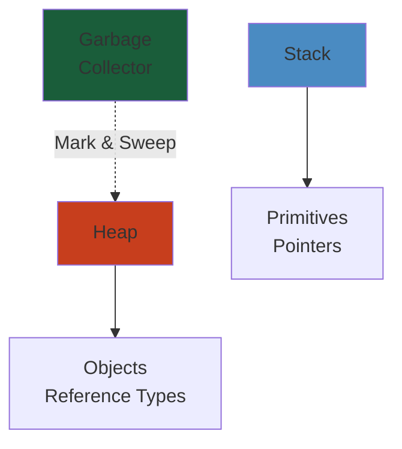

# Distributed Cache — Production-Grade Design




## Table of Contents
1. Architecture Overview
2. Consistent Hashing & Virtual Nodes
3. Replication & Sharding
4. Internal Data Structures
5. Eviction Policies
6. Persistence Layer
7. Cluster Management
8. Wire Protocol (RESP)
9. Production Operations
10. Code Architecture

---

## 1. Architecture Overview

A distributed cache is an in-memory key-value store spanning multiple nodes. It provides low-latency access to frequently accessed data by partitioning data across a cluster.

### Core Components

```
┌─────────────────────────────────────────────────────┐
│                   Client Layer                       │
│  SDK / Redis-cli / REST API / Memcached Protocol    │
└──────────────────────┬──────────────────────────────┘
                       │ TCP / QUIC
┌──────────────────────▼──────────────────────────────┐
│                 Proxy / Router Layer                  │
│  Twemproxy / Redis Cluster Proxy / Envoy / HAProxy  │
│  Request routing, connection pooling, retry logic    │
└──────────────────────┬──────────────────────────────┘
                       │
┌──────────────────────▼──────────────────────────────┐
│                    Cluster Layer                     │
│  Node discovery (Gossip) │ Slot migration │ Failover│
│  Configuration propagation │ Quorum/Raft            │
└──────────────────────┬──────────────────────────────┘
                       │
┌────────────┬─────────┼─────────┬────────────────────┐
│  Node 1    │ Node 2  │ Node 3  │ Node N             │
│ ┌────────┐ │┌────────┐│┌────────┐│ ┌────────┐       │
│ │ Memory │ ││ Memory │││ Memory ││ │ Memory │       │
│ │ Store  │ ││ Store  │││ Store  ││ │ Store  │       │
│ ├────────┤ │├────────┤│├────────┤│ ├────────┤       │
│ │ Disk   │ ││ Disk   │││ Disk   ││ │ Disk   │       │
│ │ (RDB/  │ ││ (RDB/  │││ (RDB/  ││ │ (RDB/  │       │
│ │  AOF)  │ ││  AOF)  │││  AOF)  ││ │  AOF)  │       │
│ └────────┘ │└────────┘│└────────┘│ └────────┘       │
└────────────┴──────────┴──────────┴───────────────────┘
```

### Design Goals

| Goal | Approach |
|------|----------|
| Low latency (<1ms) | In-memory storage, epoll/kqueue I/O |
| High throughput (100k+ ops/s) | Event loop + thread pool, pipelining |
| Horizontal scalability | Consistent hashing, slot-based sharding |
| High availability | Replication, automatic failover |
| Durability (optional) | RDB snapshots, AOF logs |
| Operational simplicity | Gossip-based discovery, automated slot migration |

---

## 2. Consistent Hashing & Virtual Nodes

### Problem

Traditional modulo-based sharding (`key % N`) breaks when nodes are added or removed — most keys need to be remapped, causing massive cache misses (cache avalanche).

### Consistent Hashing

Consistent hashing maps both keys and nodes onto a circular hash ring (range [0, 2^32 - 1]).

```
                   0
                   │
     Node C        │        Node A
        ┌──────────▼──────────┐
        │                     │
        │     Hash Ring       │
        │                     │
        └──────────┬──────────┘
                   │
     Node B        │
```

Key `K` is assigned to the first node encountered when moving clockwise from `hash(K)`.

- **Node addition**: only keys in the range between the new node and its predecessor are remapped.
- **Node removal**: only keys assigned to the removed node are reassigned.

### Virtual Nodes

Physical nodes are represented by multiple virtual nodes (e.g., 150 per physical node) placed at different positions on the ring. This solves two problems:

1. **Load imbalance**: Without virtual nodes, nodes may own vastly different ranges.
2. **Hotspotting**: Popular keys may cluster on one node.

Each physical node `N_i` creates `v` virtual nodes: `hash(N_i || 1)`, `hash(N_i || 2)`, ..., `hash(N_i || v)`.

```
Physical Node A ──→ vNode A:1, A:2, ..., A:150
Physical Node B ──→ vNode B:1, B:2, ..., B:150
Physical Node C ──→ vNode C:1, C:2, ..., C:150
```

When a physical node leaves, its vNodes are redistributed across surviving nodes. When it joins, existing vNodes are split.

### Implementation

```
hash_ring = SortedDict()  # {hash_value: physical_node}

def add_node(node_id):
    for i in range(VIRTUAL_NODES):
        vnode_hash = hash(f"{node_id}:{i}")
        hash_ring[vnode_hash] = node_id

def get_node(key):
    key_hash = hash(key)
    idx = hash_ring.bisect_left(key_hash)
    if idx == len(hash_ring):
        idx = 0
    return hash_ring[hash_ring.keys()[idx]]
```

#### Step-by-Step

1. **Hash key and nodes**: Compute SHA-1 or MD5 of each key and node identifier to position them on the ring
2. **Place virtual nodes**: Distribute multiple virtual nodes per physical node across the hash ring
3. **Find responsible node**: For a key, hash it and find the first virtual node clockwise; return its physical node
4. **Replication assignment**: Walk clockwise from the primary node, assigning replicas to next distinct physical nodes
5. **Handle node changes**: When a node joins/leaves, rebalance keys between affected nodes (primary + its replicas)
6. **Verify distribution**: Simulate uniform random key distribution; confirm load variance < 10%

#### Code Example

```python
import hashlib
import bisect
from collections import defaultdict

class ConsistentHashRing:
    def __init__(self, nodes=None, virtual_nodes=150):
        self.virtual_nodes = virtual_nodes
        self.ring = {}
        self.sorted_keys = []
        if nodes:
            for node in nodes:
                self.add_node(node)
    
    def _hash(self, key):
        """Hash function using SHA-1 (returns int 0 to 2^32-1)."""
        return int(hashlib.sha1(str(key).encode()).hexdigest(), 16) % (2**32)
    
    def add_node(self, node):
        """Add a physical node with virtual nodes."""
        for i in range(self.virtual_nodes):
            vnode_key = f"{node}:{i}"
            h = self._hash(vnode_key)
            self.ring[h] = node
        self.sorted_keys = sorted(self.ring.keys())
    
    def remove_node(self, node):
        """Remove a physical node and its virtual nodes."""
        for i in range(self.virtual_nodes):
            vnode_key = f"{node}:{i}"
            h = self._hash(vnode_key)
            del self.ring[h]
        self.sorted_keys = sorted(self.ring.keys())
    
    def get_node(self, key):
        """Find responsible node for key."""
        if not self.ring:
            return None
        h = self._hash(key)
        idx = bisect.bisect_left(self.sorted_keys, h)
        if idx == len(self.sorted_keys):
            idx = 0
        return self.ring[self.sorted_keys[idx]]
    
    def get_replicas(self, key, num_replicas=3):
        """Get replication nodes (distinct physical nodes)."""
        if not self.ring:
            return []
        h = self._hash(key)
        idx = bisect.bisect_left(self.sorted_keys, h)
        replicas = []
        seen_nodes = set()
        attempts = 0
        while len(replicas) < num_replicas and attempts < len(self.sorted_keys):
            physical_node = self.ring[self.sorted_keys[idx]]
            if physical_node not in seen_nodes:
                replicas.append(physical_node)
                seen_nodes.add(physical_node)
            idx = (idx + 1) % len(self.sorted_keys)
            attempts += 1
        return replicas

# Test: Verify distribution
ring = ConsistentHashRing(nodes=['node1', 'node2', 'node3'], virtual_nodes=150)
distribution = defaultdict(int)
for i in range(100000):
    key = f"key:{i}"
    node = ring.get_node(key)
    distribution[node] += 1

print("Key distribution:")
for node, count in sorted(distribution.items()):
    print(f"  {node}: {count} keys ({100*count/100000:.1f}%)")
# Expected: ~33.3% per node with small variance
```

#### Real-World Scenario

Facebook's Memcache cluster added 10 new nodes to handle Black Friday load. Without consistent hashing, 90% of keys would need remapping, causing a "thundering herd" of cache misses and database overload. With consistent hashing and 150 virtual nodes per physical node, only 33% of keys were remapped (those in the hash range of new nodes). Peak traffic was sustained with p99 latency staying under 5ms.

### Replication-Aware Consistent Hashing

For replication factor `R`, assign each key to the next `R` distinct physical nodes after `hash(key)`:

```
replica_nodes = []
current_idx = start_idx
while len(replica_nodes) < R:
    physical = hash_ring[hash_ring.keys()[current_idx]]
    if physical not in replica_nodes:
        replica_nodes.append(physical)
    current_idx = (current_idx + 1) % len(hash_ring)
```

This ensures that replicas are spread across distinct failure domains.

---

## 3. Replication & Sharding

### Sharding Strategies

#### Slot-Based Sharding (Redis Cluster)

The key space is divided into 16384 hash slots. Each node owns a contiguous range of slots.

```
hash_slot = CRC16(key) % 16384
```

Slot assignment:
```
Node A: slots 0–5500
Node B: slots 5501–11000
Node C: slots 11001–16383
```

**MOVED redirection**: When a client sends a request to the wrong node, the node responds with `-MOVED <slot> <ip>:<port>`. The client then reissues the request to the correct node.

#### Tag-Based Sharding

Keys containing `{...}` force both keys into the same slot:
```
user:{100}:profile
user:{100}:settings
```
Both hash to the same slot, enabling multi-key operations.

### Replication

Each master has one or more replicas (preferably in different racks/AZs).

```
┌──────────┐          ┌──────────┐
│  Master  │ ──Sync──▶│ Replica  │
│  Node A  │          │  Node A' │
│  Slot:   │          │  Slot:   │
│  0-5500  │          │  0-5500  │
└──────────┘          └──────────┘
```

**Replication protocol**:
1. Replica sends `REPLICAOF master_ip master_port`
2. Master starts a background save (RDB) and sends the RDB file to replica
3. Master buffers all write commands during RDB transfer (in replication backlog)
4. Replica loads RDB, then replays buffered commands
5. Steady state: master sends live command stream to replica

**Partial resynchronization**: If replica disconnects briefly, use the replication backlog. Master tracks offset. If replica's offset is still in the backlog, send only the missing commands (`PSYNC`). No full sync needed.

### Strong Consistency vs. Eventual Consistency

| Approach | Property | Technique |
|----------|----------|-----------|
| Quorum | Strong (with W=R+N/2+1) | Read/write quorum |
| Chain replication | Strong | Writes propagate through chain |
| Async replication | Eventual | Default Redis replication |

---

## 4. Internal Data Structures

### 4.1 Hash Table (dict)

The core data store — a resizable hash table with chaining.

```
┌─────┐
│ HT0 │──▶ dictEntry[] ──▶ key1 ──▶ key2 ──▶ NULL
├─────┤                ▶ key3 ──▶ NULL
│ HT1 │──▶ dictEntry[] ──▶ key4 ──▶ NULL
└─────┘
```

**Rehashing**: Redis uses **incremental rehashing** (not stop-the-world).

- Two hash tables: `ht[0]` (active), `ht[1]` (resized target)
- During rehashing, each operation on the dict moves N buckets from ht[0] to ht[1]
- Both tables are consulted during reads; writes go to ht[1]
- Rehashing completes when ht[0] is empty; ht[1] becomes the new ht[0]

```
DICT_HT_INITIAL_SIZE = 4

def dict_add(dict, key, value):
    if dict.is_rehashing:
        _rehash_step(dict)
    idx = hash(key) & (dict.ht[1].size - 1) if dict.is_rehashing \
          else hash(key) & (dict.ht[0].size - 1)
    # Insert into appropriate hash table

def _rehash_step(dict):
    # Move up to N non-empty buckets from ht[0] to ht[1]
    moved = 0
    while moved < N and dict.ht[0].used > 0:
        bucket = dict.rehash_index
        if dict.ht[0].table[bucket] is not None:
            # Move all entries in this bucket
        dict.rehash_index += 1
        moved += 1
```

**Load factor**: Resize when `used/size > 1` (grow) or `used/size < 0.1` (shrink).

**Hash function**: siphash (resistant to hash-collision DoS attacks).

### 4.2 Skip List (sorted set)

Used for `ZADD`, `ZRANK`, `ZRANGE` operations with O(log N) average complexity.

```
Level 4: head ──────────────────────────────────────▶ tail
Level 3: head ─────────────▶ node ──────────────────▶ tail
Level 2: head ─────────────▶ node ─────▶ node ──────▶ tail
Level 1: head ─────▶ node ─▶ node ─────▶ node ──▶ node tail
Level 0: head ─────▶ node ─▶ node ─────▶ node ──▶ node tail
                          score: 5   score: 10  score: 15
```

**Node structure**:
```
SkipListNode {
    score: float64
    value: pointer (the actual member)
    backward: pointer
    levels: [
        { forward: ptr, span: int },
        { forward: ptr, span: int },
        ...
    ]
}
```

**Insert algorithm**:
```
def zadd(zsl, score, member):
    update = [None] * ZSKIPLIST_MAXLEVEL
    rank = [0] * ZSKIPLIST_MAXLEVEL
    x = zsl.header

    # Traverse from top to bottom, recording path
    for i in range(zsl.level - 1, -1, -1):
        rank[i] = rank[i + 1] if i < zsl.level - 1 else 0
        while x.levels[i].forward is not None and
              (x.levels[i].forward.score < score or
               (x.levels[i].forward.score == score and
                x.levels[i].forward.value < member)):
            rank[i] += x.levels[i].span
            x = x.levels[i].forward
        update[i] = x

    # Random level for new node
    level = random_level()

    if level > zsl.level:
        for i in range(zsl.level, level):
            rank[i] = 0
            update[i] = zsl.header
            update[i].levels[i].span = zsl.length
        zsl.level = level

    x = create_node(level, score, member)

    # Splice the node into all levels
    for i in range(level):
        x.levels[i].forward = update[i].levels[i].forward
        update[i].levels[i].forward = x
        x.levels[i].span = update[i].levels[i].span - (rank[0] - rank[i])
        update[i].levels[i].span = (rank[0] - rank[i]) + 1

    # Update backward pointers
    x.backward = update[0] if update[0] != zsl.header else None
    if x.levels[0].forward:
        x.levels[0].forward.backward = x
    else:
        zsl.tail = x

    zsl.length += 1
```

**ZipList encoding**: For small sorted sets (< 128 entries, < 64 byte values), Redis uses a ziplist instead of skip list for memory efficiency.

### 4.3 HyperLogLog

Probabilistic data structure for cardinality estimation (counting unique elements) using ~12KB fixed memory, with ~0.81% standard error.

**Algorithm**: HyperLogLog uses the observation that the probability of seeing `k` leading zeros in a hash is `2^(-k)`. The maximum number of leading zeros across all elements estimates `log2(cardinality)`.

**Redis implementation** (16384 registers):

```
struct hllhdr {
    char magic[4];       // "HYLL"
    uint8_t encoding;    // HLL_DENSE or HLL_SPARSE
    uint8_t registers[16384];  // 6-bit values packed
};
```

**PFADD**: Hash the element, use first 14 bits as register index, count leading zeros in remaining bits, update register with max.

```
def pfadd(key, element):
    hash = hash_64(element)
    index = hash & 0x3FFF           # First 14 bits
    leading_zeros = clz(hash << 14 | 1) + 1  # Count leading zeros
    register = hll.registers[index]
    if leading_zeros > register:
        hll.registers[index] = leading_zeros
        return 1  # Cardinality changed
    return 0
```

**PFCOUNT**: Harmonic mean of registers, bias-corrected.

```
def pfcount(hll):
    sum = 0
    for reg in hll.registers:
        sum += 1.0 / (1 << reg)

    alpha = 0.7213 / (1 + 1.079 / 16384)
    estimate = alpha * 16384 * 16384 / sum

    # Bias correction for small/large cardinalities
    if estimate < 2.5 * 16384:
        zeros = count_non_zero_registers(hll.registers)
        if zeros:
            estimate = 16384 * log(16384 / zeros)
    return estimate
```

**PFMERGE**: Take element-wise max of registers.

### 4.4 Bloom Filter

Probabilistic data structure for set membership. Can have false positives, never false negatives.

Uses `k` hash functions and a bit array of size `m`.

```
BloomFilter {
    bits: bitarray(size=m)
    hashes: [hash_fn_1, ..., hash_fn_k]
}
```

**Add**: For each hash function, set `bits[hash(element)] = 1`.
**Check**: For each hash function, check `bits[hash(element)]`. If any is 0, element is definitely not present.

**Optimal parameters**:
- `m = -n * ln(p) / (ln(2)^2)` where `n` is expected elements, `p` is false positive rate
- `k = (m/n) * ln(2)`

**Counting Bloom Filter**: Each entry is a counter (not bit) to support deletion.

**Scalable Bloom Filter**: When full, create a new, larger filter — checking requires checking all filters.

---

## 5. Eviction Policies

When memory usage exceeds `maxmemory`, the cache must evict entries. The eviction policy is configured via `maxmemory-policy`.

### 5.1 LRU (Least Recently Used)

Evicts the entry accessed farthest in the past.

**Linked-list + hash map**: O(1) operations.

```
┌─────────────────┐
│  HashMap        │
│  key ──▶ node   │
└─────────────────┘
       │
┌──────▼─────────────────────────────────────────────────┐
│  Doubly Linked List (sorted by access time)            │
│  ┌──────┐    ┌──────┐    ┌──────┐    ┌──────┐         │
│  │ MRU  │◀──▶│      │◀──▶│      │◀──▶│ LRU  │── evict │
│  └──────┘    └──────┘    └──────┘    └──────┘         │
└────────────────────────────────────────────────────────┘
```

**Get**: Move node to head.
**Put**: Update value, move to head. If full, evict tail.
**Evict**: Remove tail node from list and hashmap.

**Redis LRU**: Redis does NOT use exact LRU (too much memory overhead for pointers). Instead, it uses **approximated LRU**: a pool of N candidate keys is sampled, and the best (oldest) among them is evicted.

```
eviction_pool = []  # Max EVICTION_POOL_SIZE candidates

def evict(server):
    while server.dict.used > server.maxmemory:
        # Sample keys from the dict
        candidates = sample_keys(server.dict, EVICTION_SAMPLE_SIZE)
        for key in candidates:
            candidate = Candidate(key, idletime=server.unixtime - key.lru_access_time)
            # Keep best candidates in pool
            insert_sorted(eviction_pool, candidate, max_size=EVICTION_POOL_SIZE)

        best = eviction_pool.pop()  # Highest idle time
        delete_key(server.dict, best.key)
```

### 5.2 LFU (Least Frequently Used)

Evicts the entry accessed least frequently.

**Redis LFU**: A probabilistic counter (Morris counter) with aging.

Each key stores an 8-bit `lru` field:
```
· · · · · · · ·
│←  16 bits  →│←   8 bits   →│
│  Last access │  LFU counter  │
│  time (min)  │  (logarithmic)│
└──────────────┴──────────────┘
```

**Morris counter** (logarithmic counter):
- Increment probability decreases as counter increases.
- `p = 1 / (counter * COUNTER_REDUCTION_FACTOR)`

```
def increment_lfu_counter(counter):
    rand = random()  # [0.0, 1.0)
    threshold = 1.0 / (counter * LFU_LOG_FACTOR + 1)
    if rand < threshold:
        return counter + 1
    return counter
```

**Aging**: The counter is decremented periodically. Every `LFU_DECAY_TIME` minutes, the counter is halved. This prevents "historical popularity" from keeping old entries alive forever.

### 5.3 TinyLFU

A modern, space-efficient frequency estimation scheme. Used by Caffeine (Java) and other high-performance caches.

TinyLFU maintains a **Count-Min Sketch** (probabilistic frequency counter) with a **reset mechanism** to age out old frequencies.

**Count-Min Sketch**: A 2D array of counters with `d` rows and `w` columns, each row using an independent hash function.

```
Row 0: [0][1][2]...[w-1]  ← hash_0(key)
Row 1: [0][1][2]...[w-1]  ← hash_1(key)
...
Row d-1: [0][1][2]...[w-1] ← hash_{d-1}(key)
```

**Increment**: Increment `sketch[hash_i(key) % w][i]` for all `i` in `[0, d)`.
**Estimate**: Return `min(sketch[hash_i(key) % w][i] for i in range(d))`.

**Reset**: When average counter value exceeds threshold, halve all counters. This gives more weight to recent frequencies.

**SLRU (Segmented LRU)**: TinyLFU is paired with SLRU:
- **Probation** segment: entries likely to be evicted
- **Protected** segment: entries promoted from probation (multiple accesses)

```
TinyLFU ──────▶ SLRU
                 ├── Probation (20%)
                 └── Protected (80%)
```

**Admission policy**: When a new entry arrives, TinyLFU estimates its frequency vs. the victim's frequency. If the new entry is more frequent, it is admitted and the victim is evicted.

### 5.4 ARC (Adaptive Replacement Cache)

Self-tuning policy that maintains both recency (LRU) and frequency (LFU) information, adapting to workload changes.

ARC maintains four lists:
- **T1**: Recent entries (LRU)
- **T2**: Frequent entries (recency + frequency)
- **B1**: Ghost entries evicted from T1 (metadata only)
- **B2**: Ghost entries evicted from T2 (metadata only)

```
    │          T1           │           T2           │
    │  Recent (LRU)        │  Frequent (LRU+LFU)    │
    │  ┌───┐ ┌───┐ ┌───┐  │  ┌───┐ ┌───┐ ┌───┐   │
    │  │ m │ │ a │ │ b │  │  │ x │ │ y │ │ z │   │
    │  └───┘ └───┘ └───┘  │  └───┘ └───┘ └───┘   │
    │          │                  │                  │
    │          ▼                  ▼                  │
    │   B1 (Ghost)         B2 (Ghost)               │
    │   ┌───┐ ┌───┐       ┌───┐ ┌───┐              │
    │   │   │ │   │       │   │ │   │              │
    │   └───┘ └───┘       └───┘ └───┘              │
```

**Policy**:
- On a cache hit in T1: move entry to T2 (recognized as frequent)
- On a cache hit in T2: move to MRU end of T2
- On a miss in B1: indicates that T1 is too large → increase target size for T1
- On a miss in B2: indicates that T2 is too large → increase target size for T2

ARC adapts `p` (the target size of T1) based on ghost hit patterns. This allows it to handle both scanning workloads (LRU-friendly) and popular-key workloads (LFU-friendly).

### 5.5 LIRS (Low Inter-reference Recency Set)

High-performance policy that outperforms LRU under most workloads, especially for larger-than-memory working sets.

**Key insight**: LIRS distinguishes between:
- **LIR** (Low Inter-reference Recency): blocks reused within a short window
- **HIR** (Low Inter-reference Recency): blocks with long reuse distance

Only LIR blocks are cached in memory; HIR blocks are cached only if space permits (and are the first to be evicted).

```
LIRS stack (S): [LIR, LIR, HIR, LIR, HIR, ...]
                    ↑
               Stack top (most recently accessed)

LIR set: always resident in cache
HIR set: resident only if within cache size
```

**On access**:
1. If block is LIR: move to top of stack S
2. If block is resident HIR: change to LIR, move to top of S, demote the LIR at stack bottom to HIR
3. If block is non-resident HIR: fetch from disk, change to LIR, evict a HIR block

LIRS provides near-optimal (OPT) performance for most workloads while requiring only O(1) operations per access.

### 5.6 2Q (Two-Queue)

A simpler alternative to ARC with similar performance.

Three queues:
- **A1in**: FIFO queue for first-time accesses (transient page arrivals)
- **A1out**: Ghost queue for evicted A1in entries
- **Am**: FIFO queue for frequently accessed entries

**On access**:
1. Cache miss + in A1out: promote to Am
2. Cache miss (new): add to A1in
3. Cache hit in A1in: promote to Am
4. Cache hit in Am: no change

**Eviction**:
1. If A1in exceeds its target size: evict from A1in tail
2. Otherwise: evict from Am tail

**Ghost entries**: When A1in entries are evicted, their keys go to A1out. A hit in A1out indicates the page deserves promotion to Am, preventing thrashing.

---

## 6. Persistence Layer

### 6.1 RDB (Redis Database) Snapshots

Point-in-time snapshot of the entire dataset.

**Trigger conditions**:
- Manual: `SAVE` (blocking), `BGSAVE` (background)
- Automatic: `save <seconds> <changes>` (e.g., `save 900 1` = save if at least 1 key changed in 900 seconds)

**RDB file format**:
```
┌──────────────┬──────────────┬──────┬──────┬──────┬──────────────┐
│ "REDIS"      │ RDB_VERSION  │ AUX  │ DB   │ DB   │ EOF          │
│ magic(5B)    │ (4B)         │fields│ sel  │ data │ marker(1B)   │
├──────────────┴──────────────┴──────┴──────┴──────┴──────────────┤
│ Checksum (8B) ── CRC64                                       │
└─────────────────────────────────────────────────────────────────┘
```

**DB data section**:
```
DB data = [SELECT_DB(1B), db_number, RESIZEDB, db_hashtable_size, db_expires_size, key_value_pairs...]

Key-value pair:
  [TYPE(1B), KEY(SDS), VALUE(encoded)]
```

**Encoding types**:
- `0`: String (raw)
- `1`: String (int encoding)
- `2`: String (LZF compressed)
- `10`: List (quicklist)
- `11`: Set (hashtable)
- `12`: Sorted set (skip list)
- `13`: Hash (hashtable)
- `14`: ZipMap (deprecated)
- `15`: ZipList
- `16`: IntSet
- `17`: Sorted set (ziplist)
- `18`: Hash (ziplist)
- `19`: QuickList
- `20`: Stream (listpack)

**Background save** (`BGSAVE`):
1. Fork child process
2. Child writes RDB to temp file
3. Child renames temp to final file (atomic)
4. Child exits, parent detects via SIGCHLD

**Copy-on-Write (CoW)**: After fork, parent and child share memory pages. When parent modifies a page due to client writes, the OS copies the page. Memory usage during BGSAVE can spike to 2x resident set if write-heavy.

### 6.2 AOF (Append-Only File)

Logs every write operation, enabling point-in-time recovery with finer granularity.

**AOF format**: Telnet-like protocol text:
```
*3
$3
SET
$5
mykey
$7
myvalue
*3
$3
SET
$5
other
$5
hello
```

**Append frequency** (`appendfsync`):
- `always`: fsync after every write (safe, slow)
- `everysec`: fsync once per second (default, good)
- `no`: let OS flush (dangerous)

**AOF rewrite** (`BGREWRITEAOF`):
1. Fork child
2. Child reads current dataset state
3. Child writes minimal set of commands to reconstruct dataset
4. Child signals parent
5. Parent appends buffer of commands accumulated during rewrite
6. Parent atomically swaps old AOF with new

**AOF rewrite optimization**:
```
Before rewrite (100k ops):
  SET k1 v1
  SET k1 v2
  SET k1 v3
  SET k2 v1
  SET k2 v2
  DEL k2

After rewrite (1 op):
  SET k1 v3
```

### 6.3 Append-Only File Format

An AOF is a sequence of operations. Each operation is encoded in Redis Serialization Protocol (RESP):

```
*<argc>\r\n
$<len>\r\n
<arg>\r\n
...
```

**AOF file segments**:
```
# base.rdb          — RDB snapshot (enables fast startup)
# incr_1.aof        — incremental operations since base
# incr_2.aof        — next segment
# manifest         — list of segments and their ordering
```

**Multi-part AOF** (Redis 7.0+): Combines RDB and AOF into one file for faster restarts and simpler management.

**Recovery process**:
1. Read RDB portion (load snapshot)
2. Read and replay AOF portion
3. Dataset is reconstructed

---

## 7. Cluster Management

### 7.1 Gossip Protocol

Nodes discover each other and propagate cluster state using a gossip protocol.

**Gossip message types**:
- `MEET`: Introduce a new node to the cluster
- `PING`: Periodic health check (sent every `cluster-node-timeout / 10`)
- `PONG`: Response to PING, contains node's state
- `FAIL`: Node A declares node B as failed

**Gossip payload**: Each gossip message contains a random subset of nodes (typically 3-6) along with their state:
```
{
    node_id: "abc123...",
    ip: "10.0.1.1",
    port: 6379,
    flags: [MASTER, SLAVE, FAIL, PFALL, HANDSHAKE],
    ping_sent: 12345678,
    pong_received: 12345690,
    config_epoch: 42,
    link_state: "connected"
}
```

**Failure detection**:
1. Node A fails to receive PONG from Node B within `cluster-node-timeout`
2. Node A sets Node B as `PFAIL` (possibly failed)
3. Node A gossips B's PFAIL status to other nodes
4. When majority of nodes (or `cluster-node-timeout` * 2) mark B as PFAIL → FAIL
5. FAIL is gossiped cluster-wide

**Split-brain handling**: Redis Cluster uses a **consensus-based** approach. A node needs to see a majority of master nodes (including itself) to serve requests. If a partition isolates a minority side, those nodes stop accepting writes.

### 7.2 Slot Migration

Moving hash slots (and their data) between nodes without downtime.

**States of a migrating slot**:

```
┌──────────┐      ┌─────────────────┐      ┌──────────┐
│ Source   │ ────▶│ Migrating       │ ────▶│ Target   │
│ Node A   │      │ (importing)     │      │ Node B   │
│ slot 100 │      │ slot 100        │      │ slot 100 │
└──────────┘      └─────────────────┘      └──────────┘
```

**Migration sequence**:
1. Target node: `CLUSTER SETSLOT <slot> IMPORTING <source_id>`
2. Source node: `CLUSTER SETSLOT <slot> MIGRATING <target_id>`
3. Source node: `MIGRATE <target_ip> <target_port> <key> 0 <timeout>` (repeat for all keys in slot)
4. Client sends request for a migrated key:
   - Source returns `-ASK <slot> <target_ip>:<target_port>`
   - Client sends `ASKING` to target, then the command
5. All keys migrated → `CLUSTER SETSLOT <slot> NODE <target_id>`

**Bulk migration**: `redis-cli --cluster rebalance` automates slot migration across the cluster.

### 7.3 Failover

When a master fails, its replica(s) compete to become the new master.

**Automatic failover**:
1. Master is detected as FAIL by > N nodes
2. Replica elections triggered
3. Replica with highest replication offset (most up-to-date) has priority
4. Replica sends `CLUSTER FAILOVER` to promote itself
5. Other replicas connect to the new master
6. Cluster configuration epoch is incremented

**Manual failover** (`CLUSTER FAILOVER`):
- `FORCE`: Failover even if master is reachable
- `TAKEOVER`: Failover without asking other nodes (for emergency recovery)

### 7.4 Split-Brain Handling

**Problem**: Network partition creates two independent clusters. Both sides accept writes. When the partition heals, data conflicts arise.

**Solutions**:

1. **Redis Cluster**: Minority side stops accepting writes after N nodes are unreachable. The minority nodes reply with `-CLUSTERDOWN The cluster is down` to all write commands. Data loss is limited to writes accepted by the majority side.

2. **Redis Sentinel**: Uses quorum-based decision:
   - `sentinel monitor mymaster 127.0.0.1 6379 2` (quorum of 2)
   - If >= 2 Sentinels agree master is down, failover proceeds
   - Only one Sentinel is elected leader to perform failover

3. **Raft-based (external)**: Use Raft consensus for leader election (e.g., RedisRaft, KeyDB).

**Best practices**:
- Deploy odd number of nodes (3, 5, 7)
- Use `min-replicas-to-write` and `min-replicas-max-lag` to prevent stale replicas from accepting writes
- Use `cluster-require-full-coverage no` (allow partial service during partition)

---

## 8. Wire Protocol (RESP)

### 8.1 Redis Serialization Protocol (RESP)

RESP is a text-based, binary-safe protocol. Redis 2.0+ uses RESP2; Redis 6.0+ introduced RESP3 (with typed replies).

**RESP2 Types**:

| Type | Format | Example |
|------|--------|---------|
| Simple String | `+OK\r\n` | `+OK\r\n` |
| Error | `-ERR message\r\n` | `-ERR no such key\r\n` |
| Integer | `:123\r\n` | `:1\r\n` |
| Bulk String | `$<len>\r\n<data>\r\n` | `$5\r\nhello\r\n` |
| Array | `*<count>\r\n...` | `*2\r\n$3\r\nfoo\r\n$3\r\nbar\r\n` |
| Null | `$-1\r\n` | `$-1\r\n` |

**RESP3 additions**:
- `Map`: `%<count>\r\nkey\r\nvalue\r\n...`
- `Set`: `~<count>\r\n...`
- `Push`: `><count>\r\n...(out-of-band data)`
- `Big Number`: `(<number>\r\n`
- `Null`: `_\r\n`

**Command serialization**:
```
SET key value
→ *3\r\n$3\r\nSET\r\n$3\r\nkey\r\n$5\r\nvalue\r\n

LRANGE mylist 0 -1
→ *4\r\n$6\r\nLRANGE\r\n$6\r\nmylist\r\n$1\r\n0\r\n$2\r\n-1\r\n
```

### 8.2 Pipelining

Batching multiple commands without waiting for individual replies.

```
Client:          *3\r\nSET k1 v1\r\n  *3\r\nSET k2 v2\r\n  *2\r\nGET k1\r\n  *2\r\nGET k2\r\n
Server:          +OK\r\n              +OK\r\n              $2\r\nv1\r\n         $2\r\nv2\r\n
└───── Time ──────────────────────────────────────────────────────────────────────────────▶
```

Without pipelining (4 round trips):
```
Client: SET k1 v1 → Server
Server:          → +OK
Client: SET k2 v2 → Server
Server:          → +OK
Client: GET k1    → Server
Server:          → v1
Client: GET k2    → Server
Server:          → v2
```

With pipelining (1 round trip):
```
Client: SET k1 v1\nSET k2 v2\nGET k1\nGET k2 → Server
Server:                                       → +OK\n+OK\nv1\nv2
```

Pipelining throughput scales linearly (up to the network congestion point). In Redis, 50-100 commands per pipeline is optimal.

### 8.3 Transactions

Redis transactions use `MULTI`, `EXEC`, `DISCARD`, and `WATCH`.

**MULTI/EXEC**:
```
MULTI
SET key1 value1
SET key2 value2
GET key1
EXEC
```

Server response during MULTI:
```
MULTI → +OK
SET key1 value1 → +QUEUED
SET key2 value2 → +QUEUED
GET key1 → +QUEUED
EXEC → *3\r\n+OK\r\n+OK\r\n$6\r\nvalue1\r\n
```

**Key properties**:
- **Atomic**: All commands in MULTI/EXEC execute sequentially, no other commands interleaved
- **No rollback**: If a command fails, subsequent commands still execute (Redis philosophy: errors are programming errors like type mismatches)
- **Not isolated**: Other clients can see intermediate states

**WATCH**: Optimistic locking using CAS (Check-And-Set):
```
WATCH stock:item42
stock = GET stock:item42
if stock > 0:
    MULTI
    DECR stock:item42
    EXEC
else:
    UNWATCH
```

If another client modifies `stock:item42` between WATCH and EXEC, the transaction aborts (EXEC returns nil).

### 8.4 Connection Handling

```
┌──────────┐               ┌──────────┐
│  Client  │ ──connect──▶  │  Server  │
└──────────┘               └──────────┘
                                 │
                    ┌────────────┴────────────┐
                    │                         │
              ┌─────▼─────┐          ┌────────▼────────┐
              │  Client   │          │  Parser State   │
              │  Object   │          │  Machine        │
              ├───────────┤          ├─────────────────┤
              │ fd: 42    │          │  buffer_read    │
              │ querybuf  │          │  buffer_parse   │
              │ replbuf   │          │  command_decode │
              │ flags     │          │  exec           │
              │ multi     │          │  encode_reply   │
              │ watching  │          │  flush_write    │
              └───────────┘          └─────────────────┘
```

**Client flags**:
- `CLIENT_SLAVE`: replica connection
- `CLIENT_MASTER`: master connection (for replication)
- `CLIENT_MONITOR`: MONITOR mode
- `CLIENT_MULTI`: inside MULTI/EXEC transaction
- `CLIENT_BLOCKED`: blocked on BLPOP/BRPOP/SUBSCRIBE
- `CLIENT_CLOSE_AFTER_REPLY`: will be closed after sending reply
- `CLIENT_CLOSE_ASAP`: will be closed ASAP (due to protocol error)

**Input buffer**: `client->querybuf` is a dynamic buffer. Reduces system call overhead by reading in bulk.

**Output buffer**: `client->buf` (16KB fixed) + `client->reply` (linked list of blocks for large replies). If output buffer grows beyond `client-output-buffer-limit`, client is disconnected.

---

## 9. Production Operations

### 9.1 Monitoring

**Key metrics**:

| Metric | Source | Alert Threshold |
|--------|--------|-----------------|
| `used_memory` | INFO memory | > 80% of maxmemory |
| `used_memory_rss` | INFO memory | > 1.5x used_memory (fragmentation) |
| `instantaneous_ops_per_sec` | INFO stats | > baseline * 2 |
| `total_connections_received` | INFO stats | Sudden spike |
| `rejected_connections` | INFO stats | > 0 |
| `keyspace_hits / keyspace_misses` | INFO stats | Hit rate < 90% |
| `connected_slaves` | INFO replication | < expected |
| `master_last_io_seconds_ago` | INFO replication | > 60 |
| `rdb_last_bgsave_time_sec` | INFO persistence | > 300 |
| `aof_current_size` | INFO persistence | Unbounded growth |
| `evicted_keys` | INFO stats | > 0 (unless expected) |
| `blocked_clients` | INFO clients | > 0 |

**Latency monitoring**:
```
redis-cli --latency -h host -p 6379
redis-cli --latency-histogram -h host -p 6379
redis-cli --latency-dist -h host -p 6379

SLOWLOG GET 100
SLOWLOG LEN
```

**Latency sources**:
- Fork during BGSAVE/BGREWRITEAOF (CoW page faults)
- AOF fsync (disk I/O stalls)
- Transparent huge pages (THP): causes latency spikes (disable with `echo never > /sys/kernel/mm/transparent_hugepage/enabled`)
- Swap: if Redis is swapped, latency degrades catastrophically
- Network: NIC buffer, TCP backlog

### 9.2 Memory Management

**Memory overhead breakdown**:

| Component | Overhead |
|-----------|----------|
| Key value pair | ~64 bytes overhead + key + value |
| dict entry | ~32 bytes (key, value, next pointer) |
| SDS string overhead | ~4-8 bytes |
| Client output buffer | ~16KB per idle client |
| Replication backlog | `repl-backlog-size` (default 1MB) |
| Cluster bus connections | ~1KB per node |

**Peak memory prevention**:
- `maxmemory`: Hard limit (Redis will evict or reject writes)
- `maxmemory-policy`: Eviction strategy
- `maxmemory-samples`: LRU/LFU sample size (default 5, increase to 10 for better accuracy)
- `activedefrag yes`: Online defragmentation

**OOM prevention**:
1. Set `maxmemory` to 70-80% of physical RAM (leaves room for OS page cache, fork CoW)
2. Monitor `used_memory_rss` / `used_memory` (fragmentation ratio)
3. Use `maxmemory-policy allkeys-lru` for general caching
4. Set `repl-backlog-size` carefully (proportional to disconnect time * write rate)
5. Use `client-output-buffer-limit normal 256mb 128mb 60`

**Fragmentation**:
- Jemalloc allocator (default) reduces fragmentation vs. glibc malloc
- High fragmentation causes `used_memory_rss` >> `used_memory`
- Enable `activedefrag yes` with thresholds:
  - `active-defrag-threshold-lower 10` (10% fragmentation)
  - `active-defrag-upper-lower 100` (100% fragmentation, CPU-intensive)
  - `active-defrag-cycle-min 5`, `active-defrag-cycle-max 75`

### 9.3 Cache Strategies

| Pattern | How | Use Case |
|---------|-----|----------|
| **Cache-Aside** | App checks cache, on miss reads DB and writes cache | General purpose |
| **Read-Through** | Cache lib auto-loads from DB on miss | ORM integration |
| **Write-Through** | Write to cache first, then DB synchronously | Consistency |
| **Write-Behind** | Write to cache, async write to DB | Write throughput |
| **Refresh-Ahead** | Pre-fetch cache before expiry | Predictable latency |

**Thundering herd prevention**:
- **Mutex locking**: Only one thread re-computes the cached value
- **Early recomputation**: Refresh cache before TTL expires
- **Stale-while-revalidate**: Serve stale data while refreshing

---

## 10. Code Architecture

### 10.1 Event Loop

Redis uses a single-threaded event loop (until v6.0 for networking, still single-threaded for command execution).

```
┌───────────────────────────────────────────────┐
│                Event Loop                      │
│                                                │
│  while (!server.shutdown):                     │
│      elapsed = before_sleep()                  │
│      now = get_time()                          │
│      update_cache_time()                       │
│                                                │
│      // Find next timer to fire                │
│      next_timer = get_earliest_timer(server)   │
│      sleep_time = min(next_timer - now, 0)     │
│                                                │
│      // Poll for I/O events                    │
│      aeApiPoll(tv=sleep_time)                  │
│                                                │
│      // Process timers                         │
│      processTimers()                           │
│                                                │
│      // Process events from poll               │
│      for event in fired_events:                │
│          if event & READABLE:                  │
│              acceptHandler() / readHandler()   │
│          if event & WRITABLE:                  │
│              writeHandler()                    │
│                                                │
│      // Process deferred calls (thread pool)   │
│      processDeferredCalls()                    │
│  ────────────────                              │
│  aeApiPoll:                                    │
│    Linux: epoll_wait()                         │
│    macOS: kqueue()                             │
│    BSD: kqueue()                               │
│    Solaris: evports()                          │
│    Fallback: select() / poll()                 │
└───────────────────────────────────────────────┘
```

### 10.2 I/O Multiplexing

**epoll** (Linux):
```
epoll_fd = epoll_create(MAX_CLIENTS)
epoll_ctl(epoll_fd, EPOLL_CTL_ADD, fd, &event)  // EPOLLIN | EPOLLOUT | EPOLLET
n_events = epoll_wait(epoll_fd, events, MAX_EVENTS, timeout)
```

**Edge-triggered vs. Level-triggered**:
- Redis uses **level-triggered** (default epoll behavior): simpler, re-polls until buffer empty
- **Edge-triggered**: must read until EAGAIN, more efficient but error-prone

**Reactor pattern**:
```
┌─────────────────────┐
│    Reactor          │
│  (aeEventLoop)     │
├─────────────────────┤
│  register(fd, READ) │
│  register(fd, WRITE)│
│  unregister(fd)     │
│  run()              │
└──────────┬──────────┘
           │
  ┌────────┴──────────────┐
  │                       │
  ▼                       ▼
AcceptHandler         ReadHandler
│ (accept new client) │ (parse command)
│                     │
▼                     ▼
Client               CommandProc
│                    │ (hash table op)
│                    │
│                    ▼
│                  WriteHandler
│                  │ (encode & send reply)
│                  │
└──────────────────┘
```

### 10.3 Thread Pool (Redis 6.0+)

Redis 6.0 introduced **I/O threads** to handle network I/O in parallel while command execution remains single-threaded.

```
┌──────────┐     ┌─────────────────────────────────────────┐
│  Main    │────▶│  I/O Thread Pool (3 default threads)    │
│  Thread  │     │                                         │
│          │     │  Thread 1: read() from K clients        │
│ (cmd     │     │  Thread 2: read() from K clients        │
│  exec)   │     │  Thread 3: read() from K clients        │
│          │     │  ...                                     │
│          │     │  (Writes distributed similarly)          │
└──────────┘     └─────────────────────────────────────────┘
```

**Config**: `io-threads 4` (main + 3 io-threads). `io-threads-do-reads yes` (also parallelize reads).

**Flow**:
1. Main thread accepts new connections and distributes client FDs to I/O threads
2. I/O threads read data from their assigned clients into input buffers
3. Main thread parses and executes commands (single-threaded)
4. I/O threads write replies back to clients

### 10.4 Connection Handling

**Accept flow**:
```
acceptHandler(aeEventLoop *el, int fd, void *privdata):
    // Accept all pending connections
    while (max_connections_not_reached):
        cfd = accept(fd, &sa, &salen)
        conn = connCreateAcceptedSocket(cfd, server.bindaddr_count > 1)
        connSetReadHandler(conn, readQueryFromClient)
        aeCreateFileEvent(el, cfd, AE_READABLE, readQueryFromClient, conn)
        server.stat_num_connections++

readQueryFromClient(aeEventLoop *el, int fd, void *privdata):
    conn = privdata
    client = conn->private_data

    // Read into query buffer
    nread = connRead(conn, client->querybuf + client->querybuf_used,
                     PROTO_IOBUF_LEN - client->querybuf_used)
    if nread <= 0:
        freeClient(client)
        return

    // Process pending commands from buffer
    while (processInputBuffer(client) > 0):
        if client->flags & CLIENT_CLOSE_AFTER_REPLY:
            freeClient(client)
            return

processInputBuffer(client):
    // Parse RESP from querybuf
    while (client->querybuf has complete command):
        argv = parseRESP(client->querybuf)
        if argv is None:
            return 0  // Incomplete command, wait for more data
        processCommand(client, argv)

processCommand(client):
    // Look up command table
    cmd = lookupCommand(argv[0])

    // Authentication check
    if server.requirepass and not client->authenticated:
        addReplyError(client, "NOAUTH")

    // Memory check
    if server.maxmemory and would_exceed(server.maxmemory):
        freeMemoryIfNeeded()
        if still_above_limit and cmd.flags & WRITE:
            addReplyError(client, "OOM")

    // Exec with latency tracking
    latencyStart(server.latency, cmd.name)
    cmd.proc(client, argv)
    latencyEnd(server.latency, cmd.name)

    // Slow log
    if latency > server.slowlog_log_slower_than:
        slowlogPushEntry(server.slowlog, argv, latency)

sendReplyToClient(aeEventLoop *el, int fd, void *privdata):
    client = privdata
    while (client->buf or client->reply):
        nwritten = connWrite(conn, ...)
        if nwritten == -1:
            if errno == EAGAIN:
                break
            freeClient(client)
            return
    // Remove write event if nothing left to send
    if client->buf empty and client->reply empty:
        aeDeleteFileEvent(el, fd, AE_WRITABLE)
```

### 10.5 Command Processing

```
// Command table definition
struct redisCommand {
    char *name;
    redisCommandProc *proc;
    int arity;              // Number of arguments (negative = minimum)
    char *sflags;           // w=write, r=read, m=may-replicate, ...
    int flags;              // CMD_READONLY, CMD_DENYOOM, CMD_ADMIN, ...
    long long microseconds; // Total time spent in this command
    long long calls;        // Total calls
};

// Example command registration
REGISTER_COMMAND("SET", setCommand, -3, "wm", 0, 0, 0, 0, 0, 0);
REGISTER_COMMAND("GET", getCommand, 2, "rF", 0, 0, 0, 0, 0, 0);
REGISTER_COMMAND("ZADD", zaddCommand, -4, "wmF", 0, 0, 0, 0, 0, 0);

// Command implementation
void setCommand(client *c) {
    robj *key = c->argv[1];
    robj *val = c->argv[2];

    // Parse options (NX, XX, EX, PX, GET, KEEPTTL)
    setGenericCommand(c, SET_CMD, key, val, expire, unit, flags, getkeys_result);
}

void setGenericCommand(client *c, int type, robj *key, robj *val,
                       robj *expire, int unit, int flags, robj *getkey) {
    // Set value in hash table
    // Handle expiry
    // Send reply
}
```

### 10.6 Memory Allocator

Redis uses **jemalloc** by default:

```
#include <jemalloc/jemalloc.h>

// jemalloc provides malloc/free/realloc/calloc
// Key features:
// - Fast allocation (per-thread caches)
// - Low fragmentation (size classes, buddy allocation)
// - Scalable (arena-based)
// - Introspection (mallctl)

// Redis memory metrics
size_t used_memory = 0;

void *zmalloc(size_t size) {
    void *ptr = malloc(size + PREFIX_SIZE);
    *((size_t*)ptr) = size;  // Store size prefix
    update_zmalloc_stat_alloc(size + PREFIX_SIZE);
    return (void*)((char*)ptr + PREFIX_SIZE);
}

void zfree(void *ptr) {
    void *real_ptr = (char*)ptr - PREFIX_SIZE;
    size_t size = *((size_t*)real_ptr);
    update_zmalloc_stat_free(size + PREFIX_SIZE);
    free(real_ptr);
}
```

---

## 11. Production Readiness Checklist

| Area | Check |
|------|-------|
| **Security** | `requirepass`, TLS (`tls-port`), ACL, rename-command for dangerous commands |
| **Monitoring** | INFO metrics to Datadog/Prometheus, LATENCY histogram, SLOWLOG |
| **Persistence** | AOF enabled (appendfsync everysec), RDB as fallback, automated backup testing |
| **High Availability** | Sentinel or Cluster, cross-AZ replicas, `min-replicas-to-write` |
| **Capacity** | `maxmemory` at 70% of RAM, eviction policy, fragmentation monitoring |
| **Connection** | `maxclients` (default 10000), `tcp-backlog`, `timeout` for idle clients |
| **Kernel** | THP disabled, `somaxconn=65535`, `overcommit_memory=1`, swap disabled |
| **Upgrades** | Graceful restart (`SHUTDOWN SAVE`), replica takeover for major upgrades |
| **Backup** | RDB nightly + AOF + transaction log shipping, restore testing every month |
| **Chaos** | Regularly kill nodes, inject network latency, test failover scenarios |

---

## References

- Redis source code: `github.com/redis/redis`
- Consistent hashing: Karger et al., "Consistent Hashing and Random Trees"
- HyperLogLog: Flajolet et al., "HyperLogLog: the analysis of a near-optimal cardinality estimation algorithm"
- TinyLFU: Einziger et al., "TinyLFU: A Highly Efficient Cache Admission Policy"
- ARC: Megiddo & Modha, "ARC: A Self-Tuning, Low Overhead Replacement Cache"
- LIRS: Jiang & Zhang, "LIRS: An Efficient Low Inter-reference Recency Set Replacement Policy"
- jemalloc: `github.com/jemalloc/jemalloc`
