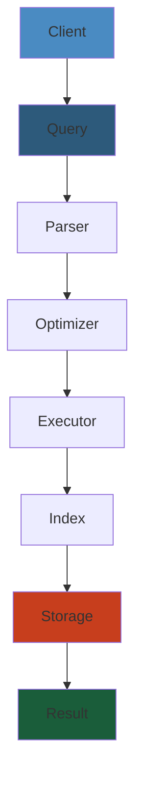

# Distributed Message Queue — Production-Grade Design




## Table of Contents
1. Architecture Overview
2. Topics, Partitions, Producers & Consumers
3. Storage Layer (Append-Only Log)
4. Segment Files & Indexing
5. Replication & ISR
6. Delivery Semantics
7. Performance Optimizations
8. Cluster Coordination
9. Partition Reassignment & Preferred Leader
10. Production Operations

---

## 1. Architecture Overview

A distributed message queue is a fault-tolerant, horizontally scalable platform for publishing and subscribing to ordered streams of records.

### Core Components

```
┌─────────────────────────────────────────────────────────┐
│                     Clients                              │
│  Producers (publishing)     Consumers (subscribing)     │
│  ├─ App A ────▶            │  ├─ App X ◀────           │
│  ├─ App B ────▶            │  ├─ App Y ◀────           │
│  └─ App C ────▶            │  └─ App Z ◀────           │
└────────────────────┬────────────────────────────────────┘
                     │ TCP/TLS
┌────────────────────▼────────────────────────────────────┐
│                   Brokers (Cluster)                     │
│                                                         │
│  ┌──────────────┐  ┌──────────────┐  ┌──────────────┐  │
│  │   Broker 1   │  │   Broker 2   │  │   Broker 3   │  │
│  │  (Controller)│  │              │  │              │  │
│  ├──────────────┤  ├──────────────┤  ├──────────────┤  │
│  │ Partition 0  │  │ Partition 0  │  │ Partition 1  │  │
│  │   (Leader)   │  │   (Follower) │  │   (Leader)   │  │
│  │ Partition 2  │  │ Partition 1  │  │ Partition 2  │  │
│  │   (Follower) │  │   (Follower) │  │   (Leader)   │  │
│  └──────────────┘  └──────────────┘  └──────────────┘  │
│                                                         │
│  ZooKeeper / KRaft (metadata, leader election)          │
└─────────────────────────────────────────────────────────┘
```

### Design Goals

| Goal | Approach |
|------|----------|
| High throughput (1M+ msg/s) | Batching, zero-copy, page cache, sequential I/O |
| Durability | Append-only log with replication |
| Ordering | Per-partition ordering guarantee |
| Scalability | Partition parallelism, horizontal scale-out |
| Fault tolerance | Replication, ISR, automatic leader election |
| Exactly-once semantics | Idempotent producers + transactional consumers |

### 1.1 Key Concepts

- **Topic**: A logical channel for messages. Analogy: a database table.
- **Partition**: An ordered, immutable sequence of messages. Each partition is a single log file on disk. Partitions are the unit of parallelism.
- **Offset**: A unique, monotonically increasing integer identifying each message within a partition.
- **Producer**: Publishes messages to a topic (optionally to a specific partition).
- **Consumer**: Reads messages from a topic, tracking offset.
- **Consumer Group**: A set of consumers that divide the partitions of a topic. Each partition is consumed by exactly one consumer in the group.
- **Broker**: A server in the cluster. Each broker hosts some partitions.
- **Controller**: One broker acts as the controller, managing partition leader elections and cluster state.

#### Step-by-Step

1. **Topic creation**: Partition data across N brokers; designate partition leaders and followers from replicas
2. **Producer routing**: Determine target partition via partitioner (round-robin, key-based, or sticky)
3. **Leader write**: Producer sends message to partition leader; leader appends to log
4. **Replication**: Leader replicates message to in-sync replicas (ISR) before returning ack
5. **Consumer group assignment**: Coordinator assigns partitions to consumers; each partition has exactly one consumer
6. **Offset tracking**: Consumer commits offset after processing; resumption starts from committed offset

#### Code Example

```python
from kafka import KafkaProducer, KafkaConsumer
from kafka.errors import KafkaError
import json

class MessageQueueExample:
    def __init__(self, brokers):
        self.producer = KafkaProducer(
            bootstrap_servers=brokers,
            value_serializer=lambda v: json.dumps(v).encode('utf-8'),
            acks='all',  # Wait for all replicas to ack
            retries=3,
            max_in_flight_requests_per_connection=1,  # Guarantee ordering
            compression_type='snappy'
        )
        
        self.consumer = KafkaConsumer(
            'orders',
            bootstrap_servers=brokers,
            group_id='order-processors',
            value_deserializer=lambda m: json.loads(m.decode('utf-8')),
            auto_offset_reset='earliest',
            enable_auto_commit=False,  # Manual offset management
            max_poll_records=100
        )
    
    def produce_order(self, order_id, order_data):
        """Publish order to partition determined by order_id key."""
        future = self.producer.send(
            'orders',
            value=order_data,
            key=str(order_id).encode('utf-8')  # Ensures same order_id → same partition
        )
        try:
            metadata = future.get(timeout=10)
            print(f"Order sent to partition {metadata.partition}, offset {metadata.offset}")
        except KafkaError as e:
            print(f"Failed to send order: {e}")
    
    def consume_orders(self):
        """Consume orders in sequence, commit after processing."""
        for message in self.consumer:
            try:
                order = message.value
                print(f"Processing order {order['id']}")
                # Process order (DB write, payment, etc.)
                self.consumer.commit()  # Commit after successful processing
            except Exception as e:
                print(f"Failed to process order: {e}")
                self.consumer.seek(message.offset)  # Retry from this offset

# Usage
queue = MessageQueueExample(['broker1:9092', 'broker2:9092', 'broker3:9092'])
queue.produce_order('ORD-12345', {'id': 'ORD-12345', 'amount': 99.99})
# In another thread:
# queue.consume_orders()
```

#### Real-World Scenario

Uber uses Kafka with 1,000+ topics and millions of messages per second. The "orders" topic has 256 partitions across 50 brokers. During surge pricing hours, order throughput spikes to 100K messages/second. Uber's order-processing consumer group has 1,000 consumer instances, each processing 100 messages/second from 4 partitions. When Uber adds new consumer instances (e.g., during Black Friday surge), cooperative rebalancing ensures only affected partitions are temporarily unavailable, not the entire group. Without this capability, adding capacity would have caused 30-second outages.

---

## 2. Topics, Partitions, Producers & Consumers

### 2.1 Topic Configuration

```
Topic {
    name: "orders"
    num_partitions: 16
    replication_factor: 3
    configs: {
        "retention.ms": 604800000,        // 7 days
        "retention.bytes": 1073741824,   // 1 GB per partition
        "cleanup.policy": "delete",      // or "compact"
        "compression.type": "producer",  // inherits producer compression
        "max.message.bytes": 1048588,    // 1 MB
        "segment.bytes": 1073741824,     // 1 GB per segment
        "segment.ms": 604800000,         // 7 days per segment
    }
}
```

### 2.2 Partition Assignment

A producer decides which partition to send a message to:

```
// Round-robin (default if no key)
def assign_partition_round_robin(topic):
    counter = atomic_increment(topic.counter)
    return counter % topic.num_partitions

// By key hash (guarantees ordering by key)
def assign_partition_by_key(topic, key):
    return murmur2_hash(key) % topic.num_partitions

// Sticky partition (maximizes batching efficiency)
// Send batches to the same partition until batch size/linger.ms triggers flush
```

**Sticky partitioner** (Kafka 2.4+): Instead of changing partition per message, the producer "sticks" to one partition for multiple messages, allowing larger batches and better compression.

### 2.3 Consumer Group Protocol

```
Consumer Group "order-processors":
    ├── Consumer-1: partitions [0, 1, 2, 3]
    ├── Consumer-2: partitions [4, 5, 6, 7]
    └── Consumer-3: partitions [8, 9, 10, 11]

    Unassigned: partitions [12, 13, 14, 15]
```

**Assignment strategies**:

1. **Range assignor**: Groups partitions by range (`[0-3]`, `[4-7]`, ...). Risk of imbalance if partitions/consumer is not evenly divisible.

2. **RoundRobin assignor**: Distributes partitions in round-robin order across consumers.

3. **Sticky assignor** (Kafka 2.3+): Maximizes partition stickiness during rebalance. When a consumer joins/leaves, the assignor minimizes partition movements.

4. **Cooperative sticky assignor** (Kafka 2.4+): Enables incremental rebalancing — only revokes a subset of partitions during rebalance, allowing the group to remain partially available.

### 2.4 Offset Management

**Consumer offset commit**:
```
// Auto-commit (default, every 5 seconds)
enable.auto.commit=true
auto.commit.interval.ms=5000

// Manual commit (exactly-once or at-least-once control)
consumer.commitSync()      // Blocking, retries indefinitely
consumer.commitAsync()     // Non-blocking, callback on completion
```

**Offset storage**: In Kafka, offsets are stored in `__consumer_offsets` internal topic (compacted, replicated).

**Offset reset**:
```
auto.offset.reset=earliest   // Start from the beginning
auto.offset.reset=latest     // Start from the end (new messages only)
auto.offset.reset=none       // Fail if no offset is found
```

---

## 3. Storage Layer (Append-Only Log)

### 3.1 Log Structure

Each partition is a directory containing segment files and index files:

```
/data/kafka/orders-0/
├── 00000000000000000000.log       # Log segment (messages 0 to N)
├── 00000000000000000000.index     # Offset-to-position index
├── 00000000000000000000.timeindex # Timestamp-to-offset index
├── 00000000000000293571.log       # Next segment (messages 293571+)
├── 00000000000000293571.index
├── 00000000000000293571.timeindex
├── leader-epoch-checkpoint
└── partition.metadata
```

### 3.2 Append-Only Log Properties

- **Writes are sequential**: New messages are always appended to the end of the active segment. This is the key to Kafka's performance — sequential disk I/O is as fast as (or faster than) random memory I/O.
- **Immutable**: Once written, messages are never modified. Deletion happens by removing entire segments.
- **O(1) reads**: Reading by offset requires a binary search on the index file, followed by a single read from the log.

### 3.3 Message Format (v2, Kafka 0.11+)

```
Batch (RecordBatch):
┌─────────────────────────────────────────────────────────────┐
│ BaseOffset: Int64 (8B)                                      │
│ BatchLength: Int32 (4B)                                     │
│ PartitionLeaderEpoch: Int32 (4B)                            │
│ Magic: Int8 (1B) — version (2 for v2)                      │
│ CRC32C: Int32 (4B)                                          │
│ Attributes: Int16 (2B)                                      │
│   bit 0: compression codec (0=none, 1=gzip, 2=snappy, ...) │
│   bit 3: timestamp type (0=create, 1=append)               │
│   bit 4: transactional (1=transactional)                   │
│   bit 5: control (1=control batch)                          │
│   bit 6-15: unused                                          │
│ LastOffsetDelta: Int32 (4B)                                 │
│ BaseTimestamp: Int64 (8B)                                   │
│ MaxTimestamp: Int64 (8B)                                    │
│ ProducerId: Int64 (8B)                                      │
│ ProducerEpoch: Int16 (2B)                                   │
│ BaseSequence: Int32 (4B)                                    │
│ Records: [Record] (variable)                                │
│   Record:                                                   │
│     Length: VarInt                                          │
│     Attributes: Int8 (1B)                                   │
│     TimestampDelta: VarInt                                  │
│     OffsetDelta: VarInt                                     │
│     Key: Bytes (VarInt length prefix)                       │
│     Value: Bytes (VarInt length prefix)                     │
│     Headers: [Header]                                       │
│       Header Key: String (VarInt length prefix)             │
│       Header Value: Bytes (VarInt length prefix)            │
└─────────────────────────────────────────────────────────────┘
```

**Batch-level compression**: Instead of compressing individual messages, Kafka compresses entire batches. This achieves much higher compression ratios.

### 3.4 Log Compaction

Compaction retains the latest value for each key, removing older duplicates. This is useful for "changelog" topics (like `__consumer_offsets`).

```
Before compaction:
Offset  Key   Value
0       k1    v1
1       k2    v2
2       k1    v3
3       k3    v4
4       k2    v5

After compaction:
4       k2    v5
3       k3    v4
2       k1    v3
```

**Cleaner process**: A background thread (`LogCleaner`) scans segments, removing obsolete records. `min.compaction.lag.ms` prevents too-frequent compaction.

**Tombstones**: A message with null value acts as a delete marker. It is retained for `delete.retention.ms` after which the cleaner removes it entirely.

---

## 4. Segment Files & Indexing

### 4.1 Log Segment Lifecycle

```
Active segment (currently being written to):
  ┌──────────────────────┐
  │ 00000000000000300000.log  │ ← producer writes here
  └──────────────────────┘

Roll conditions:
  1. segment.bytes exceeded (default 1 GB)
  2. segment.ms exceeded (default 7 days)
  3. log segment is rolled by admin request

After roll:
  Active:  00000000000000500000.log
  Sealed:  00000000000000000000.log
           00000000000000293571.log
```

### 4.2 Offset Index

Maps logical offsets to physical positions in the log file. Enables fast random access by offset.

```
00000000000000000000.index:
┌──────────────────────────────────────┐
│ RelativeOffset │ Position            │  Each entry: 8 bytes
├──────────────────────────────────────┤
│ 0              │ 0                   │
│ 8              │ 4892                │
│ 16             │ 10234               │
│ 32             │ 18723               │
│ ...            │ ...                 │
│ 293570         │ 536870912           │
└──────────────────────────────────────┘
```

- **Sparse index**: Not every message has an index entry. Default spacing: every 4096 bytes (configurable via `log.index.interval.bytes`).
- **Memory-mapped**: Index files are `mmap`'d for fast access.
- **Lookup**: Binary search on the index, then scan forward from the closest position.

### 4.3 Time Index

Maps timestamps to logical offsets. Enables searching by time (`offsetsForTimes`).

```
00000000000000000000.timeindex:
┌──────────────────────────────────────┐
│ Timestamp           │ RelativeOffset │
├──────────────────────────────────────┤
│ 1650000000000       │ 0              │
│ 1650000012000       │ 8              │
│ 1650000025000       │ 16             │
│ ...                 │ ...            │
└──────────────────────────────────────┘
```

**Time-based offset lookup**:
```
def offsets_for_times(topic, partition, target_timestamp):
    # Find segment whose base timestamp <= target_timestamp
    segment = find_segment_by_timestamp(target_timestamp)
    if segment is None:
        return None

    # Binary search in timeindex
    time_index = segment.time_index
    idx = binary_search(time_index, target_timestamp, key="timestamp")
    base_offset = segment.base_offset + time_index[idx].relative_offset

    return base_offset
```

### 4.4 Transaction Index

For exactly-once semantics, a transaction marker is appended to the log. `transaction.index` tracks the start and end of each transaction.

```
TransactionIndex:
┌────────────────────────────────────────────┐
│ TransactionalUnit:                         │
│   ProducerId: 12345                        │
│   ProducerEpoch: 3                         │
│   FirstOffset: 1000                        │
│   LastOffset: 1005                         │
│   State: Complete (or Aborted)             │
└────────────────────────────────────────────┘
```

### 4.5 Leader Epoch Cache

Tracks leadership changes to ensure data integrity. Each leader epoch records the starting offset.

```
LeaderEpochCheckpoint:
┌──────────────────────────┐
│ Epoch │ StartOffset      │
├──────────────────────────┤
│ 0     │ 0                │
│ 1     │ 500              │
│ 2     │ 750              │
│ 3     │ 1200             │
└──────────────────────────┘
```

Used to detect truncation: if a replica becomes leader, it uses the epoch cache to determine what data was committed during previous leaderships.

---

## 5. Replication & ISR

### 5.1 Leader/Follower Model

Each partition has one leader and N-1 followers (ISR = In-Sync Replicas). Writes go to the leader; consumers read from the leader.

```
Producer ──▶ Partition Leader ──▶ Follower 1 (ISR)
                                      └──▶ Follower 2 (ISR)
                                           └──▶ Follower 3 (out of sync)
```

**Replication flow**:
1. Producer sends message to partition leader
2. Leader appends to its local log
3. Leader sends the message to all ISR followers
4. Followers acknowledge (according to `acks` setting)
5. Leader commits the message (visible to consumers)

### 5.2 ISR (In-Sync Replicas)

The ISR is the set of followers that are fully caught up with the leader.

**ISR eligibility**:
- The follower has replicated up to the leader's high watermark
- The follower's last fetch time is within `replica.lag.time.max.ms` (default 30s)

**ISR expansion/shrinkage**:
```
ISR = {Leader, FollowerA, FollowerB}

// FollowerB slows down
if now() - FollowerB.lastFetchTime > replica.lag.time.max.ms:
    ISR.remove(FollowerB)  // ISR = {Leader, FollowerA}

// FollowerB catches up
if FollowerB.highWatermark >= Leader.highWatermark:
    ISR.add(FollowerB)     // ISR = {Leader, FollowerA, FollowerB}
```

**Unclean leader election**: If all ISR replicas are down, the leader can be elected from non-ISR replicas. This is controlled by `unclean.leader.election.enable`:
- `false` (default): Wait until an ISR replica comes back. Data safe, but may be unavailable.
- `true`: Allow any replica to become leader. Available, but may lose data.

### 5.3 Acks (0/1/all)

Controls durability guarantees:

| acks | Behavior | Durability | Latency |
|------|----------|------------|---------|
| `0` | Fire-and-forget. Leader does not acknowledge. | None. Message may be lost. | Lowest |
| `1` | Leader acknowledges after writing to its own log, before replication to followers. | Leader failure may lose messages. | Medium |
| `all` (-1) | Leader acknowledges after all ISR replicas acknowledge. | Strongest. Survives one ISR failure. | Highest |

**min.insync.replicas**: Minimum number of replicas that must acknowledge for `acks=all` to succeed.

```
min.insync.replicas = 2

// With replication factor = 3:
//   ISR has 3 replicas: produce succeeds
//   ISR has 2 replicas: produce succeeds
//   ISR has 1 replica:  produce fails with NotEnoughReplicasException
```

**Recommended configuration**: `acks=all`, `min.insync.replicas=2`, `replication.factor=3`.

### 5.4 High Watermark & Leader Epoch

**High watermark (HW)**: The offset up to which all replicas in the ISR have been replicated. Consumers can only read up to the high watermark.

```
Leader Log:
                   ┌─────────────────────────────┐
Offset: ... 100 101│102 103 104 105 106 107 108 │
                   │           ↑                 │
                   │     High watermark          │
                   │ (committed to ISR)          │
                   └─────────────────────────────┘

Messages after HW are "uncommitted" — not visible to consumers.
```

**Last stable offset (LSO)**: For transactional messages, LSO is the offset before the first open transaction. Messages between LSO and HW may be aborted and should be filtered out.

---

## 6. Delivery Semantics

### 6.1 At-Most-Once

**Process**: Fire and forget. Send message, don't wait for acknowledgment.

```
producer.send(record)  // No callback, no future.get()
```

**Failure case**: Message is lost if the broker fails before persisting.

**Use case**: Telemetry, logging (loss is acceptable).

### 6.2 At-Least-Once

**Process**: Wait for acknowledgment, retry on failure.

```
producer.send(record, callback=(metadata, exception) -> {
    if exception:
        retry(record)
})
```

**Failure case**: Producer receives a timeout, retries, and the broker committed the first attempt after the timeout — message is duplicated.

**Consumer impact**: Consumer may process the same message twice if it crashes after processing but before committing the offset.

**Mitigation**: Consumer must be **idempotent** (same message processed twice produces the same result).

### 6.3 Exactly-Once

Achieved through a combination of:

1. **Idempotent producer** (`enable.idempotence=true`):
   - Each producer gets a unique `ProducerId` (PID)
   - Each message batch has a monotonically increasing sequence number
   - Broker deduplicates by `(ProducerId, sequence_number)`
   - Prevents duplication within a single producer session

2. **Transactional producer**:
   ```
   producer.initTransactions()
   producer.beginTransaction()
   producer.send(record1)
   producer.send(record2)
   producer.commitTransaction()
   // On failure: producer.abortTransaction()
   ```

3. **Transactional consumer** (`isolation.level=read_committed`):
   - Consumer filters out aborted messages
   - Consumer commits its offset within the same transaction
   - Atomic "processing + offset commit"

**Exactly-once end-to-end**:
```
// Producer side — atomic produce to multiple partitions
producer.beginTransaction()
producer.send(topic1, record)
producer.send(topic2, record)
producer.commitTransaction()

// Consumer side — store offset in the same transaction
consumer.poll()
for record in records:
    process(record)
consumer.commitTransaction()  // Stores offset in __consumer_offsets
```

**EOS limitations**:
- Transaction timeout (`transaction.max.timeout.ms`, default 15min)
- 5 concurrent transactional producers per consumer group member
- Aborted transactions leave gaps in the log (filtered by `read_committed` consumers)

### 6.4 Push vs. Pull

Kafka uses **pull-based consumption** (consumers fetch from the leader):

| Property | Pull | Push |
|----------|------|------|
| Consumer pace | Consumer controls rate | Broker controls rate (may overwhelm slow consumers) |
| Batching | Natural (fetch many at once) | Harder to batch |
| Implementation | Simpler consumer | Need backpressure |
| End-to-end latency | Can be higher (poll interval) | Lower |

**Poll loop**:
```
while (true):
    records = consumer.poll(Duration.ofMillis(100))
    for record in records:
        process(record)
    consumer.commitAsync()
```

---

## 7. Performance Optimizations

### 7.1 Zero-Copy (sendfile)

Traditional read + write involves copying data 4 times between kernel space and user space:

```
Traditional read/write:
  1. Disk → Kernel buffer (DMA)
  2. Kernel buffer → Application buffer (CPU copy)
  3. Application buffer → Socket buffer (CPU copy)
  4. Socket buffer → NIC buffer (DMA)

Sendfile (zero-copy):
  1. Disk → Kernel buffer (DMA)
  2. Kernel buffer → Socket buffer (DMA copy, if supported)
  3. Socket buffer → NIC buffer (DMA)
```

**Kafka implementation**: When serving fetch requests, Kafka uses `FileChannel.transferTo()` (Java NIO) which calls `sendfile()` at the OS level.

```
// Java NIO zero-copy
FileChannel fileChannel = new FileInputStream("segment.log").getChannel();
fileChannel.transferTo(position, count, socketChannel);
```

**System call**:
```
sendfile(outgoing_socket, segment_fd, offset, count);
```

This avoids copying the data into the Java heap, saving CPU and reducing GC pressure. For Kafka, this is the single most impactful optimization.

### 7.2 Page Cache

Kafka relies on the OS page cache rather than implementing its own cache.

**Write path**:
```
Producer → Page Cache (in-memory) → Disk (async flush)
                │
        Consumer reads from here
```

**Advantages**:
- No JVM heap overhead for cached data
- Automatic memory management (OS eviction policy)
- No GC pauses for data cache
- Warm cache after broker restart (disk-backed)

**Trade-off**: Kafka's data is in the page cache, not in the JVM. JVM heap is used only for the application objects (connections, state machines, metadata).

**Page cache tuning**:
```
# Linux: reserve 30% of RAM for page cache
vm.dirty_ratio = 30
vm.dirty_background_ratio = 5

# Kafka config: flush to disk periodically (don't force with fsync)
flush.messages = 9223372036854775807  # Essentially never
flush.ms = 9223372036854775807
```

### 7.3 Batch Compression

Compression reduces network bandwidth and disk usage. Compression happens at the **batch level** (not message level).

```
def compress_batch(batch, compression_type):
    if compression_type == "gzip":
        return gzip.compress(batch.serialize())
    elif compression_type == "snappy":
        return snappy.compress(batch.serialize())
    elif compression_type == "lz4":
        return lz4.compress(batch.serialize())
    elif compression_type == "zstd":
        return zstd.compress(batch.serialize())
    else:
        return batch.serialize()
```

**Compression ratios** (varies by data):

| Codec | Ratio (text) | Ratio (JSON) | CPU | Notes |
|-------|:-----------:|:-----------:|:---:|-------|
| None | 1.0x | 1.0x | Low | |
| Gzip | 3-4x | 5-8x | High | Best ratio |
| Snappy | 2x | 2-3x | Low | Good balance |
| LZ4 | 2x | 2-3x | Low | Slightly faster than Snappy |
| Zstd | 3-5x | 5-10x | Medium | Best ratio/speed trade-off |

**Recommendation**: Use Zstd for most workloads (level 3). Use Gzip for archival/long-term storage. Use LZ4 when CPU is the bottleneck.

### 7.4 Batching

Kafka producers batch messages before sending:

```
Producer config:
  batch.size = 16384       # 16 KB default, aim for 64-512 KB
  linger.ms = 0            # Wait max N ms before sending
  compression.type = zstd
  buffer.memory = 33554432 # 32 MB total buffer
```

**Batching flow**:
```
Producer.send(record):
    1. Serialize record (key + value + headers)
    2. Find partition
    3. Accumulator: add to batch for (topic, partition)
    4. If batch is full (>= batch.size) or linger.ms exceeded:
           Sender thread picks up the batch
           Compress the batch
           Send to leader

Sender thread (background):
    while (true):
        batches = accumulator.ready_batches()
        for (broker, node_batches) in group_by_broker(batches):
            request = ProduceRequest(node_batches)
            send(request)
            wait_for_response()
            accumulator.deallocate(batches)
```

**Effect of batching**:
- Without batching: 1 request per message = 1000 msg/s per connection
- With batching (1000 msg/batch): 1 request per 1000 messages = 1M msg/s per connection

### 7.5 Memory Management

**Broker JVM heap**:
- Kafka brokers need modest heap (4-8 GB typically)
- Most data lives in page cache (outside JVM)
- Large heaps cause GC pauses
- Use G1GC with tuned pause target

```
KAFKA_HEAP_OPTS="-Xms4g -Xmx4g"
KAFKA_JVM_PERFORMANCE_OPTS="-XX:+UseG1GC -XX:MaxGCPauseMillis=20"
```

**Producer memory**:
- `buffer.memory`: Total memory for buffering (default 32 MB)
- Controlled by `max.in.flight.requests.per.connection` (default 5)
- If buffer is full, producer blocks or throws `BufferExhaustedException`

**Consumer memory**:
- `fetch.max.bytes`: Maximum bytes per fetch request (default 50 MB)
- `max.partition.fetch.bytes`: Maximum per-partition (default 1 MB)
- `max.poll.records`: Maximum records per poll (default 500)

---

## 8. Cluster Coordination

### 8.1 Controller Election

One broker in the cluster acts as the **controller**, responsible for partition leader elections and cluster metadata.

**Election process** (using ZooKeeper or KRaft):

```
ZooKeeper approach:
  1. Each broker tries to create /controller ephemeral node
  2. First one succeeds → becomes controller
  3. Others watch /controller for deletion
  4. On controller failure: ephemeral node disappears
  5. Remaining brokers compete via /controller creation

KRaft approach (Kafka 2.8+, production 3.3+):
  - Uses Raft-based consensus protocol
  - Controllers are a quorum of nodes (odd number)
  - No ZooKeeper dependency
  - Controllers write metadata to a metadata log
```

**Controller responsibilities**:
- Monitor broker liveness (ZooKeeper watches or KRaft heartbeats)
- Elect partition leaders
- Trigger partition reassignments
- Propagate metadata changes to all brokers

### 8.2 Metadata Propagation

When controller changes partition leaders:

```
Controller:
  1. Determine new leader for partition P
  2. Update metadata in ZooKeeper/KRaft
  3. Send LeaderAndIsr request to affected brokers
  4. Brokers update their metadata cache
  5. Producer/Consumer requests to old leader get NOT_LEADER error
  6. Client refreshes metadata from any broker
  7. Client sends subsequent requests to new leader
```

**Metadata request**: Clients send `MetadataRequest` to any broker, which returns:
- List of brokers (host, port, rack)
- Topic metadata (partitions, leaders, ISR)

### 8.3 Consumer Group Rebalancing

When consumers join/leave a group, a rebalance redistributes partitions.

**Rebalance protocol (eager)**:
```
1. Consumer subscribes to topic
2. Consumer sends JoinGroup request to group coordinator
3. Coordinator collects all JoinGroup requests (or times out)
4. Coordinator selects leader among consumers
5. Leader computes partition assignment
6. Leader sends SyncGroup with assignment
7. Coordinator distributes assignment to all consumers
8. Each consumer gets its assigned partitions
9. Consumers start fetching
```

**Incremental cooperative rebalancing** (Kafka 2.4+):
```
1. Consumer joins → coordinator triggers rebalance
2. Current consumers revoke SOME partitions (not all)
3. Coordinator collects new assignments
4. Only the revoked partitions are reassigned
5. Other partitions continue processing uninterrupted
```

**Rebalance tuning**:
```
Consumer config:
  session.timeout.ms = 45000       # Default 45s
  heartbeat.interval.ms = 3000     # Default 3s
  max.poll.interval.ms = 300000    # Default 5min
  group.initial.rebalance.delay.ms = 3000  # Default 3s
  cooperative.rebalance.enable = true
```

---

## 9. Partition Reassignment & Preferred Leader

### 9.1 Partition Reassignment

Moving partitions between brokers for load balancing, scaling, or decommissioning.

**Reassignment process**:
```
# Trigger reassignment
bin/kafka-reassign-partitions.sh --zookeeper zk:2181 \
  --reassignment-json-file increase-replication-factor.json --execute

# Reassignment JSON
{
  "version": 1,
  "partitions": [
    {"topic": "orders", "partition": 0,
     "replicas": [1, 2, 3], "log_dirs": ["/data1", "/data2", "/data3"]}
  ]
}
```

**Internal reassignment process**:
```
1. Controller creates reassignment state
2. New replicas join ISR (start fetching)
3. Controller adds new replicas to ISR
4. Controller removes old replicas from ISR
5. Data is deleted from old replicas
6. Reassignment complete
```

**Throttling reassignments**:
```
# Reassignment throttle (total across all reassignments)
leader.replication.throttled.rate = 100000000  # 100 MB/s
follower.replication.throttled.rate = 100000000
```

### 9.2 Preferred Leader

The preferred leader is the first replica in the replica list for a partition. It is typically the replica that was originally assigned the partition leadership.

**Leader rebalance**:
```
bin/kafka-leader-election.sh --bootstrap-server broker:9092 \
  --election-type preferred --all-topic-partitions
```

**Automatic preferred leader election** (not recommended for production):
```
auto.leader.rebalance.enable = true  # Default false
leader.imbalance.check.interval.seconds = 300
leader.imbalance.per.broker.percentage = 10
```

**Why automatic is disabled by default**: Switching leader causes a brief unavailability and metadata propagation. It's better to do it during low-traffic windows.

### 9.3 Rack Awareness

```
Broker config:
  broker.rack = us-east-1a

Topic config:
  replica.selector.class = org.apache.kafka.common.replica.RackAwareReplicaSelector
```

With rack-aware placement, replicas of a partition are distributed across different racks:

```
Topic "orders", replication.factor=3:
  Partition 0: leader=rack-a, follower=rack-b, follower=rack-c
  Partition 1: leader=rack-b, follower=rack-c, follower=rack-a
  Partition 2: leader=rack-c, follower=rack-a, follower=rack-b
```

Consumers prefer reading from the closest replica (same rack) to reduce cross-rack bandwidth and latency.

---

## 10. Production Operations

### 10.1 Lag Monitoring

Consumer lag = (producer offset) - (consumer offset). High lag means consumers are falling behind.

**Monitoring**:
```
bin/kafka-consumer-groups.sh --bootstrap-server broker:9092 \
  --group order-processors --describe

GROUP               TOPIC   PARTITION  CURRENT-OFFSET  LOG-END-OFFSET  LAG
order-processors    orders  0          150000          215000          65000
order-processors    orders  1          125000          180000          55000
order-processors    orders  2          175000          210000          35000
```

**Lag causes**:
- Under-provisioned consumers (too few consumers for partition count)
- Slow processing (non-optimized consumer code)
- Hot partitions (one partition has drastically more data)
- Network bandwidth limitations
- Consumer GC pauses

**Lag alerting**:
```
Alert if: max_lag > threshold AND lag_increasing_trend
Threshold: depends on tolerance (5 minutes of backlog = lag * avg_message_size / consume_rate)
```

### 10.2 Quota & Throttling

Kafka supports quotas on produce/fetch throughput and request rate:

```
# Dynamic per-client-id quotas
bin/kafka-configs.sh --bootstrap-server broker:9092 \
  --entity-type clients --entity-name clientA \
  --alter --add-config 'producer_byte_rate=1024,consumer_byte_rate=2048'

# Request rate quota (protects broker CPU)
# request_percentage quota (default 100%)
```

**Quota enforcement**:
```
1. Broker measures byte rate for each (client-id, producer/consumer)
2. If rate exceeds quota, broker throttles by delaying response
3. Throttle time is calculated based on how much the client exceeded the quota
4. Client sees increased latency, auto-adjusts send rate
```

**Quota types**:
| Quota | Scope | Default | Purpose |
|-------|-------|---------|---------|
| `producer_byte_rate` | (user, client-id) | None | Write throughput |
| `consumer_byte_rate` | (user, client-id) | None | Read throughput |
| `request_percentage` | (user, client-id) | 100% | Request rate |

### 10.3 Monitoring & Metrics

**JMX metrics**:

| Category | Metric | What it tells |
|----------|--------|---------------|
| Broker | `kafka.server:type=BrokerTopicMetrics,name=MessagesInPerSec` | Incoming message rate |
| Broker | `kafka.server:type=BrokerTopicMetrics,name=TotalFetchRequestsPerSec` | Fetch request rate |
| Partition | `kafka.server:type=Partition,name=UnderReplicatedPartitions` | Replication lag |
| Partition | `kafka.server:type=Partition,name=OfflinePartitions` | Partitions without leader |
| Partition | `kafka.server:type=ReplicaManager,name=LeaderCount` | Leadership balance |
| Request | `kafka.network:type=RequestMetrics,name=RequestsPerSec,request=Produce` | Request rate |
| Request | `kafka.network:type=RequestMetrics,name=TotalTimeMs,request=Produce` | P99 latency |
| Log | `kafka.log:type=Log,name=Size,partition=...topic...` | Partition size |
| Controller | `kafka.controller:type=KafkaController,name=ActiveControllerCount` | Controller up |

### 10.4 Failure Scenarios

| Scenario | Impact | Mitigation |
|----------|--------|------------|
| Broker crash | Partitions on that broker lose leader | Controller re-elects leaders from ISR |
| Disk failure | All partition data lost | Replication factor >= 2, data on separate disks |
| Network partition | Split cluster, inconsistent metadata | Quorum-based controller election |
| Full GC (broker) | Broker unresponsive, removed from ISR | Tune GC, reduce heap, use G1GC |
| Client OOM | Producer/consumer crashes | Tune buffer sizes, monitor heap |
| ZK/KRaft failure | Controller unavailable | Deploy 3/5 nodes, use dedicated hardware |
| Slow consumer | Unbounded log growth, disk full | Monitor lag, increase partitions, tune retention |

### 10.5 Performance Tuning

**Broker tuning**:

```
# Log
log.flush.interval.messages = Long.MAX_VALUE  # Let OS manage disk writes
log.flush.interval.ms = Long.MAX_VALUE
log.segment.bytes = 1073741824   # 1 GB
log.segment.ms = 604800000       # 7 days
log.retention.bytes = -1         # Infinite (topic-level override)
log.retention.hours = 168        # 7 days

# Network
num.network.threads = 8          # = number of CPUs
num.io.threads = 16              # 2x CPUs for disk I/O
socket.send.buffer.bytes = 131072   # 128 KB
socket.receive.buffer.bytes = 131072
socket.request.max.bytes = 104857600  # 100 MB

# Replication
replica.fetch.min.bytes = 1
replica.fetch.max.bytes = 10485760    # 10 MB
replica.fetch.response.max.bytes = 104857600  # 100 MB
replica.fetch.wait.max.ms = 500

# Compression
compression.type = zstd       # Topic-level
message.max.bytes = 1048588   # 1 MB (must match replica.fetch.max.bytes)
```

**Producer tuning**:

```
acks = all                         # Strongest durability
batch.size = 262144                # 256 KB
linger.ms = 10                     # 10 ms to accumulate batch
compression.type = zstd            # Compress batches
max.in.flight.requests.per.connection = 5
enable.idempotence = true
buffer.memory = 134217728         # 128 MB
retries = 2147483647              # Retry forever
delivery.timeout.ms = 120000      # 2 minutes
```

**Consumer tuning**:

```
fetch.min.bytes = 1
fetch.max.wait.ms = 500           # Max wait for batch
max.partition.fetch.bytes = 1048576  # 1 MB per partition
enable.auto.commit = false         # Manual commit for control
auto.offset.reset = earliest
isolation.level = read_committed  # For EOS
max.poll.records = 500            # Tune based on processing time
session.timeout.ms = 45000
heartbeat.interval.ms = 3000
max.poll.interval.ms = 300000
partition.assignment.strategy = cooperative-sticky
```

### 10.6 Capacity Planning

**Throughput calculation**:
```
Given:
  Message size: 10 KB
  Desired throughput: 100 MB/s = 10,000 msg/s
  Replication factor: 3

Network bandwidth per broker:
  Write: 100 MB/s
  Read:  100 MB/s (assuming balanced consume)
  Replication: 200 MB/s (one copy written, one sent to each follower)

  Total: ~400 MB/s per broker
  NIC requirement: 10 Gbps (1.25 GB/s theoretical, ~800 MB/s realistic)
```

**Partition count**:
```
Rule of thumb:
  - Total partitions = (expected throughput) / (throughput per partition)
  - Throughput per partition = f(disk sequential write speed, batch size)
  - With 10 KB messages and 256 KB batches: ~25 msgs/batch
  - With 10 ms linger: ~2500 msgs/s per partition
  - For 10,000 msgs/s: need 4 partitions
  - Each partition adds memory overhead (~100 bytes per replica)
  - Kafka recommended: < 10,000 partitions per cluster
  - Maximum tested: ~200,000 partitions (with sufficient memory)
```

**Disk space**:
```
Daily data volume = throughput * retention * replication_factor
Example:
  100 MB/s * 86400 s/day * 7 days * 3x replication
  = 181,440 GB ≈ 181 TB

Recommendation: 4-8 TB NVMe SSDs per broker, RAID 10
```

---

## References

- Apache Kafka documentation: `kafka.apache.org/documentation`
- Kafka source code: `github.com/apache/kafka`
- KIP-392: Allow consumers to fetch from closest replica
- KIP-479: Idempotent producer and EOS improvements
- KIP-588: Allow producers to recover from expired producer IDs
- Jay Kreps, "The Log: What every software engineer should know about real-time data's unifying abstraction"
- "Kafka: The Definitive Guide" by Neha Narkhede, Gwen Shapira, Todd Palino
