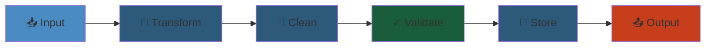

# Workflow Engine — Production-Grade Design




## Table of Contents
1. Architecture Overview
2. Workflow State Machine
3. Decision & Activity Tasks
4. History Service & Event Sourcing
5. Deterministic Replay
6. Retry & Timeout Policies
7. Saga Pattern & Compensation
8. Cron Scheduling
9. Production Operations

---

## 1. Architecture Overview

A workflow engine orchestrates long-running, fault-tolerant business processes. It decouples workflow logic (the "what") from execution (the "how").

### Core Components

```
┌─────────────────────────────────────────────────────────────────────┐
│                         Client Layer                                │
│  SDK (Java/Go/Python/TS) │ CLI │ Dashboard │ gRPC/REST API         │
└────────────────────────────────┬────────────────────────────────────┘
                                 │
┌────────────────────────────────▼────────────────────────────────────┐
│                      Frontend / Gateway                             │
│  Rate limiting │ Auth │ Request validation │ Task routing           │
└────────────────────────────────┬────────────────────────────────────┘
                                 │
┌────────────────────────────────▼────────────────────────────────────┐
│                    Workflow Service (Stateless)                     │
│                                                                     │
│  ┌──────────────┐  ┌──────────────┐  ┌──────────────┐             │
│  │  Workflow    │  │  Decision    │  │  Matching    │             │
│  │  Executor    │  │  Matcher     │  │  Service     │             │
│  └──────┬───────┘  └──────┬───────┘  └──────┬───────┘             │
│         │                 │                  │                      │
│         └─────────────────┼──────────────────┘                      │
│                           ▼                                         │
│  ┌──────────────────────────────────────────┐                      │
│  │         History Service                   │                      │
│  │  (Event Sourcing & Deterministic Replay) │                      │
│  └──────────────────────────────────────────┘                      │
└────────────────────────────────┬────────────────────────────────────┘
                                 │
┌────────────────────────────────▼────────────────────────────────────┐
│                    Persistence Layer                                │
│  Database (Cassandra/PostgreSQL/MySQL) │ Blob Store (S3/GCS)       │
│  Sharded by workflow_id │ Event ordering │ Optimistic locking      │
└─────────────────────────────────────────────────────────────────────┘
                                 │
┌────────────────────────────────▼────────────────────────────────────┐
│                     Worker Layer                                    │
│  Activity Workers (execute tasks) │ Workflow Workers (replay)      │
│  Poll for tasks from Task Queues │ Heartbeat │ Report completion   │
└─────────────────────────────────────────────────────────────────────┘
```

### Design Goals

| Goal | Approach |
|------|----------|
| Durability | Event-sourced workflow state, no in-memory state loss |
| Scalability | Stateless workflow service, partitionable task queues |
| Fault tolerance | Deterministic replay, retries, saga compensation |
| Long-running | Supports workflows spanning days/weeks/months |
| Observability | Complete history of every workflow execution |

### 1.1 Key Concepts

- **Workflow**: A state machine defining a business process (e.g., order fulfillment, subscription onboarding).
- **Workflow Execution**: A single instance of a workflow, identified by a unique `workflow_id`.
- **Activity**: A single unit of work (e.g., charge credit card, send email). Activities are where side effects happen.
- **Decision**: A logical step in the workflow that determines the next state based on activity results.
- **Task**: A unit of work dispatched to a worker. Two types: ActivityTask and DecisionTask.
- **Task Queue**: A queue used to route tasks to workers. Workers poll specific queues.
- **History**: An append-only log of events for a workflow execution. The source of truth.

---

## 2. Workflow State Machine

### 2.1 State Machine Definition

A workflow is modeled as a deterministic state machine. Transitions are triggered by events (activity completion, timer, signal, external message).

```
┌─────────┐    Start    ┌──────────┐
│ Created │────────────▶│ Running  │
└────┬────┘             └────┬─────┘
     │                       │
     │                       │ Activity failure (retryable)
     │                       ▼
     │                 ┌──────────┐
     │                 │ Retrying │◀────────── Exponential backoff
     │                 └────┬─────┘
     │                      │ Max retries exceeded
     │                      ▼
     │                 ┌──────────┐
     │────────────────▶│ Failed   │
     │                 └──────────┘
     │
     │ All activities complete
     ▼
┌──────────┐    Compensate    ┌──────────────┐
│Completed │◀─────────────────│ Compensating │
└──────────┘                  └──────┬───────┘
                                     │
                                     ▼
                               ┌──────────┐
                               │ Rolled   │
                               │ Back     │
                               └──────────┘

Additional states: Paused, Cancelled, TimedOut, ContinuedAsNew
```

### 2.2 Workflow Definition (SDK Example)

```
class OrderWorkflow implements Workflow {
    private final OrderActivities activities = Workflow.newActivityStub(OrderActivities.class);

    @Override
    public OrderResult execute(OrderInput input) {
        // Step 1: Validate order
        ValidationResult validation = activities.validateOrder(input.getOrderId());

        // Step 2: Reserve inventory
        ReservationResult reservation = activities.reserveInventory(
            input.getOrderId(), input.getItems()
        );

        // Step 3: Process payment (with retry)
        PaymentResult payment = activities.processPayment(
            input.getOrderId(), input.getTotalAmount()
        );

        // Step 4: Schedule shipment
        ShipmentResult shipment = activities.scheduleShipment(
            input.getOrderId(), input.getShippingAddress()
        );

        return new OrderResult(shipment.getTrackingNumber());
    }
}
```

### 2.3 Workflow Execution Flow

```
Client                                    Workflow Service                         Worker
  │                                              │                                  │
  │  1. StartWorkflow(OrderWorkflow, input)      │                                  │
  │─────────────────────────────────────────────▶│                                  │
  │                                              │                                  │
  │                                              │  2. Persist event:               │
  │                                              │     WorkflowExecutionStarted     │
  │                                              │                                  │
  │                                              │  3. Schedule DecisionTask        │
  │                                              │     on TaskQueue "orders"        │
  │                                              │─────────────────────────────────▶│
  │                                              │                                  │
  │                                              │  4. PollForDecisionTask          │
  │                                              │◀─────────────────────────────────│
  │                                              │                                  │
  │                                              │  5. Return DecisionTask          │
  │                                              │─────────────────────────────────▶│
  │                                              │                                  │
  │                                              │  6. Replay history to determine  │
  │                                              │     next step (execute workflow  │
  │                                              │     code deterministically)      │
  │                                              │                                  │
  │                                              │  7. Schedule ActivityTask        │
  │                                              │     (validateOrder)              │
  │                                              │─────────────────────────────────▶│
  │                                              │                                  │
  │                                              │  8. PollForActivityTask          │
  │                                              │◀─────────────────────────────────│
  │                                              │                                  │
  │                                              │  9. Execute activity             │
  │                                              │     (side effect: call DB/api)   │
  │                                              │                                  │
  │                                              │ 10. RespondActivityTaskCompleted │
  │                                              │─────────────────────────────────▶│
  │                                              │                                  │
  │                                              │ 11. Persist event:               │
  │                                              │     ActivityTaskCompleted        │
  │                                              │                                  │
  │                                              │ 12. Schedule next DecisionTask   │
  │                                              │─────────────────────────────────▶│
  │                                              │                                  │
  │                                              │ ...repeat until workflow done    │
  │                                              │                                  │
  │ 13. PollForWorkflowExecutionResult           │                                  │
  │◀─────────────────────────────────────────────│                                  │
```

---

## 3. Decision & Activity Tasks

### 3.1 DecisionTask

A DecisionTask is dispatched to a workflow worker to determine the next step. The worker replays history and executes workflow code deterministically.

```
DecisionTask {
    task_token: String (opaque, used for completion)
    workflow_id: String
    history: List<HistoryEvent> (full event history)
    previous_started_event_id: Int64
    next_event_id: Int64
    task_queue: String
}

// DecisionTask processing
def process_decision_task(task):
    # Execute workflow code deterministically
    # Workflow code reads history (not real time)
    # Decisions generated: schedule activity, start timer, etc.

    decisions = []

    # Workflow replays history
    workflow = create_workflow_instance(task.workflow_type)
    workflow.set_history(task.history)
    result = workflow.execute(task.input)

    # Collect decisions made during execution
    for decision in workflow.drain_decisions():
        decisions.append(decision)

    # Complete decision task with decisions
    respondDecisionTaskCompleted(task_token, decisions)
```

**Decision types**:
- `ScheduleActivityTaskDecision`: Start an activity
- `StartTimerDecision`: Start a timer (for delays, timeouts)
- `CompleteWorkflowExecutionDecision`: Workflow finished
- `FailWorkflowExecutionDecision`: Workflow failed
- `ContinueAsNewDecision`: Workflow exceeded history size, continue fresh
- `SignalExternalWorkflowDecision`: Send signal to another workflow
- `StartChildWorkflowExecutionDecision`: Start sub-workflow
- `RequestCancelExternalWorkflowExecutionDecision`: Cancel another workflow
- `MarkerRecordedDecision`: Record a marker (internal use)
- `CancelTimerDecision`: Cancel a previously started timer

### 3.2 ActivityTask

An ActivityTask is dispatched to an activity worker to execute a side effect.

```
ActivityTask {
    task_token: String
    activity_type: String
    input: bytes (serialized)
    task_queue: String
    heartbeat_timeout: Duration?  // For long-running activities
    schedule_to_close_timeout: Duration
    schedule_to_start_timeout: Duration
    start_to_close_timeout: Duration
}

// Activity processing
def process_activity_task(task):
    try:
        activity = registry.get_activity(task.activity_type)
        result = activity.execute(task.input)
        respondActivityTaskCompleted(task.token, result)
    except Exception as e:
        if is_retryable(e):
            respondActivityTaskFailed(task.token, e, retryable=true)
        else:
            respondActivityTaskFailed(task.token, e, retryable=false)
```

**Timeout schema**:
```
          schedule_to_close_timeout
├──────────────────────────────────────────────────────┤

schedule_to_start    start_to_close
├───────────┤├─────────────────────────────────────────┤

now     task queued         task started        task completed
```

### 3.3 Task Queues & Routing

Task queues route tasks to specific worker pools.

```
┌──────────────────────────────────────────────┐
│              Task Queue "orders"              │
│                                              │
│  ┌──────────┐  ┌──────────┐  ┌──────────┐  │
│  │ Decision │  │ Decision │  │ Decision │  │
│  │ Task     │  │ Task     │  │ Task     │  │
│  │ wf: A    │  │ wf: B    │  │ wf: C    │  │
│  └──────────┘  └──────────┘  └──────────┘  │
│                                              │
│  ┌──────────┐  ┌──────────┐  ┌──────────┐  │
│  │ Activity │  │ Activity │  │ Activity │  │
│  │ Task:    │  │ Task:    │  │ Task:    │  │
│  │ Validate │  │ ProcessP │  │ Ship     │  │
│  │ Order    │  │ ayment   │  │ Order    │  │
│  └──────────┘  └──────────┘  └──────────┘  │
└──────────────────────────────────────────────┘
           ▲                          ▲
           │ poll                     │ poll
     ┌─────┴─────┐            ┌───────┴───────┐
     │ Workflow  │            │  Activity     │
     │ Worker    │            │  Workers      │
     │ Pool      │            │  Pool         │
     └───────────┘            └───────────────┘
```

**Routing strategies**:
- **Single queue**: All workers share one queue (simple, but noisy neighbor risk)
- **Per-activity-type queue**: Separate queues for each activity type (granular, more overhead)
- **Per-workflow-type queue**: Isolate different workflow types
- **Weighted queues**: Workers subscribe to multiple queues with priority

---

## 4. History Service & Event Sourcing

### 4.1 Event Sourcing

Workflow state is derived entirely from an append-only event log. The workflow service never stores mutable state — it rebuilds state by replaying events.

```
Event log for workflow "order-12345":
┌────┬──────────────────────────────────────────┬────────────────────┐
│ ID │ Event Type                               │ Attributes         │
├────┼──────────────────────────────────────────┼────────────────────┤
│ 1  │ WorkflowExecutionStarted                 │ input, timeout    │
│ 2  │ DecisionTaskScheduled                    │ task_queue        │
│ 3  │ DecisionTaskStarted                      │ worker_identity   │
│ 4  │ DecisionTaskCompleted                    │ decisions:        │
│    │                                          │  [ScheduleActivity│
│    │                                          │   (validateOrder)]│
│ 5  │ ActivityTaskScheduled                    │ activity_type,    │
│    │                                          │ input, timeout    │
│ 6  │ ActivityTaskStarted                      │ worker_identity   │
│ 7  │ ActivityTaskCompleted                    │ result            │
│ 8  │ DecisionTaskScheduled                    │ task_queue        │
│ 9  │ DecisionTaskStarted                      │ worker_identity   │
│ 10 │ DecisionTaskCompleted                    │ decisions:        │
│    │                                          │  [ScheduleActivity│
│    │                                          │   (processPayment)]│
│ 11 │ ActivityTaskScheduled                    │ ...               │
│ ... │ ...                                      │ ...               │
│ N  │ WorkflowExecutionCompleted               │ result            │
└────┴──────────────────────────────────────────┴────────────────────┘
```

### 4.2 Event Types

**Lifecycle events**:
- `WorkflowExecutionStarted`
- `WorkflowExecutionCompleted`
- `WorkflowExecutionFailed`
- `WorkflowExecutionTimedOut`
- `WorkflowExecutionCanceled`
- `WorkflowExecutionContinuedAsNew`
- `WorkflowExecutionTerminated`

**Decision events**:
- `DecisionTaskScheduled`
- `DecisionTaskStarted`
- `DecisionTaskCompleted`
- `DecisionTaskTimedOut`
- `DecisionTaskFailed`

**Activity events**:
- `ActivityTaskScheduled`
- `ActivityTaskStarted`
- `ActivityTaskCompleted`
- `ActivityTaskFailed`
- `ActivityTaskTimedOut`
- `ActivityTaskCanceled`
- `ActivityTaskCancelRequested`

**Timer events**:
- `TimerStarted`
- `TimerFired`
- `TimerCanceled`

**Signal events**:
- `WorkflowExecutionSignaled`
- `WorkflowExecutionSignaledExternal`

**Child workflow events**:
- `StartChildWorkflowExecutionInitiated`
- `ChildWorkflowExecutionStarted`
- `ChildWorkflowExecutionCompleted`
- `ChildWorkflowExecutionFailed`

**Marker events**:
- `MarkerRecorded`

### 4.3 Event Storage

Events are stored in a sharded database table. The primary key is `(namespace_id, workflow_id, run_id)`.

```
CREATE TABLE history_events (
    shard_id INT NOT NULL,
    namespace_id BINARY(16) NOT NULL,
    workflow_id VARCHAR(255) NOT NULL,
    run_id BINARY(16) NOT NULL,
    event_id BIGINT NOT NULL,
    event_type INT NOT NULL,
    event_data BLOB NOT NULL,      -- Protobuf serialized
    task_queue VARCHAR(255),        -- Denormalized for queries
    created_at TIMESTAMP NOT NULL,
    PRIMARY KEY (shard_id, namespace_id, workflow_id, run_id, event_id)
);
```

**Shard ID** = `hash(workflow_id) % num_shards`. This ensures all events for a workflow go to the same shard.

**Read path**: Fetch all events for `(namespace_id, workflow_id, run_id)` ordered by `event_id`. Deliver to workflow worker for replay.

**Write path**: Append events atomically (transactional). The workflow service uses optimistic concurrency:

```
def append_events(shard, namespace, workflow_id, run_id, expected_next_id, events):
    # Optimistic locking: ensure no concurrent writes
    current_next_id = get_next_event_id(shard, namespace, workflow_id, run_id)
    if current_next_id != expected_next_id:
        raise ConflictError("Concurrent modification detected")

    batch_insert(shard, namespace, workflow_id, run_id, events)
    update_next_event_id(shard, namespace, workflow_id, run_id, expected_next_id + len(events))
```

### 4.4 History Size Limits

Workflows can run for months, accumulating large histories. Limits:
- Default: 50,000 events per workflow execution
- Max: Configurable (200,000 typically, more with `ContinueAsNew`)

**ContinueAsNew**: When a workflow approaches the event limit, it can "continue as new":
```
def process_long_running_workflow():
    counter = 0
    while True:
        result = activities.processBatch(counter)
        counter = result.getNextCounter()
        if counter >= MAX_COUNT:
            break
        # Continue as new every 10,000 iterations
        if counter % 10000 == 0:
            Workflow.continueAsNew(ProcessBatchWorkflow::new, counter)
```

This creates a new `run_id` with a fresh event history, carrying forward only the necessary state.

---

## 5. Deterministic Replay

### 5.1 The Replay Guarantee

Workflow code must be **deterministic**: given the same history, it must produce the same decisions every time. This enables recovery after failure.

```
Non-deterministic code (FORBIDDEN):

LocalDateTime.now()                 // Different on replay
new Random().nextInt()              // Different on replay
UUID.randomUUID()                   // Different on replay
System.currentTimeMillis()          // Different on replay
Thread.sleep(1000)                  // Different timing
HashMap() (iteration order)         // May vary (use LinkedHashMap)
AtomicInteger.get()                 // Shared state
Network call in workflow code      // May timeout/fail differently
```

**Deterministic alternatives**:
```
// Use workflow.timeNow() instead of System.currentTimeMillis()
Workflow.currentTimeMillis()

// Use workflow.randomUUID() instead of UUID.randomUUID()
Workflow.randomUUID()

// Use workflow.sleep() instead of Thread.sleep()
Workflow.sleep(Duration.ofSeconds(1))

// Use workflow.newLinkedHashMap() instead of new HashMap<>()
Workflow.newLinkedHashMap()
```

### 5.2 Replay Algorithm

```
def replay_workflow(history):
    # Create fresh workflow instance
    workflow = create_workflow_instance(workflow_type)
    workflow.init()

    # Wire up the replay-aware context
    context = ReplayContext(history)
    workflow.set_context(context)

    # Execute the workflow code
    # During execution, workflow calls are intercepted:
    # - ActivityStub calls check history before scheduling
    # - Timer calls check history before starting
    # - Any decision is compared to history (must match exactly)
    workflow.execute(input)

    # After execution, any new decisions (not in history) are
    # the actual decisions to execute
    return workflow.drain_new_decisions()
```

**Decision matching**: During replay, each decision the workflow code makes is checked against the recorded history:
```
# History: ActivityTaskScheduled(id=5, activity=validateOrder)
# Workflow calls: activities.validateOrder(orderId)
# → Match! The result from history event #7 is returned.

# If the workflow calls an activity that history doesn't have:
# → This is the first time executing this code.
# → The decision is recorded as new.
```

### 5.3 Cache & Replay Optimization

Replaying 50,000 events on every decision task is expensive. Optimizations:

**Sticky execution** (Temporal):
- After a decision task, the worker keeps the workflow instance in memory (cache).
- The next decision task for the same workflow is sent to the same worker.
- Only new events (since last decision) are sent — incremental replay.

```
┌──────────────┐     ┌─────────────────┐     ┌──────────────┐
│  Decision    │────▶│  Workflow       │────▶│  Decision    │
│  Task #1     │     │  Worker Cache   │     │  Task #2     │
│  (full       │     │  Instance in    │     │  (incremental│
│   history)   │     │  memory after   │     │  events only)│
└──────────────┘     │  replay         │     └──────────────┘
                     └─────────────────┘
```

**Cache eviction**: LRU, TTL-based, or both. If cache miss, full replay from history.

---

## 6. Retry & Timeout Policies

### 6.1 Retry Policy

```
RetryOptions retryOptions = RetryOptions.newBuilder()
    .setInitialInterval(Duration.ofSeconds(1))
    .setBackoffCoefficient(2.0)
    .setMaximumInterval(Duration.ofSeconds(60))
    .setMaximumAttempts(5)
    .setRetryExpiration(Duration.ofMinutes(30))
    .setDoNotRetry(NonRetryableException.class.getName())
    .build();

// Apply to activity
ActivityStub activity = Workflow.newActivityStub(
    OrderActivities.class,
    ActivityOptions.newBuilder()
        .setRetryOptions(retryOptions)
        .build()
);
```

**Backoff calculation**:
```
def compute_backoff(attempt, options):
    delay = options.initial_interval * (options.backoff_coefficient ** (attempt - 1))
    jitter = random(0, delay * options.jitter_coefficient)
    delay = min(delay + jitter, options.maximum_interval)
    return delay

# Attempt 1: 1s + jitter
# Attempt 2: 2s + jitter
# Attempt 3: 4s + jitter
# Attempt 4: 8s + jitter
# Attempt 5: 16s + jitter (capped at 60s if max_interval=60)
```

**Retry Budget**: Limit total retry time across a workflow:
```
Retry budget: max 30 minutes total
  - Attempt 1: 0-1s    (cost: 1s)
  - Attempt 2: 1-3s    (cost: 2s)
  - Attempt 3: 3-7s    (cost: 4s)
  - Attempt 4: 7-15s   (cost: 8s)
  - ... total so far: 15s
  - Budget remaining: 29m 45s
```

If `retryExpiration` is reached, the activity fails permanently regardless of remaining attempts.

### 6.2 Timeout Configuration

```
ActivityOptions options = ActivityOptions.newBuilder()
    .setScheduleToCloseTimeout(Duration.ofMinutes(5))
    .setScheduleToStartTimeout(Duration.ofMinutes(1))
    .setStartToCloseTimeout(Duration.ofMinutes(2))
    .setHeartbeatTimeout(Duration.ofSeconds(10))
    .build();
```

**Timeout interactions**:
| Timeout | Purpose | Triggers when |
|---------|---------|---------------|
| `ScheduleToClose` | Overall deadline | Time from schedule exceeds timeout |
| `ScheduleToStart` | Queue wait time | Activity stays in queue too long |
| `StartToClose` | Execution time | Activity runs longer than timeout |
| `Heartbeat` | Liveness check | No heartbeat received in interval |

**Heartbeat**: For long-running activities (e.g., processing a 1-hour video), periodic heartbeats tell the engine the activity is still alive:

```
class LongRunningActivityImpl implements LongRunningActivity {
    @Override
    public String processLargeFile(String input) {
        ActivityExecutionContext ctx = Activity.getExecutionContext();
        FileProcessor processor = new FileProcessor(input);

        for (int i = 0; i < processor.getChunkCount(); i++) {
            processor.processChunk(i);
            // Record progress — if worker crashes, new worker can resume from here
            ctx.heartbeat(i);
        }
        return processor.getResult();
    }
}
```

On worker crash, the engine schedules the activity to a new worker with the last heartbeat's progress as context.

---

## 7. Saga Pattern & Compensation

### 7.1 Saga Overview

A Saga is a sequence of local transactions where each transaction has a compensating action to undo it. Two execution models:

- **Choreography**: Each service publishes events that trigger compensations.
- **Orchestration**: A coordinator (workflow engine) manages the saga.

The workflow engine implements **orchestration-based sagas**.

### 7.2 Compensation Definition

```
class OrderSagaWorkflow implements Workflow {
    @Override
    public OrderResult execute(OrderInput input) {
        Saga saga = new Saga();
        OrderResult result;

        try {
            // Step 1: Reserve inventory (compensate: release inventory)
            saga.addCompensation(() -> activities.releaseInventory(input.getOrderId()));
            activities.reserveInventory(input.getOrderId(), input.getItems());

            // Step 2: Charge payment (compensate: refund)
            saga.addCompensation(() -> activities.refundPayment(input.getOrderId()));
            activities.chargePayment(input.getOrderId(), input.getAmount());

            // Step 3: Schedule shipment (compensate: cancel shipment)
            saga.addCompensation(() -> activities.cancelShipment(input.getOrderId()));
            String tracking = activities.scheduleShipment(input.getOrderId(), input.getAddress());

            result = new OrderResult(tracking);
        } catch (Exception e) {
            saga.compensate();  // Execute all compensations in reverse order
            throw new WorkflowException("Order failed, saga compensated", e);
        }

        return result;
    }
}
```

### 7.3 Compensation Execution

Compensations execute in **strict reverse order** (stack-based):

```
Forward execution:           Compensation order:
  reserveInventory ──┐       cancelShipment (step 3)
  chargePayment ───┬─┘  ◀──  refundPayment (step 2)
  scheduleShipment ─┘        releaseInventory (step 1)
```

**Compensation failure handling**:
```
1. refundPayment fails (service down)
2. → Workflow retries refundPayment with backoff
3. → After max retries → manual intervention needed
4. → Workflow enters "compensation failed" state
5. → Alert operators: "Order 12345 partially compensated"
6. → Operator manually completes compensation (dashboard/API)
```

### 7.4 Forward Recovery

Sometimes it's better to fix the forward path rather than roll back:

```
def processOrder(OrderInput input):
    try:
        activities.reserveInventory(input)
        activities.chargePayment(input)
        activities.scheduleShipment(input)
    except PaymentException:
        # Instead of compensating (releasing inventory),
        # try an alternative payment method
        if input.hasBackupCreditCard():
            activities.chargePaymentBackup(input)
        else:
            // Full rollback
            compensate()
            throw
```

### 7.5 Compensation vs. Retry Decision

| Scenario | Action |
|----------|--------|
| Transient failure (timeout, network) | Retry |
| Business rule violation (invalid card) | Compensate |
| Resource constraint (inventory sold out) | Compensate |
| Service unavailable (3rd party API down) | Retry then compensate |
| Data inconsistency (duplicate charge) | Compensate |

---

## 8. Cron Scheduling

### 8.1 Schedule-to-Workflow

```
// Register a cron schedule
ScheduleHandle handle = TemporalClient.getScheduleService()
    .createSchedule(
        "daily-order-report",
        Schedule.newBuilder()
            .setSpec(ScheduleSpec.newBuilder()
                .addCalendarInterval(
                    CalendarInterval.newBuilder()
                        .setHour(6)
                        .setMinute(0)
                        .setTimeZone("America/New_York")
                        .build()
                )
                .build()
            )
            .setAction(ScheduleActionStartWorkflow.newBuilder()
                .setWorkflowType("GenerateReportWorkflow")
                .setInput("daily")
                .build()
            )
            .build()
    );
```

### 8.2 Cron Expression Support

```
// Unix-style cron: seconds minutes hours day-of-month month day-of-week
// Example: 0 30 6 * * ? = every day at 6:30 AM

Calendar spec:
{
    "hour": [6],            // Run at 6 AM
    "minute": [30],
    "day_of_month": ["*"],  // Every day
    "month": ["*"],         // Every month
    "day_of_week": ["*"],    // Every day of week
    "time_zone": "UTC"
}

Advanced:
    hour: [6, 18]          // Twice a day
    day_of_week: [1, 3, 5] // Monday, Wednesday, Friday
    day_of_month: [1, 15]  // 1st and 15th
    month: [1, 7]          // January and July
```

### 8.3 Calendar-Based Triggers

```
AbstractCalendarTrigger:
  - Every N minutes/hours/days
  - Specific time every day
  - Specific day of week
  - Specific day of month
  - Specific date (one-time)
  - Nth weekday of month (e.g., second Monday)
  - Last day of month
  - Complex calendar (e.g., US business days excluding holidays)

// Holiday schedule integration
CalendarSpec calendar = CalendarSpec.newBuilder()
    .addExclusionDate(2026, 1, 1)   // New Year's Day
    .addExclusionDate(2026, 12, 25) // Christmas
    .addExclusionDateList(USFederalHolidays.getForYear(2026))
    .build();
```

### 8.4 Backfill

Running missed schedules (e.g., after a system outage):

```
// Backfill 7 days of missed daily reports
ScheduleHandle backfillHandle = client.getScheduleService()
    .backfill(
        "daily-order-report",
        BackfillRequest.newBuilder()
            .setStartTime(Instant.now().minus(Duration.ofDays(7)))
            .setEndTime(Instant.now())
            .build()
    );
```

**Backfill logic**:
1. Determine all missed intervals between start and end
2. Execute workflow for each missed interval sequentially or in parallel
3. Respect `overlap` policy (allow/deny/buffer-one)
4. Report progress

**Catchup window**:
```
If schedule is paused for 5 days:
  - Backfill creates 5 workflow runs (one per day)
  - Each run uses the scheduled date as input
  - Runs may be distributed across workers
```

---

## 9. Production Operations

### 9.1 Scaling Workers

**Horizontal scaling**: Add more worker processes. Workers are stateless — they poll for tasks, execute, and respond.

```
Python worker (minimal):
    worker = Worker(
        task_queue="orders",
        workflows=[OrderWorkflow],
        activities=[ValidateOrder, ProcessPayment, ScheduleShipment],
        workflow_task_execution_threads=100,
        activity_task_execution_threads=200,
    )

    worker.start()
```

**Worker sizing**:
```
Workflow task threads:
  - CPU-bound: ≤ (num_cores * 1.5)
  - I/O-bound: ≤ (num_cores * 10)

Activity task threads:
  - CPU-bound: ≤ (num_cores * 1.5)
  - I/O-bound: ≤ (num_cores * 20) (HTTP calls, DB queries)

Poller count:
  - 5 pollers per task queue (add ~100 threads for polling)
```

**Each worker polls multiple task queues**:
```
Worker polling:
  orders (workflow tasks)  ────▶ 5 pollers
  orders (activity tasks)  ────▶ 5 pollers
  billing (activity tasks) ────▶ 3 pollers
```

### 9.2 Task Routing

**Weighted routing**: Route tasks to specific worker pools based on criteria:

```
// Route payments to workers with PCI-compliant hosts
@ActivityMethod(taskQueue = "payment-processing")
PaymentResult processPayment(String orderId, double amount);
```

**Workflow-type routing**:
```
// Critical workflows get dedicated workers
Route: workflow_type="order-workflow" → task_queue="order-workflow"
Route: workflow_type="report-workflow" → task_queue="report-workflow"

// Priority-based routing
Route: workflow_type="order-workflow" AND priority="high"
       → task_queue="order-workflow-high-priority"
Route: workflow_type="order-workflow" AND priority="normal"
       → task_queue="order-workflow-normal"
```

**Dynamic routing**: Route based on activity input:
```
// Route to geo-specific queues
@ActivityMethod
ShipmentResult scheduleShipment(ShippingAddress address) {
    // Automatic routing: worker checks shipping region
    // System routes to "us-east-shipping" for US addresses
}
```

### 9.3 Rate Limiting

```
Rate limiting strategies:

1. Per-worker rate limiter:
    @ActivityMethod
    @RateLimit(requestsPerSecond = 10)
    EmailResult sendEmail(EmailRequest request);

2. Global rate limiter (Redis-based):
    // Use token bucket in Redis for cross-worker limits
    def send_email(request):
        rate_limiter = RateLimiter("send-email", requests_per_second=50)
        rate_limiter.acquire()
        return email_service.send(request)

3. Queued rate limiting:
    // Use separate task queue with limited workers
    WorkerOptions options = WorkerOptions.newBuilder()
        .setMaxConcurrentActivityExecutionSize(5)
        .build();
    worker = new Worker(client, "email-send-queue", options, activities);
```

**Protection tiers**:
```
Internal service A: 1000 req/s ──▶ Workflow Engine
                                          │
                                    ┌─────┴─────┐
                                    │ Per-client │
                                    │ Rate       │
                                    │ Limiter    │
                                    └─────┬─────┘
                                          │
                          ┌───────────────┼───────────────┐
                          │               │               │
                     ┌────▼────┐    ┌────▼────┐    ┌────▼────┐
                     │ Service │    │ Service │    │ Service │
                     │ A       │    │ B       │    │ C       │
                     │ 200/s   │    │ 300/s   │    │ 500/s   │
                     └─────────┘    └─────────┘    └─────────┘
```

### 9.4 Observability

**Tracing** (OpenTelemetry):
```
Workflow: order-workflow, run_id: abc-123
├─ DecisionTask #1 (validate order)
│  └─ ActivityTask: validateOrder (2.3ms)
├─ DecisionTask #2 (process payment)
│  └─ ActivityTask: processPayment (1.2s)
│     └─ HTTP POST /charge (1.1s)
├─ DecisionTask #3 (schedule shipment)
│  └─ ActivityTask: scheduleShipment (456ms)
└─ WorkflowExecutionCompleted (2.1s total)
```

**Logging**:
```
Structured logs from workflow engine:
{
  "level": "info",
  "message": "Activity task started",
  "workflow_id": "order-12345",
  "run_id": "abc-def-ghi",
  "activity_type": "processPayment",
  "task_queue": "orders",
  "worker_id": "worker-42",
  "attempt": 1,
  "duration_ms": 0
}
```

**Metrics**:

| Metric | Provider | Why |
|--------|----------|-----|
| `workflow_started_count` | Counter | Workflow start rate |
| `workflow_completed_count` | Counter | Success rate |
| `workflow_failed_count` | Counter | Failure rate |
| `workflow_execution_latency` | Histogram | P50/P95/P99 duration |
| `decision_task_latency` | Histogram | SDK replay time |
| `activity_task_latency` | Histogram | Activity exec time |
| `activity_retry_count` | Histogram | Reliability indicator |
| `pending_decision_tasks` | Gauge | Queue depth |
| `pending_activity_tasks` | Gauge | Queue depth |
| `worker_task_slots_available` | Gauge | Worker utilization |
| `sticky_cache_hit_ratio` | Gauge | Replay optimization |

**Dashboard panels**:
```
Row 1: Workflow Health
  - Workflow execution count (rate)
  - Workflow success/fail rate
  - P99 execution latency

Row 2: Activity Health
  - Activity task count by type
  - Activity failure rate by type
  - Activity P99 latency by type

Row 3: System Health
  - Pending tasks by queue
  - Worker count by queue
  - Sticky cache hit ratio
  - Database query latency
```

### 9.5 Database Considerations

**Schema design**:
```
-- Sharded by namespace_id
CREATE TABLE executions (
    namespace_id BINARY(16),
    workflow_id VARCHAR(255),
    run_id BINARY(16),
    shard_id INT,
    -- Mutable state
    state INT,  -- RUNNING, COMPLETED, FAILED, etc.
    current_run_id BINARY(16),  -- For ContinueAsNew chains
    last_event_id BIGINT,
    next_event_id BIGINT,
    last_decision_task_id BIGINT,
    task_queue VARCHAR(255),
    start_time TIMESTAMP,
    completion_time TIMESTAMP,
    input BLOB,
    result BLOB,
    memo BLOB,
    search_attributes JSON,
    PRIMARY KEY (namespace_id, workflow_id, run_id)
);

CREATE TABLE history_events (
    shard_id INT,
    namespace_id BINARY(16),
    workflow_id VARCHAR(255),
    run_id BINARY(16),
    event_id BIGINT,
    event_type INT,
    event_data BLOB,
    PRIMARY KEY (shard_id, namespace_id, workflow_id, run_id, event_id)
);

CREATE TABLE task_queues (
    shard_id INT,
    namespace_id BINARY(16),
    task_queue_name VARCHAR(255),
    task_type INT,  -- 0=Workflow, 1=Activity
    task_id BIGINT,
    task_data BLOB,
    -- Tasks are partitioned and sorted by priority/schedule_time
    PRIMARY KEY (shard_id, namespace_id, task_queue_name, task_type, task_id)
);
```

**Performance patterns**:
- Use range queries on event_id for history reads
- Partition task queues by hash for balanced distribution
- Use TTL-based cleanup for completed workflows
- Blob store for large payloads (>64KB)

### 9.6 Failure Modes

| Failure | Impact | Recovery |
|---------|--------|----------|
| Worker crash mid-activity | Activity times out, retried on other worker | Automatic (heartbeat timeout) |
| Workflow service crash | Decision tasks in flight lost, but persisted | Workers detect, re-poll |
| Database failure | No progress, all operations blocked | DB failover, connection pooling |
| Clock skew | Timer misfires | Use monotonic clock, NTP |
| Worker OOM | Worker fails to heartbeat | Auto-scale, heap dump analysis |
| Network partition | Split-brain in task routing | Idempotency in activities |
| SDK bug | Non-deterministic workflow | Versioning + fail to old version |

### 9.7 Versioning

```
@WorkflowMethod(version = "1.0")
WorkflowResult processOrder(OrderInput input);

// After adding a new step:
@WorkflowMethod(version = "2.0")
WorkflowResult processOrder(OrderInput input) {
    activities.validateOrder(input.getId());
    activities.checkFraud(input);  // NEW STEP
    activities.processPayment(input.getOrderId(), input.getTotalAmount());
    activities.scheduleShipment(input.getOrderId(), input.getShippingAddress());
}
```

**Backward compatibility**:
- Old workflows continue with version 1.0
- New workflows start with version 2.0
- Patching: Force existing workflows to use new code path

**Versioning strategies**:
- `Workflow.getVersion("order-processing", Workflow.DEFAULT_VERSION, 2)`:
  - Returns `Workflow.DEFAULT_VERSION` during replay of old history
  - Returns `2` for new executions
  - SDK remembers the version for the entire workflow execution

---

## References

- Temporal documentation: `docs.temporal.io`
- Temporal source: `github.com/temporalio/temporal`
- Cadence (predecessor): `github.com/uber/cadence`
- "Temporal: Workflow-as-Code" by Temporal Technologies
- "Saga Pattern" by Hector Garcia-Molina & Kenneth Salem (1987)
- "Event Sourcing" by Martin Fowler (2005)
- AWS Step Functions documentation
- Camunda BPMN specification
- Apache Airflow architecture documentation
