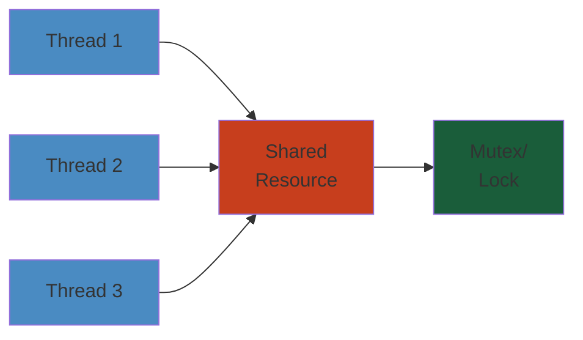

# Parking Lot — Low Level Design




## Table of Contents
1. Requirements
2. Actors & Use Cases
3. Class Diagram
4. Class Definitions & Relationships
5. Spot Allocation Strategy
6. Payment Integration
7. Multi-Floor, Multi-Level Design
8. Entry/Exit Gates
9. Concurrency
10. Design Patterns

---

## 1. Requirements

### Functional Requirements

1. The parking lot has multiple floors, each with multiple levels/zones.
2. Each parking spot has a type: Compact, Regular, Large, EV (Electric Vehicle), Handicap, or Motorcycle.
3. Vehicles can enter through entry gates and exit through exit gates.
4. At entry, a ticket is issued. At exit, payment is calculated and collected.
5. The system supports hourly, daily, and monthly (subscription) rates.
6. Each rate may vary by vehicle type and floor/level.
7. The system can suggest the nearest available spot to an entrance.
8. The system reserves a spot when a ticket is issued.
9. Customers with monthly passes get priority/reserved spots.
10. The system handles multiple cars entering simultaneously at different gates.
11. Admin can view occupancy, revenue reports, and manage rates.

### Non-Functional Requirements

1. High availability: The system must work 24/7 with no downtime.
2. Low latency: Ticket issuance < 200ms, spot allocation < 100ms.
3. Consistency: No double-booking of spots.
4. Scalability: Support up to 10,000 spots across multiple floors.
5. Durability: Ticketing data must survive crashes.

---

## 2. Actors & Use Cases

### Actors

| Actor | Description |
|-------|-------------|
| **Customer/Driver** | Enters, parks, and exits the parking lot |
| **Monthly Subscriber** | Has a monthly pass, may have reserved spots |
| **Parking Attendant** | Manages gates, handles exceptions |
| **Admin** | Configures rates, views reports, manages users |
| **Payment System** | External system for payment processing |

### Use Cases

```
┌──────────────────────────────────────────────────────────┐
│                    Parking Lot System                    │
│                                                          │
│  ┌──────────────┐                                       │
│  │ Customer     │─── 1. Enter parking lot               │
│  │              │─── 2. Get ticket                      │
│  │              │─── 3. Park vehicle in assigned spot   │
│  │              │─── 4. Pay at kiosk/app                │
│  │              │─── 5. Exit parking lot                │
│  └──────────────┘                                       │
│                                                          │
│  ┌──────────────┐                                       │
│  │ Subscriber   │─── 6. Register for monthly pass       │
│  │              │─── 7. Auto-check-in (RFID/NFC)        │
│  │              │─── 8. Reserve spot                    │
│  └──────────────┘                                       │
│                                                          │
│  ┌──────────────┐                                       │
│  │ Admin        │─── 9. Configure parking rates         │
│  │              │─── 10. View occupancy report          │
│  │              │─── 11. View revenue report            │
│  │              │─── 12. Manage floors/zones/spots      │
│  │              │─── 13. Override spot assignment       │
│  └──────────────┘                                       │
│                                                          │
│  ┌──────────────┐                                       │
│  │ Payment Sys  │─── 14. Process payment                │
│  │              │─── 15. Validate monthly pass          │
│  │              │─── 16. Process refund                 │
│  └──────────────┘                                       │
└──────────────────────────────────────────────────────────┘
```

---

## 3. Class Diagram

```
┌──────────────────────────┐         ┌────────────────────────┐
│      ParkingLot          │         │     ParkingFloor       │
├──────────────────────────┤         ├────────────────────────┤
│ - id: String             │ 1      N│ - id: String           │
│ - name: String           │◄────────│ - level: int           │
│ - address: String        │         │ - name: String         │
│ - floors: List<Floor>    │         │ - spots: List<Spot>    │
│ - entryGates: List<Gate> │         │ - displayBoard: Display│
│ - exitGates: List<Gate>  │         ├────────────────────────┤
│ - rates: RateCard        │         │ + canPark(vehicle):bool│
├──────────────────────────┤         │ + assignSpot(vehicle)  │
│ + getInstance():Lot      │         │ + freeSpot(spot)       │
│ + assignSpot(vehicle)    │         │ + getAvailableSpots()  │
│ + exitVehicle(ticket)    │         │ + getOccupancy()       │
│ + getRevenue(start,end)  │         └────────────────────────┘
│ + getOccupancyReport()   │
└──────────────────────────┘         ┌────────────────────────┐
                                     │       Spot             │
┌──────────────────────────┐         ├────────────────────────┤
│       Vehicle            │         │ - id: String           │
├──────────────────────────┤         │ - spotType: SpotType   │
│ - licensePlate: String   │ 1      N│ - floor: ParkingFloor  │
│ - vehicleType: VehType   │◄────────│ - row: int             │
│ - subscriberId: String?  │         │ - col: int             │
│ + getType(): VehType     │         │ - isOccupied: bool     │
└──────────────────────────┘         │ - isReserved: bool     │
                                     │ - sensor: SpotSensor   │
                                     ├────────────────────────┤
┌──────────────────────────┐         │ + park(vehicle)        │
│        Ticket            │         │ + vacate()             │
├──────────────────────────┤         │ + isAvailable(): bool  │
│ - id: String             │         │ + distanceTo(entrance) │
│ - issuedAt: DateTime     │         └────────────────────────┘
│ - paidAt: DateTime?      │
│ - amount: double?        │         ┌────────────────────────┐
│ - vehicle: Vehicle       │         │     Payment            │
│ - spot: Spot             │         ├────────────────────────┤
│ - exitGate: Gate?        │         │ - id: String           │
├──────────────────────────┤         │ - ticket: Ticket       │
│ + calculateAmount(rates) │         │ - amount: double       │
│ + markPaid(amount)       │         │ - method: PayMethod    │
│ + getDuration(): Duration│         │ - status: PayStatus    │
└──────────────────────────┘         │ - timestamp: DateTime  │
                                     ├────────────────────────┤
┌──────────────────────────┐         │ + process()            │
│        Gate              │         │ + refund()             │
├──────────────────────────┤         └────────────────────────┘
│ - id: String             │
│ - type: GateType         │         ┌────────────────────────┐
│ - floor: ParkingFloor    │         │   SpotAllocationStrat  │
│ - isOpen: bool           │         ├────────────────────────┤
├──────────────────────────┤         │ + findSpot(vehicle,    │
│ + open()                 │         │     floor): Spot       │
│ + close()                │         └────────────────────────┘
│ + processEntry(vehicle)  │                 ▲
│ + processExit(ticket)    │                 │
└──────────────────────────┘     ┌───────────┴───────────┐
                                 │                       │
                         ┌──────┴──────┐         ┌──────┴──────┐
                         │ NearestStrat│         │ EVCharging  │
                         ├─────────────┤         │ Strat       │
                         │             │         ├─────────────┤
                         └─────────────┘         └─────────────┘
```

---

## 4. Class Definitions & Relationships

### 4.1 Vehicle

```
enum VehicleType {
    MOTORCYCLE,   // Can park in MC spots or Compact
    COMPACT,      // Small cars
    REGULAR,      // Sedans, SUVs
    LARGE,        // Trucks, vans
    EV,           // Electric vehicles (needs charging)
    HANDICAP      // Needs handicap-accessible spot
}

class Vehicle {
    String licensePlate;
    VehicleType type;
    String subscriberId;  // null if not monthly subscriber
    String rfidTag;       // For automatic entry (subscribers)

    boolean isStickerValid();      // Check monthly pass validity
    SpotType getRequiredSpotType();  // Map vehicle to required spot types
}
```

**Vehicle-to-Spot compatibility**:
```
Vehicle Type    → Allowed Spot Types
────────────────────────────────────
MOTORCYCLE      → MOTORCYCLE, COMPACT
COMPACT         → COMPACT, REGULAR
REGULAR         → REGULAR, LARGE
LARGE           → LARGE
EV              → EV (has charger), REGULAR (no charger)
HANDICAP        → HANDICAP, REGULAR (if no handicap available)
```

### 4.2 ParkingSpot

```
enum SpotType {
    COMPACT,           // 8ft x 16ft
    REGULAR,           // 8.5ft x 18ft
    LARGE,             // 10ft x 22ft
    MOTORCYCLE,        // 5ft x 8ft
    EV_CHARGING,       // Regular size + EV charger
    HANDICAP           // 12ft x 18ft (extra space for wheelchair)
}

class ParkingSpot {
    String id;                  // e.g., "F1-Z2-15" (Floor 1, Zone 2, Spot 15)
    SpotType type;
    ParkingFloor floor;
    int row;
    int column;
    double distanceToNearestEntrance;  // Pre-computed
    boolean hasEVCharger;
    boolean isOccupied;
    boolean isReservedForSubscriber;
    String reservedForSubscriberId;   // null if unreserved
    ParkingSensor sensor;        // Real-time occupancy detection

    synchronized boolean occupy(Vehicle vehicle) {
        if (isOccupied || isReservedForNonSubscriber(vehicle)) return false;
        isOccupied = true;
        this.parkedVehicle = vehicle;
        return true;
    }

    synchronized void vacate() {
        isOccupied = false;
        this.parkedVehicle = null;
        sensor.setOccupied(false);
    }

    boolean isAvailable() {
        return !isOccupied && !(isReservedForSubscriber && !subscriberMatch);
    }

    double distanceTo(String entranceId) {
        return distanceCache.getOrDefault(entranceId, Double.MAX_VALUE);
    }
}
```

### 4.3 ParkingFloor

```
class ParkingFloor {
    String id;
    int level;                    // -1, 0, 1, 2, etc. (basement, ground, etc.)
    String name;                  // "Basement 2", "Ground Floor"
    List<ParkingZone> zones;
    Map<SpotType, Integer> availableSpotsByType;
    DisplayBoard displayBoard;    // Shows available spots at floor entrance
    List<EntryGate> entryGates;
    List<ExitGate> exitGates;

    ParkingSpot assignSpot(Vehicle vehicle, SpotAllocationStrategy strategy) {
        ParkingSpot spot = strategy.findSpot(this, vehicle);
        if (spot != null) {
            spot.occupy(vehicle);
            decrementAvailability(spot.getType());
            displayBoard.update(availableSpotsByType);
        }
        return spot;
    }

    void freeSpot(ParkingSpot spot) {
        spot.vacate();
        incrementAvailability(spot.getType());
        displayBoard.update(availableSpotsByType);
    }

    Map<SpotType, Integer> getAvailability() {
        return Collections.unmodifiableMap(availableSpotsByType);
    }

    void addZone(ParkingZone zone) {
        zones.add(zone);
        for (ParkingSpot spot : zone.getSpots()) {
            incrementAvailability(spot.getType());
        }
    }
}
```

### 4.4 ParkingZone

```
class ParkingZone {
    String id;
    String name;                   // "Zone A", "VIP Zone"
    List<ParkingSpot> spots;
    boolean isNearEntrance;        // Premium zone near entrance
    boolean requiresSubscription;  // Reserved for monthly pass holders

    List<ParkingSpot> getAvailableSpots(Vehicle vehicle) {
        return spots.stream()
            .filter(s -> s.isAvailable() && s.isCompatible(vehicle))
            .collect(Collectors.toList());
    }
}
```

### 4.5 ParkingLot (Singleton)

```
class ParkingLot {
    private static final ParkingLot INSTANCE = new ParkingLot();
    private String name;
    private String address;
    private List<ParkingFloor> floors;
    private List<EntryGate> entryGates;
    private List<ExitGate> exitGates;
    private RateCardManager rateManager;
    private SpotAllocationStrategy allocationStrategy;
    private Map<String, Ticket> activeTickets;
    private Map<String, Subscriber> subscribers;

    private ParkingLot() {
        this.activeTickets = new ConcurrentHashMap<>();
        this.subscribers = new ConcurrentHashMap<>();
        this.floors = new ArrayList<>();
        this.entryGates = new ArrayList<>();
        this.exitGates = new ArrayList<>();
    }

    public static ParkingLot getInstance() {
        return INSTANCE;
    }

    public synchronized Ticket issueTicket(Vehicle vehicle, EntryGate gate) {
        // 1. Find best spot across all floors
        ParkingSpot spot = findSpot(vehicle);
        if (spot == null) {
            throw new ParkingFullException("No available spot for " + vehicle.getType());
        }

        // 2. Occupy the spot
        spot.occupy(vehicle);

        // 3. Generate ticket
        Ticket ticket = new Ticket(generateTicketId(), vehicle, spot, gate);
        activeTickets.put(ticket.getId(), ticket);

        // 4. Return ticket (with spot location)
        return ticket;
    }

    public synchronized double exitVehicle(Ticket ticket, ExitGate gate) {
        // 1. Validate ticket
        if (!activeTickets.containsKey(ticket.getId())) {
            throw new InvalidTicketException("Ticket not found or already used");
        }

        // 2. Calculate duration and amount
        ticket.setExitGate(gate);
        double amount = rateManager.calculateAmount(ticket);

        // 3. Free the spot
        ParkingSpot spot = ticket.getSpot();
        spot.vacate();

        // 4. Remove from active tickets
        activeTickets.remove(ticket.getId());

        // 5. Return amount to be paid
        ticket.setAmount(amount);
        return amount;
    }

    public ParkingSpot findSpot(Vehicle vehicle) {
        return allocationStrategy.findSpot(this, vehicle);
    }

    public void setAllocationStrategy(SpotAllocationStrategy strategy) {
        this.allocationStrategy = strategy;
    }

    // Stats
    public int getTotalAvailableSpots() {
        return floors.stream()
            .mapToInt(f -> f.getAvailability().values().stream().mapToInt(Integer::intValue).sum())
            .sum();
    }

    public Map<String, Integer> getOccupancyReport() {
        Map<String, Integer> report = new LinkedHashMap<>();
        for (ParkingFloor floor : floors) {
            int occupied = floor.getTotalSpots() - floor.getTotalAvailable();
            report.put(floor.getName(), occupied);
        }
        return report;
    }
}
```

### 4.6 Ticket

```
class Ticket {
    String id;                          // Unique ticket ID
    DateTime issuedAt;
    DateTime paidAt;
    double amount;
    Vehicle vehicle;
    ParkingSpot spot;
    EntryGate entryGate;
    ExitGate exitGate;
    Payment payment;
    TicketStatus status;                // ACTIVE, PAID, LOST

    enum TicketStatus { ACTIVE, PAID, LOST }

    Ticket(String id, Vehicle v, ParkingSpot s, EntryGate g) {
        this.id = id;
        this.issuedAt = LocalDateTime.now();
        this.vehicle = v;
        this.spot = s;
        this.entryGate = g;
        this.status = TicketStatus.ACTIVE;
    }

    long getDurationInMinutes() {
        LocalDateTime end = (paidAt != null) ? paidAt : LocalDateTime.now();
        return ChronoUnit.MINUTES.between(issuedAt, end);
    }

    double calculateAmount(RateCard rates) {
        if (vehicle.subscriberId != null) {
            return 0.0;  // Monthly pass covers it
        }
        return rates.calculate(this);
    }

    void markPaid(double amount, PaymentMethod method) {
        this.amount = amount;
        this.paidAt = LocalDateTime.now();
        this.status = TicketStatus.PAID;
        this.payment = new Payment(amount, method, paidAt);
    }
}
```

### 4.7 Gate

```
abstract class Gate {
    String id;
    ParkingFloor floor;
    boolean isOpen;
    ParkingAttendant attendant;  // null if fully automated

    void open() { isOpen = true; }
    void close() { isOpen = false; }
}

class EntryGate extends Gate {
    TicketDispenser dispenser;
    Barrier barrier;
    Camera camera;           // License plate recognition
    RFIDReader rfidReader;  // For subscribers

    Ticket processEntry(Vehicle vehicle) {
        // 1. Check if subscriber (auto-open)
        if (vehicle.rfidTag != null && isValidSubscriber(vehicle)) {
            openBarrier();
            return createEntryLog(vehicle);
        }

        // 2. Issue new ticket
        Ticket ticket = ParkingLot.getInstance().issueTicket(vehicle, this);
        dispenser.printTicket(ticket);
        openBarrier();
        return ticket;
    }
}

class ExitGate extends Gate {
    PaymentTerminal terminal;
    Barrier barrier;

    void processExit(Ticket ticket) {
        ParkingLot lot = ParkingLot.getInstance();
        double amount = lot.exitVehicle(ticket, this);

        if (amount > 0) {
            // Payment required before exit
            terminal.processPayment(ticket, amount);
        }

        openBarrier();
        ticket.markExited();
    }
}
```

### 4.8 DisplayBoard

```
class DisplayBoard {
    String id;
    ParkingFloor floor;
    Map<SpotType, Integer> availability;

    void update(Map<SpotType, Integer> availability) {
        this.availability = availability;
        renderDisplay();
    }

    void renderDisplay() {
        // Physical display: LCD/LED panel at floor entrance
        // Shows: "Regular: 15 | Compact: 3 | EV: 2 | Handicap: 1"
        for (Map.Entry<SpotType, Integer> entry : availability.entrySet()) {
            System.out.println(entry.getKey() + ": " + entry.getValue());
        }
    }
}
```

---

## 5. Spot Allocation Strategy

### 5.1 Strategy Interface

```
interface SpotAllocationStrategy {
    ParkingSpot findSpot(ParkingLot lot, Vehicle vehicle);

    // Scoring function: lower = better
    default double score(ParkingSpot spot, Vehicle vehicle, String entranceId) {
        return spot.distanceTo(entranceId);
    }
}
```

### 5.2 NearestToEntrance Strategy

The most common strategy — assign the closest available compatible spot.

```
class NearestToEntranceStrategy implements SpotAllocationStrategy {
    @Override
    public ParkingSpot findSpot(ParkingLot lot, Vehicle vehicle) {
        ParkingSpot best = null;
        double bestScore = Double.MAX_VALUE;

        for (ParkingFloor floor : lot.getFloors()) {
            for (ParkingZone zone : floor.getZones()) {
                for (ParkingSpot spot : zone.getSpots()) {
                    if (spot.isAvailable() && spot.isCompatible(vehicle)) {
                        double score = spot.distanceToNearestEntrance;
                        if (score < bestScore) {
                            bestScore = score;
                            best = spot;
                        }
                    }
                }
            }
        }
        return best;
    }
}

// Optimization: Pre-compute sorted lists per vehicle type
// Use a min-heap per spot type for O(1) nearest-spot lookup
class OptimizedNearestStrategy implements SpotAllocationStrategy {
    Map<SpotType, PriorityQueue<ParkingSpot>> availableSpots;

    @Override
    public ParkingSpot findSpot(ParkingLot lot, Vehicle vehicle) {
        for (SpotType compatible : vehicle.getCompatibleSpotTypes()) {
            PriorityQueue<ParkingSpot> pq = availableSpots.get(compatible);
            while (!pq.isEmpty()) {
                ParkingSpot spot = pq.peek();
                if (spot.isAvailable()) {
                    pq.poll();  // Remove from heap
                    return spot;
                }
                pq.poll();  // Spot became occupied, remove stale entry
            }
        }
        return null;
    }

    void releaseSpot(ParkingSpot spot) {
        availableSpots.get(spot.getType()).add(spot);
    }
}
```

### 5.3 EV Charging Strategy

Prioritize EV spots for electric vehicles, but fall back to regular spots if no EV spots are available.

```
class EVChargingStrategy extends NearestToEntranceStrategy {
    @Override
    public ParkingSpot findSpot(ParkingLot lot, Vehicle vehicle) {
        if (vehicle.getType() != VehicleType.EV) {
            return super.findSpot(lot, vehicle);
        }

        // First, try to find an EV charging spot
        ParkingSpot evSpot = findEVSpot(lot);
        if (evSpot != null) return evSpot;

        // Fall back to regular spot (no charging)
        return super.findSpot(lot, vehicle);
    }

    private ParkingSpot findEVSpot(ParkingLot lot) {
        for (ParkingFloor floor : lot.getFloors()) {
            for (ParkingZone zone : floor.getZones()) {
                for (ParkingSpot spot : zone.getSpots()) {
                    if (spot.isAvailable() && spot.getType() == SpotType.EV_CHARGING) {
                        return spot;
                    }
                }
            }
        }
        return null;
    }
}
```

### 5.4 Handicap Strategy

Reserve handicap spots for authorized vehicles only.

```
class HandicapStrategy implements SpotAllocationStrategy {
    @Override
    public ParkingSpot findSpot(ParkingLot lot, Vehicle vehicle) {
        if (vehicle.getType() == VehicleType.HANDICAP) {
            // Always try handicap spots first
            ParkingSpot hSpot = findNearestHandicapSpot(lot, vehicle);
            if (hSpot != null) return hSpot;
        }

        // All other vehicles: use nearest available
        // but NEVER assign handicap spots to non-handicap vehicles
        NearestToEntranceStrategy fallback = new NearestToEntranceStrategy();
        return fallback.findSpot(lot, vehicle);
    }

    private ParkingSpot findNearestHandicapSpot(ParkingLot lot, Vehicle vehicle) {
        ParkingSpot nearest = null;
        double minDist = Double.MAX_VALUE;

        for (ParkingFloor floor : lot.getFloors()) {
            for (ParkingSpot spot : floor.getSpotsByType(SpotType.HANDICAP)) {
                if (spot.isAvailable()) {
                    double dist = spot.distanceToNearestEntrance;
                    if (dist < minDist) {
                        minDist = dist;
                        nearest = spot;
                    }
                }
            }
        }
        return nearest;
    }
}
```

### 5.5 Composite Strategy

Chain strategies with fallback:

```
class CompositeStrategy implements SpotAllocationStrategy {
    private List<SpotAllocationStrategy> strategies;

    CompositeStrategy(List<SpotAllocationStrategy> strategies) {
        this.strategies = strategies;
    }

    @Override
    public ParkingSpot findSpot(ParkingLot lot, Vehicle vehicle) {
        for (SpotAllocationStrategy strategy : strategies) {
            ParkingSpot spot = strategy.findSpot(lot, vehicle);
            if (spot != null) return spot;
        }
        // Last resort: any compatible spot on any floor
        return new BruteForceStrategy().findSpot(lot, vehicle);
    }
}
```

**Strategy chain**:
```
1. HandicapStrategy (handicap spots for handicap vehicles)
2. EVChargingStrategy (EV charging for electric vehicles)
3. SubscriberReservedStrategy (reserved spots for monthly pass holders)
4. NearestToEntranceStrategy (everyone else)
```

---

## 6. Payment Integration

### 6.1 Rate Card

```
class RateCard {
    Map<VehicleType, RateTier> rates;
    GracePeriodConfig gracePeriod;  // 15 min free
    MaxChargeConfig maxDaily;       // Daily max cap

    double calculate(Ticket ticket) {
        long minutes = ticket.getDurationInMinutes();

        // Grace period check
        if (minutes <= gracePeriod.getMinutes()) return 0.0;

        RateTier tier = rates.get(ticket.getVehicle().getType());
        long hours = (long) Math.ceil(minutes / 60.0);

        double hourly = hours * tier.hourlyRate;
        double daily = (hours / 24) * tier.dailyRate;
        double total = Math.min(hourly, daily);

        // Cap at maximum daily charge
        return Math.min(total, maxDaily.getAmount());
    }
}

class RateTier {
    VehicleType vehicleType;
    double hourlyRate;
    double dailyRate;
    double monthlyRate;    // For subscriptions
    double overnightRate;
}
```

### 6.2 Payment Methods

```
enum PaymentMethod {
    CASH, CREDIT_CARD, DEBIT_CARD,
    UPI, MOBILE_WALLET,
    MONTHLY_PASS,          // No charge at exit
    FREE_PARKING           // Employee/valet
}

class Payment {
    String transactionId;
    Ticket ticket;
    double amount;
    PaymentMethod method;
    PaymentStatus status;
    LocalDateTime processedAt;

    enum PaymentStatus { PENDING, COMPLETED, FAILED, REFUNDED }

    boolean process() {
        try {
            switch (method) {
                case CREDIT_CARD:
                    return PaymentGateway.charge(amount, ticket.getVehicle());
                case UPI:
                    return PaymentGateway.upiCharge(amount, upiId);
                case MONTHLY_PASS:
                    return validateMonthlyPass(ticket.getVehicle());
                default:
                    return true; // Cash — validated by attendant
            }
        } catch (PaymentException e) {
            status = PaymentStatus.FAILED;
            return false;
        }
    }

    boolean refund() {
        return PaymentGateway.refund(transactionId);
    }
}
```

### 6.3 Payment Terminal

```
class PaymentTerminal {
    String id;
    ExitGate gate;
    PaymentProcessor processor;

    boolean processPayment(Ticket ticket, double amount) {
        // Display amount to customer
        display.showAmount(amount);

        // Accept payment method
        PaymentMethod method = customer.selectMethod();

        Payment payment = new Payment(ticket, amount, method);
        boolean success = payment.process();

        if (success) {
            ticket.markPaid(amount, method);
            gate.openBarrier();
            return true;
        } else {
            display.showError("Payment failed. Try again.");
            return false;
        }
    }
}
```

### 6.4 Monthly Pass Integration

```
class Subscriber {
    String subscriberId;
    Vehicle vehicle;
    String rfidTag;
    LocalDateTime validFrom;
    LocalDateTime validTill;
    ParkingSpot reservedSpot;     // If applicable
    double monthlyFee;
    AutoPayConfig autoPay;

    boolean isValid() {
        LocalDateTime now = LocalDateTime.now();
        return now.isAfter(validFrom) && now.isBefore(validTill);
    }

    // At entry: RFID scanner detects subscriber
    // Barrier opens automatically
    // Spot is allocated (may be their reserved spot)

    // At exit: RFID scanner detects subscriber
    // Barrier opens automatically
    // No payment needed (covered by monthly fee)
}
```

---

## 7. Multi-Floor, Multi-Level Design

### 7.1 Floor Layout

```
Floor Layout (Floor 1):
┌────────────────────────────────────────────────────────────────┐
│                         Entrance A                             │
│  ┌─────┬─────┬─────┬─────┬─────┬─────┬─────┬─────┬─────┐     │
│  │ M01 │ M02 │ M03 │ C01 │ C02 │ C03 │ C04 │ R01 │ R02 │     │
│  ├─────┼─────┼─────┼─────┼─────┼─────┼─────┼─────┼─────┤     │
│  │ M04 │ M05 │ C05 │ C06 │ C07 │ C08 │ R03 │ R04 │ R05 │     │
│  ├─────┴─────┴─────┴─────┴─────┴─────┴─────┴─────┴─────┤     │
│  │              Drive Aisle                             │     │
│  ├─────┬─────┬─────┬─────┬─────┬─────┬─────┬─────┬─────┤     │
│  │ R06 │ R07 │ R08 │ R09 │ R10 │ H01 │ E01 │ E02 │ E03 │     │
│  ├─────┼─────┼─────┼─────┼─────┼─────┼─────┼─────┼─────┤     │
│  │ R11 │ R12 │ R13 │ R14 │ R15 │ H02 │ E04 │ E05 │ E06 │     │
│  └─────┴─────┴─────┴─────┴─────┴─────┴─────┴─────┴─────┘     │
│                         Exit A                                │
└────────────────────────────────────────────────────────────────┘
```

**Naming convention**: `F{floor}_{zone}{row}{col}` e.g., `F1_A_1_3`

### 7.2 Floor-to-Floor Mapping

```
Floor 0 (Ground):    Entry/Exit gates, Handicap spots, EV charging, premium Regular spots
Floor -1 (B1):       Regular spots, Compact spots
Floor -2 (B2):       Large vehicle spots, overflow
Floor -3 (B3):       Employee parking, overflow (closed during low occupancy)
```

**Spot distribution by floor**:
```
Floor 0:  Handicap (10%), EV (15%), Regular (60%), Compact (15%)
Floor -1: Regular (70%), Compact (30%)
Floor -2: Regular (50%), Large (30%), Compact (20%)
Floor -3: Regular (100%) — overflow only
```

### 7.3 Capacity Management

```
class CapacityManager {
    Map<ParkingFloor, Integer> maxCapacity;
    Map<ParkingFloor, Integer> currentOccupancy;
    int totalCapacity;
    int totalOccupied;

    boolean hasCapacity(VehicleType type) {
        for (ParkingFloor floor : floors) {
            if (floor.hasAvailableSpot(type)) return true;
        }
        return false;
    }

    // Close floor when occupancy > 90%
    void autoManageFloors() {
        for (ParkingFloor floor : floors) {
            double occupancy = (double) floor.getOccupiedCount() / floor.getTotalSpots();
            if (occupancy > 0.9 && floor.isOpen()) {
                floor.setOpen(false);  // Redirect to next floor
            } else if (occupancy < 0.5 && !floor.isOpen()) {
                floor.setOpen(true);   // Re-open when traffic subsides
            }
        }
    }
}
```

---

## 8. Entry/Exit Gates

### 8.1 Entry Gate Flow

```
Entry Gate Flow:
┌────────┐    ┌───────────┐    ┌───────────┐    ┌──────────┐
│ Vehicle│    │ Camera    │    │ Ticket    │    │ Barrier  │
│ Arrives│───▶│ Reads LP  │───▶│ Dispenser │───▶│ Opens    │
└────────┘    └───────────┘    └───────────┘    └────┬─────┘
                                                      │
                                               ┌──────▼──────┐
                                               │ Vehicle     │
                                               │ Enters      │
                                               └─────────────┘

Subscriber Flow (RFID):
┌────────┐    ┌───────────┐    ┌──────────┐    ┌──────────┐
│ Vehicle│    │ RFID      │    │ Auto-    │    │ Barrier  │
│ Arrives│───▶│ Scanner   │───▶│ Assign   │───▶│ Opens    │
└────────┘    └───────────┘    │ Spot     │    └──────────┘
                               └──────────┘
```

### 8.2 Exit Gate Flow

```
Exit Gate Flow:
┌────────┐    ┌────────────┐    ┌───────────┐    ┌──────────┐
│ Vehicle│    │ Ticket     │    │ Payment   │    │ Barrier  │
│ Arrives│───▶│ Scanned    │───▶│ Terminal  │───▶│ Opens    │
└────────┘    └────────────┘    └───────────┘    └────┬─────┘
                                                       │
                                                ┌──────▼──────┐
                                                │ Vehicle     │
                                                │ Exits       │
                                                └─────────────┘

Subscriber Exit:
┌────────┐    ┌───────────┐    ┌──────────┐
│ Vehicle│    │ RFID      │───▶│ Barrier  │
│ Arrives│───▶│ Scanner   │    │ Opens    │
└────────┘    └───────────┘    └──────────┘
```

### 8.3 Hardware Interface

```
interface ParkingSensor {
    boolean isOccupied();
    void setOccupied(boolean occupied);
    String getSpotId();
}

interface Barrier {
    void raise();
    void lower();
    boolean isRaised();
    void autoClose();  // Close after 10 seconds
}

interface TicketDispenser {
    Ticket issueTicket(Vehicle vehicle, EntryGate gate);
    void printTicket(Ticket ticket);
}

interface Camera {
    String captureLicensePlate();
    byte[] captureImage();
}
```

---

## 9. Concurrency

### 9.1 Race Condition: Two Cars Entering Simultaneously

Two cars arrive at different entry gates at the same time. Both need spots.

```
Time    Event
│
│ Car A arrives at Gate 1
│ Car B arrives at Gate 2
│
├─ Car A: findSpot() → returns Spot 15 (available)
│  Car B: findSpot() → returns Spot 15 (still available — race!)
│
├─ Car A: spot.occupy() → succeeds
│  Car B: spot.occupy() → fails (already occupied)
│
├─ Car B: retry findSpot() → returns Spot 16 (different spot)
│  Car B: spot.occupy() → succeeds
│
└ Both cars have valid tickets
```

### 9.2 Solution: Synchronized Spot Allocation

```
class ParkingLot {
    // Use per-floor lock for better concurrency
    final Map<String, ReentrantLock> floorLocks = new ConcurrentHashMap<>();

    public Ticket issueTicket(Vehicle vehicle, EntryGate gate) {
        // Try floors in order (ground first)
        for (ParkingFloor floor : getFloorsSortedByPriority()) {
            ReentrantLock lock = floorLocks.get(floor.getId());
            lock.lock();
            try {
                ParkingSpot spot = floor.findAvailableSpot(vehicle);
                if (spot != null) {
                    spot.occupy(vehicle);
                    return new Ticket(generateId(), vehicle, spot, gate);
                }
            } finally {
                lock.unlock();
            }
        }
        throw new ParkingFullException("No spots available");
    }
}

// Alternative: Use database-level optimistic locking
class ParkingSpot {
    @Version
    int version;  // JPA Optimistic locking

    @Transactional
    boolean occupy(Vehicle vehicle) {
        // UPDATE parking_spot SET occupied = true, version = version + 1
        // WHERE id = ? AND occupied = false AND version = ?
        // If row count = 0: concurrent modification detected
        return jdbcTemplate.update(
            "UPDATE parking_spot SET occupied = true, vehicle_id = ?, " +
            "version = version + 1 WHERE id = ? AND occupied = false",
            vehicle.getId(), this.id
        ) > 0;
    }
}
```

### 9.3 Concurrent Data Structures

```
// Thread-safe spot management
class ParkingFloor {
    private final ReadWriteLock lock = new ReentrantReadWriteLock();
    private final Set<String> occupiedSpots = new ConcurrentHashMap<>().newKeySet();

    List<ParkingSpot> findAvailableSpots(VehicleType type) {
        lock.readLock().lock();
        try {
            return spotsByType.get(type).stream()
                .filter(s -> !occupiedSpots.contains(s.getId()))
                .collect(Collectors.toList());
        } finally {
            lock.readLock().unlock();
        }
    }

    boolean occupySpot(String spotId) {
        lock.writeLock().lock();
        try {
            return occupiedSpots.add(spotId);
        } finally {
            lock.writeLock().unlock();
        }
    }
}

// Atomic ticket issuance
class ParkingLot {
    private final AtomicInteger ticketCounter = new AtomicInteger(0);

    String generateTicketId() {
        return String.format("TKT-%s-%05d",
            LocalDate.now().format(DateTimeFormatter.BASIC_ISO_DATE),
            ticketCounter.incrementAndGet());
    }
}
```

---

## 10. Design Patterns

### 10.1 Singleton Pattern

**Use**: `ParkingLot` — there must be only one parking lot instance.

```
public class ParkingLot {
    private static volatile ParkingLot instance;

    private ParkingLot() {}  // Private constructor

    public static ParkingLot getInstance() {
        if (instance == null) {
            synchronized (ParkingLot.class) {
                if (instance == null) {
                    instance = new ParkingLot();
                }
            }
        }
        return instance;
    }
}
```

### 10.2 Factory Pattern

**Use**: Creating different types of parking spots, vehicles, and gates.

```
interface SpotFactory {
    ParkingSpot createSpot(String id, int row, int col);
}

class CompactSpotFactory implements SpotFactory {
    @Override
    public ParkingSpot createSpot(String id, int row, int col) {
        return new ParkingSpot(id, SpotType.COMPACT, row, col);
    }
}

class EVSpotFactory implements SpotFactory {
    private ChargerType chargerType;
    private double chargingRate;

    @Override
    public ParkingSpot createSpot(String id, int row, int col) {
        return new EVParkingSpot(id, row, col, chargerType, chargingRate);
    }
}

class SpotFactoryProvider {
    static SpotFactory getFactory(SpotType type) {
        return switch (type) {
            case COMPACT -> new CompactSpotFactory();
            case REGULAR -> new RegularSpotFactory();
            case LARGE -> new LargeSpotFactory();
            case MOTORCYCLE -> new MotorcycleSpotFactory();
            case EV_CHARGING -> new EVSpotFactory();
            case HANDICAP -> new HandicapSpotFactory();
        };
    }
}
```

### 10.3 Strategy Pattern

**Use**: Spot allocation strategies (nearest, EV, handicap, etc.).

```
interface SpotAllocationStrategy {
    ParkingSpot findSpot(ParkingLot lot, Vehicle vehicle);
}

// Usage
ParkingLot lot = ParkingLot.getInstance();
lot.setAllocationStrategy(new CompositeStrategy(
    Arrays.asList(
        new HandicapStrategy(),
        new EVChargingStrategy(),
        new NearestToEntranceStrategy()
    )
));
```

### 10.4 Observer Pattern

**Use**: Display boards update when spot availability changes.

```
interface OccupancyObserver {
    void onSpotOccupied(ParkingSpot spot);
    void onSpotFreed(ParkingSpot spot);
}

class DisplayBoard implements OccupancyObserver {
    @Override
    public void onSpotOccupied(ParkingSpot spot) {
        availability.merge(spot.getType(), -1, Integer::sum);
        renderDisplay();
    }

    @Override
    public void onSpotFreed(ParkingSpot spot) {
        availability.merge(spot.getType(), 1, Integer::sum);
        renderDisplay();
    }
}

class ParkingFloor {
    private List<OccupancyObserver> observers = new ArrayList<>();

    void addObserver(OccupancyObserver observer) {
        observers.add(observer);
    }

    void notifySpotOccupied(ParkingSpot spot) {
        for (OccupancyObserver observer : observers) {
            observer.onSpotOccupied(spot);
        }
    }
}
```

### 10.5 State Pattern

**Use**: Gate state (open, closed, error, maintenance).

```
interface GateState {
    void open(Gate gate);
    void close(Gate gate);
    void processEntry(Gate gate, Vehicle vehicle);
    void processExit(Gate gate, Ticket ticket);
}

class GateOpenState implements GateState {
    @Override
    public void processEntry(Gate gate, Vehicle vehicle) {
        // Allow entry, then auto-close
        gate.openBarrier();
        ScheduledExecutor.schedule(() -> gate.close(), 10, TimeUnit.SECONDS);
    }
}

class GateClosedState implements GateState {
    @Override
    public void processEntry(Gate gate, Vehicle vehicle) {
        throw new GateClosedException("Gate is closed");
    }
}

class GateMaintenanceState implements GateState {
    @Override
    public void processEntry(Gate gate, Vehicle vehicle) {
        throw new GateMaintenanceException("Under maintenance");
    }
}
```

### 10.6 Command Pattern

**Use**: Encapsulate parking operations for audit logging and undo.

```
interface ParkingCommand {
    void execute();
    void undo();
}

class ParkVehicleCommand implements ParkingCommand {
    private ParkingLot lot;
    private Vehicle vehicle;
    private ParkingSpot spot;

    @Override
    public void execute() {
        spot = lot.findSpot(vehicle);
        if (spot == null) throw new ParkingFullException();
        spot.occupy(vehicle);
    }

    @Override
    public void undo() {
        if (spot != null) spot.vacate();
    }
}
```

### 10.7 Builder Pattern

**Use**: Construct complex ParkingLot configuration.

```
class ParkingLotBuilder {
    private ParkingLot lot = ParkingLot.getInstance();

    ParkingLotBuilder addFloor(int level, String name) {
        ParkingFloor floor = new ParkingFloor("F" + level, level, name);
        lot.addFloor(floor);
        return this;
    }

    ParkingLotBuilder addZone(String floorId, String zoneName, boolean nearEntrance) {
        // Create zone with spots
        return this;
    }

    ParkingLotBuilder addSpots(String floorId, SpotType type, int count) {
        // Generate spots in grid layout
        return this;
    }

    ParkingLotBuilder setRate(VehicleType type, double hourly, double daily) {
        lot.getRateManager().setRate(type, hourly, daily);
        return this;
    }

    ParkingLot build() {
        return lot;
    }
}

// Usage
ParkingLot lot = new ParkingLotBuilder()
    .addFloor(0, "Ground Floor")
    .addZone("F0", "Zone A", true)
    .addSpots("F0", SpotType.HANDICAP, 5)
    .addSpots("F0", SpotType.EV_CHARGING, 10)
    .addSpots("F0", SpotType.REGULAR, 50)
    .addFloor(-1, "Basement 1")
    .addSpots("F-1", SpotType.REGULAR, 100)
    .setRate(VehicleType.REGULAR, 2.0, 20.0)
    .setRate(VehicleType.LARGE, 3.0, 30.0)
    .build();
```

---

## References

- GoF Design Patterns book
- Java Concurrency in Practice by Brian Goetz
- SOLID Principles by Robert C. Martin
- Parking lot sensor technologies: inductive loop, ultrasonic, camera-based
- Payment gateway integration patterns
- Real-time parking availability systems (OpenParking, ParkMobile)
