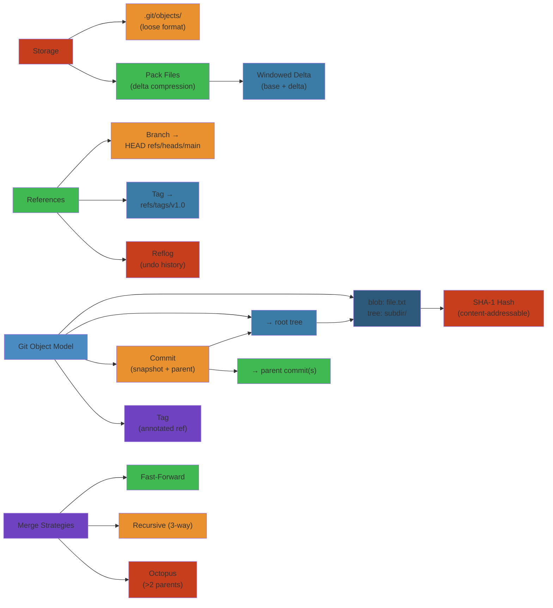

# Git Internals — Deep Dive


> **Run the live simulator**: [git-commit-graph.html](/25-software-engineering/git-commit-graph.html) — create commits, branches, and merges; visualize the commit DAG interactively.




## Table of Contents
1. Object Model
2. SHA-1 Hashing & Content-Addressable Storage
3. Blob, Tree, Commit, Tag
4. Object Storage & Packfiles
5. Delta Compression
6. References, Branches, Tags, Reflog
7. Merge Strategies
8. Rebase & Cherry-Pick
9. Index / Staging Area
10. Remote Protocols
11. Git at Scale

---

## 1. Object Model

Git is fundamentally a **content-addressable filesystem** with a VCS interface on top. Everything is stored as an object, identified by the SHA-1 hash of its content.

### 1.1 The Four Object Types

| Type | Description | Stored Content |
|------|-------------|----------------|
| **Blob** | File content | `blob <size>\0<content>` |
| **Tree** | Directory listing | `tree <size>\0<mode> <name>\0<sha1>...` |
| **Commit** | Snapshot + metadata | `commit <size>\0<tree>\nparent\n...` |
| **Tag** | Named reference to commit/object | `tag <size>\0<object>\ntype\ntag\n...` |

### 1.2 Storage Hierarchy

```
                            ┌──────────────────┐
                            │   Commit (SHA)    │
                            │   tree: abc123    │
                            │   parent: def456  │
                            │   author: Alice   │
                            │   message: "..."  │
                            └────────┬─────────┘
                                     │ points to
                            ┌────────▼─────────┐
                            │  Tree (SHA)       │
                            │  blob 111 file.c  │
                            │  tree 222 src/    │
                            │  blob 333 README  │
                            └──┬──────────┬────┘
                               │          │
                  ┌────────────┘          └────────────┐
           ┌──────▼──────┐                      ┌──────▼──────┐
           │  Blob (SHA) │                      │  Tree (SHA) │
           │  #include    │                      │  blob 444   │
           │  <stdio.h>   │                      │  main.c      │
           │  int main()  │                      └──────┬──────┘
           └─────────────┘                              │
                                                  ┌─────▼──────┐
                                                  │ Blob (SHA) │
                                                  │ int main()  │
                                                  └────────────┘
```

### 1.3 Content-Addressable Storage

Objects are stored at `.git/objects/<first-2-hex-chars>/<remaining-38-hex-chars>`.

```
.git/objects/
├── a1/
│   └── b2c3d4e5f6a7b8c9d0e1f2a3b4c5d6e7f8a9b0c
├── ff/
│   └── aabbccddee00112233445566778899aabbccddee
└── pack/
    ├── pack-abc123.idx
    └── pack-abc123.pack
```

The hash is computed as `SHA-1(object_type + " " + content_size + "\0" + content)`.

**Storage format** (before zlib compression):
```
blob 14\0Hello, World!
```

**On disk** (after zlib compression):
```
78 9c 4b 48 55 28 2c 48 2d 29 2e a9 2e b2 50 00
12 4a 0a 14 32 12 15 32 13 15 92 f2 73 b2 52 0b
...
```

#### Step-by-Step

1. **Serialize object**: Create header with object type, size, and null byte terminator
2. **Concatenate header and content**: Combine header with full object payload
3. **Compute SHA-1 hash**: Hash the concatenated string to produce 40-character hex digest
4. **Create object directory**: Extract first 2 hex characters; create `.git/objects/XX/` directory if needed
5. **Compress and write**: Zlib-compress the serialized object and write to `.git/objects/XX/YYYYYY...`
6. **Verify on read**: Decompress, deserialize, and re-hash to ensure integrity

#### Code Example

```python
import hashlib
import zlib
import os

class GitObject:
    def __init__(self, obj_type, content):
        self.obj_type = obj_type
        self.content = content if isinstance(content, bytes) else content.encode('utf-8')
    
    def compute_sha1(self):
        """Compute SHA-1 hash like Git does."""
        header = f"{self.obj_type} {len(self.content)}\0".encode('utf-8')
        full_content = header + self.content
        return hashlib.sha1(full_content).hexdigest()
    
    def serialize(self):
        """Serialize object for storage (header + content, then compress)."""
        header = f"{self.obj_type} {len(self.content)}\0".encode('utf-8')
        full_content = header + self.content
        return zlib.compress(full_content)
    
    def write_to_git_dir(self, git_dir):
        """Write object to .git/objects directory."""
        sha1 = self.compute_sha1()
        obj_dir = f"{git_dir}/objects/{sha1[:2]}"
        obj_file = f"{obj_dir}/{sha1[2:]}"
        
        # Create directory if needed
        os.makedirs(obj_dir, exist_ok=True)
        
        # Write compressed object
        with open(obj_file, 'wb') as f:
            f.write(self.serialize())
        
        return sha1

# Example usage
blob = GitObject("blob", "Hello, World!\n")
sha = blob.write_to_git_dir(".git")
print(f"Blob SHA-1: {sha}")
# Output: Blob SHA-1: af5626b4a114abcb82d63db7c8082c3c4756e51b
```

#### Real-World Scenario

When Google announced the SHAttered attack (SHA-1 collision) in 2017, it sparked a years-long effort to migrate Git to SHA-256. Linux kernel maintainers faced a critical decision: continue with SHA-1 (now cryptographically broken) or migrate 60+ million commits and risk compatibility. Git 2.31+ enabled transparent SHA-256 support while maintaining SHA-1 backward compatibility. The Kernel project planned a 3-year migration timeline, scheduled to complete in 2025.

---

## 2. SHA-1 Hashing & Content-Addressable Storage

### 2.1 How SHA-1 Works

Git uses SHA-1 (and transitioning to SHA-256) to hash object content.

```
hash_content(type, content) {
    header = type + " " + strlen(content) + "\0"
    full = header + content
    return sha1(full)
}
```

Example:
```
hash_content("blob", "Hello, World!\n")
// header: "blob 14\0"
// full: "blob 14\0Hello, World!\n"
// SHA-1: "af5626b4a114abcb82d63db7c8082c3c4756e51b"
```

### 2.2 Hash Collision Handling

Git's approach to SHA-1 collisions (SHAttered attack, 2017):
- Git uses hardened SHA-1 (SHA-1 with collision detection)
- Detection: if Git detects a collision attack, it rejects the objects
- Transition: Git 2.31+ supports SHA-256 repositories
- `git init --object-format=sha256`
- SHA-1 repos can still interoperate, but objects are not shared across formats
- New repos should use SHA-256 for future-proofing

### 2.3 Content Addressing Benefits

1. **Deduplication**: Identical content across files or versions stores only one blob
2. **Integrity**: Changes to content change the hash — corruption is detectable
3. **Immutability**: Objects are never modified, only created or garbage-collected
4. **Distributed**: The hash is the content — no central authority needed

---

## 3. Blob, Tree, Commit, Tag

### 3.1 Blob Object

Stores file content, identified by SHA-1 hash of the content alone. Does NOT store filename.

```
$ echo "Hello, World!" > hello.txt
$ git hash-object hello.txt
af5626b4a114abcb82d63db7c8082c3c4756e51b

$ git hash-object --stdin
Hello, World!
af5626b4a114abcb82d63db7c8082c3c4756e51b

$ git cat-file -p af5626b4a114abcb82d63db7c8082c3c4756e51b
Hello, World!

$ git cat-file -t af5626b4a114abcb82d63db7c8082c3c4756e51b
blob
```

**Internal storage**:
```
$ python3 -c "
import hashlib, zlib

content = b'Hello, World!\n'
header = f'blob {len(content)}\0'.encode()
store = header + content
hash = hashlib.sha1(store).hexdigest()
compressed = zlib.compress(store)

print(f'Hash: {hash}')
print(f'Header: {header}')
print(f'Compressed size: {len(compressed)} bytes')
"
Hash: af5626b4a114abcb82d63db7c8082c3c4756e51b
Header: b'blob 14\x00'
Compressed size: 23 bytes
```

### 3.2 Tree Object

Stores directory structure: filenames, modes, and references to blobs or subtrees.

```
$ git cat-file -p HEAD^{tree}
100644 blob af5626b4a114abcb82d63db7c8082c3c4756e51b hello.txt
040000 tree c0ffee...                          src/

$ git ls-tree HEAD
100644 blob af5626b4... hello.txt
040000 tree c0ffee42... src/
```

**Tree object format**:
```
tree <size>\0
<mode> <name>\0<20-byte-SHA1>
<mode> <name>\0<20-byte-SHA1>
...
```

The 20-byte SHA-1 is stored in binary (not hex), saving 40 bytes per entry.

Entry format details:
```
Mode: 6-digit octal:
  100644  — Regular file (not executable)
  100755  — Executable file
  040000  — Subdirectory (tree)
  120000  — Symlink (blob contains target path)
  160000  — Gitlink (submodule commit)
```

### 3.3 Commit Object

A commit is a snapshot of the entire repository + metadata.

```
$ git cat-file -p HEAD
tree c0ffee42a1b2c3d4e5f6a7b8c9d0e1f2a3b4c5d6
parent def45678a1b2c3d4e5f6a7b8c9d0e1f2a3b4c5d6
author Alice <alice@example.com> 1617000000 +0000
committer Alice <alice@example.com> 1617000000 +0000
gpgsig -----BEGIN PGP SIGNATURE-----
 ...
 -----END PGP SIGNATURE-----

Initial commit message
```

**Commit format**:
```
commit <size>\0
tree <tree_sha>
parent <parent_sha_1>
parent <parent_sha_2>  # For merge commits
author <name> <<email>> <timestamp> <timezone>
committer <name> <<email>> <timestamp> <timezone>
gpgsig <signature>     # Optional

<message>
```

**Key points**:
- First commit has no parent
- Merge commits have two or more parents
- Root commits (orphan branches) have no parent
- The tree hash uniquely identifies the entire repository state

### 3.4 Tag Object

Annotated tags are full Git objects. Lightweight tags are just references.

```
$ git cat-file -p v1.0
object c0ffee42a1b2c3d4e5f6a7b8c9d0e1f2a3b4c5d6
type commit
tag v1.0
tagger Alice <alice@example.com> 1617000000 +0000

Release 1.0 — stable version
```

**Tag format**:
```
tag <size>\0
object <sha1>
type <object_type>     # commit, tree, blob
tag <tag_name>
tagger <name> <email> <timestamp> <timezone>

<message>
```

---

## 4. Object Storage & Packfiles

### 4.1 Loose Objects

New objects are stored as individual files (loose objects).

```
.git/objects/af/5626b4a114abcb82d63db7c8082c3c4756e51b
```

**Creation**: When you add a file, git writes the blob to `.git/objects/`:
```
git add hello.txt
# Creates: .git/objects/af/5626b4a114abcb82d63db7c8082c3c4756e51b
```

### 4.2 Packfiles

When loose objects accumulate (configurable: `gc.auto`, default 6700), Git packs them into a packfile.

```
.git/objects/pack/
├── pack-abc1234567890abcdef1234567890abcdef1234.idx
├── pack-abc1234567890abcdef1234567890abcdef1234.pack
├── pack-def0987654321fedcba0987654321fedcba0987.idx
├── pack-def0987654321fedcba0987654321fedcba0987.pack
└── multi-pack-index
```

**Packfile format**:

```
Packfile header:
  - 4 bytes: "PACK"
  - 4 bytes: version (2 or 3)
  - 4 bytes: number of objects

Packfile body:
  - Object entries, each with:
    - Object header:
      - 1+ bytes: type (3 bits) + size (variable-length continuation)
      - Types: 1=commit, 2=tree, 3=blob, 4=tag, 6=OFS_DELTA, 7=REF_DELTA
    - Object content (raw or delta-compressed)

  - Delta compression:
    - OFS_DELTA: offset relative to this object's base
    - REF_DELTA: 20-byte SHA-1 of base object
    - Delta data: instructions to reconstruct from base

Packfile trailer:
  - 20 bytes: SHA-1 checksum of entire packfile
```

**Index (.idx) file**:

```
A pack index contains:
  1. Fanout table (256 entries): count of objects at each prefix byte
  2. Object names (SHA-1, 20 bytes each)
  3. CRC32 checksums (4 bytes each)
  4. Packfile offsets (4 bytes each, 8 bytes for large files)
  5. Packfile checksum (20 bytes)
  6. Index checksum (20 bytes)
```

The fanout table enables binary search: to find object `af5626b...`, look up fanout index for `af` (byte 175), get offset range, binary search within that range.

### 4.3 Packfile Negotiation

Git's packfile negotiation determines which objects the client needs.

**Smart protocol negotiation** (described in Section 10):
```
Client: "want" c0ffee42...   # I want this commit
Client: "have" deadbeef...   # I already have this commit
Server: "ACK" deadbeef...    # I know you have this
Server: "NAK"                # I don't have this
Server: "PACK <packfile>"    # Here are the missing objects
```

**Commit graph traversal**: Git walks the commit graph to find the merge base, then sends only objects reachable from the wanted commits but not from the have commits.

---

## 5. Delta Compression

### 5.1 How Deltas Work

Instead of storing every version of a file independently, Git stores one base version and deltas (differences) for subsequent versions.

```
Version 1 (base):
  content: "Hello, World!\n"

Version 2 (delta):
  copy 0 14          # Copy 14 bytes from base at offset 0
  insert "!!!\n"     # Insert these 4 bytes

Reconstructed version 2:
  "Hello, World!" + "!!!\n" = "Hello, World!!!!\n"
```

### 5.2 Delta Instructions

Each delta consists of a sequence of instructions:

| Instruction | Opcode | Description |
|-------------|--------|-------------|
| Copy | 0xxx xxxx | `copy <offset> <size>` from base |
| Insert | 1yyy yyyy | Insert the following N bytes literally |

**Copy instruction format**:
```
byte 0:  bit 7 = 0
         bits 0-6: copy data size (0 = 64KB using extended bytes)
byte 1-4: offset in source (little-endian, each byte valid if its flag bit set)
byte 5-8: size (little-endian, each byte valid if its flag bit set)
```

**Copy example: copying 14 bytes at offset 0 from source**:
```
0x90  — opcode (copy) + 0 extended size bytes
0x0e  — size = 14
0x00  — offset = 0
```

**Insert instruction format**:
```
byte 0:  size = bits 0-6 (0 = 127KB using extended bytes)
byte 1+: literal data
```

### 5.3 Delta Chain Depth

Git limits delta chains to prevent performance degradation:

```
gc --aggressive
  Depth: 50 (default), 250 (maximum)
  Window: 250 (objects to compare for delta candidates)

delta chain:
  Base object ← Delta 1 ← Delta 2 ← ... ← Delta N

Reading the latest version requires applying N deltas sequentially.
Long chains make reads slow (O(N) time).
```

**Delta compression strategies**:

1. **Window-based**: When packing, Git considers the last `window` objects of similar size.
2. **Progressive**: Objects are grouped by type and size for efficient delta comparisons.
3. **Deepening**: During `git gc --aggressive`, the delta window is larger, creating deeper chains for maximum compression.

### 5.4 Repack Strategies

```
# Incremental repack: packs loose objects
git gc --auto

# Full repack: rebuild all packfiles
git gc --aggressive

# Repack with bitmap (for faster clones)
git repack -a -d --write-bitmap-index

# Repack with geometric factor
git repack --geometric=2
```

**Geometric repacking** (Git 2.32+):
```
Pack sizes maintained such that each pack is at most 2x the size of the previous.
This ensures efficient operation without requiring full repacks.

Example: packs of size 1, 2, 4, 8, 16, 32 MB
When a new 4 MB pack appears → 1+2+4+4 = 11 MB → repack to one 11 MB pack
Result: packs of size 11, 8, 16, 32 MB
```

---

## 6. References, Branches, Tags, Reflog

### 6.1 References (Refs)

References are pointers to commits stored as files in `.git/refs/`.

```
.git/refs/
├── heads/
│   ├── main         → c0ffee42...  (branch)
│   ├── feature-x    → deadbeef...  (branch)
│   └── experiment   → aabbccdd...  (branch)
├── tags/
│   ├── v1.0         → abc12345...  (lightweight tag)
│   ├── v1.0-annot   → def456...    (annotated tag → tag object)
│   └── v2.0         → 1234abcd...
└── remotes/
    └── origin/
        ├── main     → c0ffee42...
        └── feature  → deadbeef...
```

Each ref file contains a 40-character hex SHA-1:
```
$ cat .git/refs/heads/main
c0ffee42a1b2c3d4e5f6a7b8c9d0e1f2a3b4c5d6
```

### 6.2 Packed Refs

For performance, refs can be packed into a single file:
```
.git/packed-refs
```

```
# pack-refs with: peeled
c0ffee42a1b2c3d4e5f6a7b8c9d0e1f2a3b4c5d6 refs/heads/main
deadbeef1234567890abcdef1234567890abcdef12 refs/heads/feature-x
abc123... refs/tags/v1.0
^def4567890abcdef1234567890abcdef12345678  # Peeled tag: tag ⟶ commit
```

**Peeled tags**: The `^` line shows the commit that an annotated tag points to, saving a lookup.

**Ref lookup order**: Git checks `.git/refs/<path>` first, then `.git/packed-refs`.

### 6.3 Symbolic References

HEAD is a symbolic reference — it points to another ref.

```
$ cat .git/HEAD
ref: refs/heads/main
```

Other symbolic refs:
```
.git/ORIG_HEAD       # Previous state before large operation (merge, rebase)
.git/FETCH_HEAD      # Branches fetched from remote
.git/MERGE_HEAD      # Other branch being merged
.git/CHERRY_PICK_HEAD # Commit being cherry-picked
.git/REBASE_HEAD      # Commit being rebased
```

### 6.4 Reflog

The reflog records where HEAD and branch tips have pointed.

```
$ git reflog
c0ffee42 HEAD@{0}: commit: Fix bug in parser
deadbeef HEAD@{1}: commit: Add unit tests
aabbccdd HEAD@{2}: merge feature-x: Merge made by recursive
1234abcd HEAD@{3}: commit: Initial implementation
```

**Reflog storage**:
```
.git/logs/HEAD         # HEAD reflog
.git/logs/refs/heads/main   # Branch reflog
.git/logs/refs/heads/feature-x
```

**Reflog entry format**:
```
<old_sha> <new_sha> <committer> <timestamp> <timezone>\t<action>: <description>

0000000000000000000000000000000000000000 c0ffee42... Alice <alice@example.com> 1617000000 +0000 commit (initial): Initial commit
```

**Reflog expiration**:
```
# By default:
#   Entries older than 90 days are gc'ed
#   Entries reachable from refs are kept 30 days after they become unreachable
git reflog expire --expire=90.days
git gc
```

**Uses**:
- Recovery from bad merges/resets: `git reset HEAD@{5}`
- Find lost commits: `git reflog show --all`

### 6.5 The Refspec

Refspecs define how refs are mapped between local and remote:

```
# Fetch: remote refs go to local under refs/remotes/origin/
+refs/heads/*:refs/remotes/origin/*

# Push: local refs map to same name on remote
refs/heads/*:refs/heads/*

# Custom: push main to staging
refs/heads/main:refs/heads/staging

# Delete remote branch (push empty ref)
:refs/heads/feature-x
```

The `+` prefix means "force update" (allow non-fast-forward).

---

## 7. Merge Strategies

### 7.1 Three-Way Merge

The fundamental merge operation. Git finds the merge base (common ancestor) and applies changes from both branches.

```
        A (base)
       / \
      /   \
     B     C (two branches to merge)
      \   /
       \ /
        D (merge result)
```

**Algorithm**:
```
1. Find merge base: A = merge_base(B, C)
2. Compute diff: diff(B, A) + diff(C, A)
3. For each file:
   a. If only B changed ⟶ use B's version
   b. If only C changed ⟶ use C's version
   c. If both changed, same region ⟶ conflict
   d. If neither changed ⟶ use A's version (any)
4. Apply combined diff to A to create D
```

### 7.2 Recursive Merge

For criss-cross merge histories (multiple merge bases), Git uses the recursive strategy.

```
    A───B───C
     \     /
      D───E           Merge bases: A and D
       \ /
        F

Git merges A and D first (creating a virtual base), then uses that base
to merge C and E ⟶ F.
```

**Recursive merge steps**:
1. Find all merge bases (walking both histories)
2. If multiple bases exist, merge them recursively to create a single virtual base
3. Use the virtual base for the final 3-way merge
4. If the recursive merge itself has conflicts, use "patience" or "minimal" heuristics

### 7.3 Octopus Merge

Merging more than two branches at once:

```
git merge topic1 topic2 topic3
```

**Octopus strategy**:
- Only works for simple cases (no conflicts)
- Performs pairwise merges sequentially
- Rejects if any pair has conflicts
- Rarely used in practice (multiple merges are clearer)

### 7.4 Merge Strategies

| Strategy | When Used | How |
|----------|-----------|-----|
| `recursive` | Default for 2 branches | 3-way with enhanced conflict detection |
| `resolve` | Two heads, simple history | 3-way merge, no recursive |
| `octopus` | >2 branches | Sequential pairwise merge |
| `ours` | Keep our version entirely | `-s ours` |
| `subtree` | Merging subproject into subdirectory | Adjusts paths automatically |
| `ort` | Git 2.34+ replacement for recursive | Faster, handles corner cases better |

**ORT (Ostensibly Recursive Twin)**:
- Replaces recursive as the default in Git 2.34+
- Handles rename detection better
- Handles directory/file conflicts better
- Significant performance improvements (especially for large repos)
- No more "merge base" recursion — uses a single pass

### 7.5 Rerere (Reuse Recorded Resolution)

Git can remember how you resolved conflicts and auto-resolve them in future merges:

```
git config --global rerere.enabled true

# Storage
.git/rr-cache/
├── c0ffee42/    # Conflict signature
│   ├── preimage  # Conflict state before resolution
│   └── postimage # Resolved state
└── deadbeef/
    ├── preimage
    └── postimage
```

**Conflict resolution reuse**:
1. A conflict occurs
2. Rerere records the preimage (conflicted state)
3. You resolve the conflict
4. Rerere records the postimage (resolved state)
5. Next time the same conflict appears, Rerere applies the previous resolution

---

## 8. Rebase & Cherry-Pick

### 8.1 Rebase

Rebase replays commits on top of another base.

```
Before rebase:
A──B──C──D──E (main)
         \
          F──G──H (feature)

git rebase main feature

After rebase:
A──B──C──D──E (main)
            \
             F'──G'──H' (feature)
```

**Rebase mechanics**:
```
1. Find common ancestor (merge base): C
2. Collect patches F, G, H from merge base to feature tip
3. Reset feature to main
4. Apply patches F, G, H one at a time on top of E
5. Each patch is a full commit (different SHA — F' instead of F)
```

**Internal process** (for each commit being rebased):
```
1. Create a temporary index at the target state
2. Apply the patch (diff of commit and its parent)
3. Handle conflicts (pause, let user resolve)
4. Create a new commit with the new parent
5. Continue to next commit
```

### 8.2 Interactive Rebase

```
git rebase -i HEAD~5

# Editor opens:
pick c0ffee42 Fix typo in docs
pick deadbeef Add unit tests
pick aabbccdd Refactor parser
pick 1234abcd Implement feature X
pick 7890abc Fix edge case in feature X

# Available commands:
pick   = use commit
reword = use commit but edit message
edit   = use commit but stop for amending
squash = use commit but meld into previous
fixup  = like squash but discard message
exec   = run command
drop   = remove commit
```

### 8.3 Cherry-Pick

Apply a specific commit's changes to the current branch.

```
git cherry-pick c0ffee42

# Cherry-pick a range
git cherry-pick c0ffee42..deadbeef
```

**Cherry-pick mechanics**:
```
1. Compute diff: diff(c0ffee42, c0ffee42^)  (the commit's changes)
2. Apply diff to current HEAD
3. Create a new commit with the diff's message
4. New commit has different SHA (different parent, different history)
```

**Cherry-pick conflict resolution**:
- Same conflict markers as merge
- `git cherry-pick --continue` after resolving
- `git cherry-pick --abort` to cancel
- `git cherry-pick --skip` to skip the problematic commit

### 8.4 Merge vs. Rebase

| Aspect | Merge | Rebase |
|--------|-------|--------|
| History | Preserves exact chronology | Linearizes history |
| Conflict handling | One-time merge conflict | Multiple conflicts (one per commit) |
| Traceability | Clear branch junctions | Clean, linear history |
| Public branches | Safe to push | Dangerous (rewrites history) |
| Use case | Feature branches, releases | Local cleanup before push |

**Golden rule**: Never rebase commits that have been pushed to a shared remote.

### 8.5 Lost Commit Recovery

Rebasing a branch you already pushed (oh no):

```
# Find the original commits via reflog
git reflog feature
deadbeef feature@{0}: rebase finished
c0ffee42 feature@{1}: rebase started
aabbccdd feature@{2}: commit: Fix bug
...

# Reset back to before the rebase
git checkout feature
git reset --hard feature@{2}

# Or find the original commits via ORIG_HEAD
git reset --hard ORIG_HEAD  # Before last large operation
```

---

## 9. Index / Staging Area

### 9.1 The Index File

The index (staging area) is a binary file at `.git/index` that tracks:
1. File names and their staged blob SHAs
2. File metadata (mode, mtime, size, inode) for change detection
3. Stage information (conflict markers)

**Index file format**:
```
┌──────────────────────────────────────────────┐
│ Header (12 bytes)                            │
│   "DIRC" (4 bytes)                           │
│   Version (4 bytes, now 4)                   │
│   Entry count (4 bytes)                      │
├──────────────────────────────────────────────┤
│ Entry 1 (variable length, 64+ bytes)         │
│   ctime (8 bytes)                            │
│   mtime (8 bytes)                            │
│   dev (4 bytes)                              │
│   ino (4 bytes)                              │
│   mode (4 bytes)                             │
│   uid (4 bytes)                              │
│   gid (4 bytes)                              │
│   file_size (4 bytes)                        │
│   SHA-1 (20 bytes)                           │
│   flags (2 bytes): assume-valid(1),          │
│                    extended(1), stage(2),    │
│                    name-length(12)           │
│   name (variable, NUL-terminated)            │
│   padding to 8-byte boundary                 │
├──────────────────────────────────────────────┤
│ Entry 2 ...                                  │
├──────────────────────────────────────────────┤
│ Extensions (optional)                        │
│   Tree cache extension (TREE)                │
│   Resolve undo extension (REUC)              │
│   Untracked cache extension (UNTR)           │
│   Fsmonitor extension (FSMN)                 │
│   End of index extension (EOIE)              │
│   Index checksum extension (IEOT)            │
├──────────────────────────────────────────────┤
│ Checksum (20 bytes): SHA-1 of all above     │
└──────────────────────────────────────────────┘
```

**Checksum structure**: The last 20 bytes of `.git/index` is a SHA-1 hash of the entire file except the checksum itself. This guarantees integrity of the staging area.

### 9.2 Cache Entries

Each cache entry represents a file in the index:

```
struct cache_entry {
    struct cache_time ce_ctime;  // Creation time
    struct cache_time ce_mtime;  // Modification time (for fast stat check)
    unsigned int ce_dev;         // Device
    unsigned int ce_ino;         // Inode
    unsigned int ce_mode;        // Mode (same as tree mode)
    unsigned int ce_uid;         // User ID
    unsigned int ce_gid;         // Group ID
    unsigned int ce_size;        // File size
    unsigned char sha1[20];      // Blob SHA-1
    unsigned short ce_flags;     // Flags
    char name[FLEX_ARRAY];      // File name
};
```

**Flags**:
- Bit 15: Assume-valid (skip lstat check)
- Bit 14: Extended flag
- Bits 12-13: Stage (0=normal, 1=ours, 2=theirs, 3=base during conflict)
- Bits 0-11: Name length (if < 4096, else name is NUL-terminated)

### 9.3 Staging Operations

```
# Stage a file
git add hello.txt
# → Reads hello.txt, creates/updates blob in .git/objects
# → Updates .git/index with new SHA and stat info

# Stage a hunk (partial staging)
git add -p hello.txt
# → Shows diff hunks, asks y/n/s/e for each

# Unstage
git reset HEAD hello.txt
# → Resets index entry to HEAD's version
# → Does NOT change working directory

# Status check (fast path using cached stat info)
git status
# → Compares stat data in index with actual file stat
# → If match: file is unchanged (skip reading content)
# → If different: compare content with blob SHA
# → This is why git status is fast on subsequent runs
```

**Stat-based optimization** (lstat avoidance):
```
1. `git status` calls lstat() on every tracked file (fast)
2. Compares with ce_ctime, ce_mtime, ce_dev, ce_ino from index
3. If ALL match: file is unchanged (skip reading)
4. If ANY differs: read file, compute SHA, compare with index SHA
5. This avoids opening and hashing all files on every status check
```

### 9.4 Conflict Markers in Index

During a merge conflict, the index stores three entries:

```
git ls-files --stage
100644 c0ffee42 1 hello.txt   # Base (merge base)
100644 deadbeef 2 hello.txt   # Ours (current branch)
100644 aabbccdd 3 hello.txt   # Theirs (branch being merged)
```

After resolution (`git add hello.txt`):
```
100644 newsha 0 hello.txt     # Stage 0 = resolved
```

### 9.5 Split Index

For large repositories, Git can use a split index:

```
git update-index --split-index

# Creates:
.git/index            — small "shared" index (points to base)
.git/sharedindex.xxxx — large "base" index
```

Changes are written only to the small index. The base is reused across operations. This dramatically speeds up operations on large repos by reducing index rewriting.

### 9.6 Untracked Cache

`.git/info/exclude` + `.gitignore` cache to speed up `git status`:
```
git update-index --untracked-cache
git config core.untrackedCache true
```

Stores directory mtimes to quickly determine if new untracked files may exist.

---

## 10. Remote Protocols

### 10.1 Smart HTTP

```
// Initial request: GET info/refs?service=git-upload-pack
// Response:
001e# service=git-upload-pack\n
0000
004895dcfa3633004da0049d3d0fa03f80589cbcaf31 refs/heads/main
003fa76d1353f7c1d1d0e5a6bca9f5f5e5f8c7d6e5 refs/tags/v1.0
0000

// Client sends "want" lines
0032want 95dcfa3633004da0049d3d0fa03f80589cbcaf31
0032have a76d1353f7c1d1d0e5a6bca9f5f5e5f8c7d6e5
0000
// Server sends packfile

// Push: POST /<repo>/git-receive-pack
```

**Protocol grammar (pkt-line)**:
```
Each "line" is:
  4 hex digits = length (including the 4 digits)
  + content
  + newline (if not binary)

0000 = flush (end of stream)

Example:
"0032want 95dcfa3633004da0049d3d0fa03f80589cbcaf31"
  Length: 0x0032 = 50 bytes
  Content: "want 95dcfa3633004da0049d3d0fa03f80589cbcaf31"
```

### 10.2 SSH Protocol

Same protocol as smart HTTP, tunneled over SSH:

```
# Git command on server:
git-upload-pack '/path/to/repo.git'

# Client opens SSH connection:
ssh git@server.com "git-upload-pack '/path/to/repo.git'"

# Bidirectional pkt-line stream over stdin/stdout
```

### 10.3 Git Protocol

Dedicated Git daemon, port 9418:

```
# Server
git daemon --base-path=/repos --export-all

# Client
git clone git://server.com/repo.git
```

**Protocol**:
```
1. TCP connect to port 9418
2. Client sends: "git-upload-pack /repo.git\0host=server.com\0"
3. Server responds with ref advertisement (pkt-lines)
4. Client sends want/have negotiation
5. Server sends packfile
```

**Authentication**: None. Use `git-daemon-export-ok` file to control access.

### 10.4 Packfile Negotiation

The client and server exchange the commits they have/want to minimize data transfer.

```
# Fetch protocol
Client ⟶ Server:
  want <sha>     # Commits the client wants
  have <sha>     # Commits the client has
  done            # Client is ready
  shallow <sha>  # For shallow clones

Server ⟶ Client:
  ACK <sha>      # Server has this commit
  NAK            # Server doesn't know what client has
  PACK <packfile> # Binary pack data

# Multi-ACK (Git >= 1.6):
  Server can ACK multiple commits without waiting for "done"
  Reduces negotiation rounds

# Push protocol
Client ⟶ Server:
  push <ref>:<old_sha> <new_sha>
  PACK <packfile>  # Pack of new objects

Server ⟶ Client:
  ok <ref>         # Push accepted
  ng <ref> <reason> # Push rejected
```

### 10.5 Protocol Versions

Git now supports multiple protocol versions:

| Version | When | Features |
|---------|------|----------|
| v0 (original) | Always | Full negotiation, one pack at a time |
| v1 | Git 1.6+ | Multi-ACK, side-band-64k for progress |
| v2 | Git 2.26+ (2020) | Compact negotiation, server-side features, ref-in-want |

**Protocol v2 improvements**:
- Single request fetches all refs (not per-ref)
- Server advertises capabilities (e.g., `agent=git/2.30.0`, `fetch`, `server-option`)
- `ref-in-want`: Client can request specific refs without listing all refs
- `filter`: Client can request partial clone filters (e.g., `blob:none`)
- `bundle-uri`: Client can download bundle files for initial clone

**v2 negotiation**:
```
Client: command=fetch
        agent=git/2.30.0
        want c0ffee42...
        have deadbeef...
        filter blob:none
        done
0000

Server: ack c0ffee42...
        ack deadbeef...
        packfile-uris https://cdn.example.com/pack-abc.pack
        packfile <binary>
0000
```

---

## 11. Git at Scale

### 11.1 Monorepo Challenges

Large repositories (Google, Microsoft, Facebook) have unique challenges:
- Millions of files, 50+ GB repo size
- Hundreds of thousands of daily commits
- Thousands of developers

**Key challenges**:
1. Clone time: Downloading entire history is impractical
2. Storage: Full history requires terabytes
3. Server load: Every developer needs to upload/download packfiles
4. `git status` speed: Checking millions of files

### 11.2 Partial Clone

Fetch only the objects you need:

```
git clone --filter=blob:none <url>
# Clones commits and trees but NOT file contents (blobs)
# Blobs are fetched on demand when you checkout a commit

git clone --filter=tree:0 <url>
# Clones only commits (no trees or blobs)
# Everything fetched on demand

git clone --filter=sparse:oid=<blob-sha> <url>
# Fetch only files matching the sparse-checkout pattern
```

**Filter types**:
| Filter | What's Included | Clone Size |
|--------|----------------|-----------|
| `blob:none` | Commits + trees, no blobs | ~10% of full |
| `tree:0` | Commits only | ~1% of full |
| `blob:limit=<N>` | Blobs smaller than N bytes | Varies |
| `object:type=<type>` | Specific object types | Varies |
| `combine:<f1>+<f2>` | Combined filters | Varies |

**On-demand fetch**: When you `git checkout` a commit, Git fetches missing blobs for the files in that commit.

### 11.3 Sparse Checkout

Check out only a subset of the working tree:

```
git sparse-checkout init --cone
git sparse-checkout set src/ docs/ config/

# Result: working tree contains only:
.git/
  index
src/
  main.c
docs/
  README.md
config/
  settings.json
# Other files exist in the index but NOT in the working tree
```

**Cone mode**: Only patterns matching a directory and its contents. Much faster than full gitignore patterns.

### 11.4 Git LFS (Large File Storage)

Store large binary files outside Git:

```
git lfs track "*.psd"
git lfs track "*.zip"

# .gitattributes:
*.psd filter=lfs diff=lfs merge=lfs -text
*.zip filter=lfs diff=lfs merge=lfs -text
```

**LFS architecture**:
```
┌──────────┐    pointer file    ┌──────────┐
│  Git     │──────────────────▶│  LFS     │
│  Repo    │  (tracked in Git) │  Server  │
│          │                   │          │
│  Large   │──────────────────▶│  Object  │
│  File    │   (not tracked)   │  Store   │
└──────────┘                   └──────────┘
```

**Pointer file** (stored in Git instead of the actual file):
```
version https://git-lfs.github.com/spec/v1
oid sha256:4cac0a2b2c3d4e5f6a7b8c9d0e1f2a3b4c5d6e7f8a9b0c1d2e3f4a5b6c7d8e9f
size 1298347
```

**LFS workflow**:
```
1. `git lfs track "*.psd"` — configure tracking
2. `git add file.psd` — LFS smudge filter replaces content with pointer
3. `git push` — LFS uploads files to LFS server
4. `git clone` — LFS downloads files from LFS server
```

### 11.5 Bundle Files

Pre-packaged Git data for bootstrapping:

```
# Create a bundle
git bundle create repo.bundle --all
# File: repo.bundle (single file containing packfile + refs)

# Clone from bundle
git clone repo.bundle my-repo

# Or use as a remote
git bundle verify repo.bundle
git fetch repo.bundle main:refs/remotes/origin/main
```

**Bundle format**:
```
# v2 git bundle
@object-format=sha1
c0ffee42... refs/heads/main
deadbeef... refs/tags/v1.0
<PACK data>
```

**bundle-uri protocol** (Git 2.32+): Server advertises bundle URIs for initial clones:
```
Initial clone:
  1. Client fetches bundle URIs from server
  2. Downloads and applies bundles from CDN (fast, cached)
  3. Fetches only new objects from Git server
  → Clone time reduced from 30 min to 30 seconds for large repos
```

### 11.6 Commit Graph (commit-graph)

Optimizes commit graph traversal:

```
.git/objects/info/commit-graph

Format:
  Header (8 bytes) → "CGPH" + version + hash version
  OID Fanout (256 * 4 bytes) → Count of commits per prefix byte
  OID Lookup (N * 20 bytes) → Commit SHAs in order
  Commit Data (N * 36 bytes) → Tree SHA, parent SHAs, generation, commit time
  Generation Data (N * 4 bytes) → Corrected commit date (overflow)
  Generation Data Overflow (optional)
  Extra Edge List (optional) → For >2 parents
  Bloom filter index + data (optional)
  Base commit graph (for incremental updates)
  SHA-256 hash of above
```

**Benefits**:
- `git log --graph` with parent traversal: 10x faster
- Merge base computation: 100x faster
- `git log --since` with date filtering: avoids walking old commits
- Incremental: `git commit-graph write --changed-paths` updates only new commits

### 11.7 Multi-Pack Index (MIDX)

Optimizes packfile lookups:

```
.git/objects/pack/multi-pack-index

Format:
  Header → "MIDX" + version
  OID Fanout + OID Lookup + Object Offsets → ordered by SHA
  Packfile list → packfile names
  Large offsets (for >2GB offsets)
  Checksum
```

**Benefits**:
- Single index across all packfiles (no more packfile churn)
- Repacks can be incremental rather than full
- Geometric repacking enabled

### 11.8 git gc at Scale

For large repos, aggressive `git gc` is too slow. Modern approaches:

```
# Incremental: only repack what changed
git gc --auto        # If gc.auto thresholds exceeded
git repack --geometric=2  # Geometric repacking

# Maintenance (Git 2.31+)
git maintenance start  # Background maintenance daemon
git maintenance run    # Run tasks:
  # - gc: incremental repack
  # - commit-graph: update commit graph
  # - multi-pack-index: update MIDX
  # - loose-objects: prune loose objects
  # - prefetch: fetch from remote in background
```

**Background maintenance**:
```
# On commit:
git maintenance run --task=commit-graph
# Every hour:
git maintenance run --task=loose-objects
# Every 24 hours:
git maintenance run --task=incremental-repack
```

---

## 12. Plumbing vs. Porcelain

### 12.1 Plumbing Commands (Low-Level)

```
# Object operations
git hash-object           # Compute object hash
git cat-file              # Display object content
git ls-tree               # List tree contents
git rev-parse             # Parse revision specifiers
git rev-list              # List commit objects

# Index operations
git ls-files              # List index entries
git update-index          # Modify index
git write-tree            # Write tree object from index
git read-tree             # Read tree into index

# Ref operations
git symbolic-ref          # Read/modify symbolic refs
git update-ref            # Update reference
git show-ref              # List references

# Pack operations
git verify-pack           # Validate packfile
git unpack-objects        # Extract objects from pack
git index-pack            # Build pack index
git pack-objects          # Create packed archive
```

### 12.2 Porcelain Commands (High-Level)

All porcelain commands are built on plumbing:

```
git add       = hash-object + update-index
git commit    = write-tree + commit-tree + update-ref
git checkout  = read-tree + checkout-index
git merge     = merge-base + read-tree + merge-recursive
git status    = diff-index + diff-files + ls-files
git log       = rev-list + diff-tree
git push      = send-pack
git fetch     = fetch-pack
git clone     = fetch-pack + checkout-index
```

---

## 13. Internal Debugging

```
# Trace Git operations
GIT_TRACE=1 git status
GIT_TRACE_PACKET=1 git fetch
GIT_TRACE_PERFORMANCE=1 git status

# Inspect object storage
git fsck                    # Check object integrity
git count-objects -vH       # Count loose/packed objects
git verify-pack -v .git/objects/pack/*.idx  # Detailed pack analysis

# Debug pack negotiation
git upload-pack --strict . < /dev/null
git receive-pack --strict .

# Debug index
git ls-files --stage        # View index entries
git ls-files --debug        # View index with metadata
git ls-files --unmerged     # View unmerged entries (conflicts)

# Debug refs
git show-ref --head         # Show all refs and HEAD

# Debug merges
git merge-base --all A B    # Find all merge bases
git merge-tree A B C        # Preview merge result
```

---

## References

- "Git Internals" by Scott Chacon (PeepCode)
- "Pro Git" by Scott Chacon & Ben Straub (Chapter 10: Git Internals)
- Git source code: `github.com/git/git`
- "Git from the Bottom Up" by John Wiegley
- "The Git Community Book"
- Protocol v2: `git-scm.com/docs/protocol-v2`
- Partial clone: `git-scm.com/docs/partial-clone`
- Git LFS: `git-lfs.com`
- commit-graph: Git Documentation on `git commit-graph`
