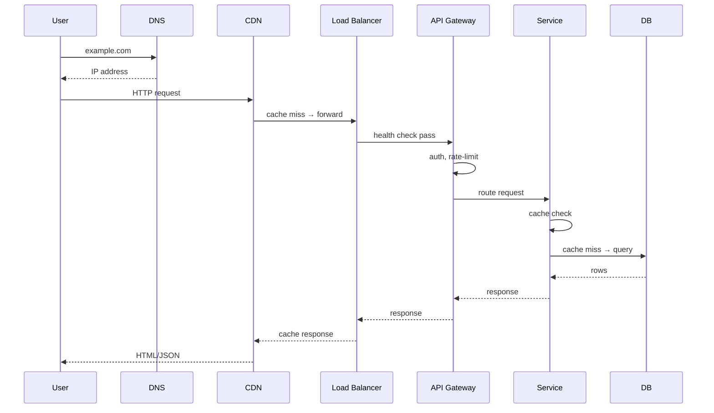
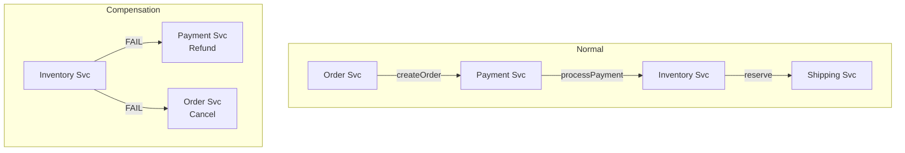
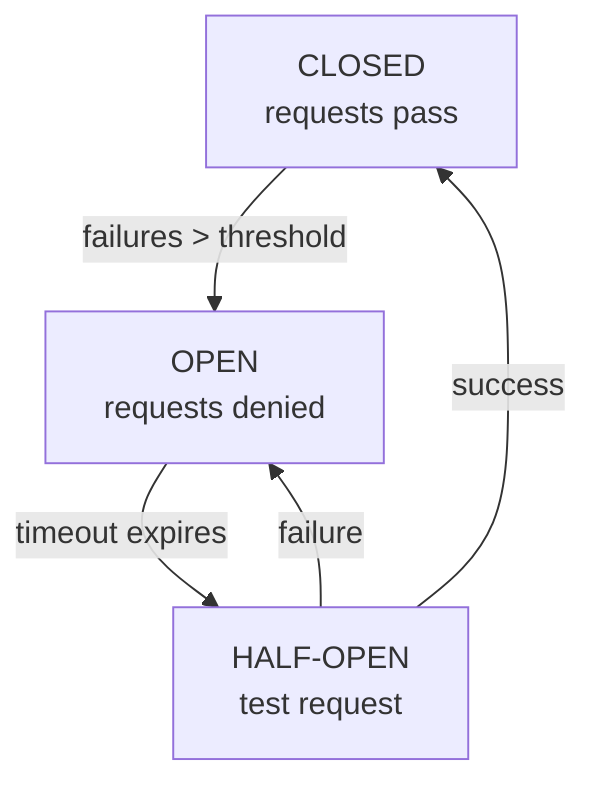
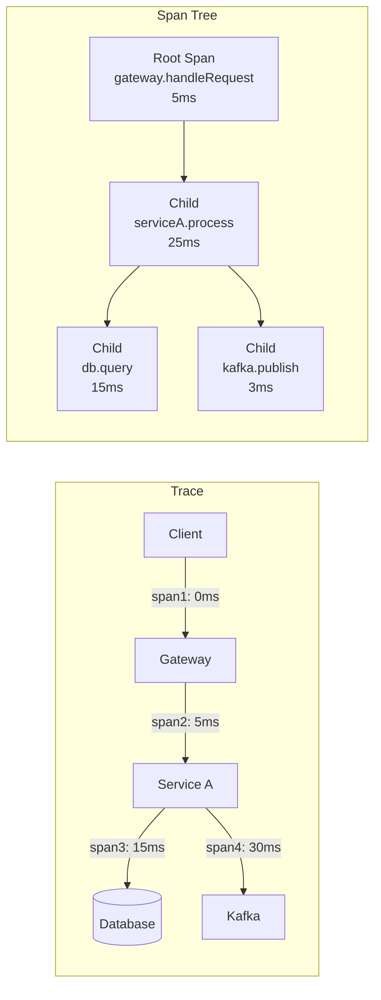
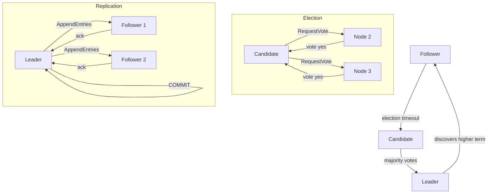
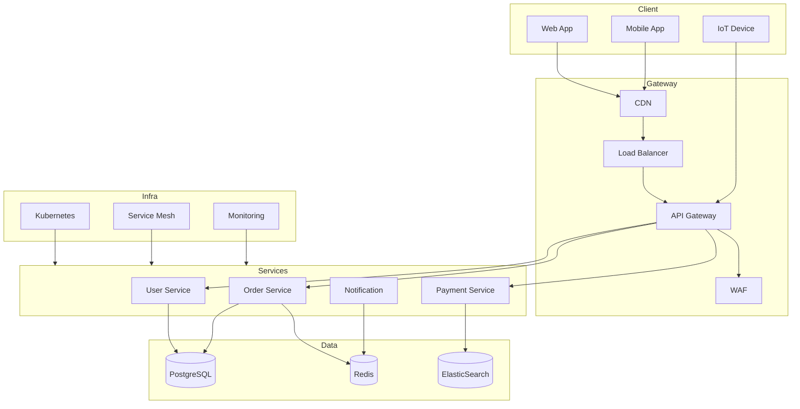

# MICROSERVICES & SYSTEM DESIGN — COMPLETE REFERENCE

> Extracted from the Study Lab project inputs (ByteByteGo visual references, architecture docs, and system design knowledge base).
> All case studies (YouTube, Uber, Instagram, etc.) deliberately excluded. Pure concepts only.

**Related**: [Load Balancers](loadbalancer.md) · [Kubernetes](k8s.md) · [Protocols](protocols.md) · [Design Patterns](designpatterns.md) · [Database Indexes](indexes.md)

---

## Table of Contents

- [Software Architecture Styles](#1-software-architecture-styles)
  - [Architecture Pattern Taxonomy](#11-architecture-pattern-taxonomy)
- [Microservice Architecture — Deep Dive](#2-microservice-architecture--deep-dive)
  - [Core Principles](#21-core-principles)
  - [Domain Layout](#22-microservice-domain-layout)
  - [Decomposition Strategies](#23-decomposition-strategies)
  - [Communication Patterns](#24-microservice-communication-patterns)
  - [Service Discovery](#25-service-discovery)
  - [Configuration Management](#26-configuration-management)
- [Compute Spectrum](#3-compute-spectrum)
- [Networking & Protocols](#4-networking--protocols)
  - [Protocol Reference](#41-protocol-reference)
  - [Request Lifecycle](#42-request-lifecycle)
  - [DNS Resolution Chain](#43-dns-resolution-chain)
  - [TLS Handshake](#44-tls-handshake)
- [Load Balancing](#5-load-balancing)
- [Caching](#6-caching)
- [Databases](#7-databases)
  - [Scaling Strategies](#71-db-scaling-strategies-wheel-layout)
  - [SQL vs NoSQL](#72-sql-vs-nosql)
  - [CAP Theorem](#73-cap-theorem)
  - [Database Internals](#74-database-internals)
- [Messaging & Event-Driven](#8-messaging--event-driven)
  - [Kafka Architecture](#82-kafka-architecture)
  - [Exactly-Once Semantics](#exactly-once-semantics)
  - [Outbox Pattern](#outbox-pattern)
- [Distributed Transactions & Sagas](#9-distributed-transactions--sagas)
- [Resilience Patterns](#10-resilience-patterns)
- [Security & Auth](#11-security--auth)
- [Observability](#12-observability)
  - [Three Pillars](#121-three-pillars)
  - [RED Method](#123-red-method-microservice-health)
  - [USE Method](#124-use-method-infrastructure-health)
  - [Distributed Tracing](#125-distributed-tracing)
- [Kubernetes Production](#13-kubernetes-production)
- [Compute & Cloud Architecture](#14-compute--cloud-architecture)
  - [Cloud Service Models](#141-cloud-service-model-responsibilities)
  - [AWS Architecture](#142-aws-architecture-common-pattern)
  - [Cloud Mapping](#143-cloud-equivalent-mapping)
- [Service Mesh & Proxy](#15-service-mesh--proxy)
- [Rate Limiting](#16-rate-limiting)
- [Database Scaling Strategies — Detailed](#17-database-scaling-strategies--detailed)
- [Consistent Hashing](#18-consistent-hashing)
- [Distributed Locks](#19-distributed-locks)
- [API Gateway — Complete](#20-api-gateway--complete)
- [Infrastructure & CI/CD](#21-infrastructure--cicd)
- [Advanced System Design Concepts](#22-advanced-system-design-concepts)
  - [Raft Consensus](#221-distributed-consensus-raft)
  - [Distributed Tracing](#222-distributed-tracing-full-span)
  - [Queue-Based Load Leveling](#223-queue-based-load-leveling)
  - [Backpressure Strategies](#224-backpressure-strategies)
- [CS Fundamentals](#23-computer-science-fundamentals-system-design-related)
  - [Time & Space Complexity](#231-time--space-complexity-reference)
  - [CAP Theorem](#232-cap-theorem--real-world-trade-offs)
  - [ACID vs BASE](#233-acid-vs-base)
- [Production Architecture Patterns](#24-production-architecture-patterns-reference-layout)
  - [Layer Stack](#241-layer-stack-bytebytego-style)
  - [Protocol Color Standard](#242-protocol-color-standard)

---

# 1. SOFTWARE ARCHITECTURE STYLES

## 1.1 Architecture Pattern Taxonomy

### By Composition
- **Monolithic**: Single deployable unit. Pros: simple dev, easy test, low latency. Cons: scales poorly, tight coupling, tech lock-in
- **Microservices**: Decomposed by bounded context. Pros: independent deploy, tech diversity, team autonomy. Cons: distributed complexity, network overhead, data consistency
- **Nanoservices**: Over-decomposed microservices (anti-pattern). Too small → orchestration overhead > business logic
- **Microkernel (Plugin)**: Core system + pluggable extensions. Eclipse, VS Code pattern
- **Layered (n-tier)**: Presentation → Business → Persistence → Database. Separation of concerns
- **Hexagonal (Ports & Adapters)**: Core logic isolated from infrastructure via ports/adapters. Testable, framework-independent

### By Connections
- **REST**: Stateless, resource-oriented, HTTP verbs. Most common for external APIs
- **Backend-for-Frontend (BFF)**: Dedicated backend per client type (web, mobile, IoT). Optimizes per-client experience
- **Peer-to-Peer (P2P)**: No central coordinator. Direct node communication (BitTorrent, blockchain)
- **SOA**: Enterprise service bus. Heavy middleware. Mostly superseded by microservices
- **Client-Server/RPC**: Tight coupling, stub-based. gRPC, Thrift, Dubbo

### By Events
- **Pub/Sub**: Publishers → Topic/Broker → Subscribers. Kafka, SNS, RabbitMQ
- **CQRS**: Separate read/write models. Commands mutate, queries read. Optimize independently
- **Event Sourcing**: State = sequence of immutable events. Full audit trail, temporal queries
- **Reactive Architecture**: Event-driven, resilient, elastic, message-driven. Reactive Manifesto

### By Purpose
- **API Platform**: Centralized API management (Kong, Apigee, AWS API GW)
- **Digital Integration Hub**: Real-time data aggregation across silos
- **Dev Portal**: Developer-facing API documentation, SDK generation, key management
- **Internal Developer Platform (IDP)**: Self-service infrastructure abstractions (Backstage, Humanitec)

### By Data
- **Data Fabric**: Unified data virtualization across heterogeneous sources
- **Data Mesh**: Domain-oriented decentralized data ownership (product thinking for data)
- **Data Warehouse**: Centralized analytical store (Redshift, Snowflake, BigQuery)

### By Stream
- **Fast Data**: Real-time streaming analytics (Kafka Streams, Flink, Spark Streaming)
- **Pipe & Filter**: Sequential processing stages connected by pipes (Unix philosophy)
- **Brokers**: Message routing and buffering (Kafka, RabbitMQ)

### By Knowledge
- **Blackboard**: Shared knowledge base + specialized agents collaborating (AI systems)
- **Rule-Based**: If-then decision engine (Drools, EasyRules)
- **AutoML**: Automated model selection and hyperparameter tuning

---

# 2. MICROSERVICE ARCHITECTURE — DEEP DIVE

## 2.1 Core Principles

| Principle | Description |
|---|---|
| **Bounded Context** | Each service owns a well-defined domain boundary (DDD) |
| **Database per Service** | No shared databases between services |
| **Deploy Independently** | CI/CD per service, zero coordination |
| **Tech Diversity** | Each service picks best language/database for its job |
| **Team Autonomy** | Teams own their services end-to-end |
| **Design for Failure** | Resilience patterns are mandatory, not optional |

## 2.2 Microservice Domain Layout

```
┌─────────────────────────────────────────────────┐
│  CLIENT TIER                                     │
│  [Web App] [Mobile App] [CLI] [Third-party]     │
├─────────────────────────────────────────────────┤
│  API GATEWAY (single entry)                     │
├─────────────────────────────────────────────────┤
│  DOMAIN A (teal)        │  DOMAIN B (purple)    │
│  ┌────────────────────┐ │  ┌──────────────────┐│
│  │ Service A1         │ │  │ Service B1       ││
│  │ Service A2         │ │  │ Service B2       ││
│  │ Service A3         │ │  └──────────────────┘│
│  │ ┌──────┐┌──────┐   │ │  ┌──────┐           ││
│  │ │ DB A ││ DB A2│   │ │  │ DB B │           ││
│  │ └──────┘└──────┘   │ │  └──────┘           ││
│  └────────────────────┘ │                      │
├─────────────────────────────────────────────────┤
│  SIDE PANELS                                     │
│  [Identity Provider]  [Service Registry]        │
│  [Config Server]      [Tracing] [Metrics]       │
└─────────────────────────────────────────────────┘
```

## 2.3 Decomposition Strategies

### By Business Capability
- `Order Service`, `Payment Service`, `Inventory Service`, `Shipping Service`
- Maps 1:1 to business capabilities
- Most stable decomposition boundary

### By Subdomain (DDD)
- Core domain (competitive advantage)
- Supporting subdomain (necessary but not unique)
- Generic subdomain (off-the-shelf, e.g., auth, notifications)

### By Volatility
- High-change services isolated from stable services
- Reduces blast radius of frequent deployments

### By Data Characteristics
- Transactional (OLTP) vs Analytical (OLAP)
- Structured vs Unstructured
- Hot vs Cold data access patterns

## 2.4 Microservice Communication Patterns

| Pattern | Protocol | Use Case |
|---|---|---|
| **Synchronous** | REST/gRPC | Query, real-time, simple request-response |
| **Asynchronous** | Kafka/SQS/RabbitMQ | Event propagation, decoupling, buffering |
| **Hybrid** | Both | Command sync, event async (CQRS pattern) |

### Service Mesh
- Sidecar proxy per service pod (Istio, Linkerd)
- Traffic management, mTLS, observability offloaded from app code
- Envoy: most popular data-plane proxy

### API Gateway Patterns
- **Gateway Routing**: Single endpoint → internal services
- **Gateway Aggregation**: Fan-out to multiple services, merge response
- **BFF**: Dedicated gateway per client type
- **Strangler Fig**: Gradually migrate monolith to microservices via gateway routing

## 2.5 Service Discovery

| Pattern | Mechanism | Example |
|---|---|---|
| **Client-Side** | Client queries registry, picks instance | Netflix Eureka + Ribbon |
| **Server-Side** | Load balancer knows healthy instances | AWS ALB, Kubernetes Service |
| **DNS-Based** | DNS resolves to healthy instances | Consul DNS, CoreDNS (K8s) |
| **Service Mesh** | Sidecar proxies handle discovery | Istio + Envoy |

## 2.6 Configuration Management

- **Externalized Config**: Environment variables, ConfigMaps, etcd
- **Config Server**: Spring Cloud Config, Consul, AWS Parameter Store
- **Feature Flags**: Split.io, LaunchDarkly, FF4j
- **Sealed Secrets**: Encrypted secrets in Git (Bitnami Sealed Secrets)
- **Vault**: Dynamic secrets, rotation, audit (HashiCorp Vault)

---

# 3. COMPUTE SPECTRUM

```
┌─────────────────────────────────────────────────┐
│  BARE METAL                                      │
│  Full control, highest performance               │
│  Ops-heavy, slow provisioning                    │
├─────────────────────────────────────────────────┤
│  VIRTUAL MACHINES (EC2, GCE, Azure VM)           │
│  Good isolation, flexible                        │
│  OS overhead, slower boot                        │
├─────────────────────────────────────────────────┤
│  CONTAINERS (Docker, containerd)                 │
│  Lightweight, fast boot, portable                │
│  Shared kernel, less isolation                   │
├─────────────────────────────────────────────────┤
│  ORCHESTRATION (Kubernetes, Nomad, Swarm)        │
│  Self-healing, autoscaling, service discovery    │
│  Operational complexity                          │
├─────────────────────────────────────────────────┤
│  SERVERLESS (Lambda, Cloud Functions)            │
│  Zero infrastructure management                  │
│  Cold starts, execution limits, vendor lock      │
├─────────────────────────────────────────────────┤
│  EDGE (CloudFront, Cloudflare Workers, Fastly)   │
│  Closest to user, sub-ms latency                 │
│  Limited compute, constrained environment        │
└─────────────────────────────────────────────────┘
```

---

# 4. NETWORKING & PROTOCOLS

## 4.1 Protocol Reference

| Protocol | Type | Latency | Payload | Use Case |
|---|---|---|---|---|
| **HTTP/1.1** | Text | Higher | Any | Legacy REST, simple APIs |
| **HTTP/2** | Binary | Lower | Any | Multiplexed, streaming, gRPC uses it |
| **HTTP/3 (QUIC)** | UDP-based | Lowest | Any | Lossy networks, mobile, video |
| **gRPC** | Binary/Protobuf | Lowest | Structured | Inter-service, streaming, low-latency |
| **WebSocket** | Full-duplex | Low | Any | Real-time, live updates, gaming |
| **GraphQL** | Query lang | Variable | Structured | Flexible client queries, aggregation |
| **SSE** | Server→Client | Low | Text | One-way real-time (notifications) |

## 4.2 Request Lifecycle

```
┌─────────┐  ① User enters URL
│  Client  │
└────┬────┘
     │ ② DNS resolution
     ▼
┌─────────┐  ③ DNS: Browser cache → OS cache → Recursive resolver
│   DNS   │           → Root NS → TLD NS → Authoritative NS
└────┬────┘
     │
     ▼
┌─────────┐  ④ CDN (CloudFront, Cloudflare, Akamai)
│   CDN   │     Cache hit → served from edge
└────┬────┘     Cache miss → forward to origin
     │
     ▼
┌─────────┐  ⑤ Load Balancer (ALB, NGINX, Envoy)
│   LB    │     Health check → forward to healthy backend
└────┬────┘     Algorithms: round-robin, least-conn, weighted
     │
     ▼
┌─────────┐  ⑥ API Gateway (auth, rate-limit, route)
│ Gateway │
└────┬────┘
     │
     ▼
┌─────────┐  ⑦ Service (business logic, cache check)
│ Service │     Cache hit → return
└────┬────┘     Cache miss → query DB
     │
     ▼
┌─────────┐  ⑧ Database (read/write, index scan)
│   DB    │
└─────────┘
     │
     ▼
   Response flows back through reverse chain
```



## 4.3 DNS Resolution Chain

```
browser → Browser Cache
               ↓ miss
          OS Resolver (getaddrinfo)
               ↓ miss
          Local DNS Resolver (ISP / 8.8.8.8)
               ↓ miss
          Root Nameserver (.) → .com → example.com
               ↓ returns NS for .com
          TLD Nameserver (.com)
               ↓ returns NS for example.com
          Authoritative Nameserver (example.com)
               ↓ returns A/AAAA/CNAME record
          IP address → TCP/TLS → HTTP request
```

## 4.4 TLS Handshake

```
Client                          Server
  │──── ClientHello ───────────▶│
  │   (TLS version, cipher suites)│
  │◀─── ServerHello ────────────│
  │   (chosen cipher, cert chain)│
  │◀─── Certificate ────────────│
  │   (CA-signed public key)    │
  │◀─── ServerHelloDone ────────│
  │──── ClientKeyExchange ─────▶│
  │   (pre-master secret, encrypted)│
  │──── ChangeCipherSpec ──────▶│
  │──── Finished ──────────────▶│
  │◀─── ChangeCipherSpec ───────│
  │◀─── Finished ──────────────│
  │         SECURE              │
```

---

# 5. LOAD BALANCING

## 5.1 LB Types

| Type | Layer | Description |
|---|---|---|
| **DNS Load Balancing** | L7 | Multiple A records, DNS round-robin |
| **Hardware LB** | L4-L7 | F5 Big-IP, Citrix ADC (expensive, legacy) |
| **Software LB** | L4-L7 | NGINX, HAProxy, Envoy, Traefik |
| **Cloud LB** | L4-L7 | ALB (HTTP), NLB (TCP), GLB (cross-region) |
| **Service Mesh LB** | L7 | Istio, Linkerd (sidecar level) |
| **Client-Side LB** | L7 | Ribbon, client picks from registry |

## 5.2 Load Balancing Algorithms

```
ROUND ROBIN      → A → B → C → A → B → C →  (simple, no health awareness)
LEAST CONNECTIONS → pick instance with fewest active connections
WEIGHTED RR       → 10 req → A(5), B(3), C(2)  (capacity-aware)
IP HASH          → same client → same server  (sticky sessions)
RANDOM           → statistically balanced
GEOLOCATION      → route to nearest region
RESOURCE-BASED   → pick lowest CPU/memory (Envoy, NGINX Plus)
```

## 5.3 Health Checks

```
PASSIVE: Detect failures from real traffic (5xx responses → mark unhealthy)
ACTIVE:  Periodic probes (/health, /ready) → remove unhealthy from pool

Graceful degradation: connection draining before removal
```

---

# 6. CACHING

## 6.1 Cache Layers

```
┌─────────────────────────────────────────────────┐
│  L1: Browser Cache (Cache-Control, ETag)         │
├─────────────────────────────────────────────────┤
│  L2: CDN Edge (CloudFront, Cloudflare)           │
├─────────────────────────────────────────────────┤
│  L3: Reverse Proxy (Varnish, NGINX, Fastly)     │
├─────────────────────────────────────────────────┤
│  L4: Application Cache (In-memory, Redis/Memcached)│
├─────────────────────────────────────────────────┤
│  L5: Database Cache (Shared Buffers, InnoDB)     │
└─────────────────────────────────────────────────┘
```

## 6.2 Cache Strategies

| Strategy | Read | Write | Use Case |
|---|---|---|---|
| **Cache-Aside** | Miss → load from DB → set cache | Write to DB, invalidate cache | Read-heavy workloads |
| **Read-Through** | Cache reads DB on miss | Write to DB | Simpler app code |
| **Write-Through** | Normal | Write to cache + DB synchronously | Consistency critical |
| **Write-Behind** | Normal | Write to cache, async flush to DB | High write throughput |
| **Refresh-Ahead** | Predictively refresh before expiry | Normal | Predictable access patterns |

## 6.3 Cache Eviction Policies

| Policy | Behavior | Use Case |
|---|---|---|
| **LRU** | Evict least recently used | Most common, temporal locality |
| **LFU** | Evict least frequently used | Content with stable popularity |
| **FIFO** | Evict oldest first | Simple, predictable |
| **TTL** | Time-based expiry | Sessions, time-sensitive data |
| **Random** | Evict random item | Simple, uniform access |

## 6.4 Cache Invalidation

```
Cache invalidation is one of the two hard things in CS.

STRATEGIES:
  - TTL-based (eventually consistent)
  - Write-through (strongly consistent)
  - Publish invalidation event → consumers evict
  - Version keys (v2_ prefix)
  - mTLS cache purge (CDN)

THUNDERING HERD: 1000 concurrent cache misses → DB stampede
  SOLUTION: Mutex on cache miss, only one loads from DB
```

---

# 7. DATABASES

## 7.1 DB Scaling Strategies (Wheel Layout)

```
                    ┌─────────────┐
                   /  INDEXING    \
                  /   (orange)     \
                 /   query speed    \
                ┌─────────────────┐
               │   DB SCALING     │
               │   STRATEGIES     │
                └─────────────────┘
    ┌──────────/                   \──────────┐
   /          /                     \          \
  / CACHING  │                       │          \
 / (yellow) │                         │ SHARDING \
│ minimize  │                         │ (blue)    │
│ DB reads  │                         │ horizontal│
└──────────┘                         └──────────┘
    \          \                     /          /
     \          ┌───────────────────┐          /
      \────────│  REPLICATION      │─────────/
               │  (red)            │
               │  read replicas    │
                └─────────────────┘
    ┌──────────┐                   ┌──────────┐
   /DENORMALIZ.│                   │ VERTICAL  \
  / (purple)   │                   │ SCALING   \
 │ read perf   │                   │ (pink)     │
 └─────────────┘                   │ bigger box  │
                                    └────────────┘
    ┌──────────┐
   /MATERIALIZED│
  / (green)     \
 │ pre-computed  │
 └───────────────┘
```

### 7.1.1 Indexing
- B-Tree (default, general purpose)
- Hash Index (exact match, O(1) lookups)
- GiST/GIN (full-text, geospatial)
- BRIN (large sorted data)
- Composite Indexes (column order matters)
- Covering Index (include all queried columns)

### 7.1.2 Replication
```
LEADER-BASED (single writer → multiple readers)
  Sync: leader waits for ≥1 replica ack
  Async: leader returns immediately, replica may lag
  Semi-sync: at least one replica synced

LEADERLESS (Dynamo-style, Cassandra)
  Any node accepts writes
  Read repair, hinted handoff

MULTI-LEADER (CockroachDB, MySQL Group Replication)
  Multiple writers, conflict resolution
  Cross-region HA
```

### 7.1.3 Sharding
```
KEY RANGE → split by value range (user_id 1-10000 → shard 0)
HASH      → hash(key) % N shards (even distribution, bad range queries)
DIRECTORY → lookup table for key→shard mapping (flexible, SPOF)
GEO       → shard by region (latency optimization, data sovereignty)

CHALLENGES:
  - Cross-shard queries (JOIN, aggregation)
  - Distributed transactions (2PC, Saga)
  - Resharding (consistent hashing helps)
  - Hot shards (key skew)
```

### 7.1.4 Denormalization
- Trade storage for read performance
- Pre-join data into read-optimized format
- Fan-out pattern: duplicate data to multiple locations
- Risk: data inconsistency, update complexity

### 7.1.5 Materialized Views
- Pre-computed query results stored as table
- Refresh on schedule or via triggers
- Good for dashboards, aggregates, slow aggregations
- Trade-off: stale data vs query performance

### 7.1.6 Vertical Scaling
- Bigger instance (more CPU, RAM, faster storage)
- Simplest approach, but has hard limits
- Expensive at high end, single point of failure

## 7.2 SQL vs NoSQL

| Dimension | SQL (PostgreSQL, MySQL) | NoSQL (MongoDB, DynamoDB, Cassandra) |
|---|---|---|
| Schema | Rigid, migrations needed | Flexible, schema-on-read |
| ACID | Yes (full transactions) | Limited (BASE, eventual) |
| Joins | Native | Avoid (denormalize) |
| Scaling | Vertical + read replicas | Horizontal (native sharding) |
| Consistency | Strong | Tunable (eventual/strong) |
| Use Case | OLTP, financial, complex queries | High scale, flexible schema, fast writes |

## 7.3 CAP Theorem

```
Consistency (C) ─── Availability (A)
        \            /
         \          /
          \        /
     Partition Tolerance (P)

In a distributed system:
  - You MUST tolerate P (network partitions happen)
  - You choose between C and A
  - CP: Wait for partition to heal (ZooKeeper, etcd)
  - AP: Accept stale reads (DynamoDB, Cassandra)
  - CA: Not possible in distributed systems (only single-node)

Trade-off is NOT binary — tunable consistency (Cassandra, CockroachDB)
```

## 7.4 Database Internals

### PostgreSQL
- MVCC: Every write creates new row version, readers see snapshot
- WAL: Write-Ahead Log, crash recovery, replication stream
- Vacuum: Reclaim dead tuples, prevent bloat, autovacuum
- Buffer Pool: Shared buffers, eviction strategy, O_DIRECT

### Redis
- Single-threaded event loop (6.x+ has I/O threads)
- In-memory, persistence via RDB/AOF
- Eviction: noeviction, allkeys-lru, volatile-ttl, allkeys-random
- Pub/Sub, Streams (log-based), sorted sets, hyperloglog
- Replication: leader-follower, partial resync via repl backlog

### ElasticSearch
- Index = logical namespace, Shard = Lucene instance
- Primary shard + replica shards
- Refresh = make doc visible (near-real-time, ~1s)
- Flush = commit to disk (fsync)
- Segment merging: background, reduces file count, I/O heavy

---

# 8. MESSAGING & EVENT-DRIVEN

## 8.1 Messaging Patterns

| Pattern | Description | Example |
|---|---|---|
| **Point-to-Point** | One producer, one consumer (queue) | SQS, RabbitMQ queue |
| **Pub/Sub** | One producer, many consumers (topic) | Kafka, SNS |
| **Request-Reply** | Request queue + response queue | RPC over messaging |
| **Event Streaming** | Ordered log, replayable | Kafka, Pulsar, Kinesis |
| **Dead Letter Queue** | Failed messages after N retries | SQS DLQ, Kafka DLQ |

## 8.2 Kafka Architecture

### Core Concepts
```
PARTITION: Ordered, immutable log. Append-only. Key → hash → partition
BROKER: Server storing partition replicas. Leader + ISR followers
TOPIC: Logical stream. Divided into N partitions for parallelism
CONSUMER GROUP: Group of consumers sharing partition ownership
OFFSET: Unique position in partition log. Committed on consumption
ISR: In-Sync Replicas. Followers caught up with leader
```

### Producer Flow
```
App → [batch] → [compress (snappy/gzip/zstd)] → [partitioner (key hash)]
     → [leader partition] → [acks=all] → [leader waits for ISR ack]
     → [offset returned]
```

### Consumer Flow
```
poll(500ms) → [deserialize] → [process business logic]
     → [commitSync() / commitAsync()] → next poll
```

### Consumer Groups & Rebalancing
```
JOIN GROUP (member joins)
  → Group Coordinator assigns partitions
  → EAGER REBALANCE: all consumers stop, partitions revoked, reassigned
  → COOPERATIVE REBALANCE: incremental, only reassign needed partitions

KEY RULE: Max consumer parallelism = partition count.
  More consumers than partitions = idle consumers.
```

### Producer Configs
| Config | What It Controls |
|---|---|
| `acks=0` | Fire-and-forget, highest throughput, may lose data |
| `acks=1` | Leader ack only, leader crash = data loss |
| `acks=all` | Leader + ISR ack, safest. Requires `min.insync.replicas` |
| `enable.idempotence=true` | Exactly-once producer, prevents duplicates from retries |
| `batch.size` | Max batch in bytes before sending. Larger = higher throughput |
| `linger.ms` | Max wait before sending partial batch. Trade latency for throughput |
| `compression.type` | snappy/gzip/zstd/lz4. Reduces network + storage |

### Replication & Durability

```
Topic Partitions
  ┌────────────┐
  │ Partition 0 │──Leader (Broker 1)
  └────────────┘
        │ replicas
  ┌────────────┐
  │ Follower 1 │──ISR (Broker 2)
  └────────────┘
  ┌────────────┐
  │ Follower 2 │──ISR (Broker 3)
  └────────────┘

LEADER FAILURE:
  1. Controller detects leader heartbeat timeout
  2. Picks new leader from ISR list
  3. Updates partition metadata (ZK/KRaft)
  4. Producer/consumer refresh metadata

UNREPLICATED DATA LOSS SCENARIO:
  Producer acks=all → leader writes → crash before ISR sync
  New leader (old ISR) never saw that message → DATA LOST
  Fix: min.insync.replicas=2 (requires at least 2 ISR to ack)
```

### Exactly-Once Semantics
```
IDEMPOTENT PRODUCER (enable.idempotence=true):
  - Producer ID + sequence number per partition
  - Broker deduplicates on sequence match
  - Prevents producer retry duplicates only

TRANSACTIONS:
  - beginTransaction() / commitTransaction() / abortTransaction()
  - Atomic write to multiple partitions
  - Transactional offset commits
  - Read-process-write exactly-once

CONSUMER EOS:
  - Read committed messages only (isolation.level=read_committed)
  - Transactional offset commits
  - Exactly-once processing requires all three components
```

### Lag, Backpressure & Hot Partitions
```
PRODUCER RATE >>> CONSUMER RATE
  → Partition lag grows
  → Memory pressure on broker (retention eats disk)
  → Rebalance storms if max.poll.interval.ms exceeded
  → Total partitions / total consumers = max parallelism

SOLUTIONS:
  - Increase partitions (can't shrink most systems)
  - Increase consumers (only up to partition count)
  - Batch processing, async writes to downstream
  - Backpressure to producer (rate limit, pause)
  - Retry topics for failed messages (don't block main)

HOT PARTITION:
  One partition receives 90% traffic due to key skew
  Solutions: composite keys, key bucketing, random suffix, partition sharding
```

### Idempotency & Duplicate Prevention
```
PRODUCER DUPLICATES: enable.idempotence=true prevents retry duplicates
CONSUMER DUPLICATES: Application-level idempotency required
  - Idempotency key in event payload
  - Store processed keys in Redis/DB
  - Check before processing

EOS DOES NOT COVER:
  - Application-level duplicates
  - Replay duplicates
  - Manual offset reset duplicates
```

### Outbox Pattern
```
PROBLEM: Dual-write — DB update + Kafka publish must be atomic

SOLUTION:
  1. Business transaction: update order table + INSERT outbox_event
  2. Commit DB transaction (atomic!)
  3. CDC (Debezium) reads outbox table from WAL
  4. CDC publishes event to Kafka
  5. Consumer processes event

ALTERNATIVE: Transactional Outbox (Kafka Connect + JDBC Source Connector)
  - Avoids dual-write problem
  - Guarantees at-least-once delivery
  - Idempotent consumers for exactly-once
```

### Kafka vs Others

| System | Model | Strength | Weakness |
|---|---|---|---|
| **Kafka** | Pull log | High throughput, replay, ordered | Complex ops, no per-message routing |
| **RabbitMQ** | Push queue | Flexible routing, per-message ack | Lower throughput, no log replay |
| **SQS** | Cloud queue | Managed, auto-scaled | No ordering (standard), 256KB limit |
| **Pulsar** | Segment log | Multi-tenant, geo-replication, compute/storage separation | Newer, smaller ecosystem |
| **NATS** | Lightweight | Ultra-low latency, simple | No durable storage, no replay |

---

# 9. DISTRIBUTED TRANSACTIONS & SAGAS

## 9.1 Transaction Patterns

| Pattern | Type | Guarantee | Use Case |
|---|---|---|---|
| **2PC** | Coordinator | Strong ACID | Short-lived, trusted participants |
| **Saga** | Choreography/Orchestration | Eventual Consistency | Long-running, cross-service |
| **TCC** | Try-Confirm/Cancel | Compensatable | Reservation systems |
| **Outbox** | CDC-based | At-least-once | Dual-write problem |

## 9.2 Saga Patterns

### Choreography Saga
```
Order Service → OrderCreated event
  ↓
Payment Service ← receives, processes → PaymentCompleted event
  ↓
Inventory Service ← receives, processes → InventoryReserved event
  ↓
Shipping Service ← receives, processes → ShipmentCreated event

FAILURE:
  Inventory reservation fails
  → Inventory publishes InventoryFailed
  → Payment listens, issues RefundPayment event
  → Order listens, issues CancelOrder event

Pros: No coordinator, simple
Cons: Event tracing complex, cyclic dependencies possible
```

### Orchestration Saga
```
Orchestrator Service
  ├── (1) Create Order
  ├── (2) Process Payment
  ├── (3) Reserve Inventory
  └── (4) Arrange Shipping

FAILURE → orchestrator sends COMPENSATION events in reverse order
  (4 skip) ← (3 fail) → Compensate Payment → Cancel Order

Pros: Central coordination, clear flow
Cons: Orchestrator SPOF, coupling to orchestrator
```



---

# 10. RESILIENCE PATTERNS

## 10.1 Circuit Breaker

```
States:
  CLOSED  → normal operation, requests pass through
  OPEN    → failures exceed threshold, requests blocked immediately
  HALF-OPEN → after timeout, allow test request to probe recovery

┌────────────────────┐
│      CLOSED        │
│ (request passes)   │
└────────┬───────────┘
         │ N failures > threshold
         ▼
┌────────────────────┐
│       OPEN         │
│ (request denied)   │
└────────┬───────────┘
         │ timeout expires
         ▼
┌────────────────────┐
│    HALF-OPEN       │
│ (1 test request)   │
└────────────────────┘
    │          │
  success    failure
    │          │
    ▼          ▼
 CLOSED      OPEN
```



## 10.2 Retry Patterns

```
EXPONENTIAL BACKOFF:
  retry 1: wait 100ms
  retry 2: wait 200ms
  retry 3: wait 400ms
  retry 4: wait 800ms
  ... cap at max_interval (e.g., 30s)

JITTER: Add randomness to prevent thundering herd
  wait = base * 2^attempt + random(0, base)

MAX RETRIES: Hard limit (usually 3-5)
  After exhaustion → fallback or error response

RETRY STORM: Cascading retries amplify outage
  Fix: circuit breaker + capped retries + backoff
```

## 10.3 Bulkhead

```
Isolate resources per dependency (thread pools, connections)

┌────────────────────────────┐
│      THREAD POOL           │
│                            │
│  ┌────────┐ ┌────────┐    │
│  │ Service│ │ Service│    │
│  │   A    │ │   B    │    │
│  │ max=10 │ │ max=5  │    │
│  └────────┘ └────────┘    │
│  ┌────────┐ ┌────────┐    │
│  │ Service│ │ Default│   │
│  │   C    │ │ max=2  │   │
│  │ max=3  │ └────────┘    │
│  └────────┘               │
└────────────────────────────┘

Service B slow → only its 5 threads block, A, C, default unaffected
```

## 10.4 Timeouts

| Type | Description | Default |
|---|---|---|
| **Connection Timeout** | Max time to establish TCP connection | 500ms-5s |
| **Request Timeout** | Max time for full request-response | 10s-30s |
| **Read Timeout** | Max time between data packets | 30s-60s |
| **Idle Timeout** | Keep connection idle before close | 60s |

## 10.5 Fallback & Degradation

```
FALLBACK:
  Primary → cached response / default value / static response

DEGRADATION:
  Disable non-critical features under load
  Serve stale data when fresh unavailable
  Drop low-priority requests (load shedding)

GRACEFUL SHUTDOWN:
  Signal → stop accepting new requests
  → drain active connections (connection draining)
  → cleanup resources → exit
```

---

# 11. SECURITY & AUTH

## 11.1 API Security Layers

```
┌──────────────────────────────────────────────┐
│ L7: WAF (OWASP rules, rate limiting, IP block)│
├──────────────────────────────────────────────┤
│ L6: API Gateway (auth, throttling, validation)│
├──────────────────────────────────────────────┤
│ L5: Service (JWT validation, RBAC, input sanitize)│
├──────────────────────────────────────────────┤
│ L4: Database (row-level security, encryption) │
└──────────────────────────────────────────────┘
```

## 11.2 Authentication & Authorization

| Pattern | Protocol | Use Case |
|---|---|---|
| **JWT Bearer** | OAuth2 / OIDC | Stateless API auth, claims in token |
| **Session Cookie** | Server-side session | Web apps, server-rendered |
| **API Key** | HTTP Header | Service-to-service, 3rd party |
| **mTLS** | TLS mutual auth | Microservice mesh, zero-trust |
| **Basic Auth** | Base64 encoded | Legacy, internal tools |

## 11.3 OAuth2 Flows

```
AUTHORIZATION CODE (recommended for web apps):
  User → login page → redirect to auth server
  → user authenticates → auth server returns code
  → app exchanges code for tokens (code + PKCE)

CLIENT CREDENTIALS (service-to-service):
  Service → auth server with client_id + client_secret
  → receives access token with scopes

DEVICE CODE (CLI, smart TVs):
  User gets code → visits URL on another device
  → polls for token

IMPLICIT (deprecated): No code exchange, token directly in URL
```

## 11.4 Secrets Management

```
NEVER: Store secrets in code, config files, env vars in CI

ALWAYS:
  - HashiCorp Vault (dynamic secrets, rotation, audit)
  - AWS Secrets Manager / Parameter Store
  - Kubernetes Sealed Secrets (encrypted in Git)
  - External secret operator (syncs to K8s)
  - JWT private key rotation via JWKS endpoint
```

---

# 12. OBSERVABILITY

## 12.1 Three Pillars

```
LOGS:      "My service got request X at time T"
METRICS:   "Request rate: 100/s, p99: 200ms, error: 0.5%"
TRACES:    "Request X spent 50ms in gateway, 120ms in service A,
             30ms in DB, 20ms in queue"

CORRELATION:
  trace_id → span_id → service → log line → metric
```

## 12.2 Metrics Types

| Type | Example | When |
|---|---|---|
| **Counter** | Request count, error count | Always increasing |
| **Gauge** | CPU usage, queue depth | Point-in-time value |
| **Histogram** | Request latency, response size | Distribution sampling |
| **Summary** | p50, p90, p99 latency | Pre-computed quantiles |

## 12.3 RED Method (Microservice Health)

```
RATE:    Requests per second
ERRORS:  Failed requests per second (rate, not count)
DURATION: Latency distribution (p50, p90, p99)

Every service should expose:
  total_requests_total{service, endpoint, method}
  request_duration_seconds{service, endpoint, quantile}
  request_errors_total{service, endpoint, error_code}
```

## 12.4 USE Method (Infrastructure Health)

```
UTILIZATION: % time resource busy (CPU 70%, memory 80%)
SATURATION:  Queue depth or waiting count
ERRORS:      Count of errors (disk errors, packet drops)

Every resource (CPU, memory, disk, network):
  - Utilization too high → need more or optimize
  - Saturation growing → queue buildup → imminent failure
  - Errors → immediate investigation
```

## 12.5 Distributed Tracing

```
TRACE: Complete request path through the system
SPAN: Single unit of work within a trace

Client ──── Gateway ──── Service A ──── DB
  │           │            │            │
  ⊢0ms──┤ ⊢5ms─┤ ⊢15ms─┤ ⊢25ms─┤ ⊢40ms─┤
  │           │            │            │
  (root)     (child)      (child)      (child)
             span         span         span

Trace = 50ms total
  Gateway: 5ms
  Service A: 25ms (includes DB)
  DB: 15ms
  (5 + 25 + 15 ≠ 40 because parallel/padding)

OPENTELEMETRY:
  - Instrumentation libraries (auto + manual)
  - Propagate context via HTTP headers (traceparent)
  - Async propagation via Kafka headers
```



## 12.6 Logging Best Practices

```
STRUCTURED JSON:
  {"timestamp":"2026-05-18T10:00:00Z","level":"INFO",
   "service":"payment","traceId":"abc123","message":"Payment processed",
   "amount":42.00,"userId":"u456"}

CORRELATION ID: trace_id propagated through all services
LEVELS: DEBUG, INFO, WARN, ERROR (never log sensitive data)
CENTRALIZED: Loki, ELK, Datadog (never grep on servers)
```

---

# 13. KUBERNETES PRODUCTION

## 13.1 Kubernetes Architecture Flow

```
┌──────────┐
│  Client  │
└────┬─────┘
     │
     ▼
┌──────────┐
│ Ingress  │  (Host/path-based routing, TLS termination)
└────┬─────┘
     │
     ▼
┌──────────┐
│ Service  │  (Stable virtual IP, round-robin to pods)
└────┬─────┘
     │
     ▼
┌──────────┐
│ kube-proxy│ (iptables/IPVS rules, load balances to pod IPs)
└────┬─────┘
     │
     ▼
┌──────────┐
│   Pod    │  (Container(s) with shared network + storage)
└────┬─────┘
     │
     ▼
┌──────────┐
│ Sidecar  │  (Envoy/Istio proxy, logs, metrics)
└──────────┘
```

## 13.2 Pod Lifecycle

```
Pending → ContainerCreating → Running → Succeeded/Failed

  CRASHLOOPBACKOFF: Pod starts, crashes, restarts with exponential backoff
    → CrashLoopBackOff state → investigate logs

  OOMKILL: Container exceeds memory limit → killed → restarts
    → If OOM persists → keep restarting or get stuck

  PROBES:
    livenessProbe: Is app alive? Fail → restart
    readinessProbe: Is app ready to serve? Fail → remove from Service
    startupProbe: Is app fully initialized? Delays liveness check
```

## 13.3 Autoscaling (HPA)

```
CPU > 80% → HPA increases replicas
Memory > 80% → HPA increases replicas
Custom metric (Kafka lag > 1000) → HPA increases consumers

REPLICAS:
  min: 2 (HA)
  max: 20 (burst capacity)

COOLDOWN:
  scale up: immediate (30s)
  scale down: 5 min stabilization window
```

## 13.4 Rolling Update

```
Update Strategy: RollingUpdate
  maxUnavailable: 25%
  maxSurge: 25%

Step 1: New ReplicaSet created (1 new pod)
Step 2: New pod becomes Ready
Step 3: 1 old pod terminated (connection drained)
Step 4: Repeat until all pods replaced

ROLLBACK:
  kubectl rollout undo deployment/<name>
  → reverts to previous ReplicaSet
```

---

# 14. COMPUTE & CLOUD ARCHITECTURE

## 14.1 Cloud Service Model Responsibilities

```
┌─────────────────────────────────────────────────┐
│  ON-PREM                                YOU     │
│  ┌───────────────────────────────────────────┐  │
│  │ DATA        ── YOU manage everything       │  │
│  │ APPLICATIONS                               │  │
│  │ RUNTIME                                    │  │
│  │ OS                                         │  │
│  │ VIRTUALIZATION                             │  │
│  │ SERVERS                                    │  │
│  │ STORAGE                                    │  │
│  │ NETWORKING                                 │  │
│  └───────────────────────────────────────────┘  │
├─────────────────────────────────────────────────┤
│  IaaS (EC2)                           YOU+VENDOR│
│  ┌───────────────────────────────────────────┐  │
│  │ DATA                                       │  │
│  │ APPLICATIONS                               │  │
│  │ RUNTIME                                    │  │
│  │ OS                                         │  │
│  │ ────────────────────────────────────────   │  │
│  │ VIRTUALIZATION                             │  │
│  │ SERVERS              ── VENDOR             │  │
│  │ STORAGE                                    │  │
│  │ NETWORKING                                 │  │
│  └───────────────────────────────────────────┘  │
├─────────────────────────────────────────────────┤
│  PaaS (RDS, Elasticache)              YOU+VENDOR│
│  ┌───────────────────────────────────────────┐  │
│  │ DATA                                       │  │
│  │ APPLICATIONS                               │  │
│  │ ────────────────────────────────────────   │  │
│  │ RUNTIME                                    │  │
│  │ OS                                         │  │
│  │ VIRTUALIZATION        ── VENDOR            │  │
│  │ SERVERS                                    │  │
│  │ STORAGE                                    │  │
│  │ NETWORKING                                 │  │
│  └───────────────────────────────────────────┘  │
├─────────────────────────────────────────────────┤
│  SaaS (Kafka, Datadog)                      VENDOR│
│  ┌───────────────────────────────────────────┐  │
│  │ ────────────────────────────────────────   │  │
│  │ DATA             ── YOU JUST USE IT        │  │
│  │ ────────────────────────────────────────   │  │
│  │ EVERYTHING ELSE   ── VENDOR MANAGED        │  │
│  └───────────────────────────────────────────┘  │
└─────────────────────────────────────────────────┘
```

## 14.2 AWS Architecture (Common Pattern)

```
┌─────────────────────────────────────────────────┐
│ Route53 → CloudFront (CDN + WAF)                │
├─────────────────────────────────────────────────┤
│ CloudFront → ALB (Application Load Balancer)    │
├─────────────────────────────────────────────────┤
│ ALB → EKS Cluster (Kubernetes)                  │
│       ├── Service A (Fargate/EC2)               │
│       ├── Service B                              │
│       └── Kafka (MSK) / Redis (ElastiCache)     │
├─────────────────────────────────────────────────┤
│ EKS → RDS/Aurora (Multi-AZ) + ElastiCache       │
│     → S3 (Object Storage)                        │
│     → SQS/SNS (Async Messaging)                  │
└─────────────────────────────────────────────────┘
```

## 14.3 Cloud Equivalent Mapping

| Service | AWS | GCP | Azure |
|---|---|---|---|
| API Gateway | API Gateway + ALB | Apigee / Cloud Endpoints | API Management |
| Load Balancer | ALB / NLB | Cloud Load Balancing | Azure LB / App GW |
| CDN | CloudFront | Cloud CDN | Azure CDN / Front Door |
| Queue | SQS | Pub/Sub | Service Bus |
| Event Stream | Kinesis / MSK | Pub/Sub / Dataflow | Event Hubs |
| Object Store | S3 | Cloud Storage | Blob Storage |
| Cache | ElastiCache (Redis) | Memorystore | Azure Cache for Redis |
| SQL | RDS / Aurora | Cloud SQL / Spanner | Azure SQL / Cosmos |
| NoSQL | DynamoDB | Firestore / Bigtable | Cosmos DB |
| Containers | EKS | GKE | AKS |
| Serverless | Lambda | Cloud Functions / Run | Azure Functions |
| Service Mesh | App Mesh | Anthos Service Mesh | Open Service Mesh |

---

# 15. SERVICE MESH & PROXY

## 15.1 Architecture

```
┌─────────────────────────────────────────────────┐
│  SERVICE A                                        │
│  ┌────────────────┐  ┌────────────────┐          │
│  │ App Container   │  │ Envoy Proxy    │          │
│  │ (business logic)│◀─┤ (sidecar)      │          │
│  └────────────────┘  │ - mTLS          │          │
│                       │ - Circuit Brkr  │          │
│                       │ - Retry         │          │
│                       │ - Tracing       │          │
│                       └───────┬────────┴          │
│                               │                   │
│                               ▼                   │
│                       ┌──────────────┐            │
│                       │  Control Plane│            │
│                       │ (Istiod/Pilot)│            │
│                       │ - xDS Config │            │
│                       └──────────────┘            │
└─────────────────────────────────────────────────┘
```

## 15.2 Proxy Comparison

| Proxy | Type | Language | Use Case |
|---|---|---|---|
| **NGINX** | Reverse Proxy | C | Web serving, LB, TLS termination |
| **Envoy** | Sidecar Proxy | C++ | Service mesh, L7 routing, observability |
| **Traefik** | Reverse Proxy | Go | Kubernetes ingress, auto-discovery |
| **HAProxy** | TCP/HTTP Proxy | C | High-performance LB, TCP workloads |
| **Kong** | API Gateway | Lua/Nginx | API management, plugin ecosystem |

---

# 16. RATE LIMITING

## 16.1 Algorithms

| Algorithm | Behavior | Use Case |
|---|---|---|
| **Token Bucket** | Tokens added at fixed rate, bucket holds max tokens | Bursty traffic allowed |
| **Leaky Bucket** | Requests processed at fixed rate, queue overflow = drop | Smooth output rate |
| **Fixed Window** | Counter resets at window boundary | Simple, boundary spike issue |
| **Sliding Window Log** | Timestamp log, count in rolling window | Precise, memory heavy |
| **Sliding Window Counter** | Current window + previous window weighted | Precise, memory efficient |

## 16.2 Distributed Rate Limiting

```
SINGLE NODE: In-memory counter (fast, but not distributed)
REDIS: INCR + EXPIRE (atomic, distributed)
  - Lua script for atomic check-and-increment
  - Sliding window via sorted sets (ZREMRANGEBYSCORE)

CHALLENGES:
  - Clock skew (NTP not perfect)
  - Race conditions (atomic ops required)
  - Performance overhead at very high QPS
```

---

# 17. DATABASE SCALING STRATEGIES — DETAILED

## 17.1 Read Replicas

```
┌──────────┐     ┌──────────┐
│  Leader   │────▶│ Replica 1│  (async)
│ (writes)  │────▶│ Replica 2│  (async)
└──────────┘     └──────────┘

Reads → Replicas
Writes → Leader
Replication lag → stale reads (eventual consistency)
```

## 17.2 Sharding Architecture

```
┌─────────────────────────────────────────────┐
│              Proxy / Router                    │
│  (ProxySQL, pgpool, MongoDB Router)           │
├────────┬────────┬────────┬────────────────────┤
│Shard 0 │Shard 1 │Shard 2 │ ... Shard N        │
│DB      │DB      │DB      │                     │
│users   │users   │users   │                     │
│0-1000  │1001-   │2001-   │                     │
│        │2000    │3000    │                     │
└────────┴────────┴────────┴────────────────────┘

SHARDING KEY SELECTION:
  - High cardinality (many unique values)
  - Even distribution (no hot keys)
  - Aligned with query pattern (same shard = fast joins)
```

## 17.3 Connection Pooling

```
Pool maintains N connections per service tier.

┌──────────────┐
│  max_idle=10  │
│  max_open=50  │
│  max_lifetime=30min │
│  max_idle_time=5min │
└──────────────┘

TOO MANY CONNECTIONS = database overwhelmed
PGBOUNCER: Transaction pooling → multiplex many app connections to few DB connections
```

---

# 18. CONSISTENT HASHING

## 18.1 How It Works

```
Key → hash → position on ring [0, 2^32 - 1]
Node → hash → position on ring
Key assigned to nearest clockwise node

Ring:
      ┌─────────────────────┐
      │       Node A        │
      │         │           │
      │  key1   │           │
      │         │           │
      ├─────────┤           │
      │  Node B │           │
      │         │           │
      │  key2   │           │
      └─────────────────────┘

ADD NODE: Only keys in affected range rebalance
REMOVE NODE: Only that node's keys redistribute

VIRTUAL NODES: Each physical node = 100-200 virtual positions
  → Better distribution, less skew
```

## 18.2 Applications

```
- Database sharding (DynamoDB, Cassandra)
- Cache partitioning (Redis cluster, Memcached)
- CDN edge cache routing
- Load balancer (IP hash → consistent routing)
```

---

# 19. DISTRIBUTED LOCKS

## 19.1 Lock Mechanisms

| Mechanism | Strength | Weakness |
|---|---|---|
| **Database Lock** | `SELECT ... FOR UPDATE` | Single DB, performance |
| **Redis Lock** | `SET key NX PX 30000` (Redlock) | Needs consensus, clock drift |
| **ZooKeeper** | Sequential ephemeral nodes | Strong consistency, ZK ops |
| **etcd** | `concurrency/stm` transactions | etcd cluster required |

## 19.2 Fencing Tokens

```
PROBLEM: Long GC pause → lock lease expires → another process acquires lock
  → GC finishes → first process writes with stale lock → DATA CORRUPTION

SOLUTION: Fencing token
  Lock service increments token on each grant
  Process must send token with write request
  Resource rejects writes with stale (old) token

  Process A: lock(token=5) → GC pause (40s) → lock expires
  Process B: lock(token=6) → writes (token=6 accepted)
  Process A: wakes, writes (token=5 REJECTED)
```

---

# 20. API GATEWAY — COMPLETE

## 20.1 Gateway Responsibilities

```
REQUEST FLOW:
  Client → [Rate Limiter → Auth → Validator → Router → Aggregator] → Services

INDIVIDUAL RESPONSIBILITIES:
  Authentication:   Verify JWT/OAuth2/API Key
  Rate Limiting:    Token bucket per user/IP
  Request Validation: Schema/contract validation
  Routing:          Path → Service mapping
  Aggregation:      Fan-out to multiple services, merge response
  Transformation:   Protocol conversion, header manipulation
  Caching:          Cache static/common responses
  Logging/Audit:    Request/response logging
  Circuit Breaking:  Protect downstream from cascading failure
```

## 20.2 Gateway Patterns

```
SINGLE GATEWAY:
  All clients → one gateway → services
  Pros: Simple, single auth point
  Cons: Blast radius, team coordination bottleneck

BFF (Backend for Frontend):
  Web → Web-BFF → services
  Mobile → Mobile-BFF → services
  IoT → IoT-BFF → services
  Pros: Optimized per client, independent evolution
  Cons: More services to manage

GATEWAY AGGREGATION:
  Client → Gateway → Service A → Response A
                  → Service B → Response B
                  → Service C → Response C
  Gateway merges: {A: ..., B: ..., C: ...}
```

---

# 21. INFRASTRUCTURE & CI/CD

## 21.1 CI/CD Pipeline

```
CODE PUSH → LINT → TEST → BUILD → REGISTRY → DEPLOY

GITHUB ACTIONS / GITLAB CI / JENKINS:

  .github/workflows/deploy.yml
    - Checkout code
    - npm install / go mod download
    - npm test / go test ./...
    - docker build -t service:v1.2.3
    - docker push registry/service:v1.2.3
    - kubectl set image deployment/service service=registry/service:v1.2.3

  ARGOCD / FLUX (GitOps):
    - Git repo with Kubernetes manifests
    - ArgoCD syncs cluster state to Git state
    - Drift detection, auto-remediation
```

## 21.2 Infrastructure as Code

```
TERRAFORM:
  resource "aws_db_instance" "main" {
    instance_class = "db.r5.large"
    engine         = "postgres"
    multi_az       = true
  }

PULUMI:
  const db = new aws.rds.Instance("main", {
    instanceClass: "db.r5.large",
    engine: "postgres",
    multiAz: true,
  });
```

## 21.3 Dockerfile Best Practices

```dockerfile
# Multi-stage build
FROM golang:1.22 AS builder
WORKDIR /app
COPY go.mod go.sum ./
RUN go mod download
COPY . .
RUN CGO_ENABLED=0 go build -o /app/service

FROM alpine:3.19
RUN apk --no-cache add ca-certificates tzdata
COPY --from=builder /app/service /service
USER 1000:1000
EXPOSE 8080
ENTRYPOINT ["/service"]
```

---

# 22. ADVANCED SYSTEM DESIGN CONCEPTS

## 22.1 Distributed Consensus (Raft)

```
TERMS: Time divided into terms, each term has at most one leader

FOLLOWER → (election timeout) → CANDIDATE
CANDIDATE → (majority votes) → LEADER
LEADER → (discovers higher term) → FOLLOWER

LEADER ELECTION:
  1. Follower waits random 150-300ms (no heartbeat)
  2. Becomes Candidate, increments term
  3. RequestsVote RPC to all other nodes
  4. Majority votes → becomes Leader
  5. Sends heartbeat AppendEntries to establish authority

LOG REPLICATION:
  1. Leader receives client request
  2. Appends entry to local log
  3. Sends AppendEntries RPC to followers
  4. Majority confirm → entry COMMITTED
  5. Leader applies to state machine, responds to client
  6. Leader notifies followers → followers apply

SAFETY:
  - At most one leader per term
  - Leader never overwrites committed entries
  - Only leader with all committed entries can be elected
```



## 22.2 Distributed Tracing (Full Span)

```
CLIENT ──c1── GATEWAY ──c2── SERVICE ──c3── DB
           │             │             │
RESPONSE ◄─┘─────────────┘◄────────────┘

TRACE:
  TraceID: abc123
  Root Span: gateway.handleRequest (5ms)
    ├── Child Span: auth.validateToken (2ms)
    ├── Child Span: serviceA.processRequest (25ms)
    │     ├── Child Span: cache.get (1ms)
    │     ├── Child Span: db.query (15ms) ← BOTTLENECK ⚠️
    │     └── Child Span: kafka.publish (3ms)
    └── Child Span: response.serialize (1ms)
```

## 22.3 Queue-Based Load Leveling

```
┌──────────┐     ┌──────────┐     ┌──────────┐
│ Producer │────▶│  Queue   │────▶│ Consumer │
│ (spike)  │     │  Buffer  │     │ (steady) │
└──────────┘     └──────────┘     └──────────┘

SPIKE: 10,000 req/s in 1 second
QUEUE: Buffers 10,000 messages
CONSUMER: Processes 100 req/s (steady)

Benefit: Downstream sees constant rate, not spikes
Cost: Increased latency (messages wait in queue)
```

## 22.4 Backpressure Strategies

```
1. SLOW DOWN PRODUCER:
   - Consumer sends backpressure signal
   - Producer reduces rate (TCP flow control analogy)

2. DROP LOAD:
   - Shed low-priority traffic
   - Reject new requests when queue full

3. SCALE OUT:
   - Autoscale consumers when lag grows
   - Kafka: max parallelism = partition count

4. THROTTLE:
   - Rate limit producers to consumer capacity
   - Queue depth → producer rate limit

5. RETRY WITH BACKOFF:
   - Exponential backoff prevents retry amplification
   - Jitter prevents thundering herd
```

---

# 23. COMPUTER SCIENCE FUNDAMENTALS (SYSTEM DESIGN RELATED)

## 23.1 Time & Space Complexity Reference

| Complexity | Name | Example | Scalability |
|---|---|---|---|
| O(1) | Constant | Hash table lookup, array access | Perfect |
| O(log n) | Logarithmic | Binary search, B-tree ops | Excellent |
| O(n) | Linear | Scan, single pass | Good |
| O(n log n) | Linearithmic | Sort, merge | Fair |
| O(n²) | Quadratic | Nested loops | Poor |
| O(2^n) | Exponential | Recursive subsets | Unusable at scale |

## 23.2 CAP Theorem — Real World Trade-offs

```
CP (Consistency + Partition Tolerance):
  Wait for partition to heal before serving
  Examples: ZooKeeper, etcd, HBase
  Downside: Unavailable during partition

AP (Availability + Partition Tolerance):
  Serve from any replica even if out of date
  Examples: Cassandra, DynamoDB, Riak
  Downside: Stale reads, conflict resolution needed

Tunable:
  Cassandra: consistency level (ONE / QUORUM / ALL)
  DynamoDB: eventually consistent OR strongly consistent reads
  CockroachDB: linearizable by default, stale reads for performance
```

## 23.3 ACID vs BASE

```
ACID (SQL):
  Atomic: All or nothing
  Consistent: Valid state transitions
  Isolated: Concurrent txns don't interfere
  Durable: Committed txns survive failures

BASE (NoSQL):
  Basically Available: System always accepts requests
  Soft State: State may change without input (eventual)
  Eventually Consistent: Given no updates, all replicas converge
```

---

# 24. PRODUCTION ARCHITECTURE PATTERNS (REFERENCE LAYOUT)

## 24.1 Layer Stack (ByteByteGo Style)

```
┌───────────────────────────────────────────────────────┐
│ CLIENT LAYER                                           │
│ [Web App] [Mobile App] [CLI] [IoT] [Third-party]      │
│ Protocols: HTTPS, WebSocket, HTTP/2, HTTP/3 (QUIC)     │
├───────────────────────────────────────────────────────┤
│ GATEWAY LAYER                                          │
│ [API Gateway] [Load Balancer] [CDN] [WAF] [Auth Proxy]│
│ Protocols: REST, GraphQL, gRPC, WebSocket              │
├───────────────────────────────────────────────────────┤
│ SERVICE LAYER                                          │
│ [User Svc] [Order Svc] [Payment Svc] [Notif Svc]      │
│ Protocols: gRPC (inter-service), REST (external)       │
│ Async: Kafka, SQS, SNS, RabbitMQ                       │
├───────────────────────────────────────────────────────┤
│ DOMAIN / BUSINESS LOGIC LAYER                          │
│ [Saga Orchestrators] [Event Handlers] [CQRS Bus]      │
│ [Outbox Workers] [Domain Event Publishers]            │
│ Async: Event sourcing, Outbox → CDC → Kafka           │
├───────────────────────────────────────────────────────┤
│ DATA LAYER                                             │
│ [PostgreSQL] [MongoDB] [Redis] [Cassandra] [ES]       │
│ Protocols: TCP (JDBC, Redis RESP, Mongo Wire)         │
│ Async: CDC (Debezium), WAL tailing → Kafka            │
├───────────────────────────────────────────────────────┤
│ INFRASTRUCTURE LAYER                                   │
│ [Kubernetes] [Istio] [Prometheus] [Jaeger] [Grafana]  │
│ [Docker] [ArgoCD] [Terraform] [Vault]                │
├───────────────────────────────────────────────────────┤
│ SECURITY (cross-cutting — wraps all layers)            │
│ mTLS | JWT/OAuth2 | WAF | VPC | Secrets Manager      │
└───────────────────────────────────────────────────────┘
```



## 24.2 Protocol Color Standard

| Protocol | Color | Badge | Type |
|---|---|---|---|
| REST/HTTP | `#58a6ff` blue | solid | Sync |
| gRPC | `#d2a8ff` purple | dashed | Sync |
| GraphQL | `#f78166` coral | dotted | Sync |
| WebSocket | `#3fb950` green | double | Bi-di |
| TCP (raw) | `#8b949e` gray | thin | Transport |
| Kafka | `#ffa657` orange | animated-dash | Async |
| SQS | `#ffa657` orange | pill | Async |
| SNS | `#e3b341` yellow | pill | Async |
| RabbitMQ | `#ffa657` orange | dashed | Async |
| SSE | `#3fb950` green | solid | Server→Client |

---

# PROTOCOL COLOR CODING (global standard for all diagrams)

```js
const PROTOCOL_COLORS = {
  REST:     { color: "#58a6ff", bg: "#58a6ff15", border: "solid" },
  HTTP:     { color: "#58a6ff", bg: "#58a6ff15", border: "solid" },
  HTTPS:    { color: "#58a6ff", bg: "#58a6ff15", border: "solid" },
  gRPC:     { color: "#d2a8ff", bg: "#d2a8ff15", border: "dashed" },
  GraphQL:  { color: "#f78166", bg: "#f7816615", border: "dotted" },
  WebSocket:{ color: "#3fb950", bg: "#3fb95015", border: "double" },
  TCP:      { color: "#8b949e", bg: "#8b949e15", border: "solid" },
  Kafka:    { color: "#ffa657", bg: "#ffa65715", border: "dashed", animated: true },
  SQS:      { color: "#ffa657", bg: "#ffa65715", border: "dashed", animated: true },
  SNS:      { color: "#e3b341", bg: "#e3b34115", border: "dashed", animated: true },
};
```
