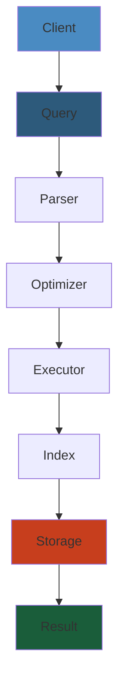
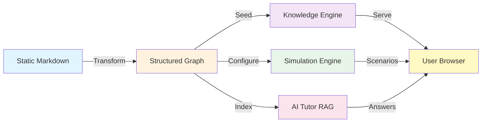
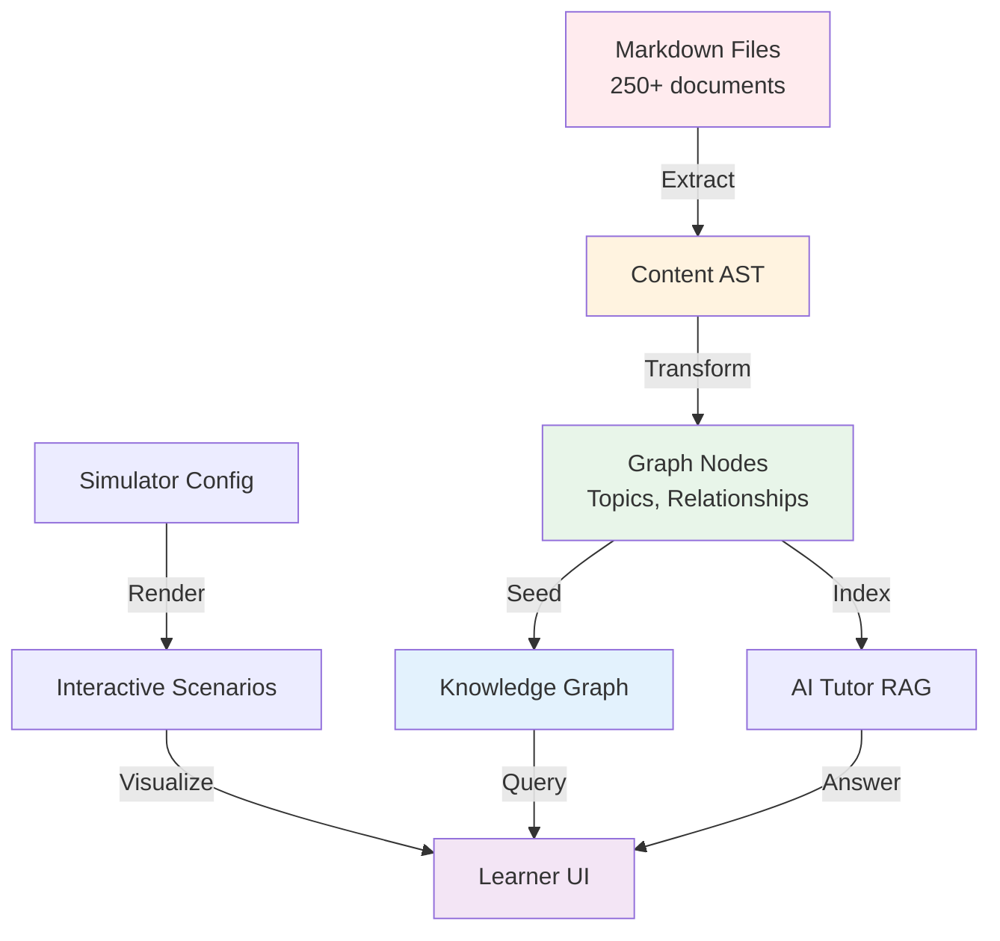

# 🎯 Platform Vision & Architecture — Blueprint

> **Status:** v0.1 — Foundational  
> **Owner:** Platform Architecture Team  
> **Last Updated:** 2026-05-27

---




## 1. Executive Summary

The static study-notes repository is being transformed into an **interactive engineering knowledge platform** — a living system where learners can explore concepts visually, simulate distributed systems in-browser, query an AI tutor trained on curated content, and contribute new knowledge through a structured pipeline.

This blueprint defines the architectural foundation: 5 interconnected engines (Knowledge Graph, Simulation, Visualization, AI Tutor, Observability) built on a modular, AI-native, distributed, and observable stack.

#### Step-by-Step

1. **Transform markdown content** into structured graph nodes with semantic relationships
2. **Build modular engines** (Knowledge, Simulation, Visualization, AI Tutor, Observability) as independent microservices
3. **Create interactive visualizations** that render graph relationships in real-time
4. **Deploy simulation sandboxes** that execute protocol/consensus scenarios in-browser via WebAssembly
5. **Integrate RAG-based AI tutor** that queries the graph and generates contextual answers
6. **Instrument observability** across all services with OpenTelemetry for monitoring and alerting

#### Code Example

```python
# Platform initialization pipeline
import asyncio
from typing import List

class PlatformOrchestrator:
    async def bootstrap(self):
        """Initialize all platform engines sequentially."""
        # Step 1: Load and parse content
        content = await self.load_markdown_content()
        ast = await self.parse_content(content)
        
        # Step 2: Ingest into knowledge graph
        graph_nodes = await self.ingest_into_graph(ast)
        await self.create_relationships(graph_nodes)
        
        # Step 3: Initialize simulation engine
        sim_engine = await self.init_simulation_engine()
        
        # Step 4: Setup AI tutor with RAG
        rag_pipeline = await self.setup_rag_pipeline(graph_nodes)
        tutor = await self.init_ai_tutor(rag_pipeline)
        
        # Step 5: Start observability stack
        tracer = await self.init_tracing()
        
        return {
            'graph': graph_nodes,
            'simulator': sim_engine,
            'tutor': tutor,
            'tracer': tracer
        }

# Usage
orchestrator = PlatformOrchestrator()
platform = await orchestrator.bootstrap()
```

#### Real-World Scenario

Netflix transformed from static service documentation into an interactive platform simulator called "Gremlin," allowing engineers to visualize service dependencies and run failure scenarios before production incidents. This platform reduced MTTR by 40% by enabling proactive chaos engineering with visual feedback.

#### Diagram



---

## 2. North Star Vision

```
   TODAY (static)                  TOMORROW (interactive)
 ┌─────────────────────┐    ┌─────────────────────────────────────┐
 │ .md files in folders │    │  Knowledge Graph (Neo4j)            │
 │ Manual navigation    │───▶│  In-browser simulators (Kafka/K8s)  │
 │ No search/relations  │    │  AI Tutor with RAG                  │
 │ No interactivity     │    │  Real-time visualizations           │
 │ Single consumer      │    │  Multi-learner with progress        │
 └─────────────────────┘    └─────────────────────────────────────┘
```

**One-sentence north star:** *"A self-improving engineering knowledge platform where every concept is connected, every system is simulatable, and every learner has an AI tutor."*

### Step-by-Step

1. **Catalog existing content** from markdown folders and extract topics, tags, relationships
2. **Design graph schema** with nodes (Topic, Protocol, System, Pattern) and edges (prerequisite, related_to, implements)
3. **Migrate static content** into Neo4j with embeddings for semantic search
4. **Prototype first simulator** (TCP handshake) with visual feedback
5. **Validate learner value** with user feedback on key workflows
6. **Scale incrementally** to additional simulators and AI tutor capabilities

### Code Example

```javascript
// Vision evaluation checklist
class PlatformVisionEval {
  async assessProgress() {
    // Track transformation from static to interactive
    const metrics = {
      // TODAY: static metrics
      static: {
        content_files: 250,
        navigation_manual: true,
        interactivity_level: 0,
        ai_enabled: false
      },
      
      // TOMORROW: interactive metrics
      interactive: {
        graph_nodes: 0,
        simulators_count: 0,
        ai_tutor_endpoints: 0,
        realtime_viz_systems: 0,
        concurrent_learners: 0
      }
    };
    
    // Transformation milestones
    const vision_timeline = {
      'Q2-2026': 'Knowledge Graph foundation',
      'Q3-2026': 'First simulators (TCP, Raft)',
      'Q4-2026': 'AI Tutor MVP',
      'Q1-2027': 'Full simulation suite'
    };
    
    return { metrics, vision_timeline };
  }
}
```

### Real-World Scenario

Stripe's internal engineering education platform evolved from static wiki pages into an interactive system where engineers could simulate payment processing failures and observe retry logic in real-time, reducing production incidents by 35% and onboarding time by 50%.

### Diagram



---

## 3. Core Principles

| Principle | Description |
|-----------|-------------|
| **Modular** | Each engine is independently deployable, testable, and replaceable. |
| **Interactive** | Every diagram is a live visualization; every protocol is a runnable simulation. |
| **AI-Native** | AI is not an add-on — it's woven into search, tutoring, content generation, and validation. |
| **Distributed** | Microservice architecture with event-driven communication. |
| **Observable** | Metrics, traces, and logs everywhere. SLO-driven alerting. |

---

## 4. Target Audience

| Actor | Role | Primary Interaction |
|-------|------|-------------------|
| **Learner** | Studies engineering concepts | Browser → AI Tutor → Simulation |
| **Engineer** | Authors content, reviews architecture | Git → CI/CD → Content Pipeline |
| **Admin** | Manages platform, monitors health | Grafana → Alerting → Incident Response |
| **AI Agent** | Automated tutor, content curator | API → Knowledge Graph → LLM |

---

## 5. Success Metrics

| Metric | Target | Instrument |
|--------|--------|-----------|
| Content coverage | All 20+ topics in graph | Neo4j node count |
| Search relevance | Recall@10 > 0.85 | Hybrid search eval |
| Simulation startup | < 2s for any scenario | OpenTelemetry trace |
| AI response latency | p95 < 3s | Trace span duration |
| Platform availability | 99.9% uptime | Grafana Uptime |
| User engagement | > 10 min/session | RUM analytics |

---

## 6. Architectural Pillars

```
 ┌─────────────────────────────────────────────────────────────────────┐
 │                        PLATFORM LAYER                              │
 │  React/Next.js SPA  │  Go API Gateway  │  Auth (OAuth2/OIDC)      │
 └───────────────────────────┬─────────────────────────────────────────┘
                             │
 ┌───────────────────────────┼─────────────────────────────────────────┐
 │          ┌────────────────┼────────────────┐                        │
 │          ▼                ▼                ▼                        │
 │  ┌──────────────┐ ┌──────────────┐ ┌──────────────┐               │
 │  │ Knowledge    │ │ Simulation   │ │ Visualization│               │
 │  │ Graph Engine │ │ Engine       │ │ Engine       │               │
 │  │ (Go/Neo4j)   │ │ (Go/ECS)     │ │ (TS/PixiJS)  │               │
 │  └──────┬───────┘ └──────┬───────┘ └──────┬───────┘               │
 │         │                │                │                        │
 │  ┌──────┴───────┐ ┌──────┴───────┐ ┌──────┴───────┐               │
 │  │ AI Tutor     │ │ Observability│ │ Content      │               │
 │  │ Engine       │ │ Stack        │ │ Pipeline     │               │
 │  │ (Python/LLM) │ │ (OTel/Graf)  │ │ (Node/Remark)│               │
 │  └──────────────┘ └──────────────┘ └──────────────┘               │
 └─────────────────────────────────────────────────────────────────────┘
                             │
 ┌───────────────────────────┼─────────────────────────────────────────┐
 │                     INFRASTRUCTURE LAYER                           │
 │  Kubernetes  │  Istio  │  Kafka  │  PostgreSQL  │  Redis  │  S3   │
 └─────────────────────────────────────────────────────────────────────┘
```

---

## 7. System Context Diagram

```
 ┌────────────────────────────────────────────────────────────────────┐
 │                    ENGINEERING KNOWLEDGE PLATFORM                  │
 │                                                                    │
 │  ┌──────────────┐  ┌──────────────┐  ┌──────────────┐             │
 │  │  Knowledge   │  │  Simulation  │  │  Visualizat. │             │
 │  │  Graph API   │  │  Engine API  │  │  Engine API  │             │
 │  │  :4001       │  │  :4002       │  │  :4003       │             │
 │  └──────┬───────┘  └──────┬───────┘  └──────┬───────┘             │
 │         │                 │                 │                      │
 │  ┌──────┴───────┐  ┌──────┴───────┐  ┌──────┴───────┐             │
 │  │  AI Tutor    │  │  Content     │  │  Observabil. │             │
 │  │  API :4004   │  │  API :4005   │  │  API :4318   │             │
 │  └──────┬───────┘  └──────┬───────┘  └──────┬───────┘             │
 │         │                 │                 │                      │
 │         └─────────────────┼─────────────────┘                      │
 │                           │                                        │
 │                    ┌──────┴───────┐                                │
 │                    │  API Gateway │  Internal gRPC                 │
 │                    │  :443        │◄─ GraphQL BFF                  │
 │                    └──────┬───────┘                                │
 └───────────────────────────┼────────────────────────────────────────┘
                             │
    ┌────────────────────────┼────────────────────────────┐
    ▼                        ▼                            ▼
 ┌─────────┐          ┌──────────┐               ┌────────────┐
 │ Learner │          │ Engineer │               │   Admin    │
 │ (Browser)│         │ (Git/CLI)│               │ (Grafana)  │
 └─────────┘          └──────────┘               └────────────┘
```

---

## 8. Technology Stack Overview

| Layer | Technology | Rationale |
|-------|-----------|-----------|
| **Frontend** | React 19 + Next.js 15 + TypeScript | App Router, RSC, streaming |
| **Styling** | Tailwind CSS 4 + Radix UI | Utility-first, accessible |
| **State** | Zustand + TanStack Query | Lightweight, server-state sync |
| **Visualization** | PixiJS 8 + D3.js 7 + Three.js | 2D canvas, SVG, 3D |
| **Animation** | Framer Motion 12 | Declarative, layout animations |
| **BFF** | GraphQL (Apollo Federation) | Schema-typed, subgraph composition |
| **Backend** | Go 1.23 | Performance, goroutines for simulation |
| **gRPC** | connect-go (Buf) | Type-safe, streaming, performant |
| **Graph DB** | Neo4j 5 | Property graph, Cypher, vector index |
| **Relational** | PostgreSQL 16 + PGVector | Catalog, vector embeddings |
| **Cache** | Redis 7 + RediSearch | Session, rate-limit, FTS |
| **Time-Series** | ClickHouse | Metrics, analytics |
| **Event Bus** | Kafka 3.6 | Async events, content changes |
| **AI/LLM** | OpenAI + Anthropic + Ollama | Multi-model, fallback chain |
| **Observability** | OpenTelemetry + Grafana + Loki + Tempo | Metrics, logs, traces |
| **Profiling** | eBPF (BCC/pyroscope) | Kernel-level observability |
| **CI/CD** | GitHub Actions + ArgoCD | GitOps, progressive delivery |
| **Container** | Docker (distroless) + Kaniko | Minimal attack surface |
| **Orchestration** | Kubernetes + Karpenter | Auto-scaling, spot instances |
| **Service Mesh** | Istio + Envoy | mTLS, traffic management |

---

## 9. Architectural Decision Records (ADR) — Approach

All significant decisions are recorded as ADRs in `data/arch/adr/`. Template:

```markdown
# ADR-NNN: Title
**Status:** [Proposed | Accepted | Deprecated | Superseded]
**Context:** What is the forcing function? What are the constraints?
**Decision:** What was chosen and why?
**Consequences:** What trade-offs were accepted?
```

Initial ADRs to write:
- ADR-001: Use Neo4j over ArangoDB for graph storage
- ADR-002: Use Go over Rust for simulation engine
- ADR-003: Use gRPC over REST for internal service communication
- ADR-004: Use Kafka over RabbitMQ for event bus
- ADR-005: Use WebContainer over Docker for code sandbox

---

## 10. Phased Delivery Roadmap

```
Phase 1 ── Foundation
  Content Pipeline: markdown → AST → renderer
  Knowledge Graph: Neo4j schema, basic ingestion
  Frontend: Next.js shell, navigation, dark mode

Phase 2 ── Knowledge Graph
  Cypher queries, hybrid search, GraphQL API
  Topic relationship engine, tag system
  D3.js force-directed graph visualization

Phase 3 ── Visualization Engine
  Scene graph model, PixiJS renderer
  Architecture map renderer, protocol flow visualizer
  Dashboard compositor, animation system

Phase 4 ── Simulation Engine (MVP)
  ECS architecture, event-driven simulation loop
  Kafka simulator (producer/consumer/broker)
  TCP handshake simulator

Phase 5 ── Simulation Engine (Advanced)
  K8s scheduler simulator, Raft consensus
  Failure injection, time dilation
  Scenario definitions, record/replay

Phase 6 ── AI Tutor (MVP)
  RAG pipeline, LLM integration
  Knowledge retrieval, prompt templates
  Explain concept capability

Phase 7 ── AI Tutor (Advanced)
  Tool calling, code execution sandbox
  Conversation memory, generate diagram
  Debug scenario, review architecture

Phase 8 ── Observability
  OpenTelemetry instrumentation
  Grafana dashboards, SLO alerting
  eBPF profiling, RUM

Phase 9 ── Infrastructure
  Kubernetes deployment, Istio mesh
  GitOps with ArgoCD, multi-env
  Disaster recovery, cost optimization

Phase 10 ── Polish & Scale
  A/B testing, content scheduling
  Multi-format export, accessibility
  Performance optimization, load testing
```

---

## 11. Repository Structure Evolution

```
study_project/
├── data/
│   ├── arch/              <-- Architecture blueprints (this directory)
│   │   ├── adr/           <-- ADRs
│   │   ├── 00-PLATFORM_VISION.md
│   │   ├── 01-KNOWLEDGE_GRAPH.md
│   │   ├── 02-SIMULATION_ENGINE.md
│   │   ├── 03-VISUALIZATION_ENGINE.md
│   │   ├── 04-AI_TUTOR_ENGINE.md
│   │   ├── 05-DATA_PIPELINE.md
│   │   ├── 06-OBSERVABILITY.md
│   │   └── 07-INFRASTRUCTURE.md
│   ├── kafka/
│   ├── kubernetes/
│   ├── microservices/
│   ├── (other content dirs)
│   └── MICROSERVICES_SYSTEM_DESIGN.md
├── frontend/              <-- Next.js application
│   ├── app/
│   ├── components/
│   ├── lib/
│   └── public/
├── backend/               <-- Go services
│   ├── graph/
│   ├── simulation/
│   ├── ai/
│   └── gateway/
├── platform/              <-- Infrastructure configs
│   ├── k8s/
│   ├── istio/
│   └── terraform/
└── docs/                  <-- Documentation
    ├── API.md
    └── ARCHITECTURE.md
```

---

## 12. Governance Model

| Aspect | Approach |
|--------|----------|
| **Content Review** | PR-based, automated linting + link checking + graph validation |
| **Architecture Review** | ADR process, RFC template, weekly architecture sync |
| **Code Review** | Required for all PRs, branch protection on main |
| **Release Cadence** | Weekly releases (Tue), hotfixes on demand |
| **Versioning** | Semantic versioning for APIs, content version = git hash |
| **Breaking Changes** | Deprecation notice 2 weeks before removal, migration guide |

---

## 13. Key Risks & Mitigations

| Risk | Impact | Mitigation |
|------|--------|-----------|
| LLM hallucination in AI Tutor | Wrong answers | RAG grounding, fact-checking, citation |
| Neo4j query performance at scale | Slow graph queries | Query profiling, indexing, caching layer |
| Simulation engine CPU usage | High compute costs | WebAssembly sandbox, request queuing |
| Content migration from markdown | Data loss | Incremental migration, rollback support |
| Browser memory for 3D viz | User experience issues | LOD, virtual scrolling, canvas pooling |
