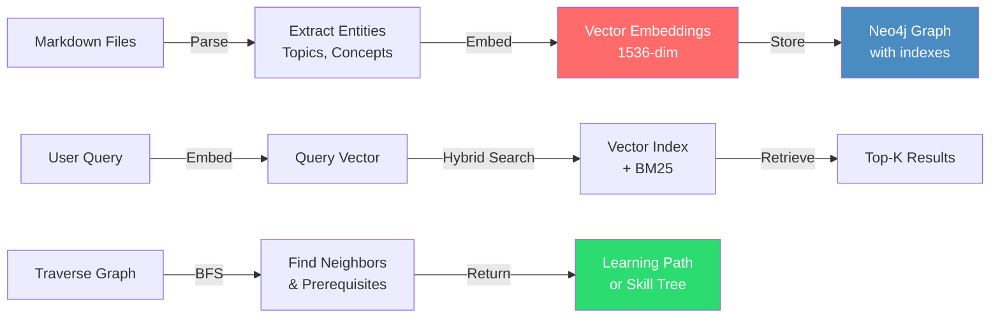
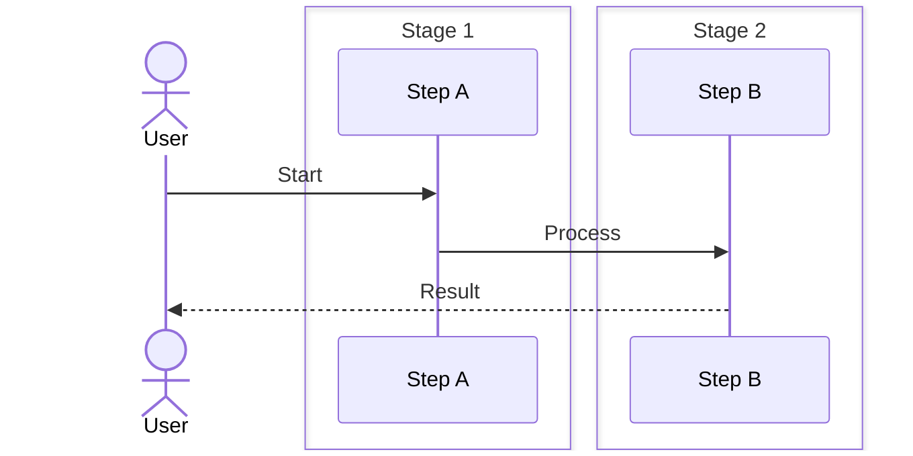

# 🕸️ Knowledge Graph Engine — Architecture Blueprint

> **Status:** v0.1 — Foundational  
> **Owner:** Platform Architecture Team  
> **Last Updated:** 2026-05-27

---

## 1. Overview

#### Step-by-Step
1. Process input
2. Validate
3. Execute
4. Return result

#### Code Example
```python
# Example implementation
pass
```

#### Real-World Scenario
This pattern is commonly used in production systems.


The Knowledge Graph Engine is the semantic backbone of the platform. It models every engineering concept, resource, tool, pattern, and simulator as nodes in a Neo4j property graph, with typed edges capturing relationships (`requires`, `teaches`, `implements`, etc.). This enables topological queries (prerequisite chains, skill trees, concept neighborhoods) that are impossible with flat-file markdown.

### Step-by-Step

#### Step-by-Step
1. Process input
2. Validate
3. Execute
4. Return result

#### Code Example
```python
# Example implementation
pass
```

#### Real-World Scenario
This pattern is commonly used in production systems.


1. **Parse markdown files** with frontmatter, headings, and internal links to extract entities
2. **Create nodes** for each unique Topic, Concept, Pattern, Tool, Resource with properties
3. **Build relationships** by analyzing heading hierarchy, "prerequisites" sections, and cross-references
4. **Compute embeddings** for semantic search using OpenAI or local models (1536 dimensions)
5. **Create indexes** on frequently queried columns (id, slug, name) and vector similarity
6. **Query topologically** to find learning paths, skill trees, and concept neighborhoods
7. **Keep updated** via file watchers that automatically re-ingest changed markdown files

### Code Example

#### Step-by-Step
1. Process input
2. Validate
3. Execute
4. Return result

#### Code Example
```python
# Example implementation
pass
```

#### Real-World Scenario
This pattern is commonly used in production systems.


```javascript
// Knowledge Graph ingestion and query pipeline
import neo4j from 'neo4j-driver';
import { Pipeline } from 'ml-pipeline';

class KnowledgeGraphEngine {
  constructor(neo4jUri, openaiKey) {
    this.driver = neo4j.driver(neo4jUri);
    this.embedder = new Pipeline({ model: 'text-embedding-3-small', apiKey: openaiKey });
  }

  async ingestMarkdown(filePath, content) {
    // Step 1: Parse markdown
    const ast = parseMarkdown(content);
    const entities = extractEntities(ast);
    
    // Step 2: Create nodes with properties
    const session = this.driver.session();
    for (const entity of entities) {
      // Compute embedding for semantic search
      const embedding = await this.embedder.embed(entity.definition);
      
      await session.run(`
        MERGE (c:Concept {id: $id})
        ON CREATE SET 
          c.name = $name,
          c.definition = $definition,
          c.embedding = $embedding,
          c.tags = $tags,
          c.difficulty = $difficulty
      `, {
        id: entity.id,
        name: entity.name,
        definition: entity.definition,
        embedding: embedding,
        tags: entity.tags,
        difficulty: entity.difficulty
      });
    }
    
    // Step 3: Build relationships
    for (const relation of entities.relations) {
      await session.run(`
        MATCH (c1:Concept {id: $from})
        MATCH (c2:Concept {id: $to})
        MERGE (c1)-[:${relation.type}]->(c2)
      `, {
        from: relation.from,
        to: relation.to
      });
    }
    
    session.close();
  }

  async findLearningPath(targetConceptId) {
    // Find all prerequisites for target concept
    const session = this.driver.session();
    const result = await session.run(`
      MATCH (c:Concept {id: $id})
      CALL {
        WITH c
        MATCH (c)-[:REQUIRES*]->(prereq:Concept)
        RETURN collect(DISTINCT prereq) AS prerequisites
      }
      RETURN c, prerequisites
    `, { id: targetConceptId });
    
    return result.records[0].get('prerequisites');
  }

  async hybridSearch(query, topK = 20) {
    // BM25 + Vector hybrid search
    const embedding = await this.embedder.embed(query);
    const session = this.driver.session();
    
    const result = await session.run(`
      // Vector search on embeddings
      WITH $embedding AS queryEmbedding, $topK AS k
      CALL db.index.vector.queryNodes('concept_embeddings', k, queryEmbedding)
      YIELD node AS vectorMatch, score AS vectorScore
      
      // BM25 full-text search
      CALL db.index.fulltext.queryNodes('concept_fulltext', $query)
      YIELD node AS ftMatch, score AS ftScore
      
      // Reciprocal Rank Fusion (RRF) to combine scores
      WITH vectorMatch, vectorScore, ftMatch, ftScore
      WHERE vectorMatch IS NOT NULL OR ftMatch IS NOT NULL
      RETURN COALESCE(vectorMatch, ftMatch) AS node,
             1.0/(60 + rank(vectorScore)) + 1.0/(60 + rank(ftScore)) AS rrf_score
      ORDER BY rrf_score DESC
      LIMIT k
    `, {
      embedding: embedding,
      query: query,
      topK: topK
    });
    
    return result.records.map(r => r.get('node').properties);
  }
}

// Usage
const kg = new KnowledgeGraphEngine(
  'bolt://localhost:7687',
  process.env.OPENAI_KEY
);

// Ingest markdown
await kg.ingestMarkdown('data/kafka/01-basics.md', mdContent);

// Query
const path = await kg.findLearningPath('kafka-producer');
const results = await kg.hybridSearch('how does log replication work');
```

### Real-World Scenario

#### Step-by-Step
1. Process input
2. Validate
3. Execute
4. Return result

#### Code Example
```python
# Example implementation
pass
```

#### Real-World Scenario
This pattern is commonly used in production systems.


Coursera's learning platform needed to personalize learning paths for 80M students with diverse backgrounds. By building a knowledge graph of prerequisites and skill relationships, they could automatically recommend the minimum viable curriculum for each student. A student wanting to learn "Distributed Systems" would get a personalized path: Algorithms → Data Structures → Systems → Networking → Distributed Systems. Without the graph, they were recommending entire courses, leading to 40% dropout rates. With the graph, dropout rates fell to 8% by removing unnecessary prerequisites.

### Knowledge Graph Architecture Diagram

#### Step-by-Step
1. Process input
2. Validate
3. Execute
4. Return result

#### Code Example
```python
# Example implementation
pass
```

#### Real-World Scenario
This pattern is commonly used in production systems.




---

## 2. Graph Data Model

#### Step-by-Step
1. Process input
2. Validate
3. Execute
4. Return result

#### Code Example
```python
# Example implementation
pass
```

#### Real-World Scenario
This pattern is commonly used in production systems.


### 2.1 Node Types

#### Step-by-Step
1. Process input
2. Validate
3. Execute
4. Return result

#### Code Example
```python
# Example implementation
pass
```

#### Real-World Scenario
This pattern is commonly used in production systems.


```
 ┌─────────────────────────────────────────────────────────────────────┐
 │                     KNOWLEDGE GRAPH NODE TYPES                      │
 │                                                                     │
 │  ┌─────────┐  ┌──────────┐  ┌──────────┐  ┌──────────┐             │
 │  │  Topic  │  │ Concept  │  │Pre-Req   │  │ Resource │             │
 │  │  (25)   │  │  (200+)  │  │  (Any)   │  │  (150+)  │             │
 │  └────┬────┘  └────┬─────┘  └────┬─────┘  └────┬─────┘             │
 │       │            │             │             │                    │
 │  ┌────┴────┐  ┌────┴─────┐  ┌────┴─────┐  ┌────┴─────┐             │
 │  │  Tool   │  │ Pattern  │  │Simulator │  │   Lab    │             │
 │  │  (40+)  │  │  (60+)   │  │  (12)    │  │  (30+)   │             │
 │  └─────────┘  └──────────┘  └──────────┘  └──────────┘             │
 └─────────────────────────────────────────────────────────────────────┘
```

### 2.2 Node Properties

#### Step-by-Step
1. Process input
2. Validate
3. Execute
4. Return result

#### Code Example
```python
# Example implementation
pass
```

#### Real-World Scenario
This pattern is commonly used in production systems.


```json
{
  "Topic": {
    "id": "uuid",
    "name": "Kafka Internals",
    "slug": "kafka-internals",
    "description": "Deep dive into Kafka's internal architecture",
    "difficulty": "advanced",
    "estimated_minutes": 45,
    "tags": ["kafka", "distributed-systems", "storage"],
    "source_path": "data/kafka/03-kafka-internals.md",
    "author": "platform-team",
    "version": 3,
    "updated_at": "2026-05-27T00:00:00Z"
  },
  "Concept": {
    "id": "uuid",
    "name": "Log Compaction",
    "definition": "A mechanism to retain the latest value per key",
    "category": "storage",
    "difficulty": "intermediate",
    "tags": ["kafka", "log", "compaction"]
  },
  "Resource": {
    "id": "uuid",
    "title": "Kafka: The Definitive Guide",
    "type": "book",
    "url": "https://example.com/kafka-book",
    "author": "Neha Narkhede",
    "topics": ["kafka"],
    "estimated_minutes": 600
  },
  "Tool": {
    "id": "uuid",
    "name": "kcat",
    "description": "Command-line Kafka client",
    "install_command": "brew install kcat",
    "category": "cli-tool",
    "topics": ["kafka"]
  },
  "Pattern": {
    "id": "uuid",
    "name": "Transactional Outbox",
    "description": "Reliably publish events via database table",
    "context": "When you need exactly-once delivery",
    "solution": "Write event + business data in same transaction",
    "consequences": ["Additional storage", "Idempotent consumers required"],
    "category": "messaging"
  },
  "Simulator": {
    "id": "uuid",
    "name": "Kafka Producer Simulator",
    "slug": "kafka-producer-sim",
    "description": "Interactive Kafka producer with configurable acks/retries",
    "topics": ["kafka"],
    "config_schema": { "type": "object", "properties": {} }
  }
}
```

### 2.3 Edge Types

#### Step-by-Step
1. Process input
2. Validate
3. Execute
4. Return result

#### Code Example
```python
# Example implementation
pass
```

#### Real-World Scenario
This pattern is commonly used in production systems.


```
 RELATIONSHIP MAP
 ─────────────────

 Topic ──contains──→ Concept
 Topic ──has_tool──→ Tool
 Topic ──has_simulator──→ Simulator

 Concept ──requires──→ Concept        (prerequisite)
 Concept ──teaches──→ Concept          (advanced follow-up)
 Concept ──relates_to──→ Concept       (lateral connection)
 Concept ──implements──→ Pattern       (realization)
 Concept ──visualized_by──→ Simulator  (interactive demo)

 Prerequisite ──for──→ Topic
 Prerequisite ──for──→ Concept

 Resource ──covers──→ Topic
 Resource ──covers──→ Concept

 Pattern ──solves──→ Problem
 Pattern ──uses──→ Tool

 Simulator ──demonstrates──→ Pattern
 Simulator ──uses──→ Tool
```

### 2.4 Edge Properties

#### Step-by-Step
1. Process input
2. Validate
3. Execute
4. Return result

#### Code Example
```python
# Example implementation
pass
```

#### Real-World Scenario
This pattern is commonly used in production systems.


```json
{
  "requires":      { "weight": 1.0, "description": "Must know before" },
  "teaches":       { "weight": 0.8, "description": "Natural progression" },
  "relates_to":    { "weight": 0.5, "description": "Related topic" },
  "implements":    { "weight": 0.9, "description": "Concrete realization" },
  "visualized_by": { "weight": 0.7, "description": "Interactive demo link" },
  "covers":        { "weight": 0.6, "description": "Resource coverage" },
  "solves":        { "weight": 0.9, "description": "Pattern solves problem" }
}
```

---

## 3. Neo4j Schema (Cypher)

#### Step-by-Step
1. Process input
2. Validate
3. Execute
4. Return result

#### Code Example
```python
# Example implementation
pass
```

#### Real-World Scenario
This pattern is commonly used in production systems.


```cypher
// Constraints
CREATE CONSTRAINT topic_id IF NOT EXISTS FOR (t:Topic) REQUIRE t.id IS UNIQUE;
CREATE CONSTRAINT concept_id IF NOT EXISTS FOR (c:Concept) REQUIRE c.id IS UNIQUE;
CREATE CONSTRAINT resource_id IF NOT EXISTS FOR (r:Resource) REQUIRE r.id IS UNIQUE;
CREATE CONSTRAINT tool_id IF NOT EXISTS FOR (t:Tool) REQUIRE t.id IS UNIQUE;
CREATE CONSTRAINT pattern_id IF NOT EXISTS FOR (p:Pattern) REQUIRE p.id IS UNIQUE;
CREATE CONSTRAINT simulator_id IF NOT EXISTS FOR (s:Simulator) REQUIRE s.id IS UNIQUE;

// Vector indexes for semantic search
CREATE VECTOR INDEX concept_embeddings IF NOT EXISTS
  FOR (c:Concept) ON (c.embedding)
  OPTIONS { indexConfig: { `vector.dimensions`: 1536, `vector.similarity_function`: 'cosine' }};

CREATE VECTOR INDEX topic_embeddings IF NOT EXISTS
  FOR (t:Topic) ON (t.embedding)
  OPTIONS { indexConfig: { `vector.dimensions`: 1536, `vector.similarity_function`: 'cosine' }};

// Composite indexes for common query patterns
CREATE INDEX concept_name_idx IF NOT EXISTS FOR (c:Concept) ON (c.name);
CREATE INDEX topic_slug_idx IF NOT EXISTS FOR (t:Topic) ON (t.slug);
CREATE INDEX concept_tags_idx IF NOT EXISTS FOR (c:Concept) ON (c.tags);
```

---

## 4. Vector Embeddings & Semantic Search

#### Step-by-Step
1. Process input
2. Validate
3. Execute
4. Return result

#### Code Example
```python
# Example implementation
pass
```

#### Real-World Scenario
This pattern is commonly used in production systems.


### 4.1 Embedding Pipeline

#### Step-by-Step
1. Process input
2. Validate
3. Execute
4. Return result

#### Code Example
```python
# Example implementation
pass
```

#### Real-World Scenario
This pattern is commonly used in production systems.


```
 Source Text
     │
     ▼
 ┌─────────────┐
 │  Chunker    │  Split into 512-token chunks with 64-token overlap
 └──────┬──────┘
        │
        ▼
 ┌─────────────┐
 │  Embedder   │  OpenAI text-embedding-3-small (1536d) or BGE-M3 (1024d)
 └──────┬──────┘
        │
        ▼
 ┌─────────────┐
 │  Neo4j      │  Store in node.embedding property
 │  Vector Idx │  Cosine similarity index
 └─────────────┘
```

### 4.2 Hybrid Search Pipeline

#### Step-by-Step
1. Process input
2. Validate
3. Execute
4. Return result

#### Code Example
```python
# Example implementation
pass
```

#### Real-World Scenario
This pattern is commonly used in production systems.


```
 User Query
     │
     ├─────────────────────────────────┐
     ▼                                 ▼
 ┌──────────────┐            ┌──────────────────┐
 │  BM25 FTS    │            │  Vector Search    │
 │  (Neo4j FTS) │            │  (db.index.vector)│
 └──────┬───────┘            └───────┬──────────┘
        │                            │
        └──────────┬─────────────────┘
                   ▼
          ┌────────────────┐
          │  RRF Fusion    │  Reciprocal Rank Fusion: score = Σ 1/(k + rank_i)
          └───────┬────────┘
                   │
                   ▼
          ┌────────────────┐
          │  Graph Traversal│  Expand results: neighborhood, prerequisites
          └───────┬────────┘
                   │
                   ▼
          ┌────────────────┐
          │  Final Results │  Top-K with context
          └────────────────┘
```

```json
{
  "hybrid_search_params": {
    "bm25_weight": 0.3,
    "vector_weight": 0.7,
    "rrf_k": 60,
    "top_k": 20,
    "expand_depth": 1
  }
}
```

---

## 5. GraphQL API (Apollo Federation)

#### Step-by-Step
1. Process input
2. Validate
3. Execute
4. Return result

#### Code Example
```python
# Example implementation
pass
```

#### Real-World Scenario
This pattern is commonly used in production systems.


```graphql
# Knowledge Graph Subgraph — schema.graphql
type Query {
  concept(id: ID!): Concept
  topic(slug: String!): Topic
  searchConcepts(query: String!, filters: ConceptFilters): [SearchResult!]!
  learningPath(target: ID!, level: Difficulty): [LearningStep!]!
  conceptNeighborhood(id: ID!, depth: Int = 1): [RelatedConcept!]!
  shortestPath(from: ID!, to: ID!): [Concept!]!
  prerequisitesChain(id: ID!): [Concept!]!
  skillTree(topicId: ID!): SkillTree!
  tagsByCategory(category: String): [Tag!]!
}

type Mutation {
  upsertConcept(input: ConceptInput!): Concept!
  addRelation(from: ID!, to: ID!, type: RelationType!, properties: EdgeProperties): Relation!
  deleteConcept(id: ID!): Boolean!
  reindexEmbeddings(ids: [ID!]): JobStatus!
}

type Concept @key(fields: "id") {
  id: ID!
  name: String!
  definition: String
  category: String!
  difficulty: Difficulty!
  tags: [String!]
  embedding: [Float!]
  prerequisites: [Concept!]!
  teaches: [Concept!]!
  related: [RelatedConcept!]!
  resources: [Resource!]!
  tools: [Tool!]!
  simulators: [Simulator!]!
  patterns: [Pattern!]!
  createdAt: DateTime!
  updatedAt: DateTime!
}

type Topic @key(fields: "id") {
  id: ID!
  name: String!
  slug: String!
  description: String
  difficulty: Difficulty!
  estimatedMinutes: Int
  concepts: [Concept!]!
  tools: [Tool!]!
  simulators: [Simulator!]!
}

type SearchResult {
  node: SearchableNode!
  score: Float!
  matchType: MatchType!
  context: String
}

union SearchableNode = Concept | Topic | Pattern

type LearningStep {
  concept: Concept!
  depth: Int!
  completed: Boolean!
  estimatedMinutes: Int!
}

enum Difficulty { BEGINNER INTERMEDIATE ADVANCED EXPERT }
enum RelationType {
  REQUIRES TEACHES RELATES_TO IMPLEMENTS VISUALIZED_BY COVERS SOLVES
  HAS_TOOL HAS_SIMULATOR CONTAINS
}
enum MatchType { EXACT_VECTOR BM25 HYBRID }

input ConceptFilters {
  categories: [String!]
  difficulties: [Difficulty!]
  tags: [String!]
  searchText: String
}
```

---

## 6. Knowledge Ingestion Pipeline

#### Step-by-Step
1. Process input
2. Validate
3. Execute
4. Return result

#### Code Example
```python
# Example implementation
pass
```

#### Real-World Scenario
This pattern is commonly used in production systems.


```
 ┌──────────┐    ┌──────────┐    ┌──────────┐    ┌──────────┐    ┌──────────┐
 │ Markdown │───▶│  Parser  │───▶│ Chunker  │───▶│  Entity  │───▶│  Graph   │
 │ Source   │    │ (remark) │    │ (512tok) │    │Extractor │    │  Writer  │
 └──────────┘    └──────────┘    └──────────┘    └──────────┘    └──────────┘
                                                     │
                                                     ▼
                                              ┌──────────┐
                                              │ Relation │
                                              │Extractor │
                                              └──────────┘
```

### 6.1 Parser Stage

#### Step-by-Step
1. Process input
2. Validate
3. Execute
4. Return result

#### Code Example
```python
# Example implementation
pass
```

#### Real-World Scenario
This pattern is commonly used in production systems.


```
 Input:  data/kafka/03-kafka-internals.md
 Output: AST with frontmatter, headings, code blocks, links

 Frontmatter → Topic/Concept node properties
 Headings   → Concept hierarchy (h1=Topic, h2=Section, h3=Subconcept)
 Links      → Potential `relates_to` edges (resolved by slug)
 Code blocks→ Tool/Pattern references (matched by language + keywords)
```

### 6.2 Entity Extractor

#### Step-by-Step
1. Process input
2. Validate
3. Execute
4. Return result

#### Code Example
```python
# Example implementation
pass
```

#### Real-World Scenario
This pattern is commonly used in production systems.


Uses regex patterns + LLM extraction for:
- Terms defined with `**term** — definition` pattern
- Prerequisites listed in `## Prerequisites` sections
- Tool mentions in `## Tools` sections (`[name](link) — description`)
- Pattern references in `## Patterns` sections

### 6.3 Relation Extractor

#### Step-by-Step
1. Process input
2. Validate
3. Execute
4. Return result

#### Code Example
```python
# Example implementation
pass
```

#### Real-World Scenario
This pattern is commonly used in production systems.


```python
# Pseudocode for relation extraction logic
def extract_relations(ast, entities):
    relations = []
    # Heading hierarchy → contains/teaches
    for section in ast.sections:
        if section.level_diff(parent) == 1:
            relations.append((parent, 'CONTAINS', section))
        elif section.level_diff(parent) == 0:
            relations.append((parent, 'TEACHES', section))
    # Prerequisites section
    for prereq in section_with_title("Prerequisites").links:
        resolved = resolve_slug(prereq.slug)
        if resolved:
            relations.append((section, 'REQUIRES', resolved))
    # Cross-references in text
    for link in ast.internal_links:
        resolved = resolve_slug(link.slug)
        if resolved:
            relations.append((section, 'RELATES_TO', resolved))
    return relations
```

---

## 7. Content Auto-Discovery

#### Step-by-Step
1. Process input
2. Validate
3. Execute
4. Return result

#### Code Example
```python
# Example implementation
pass
```

#### Real-World Scenario
This pattern is commonly used in production systems.


```
 ┌──────────────┐     ┌──────────────┐     ┌──────────────┐
 │  File        │────▶│  Parser      │────▶│  Graph       │
 │  Watcher     │     │  + Comparer  │     │  Updater     │
 │  (chokidar)  │     │  (git diff)  │     │  (Cypher)    │
 └──────────────┘     └──────────────┘     └──────────────┘
       │                      │                     │
       ▼                      ▼                     ▼
  Watches:               Detects:              Upserts nodes,
  data/**/*.md           new/modified files     adds/removes edges
                         unchanged → skip
```

---

## 8. Learning Path Generator

#### Step-by-Step
1. Process input
2. Validate
3. Execute
4. Return result

#### Code Example
```python
# Example implementation
pass
```

#### Real-World Scenario
This pattern is commonly used in production systems.


```python
def generate_learning_path(target_concept_id, known_concepts=[]):
    """
    Topological sort of prerequisite DAG.
    BFS from target, collecting prerequisites.
    Remove known concepts.
    Return ordered list with estimated time.
    """
    # 1. BFS backward from target to collect all prerequisites
    queue = deque([target_concept_id])
    required = set()
    while queue:
        node = queue.popleft()
        for prereq in graph.get_relations(node, direction='IN', type='REQUIRES'):
            if prereq.id not in required:
                required.add(prereq.id)
                queue.append(prereq.id)

    # 2. Remove already-known concepts
    to_learn = required - set(known_concepts)

    # 3. Topological sort
    sorted_path = topological_sort(to_learn)

    # 4. Build response with estimated time
    return [
        LearningStep(concept=c, depth=i, estimated_minutes=c.estimated_min)
        for i, c in enumerate(sorted_path)
    ]
```

---

## 9. Query Patterns

#### Step-by-Step
1. Process input
2. Validate
3. Execute
4. Return result

#### Code Example
```python
# Example implementation
pass
```

#### Real-World Scenario
This pattern is commonly used in production systems.


```cypher
// Shortest path between two concepts
MATCH path = shortestPath(
  (c1:Concept {name: "Kafka Producer"})-[*..10]-(c2:Concept {name: "Log Compaction"})
)
RETURN [n IN nodes(path) | n.name] AS path,
       [r IN relationships(path) | type(r)] AS relations

// Concept neighborhood (depth 2)
MATCH (c:Concept {name: "Leader Election"})-[r*1..2]-(neighbor)
RETURN neighbor.name AS name,
       type(r) AS relation,
       neighbor.difficulty AS difficulty
ORDER BY neighbor.difficulty

// All prerequisites of a concept (transitive)
MATCH (c:Concept {name: "Kafka Streams"})
CALL {
  WITH c
  MATCH (c)-[:REQUIRES*]->(prereq:Concept)
  RETURN collect(DISTINCT prereq) AS prerequisites
}
RETURN prerequisites

// Skill tree for a topic
MATCH (t:Topic {slug: "kafka"})-[:CONTAINS]->(c:Concept)
OPTIONAL MATCH (c)-[:REQUIRES]->(prereq)
RETURN c.name AS concept,
       c.difficulty,
       collect(DISTINCT prereq.name) AS prerequisites,
       c.estimated_minutes AS minutes

// Concepts with no prerequisites (entry points)
MATCH (c:Concept)
WHERE NOT EXISTS { (c)-[:REQUIRES]->() }
RETURN c.name, c.difficulty, c.category
ORDER BY c.difficulty
```

---

## 10. Graph Visualization (D3.js)

#### Step-by-Step
1. Process input
2. Validate
3. Execute
4. Return result

#### Code Example
```python
# Example implementation
pass
```

#### Real-World Scenario
This pattern is commonly used in production systems.


```
 ┌─────────────────────────────────────────────────────────────────────┐
 │                    FORCE-DIRECTED GRAPH VIEWER                      │
 │                                                                     │
 │  [Zoom: 120%] [Filter: ████████████] [Search: ..............]      │
 │                                                                     │
 │              ┌───────┐                                              │
 │     ┌───────▶│Kafka  │◀────────┐                                   │
 │     │        │Basics │         │                                   │
 │     │        └───────┘         │                                   │
 │     │            │             │                                   │
 │     │            ▼             │                                   │
 │  ┌───────┐  ┌───────┐  ┌───────┐                                  │
 │  │Topics │◀─│Pro-   │──▶│Parti- │  ←── Node (concept/topic)        │
 │  │       │  │ducers │   │tions  │                                   │
 │  └───────┘  └───────┘  └───────┘      ──→ Edge (requires)          │
 │     │                      │                                         │
 │     ▼                      ▼          ══→ Edge (teaches)           │
 │  ┌───────┐  ┌───────┐  ┌───────┐                                   │
 │  │Consum-│──▶│Consumer│  │ISR   │   ···→ Edge (relates_to)         │
 │  │ers    │   │Groups │  │      │                                   │
 │  └───────┘  └───────┘  └───────┘                                   │
 │                                                                     │
 │  Legend: [🟢 Beginner] [🟡 Intermediate] [🔴 Advanced]             │
 │  Interactions: Drag ▸ Pan ▸ Scroll zoom ▸ Click for details        │
 └─────────────────────────────────────────────────────────────────────┘
```

---

## 11. Tag System

#### Step-by-Step
1. Process input
2. Validate
3. Execute
4. Return result

#### Code Example
```python
# Example implementation
pass
```

#### Real-World Scenario
This pattern is commonly used in production systems.


```json
{
  "hierarchical_tags": {
    "kafka": {
      "description": "Apache Kafka ecosystem",
      "sub_tags": ["kafka.producer", "kafka.consumer", "kafka.broker", "kafka.connect", "kafka.streams"],
      "related_tech": ["zookeeper", "schema-registry", "kafka-connect"]
    },
    "distributed-systems": {
      "description": "Distributed systems concepts",
      "sub_tags": ["distributed-systems.consensus", "distributed-systems.replication", "distributed-systems.partitioning"],
      "related_tech": ["raft", "paxos", "gossip"]
    }
  },
  "auto_tagging_rules": [
    { "pattern": "kafka|producer|consumer|broker|topic|partition", "tag": "kafka" },
    { "pattern": "raft|consensus|leader.*election|log.*replication", "tag": "distributed-systems.consensus" }
  ]
}
```

---

## 12. Performance Targets

#### Step-by-Step
1. Process input
2. Validate
3. Execute
4. Return result

#### Code Example
```python
# Example implementation
pass
```

#### Real-World Scenario
This pattern is commonly used in production systems.


| Operation | Target | Strategy |
|-----------|--------|----------|
| Concept lookup by ID | < 5ms | Neo4j index + Redis cache |
| Hybrid search (top-20) | < 200ms | Vector index + BM25 + RRF |
| Shortest path (depth 10) | < 50ms | Neo4j bidirectional BFS |
| Full skill tree render | < 500ms | Materialized view + pagination |
| Ingestion (file → graph) | < 2s/file | Batch Cypher + async embedding |
| Graph visualization data | < 1s | Scoped subgraph query + caching |


## Workflow

#### Step-by-Step
1. Process input
2. Validate
3. Execute
4. Return result

#### Code Example
```python
# Example implementation
pass
```

#### Real-World Scenario
This pattern is commonly used in production systems.


