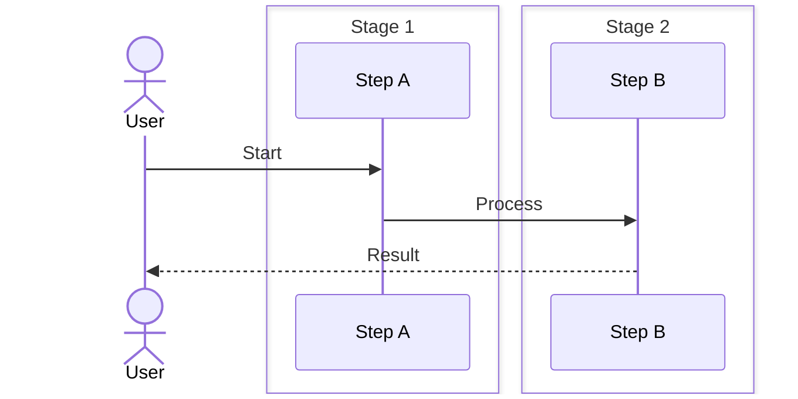

# 🕸️ Knowledge Graph Engine — Architecture Blueprint

> **Status:** v0.1 — Foundational  
> **Owner:** Platform Architecture Team  
> **Last Updated:** 2026-05-27

---

## 1. Overview

The Knowledge Graph Engine is the semantic backbone of the platform. It models every engineering concept, resource, tool, pattern, and simulator as nodes in a Neo4j property graph, with typed edges capturing relationships (`requires`, `teaches`, `implements`, etc.). This enables topological queries (prerequisite chains, skill trees, concept neighborhoods) that are impossible with flat-file markdown.

---

## 2. Graph Data Model

### 2.1 Node Types

```
 ┌─────────────────────────────────────────────────────────────────────┐
 │                     KNOWLEDGE GRAPH NODE TYPES                      │
 │                                                                     │
 │  ┌─────────┐  ┌──────────┐  ┌──────────┐  ┌──────────┐             │
 │  │  Topic  │  │ Concept  │  │Pre-Req   │  │ Resource │             │
 │  │  (25)   │  │  (200+)  │  │  (Any)   │  │  (150+)  │             │
 │  └────┬────┘  └────┬─────┘  └────┬─────┘  └────┬─────┘             │
 │       │            │             │             │                    │
 │  ┌────┴────┐  ┌────┴─────┐  ┌────┴─────┐  ┌────┴─────┐             │
 │  │  Tool   │  │ Pattern  │  │Simulator │  │   Lab    │             │
 │  │  (40+)  │  │  (60+)   │  │  (12)    │  │  (30+)   │             │
 │  └─────────┘  └──────────┘  └──────────┘  └──────────┘             │
 └─────────────────────────────────────────────────────────────────────┘
```

### 2.2 Node Properties

```json
{
  "Topic": {
    "id": "uuid",
    "name": "Kafka Internals",
    "slug": "kafka-internals",
    "description": "Deep dive into Kafka's internal architecture",
    "difficulty": "advanced",
    "estimated_minutes": 45,
    "tags": ["kafka", "distributed-systems", "storage"],
    "source_path": "data/kafka/03-kafka-internals.md",
    "author": "platform-team",
    "version": 3,
    "updated_at": "2026-05-27T00:00:00Z"
  },
  "Concept": {
    "id": "uuid",
    "name": "Log Compaction",
    "definition": "A mechanism to retain the latest value per key",
    "category": "storage",
    "difficulty": "intermediate",
    "tags": ["kafka", "log", "compaction"]
  },
  "Resource": {
    "id": "uuid",
    "title": "Kafka: The Definitive Guide",
    "type": "book",
    "url": "https://example.com/kafka-book",
    "author": "Neha Narkhede",
    "topics": ["kafka"],
    "estimated_minutes": 600
  },
  "Tool": {
    "id": "uuid",
    "name": "kcat",
    "description": "Command-line Kafka client",
    "install_command": "brew install kcat",
    "category": "cli-tool",
    "topics": ["kafka"]
  },
  "Pattern": {
    "id": "uuid",
    "name": "Transactional Outbox",
    "description": "Reliably publish events via database table",
    "context": "When you need exactly-once delivery",
    "solution": "Write event + business data in same transaction",
    "consequences": ["Additional storage", "Idempotent consumers required"],
    "category": "messaging"
  },
  "Simulator": {
    "id": "uuid",
    "name": "Kafka Producer Simulator",
    "slug": "kafka-producer-sim",
    "description": "Interactive Kafka producer with configurable acks/retries",
    "topics": ["kafka"],
    "config_schema": { "type": "object", "properties": {} }
  }
}
```

### 2.3 Edge Types

```
 RELATIONSHIP MAP
 ─────────────────

 Topic ──contains──→ Concept
 Topic ──has_tool──→ Tool
 Topic ──has_simulator──→ Simulator

 Concept ──requires──→ Concept        (prerequisite)
 Concept ──teaches──→ Concept          (advanced follow-up)
 Concept ──relates_to──→ Concept       (lateral connection)
 Concept ──implements──→ Pattern       (realization)
 Concept ──visualized_by──→ Simulator  (interactive demo)

 Prerequisite ──for──→ Topic
 Prerequisite ──for──→ Concept

 Resource ──covers──→ Topic
 Resource ──covers──→ Concept

 Pattern ──solves──→ Problem
 Pattern ──uses──→ Tool

 Simulator ──demonstrates──→ Pattern
 Simulator ──uses──→ Tool
```

### 2.4 Edge Properties

```json
{
  "requires":      { "weight": 1.0, "description": "Must know before" },
  "teaches":       { "weight": 0.8, "description": "Natural progression" },
  "relates_to":    { "weight": 0.5, "description": "Related topic" },
  "implements":    { "weight": 0.9, "description": "Concrete realization" },
  "visualized_by": { "weight": 0.7, "description": "Interactive demo link" },
  "covers":        { "weight": 0.6, "description": "Resource coverage" },
  "solves":        { "weight": 0.9, "description": "Pattern solves problem" }
}
```

---

## 3. Neo4j Schema (Cypher)

```cypher
// Constraints
CREATE CONSTRAINT topic_id IF NOT EXISTS FOR (t:Topic) REQUIRE t.id IS UNIQUE;
CREATE CONSTRAINT concept_id IF NOT EXISTS FOR (c:Concept) REQUIRE c.id IS UNIQUE;
CREATE CONSTRAINT resource_id IF NOT EXISTS FOR (r:Resource) REQUIRE r.id IS UNIQUE;
CREATE CONSTRAINT tool_id IF NOT EXISTS FOR (t:Tool) REQUIRE t.id IS UNIQUE;
CREATE CONSTRAINT pattern_id IF NOT EXISTS FOR (p:Pattern) REQUIRE p.id IS UNIQUE;
CREATE CONSTRAINT simulator_id IF NOT EXISTS FOR (s:Simulator) REQUIRE s.id IS UNIQUE;

// Vector indexes for semantic search
CREATE VECTOR INDEX concept_embeddings IF NOT EXISTS
  FOR (c:Concept) ON (c.embedding)
  OPTIONS { indexConfig: { `vector.dimensions`: 1536, `vector.similarity_function`: 'cosine' }};

CREATE VECTOR INDEX topic_embeddings IF NOT EXISTS
  FOR (t:Topic) ON (t.embedding)
  OPTIONS { indexConfig: { `vector.dimensions`: 1536, `vector.similarity_function`: 'cosine' }};

// Composite indexes for common query patterns
CREATE INDEX concept_name_idx IF NOT EXISTS FOR (c:Concept) ON (c.name);
CREATE INDEX topic_slug_idx IF NOT EXISTS FOR (t:Topic) ON (t.slug);
CREATE INDEX concept_tags_idx IF NOT EXISTS FOR (c:Concept) ON (c.tags);
```

---

## 4. Vector Embeddings & Semantic Search

### 4.1 Embedding Pipeline

```
 Source Text
     │
     ▼
 ┌─────────────┐
 │  Chunker    │  Split into 512-token chunks with 64-token overlap
 └──────┬──────┘
        │
        ▼
 ┌─────────────┐
 │  Embedder   │  OpenAI text-embedding-3-small (1536d) or BGE-M3 (1024d)
 └──────┬──────┘
        │
        ▼
 ┌─────────────┐
 │  Neo4j      │  Store in node.embedding property
 │  Vector Idx │  Cosine similarity index
 └─────────────┘
```

### 4.2 Hybrid Search Pipeline

```
 User Query
     │
     ├─────────────────────────────────┐
     ▼                                 ▼
 ┌──────────────┐            ┌──────────────────┐
 │  BM25 FTS    │            │  Vector Search    │
 │  (Neo4j FTS) │            │  (db.index.vector)│
 └──────┬───────┘            └───────┬──────────┘
        │                            │
        └──────────┬─────────────────┘
                   ▼
          ┌────────────────┐
          │  RRF Fusion    │  Reciprocal Rank Fusion: score = Σ 1/(k + rank_i)
          └───────┬────────┘
                   │
                   ▼
          ┌────────────────┐
          │  Graph Traversal│  Expand results: neighborhood, prerequisites
          └───────┬────────┘
                   │
                   ▼
          ┌────────────────┐
          │  Final Results │  Top-K with context
          └────────────────┘
```

```json
{
  "hybrid_search_params": {
    "bm25_weight": 0.3,
    "vector_weight": 0.7,
    "rrf_k": 60,
    "top_k": 20,
    "expand_depth": 1
  }
}
```

---

## 5. GraphQL API (Apollo Federation)

```graphql
# Knowledge Graph Subgraph — schema.graphql
type Query {
  concept(id: ID!): Concept
  topic(slug: String!): Topic
  searchConcepts(query: String!, filters: ConceptFilters): [SearchResult!]!
  learningPath(target: ID!, level: Difficulty): [LearningStep!]!
  conceptNeighborhood(id: ID!, depth: Int = 1): [RelatedConcept!]!
  shortestPath(from: ID!, to: ID!): [Concept!]!
  prerequisitesChain(id: ID!): [Concept!]!
  skillTree(topicId: ID!): SkillTree!
  tagsByCategory(category: String): [Tag!]!
}

type Mutation {
  upsertConcept(input: ConceptInput!): Concept!
  addRelation(from: ID!, to: ID!, type: RelationType!, properties: EdgeProperties): Relation!
  deleteConcept(id: ID!): Boolean!
  reindexEmbeddings(ids: [ID!]): JobStatus!
}

type Concept @key(fields: "id") {
  id: ID!
  name: String!
  definition: String
  category: String!
  difficulty: Difficulty!
  tags: [String!]
  embedding: [Float!]
  prerequisites: [Concept!]!
  teaches: [Concept!]!
  related: [RelatedConcept!]!
  resources: [Resource!]!
  tools: [Tool!]!
  simulators: [Simulator!]!
  patterns: [Pattern!]!
  createdAt: DateTime!
  updatedAt: DateTime!
}

type Topic @key(fields: "id") {
  id: ID!
  name: String!
  slug: String!
  description: String
  difficulty: Difficulty!
  estimatedMinutes: Int
  concepts: [Concept!]!
  tools: [Tool!]!
  simulators: [Simulator!]!
}

type SearchResult {
  node: SearchableNode!
  score: Float!
  matchType: MatchType!
  context: String
}

union SearchableNode = Concept | Topic | Pattern

type LearningStep {
  concept: Concept!
  depth: Int!
  completed: Boolean!
  estimatedMinutes: Int!
}

enum Difficulty { BEGINNER INTERMEDIATE ADVANCED EXPERT }
enum RelationType {
  REQUIRES TEACHES RELATES_TO IMPLEMENTS VISUALIZED_BY COVERS SOLVES
  HAS_TOOL HAS_SIMULATOR CONTAINS
}
enum MatchType { EXACT_VECTOR BM25 HYBRID }

input ConceptFilters {
  categories: [String!]
  difficulties: [Difficulty!]
  tags: [String!]
  searchText: String
}
```

---

## 6. Knowledge Ingestion Pipeline

```
 ┌──────────┐    ┌──────────┐    ┌──────────┐    ┌──────────┐    ┌──────────┐
 │ Markdown │───▶│  Parser  │───▶│ Chunker  │───▶│  Entity  │───▶│  Graph   │
 │ Source   │    │ (remark) │    │ (512tok) │    │Extractor │    │  Writer  │
 └──────────┘    └──────────┘    └──────────┘    └──────────┘    └──────────┘
                                                     │
                                                     ▼
                                              ┌──────────┐
                                              │ Relation │
                                              │Extractor │
                                              └──────────┘
```

### 6.1 Parser Stage

```
 Input:  data/kafka/03-kafka-internals.md
 Output: AST with frontmatter, headings, code blocks, links

 Frontmatter → Topic/Concept node properties
 Headings   → Concept hierarchy (h1=Topic, h2=Section, h3=Subconcept)
 Links      → Potential `relates_to` edges (resolved by slug)
 Code blocks→ Tool/Pattern references (matched by language + keywords)
```

### 6.2 Entity Extractor

Uses regex patterns + LLM extraction for:
- Terms defined with `**term** — definition` pattern
- Prerequisites listed in `## Prerequisites` sections
- Tool mentions in `## Tools` sections (`[name](link) — description`)
- Pattern references in `## Patterns` sections

### 6.3 Relation Extractor

```python
# Pseudocode for relation extraction logic
def extract_relations(ast, entities):
    relations = []
    # Heading hierarchy → contains/teaches
    for section in ast.sections:
        if section.level_diff(parent) == 1:
            relations.append((parent, 'CONTAINS', section))
        elif section.level_diff(parent) == 0:
            relations.append((parent, 'TEACHES', section))
    # Prerequisites section
    for prereq in section_with_title("Prerequisites").links:
        resolved = resolve_slug(prereq.slug)
        if resolved:
            relations.append((section, 'REQUIRES', resolved))
    # Cross-references in text
    for link in ast.internal_links:
        resolved = resolve_slug(link.slug)
        if resolved:
            relations.append((section, 'RELATES_TO', resolved))
    return relations
```

---

## 7. Content Auto-Discovery

```
 ┌──────────────┐     ┌──────────────┐     ┌──────────────┐
 │  File        │────▶│  Parser      │────▶│  Graph       │
 │  Watcher     │     │  + Comparer  │     │  Updater     │
 │  (chokidar)  │     │  (git diff)  │     │  (Cypher)    │
 └──────────────┘     └──────────────┘     └──────────────┘
       │                      │                     │
       ▼                      ▼                     ▼
  Watches:               Detects:              Upserts nodes,
  data/**/*.md           new/modified files     adds/removes edges
                         unchanged → skip
```

---

## 8. Learning Path Generator

```python
def generate_learning_path(target_concept_id, known_concepts=[]):
    """
    Topological sort of prerequisite DAG.
    BFS from target, collecting prerequisites.
    Remove known concepts.
    Return ordered list with estimated time.
    """
    # 1. BFS backward from target to collect all prerequisites
    queue = deque([target_concept_id])
    required = set()
    while queue:
        node = queue.popleft()
        for prereq in graph.get_relations(node, direction='IN', type='REQUIRES'):
            if prereq.id not in required:
                required.add(prereq.id)
                queue.append(prereq.id)

    # 2. Remove already-known concepts
    to_learn = required - set(known_concepts)

    # 3. Topological sort
    sorted_path = topological_sort(to_learn)

    # 4. Build response with estimated time
    return [
        LearningStep(concept=c, depth=i, estimated_minutes=c.estimated_min)
        for i, c in enumerate(sorted_path)
    ]
```

---

## 9. Query Patterns

```cypher
// Shortest path between two concepts
MATCH path = shortestPath(
  (c1:Concept {name: "Kafka Producer"})-[*..10]-(c2:Concept {name: "Log Compaction"})
)
RETURN [n IN nodes(path) | n.name] AS path,
       [r IN relationships(path) | type(r)] AS relations

// Concept neighborhood (depth 2)
MATCH (c:Concept {name: "Leader Election"})-[r*1..2]-(neighbor)
RETURN neighbor.name AS name,
       type(r) AS relation,
       neighbor.difficulty AS difficulty
ORDER BY neighbor.difficulty

// All prerequisites of a concept (transitive)
MATCH (c:Concept {name: "Kafka Streams"})
CALL {
  WITH c
  MATCH (c)-[:REQUIRES*]->(prereq:Concept)
  RETURN collect(DISTINCT prereq) AS prerequisites
}
RETURN prerequisites

// Skill tree for a topic
MATCH (t:Topic {slug: "kafka"})-[:CONTAINS]->(c:Concept)
OPTIONAL MATCH (c)-[:REQUIRES]->(prereq)
RETURN c.name AS concept,
       c.difficulty,
       collect(DISTINCT prereq.name) AS prerequisites,
       c.estimated_minutes AS minutes

// Concepts with no prerequisites (entry points)
MATCH (c:Concept)
WHERE NOT EXISTS { (c)-[:REQUIRES]->() }
RETURN c.name, c.difficulty, c.category
ORDER BY c.difficulty
```

---

## 10. Graph Visualization (D3.js)

```
 ┌─────────────────────────────────────────────────────────────────────┐
 │                    FORCE-DIRECTED GRAPH VIEWER                      │
 │                                                                     │
 │  [Zoom: 120%] [Filter: ████████████] [Search: ..............]      │
 │                                                                     │
 │              ┌───────┐                                              │
 │     ┌───────▶│Kafka  │◀────────┐                                   │
 │     │        │Basics │         │                                   │
 │     │        └───────┘         │                                   │
 │     │            │             │                                   │
 │     │            ▼             │                                   │
 │  ┌───────┐  ┌───────┐  ┌───────┐                                  │
 │  │Topics │◀─│Pro-   │──▶│Parti- │  ←── Node (concept/topic)        │
 │  │       │  │ducers │   │tions  │                                   │
 │  └───────┘  └───────┘  └───────┘      ──→ Edge (requires)          │
 │     │                      │                                         │
 │     ▼                      ▼          ══→ Edge (teaches)           │
 │  ┌───────┐  ┌───────┐  ┌───────┐                                   │
 │  │Consum-│──▶│Consumer│  │ISR   │   ···→ Edge (relates_to)         │
 │  │ers    │   │Groups │  │      │                                   │
 │  └───────┘  └───────┘  └───────┘                                   │
 │                                                                     │
 │  Legend: [🟢 Beginner] [🟡 Intermediate] [🔴 Advanced]             │
 │  Interactions: Drag ▸ Pan ▸ Scroll zoom ▸ Click for details        │
 └─────────────────────────────────────────────────────────────────────┘
```

---

## 11. Tag System

```json
{
  "hierarchical_tags": {
    "kafka": {
      "description": "Apache Kafka ecosystem",
      "sub_tags": ["kafka.producer", "kafka.consumer", "kafka.broker", "kafka.connect", "kafka.streams"],
      "related_tech": ["zookeeper", "schema-registry", "kafka-connect"]
    },
    "distributed-systems": {
      "description": "Distributed systems concepts",
      "sub_tags": ["distributed-systems.consensus", "distributed-systems.replication", "distributed-systems.partitioning"],
      "related_tech": ["raft", "paxos", "gossip"]
    }
  },
  "auto_tagging_rules": [
    { "pattern": "kafka|producer|consumer|broker|topic|partition", "tag": "kafka" },
    { "pattern": "raft|consensus|leader.*election|log.*replication", "tag": "distributed-systems.consensus" }
  ]
}
```

---

## 12. Performance Targets

| Operation | Target | Strategy |
|-----------|--------|----------|
| Concept lookup by ID | < 5ms | Neo4j index + Redis cache |
| Hybrid search (top-20) | < 200ms | Vector index + BM25 + RRF |
| Shortest path (depth 10) | < 50ms | Neo4j bidirectional BFS |
| Full skill tree render | < 500ms | Materialized view + pagination |
| Ingestion (file → graph) | < 2s/file | Batch Cypher + async embedding |
| Graph visualization data | < 1s | Scoped subgraph query + caching |


## Workflow

