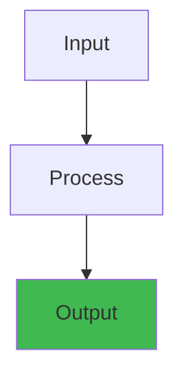

# ⚡ Distributed Systems Simulation Engine — Architecture Blueprint


## Overview

#### Step-by-Step
1. Process input
2. Validate
3. Execute
4. Return result

#### Code Example
```python
# Example implementation
pass
```

#### Real-World Scenario
This pattern is commonly used in production systems.





> **Status:** v0.1 — Foundational  
> **Owner:** Platform Architecture Team  
> **Last Updated:** 2026-05-27

---

## 1. Overview

#### Step-by-Step
1. Process input
2. Validate
3. Execute
4. Return result

#### Code Example
```python
# Example implementation
pass
```

#### Real-World Scenario
This pattern is commonly used in production systems.


The Simulation Engine is an interactive, browser-accessible distributed systems simulator. It models real-world systems (Kafka, Kubernetes, TCP, Raft, etc.) using an Entity-Component-System (ECS) architecture with an event-driven tick loop. Users can run pre-defined scenarios, inject failures, control time dilation, and observe system behavior through real-time visualizations.

---

## 2. High-Level Architecture

#### Step-by-Step
1. Process input
2. Validate
3. Execute
4. Return result

#### Code Example
```python
# Example implementation
pass
```

#### Real-World Scenario
This pattern is commonly used in production systems.


```
 ┌─────────────────────────────────────────────────────────────────────┐
 │                      SIMULATION ENGINE                              │
 │                                                                     │
 │  ┌─────────────────────────────────────────────────────────────┐    │
 │  │                    SimulationManager                          │    │
 │  │  ┌─────────┐  ┌─────────┐  ┌─────────┐  ┌─────────┐        │    │
 │  │  │  World  │  │  Event  │  │  Clock  │  │Scheduler│        │    │
 │  │  │  State  │  │  Queue  │  │         │  │         │        │    │
 │  │  └────┬────┘  └────┬────┘  └────┬────┘  └────┬────┘        │    │
 │  │       │            │            │            │             │    │
 │  │       ▼            ▼            ▼            ▼             │    │
 │  │  ┌─────────────────────────────────────────────────────┐   │    │
 │  │  │                ECS Core                              │   │    │
 │  │  │  Entity Manager │ Component Store │ System Scheduler │   │    │
 │  │  └─────────────────────────────────────────────────────┘   │    │
 │  └─────────────────────────────────────────────────────────────┘    │
 │                                                                     │
 │  ┌──────────┐  ┌──────────┐  ┌──────────┐  ┌──────────┐           │
 │  │ Simulator │  │ Simulator │  │ Simulator │  │ Simulator │           │
 │  │ Instances │  │ Instances │  │ Instances │  │ Instances │           │
 │  │ (Kafka)   │  │ (TCP)    │  │ (K8s)    │  │ (Raft)   │           │
 │  └──────────┘  └──────────┘  └──────────┘  └──────────┘           │
 │                                                                     │
 │  ┌─────────────────────────────────────────────────────────────┐    │
 │  │  MetricsCollector  │  FailureInjector  │  Persistence       │    │
 │  └─────────────────────────────────────────────────────────────┘    │
 └─────────────────────────────────────────────────────────────────────┘
                             │
                             ▼
 ┌─────────────────────────────────────────────────────────────────────┐
 │                       VISUALIZATION PIPELINE                        │
 │  Metrics → TimeSeriesDB → WebSocket → D3 real-time charts          │
 │  State   → Snapshot    → WebSocket → Scene Graph renderer          │
 └─────────────────────────────────────────────────────────────────────┘
```

---

## 3. Entity-Component-System (ECS) Architecture

#### Step-by-Step
1. Process input
2. Validate
3. Execute
4. Return result

#### Code Example
```python
# Example implementation
pass
```

#### Real-World Scenario
This pattern is commonly used in production systems.


### 3.1 Entity

#### Step-by-Step
1. Process input
2. Validate
3. Execute
4. Return result

#### Code Example
```python
# Example implementation
pass
```

#### Real-World Scenario
This pattern is commonly used in production systems.


An entity is a unique ID — a bag of components. No behavior, no data of its own.

```go
type Entity struct {
    ID         uuid.UUID
    Components map[reflect.Type]Component
    Active     bool
    CreatedAt  time.Time
}
```

### 3.2 Components (Data)

#### Step-by-Step
1. Process input
2. Validate
3. Execute
4. Return result

#### Code Example
```python
# Example implementation
pass
```

#### Real-World Scenario
This pattern is commonly used in production systems.


```go
// Kafka Broker components
type BrokerConfig struct {
    ID              int32
    Rack            string
    Port            int32
    NumPartitions   int
    ReplicationFactor int
    LogDirs         []string
}

type BrokerState struct {
    Status          string // "running", "stopped", "dead"
    LeaderCount     int
    ReplicaCount    int
    UnderReplicated int
    BytesInPerSec   float64
    BytesOutPerSec  float64
    IsController    bool
}

type PartitionState struct {
    ID              int32
    Leader          int32
    Replicas        []int32
    ISR             []int32  // In-Sync Replicas
    OSR             []int32  // Out-of-Sync Replicas
    LogEndOffset    int64
    LogStartOffset  int64
    HighWatermark   int64
    LeaderEpoch     int32
}

type ProducerState struct {
    ID              string
    Acks            string // "0", "1", "all"
    Retries         int
    BatchSize       int
    LingerMs        int
    InFlight        int
    CurrentBroker   int32
}

type ConsumerState struct {
    ID              string
    GroupID         string
    Partition       int32
    Offset          int64
    Lag             int64
    AssignedBroker  int32
}
```

### 3.3 Systems (Behavior)

#### Step-by-Step
1. Process input
2. Validate
3. Execute
4. Return result

#### Code Example
```python
# Example implementation
pass
```

#### Real-World Scenario
This pattern is commonly used in production systems.


```go
// Each system implements the System interface
type System interface {
    Name() string
    Init(world *WorldState) error
    Update(world *WorldState, dt time.Duration) error
    Shutdown() error
}

// Kafka-specific systems
type BrokerSystem struct { /* handles broker lifecycle */ }
type PartitionSystem struct { /* leader election, ISR management */ }
type ProducerSystem struct { /* produce requests, retries */ }
type ConsumerSystem struct { /* consume requests, rebalancing */ }
type ControllerSystem struct { /* partition leadership, cluster metadata */ }
type MetricsSystem struct { /* emit metrics per tick */ }
```

---

## 4. Event-Driven Simulation Loop

#### Step-by-Step
1. Process input
2. Validate
3. Execute
4. Return result

#### Code Example
```python
# Example implementation
pass
```

#### Real-World Scenario
This pattern is commonly used in production systems.


```
 ┌─────────────────────────────────────────────────────────────────────┐
 │                      SIMULATION TICK LOOP                           │
 │                                                                     │
 │  ┌─────────┐    ┌──────────┐    ┌────────────┐    ┌──────────┐     │
 │  │  Tick   │───▶│  Process │───▶│  Execute    │───▶│  Emit    │     │
 │  │  Start  │    │  Events  │    │  Systems    │    │  Metrics │     │
 │  └─────────┘    └──────────┘    └────────────┘    └──────────┘     │
 │       │              │               │               │              │
 │       ▼              ▼               ▼               ▼              │
 │  Increment      Dequeue        For each        Collect metric      │
 │  virtual time   events from    system in       from each          │
 │  by delta       priority       dependency      entity/component    │
 │                 queue          order                               │
 │       │              │               │               │              │
 │       ▼              ▼               ▼               ▼              │
 │  ┌─────────┐    ┌──────────┐    ┌────────────┐    ┌──────────┐     │
 │  │ Advance │    │ Apply    │    │ Systems    │    │ Publish  │     │
 │  │ Clock   │    │ state    │    │ read/write │    │ to       │     │
 │  │         │    │ mutations│    │ components │    │ channel  │     │
 │  └─────────┘    └──────────┘    └────────────┘    └──────────┘     │
 │                                                                     │
 │  ┌─────────────────────────────────────────────────────────────┐    │
 │  │  Failure Injection: systems check FailureSchedule before     │    │
 │  │  execution. If failure active, apply fault (latency/drop).   │    │
 │  └─────────────────────────────────────────────────────────────┘    │
 └─────────────────────────────────────────────────────────────────────┘
```

```go
// Core simulation loop
func (m *SimulationManager) Tick() error {
    m.clock.Advance(m.config.TickDuration)

    // 1. Drain event queue
    events := m.eventQueue.Drain()
    for _, evt := range events {
        m.applyEvent(evt)
    }

    // 2. Check failure schedule
    activeFailures := m.failureInjector.ActiveAt(m.clock.Now())

    // 3. Execute systems in dependency order
    for _, sys := range m.systems {
        if err := sys.Update(m.world, m.config.TickDuration); err != nil {
            // Fault-tolerant: log and continue
            m.logger.Error("system error", "system", sys.Name(), "error", err)
        }
    }

    // 4. Apply active failures to entities
    for _, f := range activeFailures {
        f.Apply(m.world)
    }

    // 5. Collect and emit metrics
    metrics := m.metricsCollector.Collect(m.world)
    m.metricsCollector.Emit(metrics)

    // 6. Notify visualization subscribers
    m.stateSubscribers.Publish(SimSnapshot{
        Time:    m.clock.Now(),
        State:   m.world.Snapshot(),
        Metrics: metrics,
        Events:  events,
    })

    return nil
}
```

---

## 5. Simulator Types

#### Step-by-Step
1. Process input
2. Validate
3. Execute
4. Return result

#### Code Example
```python
# Example implementation
pass
```

#### Real-World Scenario
This pattern is commonly used in production systems.


### 5.1 Kafka Simulator

#### Step-by-Step
1. Process input
2. Validate
3. Execute
4. Return result

#### Code Example
```python
# Example implementation
pass
```

#### Real-World Scenario
This pattern is commonly used in production systems.


```
 Simulation Entities:
 ┌─────────────────────────────────────────────────────────────────────┐
 │                                                                     │
 │  Broker(3) ──── owns ────▶ Partition(6) ◀── produces ─── Producer(2)│
 │    │                         │    │                                  │
 │    │                         │    └── ISR ──▶ Replica(18)            │
 │    │                         │                                        │
 │    ▼                         ▼                                        │
 │  Controller ◀─────────── Metadata                          Consumer(2)│
 │  (elected)                 topic/partition                           │
 │                              assignments            ConsumerGroup(1) │
 └─────────────────────────────────────────────────────────────────────┘

 Configurable Parameters:
   - Number of brokers (1-10)
   - Replication factor (1-5)
   - Partitions per topic (1-20)
   - Producer acks setting (0/1/all)
   - Producer batch size, linger.ms
   - Consumer group size
   - Min.insync.replicas

 Observable Metrics:
   - Leader distribution across brokers
   - Under-replicated partitions count
   - ISR shrinks/expands
   - Producer request latency
   - Consumer lag per partition
   - Controller elections triggered
```

### 5.2 Kubernetes Scheduler Simulator

#### Step-by-Step
1. Process input
2. Validate
3. Execute
4. Return result

#### Code Example
```python
# Example implementation
pass
```

#### Real-World Scenario
This pattern is commonly used in production systems.


```
 Simulation Entities:
 ┌─────────────────────────────────────────────────────────────────────┐
 │                                                                     │
 │  Node(5) ─── runs ───▶ Pod(12) ◀── scheduled ─── Scheduler         │
 │   │                      │                           │              │
 │   │                      ├── Pending                 │              │
 │   │                      ├── Running                 │ queue        │
 │   │                      ├── Succeeded               ▼              │
 │   │                      └── Failed            ScheduleQueue         │
 │   │                                                       │          │
 │   └── Resources: CPU/Mem/Ephemeral                         │          │
 │                                                            │          │
 │  Autoscaler ◀── metrics ──── Metrics Server ◀─── kubelet   │          │
 └─────────────────────────────────────────────────────────────────────┘

 Configurable Parameters:
   - Number of nodes, CPU/memory per node
   - Pod resource requests/limits
   - Scheduler policy (spread/binpack)
   - Autoscaler min/max nodes
   - Pod priority classes

 Observable Metrics:
   - Node utilization (CPU/Mem)
   - Pending pods count
   - Scheduling latency
   - Autoscaler scaling events
   - Pod lifecycle transitions
```

### 5.3 TCP Handshake Simulator

#### Step-by-Step
1. Process input
2. Validate
3. Execute
4. Return result

#### Code Example
```python
# Example implementation
pass
```

#### Real-World Scenario
This pattern is commonly used in production systems.


```
 ┌──────┐                    ┌──────┐
 │Client│                    │Server│
 └──┬───┘                    └──┬───┘
    │                           │
    │  1. SYN (seq=x)          │
    │──────────────────────────▶│
    │                           │
    │  2. SYN-ACK (seq=y, ack=x+1)
    │◀──────────────────────────│
    │                           │
    │  3. ACK (seq=x+1, ack=y+1)
    │──────────────────────────▶│
    │                           │
    │  4. Data Transfer         │
    │══════════════════════════▶│
    │                           │
    │  5. FIN (seq=m)          │
    │──────────────────────────▶│
    │  6. ACK                  │
    │◀──────────────────────────│
    │  7. FIN                  │
    │◀──────────────────────────│
    │  8. ACK (seq=m+1)       │
    │──────────────────────────▶│
    │                           │
    │  Connection CLOSED        │
 └──────┘                    └──────┘

 Observable Metrics:
   - Handshake RTT
   - Congestion window size
   - Retransmission count
   - Slow start threshold
   - Packets in flight
```

### 5.4 Raft Consensus Simulator

#### Step-by-Step
1. Process input
2. Validate
3. Execute
4. Return result

#### Code Example
```python
# Example implementation
pass
```

#### Real-World Scenario
This pattern is commonly used in production systems.


```
 ┌──────────┐     ┌──────────┐     ┌──────────┐
 │  Follower│     │  Leader  │     │ Follower │
 │  Node 1  │     │  Node 2  │     │  Node 3  │
 └────┬─────┘     └────┬─────┘     └────┬─────┘
      │                │                │
      │   AppendEntries(term, entries)  │
      │◀════════════════════════════════│
      │                │                │
      │   AppendEntries response        │
      │════════════════════════════════▶│
      │                │                │
      │                │  AppendEntries │
      │                │══════════════▶│
      │                │◀══════════════│
      │                │                │
      │  If Leader fails:               │
      │  New election triggered         │
      │  ── RequestVote ──▶             │
      │  ◀── Vote granted ──            │
      │                │                │
      │  New Leader announces term      │
      │◀════════════════════════════════│
 └──────────┘     └──────────┘     └──────────┘

 Configurable Parameters:
   - Cluster size (3-7)
   - Election timeout range
   - Heartbeat interval
   - Batch size for log entries
   - Network latency distribution

 Observable Metrics:
   - Current term and leader
   - Log index and commit index
   - Election duration
   - Votes received per candidate
   - Log replication lag per follower
   - Snapshot size/frequency
```

---

## 6. Time Dilation Controls

#### Step-by-Step
1. Process input
2. Validate
3. Execute
4. Return result

#### Code Example
```python
# Example implementation
pass
```

#### Real-World Scenario
This pattern is commonly used in production systems.


```json
{
  "time_dilation_modes": {
    "slow_motion": { "multiplier": 0.25, "pause_between_ticks": 100 },
    "real_time":   { "multiplier": 1.0,  "pause_between_ticks": 20 },
    "fast_forward":{ "multiplier": 5.0,  "pause_between_ticks": 0 },
    "turbo":       { "multiplier": 50.0, "pause_between_ticks": 0 },
    "step":        { "multiplier": 0,    "single_tick": true },
    "paused":      { "multiplier": 0,    "single_tick": false }
  }
}
```

---

## 7. Failure Injection System

#### Step-by-Step
1. Process input
2. Validate
3. Execute
4. Return result

#### Code Example
```python
# Example implementation
pass
```

#### Real-World Scenario
This pattern is commonly used in production systems.


```go
type Failure struct {
    ID          string
    Type        FailureType
    Target      EntityFilter   // which entities to affect
    StartAt     time.Duration  // virtual time to start
    Duration    time.Duration  // 0 = permanent until removed
    Parameters  map[string]interface{}
    Active      bool
}

type FailureType string
const (
    LatencySpike     FailureType = "latency_spike"
    PacketLoss       FailureType = "packet_loss"
    BrokerCrash      FailureType = "broker_crash"
    NetworkPartition FailureType = "network_partition"
    LeaderFailure    FailureType = "leader_failure"
    DiskFull         FailureType = "disk_full"
    CPUThrottle      FailureType = "cpu_throttle"
)
```

**Built-in Failure Scenarios:**
- Kafka broker crash → triggers controller election, partition re-replication
- Network partition → causes split-brain, ISR shrinkage
- Leader failure → Raft election storm
- Latency spike → producer timeouts, retries, backpressure
- Disk full → broker shutdown, data loss risk

---

## 8. Metrics Emission

#### Step-by-Step
1. Process input
2. Validate
3. Execute
4. Return result

#### Code Example
```python
# Example implementation
pass
```

#### Real-World Scenario
This pattern is commonly used in production systems.


```go
// Per-tick metrics collected from all entities
type TickMetrics struct {
    Timestamp     time.Time
    TickDuration  time.Duration

    // Counters
    MessagesProduced     int64
    MessagesConsumed     int64
    RequestsSent         int64
    Retries              int64
    Elections            int64

    // Gauges
    ActiveBrokers        int
    PartitionsTotal      int
    UnderReplicatedParts int
    ISRSize              int
    CPULoad              float64
    MemoryUsed           int64

    // Histograms (HDR Histogram)
    RequestLatencyMs     []int64
    BatchSize            []int64
    LagPerPartition      []int64

    // Rate
    ThroughputBytesPerSec float64
    ElectionRatePerSec    float64
}
```

---

## 9. Scenario Definitions (JSON)

#### Step-by-Step
1. Process input
2. Validate
3. Execute
4. Return result

#### Code Example
```python
# Example implementation
pass
```

#### Real-World Scenario
This pattern is commonly used in production systems.


```json
{
  "name": "Kafka Broker Failure",
  "description": "Simulate a broker crash and observe ISR dynamics",
  "initial_state": {
    "brokers": 3,
    "partitions_per_topic": 6,
    "replication_factor": 3,
    "min_insync_replicas": 2,
    "producers": [
      { "count": 2, "acks": "all", "throughput_per_sec": 100 }
    ],
    "consumers": [
      { "group_id": "consumer-group-1", "count": 2 }
    ]
  },
  "events": [
    {
      "time_ms": 5000,
      "type": "broker_crash",
      "target": { "broker_id": 1 }
    },
    {
      "time_ms": 15000,
      "type": "broker_restart",
      "target": { "broker_id": 1 }
    }
  ],
  "failures": [
    {
      "type": "latency_spike",
      "start_ms": 8000,
      "duration_ms": 2000,
      "target": { "all_brokers": true },
      "params": { "latency_ms": { "min": 100, "max": 500 } }
    }
  ],
  "duration_ms": 30000,
  "time_scale": 1.0,
  "metrics_interval_ms": 100
}
```

---

## 10. Persistence & Replay

#### Step-by-Step
1. Process input
2. Validate
3. Execute
4. Return result

#### Code Example
```python
# Example implementation
pass
```

#### Real-World Scenario
This pattern is commonly used in production systems.


```
 ┌────────────┐     ┌────────────┐     ┌────────────┐
 │  Simulation │────▶│  Snapshot  │────▶│  Replay    │
 │  Running   │     │  Store     │     │  Loader    │
 └────────────┘     └────────────┘     └────────────┘
       │                  │                  │
       ▼                  ▼                  ▼
  Every N ticks:    Key: sim_id +      Reconstruct
  serialize all     tick_number         world state
  entity components Value: protobuf     replay events
  and event queue                       at original timing
```

---

## 11. CLI for Headless Runs

#### Step-by-Step
1. Process input
2. Validate
3. Execute
4. Return result

#### Code Example
```python
# Example implementation
pass
```

#### Real-World Scenario
This pattern is commonly used in production systems.


```bash
# Run a scenario with JSON output
sim-engine run --scenario scenarios/kafka-broker-failure.json \
               --output results.json \
               --metrics-interval 100ms \
               --time-scale 10.0

# List available scenarios
sim-engine scenarios list

# Validate scenario config
sim-engine scenarios validate my-scenario.json

# Record/replay
sim-engine record --scenario ... --output recording.bin
sim-engine replay recording.bin --time-scale 2.0
```

---

## 12. Browser Integration

#### Step-by-Step
1. Process input
2. Validate
3. Execute
4. Return result

#### Code Example
```python
# Example implementation
pass
```

#### Real-World Scenario
This pattern is commonly used in production systems.


```
 ┌─────────────────────────────────────────────────────────────────────┐
 │                    BROWSER (React/Next.js)                           │
 │                                                                     │
 │  ┌─────────────────────┐    ┌───────────────────────────────────┐   │
 │  │  SimRunner (Worker) │    │  Visualization Dashboard          │   │
 │  │  ┌───────────────┐  │    │  ┌──────────┐ ┌──────────────┐   │   │
 │  │  │ ECS Core      │  │    │  │ Topology │ │ Metrics      │   │   │
 │  │  │ (WASM or JS)  │  │    │  │ Graph    │ │ Time Series  │   │   │
 │  │  └───────────────┘  │    │  └──────────┘ └──────────────┘   │   │
 │  │  ┌───────────────┐  │    │  ┌──────────┐ ┌──────────────┐   │   │
 │  │  │ WebSocket     │◀─┼────┼──│ Events   │ │ Scenario     │   │   │
 │  │  │ Client        │  │    │  │ Timeline │ │ Controls     │   │   │
 │  │  └───────────────┘  │    │  └──────────┘ └──────────────┘   │   │
 │  └─────────────────────┘    └───────────────────────────────────┘   │
 └─────────────────────────────────────────────────────────────────────┘
```

The simulation engine runs in a **Web Worker** using compiled WASM (Go → TinyGo → WASM), communicating with the main thread via structured clone serialization at each tick. This keeps the UI responsive while the simulation computes.


## Practical Example

#### Step-by-Step
1. Process input
2. Validate
3. Execute
4. Return result

#### Code Example
```python
# Example implementation
pass
```

#### Real-World Scenario
This pattern is commonly used in production systems.


See code examples above for practical usage patterns.