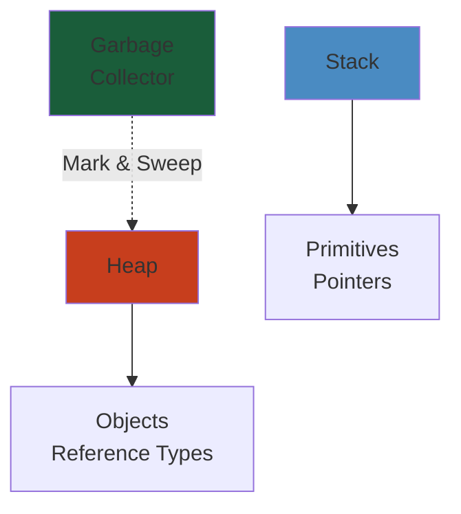

# Observability & Monitoring — Architecture Blueprint

> **Status:** v0.1 — Foundational
> **Owner:** Platform Architecture Team
> **Last Updated:** 2026-05-27

---




## 1. Overview

#### Step-by-Step
1. Process input
2. Validate
3. Execute
4. Return result

#### Code Example
```python
# Example implementation
pass
```

#### Real-World Scenario
This pattern is commonly used in production systems.


The Observability Stack provides comprehensive visibility into every layer of the platform: application metrics, distributed traces, structured logs, system events, and kernel-level profiling. Built on OpenTelemetry with Grafana LGTM stack (Loki, Grafana, Tempo, Mimir), it enables SLO-driven alerting, quick incident diagnosis, and capacity planning.

---

## 2. Observability Pillars

#### Step-by-Step
1. Process input
2. Validate
3. Execute
4. Return result

#### Code Example
```python
# Example implementation
pass
```

#### Real-World Scenario
This pattern is commonly used in production systems.


```
 ┌─────────────────────────────────────────────────────────────────────┐
 │                      OBSERVABILITY PILLARS                           │
 │                                                                     │
 │  ┌──────────┐  ┌──────────┐  ┌──────────┐  ┌──────────┐  ┌──────┐ │
 │  │ Metrics  │  │  Traces  │  │  Logs    │  │  Events  │  │Profile│ │
 │  └────┬─────┘  └────┬─────┘  └────┬─────┘  └────┬─────┘  └──┬───┘ │
 │       │             │             │             │           │      │
 │       ▼             ▼             ▼             ▼           ▼      │
 │  Prometheus    Tempo        Loki          Kafka        Pyroscope   │
 │  + Mimir       (traces)     (logs)        (events)     (profiling) │
 │  (metrics)                                                        │
 │                                                                     │
 │  All ingested via OpenTelemetry Collector                          │
 └─────────────────────────────────────────────────────────────────────┘
```

---

## 3. OpenTelemetry Collector Pipeline

#### Step-by-Step
1. Process input
2. Validate
3. Execute
4. Return result

#### Code Example
```python
# Example implementation
pass
```

#### Real-World Scenario
This pattern is commonly used in production systems.


```
 ┌──────────┐    ┌──────────┐    ┌──────────┐    ┌──────────┐    ┌──────────┐
 │ Service  │───▶│  OTel    │───▶│ Processor│───▶│  Exporter│───▶│ Backend  │
 │ Inst     │    │Collector │    │ Pipeline │    │          │    │          │
 └──────────┘    └──────────┘    └──────────┘    └──────────┘    └──────────┘
       │              │              │               │               │
       ▼              ▼              ▼               ▼               ▼
  Go apps:      Batch:          Batch:            Prometheus:    Mimir
  OTel SDK      otlp receiver   batch processor   remote write   (metrics)
  Python:                        memory_limiter                   Tempo
  OTel SDK      OTEL_           attributes                      (traces)
  Node.js:      RESOURCE_       processor       Loki exporter:  Loki
  OTel SDK      ATTRIBUTES      filter           grpc           (logs)
                                    processor
                                    sampling       S3 exporter:  S3
                                    processor       (archive)    (cold)
```

### 3.1 Collector Configuration

#### Step-by-Step
1. Process input
2. Validate
3. Execute
4. Return result

#### Code Example
```python
# Example implementation
pass
```

#### Real-World Scenario
This pattern is commonly used in production systems.


```yaml
receivers:
  otlp:
    protocols:
      grpc:
        endpoint: 0.0.0.0:4317
      http:
        endpoint: 0.0.0.0:4318

processors:
  batch:
    timeout: 1s
    send_batch_size: 1024
  memory_limiter:
    check_interval: 1s
    limit_mib: 512
  attributes:
    actions:
      - key: environment
        value: ${ENV}
        action: upsert
      - key: service.version
        from_attribute: service.version
        action: upsert
  filter:
    error_mode: ignore
    metrics:
      exclude:
        match_type: regexp
        metric_names:
          - "^http\\.server\\.duration$"
  probabilistic_sampler:
    hash_seed: 42
    sampling_percentage: 10.0

exporters:
  prometheus:
    endpoint: 0.0.0.0:8889
    namespace: platform
    resource_to_telemetry_conversion:
      enabled: true
  otlp:
    endpoint: tempo:4317
    tls:
      insecure: true
  loki:
    endpoint: http://loki:3100/loki/api/v1/push
    tenant: platform

service:
  pipelines:
    metrics:
      receivers: [otlp]
      processors: [memory_limiter, batch, attributes]
      exporters: [prometheus]
    traces:
      receivers: [otlp]
      processors: [memory_limiter, batch, attributes, probabilistic_sampler]
      exporters: [otlp]
    logs:
      receivers: [otlp]
      processors: [memory_limiter, batch, attributes]
      exporters: [loki]
```

---

## 4. Metrics Pipeline

#### Step-by-Step
1. Process input
2. Validate
3. Execute
4. Return result

#### Code Example
```python
# Example implementation
pass
```

#### Real-World Scenario
This pattern is commonly used in production systems.


```
 Service Instance           OTel Collector            Storage            Dashboard
 ──────────────           ──────────────           ──────────────      ──────────────
    Go App ───otlp──────▶  Prometheus    ──remote──▶  Mimir      ◀────  Grafana
    (counter,       ────▶  exporter      write       (long-term)        (dashboards)
     histogram,                                                    ▲
     gauge)              Node Exporter ──▶ Prometheus ─────────────┘
                            (host)         (short-term)

 Components:
   - Mimir:  horizontally-scalable, long-term (30 days retention)
   - Prometheus: short-term (7 days), low-latency for alerting
   - Thanos: optional S3-backed unlimited retention
   - kube-state-metrics: K8s object metrics
   - cAdvisor: container resource metrics
```

---

## 5. RED Metrics per Service

#### Step-by-Step
1. Process input
2. Validate
3. Execute
4. Return result

#### Code Example
```python
# Example implementation
pass
```

#### Real-World Scenario
This pattern is commonly used in production systems.


```
 RED METHODOLOGY (Rate, Errors, Duration)
 ────────────────────────────────────────

 Knowledge Graph Service:
   Rate:   kg.requests.total{operation="search|lookup|traverse"}
   Errors: kg.requests.error{error_type="timeout|not_found|internal"}
   Duration: kg.request.duration{p50|p95|p99|max}

 Simulation Engine:
   Rate:   sim.ticks.total{simulator="kafka|tcp|raft"}
   Errors: sim.system.errors{system="partition|leader|producer"}
   Duration: sim.tick.duration{p50|p95|p99}
            sim.system.latency{system="broker|scheduler"}

 AI Tutor:
   Rate:   ai.queries.total{intent="explain|diagram|debug"}
   Errors: ai.response.errors{error_type="timeout|hallucination|tool_failure"}
   Duration: ai.rag.pipeline.duration{stage="retrieval|generation|tool_exec"}
            ai.llm.latency{model="gpt4|claude|ollama"}

 Visualization Engine:
   Rate:   viz.render.calls{backend="pixi|d3|three"}
   Errors: viz.render.errors{error_type="webgl|oom|timeout"}
   Duration: viz.frame.render.duration{p50|p95|p99}

 Content Pipeline:
   Rate:   content.ingestion.count{action="create|update|delete"}
   Errors: content.pipeline.errors{stage="parse|embed|index"}
   Duration: content.pipeline.duration{stage="parse|transform|compile"}

 All services:
   Rate:   http.server.request_count{method, route, status}
   Errors: http.server.request_count{status=~"5.."}
   Duration: http.server.duration{p50|p95|p99}
   Rate:   grpc.server.request_count{method, code}
   Errors: grpc.server.request_count{code=~"Internal|Unavailable"}
   Duration: grpc.server.duration{p50|p95|p99}
```

### 5.1 Metrics Implementation

#### Step-by-Step
1. Process input
2. Validate
3. Execute
4. Return result

#### Code Example
```python
# Example implementation
pass
```

#### Real-World Scenario
This pattern is commonly used in production systems.


```go
// Go service example: metrics registration
var (
    // HTTP metrics
    httpRequestsTotal = prometheus.NewCounterVec(
        prometheus.CounterOpts{
            Name: "http_server_request_count",
            Help: "Total HTTP requests",
        },
        []string{"method", "route", "status"},
    )
    httpRequestDuration = prometheus.NewHistogramVec(
        prometheus.HistogramOpts{
            Name:    "http_server_duration_ms",
            Help:    "HTTP request latency in ms",
            Buckets: prometheus.DefBuckets, // 5, 10, 25, 50, 100, 250, 500, 1000
        },
        []string{"method", "route"},
    )
    httpRequestsInFlight = prometheus.NewGauge(
        prometheus.GaugeOpts{
            Name: "http_server_requests_in_flight",
            Help: "Current number of in-flight requests",
        },
    )
)

func init() {
    prometheus.MustRegister(httpRequestsTotal)
    prometheus.MustRegister(httpRequestDuration)
    prometheus.MustRegister(httpRequestsInFlight)
}

// Middleware
func MetricsMiddleware(next http.Handler) http.Handler {
    return http.HandlerFunc(func(w http.ResponseWriter, r *http.Request) {
        start := time.Now()
        httpRequestsInFlight.Inc()
        defer httpRequestsInFlight.Dec()

        sw := statusWriter{ResponseWriter: w}
        next.ServeHTTP(&sw, r)

        duration := time.Since(start).Milliseconds()
        httpRequestsTotal.WithLabelValues(r.Method, r.URL.Path, strconv.Itoa(sw.status)).Inc()
        httpRequestDuration.WithLabelValues(r.Method, r.URL.Path).Observe(float64(duration))
    })
}
```

---

## 6. USE Metrics per Resource

#### Step-by-Step
1. Process input
2. Validate
3. Execute
4. Return result

#### Code Example
```python
# Example implementation
pass
```

#### Real-World Scenario
This pattern is commonly used in production systems.


```
 USE METHODOLOGY (Utilization, Saturation, Errors)
 ──────────────────────────────────────────────────

 CPU:
   Utilization: rate(node_cpu_seconds_total{mode!="idle"}[1m])
   Saturation:   node_load1 / node_count
   Errors:       node_procs_blocked

 Memory:
   Utilization: node_memory_Active / node_memory_MemTotal
   Saturation:  node_vmstat_pgpgin + node_vmstat_pgpgout (swap activity)
   Errors:      node_memory_oom_kills_total

 Disk:
   Utilization: rate(node_disk_io_time_seconds_total[1m])
   Saturation:  rate(node_disk_io_time_weighted_seconds_total[1m])
   Errors:      rate(node_disk_errors_total[1m])

 Network:
   Utilization: rate(node_network_receive_bytes_total[1m]) / if_speed
   Saturation:  rate(node_network_drop_total[1m])
   Errors:      rate(node_network_errors_total[1m])

 Pod (container):
   Utilization: container_cpu_usage_seconds_total / container_spec_cpu_quota
   Saturation:  container_cpu_cfs_throttled_seconds_total
   Errors:      container_last_seen (if missing = OOMKilled)
```

---

## 7. Four Golden Signals per System

#### Step-by-Step
1. Process input
2. Validate
3. Execute
4. Return result

#### Code Example
```python
# Example implementation
pass
```

#### Real-World Scenario
This pattern is commonly used in production systems.


```
 ┌────────────┬────────────┬────────────┬────────────┬────────────┐
 │ Component  │  Latency   │  Traffic   │  Errors    │ Saturation │
 ├────────────┼────────────┼────────────┼────────────┼────────────┤
 │ Graph API  │ p99: 200ms │ 50 req/s   │ < 0.1%     │ CPU < 70%  │
 │ Sim Engine │ p99: 500ms │ 10 sim/s   │ < 0.5%     │ Mem < 80%  │
 │ AI Tutor   │ p99: 3s    │ 5 q/s      │ < 1%       │ GPU < 90%  │
 │ Content    │ p99: 2s    │ 1 file/s   │ < 0.1%     │ Disk < 60% │
 │ Frontend   │ p99: 1s    │ 1000 p/s   │ < 0.1%     │ Mem < 200MB│
 │ Neo4j      │ p99: 100ms │ 200 q/s    │ < 0.01%    │ Conn < 80% │
 │ Postgres   │ p99: 50ms  │ 500 q/s    │ < 0.01%    │ Conn < 70% │
 │ Kafka      │ p99: 100ms │ 10K msg/s  │ < 0.001%   │ Disk < 60% │
 │ Redis      │ p99: 5ms   │ 1000 q/s   │ < 0.001%   │ Mem < 70%  │
 └────────────┴────────────┴────────────┴────────────┴────────────┘
```

---

## 8. Distributed Tracing

#### Step-by-Step
1. Process input
2. Validate
3. Execute
4. Return result

#### Code Example
```python
# Example implementation
pass
```

#### Real-World Scenario
This pattern is commonly used in production systems.


### 8.1 Trace Context Propagation

#### Step-by-Step
1. Process input
2. Validate
3. Execute
4. Return result

#### Code Example
```python
# Example implementation
pass
```

#### Real-World Scenario
This pattern is commonly used in production systems.


```
 Service A              Service B              Service C
 ──────────            ──────────            ──────────
  ┌──────┐              ┌──────┐              ┌──────┐
  │ Span │───HTTP──────▶│ Span │───gRPC──────▶│ Span │
  │ Root │   traceparent│ Child│   tracestate │ Child│
  └──────┘   header     └──────┘              └──────┘
     │
     ├── Span: query_knowledge_graph
     │   ├── Span: neo4j_query   (duration: 45ms)
     │   │   └── Attributes: cypher, params, hits
     │   └── Span: cache_lookup  (duration: 2ms, cached=true)
     │
     └── Span: generate_response
         └── Span: llm_call (duration: 1200ms)
             ├── Span: tokenize
             └── Span: inference
                 └── Attributes: model, tokens_in, tokens_out

 Key Headers:
   traceparent: 00-0af7651916cd43dd8448eb211c80319c-b7ad6b7169203331-01
                 │  │              trace_id              │  span_id  │flags
                 │  └── version=00                        │           │sampled
                 └── version
   tracestate:  platform=abc123,env=prod
```

### 8.2 Span Attributes

#### Step-by-Step
1. Process input
2. Validate
3. Execute
4. Return result

#### Code Example
```python
# Example implementation
pass
```

#### Real-World Scenario
This pattern is commonly used in production systems.


```go
// All services should set these span attributes
func setDefaultSpanAttributes(span trace.Span, r *http.Request) {
    span.SetAttributes(
        attribute.String("service.name", "knowledge-graph"),
        attribute.String("service.version", "1.2.3"),
        attribute.String("deployment.environment", "production"),
        attribute.String("http.method", r.Method),
        attribute.String("http.route", r.URL.Path),
        attribute.String("http.url", r.URL.String()),
        attribute.String("http.user_agent", r.UserAgent()),
        attribute.String("net.host.ip", r.Host),
    )
}

// Custom semantic conventions for domain spans
// Simulation spans
span.SetAttributes(
    attribute.String("sim.scenario", "kafka-broker-failure"),
    attribute.Int("sim.brokers", 3),
    attribute.Int("sim.tick", 1042),
    attribute.Int("sim.entities", 24),
)

// AI tutor spans
span.SetAttributes(
    attribute.String("ai.intent", "explain_concept"),
    attribute.String("ai.model", "gpt-4o"),
    attribute.Int("ai.tokens_in", 4520),
    attribute.Int("ai.tokens_out", 312),
    attribute.Float64("ai.temperature", 0.3),
    attribute.Bool("ai.cached", false),
)
```

---

## 9. Logging

#### Step-by-Step
1. Process input
2. Validate
3. Execute
4. Return result

#### Code Example
```python
# Example implementation
pass
```

#### Real-World Scenario
This pattern is commonly used in production systems.


### 9.1 Structured Log Format

#### Step-by-Step
1. Process input
2. Validate
3. Execute
4. Return result

#### Code Example
```python
# Example implementation
pass
```

#### Real-World Scenario
This pattern is commonly used in production systems.


```json
{
  "timestamp": "2026-05-27T10:23:45.123Z",
  "level": "info",
  "logger": "knowledge-graph",
  "message": "Graph query executed",
  "service": {
    "name": "knowledge-graph",
    "version": "1.2.3",
    "instance": "kg-pod-7f8b9c6d5-x9h2k"
  },
  "trace": {
    "trace_id": "0af7651916cd43dd8448eb211c80319c",
    "span_id": "b7ad6b7169203331"
  },
  "query": {
    "type": "cypher",
    "cypher": "MATCH (c:Concept {name: $name}) RETURN c",
    "params": { "name": "ISR" },
    "duration_ms": 45,
    "hits": 1
  },
  "deployment": {
    "environment": "production",
    "region": "us-east-1"
  }
}
```

### 9.2 Log Levels

#### Step-by-Step
1. Process input
2. Validate
3. Execute
4. Return result

#### Code Example
```python
# Example implementation
pass
```

#### Real-World Scenario
This pattern is commonly used in production systems.


| Level | Usage | Example |
|-------|-------|---------|
| `debug` | Development diagnostics | "Cache miss for key: concept:123" |
| `info` | Normal operations | "Graph query executed in 45ms" |
| `warn` | Unexpected but handled | "Neo4j connection pool at 80% capacity" |
| `error` | Failure requiring attention | "Graph query failed: connection refused" |
| `fatal` | Unrecoverable | "Failed to connect to Neo4j after 5 retries" |

### 9.3 Loki LogQL Queries

#### Step-by-Step
1. Process input
2. Validate
3. Execute
4. Return result

#### Code Example
```python
# Example implementation
pass
```

#### Real-World Scenario
This pattern is commonly used in production systems.


```logql
// All errors in last hour
{service_name=~"knowledge-graph|sim-engine|ai-tutor"} |= "error"

// Trace a specific request through all services
{service_name=~".*"} |= "0af7651916cd43dd8448eb211c80319c"

// Slow queries (> 1s)
{service_name="knowledge-graph"} | json | duration_ms > 1000

// Error rate per service (last 5 min)
sum by (service_name) (
  rate({service_name=~".*"} |= "error" [5m])
) / 
sum by (service_name) (
  rate({service_name=~".*"} [5m])
)

// AI tutor latency outliers
{service_name="ai-tutor"} | json 
  | duration_ms > 3000 
  | stats by (intent) count()
```

---

## 10. Custom Dashboards

#### Step-by-Step
1. Process input
2. Validate
3. Execute
4. Return result

#### Code Example
```python
# Example implementation
pass
```

#### Real-World Scenario
This pattern is commonly used in production systems.


```
 ┌─────────────────────────────────────────────────────────────────────┐
 │                    GRAFANA DASHBOARD CATALOG                         │
 │                                                                     │
 │  1. Platform Overview                                                │
 │     ┌────────────────────┐  ┌────────────────────┐                  │
 │     │ Service Health     │  │ Global Request Rate│                  │
 │     │ (grid of statuses) │  │ (time series)      │                  │
 │     └────────────────────┘  └────────────────────┘                  │
 │     ┌─────────────────────────────────────────────┐                 │
 │     │ Latency Heatmap (all services × percentiles)  │                 │
 │     └─────────────────────────────────────────────┘                 │
 │                                                                      │
 │  2. Simulator Metrics                                                │
 │     ┌────────────────────┐  ┌────────────────────┐                  │
 │     │ Active Sims        │  │ Tick Duration      │                  │
 │     └────────────────────┘  └────────────────────┘                  │
 │     ┌────────────────────┐  ┌────────────────────┐                  │
 │     │ System Latency     │  │ Entity Count       │                  │
 │     └────────────────────┘  └────────────────────┘                  │
 │                                                                      │
 │  3. AI Tutor Performance                                             │
 │     ┌────────────────────┐  ┌────────────────────┐                  │
 │     │ Query Volume       │  │ Response Time p50/95│                  │
 │     └────────────────────┘  └────────────────────┘                  │
 │     ┌────────────────────┐  ┌────────────────────┐                  │
 │     │ Token Usage        │  │ Cache Hit Rate     │                  │
 │     └────────────────────┘  └────────────────────┘                  │
 │                                                                      │
 │  4. Knowledge Graph Health                                           │
 │     ┌────────────────────┐  ┌────────────────────┐                  │
 │     │ Query Latency      │  │ Node/Edge Count    │                  │
 │     └────────────────────┘  └────────────────────┘                  │
 │     ┌────────────────────┐  ┌────────────────────┐                  │
 │     │ Index Usage        │  │ Connection Pool    │                  │
 │     └────────────────────┘  └────────────────────┘                  │
 │                                                                      │
 │  5. Content Pipeline                                                 │
 │     ┌────────────────────┐  ┌────────────────────┐                  │
 │     │ Ingestion Rate     │  │ Pipeline Duration  │                  │
 │     └────────────────────┘  └────────────────────┘                  │
 │     ┌────────────────────┐  ┌────────────────────┐                  │
 │     │ Error Rate by Stage│  │ Queue Depth        │                  │
 │     └────────────────────┘  └────────────────────┘                  │
 │                                                                      │
 │  6. User Engagement (RUM)                                            │
 │     ┌────────────────────┐  ┌────────────────────┐                  │
 │     │ Active Users       │  │ Page Load Time     │                  │
 │     └────────────────────┘  └────────────────────┘                  │
 │     ┌────────────────────┐  ┌────────────────────┐                  │
 │     │ Navigation Paths   │  │ Error Rate         │                  │
 │     └────────────────────┘  └────────────────────┘                  │
 └─────────────────────────────────────────────────────────────────────┘
```

---

## 11. Alerting

#### Step-by-Step
1. Process input
2. Validate
3. Execute
4. Return result

#### Code Example
```python
# Example implementation
pass
```

#### Real-World Scenario
This pattern is commonly used in production systems.


### 11.1 SLO Burn-Rate Alerting

#### Step-by-Step
1. Process input
2. Validate
3. Execute
4. Return result

#### Code Example
```python
# Example implementation
pass
```

#### Real-World Scenario
This pattern is commonly used in production systems.


```yaml
# Multi-window, multi-burn-rate alert
groups:
  - name: platform-slos
    rules:
      # SLO: 99.9% availability over 30 days
      # Error budget: 0.1% = ~26 minutes/month

      # Fast burn (2h window): critical if spending budget fast
      - alert: HighErrorBudgetBurnRate
        expr: |
          (
            sum(rate(http_server_request_count{status=~"5.."}[1h]))
            /
            sum(rate(http_server_request_count[1h]))
          ) > 0.001  # 0.1% error rate
        for: 5m
        labels:
          severity: critical
        annotations:
          summary: "Error budget burning too fast (1h rate)"

      # Slow burn (6h window): warning of gradual degradation
      - alert: ElevatedErrorRate
        expr: |
          (
            sum(rate(http_server_request_count{status=~"5.."}[6h]))
            /
            sum(rate(http_server_request_count[6h]))
          ) > 0.0005  # 0.05% error rate
        for: 30m
        labels:
          severity: warning
        annotations:
          summary: "Error rate elevated over 6h window"

      # Latency SLO: p99 < 500ms
      - alert: HighLatency
        expr: |
          histogram_quantile(0.99,
            sum(rate(http_server_duration_ms_bucket[5m])) by (le, service)
          ) > 500
        for: 5m
        labels:
          severity: warning
        annotations:
          summary: "p99 latency > 500ms for {{ $labels.service }}"
```

### 11.2 Alert Fatigue Reduction

#### Step-by-Step
1. Process input
2. Validate
3. Execute
4. Return result

#### Code Example
```python
# Example implementation
pass
```

#### Real-World Scenario
This pattern is commonly used in production systems.


```yaml
# Aggregation rules to prevent alert storms
groups:
  - name: aggregate-alerts
    rules:
      # Aggregate per-service (1 alert instead of per-pod)
      - alert: ServiceDown
        expr: |
          avg by (service) (
            up{job=~"platform/.*"}
          ) < 0.5
        labels:
          severity: critical

      # Aggregate by severity, suppress during maintenance
      - alert: ThrottledAlert
        expr: |
          # Only fire if > 50% of pods affected
          count by (service) (
            rate(http_server_request_count{status=~"5.."}[5m]) > 0
          ) / count by (service) (up) > 0.5
```

---

## 12. Service Level Objectives (SLOs)

#### Step-by-Step
1. Process input
2. Validate
3. Execute
4. Return result

#### Code Example
```python
# Example implementation
pass
```

#### Real-World Scenario
This pattern is commonly used in production systems.


| Service | SLO | Measurement | Burn Rate Budget |
|---------|-----|-------------|------------------|
| Graph API | 99.9% availability | HTTP 5xx / total | 26 min/month |
| Graph API | p99 < 200ms | Histogram | N/A |
| Sim Engine | 99.5% availability | Failures / total | 3.6 hr/month |
| Sim Engine | p99 < 500ms | Histogram | N/A |
| AI Tutor | 99.0% availability | HTTP 5xx / total | 7.3 hr/month |
| AI Tutor | p99 < 3000ms | Histogram | N/A |
| AI Tutor | > 95% accuracy | User rating | N/A |
| Search | p99 < 500ms | Histogram | N/A |
| Search | Recall@10 > 0.85 | Eval set | N/A |
| Platform | 99.9% uptime | Synthetic checks | 26 min/month |
| Platform | Page load < 2s | RUM (p95) | N/A |

---

## 13. eBPF for Kernel-Level Observability

#### Step-by-Step
1. Process input
2. Validate
3. Execute
4. Return result

#### Code Example
```python
# Example implementation
pass
```

#### Real-World Scenario
This pattern is commonly used in production systems.


```
 Tool:   BCC (BPF Compiler Collection) / Pyroscope eBPF
 Purpose: Kernel-level metrics with zero instrumentation

 ┌─────────────────────────────────────────────────────────────────────┐
 │                      eBPF PROBES                                     │
 │                                                                     │
 │  tcpconnect    Trace TCP connect() calls                           │
 │  → Latency, destinations, error rate                               │
 │                                                                     │
 │  tcpdrop       Trace TCP packets dropped by kernel                 │
 │  → Reason: sk_error_queue, sock_drop                               │
 │                                                                     │
 │  runqlat       Scheduler run queue latency                         │
 │  → Histogram of task scheduling delay                              │
 │                                                                     │
 │  biolatency    Block I/O latency histogram                         │
 │  → Per-disk I/O latency distribution                               │
 │                                                                     │
 │  execsnoop     Trace process executions                            │
 │  → Fork/exec rate, zombie processes                                │
 │                                                                     │
 │  oomkill       Trace OOM killer                                    │
 │  → Process killed, memory usage at kill time                      │
 │                                                                     │
 │  mysqld_qslower Trace MySQL queries slower than 1ms               │
 │                                                                     │
 │  profile       CPU profiling stack traces                          │
 │  → On-CPU flame graphs (Pyroscope integration)                    │
 └─────────────────────────────────────────────────────────────────────┘
```

```bash
# Example eBPF tool usage
sudo tcpconnect -L           # Trace all TCP connections
sudo runqlat 10 1            # Run queue latency for 10 seconds
sudo biolatency -D 10 1      # Disk I/O latency per device
sudo execsnoop               # Watch process executions
sudo profile -af 30 > out.stacks  # CPU profile -> flame graph
```

---

## 14. Real User Monitoring (RUM)

#### Step-by-Step
1. Process input
2. Validate
3. Execute
4. Return result

#### Code Example
```python
# Example implementation
pass
```

#### Real-World Scenario
This pattern is commonly used in production systems.


```typescript
// Frontend performance instrumentation
import { initRUM } from '@opentelemetry/instrumentation'

const rum = initRUM({
  serviceName: 'frontend',
  applicationId: 'platform-web',
  endpoint: '/api/v1/rum',
  sampleRate: 0.1,  // 10% of sessions
  plugins: [
    // Core Web Vitals
    'lcp',    // Largest Contentful Paint
    'fid',    // First Input Delay
    'cls',    // Cumulative Layout Shift
    // Navigation timing
    'navigation',
    // Resource timing
    'resource',
    // Errors
    'error',
    // User interactions
    'interaction',
  ],
})

// Custom user engagement metrics
rum.trackEvent('page_view', {
  contentId: 'kafka-internals',
  contentType: 'article',
  referrer: document.referrer,
})
rum.trackEvent('simulation_start', {
  scenario: 'kafka-broker-failure',
})
rum.trackMetric('simulation_duration_ms', 45230, {
  scenario: 'kafka-broker-failure',
})
```

---

## 15. Performance Targets

#### Step-by-Step
1. Process input
2. Validate
3. Execute
4. Return result

#### Code Example
```python
# Example implementation
pass
```

#### Real-World Scenario
This pattern is commonly used in production systems.


| Metric | Target | Instrument |
|--------|--------|-----------|
| Metric ingestion | < 1s to dashboard | Prometheus scrape interval |
| Trace ingestion | < 5s to Tempo | OTel batch exporter |
| Log ingestion | < 10s to Loki | Promtail tail + batch |
| Trace query (last 1h) | < 2s | Tempo by ID |
| Log query (last 1h) | < 1s | Loki index |
| Alert evaluation | < 1m | Prometheus rule eval |
| eBPF overhead | < 1% CPU | BCC framework |
| RUM payload | < 1KB/event | Compressed JSON |
