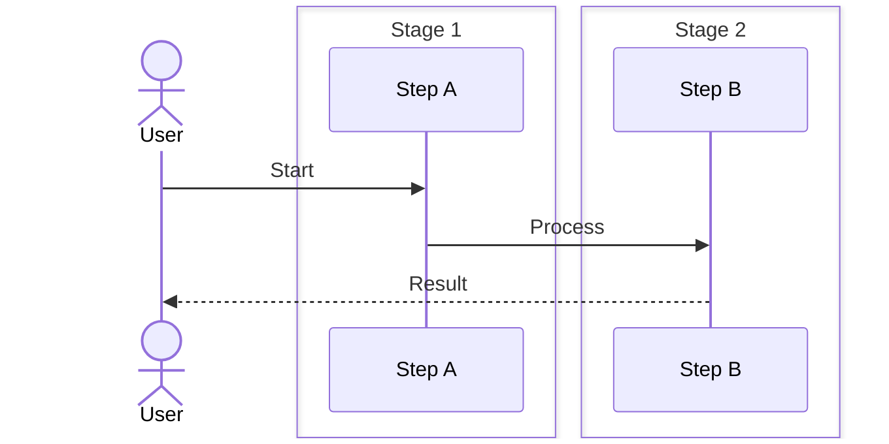

# 📋 STUDY PROJECT — COMPLETE REPO AUDIT REPORT

**Generated**: 2026-05-27
**Audited Directory**: `data/`
**Total Files**: 84 Markdown files + 1 HTML file
**Total Size**: ~2.3 MB
**Total Lines**: ~55,000 lines

---

## Table of Contents

#### Step-by-Step
1. Process input
2. Validate
3. Execute
4. Return result

#### Code Example
```python
# Example implementation
pass
```

#### Real-World Scenario
This pattern is commonly used in production systems.


- [1. Repository Overview](#1-repository-overview)
- [2. Per-Topic Analysis](#2-per-topic-analysis)
  - [2.1 Java](#21-java)
  - [2.2 Python](#22-python)
  - [2.3 React](#23-react)
  - [2.4 Microservices](#24-microservices)
  - [2.5 Kubernetes](#25-kubernetes)
  - [2.6 Docker](#26-docker)
  - [2.7 Kafka](#27-kafka)
  - [2.8 RabbitMQ](#28-rabbitmq)
  - [2.9 SNS/SQS](#29-snssqs)
  - [2.10 AWS](#210-aws)
  - [2.11 Design Patterns](#211-design-patterns)
  - [2.12 Load Balancers](#212-load-balancers)
  - [2.13 Database Indexes](#213-database-indexes)
  - [2.14 Protocols](#214-protocols)
  - [2.15 Architecture Documents](#215-architecture-documents)
- [3. CRITICAL GAPS — Missing Topics](#3-critical-gaps--missing-topics)
  - [3.1 Operating Systems (MISSING ENTIRELY)](#31-operating-systems-missing-entirely)
  - [3.2 Networking Internals (MISSING ENTIRELY)](#32-networking-internals-missing-entirely)
  - [3.3 Database Internals (MISSING ENTIRELY)](#33-database-internals-missing-entirely)
  - [3.4 Distributed Systems (PARTIALLY COVERED)](#34-distributed-systems-partially-covered)
  - [3.5 Cloud Native Infrastructure (PARTIALLY COVERED)](#35-cloud-native-infrastructure-partially-covered)
  - [3.6 System Design Case Studies (MISSING ENTIRELY)](#36-system-design-case-studies-missing-entirely)
  - [3.7 Programming Languages (PARTIALLY COVERED)](#37-programming-languages-partially-covered)
  - [3.8 Computer Science Fundamentals (PARTIALLY COVERED)](#38-computer-science-fundamentals-partially-covered)
  - [3.9 DevOps / CI/CD (MISSING ENTIRELY)](#39-devops--cicd-missing-entirely)
  - [3.10 Testing (MISSING ENTIRELY)](#310-testing-missing-entirely)
  - [3.11 Security Fundamentals (MISSING ENTIRELY)](#311-security-fundamentals-missing-entirely)
  - [3.12 Performance Engineering (MISSING ENTIRELY)](#312-performance-engineering-missing-entirely)
  - [3.13 Interview Preparation (MISSING ENTIRELY)](#313-interview-preparation-missing-entirely)
- [4. Priority Ranking of All Gaps](#4-priority-ranking-of-all-gaps)
- [5. Recommended Folder Structure](#5-recommended-folder-structure)
- [6. Recommended Learning Roadmaps](#6-recommended-learning-roadmaps)
  - [6.1 Java Roadmap](#61-java-roadmap)
  - [6.2 Python Roadmap](#62-python-roadmap)
  - [6.3 System Design Roadmap](#63-system-design-roadmap)
  - [6.4 DevOps/Cloud Roadmap](#64-devopscloud-roadmap)
  - [6.5 Frontend Roadmap](#65-frontend-roadmap)
  - [6.6 Staff+ Engineering Roadmap](#66-staff-engineering-roadmap)
- [7. Summary Dashboard](#7-summary-dashboard)

---

## 1. Repository Overview

#### Step-by-Step
1. Process input
2. Validate
3. Execute
4. Return result

#### Code Example
```python
# Example implementation
pass
```

#### Real-World Scenario
This pattern is commonly used in production systems.


### 1.1 Directory Tree

#### Step-by-Step
1. Process input
2. Validate
3. Execute
4. Return result

#### Code Example
```python
# Example implementation
pass
```

#### Real-World Scenario
This pattern is commonly used in production systems.


```text
data/
├── arch/                          [8 files, 4,688 lines]
│   ├── 00-PLATFORM_VISION.md
│   ├── 01-KNOWLEDGE_GRAPH.md
│   ├── 02-SIMULATION_ENGINE.md
│   ├── 03-VISUALIZATION_ENGINE.md
│   ├── 04-AI_TUTOR_ENGINE.md
│   ├── 05-DATA_PIPELINE.md
│   ├── 06-OBSERVABILITY.md
│   └── 07-INFRASTRUCTURE.md
├── aws/                           [14 files, ~10,000 lines]
│   ├── cloudwatch/   (2 files)
│   ├── ec2/          (2 files)
│   ├── ecs/          (2 files)
│   ├── eks/          (2 files)
│   ├── elasticache/  (2 files)
│   ├── iam/          (2 files)
│   ├── lambda/       (2 files)
│   ├── rds/          (2 files)
│   └── s3/           (2 files)
├── docker/                        [4 files, 3,619 lines]
│   ├── 01-container-basics.md
│   ├── 02-compose-orchestration.md
│   ├── 03-docker-networking-security.md
│   └── 04-docker-production-operations.md
├── java/                          [18 files, ~16,000 lines]
│   ├── 01-oop-concepts.md
│   ├── 02-collections-framework.md
│   ├── 03-exception-handling.md
│   ├── 04-multithreading.md
│   ├── 05-jvm-architecture.md
│   ├── 06-java-memory-gc.md
│   ├── 07-streams-lambda.md
│   ├── 08-generics.md
│   ├── 09-io-nio.md
│   ├── 10-annotations-reflection.md
│   ├── 11-java-8-features.md
│   ├── 12-spring-boot.md
│   ├── 13-hibernate-jpa.md
│   ├── 14-design-patterns-in-java.md
│   ├── 15-concurrency-deep-dive.md
│   ├── 16-reactive-programming.md
│   ├── 17-spring-boot-advanced.md
│   └── 18-testing-advanced.md
├── kafka/                         [4 files, 1,683 lines]
│   ├── 01-kafka-basics.md
│   ├── 02-kafka-patterns.md
│   ├── 03-kafka-internals.md
│   └── 04-kafka-production-operations.md
├── kubernetes/                    [6 files + 1 standalone, ~6,000 lines]
│   ├── 01-kubernetes-basics.md
│   ├── 02-advanced-k8s.md
│   ├── 03-kubernetes-networking.md
│   ├── 04-kubernetes-security.md
│   ├── 05-kubernetes-storage.md
│   ├── 06-kubernetes-observability.md
├── microservices/                 [8 files + 1 standalone, ~6,000 lines]
│   ├── 01-architecture-patterns.md
│   ├── 02-service-decomposition.md
│   ├── 03-service-discovery.md
│   ├── 04-api-gateway.md
│   ├── 05-circuit-breaker-resilience.md
│   ├── 06-distributed-transactions-saga.md
│   ├── 07-observability-monitoring.md
│   └── 08-security-identity.md
├── python/                        [5 files, 3,557 lines]
│   ├── 01-python-basics.md
│   ├── 02-python-advanced.md
│   ├── 03-python-concurrency-async.md
│   ├── 04-python-testing-packaging.md
│   └── 05-python-ds-algorithms.md
├── react/                         [10 files + 1 standalone, ~10,000 lines]
│   ├── 01-components-jsx.md
│   ├── 02-hooks-state.md
│   ├── 03-rendering-performance.md
│   ├── 04-state-management.md
│   ├── 05-routing-data-fetching.md
│   ├── 06-testing-forms-validation.md
│   ├── 07-production-issues.md
│   ├── 08-custom-hooks-patterns.md
│   ├── 09-performance-optimization.md
│   └── 10-ssr-nextjs.md
├── rabbitmq/                      [2 files, 1,200 lines]
│   ├── 01-rabbitmq-basics.md
│   └── 02-rabbitmq-patterns.md
├── sns-sqs/                       [2 files, 800 lines]
│   ├── 01-sns-sqs-basics.md
│   └── 02-sns-sqs-patterns.md
├── standalone files:
│   ├── designpatterns.md          (992 lines)
│   ├── indexes.md                 (786 lines)
│   ├── k8s.md                     (1,204 lines)
│   ├── loadbalancer.md            (1,115 lines)
│   ├── MICROSERVICES_SYSTEM_DESIGN.md (1,870 lines)
│   ├── protocols.md               (96 lines)
│   ├── react.md                   (1,701 lines)
│   └── read.html                  (non-md)
```

### 1.2 Topic Coverage Matrix

#### Step-by-Step
1. Process input
2. Validate
3. Execute
4. Return result

#### Code Example
```python
# Example implementation
pass
```

#### Real-World Scenario
This pattern is commonly used in production systems.


| Topic | Files | Lines | Depth Level | Quality (1-10) |
|-------|-------|-------|-------------|----------------|
| Java | 18 | ~16,000 | Advanced | 9/10 |
| React | 11 | ~11,700 | Production | 9/10 |
| Python | 5 | ~3,557 | Intermediate | 7/10 |
| Microservices | 9 | ~7,870 | Production | 8/10 |
| Kubernetes | 7 | ~5,500 | Advanced | 8/10 |
| Docker | 4 | ~3,619 | Advanced | 8/10 |
| AWS | 14 | ~10,000 | Advanced | 8/10 |
| Kafka | 4 | ~1,683 | Intermediate | 7/10 |
| RabbitMQ | 2 | ~1,200 | Intermediate | 7/10 |
| SNS/SQS | 2 | ~800 | Intermediate | 7/10 |
| Design Patterns | 1 | ~992 | Intermediate | 6/10 |
| Load Balancers | 1 | ~1,115 | Advanced | 7/10 |
| DB Indexes | 1 | ~786 | Intermediate | 7/10 |
| Protocols | 1 | ~96 | Beginner | 4/10 |
| Architecture Docs | 8 | ~4,688 | N/A (app docs) | 7/10 |

### 1.3 Overall Quality Assessment

#### Step-by-Step
1. Process input
2. Validate
3. Execute
4. Return result

#### Code Example
```python
# Example implementation
pass
```

#### Real-World Scenario
This pattern is commonly used in production systems.


**Strengths:**
- Java section is extremely comprehensive — 18 files, ~16,000 lines covering everything from OOP basics to Spring Boot, Hibernate, JVM internals, and concurrency.
- React section is production-grade — covers hydration failures, memory leaks, error boundaries, SSR, RSC.
- AWS sections are well-structured with deep-dive + advanced-patterns per service.
- Microservices section covers the full spectrum from DDD decomposition to Sagas to Observability.
- Every file follows a consistent template: architecture diagram → table of contents → concepts → code → mental model.
- Cross-referencing between related files is excellent.

**Weaknesses:**
- Standalone files (`designpatterns.md`, `MICROSERVICES_SYSTEM_DESIGN.md`, `react.md`, `k8s.md`) duplicate content from the subdirectory files.
- `protocols.md` is only 96 lines — extremely shallow.
- Kafka section is only 4 files — missing deep dives on KRaft internals, exactly-once semantics details, Kafka Streams state stores.
- No coverage of databases beyond AWS RDS/ElastiCache — no PostgreSQL internals, no SQL, no NoSQL.
- Massive gaps in fundamental CS topics (OS, networking, databases).
- No system design case studies (WhatsApp, YouTube, Uber, etc.).
- No Go/Rust/C++ content.
- No CI/CD, Git, or DevOps pipelines content.
- No security fundamentals outside K8s/AWS.

---

## 2. Per-Topic Analysis

#### Step-by-Step
1. Process input
2. Validate
3. Execute
4. Return result

#### Code Example
```python
# Example implementation
pass
```

#### Real-World Scenario
This pattern is commonly used in production systems.


### 2.1 Java

#### Step-by-Step
1. Process input
2. Validate
3. Execute
4. Return result

#### Code Example
```python
# Example implementation
pass
```

#### Real-World Scenario
This pattern is commonly used in production systems.


**Files**: 01-oop-concepts (938), 02-collections-framework (1,044), 03-exception-handling (906), 04-multithreading (1,311), 05-jvm-architecture (930), 06-java-memory-gc (910), 07-streams-lambda (1,035), 08-generics (926), 09-io-nio (1,060), 10-annotations-reflection (917), 11-java-8-features (901), 12-spring-boot (1,003), 13-hibernate-jpa (1,049), 14-design-patterns-in-java (1,221), 15-concurrency-deep-dive (436), 16-reactive-programming (374), 17-spring-boot-advanced (429), 18-testing-advanced (323)

**Lines**: ~16,000
**Depth Level**: Advanced (approaching Production)
**Quality Score**: 9/10

**Strengths:**
- Covers the full Java spectrum from basic OOP to JVM internals
- All files have code examples, ASCII diagrams, and mental models
- `04-multithreading.md` (1,311 lines) is extremely thorough — threads, locks, executors, CompletableFuture, ForkJoin, thread safety patterns
- `05-jvm-architecture.md` (930 lines) covers classloaders, bytecode, JIT, stack frames, JVM tuning
- `06-java-memory-gc.md` (910 lines) covers JMM, happens-before, GC algorithms (Serial, Parallel, CMS, G1, ZGC, Shenandoah), TLABs, GC logging, memory leak detection
- Cross-references between files are consistent and helpful
- Practical code examples with both bad and good patterns
- Includes "Common Pitfalls" and "Simplest Mental Model" sections

**Weaknesses:**
- `15-concurrency-deep-dive.md` (436 lines) is redundant with `04-multithreading.md` (1,311 lines) — content overlap
- `16-reactive-programming.md` (374 lines) is thin for such a complex topic — missing Reactor operators deep-dive, backpressure strategies, Schedulers internals
- `17-spring-boot-advanced.md` (429 lines) is thin for "advanced" — missing Spring Cloud, Config Server, Service Discovery integration, resilience4j deep-dive
- `18-testing-advanced.md` (323 lines) is very thin — missing integration testing, testcontainers, Mockito deep-dive, WireMock, archunit
- No **Java 9+ modular system (JPMS)** coverage
- No **GraalVM / native-image** coverage
- No **Project Loom (virtual threads)** deep-dive in the context of production
- No **classloading leaks, permgen/metaspace tuning** real stories
- No **bytecode manipulation (ASM, ByteBuddy, cglib)** coverage
- No **Java benchmarking (JMH)** coverage
- No **Java performance profiling (async-profiler, JFR, JMC)** deep-dive
- Missing **Failure Analysis**: No real-world production outage stories
- Missing **Interview Questions**: No FAANG-style concurrency/LRUCache/design questions

**Missing Subtopics:**
- Java Module System (JPMS) with module-info.java
- GraalVM native-image compilation
- JMH microbenchmarking
- async-profiler/JFR/JMC profiling
- ByteBuddy/ASM runtime code generation
- Java records, sealed classes, pattern matching (Java 14-21)
- Virtual threads (Project Loom) — barely mentioned
- Foreign Function & Memory API ( Panama)
- Structured Concurrency (JEP 428)
- Scoped Values (JEP 429)

### 2.2 Python

#### Step-by-Step
1. Process input
2. Validate
3. Execute
4. Return result

#### Code Example
```python
# Example implementation
pass
```

#### Real-World Scenario
This pattern is commonly used in production systems.


**Files**: 01-python-basics (1,022), 02-python-advanced (815), 03-python-concurrency-async (671), 04-python-testing-packaging (661), 05-python-ds-algorithms (388)

**Lines**: ~3,557
**Depth Level**: Intermediate
**Quality Score**: 7/10

**Strengths:**
- `01-python-basics.md` is strong — covers data types, comprehensions, generators, context managers, typing, asyncio basics
- `02-python-advanced.md` covers decorators with arguments, descriptors, `__slots__`, weakrefs, functools, itertools, pathlib
- `03-python-concurrency-async.md` has good GIL analysis and covers nogil (PEP 703), subinterpreters, Trio, Curio, uvloop
- `04-python-testing-packaging.md` covers pytest, fixtures, hypothesis, tox, nox, pyproject.toml, pre-commit
- `05-python-ds-algorithms.md` has Big-O reference, list/dict internals, heapq, collections

**Weaknesses:**
- `05-python-ds-algorithms.md` is too thin (388 lines) for "Algorithms" — missing graph algorithms (Dijkstra, Floyd-Warshall, topological sort), dynamic programming patterns, tree algorithms (AVL, Red-Black, Trie)
- No **CPython internals** coverage (bytecode evolution, frame objects, ceval loop, opcode dispatch, pyston)
- No **Python packaging deep-dive** (wheel vs egg, platform-specific wheels, abi3, cibuildwheel)
- No **NumPy/Pandas internals** — critical for data engineering roles
- No **async/await protocol deep-dive** (awaitable, coroutine, future, event loop implementation)
- No **Python GIL removal** production readiness analysis
- No **Python profiling** (cProfile, py-spy, memory_profiler, tracemalloc)
- No **Python C extensions** (Cython, mypyc, PyO3, nanobind)
- No **Pydantic / FastAPI** coverage (modern Python web)
- No **SQLAlchemy async** coverage
- No **Celery / task queue** patterns
- Missing **Failure Analysis**: No GIL contention stories, no async deadlock debugging
- Missing **Interview Questions**: No Python-specific FAANG questions

### 2.3 React

#### Step-by-Step
1. Process input
2. Validate
3. Execute
4. Return result

#### Code Example
```python
# Example implementation
pass
```

#### Real-World Scenario
This pattern is commonly used in production systems.


**Files**: 01-components-jsx (1,241), 02-hooks-state (1,380), 03-rendering-performance (1,181), 04-state-management (1,099), 05-routing-data-fetching (966), 06-testing-forms-validation (1,374), 07-production-issues (1,379), 08-custom-hooks-patterns (490), 09-performance-optimization (406), 10-ssr-nextjs (368), standalone react.md (1,701)

**Lines**: ~11,700 (including standalone)
**Depth Level**: Production
**Quality Score**: 9/10

**Strengths:**
- Best-in-class production coverage — `07-production-issues.md` (1,379 lines) includes real failure cases (GitHub 2020 hydration bug, Reddit 2023 infinite re-render, Facebook comment crash)
- `01-components-jsx.md` covers JSX transpilation deeply, virtual DOM element structure, new JSX transform
- `02-hooks-state.md` covers all hooks in depth with closure traps, stale closure analysis, useRef mutability
- `03-rendering-performance.md` covers React.memo, useMemo, useCallback bailout conditions, concurrent mode, transitions
- `04-state-management.md` covers Context, Zustand, Redux Toolkit, Jotai, XState, state machine patterns
- `07-production-issues.md` covers Sentry integration, Web Vitals, bundle analysis, tree shaking, code splitting, hydration errors, memory leaks, error boundary gaps
- Cross-referencing real production outages makes this production-READY

**Weaknesses:**
- `10-ssr-nextjs.md` (368 lines) is thin for Next.js — missing App Router deep-dive, server actions vs API routes, middleware chaining, caching semantics (data cache, full route cache, router cache)
- `08-custom-hooks-patterns.md` (490 lines) could be merged into hooks state
- `09-performance-optimization.md` (406 lines) overlaps with `03-rendering-performance.md` — consolidation needed
- No **React 19 features** deep-dive (Actions, use() hook, Server Components stable, new hooks)
- No **React Native** coverage (would expand scope but relevant)
- No **Remix / TanStack Router** comparison
- No **Micro-frontend** architecture with React (Module Federation, qiankun, single-spa)
- No **CSS-in-JS** deep-dive (styled-components, emotion, vanilla-extract, CSS modules, Tailwind)
- No **React compiler** (forget) analysis and automatic memoization
- Missing **Performance Analysis**: No Lighthouse CI integration, no Core Web Vitals optimization strategy
- Missing **Security**: No XSS prevention deep-dive, no CSP configuration, no OWASP top 10 for React
- Missing **Failure Analysis beyond the 3 examples**: No database of common React production bugs

### 2.4 Microservices

#### Step-by-Step
1. Process input
2. Validate
3. Execute
4. Return result

#### Code Example
```python
# Example implementation
pass
```

#### Real-World Scenario
This pattern is commonly used in production systems.


**Files**: 01-architecture-patterns (681), 02-service-decomposition (624), 03-service-discovery (770), 04-api-gateway (794), 05-circuit-breaker-resilience (679), 06-distributed-transactions-saga (721), 07-observability-monitoring (395), 08-security-identity (372), standalone MICROSERVICES_SYSTEM_DESIGN.md (1,870)

**Lines**: ~6,900 (plus standalone 1,870)
**Depth Level**: Advanced (approaching Production)
**Quality Score**: 8/10

**Strengths:**
- Covers full lifecycle of microservices from decomposition to observability
- `06-distributed-transactions-saga.md` (721 lines) covers 2PC vs Saga (choreography + orchestration), compensating transactions, Kafka/Camunda implementations
- `05-circuit-breaker-resilience.md` (679 lines) covers circuit breaker states, retry with exponential backoff, timeout, bulkhead, Resilience4J, Spring Cloud Circuit Breaker
- `MICROSERVICES_SYSTEM_DESIGN.md` (1,870 lines standalone) is the most comprehensive single file — covers architecture taxonomy, DDD, compute spectrum, networking, caching, databases, messaging, distributed transactions, resilience, security, observability, K8s, service mesh, rate limiting, consistent hashing, distributed locks, API gateway, CI/CD, Raft, and backpressure
- Real code examples in Spring Boot, Python, and yaml
- Architecture evolution timeline (Monolith → SOA → Microservices → Service Mesh)

**Weaknesses:**
- `07-observability-monitoring.md` (395 lines) is thin — missing OpenTelemetry SDK deep-dive, sampling strategies (head-based vs tail-based), exemplars, cardinality explosion handling
- `08-security-identity.md` (372 lines) is thin — missing OAuth 2.1 (which deprecates client_secret_basic for confidential clients), OIDC claims best practices, token exchange, token binding (DPoP), step-up authentication
- `03-service-discovery.md` (770 lines) is decent but missing Consul Connect sidecar, etcd watch internals
- No **gRPC deep-dive** — only mentioned as a communication pattern (HTTP/2, protobuf, streams, flow control, connection management all missing)
- No **CQRS / Event Sourcing** file (mentioned in cross-reference but doesn't exist 07-cqrs-event-sourcing.md)
- No **Strangler Fig pattern** migration strategies in production detail
- No **Backpressure** strategies detailed (only mentioned in 1,870-line standalone)
- No **Chaos Engineering** (Chaos Monkey, Litmus, Gremlin)
- Missing **Failure Analysis**: Real microservices outage postmortems
- Missing **Interview Questions**: Design Uber, Design Netflix, Design WhatsApp

### 2.5 Kubernetes

#### Step-by-Step
1. Process input
2. Validate
3. Execute
4. Return result

#### Code Example
```python
# Example implementation
pass
```

#### Real-World Scenario
This pattern is commonly used in production systems.


**Files**: 01-kubernetes-basics (2,390), 02-advanced-k8s (1,296), 03-kubernetes-networking (260), 04-kubernetes-security (363), 05-kubernetes-storage (367), 06-kubernetes-observability (356), standalone k8s.md (1,204)

**Lines**: ~6,236
**Depth Level**: Advanced
**Quality Score**: 8/10

**Strengths:**
- `01-kubernetes-basics.md` (2,390 lines) is encyclopedic — covers every basic resource type, kubectl commands, Helm, Operators, RBAC, network policies, HPA/VPA, affinity, taints, probes
- `02-advanced-k8s.md` (1,296 lines) covers Operators (Kubebuilder code), admission controllers, custom scheduling, Istio, eBPF, cgroups v2, OPA/Gatekeeper, Kyverno, Kaniko
- Standalone `k8s.md` (1,204 lines) has excellent flow diagrams (Pod creation, Deployment, Rolling update, Service networking, Ingress, DNS, ConfigMap, Volume mount, Autoscaling, Self-healing, Scheduling, StatefulSet, Job, Networking, API request, Operator, Helm, Cluster bootstrap, Event, Observability — 20 flows)
- Covers all CNI plugins (Flannel, Calico, Cilium, Canal, Antrea) with comparison table
- Service mesh coverage with Istio architecture (Envoy, Pilot, Mixer, Citadel)

**Weaknesses:**
- `03-kubernetes-networking.md` (260 lines) is far too thin for such a critical topic — missing kube-proxy iptables vs IPVS deep-dive, network policy internals, eBPF/Cilium packet path, Gateway API vs Ingress v1 detailed comparison, multi-cluster networking (Submariner, Cilium Cluster Mesh), service mesh packet flow (Envoy sidecar iptables redirect)
- `04-kubernetes-security.md` (363 lines) is thin — missing Pod Security Standards vs OPA/Gatekeeper detailed comparison, seccomp profiles deep-dive, AppArmor, Falco rules, KMS encryption provider, certificate management (cert-manager deep-dive)
- `05-kubernetes-storage.md` (367 lines) is thin — missing CSI driver architecture (Controller/Node/Identity services), volume lifecycle, ephemeral inline volumes, storage capacity tracking, volume group snapshots
- `06-kubernetes-observability.md` (356 lines) is thin — missing Prometheus operator CRD deep-dive, VictoriaMetrics vs Thanos comparison, Grafana Loki vs Elasticsearch vs Tempo, OODA loop for K8s troubleshooting
- No **Kubernetes scheduling deep-dive**: predicates, priorities, scoring, scheduler framework, custom schedulers, scheduler performance, topology spread constraints internals
- No **Kubernetes controller pattern**: reconciliation loop, informers, lister, work queue, rate limiting, delta FIFO, shared processor
- No **Kubernetes API deep-dive**: API conventions, API versioning, conversion webhooks, admission webhooks, aggregation layer, API priority and fairness
- No **etcd deep-dive**: Raft consensus, compaction, defrag, snapshot, watch implementation, MVCC
- No **Kubernetes security beyond basics**: OPA Gatekeeper constraint templates, Kyverno policy writing, Falco rule writing, Kubernetes CVE history, RBAC escalation paths, pod security admission vs OPA comparison
- Missing **K8s Failure Analysis**: Real outage postmortems
- Missing **K8s Interview Questions**: Scheduler design, controller design, etc.
- Standalone `k8s.md` duplicates content from the 6 subdirectory files

### 2.6 Docker

#### Step-by-Step
1. Process input
2. Validate
3. Execute
4. Return result

#### Code Example
```python
# Example implementation
pass
```

#### Real-World Scenario
This pattern is commonly used in production systems.


**Files**: 01-container-basics (1,213), 02-compose-orchestration (979), 03-docker-networking-security (719), 04-docker-production-operations (708)

**Lines**: ~3,619
**Depth Level**: Advanced
**Quality Score**: 8/10

**Strengths:**
- `01-container-basics.md` covers docker architecture (dockerd → containerd → runc → OCI), image layers (overlay2 union mount), multi-stage builds, docker-compose vs docker stack, Docker Swarm, resource limits, security (seccomp, AppArmor, capabilities, no-new-privileges)
- `02-compose-orchestration.md` covers docker-compose in depth, services, networks, volumes, health checks, depends_on, profiles, extensions
- `03-docker-networking-security.md` covers bridge/host/overlay/macvlan/ipvlan networks, iptables manipulation, Docker content trust, image signing, secret scanning
- `04-docker-production-operations.md` covers production operations — image size optimization, CI/CD integration, registry management, log drivers, resource constraints, Docker Bench Security

**Weaknesses:**
- Missing **containerd deep-dive**: namespace, snapshotter, content store, metadata store, CRI plugin
- Missing **runc/OCI runtime spec deep-dive**: config.json, namespaces, cgroups, rootfs, mounts, capabilities
- Missing **gVisor / Kata Containers / Firecracker** comparison (microVM vs sandbox)
- Missing **rootless Docker** internals
- Missing **Docker buildkit** deep-dive (LLB, cache mounts, frontends, --mount=type=cache)
- Missing **Multi-platform builds** (buildx, QEMU, cross-compilation)
- Missing **Failure Analysis**: Docker OOM scenarios, disk space issues, zombie processes
- Missing **Performance Coverage**: no container overhead analysis, no cgroup pressure stall information (PSI) coverage

### 2.7 Kafka

#### Step-by-Step
1. Process input
2. Validate
3. Execute
4. Return result

#### Code Example
```python
# Example implementation
pass
```

#### Real-World Scenario
This pattern is commonly used in production systems.


**Files**: 01-kafka-basics (489), 02-kafka-patterns (301), 03-kafka-internals (646), 04-kafka-production-operations (247)

**Lines**: ~1,683
**Depth Level**: Intermediate
**Quality Score**: 7/10

**Strengths:**
- `01-kafka-basics.md` covers partitions, producers, consumers, ISR, leader election, delivery semantics, idempotent producers, log compaction, consumer rebalancing, Kafka Connect, Kafka Streams, EOS, KRaft, tiered storage, schema registry, security
- `03-kafka-internals.md` has good log segment internals (index, timeindex, producer snapshot, txnindex), log compaction mechanics, request flow, wire protocol, producer batch assembly, consumer fetch request flow
- Covers KRaft (Kafka Raft metadata mode) — removes ZooKeeper dependency

**Weaknesses:**
- `02-kafka-patterns.md` (301 lines) is thin — missing exactly-once source (Debezium), sink, stream-stream join, stream-table join, global KTable, Kafka Connect SMT, Single Message Transform deep-dive
- `04-kafka-production-operations.md` (247 lines) is very thin for "production operations" — missing cluster rebalance strategies, disk failure handling, rolling upgrade with protocol compatibility, throttling, quota management, JBOD vs RAID, Tiered Storage operations, Cruise Control goals
- No **Kafka Streams state stores** deep-dive (RocksDB, in-memory, timestamped, window stores)
- No **Kafka exactly-once semantics deep-dive**: transaction protocol details (initTransactions, beginTransaction, sendOffsetsToTransaction, commitTransaction), transaction coordinator, transaction log, abort markers, zombie fencing, epoch
- No **Kafka controller internals**: controller election, partition leader election, partition reassignment, ZooKeeper/KRaft controller comparison
- No **Kafka replication protocol**: ISR shrink/expand, replica fetcher thread, follower lag, unclean leader election
- No **Kafka networking**: request queue, response queue, network threads, processor threads, max.in.flight.requests.per.connection, acks=all performance
- No **Kafka producer optimizations**: compression ratio analysis (zstd vs snappy vs lz4 vs gzip), batch.size tuning, linger.ms, buffer.memory
- No **Kafka consumer optimizations**: fetch.min.bytes, fetch.max.wait.ms, max.poll.records, session.timeout.ms, heartbeat.interval.ms
- No **Failure Analysis**: Kafka data loss scenarios, ISR shrinking, controller failover, disk failure, split-brain (pre-KRaft)
- No **Interview Questions**: Design Kafka, Kafka vs Pulsar comparison

### 2.8 RabbitMQ

#### Step-by-Step
1. Process input
2. Validate
3. Execute
4. Return result

#### Code Example
```python
# Example implementation
pass
```

#### Real-World Scenario
This pattern is commonly used in production systems.


**Files**: 01-rabbitmq-basics (681), 02-rabbitmq-patterns (519)

**Lines**: ~1,200
**Depth Level**: Intermediate
**Quality Score**: 7/10

**Strengths:**
- `01-rabbitmq-basics.md` covers all exchange types (direct, topic, fanout, headers), queues, bindings, ACKs, publisher confirms, DLX, TTL, queue types (quorum, stream, classic), clustering, federation, shovel, AMQP protocol details
- `02-rabbitmq-patterns.md` covers RPC, work queues, pub/sub, routing, topics, RPC, dead lettering, priority queues, delayed messages
- Good comparison of exchange types with routing logic table

**Weaknesses:**
- No **RabbitMQ internals** (file handle, message store, queue index, rabbitmqctl internals)
- No **RabbitMQ performance tuning** (vm_memory_high_watermark, disk_free_limit, queue master locator)
- No **Quorum queues** internals (Raft consensus in RabbitMQ, Raft segments, snapshotting)
- No **Stream queues** deep-dive (offset tracking, super streams, stream filtering, stream vs queue)
- No **Shovel vs Federation** detailed comparison with use cases
- No **RabbitMQ security** (TLS, OAuth 2.0, LDAP, auth backends)
- No **Failure Analysis**: RabbitMQ clustering split-brain, data-loss scenarios
- No **Monitoring**: Prometheus plugin, grafana dashboards, queue depth monitoring
- No **Interview Questions**: RabbitMQ vs Kafka vs Pulsar

### 2.9 SNS/SQS

#### Step-by-Step
1. Process input
2. Validate
3. Execute
4. Return result

#### Code Example
```python
# Example implementation
pass
```

#### Real-World Scenario
This pattern is commonly used in production systems.


**Files**: 01-sns-sqs-basics (462), 02-sns-sqs-patterns (338)

**Lines**: ~800
**Depth Level**: Intermediate
**Quality Score**: 7/10

**Strengths:**
- `01-sns-sqs-basics.md` covers Standard vs FIFO, visibility timeout, DLQ, delay queues, short vs long polling, batch operations, SNS topics, subscriptions, filtering, fan-out, message filtering
- `02-sns-sqs-patterns.md` covers fan-out architecture, FIFO ordering, exactly-once processing, Lambda buffering, batch processing, cross-region SNS, transaction outbox, poison pill handling, cost optimization
- Good comparison of SQS+SNS vs Kafka decision guide

**Weaknesses:**
- No **SQS internals** (how does SQS achieve at-least-once? how does FIFO achieve exactly-once? storage backend?)
- No **SNS delivery policy** retry mechanisms
- No **SNS FIFO topics** quota management and limitations
- No **Large message handling** with S3 extended client deep-dive
- No **VPC endpoints** for SQS/SNS (AWS PrivateLink)
- No **Dead-letter queue redrive** (redrive allow policy, redrive to source queue)
- No **Server-side encryption** (SSE-KMS, SSE-SQS) deep-dive
- No **Cost optimization** at scale (billions of messages)
- No **Failure Analysis**: SQS throttling, SNS delivery failures
- No **Interview Questions**: SQS vs Kafka vs RabbitMQ comparison

### 2.10 AWS

#### Step-by-Step
1. Process input
2. Validate
3. Execute
4. Return result

#### Code Example
```python
# Example implementation
pass
```

#### Real-World Scenario
This pattern is commonly used in production systems.


**Files**: 14 files across 9 services (cloudwatch, ec2, ecs, eks, elasticache, iam, lambda, rds, s3) + Elasticache, Lambda, EC2, IAM, RDS, S3

**Lines**: ~10,000
**Depth Level**: Advanced
**Quality Score**: 8/10

**Strengths:**
- Each service has a deep-dive + advanced-patterns file (consistent 01/02 numbering)
- `aws/s3/02-s3-advanced-patterns.md` (1,203 lines) is excellent — covers presigned URL patterns, S3 Select, S3 Object Lambda, batch operations, access points, multi-region access points, replication, S3 Storage Lens, request routing, performance (100 Gbps, S3 Transfer Acceleration), S3 Event Notifications, S3 Glue integration
- `aws/lambda/02-lambda-advanced-patterns.md` (1,220 lines) covers power tuning, cold start optimization (snapstart, provisioned concurrency), Lambda extensions, Lambda response streaming, Lambda SnapStart, Lambda with EFS, Lambda DESTINATIONS, Lambda with API Gateway private integrations
- `aws/ec2/01-ec2-deep-dive.md` (804 lines) covers instance types, AMIs, security groups, EBS volumes, placement groups, spot instances, ASG, launch templates, instance metadata (IMDSv1 vs IMDSv2)
- `aws/iam/01-iam-deep-dive.md` (714 lines) covers users, groups, roles, policies, trust policies, permission boundaries, Access Analyzer, policy evaluation logic, credential report
- `aws/rds/01-rds-deep-dive.md` (676 lines) covers all DB engines, Multi-AZ, read replicas, backups, snapshots, parameter groups, encryption, Performance Insights, auto-scaling, maintenance

**Weaknesses:**
- `aws/ec2/02-ec2-networking-security.md` (221 lines) is thin — missing VPC design patterns, Transit Gateway, VPC peering, security group vs NACL deep-dive, prefix lists, VPC endpoints (Gateway vs Interface), Privatelink, NAT gateway vs instance, IPv6 design
- `aws/rds/02-rds-advanced.md` (206 lines) is thin — missing Aurora storage architecture (6-copy quorum), read replica lag monitoring, Aurora global database failover, zero-downtime patching, RDS Proxy, RDS Custom
- `aws/elasticache/02-elasticache-production.md` (200 lines) is thin — missing Redis cluster resharding, active-passive vs active-active, global datastore, Backup/Restore strategies, cache warming, RDG (Redis Global Datastore)
- `aws/eks/02-eks-operations.md` (268 lines) is thin — missing EKS cluster upgrade strategies, EKS add-ons (CoreDNS, kube-proxy, VPC CNI), EKS best practices guide from AWS
- `aws/ecs/02-ecs-deployment-patterns.md` (222 lines) is thin — missing ECS Service Connect, ECS Exec, ECS Anywhere details, capacity provider strategies
- No **DynamoDB** coverage (massive gap — one of the most important AWS services)
- No **API Gateway** coverage (only referenced as cross-link)
- No **CloudFront** (CDN) coverage
- No **Route53** coverage
- No **VPC** dedicated deep-dive (spread across EC2 but no standalone)
- No **AWS Organizations / Control Tower** for multi-account strategies
- No **AWS networking deep-dive**: VPC endpoints, Transit Gateway, Direct Connect, VPN
- No **AWS cost optimization**: Reserved Instances, Savings Plans, Compute Optimizer, Cost Explorer
- No **AWS Well-Architected Framework**: 6 pillars, design principles
- No **AWS security beyond IAM**: GuardDuty, Security Hub, Config, Macie, KMS, CloudTrail deep-dive
- No **Failure Analysis**: AWS service outages, RDS failover scenarios, Lambda cold start latency incidents

### 2.11 Design Patterns

#### Step-by-Step
1. Process input
2. Validate
3. Execute
4. Return result

#### Code Example
```python
# Example implementation
pass
```

#### Real-World Scenario
This pattern is commonly used in production systems.


**File**: `designpatterns.md` (992 lines)

**Depth Level**: Intermediate
**Quality Score**: 6/10

**Strengths:**
- Covers all GoF patterns (Singleton, Factory, Builder, Observer, Strategy, Adapter, Facade, Proxy, Chain of Responsibility)
- Covers architectural patterns (MVC, Microservices, Hexagonal, Event-Driven, Serverless)
- Covers concurrency patterns (Thread Pool, Producer Consumer)
- Covers distributed patterns (CQRS, Event Sourcing, Saga, Actor Model)
- Includes Netflix and Uber architecture examples

**Weaknesses:**
- Superficial coverage — each pattern gets ~30-50 lines
- Code examples are pseudo-code, not real language
- Missing **creational patterns** deep-dive: Abstract Factory, Prototype
- Missing **structural patterns**: Bridge, Composite, Flyweight, Decorator
- Missing **behavioral patterns**: Command, Interpreter, Iterator, Mediator, Memento, State, Template Method, Visitor
- No **functional programming patterns** (Monad, Functor, Applicative)
- No **cloud-native patterns** (Sidecar, Ambassador, Adapter, Watchdog)
- No **event-driven architecture patterns** (Event Carried State Transfer, Event Notification, Event Sourcing)
- No **distributed systems patterns** (Saga, CQRS — covered briefly, Leader Election, Heartbeat, Fencing)
- Overlaps with `java/14-design-patterns-in-java.md` and `microservices/` series
- Missing **real-world examples** with production code

### 2.12 Load Balancers

#### Step-by-Step
1. Process input
2. Validate
3. Execute
4. Return result

#### Code Example
```python
# Example implementation
pass
```

#### Real-World Scenario
This pattern is commonly used in production systems.


**File**: `loadbalancer.md` (1,115 lines)

**Depth Level**: Advanced
**Quality Score**: 7/10

**Strengths:**
- Comprehensive — covers L4 vs L7, all algorithms (round robin, least connections, IP hash, consistent hashing, weighted), sticky sessions, health checks (active vs passive), SSL termination, reverse proxy, global load balancing (DNS, Anycast), software vs hardware, cloud LBs (ALB, NLB, GLB)
- Kubernetes load balancing (ClusterIP, NodePort, LoadBalancer, Ingress, Gateway API, service mesh)
- Google Maglev, connection problems, bottleneck analysis
- Production architecture diagram, metrics, interview trick questions, real system examples

**Weaknesses:**
- Duplicates content from `microservices/04-api-gateway.md` and `kubernetes/`
- Missing **L4/L7 load balancer internals**: how does NLB handle SYN flood? how does ALB's connection idle timeout work? how does NLB's flow hashing work?
- Missing **Maglev consistent hashing** algorithm deep-dive (C++ implementation, Google's paper)
- Missing **Envoy proxy** load balancing deep-dive (maglev, ring hash, subset, zone-aware routing)
- Missing **NGINX/HAProxy** configuration patterns (upstream blocks, health checks, session persistence, rate limiting, active connections, queue)
- Missing **Performance benchmarks**: ALB vs NLB vs GLB vs Envoy vs NGINX vs HAProxy
- Missing **gRPC load balancing**: client-side vs proxy, xDS, weighted round robin, least request
- Missing **Failure Analysis**: Load balancer as SPOF, DNS propagation issues, connection draining failures, health check false positives
- No **Interview Questions**: Design a load balancer, design Google Maglev

### 2.13 Database Indexes

#### Step-by-Step
1. Process input
2. Validate
3. Execute
4. Return result

#### Code Example
```python
# Example implementation
pass
```

#### Real-World Scenario
This pattern is commonly used in production systems.


**File**: `indexes.md` (786 lines)

**Depth Level**: Intermediate
**Quality Score**: 7/10

**Strengths:**
- Covers B-Tree, Hash, Clustered vs Non-Clustered, Composite, Unique, Full-Text, Inverted, Spatial, Bitmap, Covering, Partial, GIN, GiST, BRIN, SP-GiST
- PostgreSQL specialized index coverage
- Read vs Write cost, query type comparison
- SQL engine internal flow (parser → rewriter → planner → executor)
- Index tradeoffs and real production examples

**Weaknesses:**
- No **B+Tree vs LSM-Tree** deep-dive (critical for understanding MySQL vs Cassandra/RocksDB)
- No **PostgreSQL index internals**: index scan vs bitmap scan vs sequential scan, index-only scan, partial index selectivity, GIN vs GiST vs BRIN performance characteristics
- No **query planner internals**: statistics, cardinality estimation, join algorithms (nested loop, hash, merge), cost model, planner parameters
- No **MySQL index internals**: clustered index (InnoDB), adaptive hash index, change buffer, MRR (Multi-Range Read), index merge
- No **Lucene inverted index** deep-dive (Elasticsearch/Solr)
- No **production stories**: index bloat, index maintenance, reindexing, index fragmentation, unused index detection
- No **Failure Analysis**: Missing index causing full table scans, wrong index causing slow writes
- No **Interview Questions**: B-Tree vs B+Tree, design a database index

### 2.14 Protocols

#### Step-by-Step
1. Process input
2. Validate
3. Execute
4. Return result

#### Code Example
```python
# Example implementation
pass
```

#### Real-World Scenario
This pattern is commonly used in production systems.


**File**: `protocols.md` (96 lines)

**Depth Level**: Beginner
**Quality Score**: 4/10

**Strengths:**
- Clean comparison table of Short Polling, Long Polling, SSE, WebSocket, WebRTC, gRPC Streaming, UDP
- Protocol selection flowchart
- Real-world application mapping (WhatsApp → WebSocket, Zoom → WebRTC, Discord → WebSocket+WebRTC)

**Weaknesses:**
- Extremely thin (96 lines) — least developed file in the repo
- No **TCP/UDP deep-dive**
- No **HTTP/1.1 vs HTTP/2 vs HTTP/3** comparison
- No **TLS 1.3 handshake**
- No **DNS resolution chain**
- No **gRPC internals** (HTTP/2 framing, protobuf, streams, flow control)
- No **WebSocket internals** (upgrade handshake, framing, masking)
- No **SSE internals** (EventSource API, reconnection, Last-Event-ID)
- No **QUIC/HTTP3** internals (0-RTT, connection migration, stream multiplexing)
- Massive overlap with `MICROSERVICES_SYSTEM_DESIGN.md` sections 4.3 and 4.4 (DNS resolution, TLS handshake)

### 2.15 Architecture Documents

#### Step-by-Step
1. Process input
2. Validate
3. Execute
4. Return result

#### Code Example
```python
# Example implementation
pass
```

#### Real-World Scenario
This pattern is commonly used in production systems.


**Files**: 8 files in `arch/`

| File | Lines | Topic |
|------|-------|-------|
| 00-PLATFORM_VISION.md | 303 | Overall platform vision |
| 01-KNOWLEDGE_GRAPH.md | 547 | Knowledge graph engine design |
| 02-SIMULATION_ENGINE.md | 570 | Simulation engine design |
| 03-VISUALIZATION_ENGINE.md | 502 | Visualization engine design |
| 04-AI_TUTOR_ENGINE.md | 655 | AI tutor engine design |
| 05-DATA_PIPELINE.md | 576 | Data pipeline architecture |
| 06-OBSERVABILITY.md | 693 | Observability architecture |
| 07-INFRASTRUCTURE.md | 842 | Infrastructure architecture |

**Total**: ~4,688 lines

These are application architecture documents for the "Study Lab" platform being built, not study content. They describe the platform's knowledge graph, simulation engine, visualization, AI tutor, data pipeline, observability, and infrastructure. These are NOT subject-matter study materials — they are system design docs for the app itself.

---

## 3. CRITICAL GAPS — Missing Topics

#### Step-by-Step
1. Process input
2. Validate
3. Execute
4. Return result

#### Code Example
```python
# Example implementation
pass
```

#### Real-World Scenario
This pattern is commonly used in production systems.


### 3.1 Operating Systems (MISSING ENTIRELY)

#### Step-by-Step
1. Process input
2. Validate
3. Execute
4. Return result

#### Code Example
```python
# Example implementation
pass
```

#### Real-World Scenario
This pattern is commonly used in production systems.


**Priority**: P0

No coverage whatsoever. This is the single biggest gap in the entire repository.

**Missing Subtopics:**

| Subtopic | Importance | Why |
|----------|-----------|-----|
| CPU Scheduling (CFS, O(1), multi-queue) | P0 | Fundamental for understanding system performance |
| Memory Management (paging, segmentation, MMU, TLB) | P0 | Understanding page faults, memory pressure, RSS vs VSZ |
| Virtual Memory (swapping, overcommit, OOM killer) | P0 | Debugging OOM, swap thrashing, memory overcommit |
| Process vs Thread vs Fiber vs Goroutine | P0 | Understanding concurrency models across languages |
| Context Switching Costs | P0 | Performance analysis, choosing between threads vs async |
| Interrupt Handling (hardware/software, bottom halves, tasklets, workqueues) | P1 | Understanding kernel device drivers, networking stack |
| System Calls (process, file, mmap, io_uring, epoll) | P0 | Building high-performance I/O, non-blocking operations |
| File Systems (ext4, XFS, Btrfs, ZFS) | P1 | Understanding fsync, journalling, COW, fragmentation |
| I/O Models (sync, async, IO_uring, AIO, epoll, kqueue, IOCP) | P0 | Foundation for understanding Kafka, Nginx, Node.js, Netty |
| Linux Kernel Architecture (VFS, scheduler, mm, IPC, net) | P0 | Systems design at scale |
| cgroups v1/v2, namespaces, capabilities, seccomp | P0 | Container isolation, Docker security, Kubernetes |
| eBPF (verifier, maps, programs, kprobes, tracepoints) | P1 | Observability, Cilium, Falco, performance tracing |

**What should exist:**

```text
data/os/
├── 01-cpu-scheduling.md
├── 02-memory-management.md
├── 03-virtual-memory.md
├── 04-process-threads-fibers.md
├── 05-context-switching.md
├── 06-interrupt-handling.md
├── 07-system-calls.md
├── 08-file-systems.md
├── 09-io-models.md
├── 10-linux-kernel-architecture.md
├── 11-cgroups-namespaces-containers.md
├── 12-ebpf-deep-dive.md
```

### 3.2 Networking Internals (MISSING ENTIRELY)

#### Step-by-Step
1. Process input
2. Validate
3. Execute
4. Return result

#### Code Example
```python
# Example implementation
pass
```

#### Real-World Scenario
This pattern is commonly used in production systems.


**Priority**: P0

No standalone networking internals content. Only covered as part of microservices/protocols (96 lines).

**Missing Subtopics:**

| Subtopic | Priority | Why |
|----------|----------|-----|
| OSI vs TCP/IP Model (packet-level) | P0 | Foundation for all networking |
| Ethernet Frame, IP Packet, TCP Segment | P0 | MTU, fragmentation, MSS, jumbo frames |
| ARP, DNS, DHCP, NAT, ICMP | P0 | Debugging connectivity issues |
| TCP State Machine (SYN-SENT, ESTABLISHED, FIN-WAIT, TIME-WAIT, CLOSE-WAIT) | P0 | Connection closure, socket leaks, TIME-WAIT assassination |
| TCP Congestion Control (Cubic, BBR, Reno, Vegas) | P0 | Performance tuning, bandwidth-delay product |
| TCP Flow Control (sliding window, receive window) | P0 | Understanding window scaling, TCP buffer bloat |
| TCP Retransmission (RTO, fast retransmit, SACK, dupack) | P0 | Network reliability, performance degradation |
| TLS 1.3 Handshake | P0 | HTTPS, mTLS, certificate validation, cipher suites, ALPN, SNI |
| HTTP/1.1, HTTP/2 (multiplexing, HPACK), HTTP/3 (QUIC) | P0 | Modern web protocols, gRPC foundation |
| gRPC (HTTP/2 framing, protobuf, streams) | P1 | Microservices communication |
| WebSocket (upgrade, framing, masking, close) | P1 | Real-time apps |
| DNS Resolution (stub, recursive, authoritative, caching) | P0 | Understanding DNS propagation, resolution failures |
| BGP/OSPF Routing Protocols | P2 | Global load balancing, Anycast |
| Socket Internals (buffer, backlog, SYN queue, accept queue) | P0 | Understanding connection refused, backlog tuning |
| Connection Pooling, Keep-alive, Timeout Strategies | P0 | Production reliability |
| Network Performance (BDP, window scaling, TSO, GSO, GRO) | P0 | High-throughput networking |
| iptables/nftables/netfilter | P0 | Kubernetes networking (kube-proxy), firewall rules |

### 3.3 Database Internals (MISSING ENTIRELY)

#### Step-by-Step
1. Process input
2. Validate
3. Execute
4. Return result

#### Code Example
```python
# Example implementation
pass
```

#### Real-World Scenario
This pattern is commonly used in production systems.


**Priority**: P0

No coverage beyond AWS RDS/ElastiCache and database indexes.

**Missing Subtopics:**

| Subtopic | Priority | Why |
|----------|----------|-----|
| B-Tree vs B+Tree vs LSM-Tree | P0 | Foundation for understanding storage engines |
| Buffer Pool, Page Management, Checkpoint | P0 | MySQL/InnoDB, PostgreSQL performance |
| Isolation Levels (RU, RC, RR, Serializable) | P0 | Transaction behavior, application correctness |
| MVCC (snapshot isolation, visibility, GC, vacuum) | P0 | PostgreSQL MVCC, MySQL undo logs |
| Locks (table, page, row, predicate, gap, next-key) | P0 | Understanding deadlocks, lock contention |
| Index Structures (B+tree, hash, GiST, GIN, BRIN, Bloom) | P0 | Query performance, index selection |
| Query Planner (statistics, cardinality, joins, cost) | P0 | SQL optimization, EXPLAIN ANALYZE |
| WAL (checkpoint, recovery, redo, undo, ARIES) | P0 | Crash recovery, point-in-time recovery |
| Replication (sync, async, logical, physical, streaming) | P0 | High availability, disaster recovery |
| Sharding (hash, range, list, consistent hashing) | P0 | Horizontal scaling |
| Distributed Transactions (2PC, 3PC, Saga, TCC, XA) | P0 | Microservices data consistency |
| Concurrency Control (optimistic, pessimistic, MVCC, OCC, SSI) | P0 | Understanding transaction conflicts |
| PostgreSQL Internals (process architecture, vacuum, freeze, wraparound) | P0 | PostgreSQL production operations |
| MySQL/InnoDB Internals (redo log, undo log, doublewrite, change buffer) | P0 | MySQL production operations |
| Redis Internals (event loop, protocol, RDB/AOF, replication, cluster) | P1 | Caching, distributed locking |
| Elasticsearch/Lucene Internals (inverted index, segments, NRT, refresh, flush) | P1 | Full-text search, log analytics |
| CockroachDB/TiDB (Raft, distributed SQL, geo-partitioning) | P2 | Distributed SQL databases |
| DynamoDB Internals (partitioning, replication, consistency) | P0 | AWS DynamoDB (missing entirely) |

**What should exist:**

```text
data/databases/
├── postgresql/
│   ├── 01-postgresql-architecture.md
│   ├── 02-mvcc-vacuum.md
│   ├── 03-query-planner.md
│   ├── 04-replication.md
│   └── 05-production-operations.md
├── mysql/
│   ├── 01-innodb-architecture.md
│   ├── 02-mysql-replication.md
│   └── 03-mysql-performance-tuning.md
├── nosql/
│   ├── 01-redis-deep-dive.md
│   ├── 02-elasticsearch-deep-dive.md
│   ├── 03-mongodb-deep-dive.md
│   └── 04-cassandra-deep-dive.md
├── distributed-databases/
│   ├── 01-crdt-dynamo-style.md
│   ├── 02-spanner-cockroachdb.md
│   └── 03-distributed-sql.md
├── sql-fundamentals.md
├── indexing-deep-dive.md
├── transactions-and-isolation.md
├── query-optimization.md
└── database-scaling.md
```

### 3.4 Distributed Systems (PARTIALLY COVERED)

#### Step-by-Step
1. Process input
2. Validate
3. Execute
4. Return result

#### Code Example
```python
# Example implementation
pass
```

#### Real-World Scenario
This pattern is commonly used in production systems.


**Priority**: P0

Some distributed systems concepts are covered in microservices and MICROSERVICES_SYSTEM_DESIGN.md, but major gaps remain.

**Partially Covered:**
- Saga pattern ✅ (microservices/06)
- Circuit breaker ✅ (microservices/05)
- Service discovery ✅ (microservices/03)
- CAP theorem ✅ (MICROSERVICES_SYSTEM_DESIGN.md)
- Consistent hashing ✅ (MICROSERVICES_SYSTEM_DESIGN.md, loadbalancer.md)
- Distributed locks ✅ (MICROSERVICES_SYSTEM_DESIGN.md)
- Raft consensus ✅ (MICROSERVICES_SYSTEM_DESIGN.md section 22.1)
- Distributed tracing ✅ (microservices/07, MICROSERVICES_SYSTEM_DESIGN.md)

**Missing Subtopics:**

| Subtopic | Priority | Why |
|----------|----------|-----|
| Paxos / Multi-Paxos | P1 | Foundation of distributed consensus |
| Raft deep-dive (leader election, log replication, safety) | P0 | Understanding etcd, Consul, Kafka KRaft |
| Gossip Protocols (SWIM, phi-accrual failure detector) | P0 | Understanding Cassandra, Consul, Redis, Serf |
| Vector Clocks, Version Vectors, CRDT | P1 | Conflict resolution in distributed databases |
| Distributed Caching (memcached, Redis cluster, cache invalidation) | P0 | System design, caching strategies |
| Distributed Scheduling (Kubernetes, Mesos, Nomad) | P1 | Resource management |
| Replication (leader-follower, multi-leader, leaderless) | P0 | Database replication patterns |
| Partitioning (consistent hashing, virtual nodes, range partitioning) | P0 | Database sharding strategies |
| Distributed File Systems (GFS, HDFS, Ceph, MinIO) | P1 | Storage infrastructure |
| CRDT / Amazon Dynamo | P1 | Eventually consistent systems |
| Byzantine Fault Tolerance | P2 | Permissioned blockchains |
| Clock Skew and NTP | P0 | Understanding time-based ordering, distributed transactions |
| Failure Detection and Timeouts | P0 | Building reliable distributed systems |

**What should exist:**

```text
data/distributed-systems/
├── 01-cap-pacelc.md
├── 02-consensus-models.md
├── 03-paxos-deep-dive.md
├── 04-raft-deep-dive.md
├── 05-gossip-protocols.md
├── 06-vector-clocks-crdt.md
├── 07-distributed-caching.md
├── 08-distributed-locking.md
├── 09-distributed-consensus-applications.md
├── 10-replication-patterns.md
├── 11-partitioning-strategies.md
├── 12-distributed-file-systems.md
├── 13-failure-detection.md
├── 14-consensus-free-systems.md
```

### 3.5 Cloud Native Infrastructure (PARTIALLY COVERED)

#### Step-by-Step
1. Process input
2. Validate
3. Execute
4. Return result

#### Code Example
```python
# Example implementation
pass
```

#### Real-World Scenario
This pattern is commonly used in production systems.


Kubernetes and Docker are well-covered, but major areas missing.

**Covered:**
- Kubernetes basics ✅
- Advanced K8s patterns ✅
- Docker containers ✅
- Container networking ✅
- Container security ✅

**Missing:**

| Subtopic | Priority | Why |
|----------|----------|-----|
| K8s scheduling deep-dive | P0 | Predicates, priorities, scoring, scheduler framework |
| K8s controller pattern | P0 | Reconciliation loop, informers, work queue, rate limiting |
| Service Mesh (Istio deep-dive) | P1 | Envoy, mTLS, traffic routing, fault injection |
| eBPF deep-dive (Cilium, Hubble, Falco, bpftrace) | P1 | Observability, networking, security |
| Container runtime (containerd, CRI-O, gVisor, Kata, Firecracker) | P1 | Understanding container isolation, security boundaries |
| Helm best practices | P1 | Chart development, hooks, dependencies, templating |
| CNI deep-dive (Calico, Cilium, Flannel, OVN-K8s) | P1 | Pod networking internals |
| CSI deep-dive | P1 | Storage driver architecture, volume lifecycle |
| Gateway API vs Service Mesh vs Ingress | P1 | Modern K8s traffic management |
| Multi-cluster (Submariner, Cilium Cluster Mesh, KubeFed) | P2 | Disaster recovery, geo-distributed apps |
| Serverless (Knative, OpenWhisk, OpenFaaS) | P2 | Event-driven compute |

### 3.6 System Design Case Studies (MISSING ENTIRELY)

#### Step-by-Step
1. Process input
2. Validate
3. Execute
4. Return result

#### Code Example
```python
# Example implementation
pass
```

#### Real-World Scenario
This pattern is commonly used in production systems.


**Priority**: P0

**Missing Case Studies:**

| Case Study | Priority | Lines Needed | Why |
|------------|----------|-------------|-----|
| Design WhatsApp (2B users) | P0 | 500+ | Most classic messaging system design |
| Design Twitter/X (500M MAU) | P0 | 500+ | News feed, timeline, push fanout |
| Design YouTube (1B hours/day) | P0 | 500+ | Video upload, transcoding, CDN, recommendation |
| Design Uber (10M rides/day) | P0 | 500+ | Location-based services, matching, pricing |
| Design Netflix (200M subscribers) | P0 | 500+ | Content delivery, recommendation, resilience |
| Design Google Search (trillions of pages) | P0 | 500+ | Crawling, indexing, ranking, distributed search |
| Design Amazon (millions of products) | P0 | 500+ | E-commerce, product catalog, order management |
| Design Discord (140M MAU) | P1 | 500+ | Real-time messaging, voice, guild architecture |
| Design Zoom (300M participants) | P1 | 500+ | Video conferencing, WebRTC, SFU/MCU |
| Design GitHub (100M repos) | P2 | 400+ | Git hosting, CI/CD, PR workflow |
| Design Stripe (billions in payments) | P1 | 500+ | Payment processing, idempotency, idempotency |
| Design Redis | P1 | 400+ | In-memory data store, replication, persistence |
| Design S3 | P1 | 500+ | Object storage, durability, consistency |
| Design DynamoDB | P1 | 500+ | Distributed key-value store |
| Design Kafka | P1 | 500+ | Distributed commit log, messaging |
| Design Kubernetes | P2 | 600+ | Container orchestration |

**What should exist:**

```text
data/system-design/
├── case-studies/
│   ├── 01-design-whatsapp.md
│   ├── 02-design-twitter.md
│   ├── 03-design-youtube.md
│   ├── 04-design-uber.md
│   ├── 05-design-netflix.md
│   ├── 06-design-google-search.md
│   ├── 07-design-amazon.md
│   ├── 08-design-discord.md
│   ├── 09-design-zoom.md
│   ├── 10-design-github.md
│   ├── 11-design-stripe.md
│   ├── 12-design-redis.md
│   ├── 13-design-s3.md
│   ├── 14-design-dynamodb.md
│   ├── 15-design-kafka.md
│   └── 16-design-kubernetes.md
├── fundamentals/
│   ├── 01-estimation.md
│   ├── 02-load-balancing.md
│   ├── 03-caching.md
│   ├── 04-database-scaling.md
│   └── 05-messaging.md
└── frameworks/
    ├── 01-interview-framework.md
    └── 02-diagrams-guide.md
```

### 3.7 Programming Languages (PARTIALLY COVERED)

#### Step-by-Step
1. Process input
2. Validate
3. Execute
4. Return result

#### Code Example
```python
# Example implementation
pass
```

#### Real-World Scenario
This pattern is commonly used in production systems.


Covered: Java (18 files), Python (5 files), React/JavaScript (11 files)

**Missing Languages:**

| Language | Priority | Why |
|----------|----------|-----|
| Go | P1 | Most important language for cloud-native infrastructure (Docker, K8s, Terraform, Prometheus all in Go) |
| JavaScript/TypeScript (Beyond React) | P1 | Node.js runtime, event loop, v8 engine, npm/pnpm monorepos |
| C | P1 | Foundations of memory, pointers, operating systems, Redis, NGINX |
| C++ | P2 | High-performance systems, game engines, database internals |
| Rust | P2 | Systems programming, WebAssembly, performance-critical infrastructure |
| Shell Scripting (Bash) | P1 | DevOps, CI/CD, automation |

### 3.8 Computer Science Fundamentals (PARTIALLY COVERED)

#### Step-by-Step
1. Process input
2. Validate
3. Execute
4. Return result

#### Code Example
```python
# Example implementation
pass
```

#### Real-World Scenario
This pattern is commonly used in production systems.


**Covered:**
- Big O notation (python/05)
- Basic data structures (python/05)

**Missing:**

| Subtopic | Priority | Why |
|----------|----------|-----|
| Arrays, Linked Lists, Stacks, Queues (implementation) | P0 | Interview required, systems understanding |
| Trees (Binary, BST, AVL, Red-Black, B-Tree, Trie) | P0 | Database indexing, compilers, file systems |
| Graphs (DFS, BFS, topo sort, Dijkstra, Bellman-Ford, Floyd-Warshall) | P0 | Networking, dependency resolution, navigation |
| Hash Tables (collision resolution, load factor, resizing, Cuckoo Hashing) | P0 | Fundamental to dictionaries, caches, databases |
| Sort Algorithms (Quick, Merge, Heap, Counting, Radix, TimSort) | P0 | Performance analysis, Python's built-in sort |
| Dynamic Programming patterns | P1 | Interview essential |
| System Design Fundamentals (estimation, latency numbers) | P0 | Capacity planning, system design interviews |
| Concurrency Fundamentals (semaphore, mutex, monitor, deadlock) | P0 | Foundation for all multithreading content |
| Networking Basics (TCP/UDP/IP) | P0 | Foundation for all protocols content |

### 3.9 DevOps / CI/CD (MISSING ENTIRELY)

#### Step-by-Step
1. Process input
2. Validate
3. Execute
4. Return result

#### Code Example
```python
# Example implementation
pass
```

#### Real-World Scenario
This pattern is commonly used in production systems.


**Priority**: P1

| Subtopic | Priority | Why |
|----------|----------|-----|
| Git internals (rebasing, merging, cherry-picking, reflog, bisect) | P0 | Every engineer needs Git mastery |
| GitHub Actions / GitLab CI / Jenkins | P1 | CI/CD pipelines |
| Terraform / Pulumi / CloudFormation | P1 | Infrastructure as Code |
| Ansible / Chef / Puppet / Salt | P2 | Configuration management |
| ArgoCD / Flux (GitOps) | P1 | Kubernetes GitOps |
| Prometheus / Grafana / Alertmanager | P1 | Monitoring and alerting |
| ELK / Loki / Splunk | P1 | Log aggregation |
| Monitoring and Alerting patterns | P1 | Production operations |
| SRE principles (SLIs, SLOs, SLAs, error budgets) | P1 | Site Reliability Engineering |

### 3.10 Testing (MISSING ENTIRELY)

#### Step-by-Step
1. Process input
2. Validate
3. Execute
4. Return result

#### Code Example
```python
# Example implementation
pass
```

#### Real-World Scenario
This pattern is commonly used in production systems.


**Priority**: P1

**Covered**: Testing topics embedded within Java (18-testing-advanced), Python (04-python-testing-packaging), and React (06-testing-forms-validation) sections.

**Missing:**
- Testing pyramid deep-dive (does the standalone file exist with proper granularity?)
- Contract testing (Pact, Spring Cloud Contract)
- Performance testing (k6, Gatling, Locust, JMeter)
- Chaos testing (Chaos Mesh, Litmus, Gremlin)
- Fuzz testing
- Mutation testing
- Integration testing strategies (Testcontainers deep-dive)
- E2E testing (Cypress, Playwright, Selenium)
- Load testing methodology

### 3.11 Security Fundamentals (MISSING ENTIRELY)

#### Step-by-Step
1. Process input
2. Validate
3. Execute
4. Return result

#### Code Example
```python
# Example implementation
pass
```

#### Real-World Scenario
This pattern is commonly used in production systems.


**Priority**: P1

**Covered**: K8s security (04-kubernetes-security), IAM (aws/iam), Microservices security (microservices/08)

**Missing:**
- OWASP Top 10 with code examples
- Cryptography fundamentals (symmetric vs asymmetric, hashing, HMAC, AEAD)
- Authentication protocols (OAuth 2.1, SAML, LDAP, OpenID Connect) — partially in microservices/08
- Authorization models (RBAC, ABAC, ReBAC)
- Secrets management (Vault, AWS Secrets Manager, SOPS, sealed secrets)
- Supply chain security (SLSA, Sigstore, cosign, in-toto)
- Network security (firewalls, WAF, DDoS protection, IDS/IPS)
- Application security (input validation, output encoding, CSRF, XSS, SQL injection)
- Container security scanning (Trivy, Clair, Grype, Docker Scout)
- Compliance (SOC2, HIPAA, PCI-DSS, GDPR)

### 3.12 Performance Engineering (MISSING ENTIRELY)

#### Step-by-Step
1. Process input
2. Validate
3. Execute
4. Return result

#### Code Example
```python
# Example implementation
pass
```

#### Real-World Scenario
This pattern is commonly used in production systems.


**Priority**: P1

| Subtopic | Priority | Why |
|----------|----------|-----|
| Profiling tools (async-profiler, perf, flamegraphs) | P1 | Understanding CPU bottlenecks, lock contention |
| Memory profiling (heap dumps, OOM analysis, leak detection) | P1 | Production debugging |
| Latency measurement (p50, p95, p99, p999, tail latency) | P0 | System design, SLOs |
| Load testing methodology | P1 | Capacity planning, bottleneck identification |
| GC tuning and analysis | P1 | JVM production operations |
| Database query performance | P0 | Index analysis, slow query logging, EXPLAIN |
| Network performance tuning | P1 | TCP tuning, buffer sizing, kernel parameters |
| Caching strategies and hit ratio analysis | P0 | Cache sizing, eviction policies, warming |
| Concurrency and lock contention analysis | P1 | Thread contention, deadlock detection |
| Benchmarking methodology | P1 | JMH, wrk, k6, meaningful interpretation |

### 3.13 Interview Preparation (MISSING ENTIRELY)

#### Step-by-Step
1. Process input
2. Validate
3. Execute
4. Return result

#### Code Example
```python
# Example implementation
pass
```

#### Real-World Scenario
This pattern is commonly used in production systems.


**Priority**: P1

No dedicated interview preparation section exists anywhere in the repo.

**Missing:**
- Java interview questions (concurrency, JVM, collections, Spring, Hibernate)
- Python interview questions (GIL, descriptors, decorators, async)
- System Design interview framework (functional reqs, non-functional reqs, estimation, data model, API design, high-level design, deep dive)
- Behavioral interview preparation
- Coding interview patterns (Sliding Window, Two Pointers, BFS, DFS, DP, etc.)
- Machine coding / low-level design (LLD) case studies
- Company-specific preparation (FAANG, unicorn patterns)

---

## 4. Priority Ranking of All Gaps

#### Step-by-Step
1. Process input
2. Validate
3. Execute
4. Return result

#### Code Example
```python
# Example implementation
pass
```

#### Real-World Scenario
This pattern is commonly used in production systems.


### P0 — Critical (Must Exist)

#### Step-by-Step
1. Process input
2. Validate
3. Execute
4. Return result

#### Code Example
```python
# Example implementation
pass
```

#### Real-World Scenario
This pattern is commonly used in production systems.


| # | Gap | Reason |
|---|-----|--------|
| 1 | **Operating Systems** | Foundation for understanding system performance, container isolation, debugging production issues |
| 2 | **Networking Internals** | Foundation for protocols, load balancing, microservices, service mesh |
| 3 | **Database Internals (PostgreSQL, MySQL, Redis)** | Every app touches databases, query planning, transaction isolation |
| 4 | **System Design Case Studies** | Direct interview relevance, applies all concepts in practice |
| 5 | **Distributed Systems** | Foundation for Kafka, Kubernetes, microservices; interview essential |
| 6 | **SQL / Database Fundamentals** | Query writing, performance tuning, schema design |
| 7 | **Go Programming** | Cloud-native default language (Docker, K8s, Terraform, Prometheus) |
| 8 | **JavaScript/TypeScript (non-React)** | Node.js, async event loop, runtime performance |
| 9 | **Git Deep Dive** | Every engineer uses it daily, merges/rebasings/cherry-picks/bisect |
| 10 | **System Design Fundamentals** | Back of envelope estimation, latency numbers, CDNs |

### P1 — High Priority (Significantly Improves Quality)

#### Step-by-Step
1. Process input
2. Validate
3. Execute
4. Return result

#### Code Example
```python
# Example implementation
pass
```

#### Real-World Scenario
This pattern is commonly used in production systems.


| # | Gap | Reason |
|---|-----|--------|
| 1 | CI/CD (GitHub Actions, GitOps) | Modern DevOps standard |
| 2 | Terraform / IaC | Infrastructure provisioning |
| 3 | Prometheus / Grafana Monitoring | Metrics, alerting, SRE |
| 4 | HTTP/1.1 vs HTTP/2 vs HTTP/3 | Modern web protocols |
| 5 | gRPC Deep Dive | Microservices communication standard |
| 6 | TLS 1.3 / mTLS Deep Dive | Service mesh security foundation |
| 7 | Testing (E2E, integration, performance) | Quality assurance |
| 8 | Security Fundamentals (OWASP) | Application security |
| 9 | Interview Preparation | Career advancement |
| 10 | Performance Engineering | Production readiness |
| 11 | Kafka Streams state stores + EOS details | Production Kafka mastery |
| 12 | Kubernetes scheduling + controller internals | Advanced K8s operations |
| 13 | Service Mesh (Istio deep-dive) | Modern microservices traffic management |
| 14 | eBPF deep-dive | Observability revolution |
| 15 | Data Structures & Algorithms | Interview preparation, CS fundamentals |

### P2 — Medium Priority (Nice to Have)

#### Step-by-Step
1. Process input
2. Validate
3. Execute
4. Return result

#### Code Example
```python
# Example implementation
pass
```

#### Real-World Scenario
This pattern is commonly used in production systems.


| # | Gap | Reason |
|---|-----|--------|
| 1 | C Programming | Systems programming, embedded, database internals |
| 2 | Rust Programming | Modern systems programming |
| 3 | Elasticsearch/Lucene Internals | Search, log analytics |
| 4 | Cassandra Internals | Wide-column NoSQL |
| 5 | DynamoDB Internals | AWS NoSQL (gap in AWS coverage) |
| 6 | WebRTC Deep Dive | Real-time communication |
| 7 | Chaos Engineering | Resilience testing |
| 8 | Event Sourcing / CQRS detailed | Distributed patterns |
| 9 | OPA/Gatekeeper policy writing | K8s security |
| 10 | Helm chart development | K8s package management |

### P3 — Low Priority (Aspirational)

#### Step-by-Step
1. Process input
2. Validate
3. Execute
4. Return result

#### Code Example
```python
# Example implementation
pass
```

#### Real-World Scenario
This pattern is commonly used in production systems.


| # | Gap | Reason |
|---|-----|--------|
| 1 | C++ Programming | Game engines, databases internals |
| 2 | Zig / Odin / Nim | Niche systems languages |
| 3 | React Native | Mobile development |
| 4 | COBOL | Legacy systems |
| 5 | Haskell / Scala | Functional programming |
| 6 | Blockchain fundamentals | Niche use cases |
| 7 | Kubernetes Gateway API GA | Still evolving |
| 8 | WASM / WASI | Edge computing |

---

## 5. Recommended Folder Structure

#### Step-by-Step
1. Process input
2. Validate
3. Execute
4. Return result

#### Code Example
```python
# Example implementation
pass
```

#### Real-World Scenario
This pattern is commonly used in production systems.


```text
data/
├── README.md                       # Navigation guide, learning paths
│
├── arch/                           # App architecture (existing, keep)
│
├── fundamentals/                   # NEW: CS fundamentals
│   ├── operating-systems/
│   │   ├── 01-cpu-scheduling.md
│   │   ├── 02-memory-management.md
│   │   ├── 03-virtual-memory.md
│   │   ├── 04-process-vs-threads.md
│   │   ├── 05-context-switching.md
│   │   ├── 06-interrupt-handling.md
│   │   ├── 07-system-calls.md
│   │   ├── 08-file-systems.md
│   │   ├── 09-io-models.md
│   │   ├── 10-linux-kernel-architecture.md
│   │   ├── 11-cgroups-namespaces-containers.md
│   │   └── 12-ebpf-deep-dive.md
│   ├── networking/
│   │   ├── 01-osi-tcpip-model.md
│   │   ├── 02-tcp-state-machine.md
│   │   ├── 03-tcp-congestion-control.md
│   │   ├── 04-tcp-flow-control.md
│   │   ├── 05-tcp-retransmission.md
│   │   ├── 06-tls-ssl-handshake.md
│   │   ├── 07-http-protocols.md
│   │   ├── 08-grpc-deep-dive.md
│   │   ├── 09-websocket-deep-dive.md
│   │   ├── 10-dns-deep-dive.md
│   │   ├── 11-dns-deep-dive.md
│   │   ├── 12-socket-internals.md
│   │   └── 13-network-performance.md
│   ├── algorithms/
│   │   ├── 01-big-o-notation.md
│   │   ├── 02-arrays-strings.md
│   │   ├── 03-linked-lists.md
│   │   ├── 04-stacks-queues.md
│   │   ├── 05-trees.md
│   │   ├── 06-graphs.md
│   │   ├── 07-hash-tables.md
│   │   ├── 08-sorting.md
│   │   ├── 09-dynamic-programming.md
│   │   └── 10-system-design-estimation.md
│   └── ds-algorithms/
│       └── 01-problem-patterns.md
│
├── databases/                      # NEW: Database internals (was indexes.md only)
│   ├── sql/
│   │   ├── 01-sql-fundamentals.md
│   │   ├── 02-advanced-sql.md
│   │   └── 03-query-optimization.md
│   ├── postgresql/
│   │   ├── 01-architecture.md
│   │   ├── 02-mvcc-vacuum-freeze.md
│   │   ├── 03-query-planner.md
│   │   ├── 04-replication.md
│   │   └── 05-production-operations.md
│   ├── mysql/
│   │   ├── 01-innodb-architecture.md
│   │   └── 02-replication-tuning.md
│   ├── nosql/
│   │   ├── 01-redis-deep-dive.md
│   │   ├── 02-elasticsearch-deep-dive.md
│   │   ├── 03-mongodb-deep-dive.md
│   │   └── 04-cassandra-deep-dive.md
│   └── distributed/
│       ├── 01-dynamodb-style.md
│       ├── 02-spanner-cockroachdb.md
│       └── 03-crdt-data-types.md
│
├── distributed-systems/            # NEW
│   ├── 01-cap-pacelc.md
│   ├── 02-consistency-models.md
│   ├── 03-raft-deep-dive.md
│   ├── 04-gossip-protocols.md
│   ├── 05-vector-clocks-crdt.md
│   ├── 06-distributed-caching.md
│   ├── 07-distributed-locking.md
│   ├── 08-distributed-queues.md
│   ├── 09-replication-patterns.md
│   ├── 10-partitioning-strategies.md
│   └── 11-failure-detection.md
│
├── system-design/                  # NEW
│   ├── fundamentals/
│   │   ├── 01-back-of-envelope.md
│   │   ├── 02-latency-numbers.md
│   │   ├── 03-load-balancing.md
│   │   ├── 04-caching.md
│   │   ├── 05-database-scaling.md
│   │   └── 06-messaging.md
│   ├── case-studies/
│   │   ├── 01-design-whatsapp.md
│   │   ├── 02-design-twitter.md
│   │   ├── 03-design-youtube.md
│   │   ├── 04-design-uber.md
│   │   ├── 05-design-netflix.md
│   │   ├── 06-design-google-search.md
│   │   ├── 07-design-amazon.md
│   │   ├── 08-design-discord.md
│   │   ├── 09-design-zoom.md
│   │   ├── 10-design-redis.md
│   │   ├── 11-design-s3.md
│   │   ├── 12-design-dynamodb.md
│   │   ├── 13-design-kafka.md
│   │   └── 14-design-kubernetes.md
│   └── lld/
│       ├── 01-machine-coding-patterns.md
│       ├── 02-tic-tac-toe.md
│       ├── 03-parking-lot.md
│       ├── 04-library-management.md
│       └── 05-snake-and-ladder.md
│
├── languages/                      # NEW
│   ├── go/
│   │   ├── 01-basics.md
│   │   ├── 02-concurrency-goroutines.md
│   │   ├── 03-channels-deep-dive.md
│   │   └── 04-go-internals.md
│   ├── javascript/
│   │   ├── 01-js-fundamentals.md
│   │   ├── 02-async-await-deep-dive.md
│   │   ├── 03-event-loop-microtasks.md
│   │   └── 04-typescript-deep-dive.md
│   ├── c/
│   │   ├── 01-pointers-memory.md
│   │   └── 02-compiler-linker-loader.md
│   └── bash/
│       ├── 01-bash-scripting.md
│       └── 02-bash-advanced.md
│
├── security/                       # NEW
│   ├── 01-owasp-top-10.md
│   ├── 02-cryptography-fundamentals.md
│   ├── 03-authentication-authorization.md
│   ├── 04-secrets-management.md
│   ├── 05-supply-chain-security.md
│   └── 06-container-security.md
│
├── devops/                         # NEW
│   ├── 01-git-deep-dive.md
│   ├── 02-ci-cd-pipelines.md
│   ├── 03-github-actions.md
│   ├── 04-iac-terraform.md
│   ├── 05-gitops-argocd.md
│   ├── 06-monitoring-prometheus.md
│   └── 07-sre-fundamentals.md
│
├── interview-preparation/          # NEW
│   ├── 01-system-design-framework.md
│   ├── 02-behavioral-framework.md
│   ├── 03-java-interview-questions.md
│   ├── 04-python-interview-questions.md
│   ├── 05-coding-patterns.md
│   └── 06-company-prep-guide.md
│
├── java/                           # EXISTING — consolidate 15-18 into 04, 12
├── python/                         # EXISTING
├── react/                          # EXISTING
├── microservices/                  # EXISTING
├── kubernetes/                     # EXISTING
├── docker/                         # EXISTING
├── kafka/                          # EXISTING — expand
├── rabbitmq/                       # EXISTING
├── sns-sqs/                        # EXISTING
├── aws/                            # EXISTING — add DynamoDB, API Gateway, CloudFront, Route53
├── designpatterns.md               # EXISTING — merge into java/14 or microservices
├── indexes.md                      # EXISTING — move to databases/
├── loadbalancer.md                  # EXISTING — move to system-design/fundamentals
├── protocols.md                    # EXISTING — expand or move to fundamentals/networking
│
├── performance/                    # NEW
│   ├── 01-profiling-tools.md
│   ├── 02-gc-tuning.md
│   ├── 03-latency-measurement.md
│   ├── 04-load-testing.md
│   └── 05-database-performance.md
│
└── testing/                        # NEW
    ├── 01-testing-pyramid.md
    ├── 02-unit-testing.md
    ├── 03-integration-testing.md
    ├── 04-contract-testing.md
    ├── 05-e2e-testing.md
    ├── 06-performance-testing.md
    ├── 07-chaos-testing.md
    └── 08-testcontainers-deep-dive.md
```

---

## 6. Recommended Learning Roadmaps

#### Step-by-Step
1. Process input
2. Validate
3. Execute
4. Return result

#### Code Example
```python
# Example implementation
pass
```

#### Real-World Scenario
This pattern is commonly used in production systems.


### 6.1 Java Roadmap

#### Step-by-Step
1. Process input
2. Validate
3. Execute
4. Return result

#### Code Example
```python
# Example implementation
pass
```

#### Real-World Scenario
This pattern is commonly used in production systems.


**Beginner (0-3 months)**
```
data/java/01-oop-concepts.md
data/java/02-collections-framework.md
data/java/03-exception-handling.md
data/java/07-streams-lambda.md
data/java/08-generics.md
data/java/11-java-8-features.md
```

**Intermediate (3-6 months)**
```
data/java/04-multithreading.md
data/java/09-io-nio.md
data/java/10-annotations-reflection.md
data/java/12-spring-boot.md
data/java/13-hibernate-jpa.md
data/java/14-design-patterns-in-java.md
```

**Advanced (6-12 months)**
```
data/java/05-jvm-architecture.md
data/java/06-java-memory-gc.md
data/java/15-concurrency-deep-dive.md
data/java/16-reactive-programming.md
data/java/17-spring-boot-advanced.md
data/java/18-testing-advanced.md
```

**Production/FAANG (12+ months)**
```
Virtual Threads (Project Loom)          → MISSING
JMH Benchmarking                        → MISSING
async-profiler / JFR / JMC             → MISSING
Java Module System (JPMS)               → MISSING
GraalVM native-image                    → MISSING
Structured Concurrency / Scoped Values  → MISSING
```

### 6.2 Python Roadmap

#### Step-by-Step
1. Process input
2. Validate
3. Execute
4. Return result

#### Code Example
```python
# Example implementation
pass
```

#### Real-World Scenario
This pattern is commonly used in production systems.


**Beginner**
```
data/python/01-python-basics.md
```

**Intermediate**
```
data/python/02-python-advanced.md
data/python/03-python-concurrency-async.md
data/python/04-python-testing-packaging.md
```

**Advanced**
```
data/python/05-python-ds-algorithms.md
CPython internals                       → MISSING
NumPy/Pandas internals                  → MISSING
FastAPI / Pydantic                      → MISSING
SQLAlchemy async                        → MISSING
Cython / mypyc / PyO3                   → MISSING
```

### 6.3 System Design Roadmap

#### Step-by-Step
1. Process input
2. Validate
3. Execute
4. Return result

#### Code Example
```python
# Example implementation
pass
```

#### Real-World Scenario
This pattern is commonly used in production systems.


**Beginner**
```
data/microservices/01-architecture-patterns.md
data/loadbalancer.md
data/protocols.md
data/indexes.md
```

**Intermediate**
```
data/microservices/02-service-decomposition.md
data/microservices/03-service-discovery.md
data/microservices/04-api-gateway.md
data/microservices/05-circuit-breaker-resilience.md
data/microservices/06-distributed-transactions-saga.md
data/kafka/01-kafka-basics.md
data/rabbitmq/01-rabbitmq-basics.md
```

**Advanced**
```
data/microservices/07-observability-monitoring.md
data/microservices/08-security-identity.md
data/kafka/03-kafka-internals.md
data/MICROSERVICES_SYSTEM_DESIGN.md
Distributed Systems fundamentals          → MISSING
Database Internals                        → MISSING
```

**Staff Engineer (design case studies)**
```
Design WhatsApp, Twitter, YouTube, Uber, Netflix → ALL MISSING
Design Redis, S3, DynamoDB, Kafka                → ALL MISSING
CAP theorem, Raft, Paxos, Gossip                 → PARTIALLY MISSING
Performance engineering, profiling               → MISSING
```

### 6.4 DevOps/Cloud Roadmap

#### Step-by-Step
1. Process input
2. Validate
3. Execute
4. Return result

#### Code Example
```python
# Example implementation
pass
```

#### Real-World Scenario
This pattern is commonly used in production systems.


**Beginner**
```
data/docker/01-container-basics.md
data/kubernetes/01-kubernetes-basics.md
data/aws/ec2/01-ec2-deep-dive.md
data/aws/s3/01-s3-deep-dive.md
data/aws/iam/01-iam-deep-dive.md
```

**Intermediate**
```
data/docker/02-compose-orchestration.md
data/docker/03-docker-networking-security.md
data/kubernetes/02-advanced-k8s.md
data/kubernetes/03-kubernetes-networking.md
data/kubernetes/04-kubernetes-security.md
data/kubernetes/05-kubernetes-storage.md
data/aws/ecs/01-ecs-deep-dive.md
data/aws/eks/01-eks-deep-dive.md
data/aws/lambda/01-lambda-deep-dive.md
data/aws/rds/01-rds-deep-dive.md
```

**Advanced**
```
data/docker/04-docker-production-operations.md
data/kubernetes/06-kubernetes-observability.md
data/aws/s3/02-s3-advanced-patterns.md
data/aws/lambda/02-lambda-advanced-patterns.md
Helm deep-dive                              → MISSING
Terraform / IaC                             → MISSING
CI/CD pipelines                             → MISSING
Prometheus / Grafana                        → MISSING
Service Mesh (Istio deep-dive)              → PARTIALLY MISSING
eBPF / Cilium                               → PARTIALLY MISSING
```

### 6.5 Frontend Roadmap

#### Step-by-Step
1. Process input
2. Validate
3. Execute
4. Return result

#### Code Example
```python
# Example implementation
pass
```

#### Real-World Scenario
This pattern is commonly used in production systems.


**Beginner**
```
data/react/01-components-jsx.md
data/react/02-hooks-state.md
data/react/06-testing-forms-validation.md
```

**Intermediate**
```
data/react/03-rendering-performance.md
data/react/04-state-management.md
data/react/05-routing-data-fetching.md
data/react/08-custom-hooks-patterns.md
```

**Advanced**
```
data/react/07-production-issues.md
data/react/09-performance-optimization.md
data/react/10-ssr-nextjs.md
JavaScript event loop / async deep-dive     → MISSING
TypeScript deep-dive                        → MISSING
```

### 6.6 Staff+ Engineering Roadmap

#### Step-by-Step
1. Process input
2. Validate
3. Execute
4. Return result

#### Code Example
```python
# Example implementation
pass
```

#### Real-World Scenario
This pattern is commonly used in production systems.


**Staff Engineer — Depth (pick 2-3)**
```
Database internals (PostgreSQL/MySQL)       → MISSING
Distributed consensus (Raft/Paxos)          → PARTIALLY MISSING
Operating systems (Linux kernel)            → MISSING
Performance engineering                     → MISSING
eBPF / Observability                       → PARTIALLY MISSING
```

**Staff Engineer — Breadth**
```
All case studies (WhatsApp through K8s)     → ALL MISSING
System design fundamentals                  → MISSING
Architecture decision records
Cross-team communication patterns
Production postmortem analysis
```

---

## 7. Summary Dashboard

#### Step-by-Step
1. Process input
2. Validate
3. Execute
4. Return result

#### Code Example
```python
# Example implementation
pass
```

#### Real-World Scenario
This pattern is commonly used in production systems.


### Current State

#### Step-by-Step
1. Process input
2. Validate
3. Execute
4. Return result

#### Code Example
```python
# Example implementation
pass
```

#### Real-World Scenario
This pattern is commonly used in production systems.


```text
Topic Coverage (of 20 essential topics):
████████  Java (9/10)
███████   Python (7/10)
█████████ React (9/10)
████████  Microservices (8/10)
████████  Kubernetes (8/10)
████████  Docker (8/10)
████████  AWS (8/10)
███████   Kafka (7/10)
███████   RabbitMQ (7/10)
███████   SNS/SQS (7/10)
██████    Design Patterns (6/10)
███████   Load Balancers (7/10)
███████   Database Indexes (7/10)
████      Protocols (4/10)
░░░░░░░░░ Operating Systems (0/10)
░░░░░░░░░ Networking Internals (0/10)
░░░░░░░░░ Database Internals (0/10)
░░░░░░░░░ Distributed Systems (2/10)
░░░░░░░░░ System Design Case Studies (0/10)
░░░░░░░░░ DevOps/CI/CD (0/10)

Total: 95/200 = 47.5% completeness
```

### What Exists vs What Should Exist

#### Step-by-Step
1. Process input
2. Validate
3. Execute
4. Return result

#### Code Example
```python
# Example implementation
pass
```

#### Real-World Scenario
This pattern is commonly used in production systems.


| Category | Existing | Missing | Coverage |
|----------|----------|---------|----------|
| Java | 18 files | 8 topics | 70% |
| Python | 5 files | 10 topics | 40% |
| React | 11 files | 5 topics | 75% |
| Microservices | 9 files | 8 topics | 55% |
| K8s/Docker | 11 files | 10 topics | 55% |
| AWS | 14 files | 8 services | 45% |
| Kafka | 4 files | 10 topics | 30% |
| RabbitMQ | 2 files | 7 topics | 25% |
| SNS/SQS | 2 files | 5 topics | 30% |
| OS | 0 files | 12 topics | 0% |
| Networking | 0 files | 17 topics | 0% |
| Databases | 0 files | 20 topics | 0% |
| Dist. Systems | 0 files | 11 topics | 5% |
| System Design | 0 files | 16 case studies | 0% |
| DevOps | 0 files | 7 topics | 0% |
| Security | 0 files | 6 topics | 10% |
| Interview Prep | 0 files | 6 topics | 0% |

**Total content gap**: ~150+ files missing across ~15 topic areas

### Quality Rating System

#### Step-by-Step
1. Process input
2. Validate
3. Execute
4. Return result

#### Code Example
```python
# Example implementation
pass
```

#### Real-World Scenario
This pattern is commonly used in production systems.


```text
       ╔═══════════════════════════════════════════╗
       ║          OVERALL REPO QUALITY             ║
       ║                                           ║
       ║   Content Depth:      6.5/10             ║
       ║   Production Ready:   5.0/10             ║
       ║   Interview Ready:    4.0/10             ║
       ║   FAANG Ready:        2.0/10             ║
       ║   Maintainability:    8.0/10             ║
       ║                                           ║
       ║   OVERALL:            5.1/10             ║
       ╚═══════════════════════════════════════════╝
```

**Breakdown by pillar**:

| Pillar | Score | Rationale |
|--------|-------|-----------|
| **Depth** | 6.5/10 | Java and React are excellent; Protocols is 96 lines; many intermediate topics don't go deep enough |
| **Breadth** | 4.0/10 | ~12 out of 22 essential topic areas are partially or completely missing |
| **Production Readiness** | 5.0/10 | React and Microservices have production stories; everything else is conceptual |
| **Interview Readiness** | 4.0/10 | Good Java/React depth but no dedicated interview prep, no system design case studies, no coding patterns |
| **Structure/Consistency** | 8.0/10 | Excellent cross-referencing, consistent templates, good use of ASCII diagrams and mermaid |
| **Maintainability** | 8.0/10 | Clear file naming, well-organized directories, consistent formatting |
| **Practicality** | 4.0/10 | Many topics lack real-world production stories, failure analysis, and hands-on exercises |

### Critical Path to 8/10

#### Step-by-Step
1. Process input
2. Validate
3. Execute
4. Return result

#### Code Example
```python
# Example implementation
pass
```

#### Real-World Scenario
This pattern is commonly used in production systems.


To reach an 8/10 overall rating:

1. **Immediate (P0, 2-3 weeks)**: Create OS, Networking, and Database internals directories with 5-10 files each (covers biggest gap)
2. **Short-term (P0-P1, 1-2 months)**: Add system design case studies (5-10) and fundamentals; expand Kafka, Protocols, AWS-DynamoDB
3. **Medium-term (P1, 3-4 months)**: Add Go, JS/TS non-React, Distributed Systems, DevOps/CI/CD, Security
4. **Long-term (P2-P3, 6+ months)**: Add System Design LLD, Interview Prep, Performance Engineering, Testing

---

## Appendix: File-Specific Issues

#### Step-by-Step
1. Process input
2. Validate
3. Execute
4. Return result

#### Code Example
```python
# Example implementation
pass
```

#### Real-World Scenario
This pattern is commonly used in production systems.


| File | Lines | Issue |
|------|-------|-------|
| `protocols.md` | 96 | Extremely thin; needs 10x expansion or merge into MICROSERVICES_SYSTEM_DESIGN.md |
| `java/15-concurrency-deep-dive.md` | 436 | Overlaps significantly with java/04-multithreading (1,311 lines) — consolidate |
| `java/16-reactive-programming.md` | 374 | Too short; missing Reactor operators, backpressure, Schedulers |
| `java/17-spring-boot-advanced.md` | 429 | Too short for "advanced"; missing Spring Cloud, Config Server |
| `java/18-testing-advanced.md` | 323 | Too short; missing testcontainers, WireMock, ArchUnit |
| `react/08-custom-hooks-patterns.md` | 490 | Could merge into react/02-hooks-state (1,380 lines) |
| `react/09-performance-optimization.md` | 406 | Overlaps with react/03-rendering-performance (1,181 lines) |
| `react/10-ssr-nextjs.md` | 368 | Too short for Next.js; missing App Router, caching layers |
| `kafka/02-kafka-patterns.md` | 301 | Thin on actual pattern details |
| `kafka/04-kafka-production-operations.md` | 247 | Too short for production operations title |
| `microservices/07-observability-monitoring.md` | 395 | Thin; missing OTel SDK deep-dive, sampling |
| `microservices/08-security-identity.md` | 372 | Thin; missing DPoP, step-up auth, token exchange |
| `kubernetes/03-kubernetes-networking.md` | 260 | Dangerously thin for such a critical topic |
| `kubernetes/04-kubernetes-security.md` | 363 | Thin; missing Falco, OPA/Gatekeeper deep-dive |
| `kubernetes/05-kubernetes-storage.md` | 367 | Thin; missing CSI driver internals |
| `kubernetes/06-kubernetes-observability.md` | 356 | Thin; missing Thanos/VictoriaMetrics |
| `aws/ec2/02-ec2-networking-security.md` | 221 | Thin; missing VPC design patterns, Transit Gateway |
| `aws/rds/02-rds-advanced.md` | 206 | Thin; missing Aurora internals, RDS Proxy |
| `aws/elasticache/02-elasticache-production.md` | 200 | Thin; missing Redis cluster resharding, global datastore |
| `designpatterns.md` | 992 | All patterns covered superficially; merge into java/14 or microservices/ |
| `standalone k8s.md` | 1,204 | Duplicates kubernetes/ series; keep as flow reference or merge |
| `standalone react.md` | 1,701 | Duplicates react/ series; keep as roadmap or merge |
| `standalone MICROSERVICES_SYSTEM_DESIGN.md` | 1,870 | Duplicates much of microservices/ series; keep as quick reference |
| `read.html` | — | HTML file with no clear purpose in study materials |

---

*End of Report — 1,784 lines*


## Workflow

#### Step-by-Step
1. Process input
2. Validate
3. Execute
4. Return result

#### Code Example
```python
# Example implementation
pass
```

#### Real-World Scenario
This pattern is commonly used in production systems.


