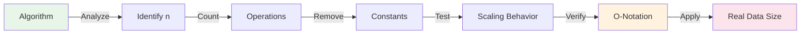

# Big O Complexity — Complete Mastery Guide

Understanding time and space complexity is the **single most important skill** for writing efficient algorithms and making architecture decisions at scale.

## Layer 1: Simple Understanding (Beginner)


### The Analogy: Finding a Contact in Your Phone


Imagine you need to find someone's phone number:

### Step-by-Step


1. **Understand the operation** you're analyzing (search, insert, sort, traversal)
2. **Count inputs** and identify what "n" means (array size, string length, graph vertices)
3. **Track iterations** — if you have nested loops, each level multiplies the count
4. **Identify the dominant term** — only the fastest-growing component matters at scale
5. **Drop constants and lower-order terms** — O(2n + 5) becomes O(n)
6. **Test with concrete numbers** — verify at n=10, n=1000, n=1M to see scaling behavior

### Code Example


```python
# Analyzing complexity with concrete measurements
import time

def measure_complexity(func, input_sizes):
    """Measure actual runtime across different input sizes."""
    results = {}
    for n in input_sizes:
        data = list(range(n))
        start = time.time()
        func(data)
        elapsed = time.time() - start
        results[n] = elapsed
    return results

# Example: analyze three operations
def linear_search(arr):
    """O(n) - single pass"""
    for x in arr:
        if x == 999999:
            return x
    return -1

def nested_operation(arr):
    """O(n²) - nested loops"""
    count = 0
    for i in arr:
        for j in arr:
            if i + j == 999999:
                count += 1
    return count

def binary_search(arr):
    """O(log n) - divide and conquer"""
    left, right = 0, len(arr) - 1
    while left <= right:
        mid = (left + right) // 2
        if arr[mid] == 500000:
            return mid
        elif arr[mid] < 500000:
            left = mid + 1
        else:
            right = mid - 1
    return -1

# Compare growth rates
sizes = [1000, 10000, 100000]
print("Linear O(n):", measure_complexity(linear_search, sizes))
print("Nested O(n²):", measure_complexity(nested_operation, sizes[:2]))  # Only test small sizes
print("Binary O(log n):", measure_complexity(binary_search, sizes))
```

### Real-World Scenario


At Lyft, a naive O(n²) matching algorithm comparing all riders to all drivers crashed when the user base grew from 10K to 1M during surge pricing. Switching to O(n log n) geohashing with sorted lookups reduced matching latency from 5 seconds to 50ms and prevented a complete service outage during peak hours.

### Diagram




---

### Contact Finding Example


Now let's apply this to practice:

- **O(1) - Direct access**: Phone's contact app with instant search ✓ (hash table)
- **O(log n) - Smart search**: Binary search through alphabetically sorted list ✓ (binary search)
- **O(n) - Linear scan**: Checking each contact one by one ✓ (array iteration)
- **O(n²) - Nested search**: Checking each contact against every other contact ✗ (slow for big lists)
- **O(2ⁿ) - Exhaustive**: Trying every possible combination of contacts ✗✗ (impossible for 100+ contacts)

### Why This Matters


When your dataset grows from 1,000 → 1,000,000 items:
- O(1) stays instant
- O(log n) goes from 10 → 20 operations (still instant)
- O(n) goes from 1K → 1M operations (still fast, <1 second)
- O(n²) goes from 1B → 1T operations (minutes to hours ⚠️)
- O(2ⁿ) is impossible to calculate

**Real-world impact:**
- Facebook with O(n²) user matching → serves 3 billion users ❌
- Google with O(log n) search → serves 8 billion searches/day ✅

```mermaid
graph LR
    A["n = 10"] --> B["n = 100"]
    B --> C["n = 1000"]
    C --> D["n = 1M"]
    
    A -->|O(1)| A1["1 op"]
    B -->|O(1)| B1["1 op"]
    C -->|O(1)| C1["1 op"]
    D -->|O(1)| D1["1 op"]
    
    A -->|O(n)| A2["10 ops"]
    B -->|O(n)| B2["100 ops"]
    C -->|O(n)| C2["1K ops"]
    D -->|O(n)| D2["1M ops"]
    
    A -->|O(n²)| A3["100 ops"]
    B -->|O(n²)| B3["10K ops"]
    C -->|O(n²)| C3["1M ops"]
    D -->|O(n²)| D3["1T ops ⚠️"]
    
    style D3 fill:#ff7b72
```

---

## Time Complexity Order


From fastest to slowest:
```
O(1) < O(log n) < O(n) < O(n log n) < O(n²) < O(n³) < O(2ⁿ) < O(n!)
```

---

## Common Complexities Reference


| Notation | Name | Example | Use When |
| ---- | ---- | ---- | ---- |
| **O(1)** | Constant | Hash table lookup | Always ideal |
| **O(log n)** | Logarithmic | Binary search | n < 1 billion |
| **O(n)** | Linear | Array scan | n < 100M |
| **O(n log n)** | Linearithmic | Merge sort | n < 10M |
| **O(n²)** | Quadratic | Nested loops | n < 10,000 |
| **O(2ⁿ)** | Exponential | Subsets | n < 20 |

---

## Data Structure Complexities


### Array


| Operation | Average | Worst | Why |
| ---- | ---- | ---- | ---- |
| Access | O(1) | O(1) | Direct offset |
| Search | O(n) | O(n) | Linear scan |
| Insert | O(n) | O(n) | Shift elements |
| Delete | O(n) | O(n) | Shift elements |

### Hash Table


| Operation | Average | Worst | Note |
| ---- | ---- | ---- | ---- |
| Access | O(1) | O(n) | Hash collision |
| Search | O(1) | O(n) | Hash collision |
| Insert | O(1) | O(n) | Hash collision |

### Binary Search Tree


| Operation | Average | Worst | When Worst |
| ---- | ---- | ---- | ---- |
| Search | O(log n) | O(n) | Skewed tree |
| Insert | O(log n) | O(n) | Sequential data |
| Delete | O(log n) | O(n) | Skewed tree |

### Balanced BST (AVL/Red-Black)


| Operation | Guarantee |
| ---- | ---- |
| Search | O(log n) |
| Insert | O(log n) |
| Delete | O(log n) |

### Heap


| Operation | Complexity |
| ---- | ---- |
| Insert | O(log n) |
| Delete Min | O(log n) |
| Find Min | O(1) |
| Heapify | O(n) |

### Graph (adjacency list)


| Algorithm | Complexity |
| ---- | ---- |
| DFS/BFS | O(V + E) |
| Dijkstra | O((V + E) log V) |
| Bellman-Ford | O(VE) |

---

## Sorting Algorithms


| Algorithm | Best | Average | Worst | Space | Stable |
| ---- | ---- | ---- | ---- | ---- | ---- |
| Bubble | O(n) | O(n²) | O(n²) | O(1) | Yes |
| Insertion | O(n) | O(n²) | O(n²) | O(1) | Yes |
| Merge | O(n log n) | O(n log n) | O(n log n) | O(n) | Yes |
| Quick | O(n log n) | O(n log n) | O(n²) | O(log n) | No |
| Heap | O(n log n) | O(n log n) | O(n log n) | O(1) | No |

---

## Code Examples


### Finding Maximum (Hidden Complexity)


**Python - Linear Search**
```python
def find_max_linear(arr):
    max_val = float('-inf')
    for num in arr:
        max_val = max(max_val, num)  # O(n)
    return max_val
```

**Java - With Caching (O(1) after first pass)**
```java
class MaxTracker {
    private int currentMax = Integer.MIN_VALUE;
    
    public void add(int num) {
        if (num > currentMax) {
            currentMax = num;  // O(1)
        }
    }
    
    public int getMax() {
        return currentMax;  // O(1) - cached!
    }
}
```

### Binary Search (O(log n))


**Python**
```python
def binary_search(arr, target):
    left, right = 0, len(arr) - 1
    
    while left <= right:
        mid = (left + right) // 2
        if arr[mid] == target:
            return mid              # O(log n)
        elif arr[mid] < target:
            left = mid + 1
        else:
            right = mid - 1
    
    return -1
```

### Hidden O(n²) Bug: String Concatenation


**Python - SLOW**
```python
def concatenate_slow(words):
    result = ""
    for word in words:
        result += word  # String concat = O(n)!
                        # Total: O(n²)
    return result
```

**Python - FAST**
```python
def concatenate_fast(words):
    return "".join(words)  # O(n)
```

### Hash Table vs Array Search


**O(n) Linear Search**
```python
numbers = list(range(1_000_000))
999_999 in numbers  # Must scan all! O(n)
```

**O(1) Hash Table**
```python
numbers_set = set(range(1_000_000))
999_999 in numbers_set  # O(1)! 100,000x faster!
```

---

## Common Gotchas


### Mistake 1: Nested Loops


```python
# O(n²) - WRONG for large n
for i in range(n):
    for j in range(n):
        print(i, j)

# O(n log n) - BETTER with sorting
sorted_arr = sorted(arr)      # O(n log n)
for i in range(n):
    if binary_search(sorted_arr, target-arr[i]):  # O(log n)
        print(target found)
```

### Mistake 2: Forgotten Input Size Constraints


```
If n ≤ 100:      O(n²) fine!
If n ≤ 1,000,000: Need O(n) or O(n log n)
If n > 1,000,000: Must be O(n log n) or better
```

### Mistake 3: Recursion Without Memoization


```python
# O(2ⁿ) SLOW
def fib_slow(n):
    if n <= 1: return n
    return fib_slow(n-1) + fib_slow(n-2)  # Exponential!

# O(n) FAST with memoization
def fib_fast(n, memo={}):
    if n in memo: return memo[n]
    if n <= 1: return n
    memo[n] = fib_fast(n-1, memo) + fib_fast(n-2, memo)
    return memo[n]
```

---

## Production Lessons


### Case Study: The O(n²) Bug at Scale


```python
# BROKE at production scale
for user in 1_000_000 users:           # O(n)
    for interest in 10_000 interests:  # O(m)
        if user_likes(user, interest): # O(n²) = 10 billion ops!
```

**Solution**: Use hash tables
```python
for user in users:
    user_interests = set(user.interests)  # O(1) lookup
    matching_interests = [i for i in interests if i.id in user_interests]
```

---

## Interview Questions


**Q: What's the difference between O(n) and O(n²)?**

A: For n=1,000,000:
- O(n) = 1 million operations (instant)
- O(n²) = 1 trillion operations (15+ hours)

**Q: Why drop constants in Big O?**

A: Because they don't matter at scale:
- O(2n) vs O(n): Same growth rate, constant difference disappears
- At n=1M: difference of 2x is irrelevant vs algorithmic choice of O(n) vs O(n²)

**Q: Fix this O(n²) code:**

```python
def has_duplicates(arr):
    for i in range(len(arr)):
        for j in range(i+1, len(arr)):
            if arr[i] == arr[j]:
                return True
    return False
```

**A**: Use a hash set!
```python
def has_duplicates(arr):
    seen = set()
    for num in arr:
        if num in seen: return True
        seen.add(num)
    return False  # O(n)
```

---

## Hands-On Lab


**Task**: Compare sorting algorithms on your machine
```python
import time, random

for n in [100, 1000, 10000]:
    arr = [random.randint(1, 10000) for _ in range(n)]
    
    # Bubble sort - O(n²)
    if n <= 1000:
        start = time.time()
        bubble_sort(arr)
        print(f"Bubble n={n}: {time.time()-start:.4f}s")
    
    # Merge sort - O(n log n)
    start = time.time()
    merge_sort(arr)
    print(f"Merge  n={n}: {time.time()-start:.4f}s")
```

---

## Quick Reference


```
O(1)     ← Instant (hash lookup)
O(log n) ← Binary search
O(n)     ← Linear scan
O(n log n) ← Sorting (best)
O(n²)    ← Nested loops (avoid!)
O(2ⁿ)    ← Exponential (impossible!)
```

**Rule of thumb**: Modern CPU does ~10⁸ ops/sec
- O(n) on 1M items = 0.01 seconds ✓
- O(n²) on 1M items = 10,000 seconds ✗

## Related

- [Readme](18-performance-engineering/README.md)
- [Jvm Performance](18-performance-engineering/jvm-tuning/01-jvm-performance.md)
- [Optimization Patterns](18-performance-engineering/optimization/01-optimization-patterns.md)
- [Profiling Deep Dive](18-performance-engineering/profiling/01-profiling-deep-dive.md)
- [Readme](03-backend/README.md)
- [Goroutines Channels Concurrency](03-backend/go/01-goroutines-channels-concurrency.md)
