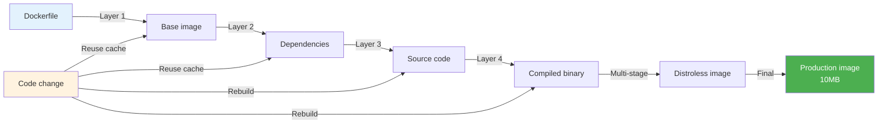

# Docker Commands Cheat Sheet

Docker commands for building images, running containers, multi-stage builds, and production operations.

**Cross-refs**: `06-devops/docker/01-container-basics.md`, `06-devops/docker/02-compose-orchestration.md`, `06-devops/docker/03-docker-networking-security.md`, `06-devops/docker/04-docker-production-operations.md`

## Build


```bash
docker build -t app:v1 .                # Build with tag
docker build -f Dockerfile.prod -t app:v1 .  # Custom Dockerfile
docker build --no-cache -t app:v1 .     # Bypass cache
docker build --target builder -t app .  # Multi-stage (stop at stage)
docker build --build-arg VERSION=1.0 -t app .  # Pass build args
docker build --secret id=ssh_key,src=~/.ssh/id_rsa .  # BuildKit secrets

# Layer optimization
docker build --squash -t app:v1 .       # Squash layers (experimental)
```

### Step-by-Step


1. **Prepare Dockerfile** with FROM, RUN, COPY instructions optimized for layer caching
2. **Choose base image** balancing size, security, and functionality (distroless for production)
3. **Execute build context** — Docker sends files to daemon, builder processes Dockerfile line by line
4. **Cache layers** — Each RUN command creates a layer; unchanged layers reuse cached images
5. **Tag image** with registry/name:version following naming conventions
6. **Optimize layer size** by combining RUN statements, removing build artifacts, using multi-stage builds

### Code Example


```dockerfile
# Optimized Dockerfile with layer caching strategy
FROM golang:1.23-alpine AS builder

# Layer 1: Install dependencies (changes rarely, cached well)
RUN apk add --no-cache git ca-certificates

# Layer 2: Copy go.mod/go.sum (changes when dependencies update)
COPY go.mod go.sum ./
RUN go mod download

# Layer 3: Copy source code (changes frequently during development)
COPY . .

# Layer 4: Build binary
RUN CGO_ENABLED=0 GOOS=linux go build -o app .

# Final stage: minimal distroless image
FROM gcr.io/distroless/base-debian12

# Copy only the binary, reducing image size from 500MB to 10MB
COPY --from=builder /app /app
EXPOSE 8080
CMD ["/app"]
```

```bash
# Build with build arguments and cache busting
docker build \
  --build-arg VERSION=1.2.3 \
  --build-arg BUILD_DATE=$(date -u +'%Y-%m-%dT%H:%M:%SZ') \
  --tag myapp:1.2.3 \
  --tag myapp:latest \
  .

# View layer history to debug cache issues
docker history myapp:latest

# Build and push to registry with BuildKit for better caching
DOCKER_BUILDKIT=1 docker build -t registry.example.com/myapp:v1 .
docker push registry.example.com/myapp:v1
```

### Real-World Scenario


At Uber, a monolithic Go service had a 2GB Docker image due to embedding all dependencies and build tools. By switching to multi-stage builds and distroless base images, they reduced the image to 50MB, decreasing deployment time from 5 minutes to 15 seconds and saving 85% on image registry storage costs. Layer caching also reduced build times from 10 minutes to 2 minutes for incremental changes.

### Build Optimization Diagram




---

## Run


```bash
docker run -d --name web nginx           # Detached
docker run -it --name shell ubuntu bash  # Interactive
docker run --rm -p 8080:80 nginx          # Port mapping + auto-remove
docker run -v /host/path:/container/path nginx   # Bind mount
docker run --volumes-from data-container nginx   # Volume sharing
docker run --restart=always nginx         # Restart policy
docker run --memory=512m --cpus=0.5 nginx         # Resource limits
docker run --log-opt max-size=10m --log-opt max-file=3 nginx  # Log limits
docker run --network host nginx           # Host networking
docker run --read-only --tmpfs /tmp nginx  # Read-only root
```

## Compose


```yaml
# docker-compose.yml
services:
  app:
    build: .
    ports: ["8080:8080"]
    environment:
      - DB_URL=postgres://db:5432
    depends_on:
      - db
    healthcheck:
      test: ["CMD", "curl", "-f", "http://localhost:8080/health"]
      interval: 30s
  db:
    image: postgres:16
    volumes:
      - pgdata:/var/lib/postgresql/data

volumes:
  pgdata:
```

```bash
docker compose up -d                    # Start services
docker compose up -d --scale api=3      # Scale service
docker compose down -v                  # Stop + remove volumes
docker compose logs -f                  # Follow logs
docker compose exec app bash            # Exec into service
docker compose ps                       # List service state
docker compose build --no-cache         # Rebuild without cache
docker compose config                   # Validate + view resolved config
```

## Networking


```bash
docker network ls                       # List networks
docker network create --driver bridge mynet
docker run --network mynet nginx        # Attach container
docker network connect mynet container1  # Attach running container
docker network disconnect mynet container1

# DNS
docker run --dns 8.8.8.8 nginx          # Custom DNS
docker run --dns-search example.com     # Search domain
docker run --hostname app1 --name app1  # Custom hostname
```

## Volumes & Storage


```bash
docker volume create myvol              # Named volume
docker volume ls
docker volume inspect myvol
docker run -v myvol:/data nginx          # Mount volume
docker run --mount type=volume,src=myvol,target=/data nginx  # Modern syntax
docker run --mount type=bind,src=/host,target=/container nginx  # Bind

# Cleanup
docker volume prune                     # Remove unused volumes
docker system prune -a --volumes        # Full cleanup (careful!)
```

## Multi-Stage Build


```dockerfile
# Dockerfile
FROM golang:1.23 AS builder
WORKDIR /app
COPY go.mod go.sum ./
RUN go mod download
COPY . .
RUN CGO_ENABLED=0 go build -ldflags="-s -w" -o app .

FROM alpine:3.20
RUN apk add --no-cache ca-certificates tzdata
COPY --from=builder /app/app /app
COPY --from=builder /etc/ssl/certs /etc/ssl/certs
USER 1000
EXPOSE 8080
ENTRYPOINT ["/app"]
```

```bash
# Distroless base
FROM gcr.io/distroless/static:nonroot
COPY --from=builder /app/app /app
```

## Debugging


```bash
docker logs -f container_name           # Follow logs
docker logs --tail 100 container_name   # Last 100 lines
docker logs --since 5m container_name   # Last 5 minutes
docker logs -t container_name           # With timestamps

docker exec -it container_name bash     # Interactive shell
docker exec container_name cat /var/log/app.log

docker inspect container_name           # Full container metadata
docker inspect -f '{{.NetworkSettings.IPAddress}}' container_name

docker stats                            # Live resource usage
docker stats --no-stream               # Single snapshot
docker top container_name              # Running processes

docker container diff container_name    # Filesystem changes
docker cp container:/path /local/path   # Copy from container
docker cp /local/path container:/path   # Copy to container
```

## Production Operations


```bash
# Health checks (built into Dockerfile)
HEALTHCHECK --interval=30s --timeout=3s --retries=3 \
  CMD curl -f http://localhost:8080/health || exit 1

# Restart policies
docker run --restart=no                  # Default
docker run --restart=on-failure:5        # Restart max 5 times on crash
docker run --restart=always              # Always restart
docker run --restart=unless-stopped      # Always unless manually stopped

# Resource constraints
docker update --memory=1g --cpus=1 container_name  # Adjust running container
docker run --pids-limit=100 nginx        # Limit fork bomb risk
docker run --ulimit nofile=65536:65536   # FD limits

# Graceful shutdown
docker stop --time=30 container_name     # Wait 30s for SIGTERM
docker kill -s SIGUSR1 container_name    # Custom signal
docker wait container_name               # Block until exit
```

## System Cleanup


```bash
docker system df                        # Disk usage
docker image prune                      # Remove dangling images
docker image prune -a                   # Remove all unused images
docker container prune                  # Remove stopped containers
docker network prune                    # Remove unused networks
docker system prune -a -f --volumes     # Nuclear cleanup
```

## Image Operations


```bash
docker images                           # List images
docker rmi image:v1                     # Remove image
docker tag app:v1 reg.example.com/app:v1  # Tag for registry
docker push reg.example.com/app:v1      # Push to registry
docker pull nginx:alpine                # Pull image
docker save app:v1 | gzip > app.tar.gz  # Export image
gunzip -c app.tar.gz | docker load      # Import image
docker history app:v1                   # Layer history
```

## Anti-Patterns


| Anti-Pattern | Why It Hurts | Fix |
|-------------|-------------|-----|
| `:latest` tag | Unpredictable deployments | Pin version: `app:v1.2.3` |
| Fat images | Slow deploys, big attack surface | Multi-stage, distroless |
| Running as root | Security risk | `USER 1000` in Dockerfile |
| No healthcheck | Blind to dead containers | Add `HEALTHCHECK` |
| Storing secrets in image | Credential leak | BuildKit secrets / Docker secrets |
| One container = MySQL+app | Anti-pattern | Separate containers per concern |
| No restart policy | Crash kills production | `--restart=unless-stopped` |
| `docker commit` for changes | Untraceable, unbuildable | Fix Dockerfile instead |
| Overmounted volumes | Leaks host FS | Named volumes for data |

## Troubleshooting Sequence


```bash
# Container won't start
docker logs $CONTAINER               # Check logs
docker inspect $CONTAINER | jq .State  # Check exit code
docker run --rm -it $IMAGE sh        # Test interactively

# Container running but not responding
docker exec -it $CONTAINER sh        # Shell in
docker stats $CONTAINER              # Resource usage
docker inspect $CONTAINER | jq .NetworkSettings  # Network config
curl http://$(docker inspect -f '{{range .NetworkSettings.Networks}}{{.IPAddress}}{{end}}' $CONTAINER):8080/health

# Build failures
docker build --no-cache              # Bypass cache
docker build --progress=plain        # Verbose output
docker system df                     # Check disk space
```

## Container Lifecycle Commands

| Action | Command |
|---|---|
| Create & start | `docker run -d --name myapp nginx:latest` |
| Start existing | `docker start myapp` |
| Stop graceful | `docker stop -t 30 myapp` |
| Force stop | `docker kill myapp` |
| Restart | `docker restart myapp` |
| Pause | `docker pause myapp` |
| Unpause | `docker unpause myapp` |
| Remove | `docker rm -f myapp` |
| Execute in running | `docker exec -it myapp bash` |
| Logs | `docker logs -f --tail 100 myapp` |

## Dockerfile Best Practices

```dockerfile
# Multi-stage build — keep images small
FROM golang:1.21 AS builder
WORKDIR /app
COPY go.mod go.sum ./
RUN go mod download
COPY . .
RUN CGO_ENABLED=0 go build -o /app/server

FROM alpine:3.19
RUN apk add --no-cache ca-certificates tzdata
COPY --from=builder /app/server /server
EXPOSE 8080
USER nobody
ENTRYPOINT ["/server"]
```

## Resource Limits

| Flag | Example | Effect |
|---|---|---|
| `--memory` | `--memory=512m` | Max 512MB RAM |
| `--memory-reservation` | `--memory-reservation=256m` | Soft limit for scheduling |
| `--cpus` | `--cpus=1.5` | Max 1.5 CPU cores |
| `--pids-limit` | `--pids-limit=100` | Max 100 processes |
| `--restart` | `--restart=on-failure:3` | Auto-restart on crash |
