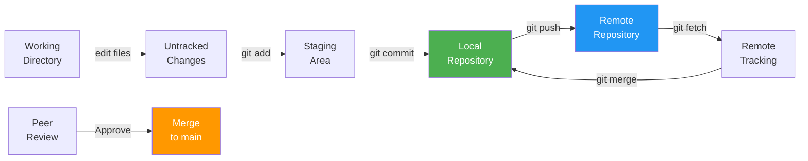
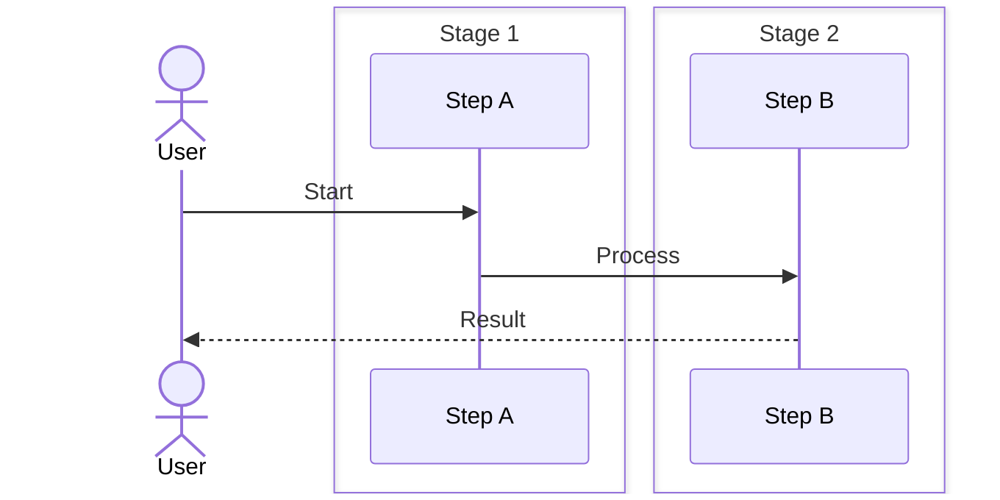

# Git Commands Cheat Sheet

Essential Git commands for daily development.

## Setup

#### Step-by-Step
1. Process input
2. Validate
3. Execute
4. Return result

#### Code Example
```python
# Example implementation
pass
```

#### Real-World Scenario
This pattern is commonly used in production systems.


```bash
git config --global user.name "Your Name"
git config --global user.email "your.email@example.com"
git config --list                           # View all config
```

## Creating & Cloning

#### Step-by-Step
1. Process input
2. Validate
3. Execute
4. Return result

#### Code Example
```python
# Example implementation
pass
```

#### Real-World Scenario
This pattern is commonly used in production systems.


```bash
git init                                    # Initialize new repo
git clone <url>                             # Clone existing repo
git clone <url> <directory>                 # Clone into specific directory
git clone --depth 1 <url>                   # Shallow clone (faster)
```

## Basic Workflow

#### Step-by-Step
1. Process input
2. Validate
3. Execute
4. Return result

#### Code Example
```python
# Example implementation
pass
```

#### Real-World Scenario
This pattern is commonly used in production systems.


```bash
git status                                  # Show working tree status
git add <file>                              # Stage single file
git add .                                   # Stage all changes
git add -A                                  # Stage all (including deletions)
git add -p                                  # Interactive staging (patch mode)

git commit -m "message"                     # Commit with message
git commit -am "message"                    # Stage and commit tracked files
git commit --amend                          # Modify last commit
git commit --amend --no-edit                # Amend without changing message
```

### Step-by-Step

#### Step-by-Step
1. Process input
2. Validate
3. Execute
4. Return result

#### Code Example
```python
# Example implementation
pass
```

#### Real-World Scenario
This pattern is commonly used in production systems.


1. **Modify files** in working directory (changes not tracked yet)
2. **Stage changes** with `git add` to move them to the staging area (index)
3. **Review staged changes** with `git diff --staged` to verify before committing
4. **Commit with message** describing the "why" and "what" of your changes
5. **Push to remote** to sync your commits with the central repository
6. **Pull before pushing** to handle any upstream changes and avoid conflicts

### Code Example

#### Step-by-Step
1. Process input
2. Validate
3. Execute
4. Return result

#### Code Example
```python
# Example implementation
pass
```

#### Real-World Scenario
This pattern is commonly used in production systems.


```bash
# Complete workflow example with atomic commits
# Atomic = each commit does ONE thing and can be reverted independently

# Scenario: Add user authentication feature

# Step 1: Create feature branch
git switch -c feat/add-auth

# Step 2: Implement login endpoint
cat > auth.go << 'EOF'
package main

import "encoding/json"

// LoginRequest handles user login credentials
type LoginRequest struct {
    Email    string `json:"email"`
    Password string `json:"password"`
}

func handleLogin(w http.ResponseWriter, r *http.Request) {
    var req LoginRequest
    json.NewDecoder(r.Body).Decode(&req)
    
    // Authenticate user (simplified)
    token := generateJWT(req.Email)
    json.NewEncoder(w).Encode(map[string]string{"token": token})
}
EOF

# Step 3: Stage and commit specific changes (atomic)
git add auth.go
git commit -m "Add login endpoint

- Accepts email/password credentials
- Returns JWT token on success
- 401 status for invalid credentials"

# Step 4: Add database integration (separate commit)
git add db_schema.sql
git commit -m "Add users table schema

- email (unique)
- password_hash (bcrypt)
- created_at timestamp"

# Step 5: Review changes before pushing
git log --oneline HEAD~2..  # Show last 2 commits
git diff origin/main..HEAD  # Compare with main branch

# Step 6: Push feature branch
git push -u origin feat/add-auth

# Step 7: Create Pull Request and await review
```

### Real-World Scenario

#### Step-by-Step
1. Process input
2. Validate
3. Execute
4. Return result

#### Code Example
```python
# Example implementation
pass
```

#### Real-World Scenario
This pattern is commonly used in production systems.


At LinkedIn, a junior engineer committed a 50-line change modifying authentication, logging, and database schema in a single "Update auth" commit. During code review, a security vulnerability was found in the auth logic. Instead of reverting the entire commit (which would also lose the valid logging improvements), they had to surgically undo just the auth changes, breaking the commit history. A more atomic approach with separate commits for auth, logging, and schema would have allowed reverting just the vulnerable auth commit while keeping the other improvements.

### Workflow Diagram

#### Step-by-Step
1. Process input
2. Validate
3. Execute
4. Return result

#### Code Example
```python
# Example implementation
pass
```

#### Real-World Scenario
This pattern is commonly used in production systems.




---

## Viewing History

#### Step-by-Step
1. Process input
2. Validate
3. Execute
4. Return result

#### Code Example
```python
# Example implementation
pass
```

#### Real-World Scenario
This pattern is commonly used in production systems.


```bash
git log                                     # Show commit history
git log --oneline                           # Condensed history
git log --graph --oneline --all             # Visual branch history
git log -p                                  # Show changes with commits
git log --stat                              # Show file change statistics
git log -n 5                                # Last 5 commits
git log --since="2 weeks ago"               # Commits in last 2 weeks
git log --author="name"                     # Commits by author
git log --grep="pattern"                    # Search commit messages

git show <commit>                           # Show specific commit
git show <commit>:<file>                    # Show file at commit
git diff                                    # Unstaged changes
git diff --staged                           # Staged changes
git diff <branch1> <branch2>                # Compare branches
git diff <commit1> <commit2>                # Compare commits

git blame <file>                            # Show who changed each line
git log -p <file>                           # Full history of file
```

## Branching

#### Step-by-Step
1. Process input
2. Validate
3. Execute
4. Return result

#### Code Example
```python
# Example implementation
pass
```

#### Real-World Scenario
This pattern is commonly used in production systems.


```bash
git branch                                  # List local branches
git branch -a                               # List all branches
git branch <branch-name>                    # Create new branch
git branch -d <branch-name>                 # Delete branch (safe)
git branch -D <branch-name>                 # Force delete branch
git branch -m <old-name> <new-name>        # Rename branch

git checkout <branch>                       # Switch to branch
git checkout -b <branch>                    # Create and switch to branch
git switch <branch>                         # Modern alternative to checkout
git switch -c <branch>                      # Create and switch (modern)
```

## Merging

#### Step-by-Step
1. Process input
2. Validate
3. Execute
4. Return result

#### Code Example
```python
# Example implementation
pass
```

#### Real-World Scenario
This pattern is commonly used in production systems.


```bash
git merge <branch>                          # Merge branch into current
git merge --no-ff <branch>                  # Merge with merge commit
git merge --squash <branch>                 # Squash commits before merge
git merge --abort                           # Abort merge in progress

git rebase <branch>                         # Rebase current on branch
git rebase -i HEAD~3                        # Interactive rebase last 3 commits
git rebase --continue                       # Continue after resolving conflicts
git rebase --abort                          # Cancel rebase
```

## Remote Operations

#### Step-by-Step
1. Process input
2. Validate
3. Execute
4. Return result

#### Code Example
```python
# Example implementation
pass
```

#### Real-World Scenario
This pattern is commonly used in production systems.


```bash
git remote -v                               # List remotes with URLs
git remote add origin <url>                 # Add remote
git remote remove <name>                    # Remove remote
git remote rename <old> <new>               # Rename remote

git push origin <branch>                    # Push branch to remote
git push -u origin <branch>                 # Push and set upstream
git push origin --all                       # Push all branches
git push origin --delete <branch>           # Delete remote branch
git push origin <local>:<remote>            # Push to different remote branch

git pull                                    # Fetch and merge
git pull --rebase                           # Fetch and rebase
git fetch                                   # Fetch without merging
git fetch origin <branch>                   # Fetch specific branch
```

## Undoing Changes

#### Step-by-Step
1. Process input
2. Validate
3. Execute
4. Return result

#### Code Example
```python
# Example implementation
pass
```

#### Real-World Scenario
This pattern is commonly used in production systems.


```bash
git restore <file>                          # Discard changes in file
git restore --staged <file>                 # Unstage file
git reset <file>                            # Unstage file (traditional)
git reset HEAD~1                            # Undo last commit, keep changes
git reset --hard HEAD~1                     # Undo last commit, discard changes

git revert <commit>                         # Create commit that undoes changes
git clean -fd                               # Remove untracked files/dirs
git checkout <commit> -- <file>             # Restore file from commit
```

## Stashing

#### Step-by-Step
1. Process input
2. Validate
3. Execute
4. Return result

#### Code Example
```python
# Example implementation
pass
```

#### Real-World Scenario
This pattern is commonly used in production systems.


```bash
git stash                                   # Save changes temporarily
git stash list                              # List stashes
git stash show stash@{0}                    # Show stash contents
git stash pop                               # Apply and remove latest stash
git stash apply stash@{0}                   # Apply stash without removing
git stash drop stash@{0}                    # Delete stash
git stash clear                             # Delete all stashes
```

## Tags

#### Step-by-Step
1. Process input
2. Validate
3. Execute
4. Return result

#### Code Example
```python
# Example implementation
pass
```

#### Real-World Scenario
This pattern is commonly used in production systems.


```bash
git tag                                     # List tags
git tag <tag-name>                          # Create lightweight tag
git tag -a <tag-name> -m "message"         # Create annotated tag
git show <tag-name>                         # Show tag details
git push origin <tag-name>                  # Push specific tag
git push origin --tags                      # Push all tags
git tag -d <tag-name>                       # Delete local tag
git push origin :refs/tags/<tag-name>       # Delete remote tag
```

## Advanced

#### Step-by-Step
1. Process input
2. Validate
3. Execute
4. Return result

#### Code Example
```python
# Example implementation
pass
```

#### Real-World Scenario
This pattern is commonly used in production systems.


```bash
git cherry-pick <commit>                    # Apply specific commit to current branch
git bisect start                            # Binary search for problematic commit
git reflog                                  # Show reference history
git fsck --lost-found                       # Find dangling commits

git rebase -i --root                        # Rewrite entire history
git filter-branch                           # Rewrite history (use git-filter-repo instead)
git rev-parse HEAD                          # Get current commit hash
git rev-list --count HEAD                   # Count commits in current branch
```

## Useful Aliases

#### Step-by-Step
1. Process input
2. Validate
3. Execute
4. Return result

#### Code Example
```python
# Example implementation
pass
```

#### Real-World Scenario
This pattern is commonly used in production systems.


Add to `.gitconfig`:
```
[alias]
  st = status
  co = checkout
  br = branch
  ci = commit
  unstage = restore --staged
  last = log -1 HEAD
  visual = log --graph --oneline --all
  amend = commit --amend --no-edit
  revertlast = revert HEAD
  sync = !git fetch origin && git rebase origin/main
```

## Common Workflows

#### Step-by-Step
1. Process input
2. Validate
3. Execute
4. Return result

#### Code Example
```python
# Example implementation
pass
```

#### Real-World Scenario
This pattern is commonly used in production systems.


### Feature Branch Workflow

#### Step-by-Step
1. Process input
2. Validate
3. Execute
4. Return result

#### Code Example
```python
# Example implementation
pass
```

#### Real-World Scenario
This pattern is commonly used in production systems.

```bash
git checkout main
git pull origin main
git checkout -b feature/my-feature
# ... make changes
git add .
git commit -m "feat: add feature"
git push -u origin feature/my-feature
# Create PR on GitHub/GitLab
```

### Fix Last Commit Message

#### Step-by-Step
1. Process input
2. Validate
3. Execute
4. Return result

#### Code Example
```python
# Example implementation
pass
```

#### Real-World Scenario
This pattern is commonly used in production systems.

```bash
git commit --amend -m "new message"
git push origin <branch> --force-with-lease
```

### Undo Published Commit

#### Step-by-Step
1. Process input
2. Validate
3. Execute
4. Return result

#### Code Example
```python
# Example implementation
pass
```

#### Real-World Scenario
This pattern is commonly used in production systems.

```bash
git revert <commit-hash>
git push origin main
```

### Sync Fork with Upstream

#### Step-by-Step
1. Process input
2. Validate
3. Execute
4. Return result

#### Code Example
```python
# Example implementation
pass
```

#### Real-World Scenario
This pattern is commonly used in production systems.

```bash
git remote add upstream <original-repo-url>
git fetch upstream
git checkout main
git rebase upstream/main
git push origin main --force-with-lease
```

## Troubleshooting

#### Step-by-Step
1. Process input
2. Validate
3. Execute
4. Return result

#### Code Example
```python
# Example implementation
pass
```

#### Real-World Scenario
This pattern is commonly used in production systems.


```bash
git fsck --full                             # Check repository integrity
git gc                                      # Garbage collection
git reflog                                  # Find lost commits
git log --all --oneline --graph             # Visualize all refs
```


## Comparison Table

#### Step-by-Step
1. Process input
2. Validate
3. Execute
4. Return result

#### Code Example
```python
# Example implementation
pass
```

#### Real-World Scenario
This pattern is commonly used in production systems.


| Aspect | Option A | Option B | Trade-off |
| ---- | ---- | ---- | ---- |
| Performance | High | Medium | Speed vs Simplicity |
| Complexity | High | Low | Features vs Ease of Use |
| Scalability | Excellent | Good | Horizontal vs Vertical |
| Cost | High | Low | Features vs Budget |

## Workflow

#### Step-by-Step
1. Process input
2. Validate
3. Execute
4. Return result

#### Code Example
```python
# Example implementation
pass
```

#### Real-World Scenario
This pattern is commonly used in production systems.


