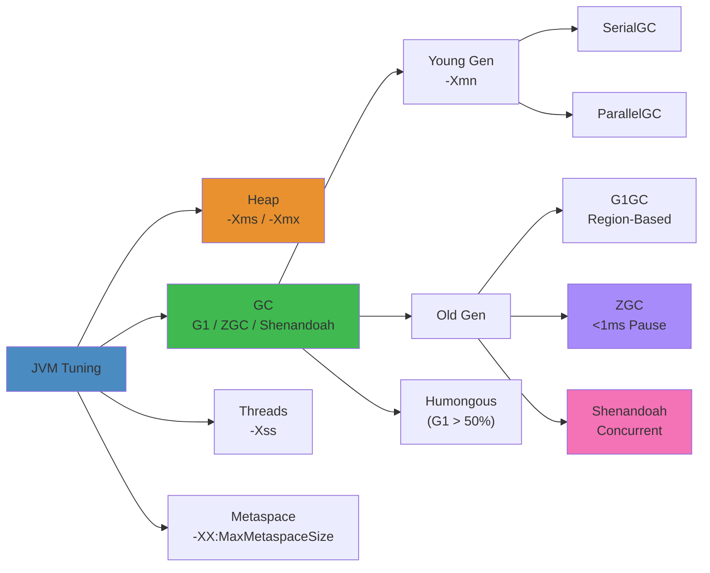

# JVM Tuning Cheat Sheet




JVM tuning for production Java applications: GC algorithms, flags, heap analysis, thread dumps, and flight recorder.

**Cross-refs**: `18-performance-engineering/jvm-tuning/01-jvm-performance.md`, `18-performance-engineering/profiling/01-profiling-deep-dive.md`

## Quick Diagnostics


```bash
# Running JVM
jcmd <pid> VM.version
jcmd <pid> VM.flags
jcmd <pid> VM.uptime
jcmd <pid> GC.heap_info
jcmd <pid> Thread.print
jcmd <pid> VM.system_properties

# Memory
jcmd <pid> GC.heap_dump /tmp/heap.hprof
jmap -dump:live,format=b,file=/tmp/heap.hprof <pid>
jmap -heap <pid>
jstat -gc <pid> 1s                  # GC stats every second
jstat -gcutil <pid> 1s              # GC utilization summary

# Threads
jstack <pid>                        # Thread dump
jstack -l <pid>                     # With lock info
jcmd <pid> Thread.print             # Same via jcmd
```

## GC Algorithms


| GC | Flags (JDK 17+) | Pause | Throughput | Use Case |
|----|----------------|-------|-----------|----------|
| Serial | `-XX:+UseSerialGC` | High | Low | Single core, small heap |
| Parallel | `-XX:+UseParallelGC` | Medium | High | Batch, throughput-oriented |
| G1 | `-XX:+UseG1GC` (default) | Low | High | Large heap, balanced |
| ZGC | `-XX:+UseZGC` | ~1ms | Medium | Sub-millisecond pauses |
| Shenandoah | `-XX:+UseShenandoahGC` | ~1ms | Medium | Low-pause, concurrent |
| Epsilon | `-XX:+UseEpsilonGC` | None | Max | No GC (short-lived tasks) |

## Critical JVM Flags


```bash
# Heap sizing
-Xms8g                        # Initial heap (match Xmx to avoid resizing)
-Xmx8g                        # Max heap
-XX:MetaspaceSize=256m        # Class metadata
-XX:MaxMetaspaceSize=256m

# GC tuning (G1 example)
-XX:+UseG1GC
-XX:MaxGCPauseMillis=100       # Target pause time
-XX:G1HeapRegionSize=4m        # Region size (1-32MB)
-XX:G1NewSizePercent=5         # Initial young gen
-XX:G1MaxNewSizePercent=60     # Max young gen
-XX:InitiatingHeapOccupancyPercent=45  # G1 cycle trigger
-XX:ConcGCThreads=4            # Concurrent threads

# Diagnostic
-XX:+PrintGCDetails
-XX:+PrintGCDateStamps
-Xlog:gc*=info:file=gc.log:time,uptime,level,tags
-XX:+HeapDumpOnOutOfMemoryError
-XX:HeapDumpPath=/tmp/dumps/
-XX:+PrintClassHistogram
-XX:+UnlockDiagnosticVMOptions
-XX:+PrintSafepointStatistics
```

## Troubleshooting OOM


```bash
# Enable heap dump on OOM
# -XX:+HeapDumpOnOutOfMemoryError -XX:HeapDumpPath=/tmp

# Analyze heap dump
jhat /tmp/heap.hprof                 # Browser viewer (deprecated)
jvisualvm --openfd /tmp/heap.hprof   # GUI (JDK bundled)

# CLI heap analysis
jcmd <pid> GC.class_histogram        # Live class histogram
jmap -histo:live <pid>               # Live objects histogram

# Using Eclipse MAT CLI
./ParseHeapDump.sh /tmp/heap.hprof org.eclipse.mat.api:top_components
```

## Flight Recorder (JFR)


```bash
# Start recording
jcmd <pid> JFR.start duration=60s filename=/tmp/recording.jfr

# Start after 60s delay with 120s recording
jcmd <pid> JFR.start delay=60s duration=120s filename=/tmp/recording.jfr settings=profile

# Dump recording
jcmd <pid> JFR.dump filename=/tmp/recording.jfr

# Check status
jcmd <pid> JFR.check

# Stop recording
jcmd <pid> JFR.stop name=recording-1

# Analyze recording
jfr print --events --categories CPU /tmp/recording.jfr
jfr summary /tmp/recording.jfr
jfr flush /tmp/recording.jfr         # Force write buffers
```

## Thread Dump Analysis


```bash
# Take thread dump
jstack <pid> > /tmp/threads.dump
jcmd <pid> Thread.print
kill -3 <pid>                        # Sends to stdout (check -Xlog)
```

```bash
# Look for in thread dump
# - BLOCKED: Contending for lock
# - WAITING: Waiting on condition/monitor
# - RUNNABLE: Actively executing
# - Deadlock: Found one Java-level deadlock

# Thread dump patterns
"http-nio-8080-exec-12" #32 prio=5 tid=0x...
   java.lang.Thread.State: BLOCKED (on object monitor)
   ...

"GC task thread#0" #6
   java.lang.Thread.State: RUNNABLE
   ...
```

## jcmd Tool Reference


| Command | Purpose |
|---------|---------|
| `jcmd <pid> VM.version` | JVM version |
| `jcmd <pid> VM.flags` | All JVM flags |
| `jcmd <pid> GC.heap_info` | Heap regions, generations |
| `jcmd <pid> GC.class_histogram` | Class histogram |
| `jcmd <pid> Thread.print` | Thread dump |
| `jcmd <pid> GC.heap_dump /tmp/h.hprof` | Heap dump |
| `jcmd <pid> VM.native_memory summary` | NMT summary |
| `jcmd <pid> VM.uptime` | Uptime |
| `jcmd <pid> VM.system_properties` | System properties |
| `jcmd <pid> PerfCounter.print` | Internal performance counters |
| `jcmd <pid> GC.run` | Request GC |
| `jcmd <pid> GC.run_finalization` | Run finalization |

## Production Debugging Workflow


```bash
# Step 1: Take thread dump (multiple, 5s apart)
jstack <pid> > thread1.dump && sleep 5 && jstack <pid> > thread2.dump
grep -c "BLOCKED\|WAITING" thread*.dump   # Check threads stuck

# Step 2: Check GC
jstat -gcutil <pid> 2s 10                # Monitor GC
jcmd <pid> GC.heap_info                  # Check region usage

# Step 3: JFR if available
jcmd <pid> JFR.start name=investigation duration=120s settings=profile

# Step 4: Heap analysis
jcmd <pid> GC.class_histogram | head -20   # Top classes by count
jmap -histo:live <pid> | head -20          # Live objects

# Step 5: Native memory
jcmd <pid> VM.native_memory summary baseline
jcmd <pid> VM.native_memory summary.diff
```

## Anti-Patterns


| Anti-Pattern | Why It Hurts | Fix |
|-------------|-------------|-----|
| `-Xms` != `-Xmx` | Heap resizing pauses | Set equal in containers |
| Cranking `MaxGCPauseMillis` too low | Throughput tanked | Balance 50-200ms target |
| No heap dump setup | Blind OOM debugging | `-XX:+HeapDumpOnOutOfMemoryError` |
| `-XX:+UseParallelGC` for low-latency | Long STW pauses | Use G1, ZGC, Shenandoah |
| Huge `PermSize` / `MaxPermSize` | Wasted memory | Use Metaspace in JDK 8+ |
| Ignoring `jcmd` | Debugging with outdated tools | `jcmd` replaces most `jstack`/`jmap` |
| Not sizing young gen | Frequent minor GC / promotion failures | `-Xmn` or G1's new size flags |
| System.gc() calls | Unexpected full STW | Remove or `-XX:+DisableExplicitGC` |
| Over-allocating heap (>RAM) | Swapping, OOM killed | Leave 20-30% for OS |

## Key Metrics to Watch


```bash
# GC metrics
jstat -gcutil <pid> 1s
# S0  S1  E   O   M   CCS  YGC  YGCT  FGC  FGCT  CGC  CGCT
#  0  58  12  45  95  92   142  0.82   3   1.24   2    0.5

# S0/S1: Survivor space %
# E: Eden %
# O: Old gen %
# YGC: Young GC count, YGCT: young GC time
# FGC: Full GC count, FGCT: full GC time
# CGC: Concurrent GC cycles

# Pause times
jstat -gccause <pid> 1s
```

## GC Algorithm Comparison

| GC | Pause Time | Throughput | Heap Requirement | Java Version | Best For |
|---|---|---|---|---|---|
| **Serial** | High (STW) | Lowest | <100 MB | All | Single-threaded, small heaps |
| **Parallel** | High (STW) | Highest | <4 GB | All | Batch processing, high throughput |
| **G1GC** | Low (~10ms) | High | >4 GB | 9+ | Default server GC, balanced |
| **ZGC** | <1ms | Medium | >8 GB | 15+ | Low-latency, very large heaps |
| **Shenandoah** | <1ms | Medium | >4 GB | 15+ | Low-pause, concurrent compaction |
| **Epsilon** | N/A (no GC) | Max (no overhead) | Any | 11+ | Short-lived tasks, testing |

## Common JVM Flags by Use-Case

| Use Case | Key Flags |
|---|---|
| **Low Latency** | `-XX:+UseZGC -Xms16g -Xmx16g -XX:ZAllocationSpikeTolerance=2.0` |
| **High Throughput** | `-XX:+UseParallelGC -XX:ParallelGCThreads=4 -XX:+AggressiveOpts` |
| **Memory-Constrained** | `-XX:+UseG1GC -Xms256m -Xmx256m -XX:MaxGCPauseMillis=100` |
| **Debugging** | `-XX:+PrintGCDetails -Xlog:gc* -XX:+FlightRecorder -XX:StartFlightRecording=filename=rec.jfr` |

## Heap Structure by GC

| Collector | Young Gen | Old Gen | Special Regions |
|---|---|---|---|
| Parallel | Contiguous Eden + Survivor | Contiguous | None |
| G1 | Multiple regions (1-32MB each) | Regions | Humongous (>50% region) |
| ZGC | Multi-mapped | Multi-mapped | Colored pointers |
| Shenandoah | Regions | Regions | Brooks pointers |

## Related

- [Readme](18-performance-engineering/README.md)
- [Jvm Performance](18-performance-engineering/jvm-tuning/01-jvm-performance.md)
- [Optimization Patterns](18-performance-engineering/optimization/01-optimization-patterns.md)
- [Profiling Deep Dive](18-performance-engineering/profiling/01-profiling-deep-dive.md)
- [Readme](03-backend/README.md)
- [Goroutines Channels Concurrency](03-backend/go/01-goroutines-channels-concurrency.md)
