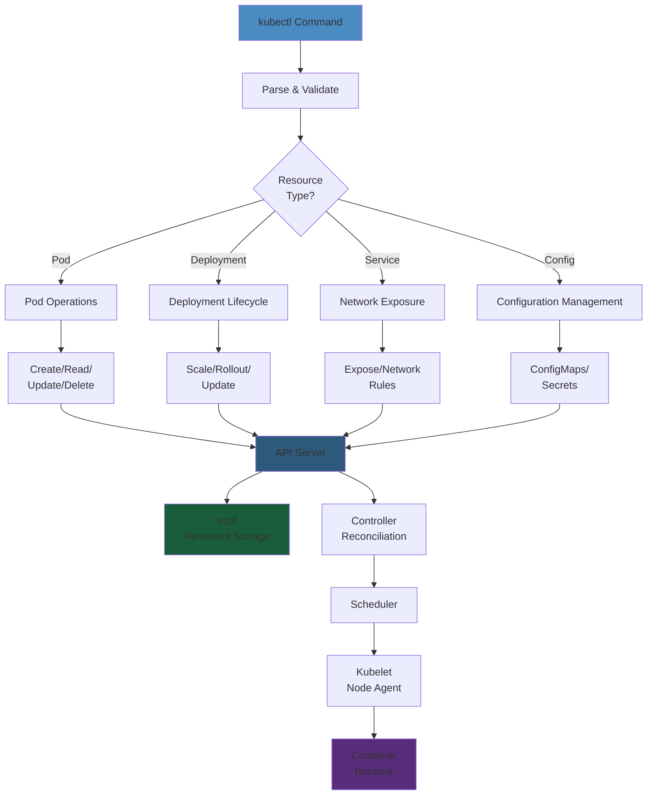
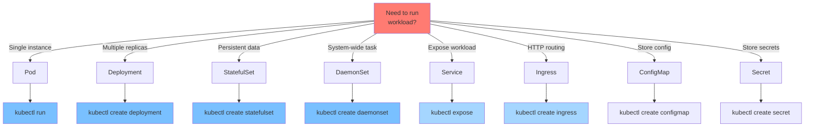
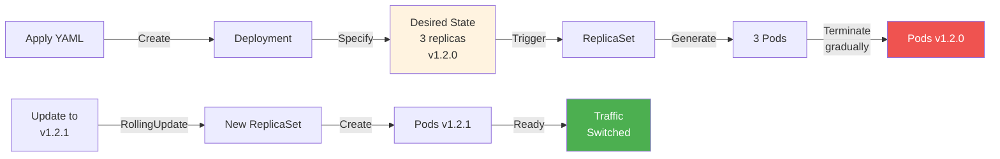
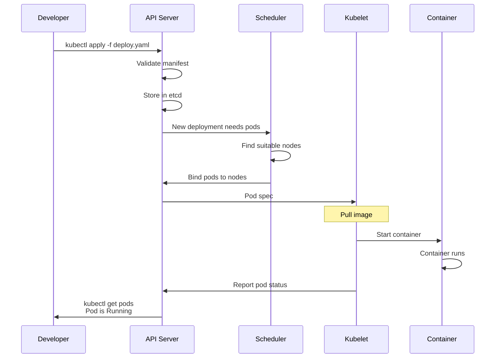

# Kubectl Commands Cheat Sheet

Essential kubectl commands for Kubernetes cluster operations.

## Kubectl Workflow Architecture




## Resource Decision Tree




## Common Operations Comparison


| Task | Command | When to Use | Output |
| -------- | -------- | -------- | -------- |
| View Resources | `kubectl get pods` | Check running pods | Pod list, status |
| Detailed Info | `kubectl describe pod <name>` | Troubleshoot issues | Full spec + events |
| Export Config | `kubectl get pod <name> -o yaml` | Version control | Pod manifest YAML |
| Watch Changes | `kubectl get pods --watch` | Monitor real-time | Live status updates |
| Filter Results | `kubectl get pods -l app=web` | Find resources | Filtered list |
| Scale Service | `kubectl scale deploy <name> --replicas=5` | Increase capacity | Deployment scaled |
| Update Image | `kubectl set image deploy/<name> container=img:v2` | Deploy version | Pods recreated |
| View Logs | `kubectl logs <pod-name> -f` | Debug behavior | Application logs |
| Execute Command | `kubectl exec -it <pod> -- bash` | Run in pod | Interactive shell |

### Step-by-Step


1. **Install kubectl** and configure kubeconfig with cluster credentials
2. **Verify cluster connectivity** by running `kubectl cluster-info` to confirm API server access
3. **Create/Apply manifests** using `kubectl apply -f deployment.yaml` to declare desired state
4. **Monitor deployment** with `kubectl get pods --watch` to track pod startup and readiness
5. **Troubleshoot issues** using `kubectl describe pod` to examine events and logs
6. **Update running services** with `kubectl set image` for rolling updates, checking `kubectl rollout status` for progress

### Code Example


```bash
# End-to-end Kubernetes deployment workflow
# Deploy a web application with database backend

# Step 1: Create namespace for isolation
kubectl create namespace production
kubectl config set-context --current --namespace=production

# Step 2: Create ConfigMap for application configuration
kubectl create configmap app-config \
  --from-literal=LOG_LEVEL=info \
  --from-literal=API_PORT=8080

# Step 3: Create Secret for database credentials
kubectl create secret generic db-credentials \
  --from-literal=DB_USER=postgres \
  --from-literal=DB_PASSWORD=$(openssl rand -base64 32)

# Step 4: Deploy PostgreSQL StatefulSet
cat > postgres.yaml << 'EOF'
apiVersion: apps/v1
kind: StatefulSet
metadata:
  name: postgres
spec:
  serviceName: postgres
  replicas: 1
  selector:
    matchLabels:
      app: postgres
  template:
    metadata:
      labels:
        app: postgres
    spec:
      containers:
      - name: postgres
        image: postgres:16
        ports:
        - containerPort: 5432
        env:
        - name: POSTGRES_USER
          valueFrom:
            secretKeyRef:
              name: db-credentials
              key: DB_USER
        - name: POSTGRES_PASSWORD
          valueFrom:
            secretKeyRef:
              name: db-credentials
              key: DB_PASSWORD
        volumeMounts:
        - name: pgdata
          mountPath: /var/lib/postgresql/data
  volumeClaimTemplates:
  - metadata:
      name: pgdata
    spec:
      accessModes: ["ReadWriteOnce"]
      resources:
        requests:
          storage: 10Gi
EOF

kubectl apply -f postgres.yaml

# Step 5: Deploy web application Deployment
cat > app.yaml << 'EOF'
apiVersion: apps/v1
kind: Deployment
metadata:
  name: web-app
spec:
  replicas: 3
  strategy:
    type: RollingUpdate
    rollingUpdate:
      maxSurge: 1
      maxUnavailable: 0
  selector:
    matchLabels:
      app: web-app
  template:
    metadata:
      labels:
        app: web-app
    spec:
      containers:
      - name: app
        image: myregistry.azurecr.io/web-app:v1.2.0
        ports:
        - containerPort: 8080
        envFrom:
        - configMapRef:
            name: app-config
        env:
        - name: DATABASE_URL
          value: "postgresql://postgres.production.svc.cluster.local:5432/mydb"
        livenessProbe:
          httpGet:
            path: /health
            port: 8080
          initialDelaySeconds: 10
          periodSeconds: 10
        readinessProbe:
          httpGet:
            path: /ready
            port: 8080
          initialDelaySeconds: 5
          periodSeconds: 5
        resources:
          requests:
            memory: "256Mi"
            cpu: "250m"
          limits:
            memory: "512Mi"
            cpu: "500m"
EOF

kubectl apply -f app.yaml

# Step 6: Expose application with Service
kubectl expose deployment web-app \
  --port=80 \
  --target-port=8080 \
  --type=LoadBalancer \
  --name=web-app-svc

# Step 7: Monitor deployment progress
kubectl rollout status deployment/web-app -w
kubectl get pods -l app=web-app

# Step 8: Check events and logs for troubleshooting
kubectl describe deployment web-app
kubectl logs -l app=web-app --tail=20 -f

# Step 9: Update application to new version
kubectl set image deployment/web-app \
  app=myregistry.azurecr.io/web-app:v1.2.1 \
  --record

# Step 10: Rollback if needed
kubectl rollout history deployment/web-app
kubectl rollout undo deployment/web-app --to-revision=1
```

### Real-World Scenario


At Airbnb, a misconfigured deployment caused all 50 web service replicas to crash simultaneously during a rolling update. The issue was that readiness probes were too strict and took 60 seconds to pass, while the `maxUnavailable: 0` setting prevented old pods from terminating, exhausting node capacity. By adjusting `maxSurge` to 2, increasing readiness probe timeouts, and using `minReadySeconds`, they ensured smooth rolling updates and prevented cascading failures during deployments.

### Deployment Operations Diagram




---

## Deployment Workflow with Examples




## Context & Cluster Management


```bash
# View current context
kubectl config current-context
kubectl config get-contexts
kubectl config view

# Switch context
kubectl config use-context <context-name>

# Create context
kubectl config set-context <name> --cluster=<cluster> --user=<user>

# Get cluster info
kubectl cluster-info
kubectl get nodes
kubectl describe node <node-name>
```

## Namespaces


```bash
# List namespaces
kubectl get namespaces
kubectl get ns

# Create namespace
kubectl create namespace <name>
kubectl create ns <name>

# Delete namespace
kubectl delete namespace <name>

# Set default namespace
kubectl config set-context --current --namespace=<namespace>

# Operate in specific namespace
kubectl -n <namespace> get pods
kubectl --namespace=<namespace> get pods
```

## Pods


```bash
# List pods
kubectl get pods
kubectl get pods -A                    # All namespaces
kubectl get pods -o wide              # Detailed view
kubectl get pods --all-namespaces

# Pod details
kubectl describe pod <pod-name>
kubectl get pod <pod-name> -o yaml
kubectl get pod <pod-name> -o json

# Create pod
kubectl run nginx --image=nginx:latest

# Edit pod
kubectl edit pod <pod-name>

# Delete pod
kubectl delete pod <pod-name>
kubectl delete pods --all

# Logs
kubectl logs <pod-name>
kubectl logs <pod-name> -f              # Follow logs
kubectl logs <pod-name> -p              # Previous container logs
kubectl logs <pod-name> -c <container>  # Specific container

# Execute command in pod
kubectl exec -it <pod-name> -- /bin/bash
kubectl exec <pod-name> -- <command>
kubectl exec <pod-name> -c <container> -- <command>

# Port forward
kubectl port-forward <pod-name> 8080:8080

# Copy files
kubectl cp <pod>:/path/to/file ./local-file
kubectl cp ./local-file <pod>:/path/to/file
```

## Deployments


```bash
# List deployments
kubectl get deployments
kubectl get deploy -o wide

# Create deployment
kubectl create deployment nginx --image=nginx:latest
kubectl create deployment nginx --image=nginx:latest --replicas=3

# View deployment
kubectl describe deployment <deployment-name>
kubectl get deployment <deployment-name> -o yaml

# Edit deployment
kubectl edit deployment <deployment-name>

# Scale deployment
kubectl scale deployment <deployment-name> --replicas=5
kubectl scale deploy/<deployment-name> --replicas=3

# Update image
kubectl set image deployment/<deployment-name> <container>=<image>:<version>

# Rollout status
kubectl rollout status deployment/<deployment-name>

# Rollout history
kubectl rollout history deployment/<deployment-name>

# Undo rollout
kubectl rollout undo deployment/<deployment-name>
kubectl rollout undo deployment/<deployment-name> --to-revision=2

# Delete deployment
kubectl delete deployment <deployment-name>
```

## Services


```bash
# List services
kubectl get services
kubectl get svc
kubectl get svc -o wide

# Create service
kubectl expose pod <pod-name> --port=80 --target-port=8080 --type=LoadBalancer
kubectl expose deployment <deployment-name> --port=80 --type=ClusterIP

# View service
kubectl describe service <service-name>
kubectl get service <service-name> -o yaml

# Service endpoints
kubectl get endpoints <service-name>

# Delete service
kubectl delete service <service-name>
```

## StatefulSets


```bash
# List stateful sets
kubectl get statefulsets
kubectl get sts

# View statefulset
kubectl describe statefulset <name>

# Scale statefulset
kubectl scale statefulset <name> --replicas=3

# Update image
kubectl set image statefulset/<name> <container>=<image>:<version>

# Delete statefulset
kubectl delete statefulset <name>
```

## DaemonSets


```bash
# List daemon sets
kubectl get daemonsets
kubectl get ds

# View daemonset
kubectl describe daemonset <name>

# Delete daemonset
kubectl delete daemonset <name>
```

## ConfigMaps & Secrets


```bash
# Create ConfigMap from literal
kubectl create configmap <name> --from-literal=key=value

# Create ConfigMap from file
kubectl create configmap <name> --from-file=config.yaml

# Create ConfigMap from directory
kubectl create configmap <name> --from-file=./config-dir/

# List ConfigMaps
kubectl get configmaps
kubectl get cm

# View ConfigMap
kubectl describe configmap <name>
kubectl get configmap <name> -o yaml

# Create Secret from literal
kubectl create secret generic <name> --from-literal=password=secretpass

# Create Secret from file
kubectl create secret generic <name> --from-file=secret.txt

# List Secrets
kubectl get secrets
kubectl get secret <name> -o yaml

# Delete ConfigMap/Secret
kubectl delete configmap <name>
kubectl delete secret <name>
```

## Ingress


```bash
# List ingress
kubectl get ingress
kubectl get ing

# View ingress
kubectl describe ingress <name>
kubectl get ingress <name> -o yaml

# Create ingress
kubectl create ingress <name> --rule="host.com/path=service:port"

# Edit ingress
kubectl edit ingress <name>

# Delete ingress
kubectl delete ingress <name>
```

## Labels & Selectors


```bash
# List with labels
kubectl get pods --show-labels
kubectl get pods -L app,environment

# Filter by label
kubectl get pods -l app=nginx
kubectl get pods -l environment=production
kubectl get pods -l "app in (nginx,apache)"
kubectl get pods -l app!=nginx

# Add label
kubectl label pod <pod-name> app=nginx
kubectl label pod <pod-name> environment=production --overwrite

# Remove label
kubectl label pod <pod-name> app-

# Label node
kubectl label node <node-name> workload=compute
```

## Resource Management


```bash
# View resource usage
kubectl top nodes
kubectl top pods
kubectl top pod <pod-name>

# View resource limits
kubectl describe node <node-name> | grep -A 5 "Allocated resources"

# Set resource requests/limits
kubectl set resources deployment <name> --requests=cpu=100m,memory=128Mi --limits=cpu=500m,memory=512Mi
```

## Debugging


```bash
# Pod events
kubectl describe pod <pod-name>

# Check pod logs
kubectl logs <pod-name>
kubectl logs <pod-name> --previous  # If crashed

# Get pod details as YAML
kubectl get pod <pod-name> -o yaml

# Exec into pod
kubectl exec -it <pod-name> -- /bin/bash

# Port forward
kubectl port-forward <pod-name> 8080:8080

# Check container status
kubectl get pod <pod-name> -o wide

# Get events
kubectl get events
kubectl get events --sort-by='.lastTimestamp'

# Describe resource
kubectl describe <resource-type> <name>

# API resources
kubectl api-resources

# Troubleshoot node
kubectl describe node <node-name>
kubectl get nodes -o wide
```

## Apply & Manifest Management


```bash
# Apply manifest
kubectl apply -f deployment.yaml
kubectl apply -f ./manifests/

# Preview apply
kubectl apply -f deployment.yaml --dry-run=client
kubectl apply -f deployment.yaml --dry-run=server

# View applied resources
kubectl get all
kubectl get all -o wide

# Delete by manifest
kubectl delete -f deployment.yaml
kubectl delete -f ./manifests/

# Get current manifest
kubectl get deployment <name> -o yaml > deployment.yaml

# Validate manifest
kubectl apply -f deployment.yaml --validate=true
```

## Patch & Edit


```bash
# Patch resource
kubectl patch pod <pod-name> -p '{"metadata":{"labels":{"app":"updated"}}}'
kubectl patch service <svc-name> -p '{"spec":{"type":"LoadBalancer"}}'

# Edit resource interactively
kubectl edit pod <pod-name>
kubectl edit deployment <deployment-name>
```

## Useful Flags


```bash
-n, --namespace=<ns>           # Operate in namespace
-A, --all-namespaces          # All namespaces
-o, --output=<format>         # yaml, json, wide, custom
--watch, -w                    # Watch resource
--dry-run=client              # Preview without applying
-f, --filename=<file>         # Use manifest file
-l, --selector=<label>        # Filter by labels
--sort-by=<field>             # Sort output
--no-headers                  # Hide column headers
-v=<verbosity>                # Increase verbosity (0-9)
```

## Quick Aliases


Add to `.bashrc` or `.zshrc`:

```bash
alias k='kubectl'
alias kgp='kubectl get pods'
alias kgs='kubectl get svc'
alias kg='kubectl get'
alias kd='kubectl describe'
alias kex='kubectl exec -it'
alias kdel='kubectl delete'
alias ka='kubectl apply -f'
alias kl='kubectl logs -f'
alias kgc='kubectl config get-contexts'
alias ksc='kubectl config set-context --current --namespace'
```

## Common Tasks


```bash
# Get all resources
kubectl get all

# Find pod by label
kubectl get pods -l app=nginx

# Watch pod status
kubectl get pods --watch

# Get pod IP
kubectl get pod <pod-name> -o jsonpath='{.status.podIP}'

# Get service endpoints
kubectl get endpoints <service-name>

# Restart deployment (rolling restart)
kubectl rollout restart deployment/<deployment-name>

# Port forward to service
kubectl port-forward svc/<service-name> 8080:80

# Check node disk pressure
kubectl describe node | grep -E "Pressure|Allocatable"

# Get container events
kubectl describe pod <pod-name>

# Stream logs from multiple pods
kubectl logs -f deployment/<deployment-name> --all-containers=true
```

## Useful Commands


```bash
# Check API versions
kubectl api-versions

# Check API resources
kubectl api-resources

# Check kubectl version
kubectl version

# Get cluster info
kubectl cluster-info

# Dump cluster state
kubectl cluster-info dump

# Get all events
kubectl get events -A --sort-by='.lastTimestamp'

# Find pods consuming resources
kubectl top pods -A --sort-by=memory

# Check pod readiness
kubectl wait --for=condition=Ready pod/<pod-name> --timeout=300s
```
