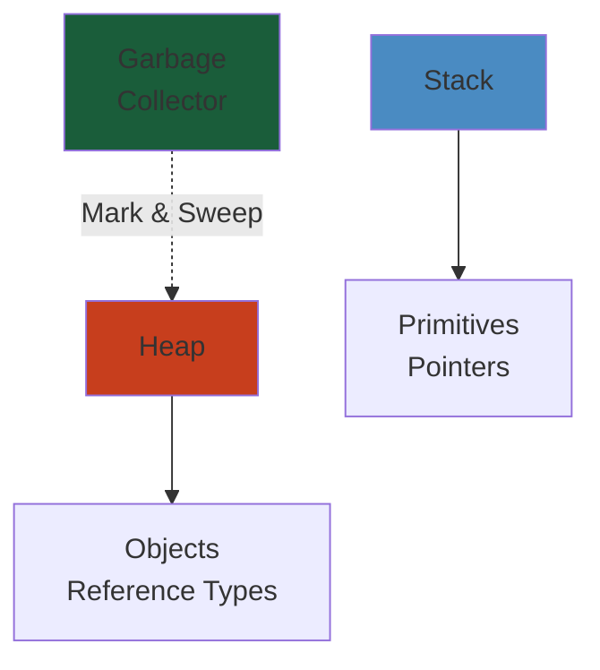

# Latency Numbers Every Engineer Should Know

Reference latencies for system design and performance optimization.




## CPU & Memory Latencies

```
L1 cache reference:          0.5 ns
Branch mispredict:           5 ns
L2 cache reference:          7 ns
Mutex lock/unlock:          100 ns
Main memory reference:      100 ns
Compress 1K bytes with Zippy:  10,000 ns (10 µs)
Send 1K bytes over 1 Gbps network:  10,000 ns (10 µs)
Read 1 MB sequentially from memory:  250,000 ns (250 µs)
Round trip within same datacenter:  500,000 ns (500 µs)
Read 1 MB sequentially from SSD:   1,000,000 ns (1 ms)
Disk seek:                   10,000,000 ns (10 ms)
Read 1 MB sequentially from disk:  20,000,000 ns (20 ms)
Send packet CA -> Netherlands:  150,000,000 ns (150 ms)
```

## Interactive with Latency Analogies

| Latency | Real-world Analogy |
|---------|-------------------|
| 1 ns | Light travels 0.3 meters |
| 1 µs | Light travels 300 meters |
| 1 ms | Light travels 300 km |
| 1 sec | Light travels 300,000 km |

## Common System Latencies

### Network

| Operation | Latency |
|-----------|---------|
| DNS lookup (cached) | 1-5 ms |
| DNS lookup (uncached) | 50-300 ms |
| Ping within datacenter | 0.5-1 ms |
| Ping across country | 20-50 ms |
| Ping intercontinental | 50-300 ms |
| TCP connection (same DC) | 1-5 ms |
| TCP connection (across WAN) | 20-100 ms |
| TLS handshake | 10-50 ms |
| HTTP request (simple) | 5-20 ms |
| HTTP request (complex) | 50-500 ms |

### Database

| Operation | Latency |
|-----------|---------|
| Index lookup (B-tree) | 1-5 ms |
| Sequential scan (small table) | 5-20 ms |
| Sequential scan (large table) | 100-1000 ms |
| Random page fetch (SSD) | 1-5 ms |
| Random page fetch (HDD) | 5-20 ms |
| Sync write to disk | 5-20 ms |
| Async write to buffer | <1 ms |

### Cache

| Operation | Latency |
|-----------|---------|
| Memcached hit | 0.1-1 ms |
| Redis hit (TCP) | 0.5-5 ms |
| Redis hit (Unix socket) | 0.1-1 ms |
| Cache miss + DB fetch | 50-500 ms |
| Cache warm-up (1M items) | 10-60 seconds |

### Storage

| Operation | Latency |
|-----------|---------|
| SSD read (sequential) | 0.1-1 ms |
| SSD read (random) | 1-10 ms |
| SSD write | 1-10 ms |
| HDD read (sequential) | 5-10 ms |
| HDD read (random) | 5-20 ms |
| Network attached storage (NAS) | 10-50 ms |
| S3 upload | 50-500 ms |
| S3 download | 50-200 ms |

### Message Queues

| Operation | Latency |
|-----------|---------|
| In-memory queue (push) | <0.1 ms |
| Kafka (produce) | 1-10 ms |
| RabbitMQ (publish) | 1-10 ms |
| AWS SQS (send) | 10-50 ms |
| Message delivery | 1-100 ms |

### Real-world Service Latencies

| Service | Typical P50 | Typical P99 |
|---------|-------------|------------|
| Static file serving | 1-5 ms | 10-50 ms |
| Simple API (no DB) | 5-20 ms | 50-200 ms |
| API with 1 DB query | 20-50 ms | 100-500 ms |
| API with 3 DB queries | 50-100 ms | 200-1000 ms |
| API with cache lookup | 10-20 ms | 50-200 ms |
| Search query | 50-200 ms | 500-2000 ms |
| ML inference | 100-500 ms | 500-5000 ms |
| Video transcoding | 10 sec - 10 min | Variable |

## Acceptable Latencies (by context)

### User-Facing

| Interaction Type | Target Latency |
|-----------------|-----------------|
| Page load | <3 seconds |
| Navigation | <1 second |
| Input response | <100 ms |
| Hover effect | <16 ms (60 fps) |
| Scroll | <16 ms (60 fps) |
| Animation | <16 ms per frame |
| Search autocomplete | <300 ms |
| Image load | <2 seconds |

### Internal/Backend

| Operation | Target Latency |
|-----------|-----------------|
| Cache lookup | <1 ms |
| In-memory operation | <10 ms |
| DB query | <50 ms |
| External API call | <500 ms |
| Batch job | Variable |
| Replication lag | <100 ms |

## Latency SLOs

| Tier | P50 | P95 | P99 | P99.9 |
|------|-----|-----|-----|-------|
| Excellent | <10ms | <50ms | <100ms | <500ms |
| Good | <50ms | <100ms | <500ms | <1s |
| Acceptable | <100ms | <500ms | <1s | <5s |
| Poor | >500ms | >1s | >5s | >10s |

## Common Latency Optimizations

### Quick Wins

| Technique | Latency Reduction |
|-----------|-------------------|
| Caching | 10-100x |
| Indexing | 10-100x |
| Connection pooling | 2-5x |
| Async operations | 2-10x |
| Batch operations | 5-50x |
| CDN usage | 2-10x |
| Compression | 2-5x |
| Query optimization | 5-100x |

### Medium Effort

| Technique | Latency Reduction |
|-----------|-------------------|
| Read replicas | 2-5x |
| Denormalization | 3-10x |
| Message queue buffering | 5-20x |
| Service mesh sidecar | Minimal/adds |
| Database sharding | Depends on skew |
| Microservice decomposition | Depends on coupling |

## Latency Budget Example

**Target: 100 ms total latency**

```
Network (DNS + TCP + TLS):      15 ms (15%)
Load balancer:                   5 ms (5%)
Request parsing:                 2 ms (2%)
Authentication:                  8 ms (8%)
Business logic:                 30 ms (30%)
Database query:                 25 ms (25%)
Serialization:                   5 ms (5%)
Network transmission:           10 ms (10%)
────────────────────────────────────────
Total:                         100 ms
```

## Measuring Latency

### Percentiles

```
P50 (Median):   50% of requests faster than this
P95:            95% of requests faster than this (tail latency)
P99:            99% of requests faster than this (extreme tail)
P99.9:          99.9% of requests faster than this (worst case)
Max:            Longest request (often outlier)
```

**Example**: If P99 = 500ms, 1 in 100 users experience >500ms latency.

### Tools

- `ping` — Network latency
- `curl -w` — HTTP request latency
- `ab` — Apache Bench (load testing)
- `wrk` — Modern load testing
- `strace` — System call tracing
- `perf` — CPU profiling
- `flamegraph` — Visualization

## Rule of Thumb

**Doubling latency roughly halves user satisfaction.**

- Aim for P99 latency < 10x P50 latency
- Avoid tail latencies (P99+) at all costs
- Budget 50% of target for external dependencies
- Keep local operations < 10% of total budget


---

## Code Examples

```python
import time
import statistics

# Measure and track latency percentiles
def measure_latencies(func, n: int = 1000) -> dict:
    latencies = []
    for _ in range(n):
        start = time.perf_counter_ns()
        func()
        elapsed = (time.perf_counter_ns() - start) / 1_000_000  # ms
        latencies.append(elapsed)
    latencies.sort()
    return {
        'p50': latencies[int(n * 0.50)],
        'p95': latencies[int(n * 0.95)],
        'p99': latencies[int(n * 0.99)],
        'p999': latencies[int(n * 0.999)],
        'mean': statistics.mean(latencies),
        'max': max(latencies),
        'min': min(latencies),
    }

# Latency budget calculator
class LatencyBudget:
    def __init__(self, total_ms: float = 100.0):
        self.total = total_ms
        self.allocations = {}

    def add(self, component: str, ms: float):
        self.allocations[component] = ms

    def validate(self) -> bool:
        used = sum(self.allocations.values())
        return used <= self.total

    def report(self):
        for comp, ms in self.allocations.items():
            pct = (ms / self.total) * 100
            print(f"{comp:25s} {ms:6.1f}ms ({pct:5.1f}%)")

# Simulate a fan-out request with tail latency analysis
import concurrent.futures
def fan_out(services: list[str], timeout_ms: int = 500) -> dict:
    results = {}
    with concurrent.futures.ThreadPoolExecutor(max_workers=len(services)) as ex:
        futures = {ex.submit(mock_call, svc): svc for svc in services}
        for future in concurrent.futures.as_completed(futures, timeout=timeout_ms/1000):
            svc = futures[future]
            try:
                results[svc] = future.result()
            except Exception as e:
                results[svc] = f"TIMEOUT: {e}"
    return results  # P99 of fan-out = max(p50, ...), not sum
```

```bash
# Measure DNS + TCP + TLS handshake latency
curl -w "DNS: %{time_namelookup}s, TCP: %{time_connect}s, TLS: %{time_appconnect}s, Total: %{time_total}s\n" \
  -o /dev/null -s https://example.com

# Load test with wrk
wrk -t8 -c200 -d30s --latency https://api.example.com/health

# Trace network hops
mtr -r example.com
```

---

## Common Failure Modes

**Problem**: Tail latency amplification in fan-out architectures (the "long tail of slow")

**Root cause**: When a request fans out to N downstream services, the P99 latency of the parent = P99 of the slowest child, not the average. If each of 50 services has 1% chance of being slow (P99 = 500ms), the chance that at least one service is slow = 1 - (0.99^50) ≈ 39.5%. The P99 of the parent can be 10x the median, and this gets exponentially worse with more dependencies.

**Detection**: P99 latency is 5-10x P50, increasing linearly with service count. Individual services show healthy P50/P99 but the aggregate endpoint is slow. Tracing shows tail latency requests waiting on a single slow downstream.

**Solution**: Implement timeout hedging — send the same request to 2 replicas and use the first response (within reason for idempotent calls). Set per-downstream timeouts at (0.5 * total_budget) so a single slow service doesn't blow the entire budget. Use circuit breakers to fail fast on degraded services. Use request coalescing (merge concurrent requests to the same downstream). For internal APIs, use retry with backoff but cap at 1 retry. Consider using a separate thread pool with bounded work queues for fan-out.

**Problem**: Coordinated omission — measurement bias making latency look better than reality

**Root cause**: Load testing tools measure latency only of completed requests. When the system is overloaded, requests are queued or dropped by the load balancer. The tool reports latency of only the requests that got through, hiding the queue time. Result: "P99 = 100ms" at 1000 RPS, but actual user experience shows 5-second timeouts.

**Detection**: Compare load test results (which look good) with production monitoring (which shows poor latency). The load tester's completion rate drops but reported latency stays flat. Gap between tool's latency and actual user-experienced latency grows as load increases.

**Solution**: Use coordinated omission-aware tools (e.g., wrk2 with HDR histogram, or Gil Tene's techniques). Measure latency from the client side, including connection setup time. In production, measure actual user-perceived latency (RUM). Use tail at scale (HDR histogram) to track all requests, not just completed ones. Implement load shedding at the edge — actively reject requests when pending queue exceeds limits, so measured latency doesn't hide overload.

---

## Interview Questions

### Q1: What latency numbers should every engineer know, and how do they inform system design?

**Answer**: The critical numbers: L1 cache: 0.5ns, main memory: 100ns, SSD read: 0.1ms, HDD seek: 10ms, intra-DC round trip: 0.5ms, cross-country round trip: 50ms, intercontinental: 150ms. These inform every design decision: sequential disk reads are 100x faster than random (B-trees exploit this). In-memory caches are 1000x faster than disk (hence, cache everything). Network calls within a DC are 100x faster than cross-region. An SSD can do ~10K random IOPS vs HDD's ~100 IOPS. For a 100ms user-facing budget: DB query ~20ms, cache lookup ~2ms, external API < 50ms, serialization < 5ms, network ~20ms. Design for locality — minimize cross-DC calls, batch operations, use caching aggressively, and choose SSD over HDD for any latency-sensitive operation.

### Q2: How do you troubleshoot a sudden P99 latency spike from 50ms to 2000ms?

**Answer**: (1) Check if the spike correlates with a deployment, traffic increase, or external dependency. (2) Use percentiles breakout by service — is the spike global or isolated to one endpoint? (3) Check slowest traces — is it a specific DB query, an external API, or GC pause? (4) Check resource saturation: CPU, memory, disk I/O, network bandwidth, connection pool utilization. (5) Check for lock contention: database row locks, distributed locks, mutexes. (6) Check for GC: if Java, get GC logs; if Go, check GC pause times. (7) Look for the "slow one" in a pool — sometimes one slightly degraded node causes coordinated omission for the entire pool. (8) Check for TLS — a certificate rotation causing re-handshake. (9) Use coordinated omission-aware analysis: the spike may have been queueing, not slow processing. (10) If nothing else, CPU profiling (flame graphs) during the spike often reveals the cause.
