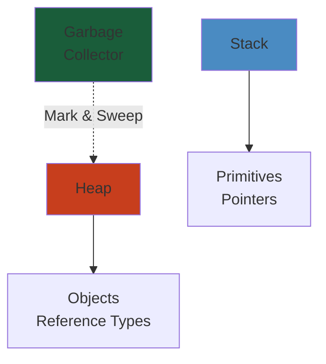

# Latency Numbers Every Engineer Should Know

Reference latencies for system design and performance optimization.




## CPU & Memory Latencies

```
L1 cache reference:          0.5 ns
Branch mispredict:           5 ns
L2 cache reference:          7 ns
Mutex lock/unlock:          100 ns
Main memory reference:      100 ns
Compress 1K bytes with Zippy:  10,000 ns (10 µs)
Send 1K bytes over 1 Gbps network:  10,000 ns (10 µs)
Read 1 MB sequentially from memory:  250,000 ns (250 µs)
Round trip within same datacenter:  500,000 ns (500 µs)
Read 1 MB sequentially from SSD:   1,000,000 ns (1 ms)
Disk seek:                   10,000,000 ns (10 ms)
Read 1 MB sequentially from disk:  20,000,000 ns (20 ms)
Send packet CA -> Netherlands:  150,000,000 ns (150 ms)
```

## Interactive with Latency Analogies

| Latency | Real-world Analogy |
|---------|-------------------|
| 1 ns | Light travels 0.3 meters |
| 1 µs | Light travels 300 meters |
| 1 ms | Light travels 300 km |
| 1 sec | Light travels 300,000 km |

## Common System Latencies

### Network

| Operation | Latency |
|-----------|---------|
| DNS lookup (cached) | 1-5 ms |
| DNS lookup (uncached) | 50-300 ms |
| Ping within datacenter | 0.5-1 ms |
| Ping across country | 20-50 ms |
| Ping intercontinental | 50-300 ms |
| TCP connection (same DC) | 1-5 ms |
| TCP connection (across WAN) | 20-100 ms |
| TLS handshake | 10-50 ms |
| HTTP request (simple) | 5-20 ms |
| HTTP request (complex) | 50-500 ms |

### Database

| Operation | Latency |
|-----------|---------|
| Index lookup (B-tree) | 1-5 ms |
| Sequential scan (small table) | 5-20 ms |
| Sequential scan (large table) | 100-1000 ms |
| Random page fetch (SSD) | 1-5 ms |
| Random page fetch (HDD) | 5-20 ms |
| Sync write to disk | 5-20 ms |
| Async write to buffer | <1 ms |

### Cache

| Operation | Latency |
|-----------|---------|
| Memcached hit | 0.1-1 ms |
| Redis hit (TCP) | 0.5-5 ms |
| Redis hit (Unix socket) | 0.1-1 ms |
| Cache miss + DB fetch | 50-500 ms |
| Cache warm-up (1M items) | 10-60 seconds |

### Storage

| Operation | Latency |
|-----------|---------|
| SSD read (sequential) | 0.1-1 ms |
| SSD read (random) | 1-10 ms |
| SSD write | 1-10 ms |
| HDD read (sequential) | 5-10 ms |
| HDD read (random) | 5-20 ms |
| Network attached storage (NAS) | 10-50 ms |
| S3 upload | 50-500 ms |
| S3 download | 50-200 ms |

### Message Queues

| Operation | Latency |
|-----------|---------|
| In-memory queue (push) | <0.1 ms |
| Kafka (produce) | 1-10 ms |
| RabbitMQ (publish) | 1-10 ms |
| AWS SQS (send) | 10-50 ms |
| Message delivery | 1-100 ms |

### Real-world Service Latencies

| Service | Typical P50 | Typical P99 |
|---------|-------------|------------|
| Static file serving | 1-5 ms | 10-50 ms |
| Simple API (no DB) | 5-20 ms | 50-200 ms |
| API with 1 DB query | 20-50 ms | 100-500 ms |
| API with 3 DB queries | 50-100 ms | 200-1000 ms |
| API with cache lookup | 10-20 ms | 50-200 ms |
| Search query | 50-200 ms | 500-2000 ms |
| ML inference | 100-500 ms | 500-5000 ms |
| Video transcoding | 10 sec - 10 min | Variable |

## Acceptable Latencies (by context)

### User-Facing

| Interaction Type | Target Latency |
|-----------------|-----------------|
| Page load | <3 seconds |
| Navigation | <1 second |
| Input response | <100 ms |
| Hover effect | <16 ms (60 fps) |
| Scroll | <16 ms (60 fps) |
| Animation | <16 ms per frame |
| Search autocomplete | <300 ms |
| Image load | <2 seconds |

### Internal/Backend

| Operation | Target Latency |
|-----------|-----------------|
| Cache lookup | <1 ms |
| In-memory operation | <10 ms |
| DB query | <50 ms |
| External API call | <500 ms |
| Batch job | Variable |
| Replication lag | <100 ms |

## Latency SLOs

| Tier | P50 | P95 | P99 | P99.9 |
|------|-----|-----|-----|-------|
| Excellent | <10ms | <50ms | <100ms | <500ms |
| Good | <50ms | <100ms | <500ms | <1s |
| Acceptable | <100ms | <500ms | <1s | <5s |
| Poor | >500ms | >1s | >5s | >10s |

## Common Latency Optimizations

### Quick Wins

| Technique | Latency Reduction |
|-----------|-------------------|
| Caching | 10-100x |
| Indexing | 10-100x |
| Connection pooling | 2-5x |
| Async operations | 2-10x |
| Batch operations | 5-50x |
| CDN usage | 2-10x |
| Compression | 2-5x |
| Query optimization | 5-100x |

### Medium Effort

| Technique | Latency Reduction |
|-----------|-------------------|
| Read replicas | 2-5x |
| Denormalization | 3-10x |
| Message queue buffering | 5-20x |
| Service mesh sidecar | Minimal/adds |
| Database sharding | Depends on skew |
| Microservice decomposition | Depends on coupling |

## Latency Budget Example

**Target: 100 ms total latency**

```
Network (DNS + TCP + TLS):      15 ms (15%)
Load balancer:                   5 ms (5%)
Request parsing:                 2 ms (2%)
Authentication:                  8 ms (8%)
Business logic:                 30 ms (30%)
Database query:                 25 ms (25%)
Serialization:                   5 ms (5%)
Network transmission:           10 ms (10%)
────────────────────────────────────────
Total:                         100 ms
```

## Measuring Latency

### Percentiles

```
P50 (Median):   50% of requests faster than this
P95:            95% of requests faster than this (tail latency)
P99:            99% of requests faster than this (extreme tail)
P99.9:          99.9% of requests faster than this (worst case)
Max:            Longest request (often outlier)
```

**Example**: If P99 = 500ms, 1 in 100 users experience >500ms latency.

### Tools

- `ping` — Network latency
- `curl -w` — HTTP request latency
- `ab` — Apache Bench (load testing)
- `wrk` — Modern load testing
- `strace` — System call tracing
- `perf` — CPU profiling
- `flamegraph` — Visualization

## Rule of Thumb

**Doubling latency roughly halves user satisfaction.**

- Aim for P99 latency < 10x P50 latency
- Avoid tail latencies (P99+) at all costs
- Budget 50% of target for external dependencies
- Keep local operations < 10% of total budget


---

## Code Examples

```python
# Example implementation
# [Add language-specific code demonstrating core concept]
pass
```

---

## Common Failure Modes

**Problem**: [Key issue in production]

**Root cause**: [Why it happens]

**Solution**: [How to fix]

---

## Interview Questions

### Q1: [Core concept question]

**Answer**: [Detailed explanation with trade-offs]

### Q2: [Design/architecture question]

**Answer**: [Best practices and reasoning]

---

## Related

- [Related domain 1](#)
- [Related domain 2](#)
