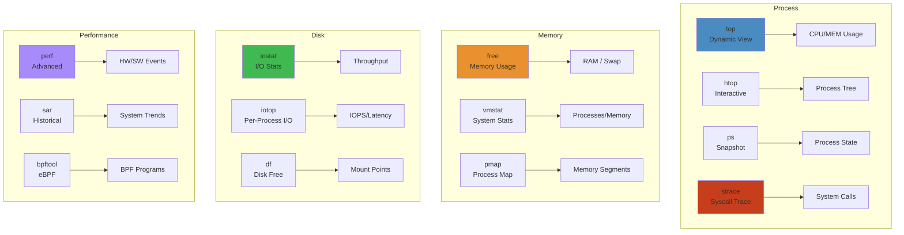

# Linux Debugging Cheat Sheet




Essential Linux debugging tools for production outages, performance issues, and system crashes.

**Cross-refs**: `12-operating-systems/05-linux-observability-debugging.md`, `12-operating-systems/01-linux-kernel-architecture.md`, `12-operating-systems/02-linux-process-memory.md`

## Process & Resource Monitoring


| Command | Purpose | Example |
|---------|---------|---------|
| `top` | Real-time process view | `top -o %MEM -u postgres` |
| `htop` | Interactive top (colors) | `htop -t` (tree view) |
| `atop` | Historical + cumulative | `atop -r /var/log/atop/` |
| `ps aux` | Snapshot of processes | `ps aux --sort=-%mem | head` |
| `pstree` | Process hierarchy | `pstree -ap 1234` |
| `pgrep` | Find PIDs by name | `pgrep -af nginx` |

```bash
# Find resource hogs
ps aux --sort=-%cpu | head -5
ps aux --sort=-%mem | head -5
top -b -n 1 -o %CPU | head -20
```

## System Call Tracing


```bash
strace -p 1234                # Attach to running PID
strace -f -o trace.log ls     # Follow forks, write to file
strace -c ls                  # Syscall summary (count + time)
strace -e trace=network,open  # Filter by category
strace -T -t ls               # Timestamps + duration per syscall
strace -e trace=!write        # Exclude noisy syscalls

# Production-safe limited strace
strace -p 1234 -e trace=network -S time -c -o /tmp/strace.summary
```

## Performance Profiling


```bash
# perf: CPU sampling, cache misses, branch prediction
perf top -p 1234                    # Live sampling
perf record -F 99 -p 1234 --sleep 30  # 99 Hz for 30s
perf report --sort=comm,dso,symbol  # View results
perf stat -e cycles,instructions,cache-misses ls  # Hardware counters
perf flamegraph                     # Requires scripts from perf-tools
perf list                           # Available events

# Tracing
perf trace -p 1234                  # Live syscall trace (like strace, faster)
perf sched record -- sleep 10       # Scheduler tracing
perf sched latency                  # Schedule latency analysis
```

## I/O Analysis


```bash
iostat -x 1 5                 # Extended I/O stats, 1s interval, 5 iterations
iostat -x -d sda 1            # Single device monitoring

vmstat 1 5                    # System-wide: procs, memory, swap, I/O, system, CPU
vmstat -s                     # Event counters summary
vmstat -d                     # Disk statistics

# Identify I/O waits (high wa CPU + high await in iostat)
iostat -x 1 | grep -E "Device|await"  # await > 10ms = slow device
```

## Memory Analysis


```bash
free -h                       # Memory summary
free -m -w                    # More detailed including "available" column

vmstat 1 5                    # Check si/so columns (swapping = bad)

# Slab cache
cat /proc/meminfo | grep -E "Slab|SReclaimable|SUnreclaim"
# dentry/inode cache can be huge; drop with sync; echo 2 > /proc/sys/vm/drop_caches
```

## Network Debugging


```bash
lsof -i :8080                 # What's listening on port 8080
lsof -iTCP -sTCP:LISTEN       # All listening TCP ports
lsof -p 1234                  # Open files for PID

netstat -tlnp                 # TCP listening sockets with PID
netstat -s                    # Protocol statistics
netstat -i                    # Interface statistics (errors, drops)
ss -tlnp                      # Faster netstat replacement
ss -s                         # Socket summary
ss -t -o state established    # Established connections
ss -i '( dport = :443 or sport = :443 )'  # Filter by port
```

## Kernel & System


```bash
dmesg -T --level=err,warn     # Kernel messages (errors + warnings)
dmesg -T | grep -i oom        # OOM killer events
dmesg -T | grep -i "task blocked"  # Hung tasks

sysctl -a                     # All kernel parameters
sysctl net.ipv4.tcp_fin_timeout  # Read single value
sysctl -w vm.swappiness=10    # Set (temporary)
```

## GDB Debugging


```bash
gdb -p 1234                   # Attach to process
bt                            # Backtrace (call stack)
bt full                       # Detailed backtrace with locals
info threads                  # All threads
thread apply all bt           # Backtrace for every thread
frame N                       # Switch to frame N
print variable                # Inspect variable

# Non-interactive (batch)
gdb -batch -ex "thread apply all bt" -p 1234
gdb -batch -ex "bt" -ex "info registers" /path/binary core.dump
```

## Production Workflows


```bash
# High CPU
top -o %CPU                  # Find PID
perf top -p $PID             # Hot functions
perf record -F 99 -p $PID    # Profile
perf report                  # Find hotspot → strace -p $PID -c to check syscalls

# High Memory
top -o %MEM                  # Find PID
pmap -x $PID                 # Memory mapping
cat /proc/$PID/smaps | grep -E "Pss|Rss"  # Detailed per-segment
lsof -p $PID                 # File-backed mappings

# Slow System (high load, not CPU)
iostat -x 1                   # Check await > svctm (queueing)
vmstat 1                      # Check b (blocked) column
dmesg -T | tail               # Kernel complaints
sar -q 1 5                    # Load average, run queue
```

## Anti-Patterns


| Anti-Pattern | Why It Hurts | Better Approach |
|-------------|-------------|----------------|
| `strace -p` on production (full) | 100x slowdown | Use `-e trace=!write` or `-c` summary |
| `top` in batch mode polling | Misses spikes | Use `atop` with logging |
| `kill -9` instead of SIGTERM | Orphan resources, data loss | `kill` (SIGTERM) first |
| `perf` without `-F` tuning | Too many/too few samples | `-F 99` (99 Hz, common default) |
| `iostat` without `-x` | Missing queue/await info | Always use `-x` |
| Chaining | Debugging blind | Run `dmesg` first for kernel context |

## Common Troubleshooting Sequences


```bash
# App unresponsive
dmesg -T --level=err     # Check OOM, disk errors
top -bn1 | head -20      # Resources
ss -tlnp                 # Ports
cat /var/log/syslog      # App logs
strace -p $PID -c        # Syscall summary

# Disk full
df -h                    # Filesystem usage
du -sh /* --exclude=proc | sort -rh | head  # Top dirs
lsof +L1                 # Deleted but still open files
find /tmp -type f -atime +7 -delete  # Clean temp

# Too many open files
lsof -p $PID | wc -l     # Count FDs
cat /proc/$PID/limits    # Check ulimit
sysctl fs.file-max       # System max
ulimit -n 65536          # Increase shell limit
```

## Tool Selection Matrix

| Symptom | Tool | Key Command | What to Look For |
|---|---|---|---|
| **High CPU** | `top` / `htop` | `top -o %CPU` | Process consuming >90% CPU |
| **High CPU** | `perf top` | `perf top -p <PID>` | Hot function (kernel/user) |
| **Out of Memory** | `free -h` | `free -h` | Available vs used swap |
| **Out of Memory** | `/var/log/kern.log` | `dmesg \| grep -i oom` | OOM killer messages |
| **Disk Full** | `df -h` | `df -h` | Mount at 100% usage |
| **Slow Disk** | `iostat -x 1` | `iostat -x 1` | `%util` > 90%, `await` > 10ms |
| **Slow Disk** | `iotop -o` | `iotop -o` | Process with high I/O |
| **Network Slow** | `ss -tup` | `ss -tup \| grep ESTAB` | Connection count, send-Q |
| **Network Slow** | `tcpdump` | `tcpdump -i eth0 port 80` | Retransmissions, RTT |
| **Hanging Process** | `strace -p <PID>` | `strace -p <PID>` | Blocked syscall (e.g. `read`) |
| **Hanging Process** | `gdb attach <PID>` | `gdb -p <PID>; bt` | Stack trace |
| **Swap Thrashing** | `vmstat 1` | `vmstat 1` | `si` / `so` > 0 consistently |

## Production Incident Checklist

1. **Save the state**: `top -bn1`, `free -h`, `df -h`, `ss -tup` → capture first
2. **Identify the victim**: Isolate by container/pod/process
3. **Narrow the domain**: CPU / Memory / Disk / Network
4. **Deep dive**: Select tool from matrix above
5. **Collect evidence**: Save all output with timestamps
6. **Mitigate**: Kill / restart / scale before root cause analysis
7. **Root cause**: `perf`, `strace`, core dump analysis
8. **Postmortem**: File incident report with timeline

## Related

- [Readme](18-performance-engineering/README.md)
- [Jvm Performance](18-performance-engineering/jvm-tuning/01-jvm-performance.md)
- [Optimization Patterns](18-performance-engineering/optimization/01-optimization-patterns.md)
- [Profiling Deep Dive](18-performance-engineering/profiling/01-profiling-deep-dive.md)
- [Readme](03-backend/README.md)
- [Goroutines Channels Concurrency](03-backend/go/01-goroutines-channels-concurrency.md)
