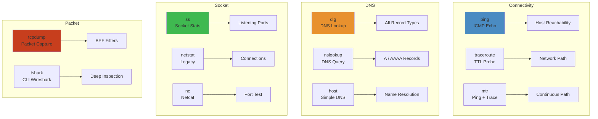

# Networking Commands Cheat Sheet




Essential network diagnostics tools for debugging connectivity, DNS, routing, and packet-level issues.

**Cross-refs**: `11-networking/01-tcp-ip-deep-dive.md`, `11-networking/02-tls-http-grpc.md`, `11-networking/03-dns-cdn-loadbalancing.md`, `12-operating-systems/04-linux-networking-ipc.md`

## curl


```bash
curl -v http://example.com              # Verbose (headers + handshake)
curl -i http://example.com              # Response headers included
curl -k https://example.com             # Skip TLS verification
curl -L http://example.com              # Follow redirects
curl -o output.txt http://example.com   # Save to file
curl -s -w "HTTP %{http_code}\n" http://example.com  # Just status code

# Timing breakdown
curl -w "\n---\n\
  time_namelookup: %{time_namelookup}s\n\
  time_connect: %{time_connect}s\n\
  time_appconnect: %{time_appconnect}s\n\
  time_starttransfer: %{time_starttransfer}s\n\
  time_total: %{time_total}s\n" -o /dev/null -s https://example.com

# Request methods
curl -X POST -d '{"key":"value"}' -H "Content-Type: application/json" http://api.example.com
curl -X PUT -d @file.json http://api.example.com/resource/1
curl -X DELETE http://api.example.com/resource/1
curl -F "file=@image.png" http://upload.example.com

# Headers & auth
curl -H "Authorization: Bearer token" -H "Accept: application/json" http://api.example.com
curl -u user:password http://example.com
curl --proxy http://proxy:8080 http://example.com
```

## dig (DNS)


```bash
dig example.com                          # A record
dig example.com AAAA                     # IPv6
dig example.com MX                       # Mail exchange
dig example.com NS                       # Name servers
dig example.com ANY                      # All records
dig example.com +short                   # Short output (just values)

# Specific DNS server
dig @8.8.8.8 example.com                # Query Google DNS
dig @1.1.1.1 example.com                # Query Cloudflare DNS

# Reverse lookup
dig -x 93.184.216.34                    # PTR record

# Trace DNS resolution
dig +trace example.com                  # Follow root → TLD → authoritative

# Debug
dig +qr example.com                     # Show query + response
dig +stats example.com                  # Timing statistics
```

## tcpdump


```bash
# Capture basics
tcpdump -i eth0                         # All traffic on interface
tcpdump -i eth0 -n                      # No DNS resolution
tcpdump -i eth0 port 80                 # HTTP traffic
tcpdump -i eth0 port 443                # HTTPS (TLS handshake visible)
tcpdump -i eth0 host 10.0.0.1           # Traffic to/from host
tcpdump -i eth0 src 10.0.0.1            # From host
tcpdump -i eth0 dst 10.0.0.1            # To host

# Advanced
tcpdump -i eth0 -s 0 -w capture.pcap    # Full packet capture to file
tcpdump -r capture.pcap                  # Read saved capture
tcpdump -i eth0 -A                       # ASCII output
tcpdump -i eth0 -X                       # Hex + ASCII
tcpdump -i eth0 -S                       # Absolute sequence numbers

# Filter combinations
tcpdump -i eth0 "tcp[tcpflags] & tcp-syn != 0"   # SYN packets
tcpdump -i eth0 "tcp[tcpflags] & tcp-rst != 0"   # RST packets
tcpdump -i eth0 "icmp"                           # ICMP (ping)
tcpdump -i eth0 -c 100                           # Stop after 100 packets
tcpdump -i eth0 -s 96 -B 4096                    # Buffer size 4MB
```

## traceroute / mtr


```bash
traceroute example.com                  # Trace path to host
traceroute -n example.com               # No DNS (faster)
traceroute -I example.com               # ICMP echo
traceroute -T -p 443 example.com        # TCP SYN to port 443
traceroute -q 5 example.com             # 5 probes per hop

# mtr: continuous traceroute + ping (better)
mtr example.com                         # Interactive
mtr -r -c 10 example.com                # Report mode, 10 pings
mtr -n -r -c 10 example.com             # No DNS, report
mtr -i 1 example.com                    # 1 second between hops
```

## nmap


```bash
nmap -sn 192.168.1.0/24                # Ping sweep (live hosts)
nmap -p 22,80,443 192.168.1.1          # Specific ports
nmap -p- 192.168.1.1                   # All ports (slow)
nmap -sV 192.168.1.1                   # Service version detection
nmap -O 192.168.1.1                    # OS detection
nmap -sC 192.168.1.1                   # Default scripts
nmap -A 192.168.1.1                    # Aggressive (-sV -O -sC)

# Scan types
nmap -sS 192.168.1.1                   # SYN stealth scan
nmap -sT 192.168.1.1                   # TCP connect scan
nmap -sU 192.168.1.1                   # UDP scan (slow)
nmap -T4 -F 192.168.1.0/24            # Fast (-T4) + fast (-F, 100 ports)
```

## ss / ip


```bash
# ss (socket statistics) — faster than netstat
ss -tlnp                               # TCP listening
ss -ulnp                               # UDP listening
ss -tup                                # TCP + UDP with PIDs
ss -s                                  # Socket summary
ss -t -o state established             # Established connections
ss -i '( dport = :443 or sport = :443 )'  # Port filter
ss -tlnp src :80                       # Listening on port 80
ss -t -sport :443                      # Source port filter

# ip (replaces ifconfig, route)
ip addr                                # Interface addresses
ip link                                # Link status
ip route                               # Routing table
ip neigh                               # ARP cache
ip -s link                             # Interface statistics
ip route get 10.0.0.1                  # Which route for dest?
ip -br addr                            # Brief output (CIDR)
```

## iptables / nftables


```bash
# iptables
iptables -L -n -v                      # List rules (verbose)
iptables -L INPUT -n -v                # INPUT chain only
iptables -S                            # Dump rules as commands
iptables -t nat -L -n                  # NAT table
iptables -I INPUT -s 10.0.0.0/8 -j DROP   # Block subnet
iptables -A INPUT -p tcp --dport 80 -j ACCEPT  # Allow HTTP
iptables -A INPUT -p tcp --dport 22 -s 10.0.0.0/24 -j ACCEPT  # SSH from subnet
iptables -P INPUT DROP                 # Default deny

# nftables (modern replacement)
nft list ruleset                       # All rules
nft add rule inet filter input tcp dport 80 accept
nft add rule inet filter input ip saddr 10.0.0.0/8 drop
```

## nc (netcat)


```bash
nc -zv example.com 80                  # Port check (verbose)
nc -zv example.com 20-100              # Port range scan
nc -zvn example.com 80                 # Fast, no DNS
nc -l -p 8080                          # Listen on 8080
nc -l -k -p 8080                       # Listen, keep accepting

# Data transfer
echo "GET / HTTP/1.0\n\n" | nc example.com 80  # Raw HTTP request
nc -l 8080 > received.txt              # Receive file
cat file.txt | nc -w 3 host 8080      # Send file
```

## Quick Diagnostic Workflows


```bash
# Can't reach a service?
# 1. Local
ss -tlnp | grep :8080                  # Is it listening?

# 2. DNS
dig +short myservice.local              # Does DNS resolve?

# 3. Connectivity
nc -zv myservice.local 8080            # Port reachable?
nmap -p 8080 myservice.local           # Port scan

# 4. Path
mtr -r -c 5 myservice.local           # Path + loss

# 5. Packet level
tcpdump -i any port 8080 -c 100       # See actual traffic
```

## Anti-Patterns


| Anti-Pattern | Why It Hurts | Fix |
|-------------|-------------|-----|
| No `-n` with tcpdump/dig | DNS lookup delays, noise | Always add `-n` |
| nc without timeout | Hangs forever | `-w 3` (3s timeout) |
| nmap full scan (`-p-`) on prod | Slow, alarms IDS | `-p 1-1000` or `-F` |
| curl without `-L` | Misses redirects | Add `-L` for HTTP |
| iptables without save | Rules lost on reboot | `iptables-save > /etc/iptables/rules.v4` |
| traceroute on firewalled hosts | All hops timeout | Use `-I` or `-T -p 443` |
| tcpdump on eth0 instead of any | Misses container traffic | `-i any` |
| dig without `@server` | Uses system resolver cache | Explicitly query `@8.8.8.8` |

## Production Troubleshooting Sequences


```bash
# Service: "Connection refused"
ss -tlnp | grep PORT                    # 1. Is app listening?
nc -zv localhost PORT                   # 2. Local connectivity
ip addr                                 # 3. Interface up?
iptables -L -n -v                       # 4. Firewall blocking?
ss -tlnp                                # 5. Is another process on port?

# Service: "Connection timed out"
mtr -r -c 5 $HOST                       # 1. Path and packet loss?
dig @8.8.8.8 $HOST                      # 2. DNS resolves?
nc -zv -w 5 $HOST PORT                  # 3. Port reachable?
tcpdump -i any host $HOST               # 4. Packets leaving?
ip route get $HOST                      # 5. Correct gateway?

# High latency / packet loss
mtr -r -c 50 $HOST                      # 1. Which hop drops?
curl -w "@timing" -o /dev/null -s $URL  # 2. Timing breakdown
ping -c 100 $HOST                       # 3. Loss rate
ss -ti                                  # 4. TCP retransmits?
```

## Diagnostic Scenarios

| Scenario | Command | Expected Output | Red Flags |
|---|---|---|---|
| **DNS resolution** | `dig +short example.com` | IP address(es) | `NXDOMAIN`, `SERVFAIL`, timeout |
| **Connectivity check** | `ping -c 3 8.8.8.8` | `0% packet loss` | >10% loss, high RTT variance |
| **Port listening** | `ss -tlnp \| grep :443` | LISTEN state | Empty output = not listening |
| **Trace route** | `mtr -r example.com` | All hops ≤30ms | Hops with `???` or >100ms |
| **Bandwidth test** | `iperf3 -c server -t 10` | Throughput in Mbps | < expected for link speed |
| **Packet capture** | `tcpdump -i eth0 port 443 -c 100` | SYN/ACK packets | Retransmissions, RST packets |
| **HTTP response** | `curl -v -o /dev/null http://host` | 200 + timing | 5xx, high `time_total` |
| **SSL cert** | `openssl s_client -connect host:443` | Certificate chain | Expired, self-signed, mismatch |

## Common Network Metrics

| Metric | Good | Warning | Critical |
|---|---|---|---|
| Latency (RTT) | <10ms | 10-100ms | >100ms |
| Packet Loss | 0% | 0.1-1% | >1% |
| Bandwidth Utilization | <70% | 70-90% | >90% |
| TCP Retransmissions | <0.1% | 0.1-2% | >2% |
| Connection Timeout Rate | <0.01% | 0.01-0.1% | >0.1% |
| Socket Queue (send) | 0 | <100 | >1000 |
