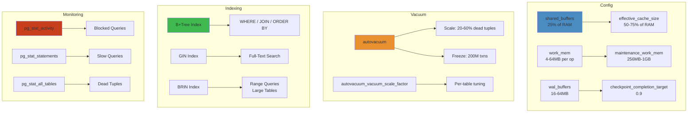
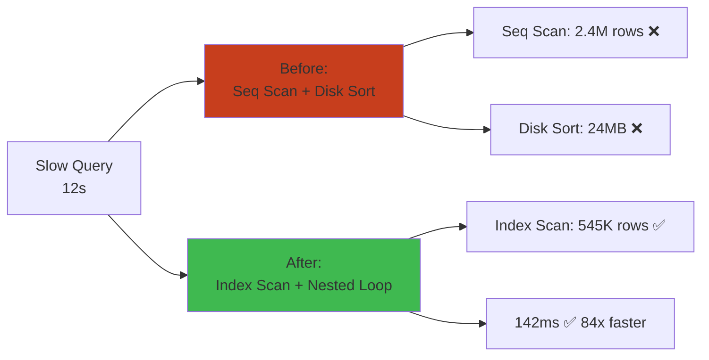

# PostgreSQL Tuning Cheat Sheet




PostgreSQL performance tuning for slow queries, high concurrency, and production incidents. Covers config knobs, indexing, vacuum, and monitoring.

**Cross-refs**: `08-databases/01-relational-database-internals.md`, `08-databases/02-postgresql-architecture.md`, `08-databases/03-postgresql-troubleshooting-tuning.md`, `08-databases/internals/indexes.md`

## Quick Diagnostic Commands


```bash
# Slow query log
SELECT * FROM pg_stat_activity WHERE state != 'idle' ORDER BY query_start;
SELECT query, calls, total_exec_time, rows FROM pg_stat_statements ORDER BY total_exec_time DESC LIMIT 10;
SELECT relname, seq_scan, seq_tup_read, idx_scan FROM pg_stat_all_tables ORDER BY seq_scan DESC;

# Bloat & dead tuples
SELECT relname, n_dead_tup, n_live_tup, round(n_dead_tup * 100.0 / GREATEST(n_live_tup, 1), 2) AS dead_pct
FROM pg_stat_user_tables WHERE n_dead_tup > 10000 ORDER BY n_dead_tup DESC;

# Locks
SELECT pid, mode, granted, wait_event, query FROM pg_locks l JOIN pg_stat_activity a USING(pid) WHERE NOT granted;

# Connections
SELECT count(*), state, wait_event FROM pg_stat_activity GROUP BY state, wait_event;
```

## Configuration Parameters


| Parameter | Default | Tuning | Effect |
|-----------|---------|--------|--------|
| `shared_buffers` | 128MB | 25% RAM | Cache hot data in shared memory |
| `effective_cache_size` | 4GB | 75% RAM | Planner estimate for OS cache |
| `work_mem` | 4MB | 4-64MB | Sort/hash per operation; too high = OOM |
| `maintenance_work_mem` | 64MB | 10% RAM | VACUUM, CREATE INDEX |
| `random_page_cost` | 4.0 | 1.1 (SSD) | Index scan cost vs seq scan |
| `max_connections` | 100 | 20-200 | Each conn needs ~2MB; prefer pgbouncer |
| `wal_buffers` | 16MB | 64MB-1GB | Write-ahead log buffer |
| `checkpoint_completion_target` | 0.5 | 0.9 | Spread checkpoint I/O |

## Query Tuning


```sql
-- EXPLAIN plans
EXPLAIN (ANALYZE, BUFFERS, TIMING) SELECT * FROM orders WHERE status = 'pending';
-- Look for: Seq Scan on large tables, high loops, large rows= estimates

-- Common fixes
CREATE INDEX CONCURRENTLY idx_orders_status_created ON orders(status, created_at);
VACUUM ANALYZE orders;
SET enable_seqscan = off;  -- Force index use (debug only, not permanent)
```

## Indexing


| Index Type | Use Case | Caveat |
|-----------|----------|--------|
| B-tree | Equality, range, sort | Default; good for most |
| Hash | Equality only | 2-3x smaller than B-tree |
| GiST | Full-text, geometry | Larger, slower to build |
| GIN | Array, JSONB, tsvector | Fast search, slow writes |
| BRIN | Large tables, correlated | Very small, great for time-series |
| Partial | `WHERE status = 'active'` | Only for filtered queries |
| Covering | `INCLUDE (col)` | Index-only scans |

```sql
-- Find unused indexes
SELECT schemaname, tablename, indexname, idx_scan
FROM pg_stat_user_indexes WHERE idx_scan = 0 AND indexrelid NOT IN (SELECT indexrelid FROM pg_constraint);

-- Duplicate indexes
SELECT pg_size_pretty(SUM(pg_relation_size(idx))) AS total_size
FROM pg_indexes i1 WHERE EXISTS (SELECT 1 FROM pg_indexes i2 WHERE i2.indexdef = i1.indexdef AND i2.indexname != i1.indexname);
```

## Vacuum & Bloat


```sql
-- Table-level vacuum
VACUUM (VERBOSE, ANALYZE) orders;
VACUUM FULL orders;             -- Exclusive lock, last resort
REINDEX TABLE CONCURRENTLY orders;

-- Monitor vacuum progress
SELECT datname, phase, heap_blks_total, heap_blks_scanned, heap_blks_vacuumed
FROM pg_stat_progress_vacuum;

-- Auto-vacuum tuning (in postgresql.conf)
-- autovacuum_vacuum_scale_factor = 0.01   (trigger after 1% dead tuples)
-- autovacuum_vacuum_threshold = 50         (min dead tuples before trigger)
-- autovacuum_analyze_scale_factor = 0.05
```

## Memory Tuning Profile


```ini
# Server with 32GB RAM, SSD, 16 cores
shared_buffers = 8GB              # 25% of RAM
effective_cache_size = 24GB       # 75% of RAM
maintenance_work_mem = 2GB
work_mem = 32MB
wal_buffers = 64MB
random_page_cost = 1.1            # SSD
effective_io_concurrency = 200    # SSD
max_worker_processes = 16
max_parallel_workers_per_gather = 4
max_parallel_workers = 8
```

## Production Debugging Workflow


```bash
# 1. Find what's slow
SELECT pid, now() - query_start AS duration, state, query
FROM pg_stat_activity WHERE state != 'idle' ORDER BY duration DESC;

# 2. Cancel or terminate
SELECT pg_cancel_backend(pid);     -- Cancel query
SELECT pg_terminate_backend(pid);  -- Kill connection

# 3. Check locks
SELECT blocked.pid AS blocked_pid, blocking.pid AS blocking_pid, blocked.query AS blocked_query
FROM pg_locks blocked
JOIN pg_locks blocking ON blocking.locktype = blocked.locktype AND blocking.database = blocked.database
  AND blocking.relation = blocked.relation AND blocking.mode = blocked.mode
WHERE NOT blocked.granted;

# 4. Analyze wait events
SELECT wait_event_type, wait_event, count(*) FROM pg_stat_activity
WHERE state != 'idle' AND wait_event IS NOT NULL GROUP BY 1, 2 ORDER BY 3 DESC;
```

## Anti-Patterns


| Anti-Pattern | Why It Hurts | Fix |
|-------------|-------------|-----|
| `SELECT *` in production | I/O waste, index-only scan kills | Name columns explicitly |
| No `LIMIT` on queries | Memory blowup on large tables | Always set `LIMIT` |
| Indexing every column | Write slowdown, disk bloat | Monitor `idx_scan`; drop unused |
| Huge `work_mem` | OOM from parallel sorts | Start low, increase incrementally |
| `VACUUM FULL` on busy tables | Long exclusive lock | Use `pg_repack` instead |
| No `pg_stat_statements` | Tuning blind | `shared_preload_libraries = 'pg_stat_statements'` |

## Common Troubleshooting Sequences


```bash
# Slow query
EXPLAIN (ANALYZE, BUFFERS) → check seq_scan → add index → ANALYZE → re-check

# High CPU
pg_stat_activity → top CPU queries → pg_stat_statements → add index / tune work_mem

# Connection spikes
SELECT count(*) FROM pg_stat_activity → check state → add pgbouncer → tune max_connections

# Disk growing fast
pg_stat_user_tables.n_dead_tup → tune autovacuum → VACUUM → check WAL archive retention

# Lock contention
pg_locks with NOT granted → find blocking pid → cancel or tune query → add index
```

## Configuration Tiers

| Setting | Development | Production (small) | Production (large) |
|---|---|---|---|
| `max_connections` | 20 | 100 | 500 |
| `shared_buffers` | 128MB | 2GB | 8GB (25% RAM) |
| `effective_cache_size` | 512MB | 6GB | 24GB |
| `work_mem` | 4MB | 16MB | 64MB |
| `maintenance_work_mem` | 64MB | 256MB | 1GB |
| `wal_buffers` | 16MB | 32MB | 64MB |
| `checkpoint_completion_target` | 0.5 | 0.9 | 0.9 |
| `random_page_cost` | 4.0 | 1.1 (SSD) | 1.1 (SSD) |
| `effective_io_concurrency` | 1 | 200 (SSD) | 200 (SSD) |

## Index Type Comparison

| Index Type | Use Case | Size vs Table | Maintenance Cost |
|---|---|---|---|
| **B+Tree** (default) | Equality + range queries, ORDER BY, JOIN | ~20-30% | Low |
| **Hash** | Equality only | ~10% | Very low |
| **GIN** | Full-text search, arrays, JSONB | ~10-15% | High (insert/update) |
| **GiST** | Full-text, geometry, fuzzy search | ~20-30% | Medium |
| **BRIN** | Very large tables with natural ordering | ~0.1-1% | Very low |
| **SP-GiST** | Non-balanced structures (quadtree) | ~15-25% | Medium |

## Query Pattern Anti-Patterns

| Anti-Pattern | Symptom | Fix |
|---|---|---|
| `SELECT *` | Excessive I/O | Name needed columns |
| Missing `WHERE` clause | Seq scan on large table | Add index + filter |
| `IN (subquery)` | Slow for large lists | Use `EXISTS` or JOIN |
| `NOT IN` | NULL handling issues | Use `NOT EXISTS` |
| `LIKE '%pattern'` | Full scan, no index | Use trigram index (`pg_trgm`) |
| `OR` conditions | Poor index usage | Use `UNION` or `IN` |
| `ORDER BY ... LIMIT` without index | Sort on full result | Create composite index |
| Implicit type coercion | Index not used | Match types explicitly |

## Related

- [Readme](18-performance-engineering/README.md)
- [Jvm Performance](18-performance-engineering/jvm-tuning/01-jvm-performance.md)
- [Optimization Patterns](18-performance-engineering/optimization/01-optimization-patterns.md)
- [Profiling Deep Dive](18-performance-engineering/profiling/01-profiling-deep-dive.md)
- [Readme](03-backend/README.md)
- [Goroutines Channels Concurrency](03-backend/go/01-goroutines-channels-concurrency.md)

## Debugging Walkthrough: EXPLAIN ANALYZE Deep Dive

### Scenario: App dashboard page loads in 12s instead of <500ms.

```sql
-- Step 1: Identify the slow query (pg_stat_statements)
SELECT query, mean_exec_time, calls, rows
FROM pg_stat_statements
ORDER BY mean_exec_time DESC
LIMIT 5;

-- Step 2: EXPLAIN ANALYZE the slowest query
EXPLAIN (ANALYZE, BUFFERS, TIMING) 
SELECT o.id, o.total, o.status, u.name
FROM orders o
JOIN users u ON o.user_id = u.id
WHERE o.created_at > NOW() - INTERVAL '30 days'
ORDER BY o.total DESC
LIMIT 100;

-- Output:
--   Sort  (cost=48512.33..49876.11 rows=545514 width=42)
--     Sort Key: o.total DESC
--     Sort Method: external merge  Disk: 24568kB  ← DISK SORT!
--     ->  Hash Join  (cost=12890.33..27980.11 rows=545514 width=42)
--           Hash Cond: (o.user_id = u.id)
--           ->  Seq Scan on orders o  ← FULL TABLE SCAN!
--                 Filter: (created_at > now() - '30 days'::interval)
--                 Rows Removed by Filter: 2451233
--           ->  Hash  (cost=10540.33..10540.33 rows=189533 width=16)
--                 ->  Seq Scan on users u  ← ANOTHER FULL SCAN!
```

### Diagnosis

| Signal | Problem | Fix |
|---|---|---|
| `Seq Scan on orders` (2.4M rows) | No index on `created_at` | `CREATE INDEX idx_orders_created ON orders(created_at)` |
| `external merge Disk: 24MB` | Sort spills to disk | Increase `work_mem` (16MB → 64MB) |
| `Seq Scan on users` (189K rows) | Full table scan on users | Already has PK index — join is fine |
| `Rows Removed by Filter: 2.4M` | Sequential scan filters most rows | Index would reduce to 545K |
| `Buffers: shared hit=4500 read=32000` | 32K pages read from disk | Increase `shared_buffers` + check cache hit ratio |

### After Fix

```sql
-- After adding index
EXPLAIN (ANALYZE, BUFFERS, TIMING)
SELECT ...;

-- Output:
--   Limit  (cost=1.42..8923.11 rows=100 width=42)
--     ->  Nested Loop  (cost=1.42..48512.33 rows=545514 width=42)
--           ->  Index Scan Backward using idx_orders_created on orders o  ← INDEX SCAN!
--                 Index Cond: (created_at > now() - '30 days'::interval)
--           ->  Index Scan using users_pkey on users u  ← INDEX SCAN!
--                 Index Cond: (id = o.user_id)
--   Execution Time: 142.3ms  ← 84x faster!
```


