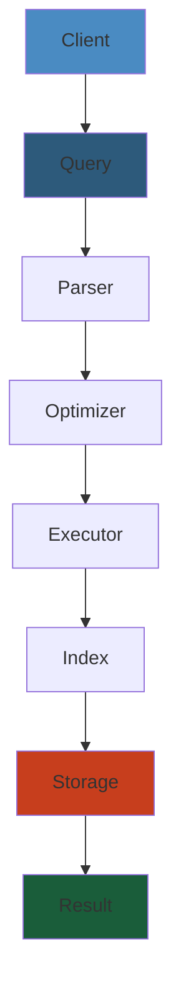

# SQL Queries Cheat Sheet

Essential SQL commands for database operations and querying.




## Database & Table Management

```sql
-- Databases
CREATE DATABASE db_name;
DROP DATABASE db_name;
USE db_name;
SHOW DATABASES;

-- Tables
CREATE TABLE users (
  id INT PRIMARY KEY AUTO_INCREMENT,
  name VARCHAR(100) NOT NULL,
  email VARCHAR(100) UNIQUE,
  created_at TIMESTAMP DEFAULT CURRENT_TIMESTAMP
);

SHOW TABLES;
DESC users;                    -- Show table structure
ALTER TABLE users ADD COLUMN age INT;
ALTER TABLE users MODIFY COLUMN name VARCHAR(150);
DROP TABLE users;
TRUNCATE TABLE users;          -- Delete all rows, keep structure
```

## SELECT Queries

```sql
-- Basic selection
SELECT * FROM users;
SELECT id, name, email FROM users;
SELECT DISTINCT country FROM users;
SELECT COUNT(*) FROM users;

-- Conditional
WHERE clause:
SELECT * FROM users WHERE age > 18;
SELECT * FROM users WHERE name = 'John' AND age > 25;
SELECT * FROM users WHERE status IN ('active', 'pending');
SELECT * FROM users WHERE email LIKE '%@gmail.com';
SELECT * FROM users WHERE age BETWEEN 20 AND 30;
SELECT * FROM users WHERE email IS NULL;
SELECT * FROM users WHERE email IS NOT NULL;

-- NOT operator
SELECT * FROM users WHERE NOT status = 'deleted';
SELECT * FROM users WHERE status != 'deleted';
```

## Sorting & Limiting

```sql
-- Sorting
SELECT * FROM users ORDER BY created_at DESC;
SELECT * FROM users ORDER BY age ASC, name ASC;

-- Limiting
SELECT * FROM users LIMIT 10;               -- First 10 rows
SELECT * FROM users LIMIT 10 OFFSET 20;    -- Rows 21-30
SELECT * FROM users ORDER BY created_at DESC LIMIT 5;
```

## Aggregation & Grouping

```sql
-- Aggregate functions
SELECT COUNT(*) FROM users;
SELECT SUM(amount) FROM orders;
SELECT AVG(age) FROM users;
SELECT MAX(salary) FROM employees;
SELECT MIN(price) FROM products;

-- Group by
SELECT department, COUNT(*) as count FROM employees GROUP BY department;
SELECT category, SUM(amount) as total FROM orders GROUP BY category;

-- Having clause (filter after GROUP BY)
SELECT department, AVG(salary) as avg_sal 
FROM employees 
GROUP BY department 
HAVING AVG(salary) > 50000;

-- Multiple aggregates
SELECT 
  department,
  COUNT(*) as emp_count,
  AVG(salary) as avg_salary,
  MAX(salary) as max_salary
FROM employees
GROUP BY department;
```

## Joins

```sql
-- Inner join (default)
SELECT u.id, u.name, o.order_id 
FROM users u 
INNER JOIN orders o ON u.id = o.user_id;

-- Left join
SELECT u.id, u.name, o.order_id 
FROM users u 
LEFT JOIN orders o ON u.id = o.user_id;

-- Right join
SELECT u.id, u.name, o.order_id 
FROM users u 
RIGHT JOIN orders o ON u.id = o.user_id;

-- Full outer join (MySQL uses UNION)
SELECT u.id, u.name, o.order_id 
FROM users u 
LEFT JOIN orders o ON u.id = o.user_id
UNION
SELECT u.id, u.name, o.order_id 
FROM users u 
RIGHT JOIN orders o ON u.id = o.user_id;

-- Cross join (Cartesian product)
SELECT u.id, p.product_id 
FROM users u 
CROSS JOIN products p;

-- Self join
SELECT e1.name, e2.name 
FROM employees e1
JOIN employees e2 ON e1.manager_id = e2.id;
```

## Subqueries

```sql
-- Subquery in WHERE
SELECT * FROM users WHERE id IN (
  SELECT user_id FROM orders WHERE amount > 1000
);

-- Subquery in FROM (derived table)
SELECT * FROM (
  SELECT id, name, salary, 
    ROW_NUMBER() OVER (ORDER BY salary DESC) as rank
  FROM employees
) ranked WHERE rank <= 10;

-- Correlated subquery
SELECT * FROM employees e1 WHERE salary > (
  SELECT AVG(salary) FROM employees e2 
  WHERE e2.department = e1.department
);

-- EXISTS clause
SELECT * FROM users u WHERE EXISTS (
  SELECT 1 FROM orders o WHERE o.user_id = u.id AND o.amount > 500
);
```

## INSERT, UPDATE, DELETE

```sql
-- Insert single row
INSERT INTO users (name, email, age) 
VALUES ('John Doe', 'john@example.com', 30);

-- Insert multiple rows
INSERT INTO users (name, email, age) VALUES 
('John', 'john@example.com', 30),
('Jane', 'jane@example.com', 28),
('Bob', 'bob@example.com', 35);

-- Insert from SELECT
INSERT INTO users_backup 
SELECT * FROM users WHERE created_at < '2020-01-01';

-- Update
UPDATE users SET age = 31 WHERE id = 1;
UPDATE users SET status = 'active' WHERE age > 18;
UPDATE users SET status = 'inactive', updated_at = NOW();

-- Delete
DELETE FROM users WHERE id = 1;
DELETE FROM users WHERE created_at < '2020-01-01';
DELETE FROM users;  -- Delete all rows
```

## Window Functions

```sql
-- Row number
SELECT 
  id, name, salary,
  ROW_NUMBER() OVER (ORDER BY salary DESC) as rank
FROM employees;

-- Partition by
SELECT 
  id, department, salary,
  ROW_NUMBER() OVER (PARTITION BY department ORDER BY salary DESC) as dept_rank
FROM employees;

-- Rank with ties
SELECT 
  id, name, salary,
  RANK() OVER (ORDER BY salary DESC) as rank
FROM employees;

-- Dense rank (no gaps)
SELECT 
  id, name, salary,
  DENSE_RANK() OVER (ORDER BY salary DESC) as rank
FROM employees;

-- Running total
SELECT 
  id, amount, created_at,
  SUM(amount) OVER (ORDER BY created_at) as running_total
FROM sales;

-- LAG/LEAD
SELECT 
  id, created_at, revenue,
  LAG(revenue) OVER (ORDER BY created_at) as prev_revenue,
  LEAD(revenue) OVER (ORDER BY created_at) as next_revenue
FROM daily_sales;
```

## Common Table Expressions (CTE)

```sql
-- Basic CTE
WITH user_orders AS (
  SELECT user_id, COUNT(*) as order_count, SUM(amount) as total
  FROM orders
  GROUP BY user_id
)
SELECT u.id, u.name, uo.order_count, uo.total
FROM users u
JOIN user_orders uo ON u.id = uo.user_id;

-- Recursive CTE
WITH RECURSIVE ancestors AS (
  -- Base case
  SELECT id, parent_id, name, 1 as level
  FROM categories
  WHERE parent_id IS NULL
  
  UNION ALL
  
  -- Recursive case
  SELECT c.id, c.parent_id, c.name, a.level + 1
  FROM categories c
  JOIN ancestors a ON c.parent_id = a.id
)
SELECT * FROM ancestors;
```

## String Functions

```sql
CONCAT(col1, col2)           -- Concatenate strings
UPPER(name)                  -- Convert to uppercase
LOWER(name)                  -- Convert to lowercase
LENGTH(name)                 -- String length
SUBSTRING(name, 1, 3)        -- Extract substring
TRIM(name)                   -- Remove leading/trailing spaces
REPLACE(name, 'old', 'new')  -- Replace substring
POSITION('x' IN name)        -- Find position

-- Example
SELECT CONCAT(UPPER(SUBSTRING(name, 1, 1)), LOWER(SUBSTRING(name, 2))) 
FROM users;
```

## Date Functions

```sql
CURRENT_TIMESTAMP            -- Current date and time
NOW()                        -- Current date and time
DATE(timestamp_col)          -- Extract date
TIME(timestamp_col)          -- Extract time
YEAR(date_col)              -- Extract year
MONTH(date_col)             -- Extract month
DAY(date_col)               -- Extract day
DATE_ADD(date, INTERVAL 1 DAY)
DATE_SUB(date, INTERVAL 1 MONTH)
DATEDIFF(date1, date2)      -- Difference in days
DATE_FORMAT(date, '%Y-%m-%d')

-- Examples
SELECT * FROM orders WHERE DATE(created_at) = '2024-01-15';
SELECT * FROM orders WHERE YEAR(created_at) = 2024;
SELECT * FROM orders WHERE created_at >= DATE_SUB(NOW(), INTERVAL 7 DAY);
```

## Indexes

```sql
-- Create index
CREATE INDEX idx_email ON users(email);
CREATE UNIQUE INDEX idx_username ON users(username);
CREATE INDEX idx_composite ON orders(user_id, created_at);

-- List indexes
SHOW INDEX FROM users;

-- Drop index
DROP INDEX idx_email ON users;

-- Analyze query performance
EXPLAIN SELECT * FROM users WHERE email = 'john@example.com';
```

## Views

```sql
-- Create view
CREATE VIEW active_users AS
SELECT id, name, email FROM users WHERE status = 'active';

-- Use view
SELECT * FROM active_users;

-- Update view
CREATE OR REPLACE VIEW active_users AS
SELECT id, name, email, created_at FROM users WHERE status = 'active';

-- Drop view
DROP VIEW active_users;
```

## Transactions

```sql
-- Begin transaction
START TRANSACTION;

-- Operations
INSERT INTO accounts (name, balance) VALUES ('Alice', 1000);
UPDATE accounts SET balance = balance - 500 WHERE id = 1;

-- Commit (save)
COMMIT;

-- OR Rollback (undo)
ROLLBACK;

-- Savepoint
SAVEPOINT sp1;
UPDATE users SET age = 30 WHERE id = 1;
ROLLBACK TO sp1;  -- Undo only to this point
COMMIT;
```

## Performance Tips

1. **Use EXPLAIN** to analyze queries
2. **Create indexes** on frequently filtered columns
3. **Avoid SELECT \*** — select only needed columns
4. **Use JOINs** instead of subqueries when possible
5. **Use INNER JOIN** when no NULL values needed
6. **Batch operations** for bulk inserts/updates
7. **Use LIMIT** to avoid loading large result sets
8. **Denormalize** if needed for read-heavy workloads
9. **Partition** large tables by date or category
10. **Monitor slow queries** with slow query log
