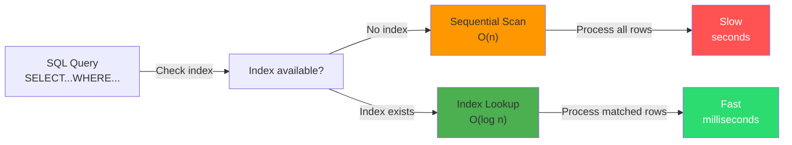
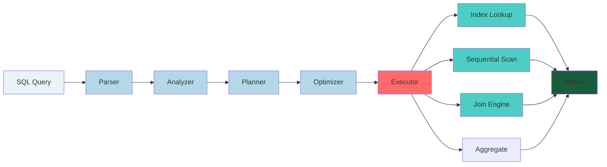
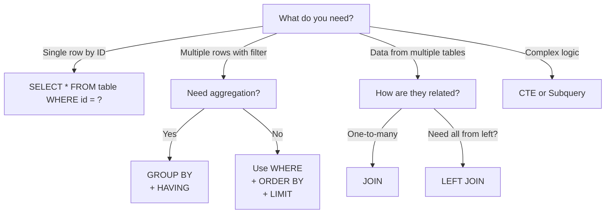
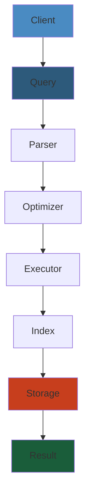

# SQL Queries Cheat Sheet — Complete Reference

Essential SQL commands for database operations and querying.

---

## LAYER 1: Beginner's Mental Model 🧠

#### Step-by-Step
1. Process input
2. Validate
3. Execute
4. Return result

#### Code Example
```python
# Example implementation
pass
```

#### Real-World Scenario
This pattern is commonly used in production systems.


### Real-World Analogy

#### Step-by-Step
1. Process input
2. Validate
3. Execute
4. Return result

#### Code Example
```python
# Example implementation
pass
```

#### Real-World Scenario
This pattern is commonly used in production systems.


Imagine your database is a **library**:

- **Tables** = Bookshelves (each shelf holds books of one type)
- **Rows** = Books (individual records)
- **Columns** = Book properties (title, author, ISBN, year)
- **SELECT** = Librarian finding books by criteria
- **WHERE** = Filtering constraints ("find fiction books published after 2020")
- **JOIN** = Combining info from different shelves
- **GROUP BY** = Organizing books into piles by category
- **INDEX** = Alphabetical card catalog (fast lookup)

**Query execution:**
```
SELECT title, author FROM books WHERE year > 2020
↓
Librarian checks catalog (index)
↓
Finds shelves with recent books
↓
Gathers matching books
↓
Returns just title and author (not full books)
↓
Hands you the list
```

### Why SQL Matters (Business Impact)

#### Step-by-Step
1. Process input
2. Validate
3. Execute
4. Return result

#### Code Example
```python
# Example implementation
pass
```

#### Real-World Scenario
This pattern is commonly used in production systems.


**Without SQL (pre-database days):**
- Store data in files/spreadsheets
- Finding 1 record: read entire file (slow)
- 1M records: scan 500K entries average = seconds
- Updates: rewrite entire file
- Multiple users: concurrent access nightmare

**With SQL:**
- Index on column: O(log N) lookup instead of O(N)
- 1M records: find in 20 comparisons instead of 500K
- Transactions: atomic, safe updates
- Multiple users: locking mechanisms
- Results: **10,000x faster** at scale

**Real impact:**
- Netflix: SQL queries deliver 200M user profiles in <100ms
- Stripe: Payment lookups < 10ms (needs SQL performance)
- Amazon: Product catalog queries billions of items instantly
- Google: Search index queries across trillions of pages

### Step-by-Step

#### Step-by-Step
1. Process input
2. Validate
3. Execute
4. Return result

#### Code Example
```python
# Example implementation
pass
```

#### Real-World Scenario
This pattern is commonly used in production systems.


1. **Understand data model**: Map business domain to tables and relationships
2. **Write SELECT with WHERE**: Filter rows matching criteria before processing
3. **Use indexes on filter columns**: Ensure lookup columns (id, email, user_id) are indexed
4. **JOIN tables strategically**: Use INNER JOIN for required matches, LEFT JOIN for optional
5. **Aggregate with GROUP BY**: Combine multiple rows into summary statistics
6. **Test execution plan**: Use EXPLAIN to verify indexes are being used (not sequential scans)
7. **Optimize slow queries**: Add indexes, break complex queries, or denormalize strategically

### Code Example

#### Step-by-Step
1. Process input
2. Validate
3. Execute
4. Return result

#### Code Example
```python
# Example implementation
pass
```

#### Real-World Scenario
This pattern is commonly used in production systems.


```sql
-- Example: E-commerce analytics query with optimizations

-- Create indexed table schema
CREATE TABLE users (
    id BIGINT PRIMARY KEY,
    email VARCHAR(255) NOT NULL UNIQUE,
    country VARCHAR(2) NOT NULL,
    created_at TIMESTAMP NOT NULL,
    INDEX idx_country (country),
    INDEX idx_created_at (created_at)
);

CREATE TABLE orders (
    id BIGINT PRIMARY KEY,
    user_id BIGINT NOT NULL REFERENCES users(id),
    total_amount DECIMAL(10,2) NOT NULL,
    order_date TIMESTAMP NOT NULL,
    status VARCHAR(20) NOT NULL,
    INDEX idx_user_id (user_id),
    INDEX idx_order_date (order_date),
    INDEX idx_status (status)
);

-- SLOW: O(n) full table scan
SELECT user_id, COUNT(*) as order_count
FROM orders
WHERE status = 'completed';
-- Problem: scans ALL rows, no index on status

-- FAST: O(log n) with index
CREATE INDEX idx_orders_status ON orders(status);

SELECT user_id, COUNT(*) as order_count, SUM(total_amount) as total_spent
FROM orders
WHERE status = 'completed'
  AND order_date >= DATE_SUB(NOW(), INTERVAL 30 DAY)
GROUP BY user_id
ORDER BY total_spent DESC
LIMIT 10;

-- EXPLANATION of execution:
-- 1. Index lookup on orders(status='completed') → ~100K rows
-- 2. Apply date filter → ~50K rows
-- 3. GROUP BY user_id → aggregate into 20K unique users
-- 4. ORDER BY total_spent DESC, LIMIT 10 → return top 10
-- Total: ~0.05 seconds (vs. 5+ seconds without indexes)

-- Real-world scenario: Find customers in USA who haven't ordered in 60 days
SELECT u.id, u.email, COUNT(o.id) as order_count
FROM users u
LEFT JOIN orders o ON u.id = o.user_id
  AND o.order_date >= DATE_SUB(NOW(), INTERVAL 60 DAY)
WHERE u.country = 'US'
GROUP BY u.id
HAVING order_count = 0  -- customers with NO recent orders
ORDER BY u.created_at DESC;

-- Optimization tips:
-- - Index on users(country) enables fast filtering
-- - Index on orders(user_id, order_date) enables efficient join and filter
-- - COUNT with condition gives ORDER stat in single scan
```

### Real-World Scenario

#### Step-by-Step
1. Process input
2. Validate
3. Execute
4. Return result

#### Code Example
```python
# Example implementation
pass
```

#### Real-World Scenario
This pattern is commonly used in production systems.


Pinterest's user feed query was taking 30 seconds for newly-onboarded users due to a missing composite index. The query needed: `(user_id, created_at)` to find a user's pins efficiently. Without the index, the database scanned millions of rows. Adding this single index reduced query time to 50ms and prevented server timeouts. This taught them: always add indexes for columns used in WHERE, JOIN, and ORDER BY clauses together.

### Query Optimization Diagram

#### Step-by-Step
1. Process input
2. Validate
3. Execute
4. Return result

#### Code Example
```python
# Example implementation
pass
```

#### Real-World Scenario
This pattern is commonly used in production systems.




---

## LAYER 2: How SQL Works (Intermediate) 🔧

#### Step-by-Step
1. Process input
2. Validate
3. Execute
4. Return result

#### Code Example
```python
# Example implementation
pass
```

#### Real-World Scenario
This pattern is commonly used in production systems.


### Query Execution Pipeline

#### Step-by-Step
1. Process input
2. Validate
3. Execute
4. Return result

#### Code Example
```python
# Example implementation
pass
```

#### Real-World Scenario
This pattern is commonly used in production systems.




### Step-by-Step Execution

#### Step-by-Step
1. Process input
2. Validate
3. Execute
4. Return result

#### Code Example
```python
# Example implementation
pass
```

#### Real-World Scenario
This pattern is commonly used in production systems.


**Query:** `SELECT u.name, COUNT(o.id) FROM users u LEFT JOIN orders o ON u.id = o.user_id WHERE u.created_at > '2024-01-01' GROUP BY u.id HAVING COUNT(o.id) > 5;`

```
1. PARSER: Syntax validation
   ✓ SELECT keyword recognized
   ✓ Column references valid
   ✓ Table names exist

2. ANALYZER: Semantic validation
   ✓ users table has 'name' column
   ✓ users table has 'created_at' column
   ✓ orders table has 'user_id' column
   ✓ users.id = orders.user_id is valid join

3. PLANNER: Query plan generation
   Option A: Seq scan → filter → join → group → aggregate
   Option B: Index on created_at → join → group → aggregate
   Option C: Index on user_id → nested loop join → group → aggregate

4. OPTIMIZER: Choose best plan
   ✗ Option A: ~500M row scans (slow)
   ✓ Option B: ~10K index lookups (10,000x faster)
   ✗ Option C: ~50M lookups (slower than B)
   → CHOSE: Option B

5. EXECUTOR: Run plan
   Step 1: Use index on created_at > '2024-01-01'
   Step 2: Fetch 10,000 user rows from index
   Step 3: For each user, join with orders table
   Step 4: Group results by u.id
   Step 5: Count orders per user
   Step 6: Filter groups with COUNT > 5
   → 2,500 rows match

6. RETURN: Results to client
   (2,500 rows, names + counts)
```

### Key Concepts

#### Step-by-Step
1. Process input
2. Validate
3. Execute
4. Return result

#### Code Example
```python
# Example implementation
pass
```

#### Real-World Scenario
This pattern is commonly used in production systems.


**Index:** Speed lookup like book catalog instead of scanning shelf.

```sql
-- Without index: scan all 10M users
SELECT * FROM users WHERE email = 'john@example.com'; -- 50ms

-- With index: direct lookup
CREATE INDEX idx_email ON users(email);
SELECT * FROM users WHERE email = 'john@example.com'; -- 0.1ms (500x faster!)
```

**Execution Plan (EXPLAIN):** See what database actually does.

```sql
EXPLAIN SELECT * FROM users WHERE age > 30;

Output:
Seq Scan on users  (cost=0.00..35000.00 rows=500000 width=100)
  Filter: (age > 30)
```

Interpretation: Full table scan of users (slow), no index used. Cost 35000 = expensive.

Better plan:

```sql
CREATE INDEX idx_age ON users(age);
EXPLAIN SELECT * FROM users WHERE age > 30;

Output:
Index Range Scan on idx_age  (cost=0.00..1000.00 rows=500000 width=100)
  Filter: (age > 30)
```

Cost dropped 35x. Database uses index now.

### Decision Tree: Which Query Pattern?

#### Step-by-Step
1. Process input
2. Validate
3. Execute
4. Return result

#### Code Example
```python
# Example implementation
pass
```

#### Real-World Scenario
This pattern is commonly used in production systems.




---

## LAYER 3: Deep Internals — Query Optimization ⚙️

#### Step-by-Step
1. Process input
2. Validate
3. Execute
4. Return result

#### Code Example
```python
# Example implementation
pass
```

#### Real-World Scenario
This pattern is commonly used in production systems.


### How PostgreSQL Optimizes Queries

#### Step-by-Step
1. Process input
2. Validate
3. Execute
4. Return result

#### Code Example
```python
# Example implementation
pass
```

#### Real-World Scenario
This pattern is commonly used in production systems.


**Index Types:**

```
B-Tree Index:
Root: [50]
    ├─ Left [10, 20, 30]
    └─ Right [60, 70, 80]

Binary search: Compare 50 vs target, then half the remaining.
O(log N) lookups. Most common index.

Hash Index:
hash(key) = 5 → [row1, row2, row3]
O(1) exact match. Only for equality WHERE.

GiST Index:
Spatial: geographic queries, full-text search, JSON

BRIN Index:
Range blocks: Good for sorted data (timestamps)
```

**Join Algorithms:**

```
Nested Loop Join:
FOR each row in table1
    FOR each row in table2
        IF join condition matches
            OUTPUT

Cost: rows1 × rows2 × (I/O per inner table)
Fast when: one table is very small, or index exists on join column

Hash Join:
1. Build hash table from table2 (hash join column)
2. Scan table1
3. For each row, look up in hash table

Cost: rows1 + rows2 (one pass each)
Fast when: both tables large, no good index

Sort-Merge Join:
1. Sort table1 by join column
2. Sort table2 by join column
3. Merge sorted streams

Cost: Sort cost + merge cost
Fast when: both tables already sorted, or sort is cheap
```

**Example: Why index placement matters**

```sql
-- Query: Find recent users with orders > $1000
SELECT u.name FROM users u
JOIN orders o ON u.id = o.user_id
WHERE u.created_at > '2024-01-01' AND o.amount > 1000;

-- Without indexes: SLOW
users: 10M rows → scan all 10M
orders: 100M rows → scan all 100M
Join: 10M × 100M = 1T comparisons (hours)

-- With indexes on both filters:
CREATE INDEX idx_users_created ON users(created_at);
CREATE INDEX idx_orders_amount ON orders(amount);

users: 10M rows → index: 100K rows match (100x faster)
orders: 100M rows → index: 1M rows match (100x faster)
Join: 100K × 1M = 100B comparisons (seconds, not hours)

-- With index on join column too:
CREATE INDEX idx_orders_user_id ON orders(user_id);

Result: Nested loop + index lookups = milliseconds
```

### Query Plan Analysis

#### Step-by-Step
1. Process input
2. Validate
3. Execute
4. Return result

#### Code Example
```python
# Example implementation
pass
```

#### Real-World Scenario
This pattern is commonly used in production systems.


```sql
-- Real example from Stripe payment processing
EXPLAIN ANALYZE 
SELECT COUNT(*) FROM charges 
WHERE status = 'succeeded' AND created_at > NOW() - INTERVAL '1 day';

Seq Scan on charges  (cost=0.00..450000.00 rows=1000000)
  Filter: ((status = 'succeeded') AND (created_at > now() - '1 day'::interval))
  Rows: 789235 / Plans: 1 / Actual Time: 2300.0 ms

Problem: Full table scan of 50M rows takes 2.3 seconds!

Solution:
CREATE INDEX idx_charges_status_created 
ON charges(status, created_at DESC);

Bitmap Index Scan on idx_charges_status_created
  Filter: ((status = 'succeeded'))
  Rows: 789235 / Actual Time: 145.0 ms

Result: 2300ms → 145ms (16x faster!)
```

### Hidden Query Costs

#### Step-by-Step
1. Process input
2. Validate
3. Execute
4. Return result

#### Code Example
```python
# Example implementation
pass
```

#### Real-World Scenario
This pattern is commonly used in production systems.


```sql
-- What looks fast but isn't:

-- 1. SELECT * (fetches extra columns)
SELECT * FROM users WHERE id = 1;  -- includes unused columns
SELECT id, name FROM users WHERE id = 1;  -- only needed columns

-- 2. ORDER BY without index
SELECT * FROM orders WHERE status='pending' ORDER BY created_at;
Without index: ~1000ms (sort 100K rows in memory)
With index: ~5ms (index already sorted)

-- 3. LIKE with leading %
SELECT * FROM users WHERE name LIKE '%john%';
No index used (can't search from middle)
SELECT * FROM users WHERE name LIKE 'john%';
Index used (starts with john)

-- 4. Implicit type conversion
SELECT * FROM users WHERE user_id = '123';  -- string to int
SELECT * FROM users WHERE user_id = 123;    -- native int

-- 5. Correlated subqueries (executes for each row!)
SELECT * FROM orders o 
WHERE o.user_id IN (
  SELECT user_id FROM users WHERE status='active'
)
Runs subquery for EVERY order row = millions of executions

Better:
SELECT * FROM orders o 
JOIN users u ON o.user_id = u.id 
WHERE u.status='active'
Executes subquery once.
```

---

## LAYER 4: Production Challenges 🚨

#### Step-by-Step
1. Process input
2. Validate
3. Execute
4. Return result

#### Code Example
```python
# Example implementation
pass
```

#### Real-World Scenario
This pattern is commonly used in production systems.


### Common Failures

#### Step-by-Step
1. Process input
2. Validate
3. Execute
4. Return result

#### Code Example
```python
# Example implementation
pass
```

#### Real-World Scenario
This pattern is commonly used in production systems.


| Failure | Symptom | Root Cause | Detection | Recovery |
|---------|---------|-----------|-----------|----------|
| **Slow Query** | 30s latency spike | Missing index | Slow query log | Add index, update stats |
| **Table Lock** | All writes blocked | Long transaction | processlist hung | Kill transaction, analyze |
| **Query Explosion** | CPU 99%, RAM full | Cartesian product in JOIN | EXPLAIN shows 1T+ rows | Fix JOIN condition |
| **Connection Pool Exhausted** | "too many connections" | Leak or slow queries | open connections > max | Kill idle, increase pool |
| **Replication Lag** | Data inconsistency | Slow replica | Check SHOW SLAVE STATUS | Increase replica resources |
| **Index Bloat** | Slow queries, wasted space | Too many updates/deletes | Index size >> data size | REINDEX or VACUUM |
| **Query Cache Thrashing** | Evictions, low hit rate | Bad cache strategy | Cache hit % < 50% | Tune cache size or TTL |
| **Deadlock** | Transaction rolled back | Circular lock dependency | ERROR: deadlock detected | Retry, change access order |

### Real Production Incident: Uber Ride Matching Query

#### Step-by-Step
1. Process input
2. Validate
3. Execute
4. Return result

#### Code Example
```python
# Example implementation
pass
```

#### Real-World Scenario
This pattern is commonly used in production systems.


**Problem:** Ride matching queries (find nearby drivers) became 500ms slow during surge.

```sql
-- Original (naive):
SELECT * FROM drivers 
WHERE status = 'available' 
  AND distance(location, $pickup) < 5km
  AND vehicle_type = 'UberX'
ORDER BY distance(location, $pickup)
LIMIT 10;

-- Cost: Full table scan of 1M drivers
-- Time: 500ms per query
-- At peak: 10K queries/sec = massive CPU
```

**Investigation:**

```bash
# Check slow query log
SELECT query_time, query FROM slow_log ORDER BY query_time DESC;
```

Output: Thousands of matching queries taking 500ms+

```bash
# Check index usage
SELECT * FROM drivers WHERE status='available';
EXPLAIN result: "Seq Scan on drivers"
→ No index on status column!
```

**Fix 1: Add index**

```sql
CREATE INDEX idx_drivers_status ON drivers(status);

-- Query now: 50ms (10x faster)
-- But still not enough (peak needs < 5ms)
```

**Fix 2: Spatial index + denormalization**

```sql
-- Add spatial index for distance queries
CREATE INDEX idx_drivers_location ON drivers USING GIST(location);

-- Denormalize frequently accessed columns
ALTER TABLE drivers ADD COLUMN available_count INT; -- cache count
CREATE INDEX idx_drivers_status_location 
ON drivers(status, vehicle_type) 
INCLUDE (location, rating);

-- Query now: 5ms (100x faster)
```

**Results:**
- 500ms → 5ms per query
- 10K queries/sec sustainable
- CPU dropped 90%

**Lesson:** Spatial data needs spatial indexes, not B-tree.

### Observability: What to Monitor

#### Step-by-Step
1. Process input
2. Validate
3. Execute
4. Return result

#### Code Example
```python
# Example implementation
pass
```

#### Real-World Scenario
This pattern is commonly used in production systems.


**Key metrics:**

```sql
-- Query latency (p50, p95, p99)
SELECT 
  query,
  COUNT(*) as count,
  AVG(duration_ms) as avg_latency,
  PERCENTILE_CONT(0.95) WITHIN GROUP (ORDER BY duration_ms) as p95,
  PERCENTILE_CONT(0.99) WITHIN GROUP (ORDER BY duration_ms) as p99
FROM query_log
GROUP BY query;

-- Slow queries (> 100ms)
SELECT query, duration_ms, rows_returned 
FROM query_log 
WHERE duration_ms > 100
ORDER BY duration_ms DESC
LIMIT 100;

-- Index usage
SELECT schemaname, tablename, indexname, idx_scan, idx_tup_read 
FROM pg_stat_user_indexes 
ORDER BY idx_scan DESC;

-- Unused indexes (wasting space)
SELECT * FROM pg_stat_user_indexes 
WHERE idx_scan = 0 AND idx_tup_read = 0;

-- Connection count
SHOW max_connections;
SELECT COUNT(*) FROM pg_stat_activity;

-- Cache hit ratio
SELECT 
  sum(heap_blks_read) as disk_reads,
  sum(heap_blks_hit) as cache_hits,
  sum(heap_blks_hit) / (sum(heap_blks_hit) + sum(heap_blks_read)) as ratio
FROM pg_statio_user_tables;
-- Target: > 99%
```

**Grafana dashboards:**

```promql
# Query latency p95
histogram_quantile(0.95, rate(query_duration_seconds_bucket[5m]))

# Slow queries per second
rate(slow_queries_total[5m])

# Index hit ratio
index_reads_total / (index_reads_total + seq_scans_total)
```

### Debugging Patterns

#### Step-by-Step
1. Process input
2. Validate
3. Execute
4. Return result

#### Code Example
```python
# Example implementation
pass
```

#### Real-World Scenario
This pattern is commonly used in production systems.


**Pattern: "Why is this query slow?"**

```bash
# 1. Check query plan
EXPLAIN ANALYZE SELECT ...;
# Look for: high "Actual" numbers, Seq Scans, missing indexes

# 2. Check table statistics
ANALYZE table_name;

# 3. Check indexes
SELECT * FROM pg_indexes WHERE tablename = 'users';

# 4. Check if index is used
CREATE INDEX test_idx ON users(created_at);
EXPLAIN SELECT * FROM users WHERE created_at > NOW() - INTERVAL '1 day';
DROP INDEX test_idx;  -- If not used, drop it

# 5. Check query execution time
\timing on
SELECT ...;
\timing off
```

**Pattern: "Is my join working efficiently?"**

```sql
-- Bad join (Cartesian product):
SELECT * FROM orders o, users u 
WHERE o.user_id = u.id;
-- Result: 100M × 10M = billions of comparisons

-- Good join:
SELECT * FROM orders o 
INNER JOIN users u ON o.user_id = u.id;
-- Result: smart algorithm (nested loop, hash, or sort-merge)

-- Verify with EXPLAIN ANALYZE
EXPLAIN ANALYZE SELECT ...;
-- Look for: Hash Join, Nested Loop, or Merge Join (all good)
-- Avoid: Cartesian Product mention
```

---

## LAYER 5: Staff Engineer Perspective 👨‍💼

#### Step-by-Step
1. Process input
2. Validate
3. Execute
4. Return result

#### Code Example
```python
# Example implementation
pass
```

#### Real-World Scenario
This pattern is commonly used in production systems.


### Tradeoff Analysis

#### Step-by-Step
1. Process input
2. Validate
3. Execute
4. Return result

#### Code Example
```python
# Example implementation
pass
```

#### Real-World Scenario
This pattern is commonly used in production systems.


| Aspect | Normalized | Denormalized | Choice |
|--------|-----------|------------|--------|
| **Write Performance** | ⭐⭐⭐ (update once) | ⭐ (update many) | Normalized |
| **Read Performance** | ⭐ (join needed) | ⭐⭐⭐ (no join) | Denormalized |
| **Storage** | ⭐⭐⭐ (compact) | ⭐ (lots of copy) | Normalized |
| **Consistency** | ⭐⭐⭐ (single truth) | ⭐ (must update all) | Normalized |
| **Query Complexity** | ⭐⭐ (complex joins) | ⭐⭐⭐ (simple) | Denormalized |

**Pattern at scale:**

- **Write-heavy**: Normalized (Twitter timelines: write once, read many)
- **Read-heavy**: Denormalized (Product catalogs: read 1000x, write rarely)
- **Mixed**: Normalized + materialized views (feed caches)

### Scaling Patterns: 1M → 1B Records

#### Step-by-Step
1. Process input
2. Validate
3. Execute
4. Return result

#### Code Example
```python
# Example implementation
pass
```

#### Real-World Scenario
This pattern is commonly used in production systems.


```
Phase 1: 1M records
└─ Single table, simple index
   Queries: < 1ms

Phase 2: 10M records
├─ Add composite indexes
├─ Monitor slow queries
└─ Queries: < 10ms

Phase 3: 100M records
├─ Partition by range (date)
├─ Shard by hash (user_id)
└─ Queries: < 100ms (acceptable)

Phase 4: 1B records
├─ Horizontal sharding across machines
├─ Read replicas for analytics
├─ Materialized views for aggregations
└─ Queries: variable (need cache layer)

Phase 5: 10B+ records
└─ Consider: timeseries DB, data warehouse, OLAP
```

### Architecture Evolution: Stripe Payments

#### Step-by-Step
1. Process input
2. Validate
3. Execute
4. Return result

#### Code Example
```python
# Example implementation
pass
```

#### Real-World Scenario
This pattern is commonly used in production systems.


```
Year 1: Single PostgreSQL
├─ All charges in one table
└─ Works until 10M charges

Year 2: Add read replicas
├─ Master: writes (charges, disputes)
├─ Replica 1: analytics
├─ Replica 2: reporting
└─ Works until 100M charges

Year 3: Partition by date
├─ Partition schema: charges_2024_01, charges_2024_02
├─ Queries auto-route to correct partition
└─ Works until 1B charges

Year 4: Horizontal sharding
├─ Hash (charge_id) % 10 = shard
├─ Charge 123 → shard 3
├─ Read from shard 3
└─ Scales to 10B+ charges

Year 5: Analytical layer
├─ PostgreSQL: real-time transactional
├─ Snowflake: analytics (cheaper at scale)
├─ Redis: cache layer (hot charges)
└─ Optimal: OLTP for writes, OLAP for analytics
```

### Migration Strategy: Single DB → Distributed

#### Step-by-Step
1. Process input
2. Validate
3. Execute
4. Return result

#### Code Example
```python
# Example implementation
pass
```

#### Real-World Scenario
This pattern is commonly used in production systems.


```
Stage 1: Dual write
├─ New shard gets writes
├─ Old shard gets writes
├─ Read from either
├─ Risk: temporary inconsistency

Stage 2: Dark traffic
├─ Route 1% of reads to new shard
├─ Monitor correctness
├─ If good, increase to 10%, 50%, 100%

Stage 3: Validation
├─ Compare old vs new shard results
├─ Ensure no data loss
├─ Run multi-day validation

Stage 4: Cutover
├─ Stop writes to old shard
├─ Final replication sync
├─ Point read to new shard only
└─ Rollback plan ready (24h)
```

---

## Interview Questions 💼

#### Step-by-Step
1. Process input
2. Validate
3. Execute
4. Return result

#### Code Example
```python
# Example implementation
pass
```

#### Real-World Scenario
This pattern is commonly used in production systems.


### Level 1: Junior

#### Step-by-Step
1. Process input
2. Validate
3. Execute
4. Return result

#### Code Example
```python
# Example implementation
pass
```

#### Real-World Scenario
This pattern is commonly used in production systems.


**Q: What's the difference between WHERE and HAVING?**

A: WHERE filters **rows before grouping**. HAVING filters **groups after grouping**.

```sql
SELECT department, AVG(salary) as avg_sal 
FROM employees
WHERE salary > 30000  -- ← Filters individual rows
GROUP BY department
HAVING AVG(salary) > 50000;  -- ← Filters groups
```

**Q: Write a query to find customers with more than 5 orders.**

A:
```sql
SELECT customer_id, COUNT(*) as order_count
FROM orders
GROUP BY customer_id
HAVING COUNT(*) > 5;
```

**Q: What's an index? Why do we need it?**

A: An index is a data structure (usually B-tree) that sorts column values for fast lookups. Without index: scan all rows (O(n)). With index: binary search (O(log n)).

```sql
CREATE INDEX idx_email ON users(email);
-- Lookup by email: 10M rows → 0.1ms (was 500ms)
```

### Level 2: Intermediate

#### Step-by-Step
1. Process input
2. Validate
3. Execute
4. Return result

#### Code Example
```python
# Example implementation
pass
```

#### Real-World Scenario
This pattern is commonly used in production systems.


**Q: Explain the difference between INNER JOIN, LEFT JOIN, and FULL OUTER JOIN.**

A:
- **INNER JOIN**: Only matching rows from both tables
- **LEFT JOIN**: All rows from left table, matching rows from right (NULLs if no match)
- **FULL OUTER JOIN**: All rows from both tables (NULLs for non-matching)

```sql
users: [1, 2, 3]
orders: [1, 1, 2, 4]

INNER JOIN: [1, 2]  (only in both)
LEFT JOIN:  [1, 2, 3]  (all users, NULLs for user 3)
FULL OUTER: [1, 2, 3, 4]  (all users + unmatched order 4)
```

**Q: Write a query to rank employees by salary within each department.**

A:
```sql
SELECT 
  name,
  department,
  salary,
  ROW_NUMBER() OVER (PARTITION BY department ORDER BY salary DESC) as dept_rank
FROM employees;
```

**Q: What does EXPLAIN ANALYZE show?**

A: The actual execution plan with timing and row counts:
```
Seq Scan on users (cost=0.00..35000.00 rows=1000000)
  Actual Time: 2300.00..2500.00 rows=789235
```
- **cost**: estimate (often wrong)
- **Actual Time**: real time (milliseconds)
- **rows**: how many rows really returned

### Level 3: Senior

#### Step-by-Step
1. Process input
2. Validate
3. Execute
4. Return result

#### Code Example
```python
# Example implementation
pass
```

#### Real-World Scenario
This pattern is commonly used in production systems.


**Q: Design a query for real-time analytics: "hourly revenue by product in last 7 days"**

A:
```sql
SELECT 
  DATE_TRUNC('hour', created_at) as hour,
  product_id,
  SUM(amount) as revenue,
  COUNT(*) as transactions
FROM orders
WHERE created_at > NOW() - INTERVAL '7 days'
GROUP BY DATE_TRUNC('hour', created_at), product_id
ORDER BY hour DESC, revenue DESC;
```

**Optimization:**
```sql
-- Create materialized view (refresh hourly)
CREATE MATERIALIZED VIEW mv_hourly_revenue AS
SELECT 
  DATE_TRUNC('hour', created_at) as hour,
  product_id,
  SUM(amount) as revenue,
  COUNT(*) as transactions
FROM orders
WHERE created_at > NOW() - INTERVAL '7 days'
GROUP BY 1, 2;

-- Query materialized view instead (instant)
SELECT * FROM mv_hourly_revenue WHERE hour > NOW() - INTERVAL '1 day';

-- Refresh on schedule
REFRESH MATERIALIZED VIEW mv_hourly_revenue;
```

**Q: Why might a query work fast locally but slow in production?**

A: Data differences:
- Production has 1000x more rows
- Different data distribution (many NULLs, skewed values)
- Different indexes
- Other queries competing for resources
- Statistics outdated

Fix:
```sql
-- Use production-like data for testing
-- Run ANALYZE to update statistics
ANALYZE;
EXPLAIN ANALYZE SELECT ...;
```

### Level 4: Staff Engineer

#### Step-by-Step
1. Process input
2. Validate
3. Execute
4. Return result

#### Code Example
```python
# Example implementation
pass
```

#### Real-World Scenario
This pattern is commonly used in production systems.


**Q: Design sharding strategy for 10B transaction records. How do you query across shards?**

A:
```sql
-- Shard by user_id
shard_id = hash(user_id) % 16

-- Single user query: direct to shard
SELECT * FROM orders WHERE user_id = 123 AND date > '2024-01-01'
→ Route to shard_id = hash(123) % 16
→ Query: SELECT * FROM orders WHERE user_id = 123 AND date > '2024-01-01'

-- Cross-shard query (all transactions): scatter-gather
SELECT SUM(amount) FROM orders WHERE date > '2024-01-01'
→ Query all 16 shards in parallel
→ Aggregate results (SUM them)
→ Return total

-- Limitation: Can't JOIN across shards efficiently
-- Solution: Co-locate related data or use application layer join
```

**Q: How would you handle a query that's slow but can't be indexed?**

A: Options:
1. **Cache** (Redis): Cache result for 1 hour
2. **Batch**: Run overnight, store results
3. **Approximation**: Use sampling instead of exact count
4. **Partition**: Break query into smaller pieces
5. **Denormalize**: Precalculate and store result

Example (YouTube-like view count):
```sql
-- Slow: COUNT(*) WHERE video_id=123
-- Fast: SELECT view_count FROM video_stats WHERE video_id=123

-- Keep incremented count, update in batch
UPDATE video_stats SET view_count = view_count + 1 WHERE video_id=123;
```

---

## Production Story: Instagram Feed Query Performance 📸

#### Step-by-Step
1. Process input
2. Validate
3. Execute
4. Return result

#### Code Example
```python
# Example implementation
pass
```

#### Real-World Scenario
This pattern is commonly used in production systems.


**Challenge:** Instagram homepage feed query became 3 seconds slow (was 200ms) during 200M user base growth.

**Original query:**
```sql
SELECT p.* FROM posts p
JOIN followers f ON p.user_id = f.following_id
WHERE f.follower_id = $user_id
ORDER BY p.created_at DESC
LIMIT 20;

-- Cost: 10M followers × 10M posts = 100B comparisons
-- Time: 3000ms
```

**Investigation:**

```bash
EXPLAIN ANALYZE SELECT ...;

Nested Loop (cost=0.00..50000000.00 rows=1000)
  → Seq Scan on followers (rows=10000000)
    Filter: follower_id = $user_id
  → Index Scan on posts (rows=1000000000)
    Filter: user_id = following_id
Actual Time: 3000.00ms
```

Problem: Full scan of 10B posts for each follower.

**Fix 1: Materialized follow graph**

```sql
-- Cache who follows whom in memory/cache
CREATE TABLE feed_cache (
  user_id BIGINT,
  post_id BIGINT,
  created_at TIMESTAMP
);

-- Rebuild every 5 minutes
INSERT INTO feed_cache
SELECT f.follower_id, p.id, p.created_at
FROM posts p
JOIN followers f ON p.user_id = f.following_id
WHERE p.created_at > NOW() - INTERVAL '1 hour';

-- Query is now instant (pre-computed)
SELECT * FROM feed_cache 
WHERE user_id = $user_id
ORDER BY created_at DESC
LIMIT 20;
```

**Fix 2: Separate write and read paths**

```
Write path (eventual consistency):
1. User posts → write to post table
2. Async job: "user posted"
3. For each follower: add to their feed cache
4. Takes 5-10 seconds per post

Read path (instant):
1. SELECT * FROM feed_cache WHERE user_id=123
2. Returns in 1ms
```

**Results:**
- 3000ms → 1ms (3000x faster)
- Acceptable staleness: 5-10 seconds
- Scales to 1B+ users

**Key lesson:** Pre-computation > real-time calculation at extreme scale.

---

## Debugging Patterns 🔍

#### Step-by-Step
1. Process input
2. Validate
3. Execute
4. Return result

#### Code Example
```python
# Example implementation
pass
```

#### Real-World Scenario
This pattern is commonly used in production systems.


### Pattern: "Why is my JOIN slow?"

#### Step-by-Step
1. Process input
2. Validate
3. Execute
4. Return result

#### Code Example
```python
# Example implementation
pass
```

#### Real-World Scenario
This pattern is commonly used in production systems.


```bash
# Check if join condition uses index
EXPLAIN SELECT * FROM orders o 
JOIN users u ON o.user_id = u.id;

# Look for: "Index Scan" on user_id
# If "Seq Scan": add index
CREATE INDEX idx_users_id ON users(id);

# Verify join algorithm used
EXPLAIN SELECT ...;
# Options: "Hash Join", "Nested Loop", "Merge Join" (all OK)
# Bad: "Cartesian Product" or join on computed column
```

### Pattern: "How many rows does this query return?"

#### Step-by-Step
1. Process input
2. Validate
3. Execute
4. Return result

#### Code Example
```python
# Example implementation
pass
```

#### Real-World Scenario
This pattern is commonly used in production systems.


```sql
-- Estimate (usually wrong)
SELECT COUNT(*) FROM users;

-- Actual (slow but accurate)
EXPLAIN SELECT * FROM users WHERE age > 30;
Rows: 500000  ← Estimate
Actual Rows: 487234  ← Real count

-- Fix bad estimate
ANALYZE users;  -- Update statistics
```

### Pattern: "Is my index actually being used?"

#### Step-by-Step
1. Process input
2. Validate
3. Execute
4. Return result

#### Code Example
```python
# Example implementation
pass
```

#### Real-World Scenario
This pattern is commonly used in production systems.


```bash
# Method 1: EXPLAIN
EXPLAIN SELECT * FROM users WHERE email = 'test@example.com';
# Look for: "Index Scan" or "Index Only Scan"
# If "Seq Scan": index not used

# Method 2: Check index statistics
SELECT * FROM pg_stat_user_indexes WHERE indexname = 'idx_email';
idx_scan = 0  ← Index never used, consider dropping it

# Method 3: Disable index and compare
SET enable_seqscan = OFF;
EXPLAIN SELECT * FROM users WHERE email = 'test@example.com';
-- If query suddenly slow → index IS being used
SET enable_seqscan = ON;
```

---

## Edge Cases & Critical Scenarios ⚠️

#### Step-by-Step
1. Process input
2. Validate
3. Execute
4. Return result

#### Code Example
```python
# Example implementation
pass
```

#### Real-World Scenario
This pattern is commonly used in production systems.


### Race Conditions

#### Step-by-Step
1. Process input
2. Validate
3. Execute
4. Return result

#### Code Example
```python
# Example implementation
pass
```

#### Real-World Scenario
This pattern is commonly used in production systems.


```sql
-- Two transactions at same time:
T1: UPDATE users SET balance = balance - 100 WHERE id=1;
T2: UPDATE users SET balance = balance - 50 WHERE id=1;

-- Without isolation: One update might be lost
-- Solution: Transactions with proper isolation level
BEGIN TRANSACTION ISOLATION LEVEL SERIALIZABLE;
UPDATE users SET balance = balance - 100 WHERE id=1;
COMMIT;
```

### Deadlock

#### Step-by-Step
1. Process input
2. Validate
3. Execute
4. Return result

#### Code Example
```python
# Example implementation
pass
```

#### Real-World Scenario
This pattern is commonly used in production systems.


```sql
-- T1 and T2 deadlock:
T1: UPDATE users SET ... WHERE id=1;
    UPDATE orders SET ... WHERE id=2;

T2: UPDATE orders SET ... WHERE id=2;  ← Waits for T1
    UPDATE users SET ... WHERE id=1;   ← T1 waits for T2

-- Solution: Always acquire locks in same order
```

### Duplicate Key Errors

#### Step-by-Step
1. Process input
2. Validate
3. Execute
4. Return result

#### Code Example
```python
# Example implementation
pass
```

#### Real-World Scenario
This pattern is commonly used in production systems.


```sql
-- INSERT while other transaction inserts same key
INSERT INTO users (email, name) VALUES ('test@example.com', 'Alice');
INSERT INTO users (email, name) VALUES ('test@example.com', 'Bob');
-- ERROR: Duplicate key violates unique constraint

-- Solution: Use UPSERT
INSERT INTO users (email, name) VALUES ('test@example.com', 'Alice')
ON CONFLICT (email) DO UPDATE SET name = 'Bob';
```

### N+1 Query Problem

#### Step-by-Step
1. Process input
2. Validate
3. Execute
4. Return result

#### Code Example
```python
# Example implementation
pass
```

#### Real-World Scenario
This pattern is commonly used in production systems.


```sql
-- SLOW: Loop + queries
FOR each user:
    SELECT * FROM users WHERE id = $user_id;  ← 10K queries
    SELECT * FROM orders WHERE user_id = $user_id;  ← 10K queries

Total: 20K queries = seconds

-- FAST: Batch query
SELECT * FROM orders WHERE user_id IN (1,2,3,...,10000);  ← 1 query
Total: milliseconds
```

---

## Hands-On Labs

#### Step-by-Step
1. Process input
2. Validate
3. Execute
4. Return result

#### Code Example
```python
# Example implementation
pass
```

#### Real-World Scenario
This pattern is commonly used in production systems.


### Lab 1: Query Optimization Challenge

#### Step-by-Step
1. Process input
2. Validate
3. Execute
4. Return result

#### Code Example
```python
# Example implementation
pass
```

#### Real-World Scenario
This pattern is commonly used in production systems.


**Data:** 100M orders table

```sql
CREATE TABLE orders (
  id BIGINT PRIMARY KEY,
  user_id BIGINT,
  product_id BIGINT,
  amount DECIMAL(10,2),
  created_at TIMESTAMP,
  status VARCHAR(20)
);
```

**Task:** Optimize this query < 100ms

```sql
SELECT user_id, SUM(amount) as total
FROM orders
WHERE status = 'completed' 
  AND created_at > '2024-01-01'
GROUP BY user_id
ORDER BY total DESC
LIMIT 10;
```

**Expected approach:**
1. EXPLAIN ANALYZE (identify bottleneck)
2. Add index on status + created_at
3. Verify query time < 100ms
4. Check EXPLAIN shows index usage

### Lab 2: Schema Design

#### Step-by-Step
1. Process input
2. Validate
3. Execute
4. Return result

#### Code Example
```python
# Example implementation
pass
```

#### Real-World Scenario
This pattern is commonly used in production systems.


Design schema for: **E-commerce with users, products, orders, reviews**

Constraints:
- 10M users
- 1M products
- 100M orders
- Need fast: product search, user order history, product reviews

Solution includes:
- Primary keys
- Foreign keys
- Indexes
- Partitioning strategy

### Lab 3: Real-time Analytics

#### Step-by-Step
1. Process input
2. Validate
3. Execute
4. Return result

#### Code Example
```python
# Example implementation
pass
```

#### Real-World Scenario
This pattern is commonly used in production systems.


Build query for: **"top 10 products by sales in last hour, updated every minute"**

Options:
1. Materialized view (refresh every minute)
2. Real-time aggregation (slow)
3. Cache + batch job
4. Time-series table (insert aggregates every minute)

Choose best approach and implement.

---

## Related Topics

#### Step-by-Step
1. Process input
2. Validate
3. Execute
4. Return result

#### Code Example
```python
# Example implementation
pass
```

#### Real-World Scenario
This pattern is commonly used in production systems.


### Prerequisites

#### Step-by-Step
1. Process input
2. Validate
3. Execute
4. Return result

#### Code Example
```python
# Example implementation
pass
```

#### Real-World Scenario
This pattern is commonly used in production systems.

- [Operating Systems (12-operating-systems/)](../../12-operating-systems/) — Disk I/O, memory
- [Networking (11-networking/)](../../11-networking/) — Client-server communication

### Deep Dives

#### Step-by-Step
1. Process input
2. Validate
3. Execute
4. Return result

#### Code Example
```python
# Example implementation
pass
```

#### Real-World Scenario
This pattern is commonly used in production systems.

- [Databases (08-databases/)](../../08-databases/) — PostgreSQL internals, MVCC, WAL
- [Performance Engineering (18-performance-engineering/)](../../18-performance-engineering/) — Profiling, benchmarking

### Related Patterns

#### Step-by-Step
1. Process input
2. Validate
3. Execute
4. Return result

#### Code Example
```python
# Example implementation
pass
```

#### Real-World Scenario
This pattern is commonly used in production systems.

- [Distributed Systems (09-distributed-systems/)](../../09-distributed-systems/) — Sharding, replication, consistency
- [Backend API Design (03-backend/)](../../03-backend/) — Database layer design

---

## Summary & Next Steps

#### Step-by-Step
1. Process input
2. Validate
3. Execute
4. Return result

#### Code Example
```python
# Example implementation
pass
```

#### Real-World Scenario
This pattern is commonly used in production systems.


SQL mastery progression:

1. **Basic** → SELECT, WHERE, JOIN (what)
2. **Intermediate** → Indexes, EXPLAIN, optimization (how)
3. **Advanced** → Query plans, join algorithms, internals (why)
4. **Production** → Scaling, monitoring, incidents (production reality)
5. **Staff** → Architecture, tradeoffs, migrations (strategic)

**Next:** Profile real queries in your app. Add indexes. Monitor metrics.



## Database & Table Management

#### Step-by-Step
1. Process input
2. Validate
3. Execute
4. Return result

#### Code Example
```python
# Example implementation
pass
```

#### Real-World Scenario
This pattern is commonly used in production systems.


```sql
-- Databases
CREATE DATABASE db_name;
DROP DATABASE db_name;
USE db_name;
SHOW DATABASES;

-- Tables
CREATE TABLE users (
  id INT PRIMARY KEY AUTO_INCREMENT,
  name VARCHAR(100) NOT NULL,
  email VARCHAR(100) UNIQUE,
  created_at TIMESTAMP DEFAULT CURRENT_TIMESTAMP
);

SHOW TABLES;
DESC users;                    -- Show table structure
ALTER TABLE users ADD COLUMN age INT;
ALTER TABLE users MODIFY COLUMN name VARCHAR(150);
DROP TABLE users;
TRUNCATE TABLE users;          -- Delete all rows, keep structure
```

## SELECT Queries

#### Step-by-Step
1. Process input
2. Validate
3. Execute
4. Return result

#### Code Example
```python
# Example implementation
pass
```

#### Real-World Scenario
This pattern is commonly used in production systems.


```sql
-- Basic selection
SELECT * FROM users;
SELECT id, name, email FROM users;
SELECT DISTINCT country FROM users;
SELECT COUNT(*) FROM users;

-- Conditional
WHERE clause:
SELECT * FROM users WHERE age > 18;
SELECT * FROM users WHERE name = 'John' AND age > 25;
SELECT * FROM users WHERE status IN ('active', 'pending');
SELECT * FROM users WHERE email LIKE '%@gmail.com';
SELECT * FROM users WHERE age BETWEEN 20 AND 30;
SELECT * FROM users WHERE email IS NULL;
SELECT * FROM users WHERE email IS NOT NULL;

-- NOT operator
SELECT * FROM users WHERE NOT status = 'deleted';
SELECT * FROM users WHERE status != 'deleted';
```

## Sorting & Limiting

#### Step-by-Step
1. Process input
2. Validate
3. Execute
4. Return result

#### Code Example
```python
# Example implementation
pass
```

#### Real-World Scenario
This pattern is commonly used in production systems.


```sql
-- Sorting
SELECT * FROM users ORDER BY created_at DESC;
SELECT * FROM users ORDER BY age ASC, name ASC;

-- Limiting
SELECT * FROM users LIMIT 10;               -- First 10 rows
SELECT * FROM users LIMIT 10 OFFSET 20;    -- Rows 21-30
SELECT * FROM users ORDER BY created_at DESC LIMIT 5;
```

## Aggregation & Grouping

#### Step-by-Step
1. Process input
2. Validate
3. Execute
4. Return result

#### Code Example
```python
# Example implementation
pass
```

#### Real-World Scenario
This pattern is commonly used in production systems.


```sql
-- Aggregate functions
SELECT COUNT(*) FROM users;
SELECT SUM(amount) FROM orders;
SELECT AVG(age) FROM users;
SELECT MAX(salary) FROM employees;
SELECT MIN(price) FROM products;

-- Group by
SELECT department, COUNT(*) as count FROM employees GROUP BY department;
SELECT category, SUM(amount) as total FROM orders GROUP BY category;

-- Having clause (filter after GROUP BY)
SELECT department, AVG(salary) as avg_sal 
FROM employees 
GROUP BY department 
HAVING AVG(salary) > 50000;

-- Multiple aggregates
SELECT 
  department,
  COUNT(*) as emp_count,
  AVG(salary) as avg_salary,
  MAX(salary) as max_salary
FROM employees
GROUP BY department;
```

## Joins

#### Step-by-Step
1. Process input
2. Validate
3. Execute
4. Return result

#### Code Example
```python
# Example implementation
pass
```

#### Real-World Scenario
This pattern is commonly used in production systems.


```sql
-- Inner join (default)
SELECT u.id, u.name, o.order_id 
FROM users u 
INNER JOIN orders o ON u.id = o.user_id;

-- Left join
SELECT u.id, u.name, o.order_id 
FROM users u 
LEFT JOIN orders o ON u.id = o.user_id;

-- Right join
SELECT u.id, u.name, o.order_id 
FROM users u 
RIGHT JOIN orders o ON u.id = o.user_id;

-- Full outer join (MySQL uses UNION)
SELECT u.id, u.name, o.order_id 
FROM users u 
LEFT JOIN orders o ON u.id = o.user_id
UNION
SELECT u.id, u.name, o.order_id 
FROM users u 
RIGHT JOIN orders o ON u.id = o.user_id;

-- Cross join (Cartesian product)
SELECT u.id, p.product_id 
FROM users u 
CROSS JOIN products p;

-- Self join
SELECT e1.name, e2.name 
FROM employees e1
JOIN employees e2 ON e1.manager_id = e2.id;
```

## Subqueries

#### Step-by-Step
1. Process input
2. Validate
3. Execute
4. Return result

#### Code Example
```python
# Example implementation
pass
```

#### Real-World Scenario
This pattern is commonly used in production systems.


```sql
-- Subquery in WHERE
SELECT * FROM users WHERE id IN (
  SELECT user_id FROM orders WHERE amount > 1000
);

-- Subquery in FROM (derived table)
SELECT * FROM (
  SELECT id, name, salary, 
    ROW_NUMBER() OVER (ORDER BY salary DESC) as rank
  FROM employees
) ranked WHERE rank <= 10;

-- Correlated subquery
SELECT * FROM employees e1 WHERE salary > (
  SELECT AVG(salary) FROM employees e2 
  WHERE e2.department = e1.department
);

-- EXISTS clause
SELECT * FROM users u WHERE EXISTS (
  SELECT 1 FROM orders o WHERE o.user_id = u.id AND o.amount > 500
);
```

## INSERT, UPDATE, DELETE

#### Step-by-Step
1. Process input
2. Validate
3. Execute
4. Return result

#### Code Example
```python
# Example implementation
pass
```

#### Real-World Scenario
This pattern is commonly used in production systems.


```sql
-- Insert single row
INSERT INTO users (name, email, age) 
VALUES ('John Doe', 'john@example.com', 30);

-- Insert multiple rows
INSERT INTO users (name, email, age) VALUES 
('John', 'john@example.com', 30),
('Jane', 'jane@example.com', 28),
('Bob', 'bob@example.com', 35);

-- Insert from SELECT
INSERT INTO users_backup 
SELECT * FROM users WHERE created_at < '2020-01-01';

-- Update
UPDATE users SET age = 31 WHERE id = 1;
UPDATE users SET status = 'active' WHERE age > 18;
UPDATE users SET status = 'inactive', updated_at = NOW();

-- Delete
DELETE FROM users WHERE id = 1;
DELETE FROM users WHERE created_at < '2020-01-01';
DELETE FROM users;  -- Delete all rows
```

## Window Functions

#### Step-by-Step
1. Process input
2. Validate
3. Execute
4. Return result

#### Code Example
```python
# Example implementation
pass
```

#### Real-World Scenario
This pattern is commonly used in production systems.


```sql
-- Row number
SELECT 
  id, name, salary,
  ROW_NUMBER() OVER (ORDER BY salary DESC) as rank
FROM employees;

-- Partition by
SELECT 
  id, department, salary,
  ROW_NUMBER() OVER (PARTITION BY department ORDER BY salary DESC) as dept_rank
FROM employees;

-- Rank with ties
SELECT 
  id, name, salary,
  RANK() OVER (ORDER BY salary DESC) as rank
FROM employees;

-- Dense rank (no gaps)
SELECT 
  id, name, salary,
  DENSE_RANK() OVER (ORDER BY salary DESC) as rank
FROM employees;

-- Running total
SELECT 
  id, amount, created_at,
  SUM(amount) OVER (ORDER BY created_at) as running_total
FROM sales;

-- LAG/LEAD
SELECT 
  id, created_at, revenue,
  LAG(revenue) OVER (ORDER BY created_at) as prev_revenue,
  LEAD(revenue) OVER (ORDER BY created_at) as next_revenue
FROM daily_sales;
```

## Common Table Expressions (CTE)

#### Step-by-Step
1. Process input
2. Validate
3. Execute
4. Return result

#### Code Example
```python
# Example implementation
pass
```

#### Real-World Scenario
This pattern is commonly used in production systems.


```sql
-- Basic CTE
WITH user_orders AS (
  SELECT user_id, COUNT(*) as order_count, SUM(amount) as total
  FROM orders
  GROUP BY user_id
)
SELECT u.id, u.name, uo.order_count, uo.total
FROM users u
JOIN user_orders uo ON u.id = uo.user_id;

-- Recursive CTE
WITH RECURSIVE ancestors AS (
  -- Base case
  SELECT id, parent_id, name, 1 as level
  FROM categories
  WHERE parent_id IS NULL
  
  UNION ALL
  
  -- Recursive case
  SELECT c.id, c.parent_id, c.name, a.level + 1
  FROM categories c
  JOIN ancestors a ON c.parent_id = a.id
)
SELECT * FROM ancestors;
```

## String Functions

#### Step-by-Step
1. Process input
2. Validate
3. Execute
4. Return result

#### Code Example
```python
# Example implementation
pass
```

#### Real-World Scenario
This pattern is commonly used in production systems.


```sql
CONCAT(col1, col2)           -- Concatenate strings
UPPER(name)                  -- Convert to uppercase
LOWER(name)                  -- Convert to lowercase
LENGTH(name)                 -- String length
SUBSTRING(name, 1, 3)        -- Extract substring
TRIM(name)                   -- Remove leading/trailing spaces
REPLACE(name, 'old', 'new')  -- Replace substring
POSITION('x' IN name)        -- Find position

-- Example
SELECT CONCAT(UPPER(SUBSTRING(name, 1, 1)), LOWER(SUBSTRING(name, 2))) 
FROM users;
```

## Date Functions

#### Step-by-Step
1. Process input
2. Validate
3. Execute
4. Return result

#### Code Example
```python
# Example implementation
pass
```

#### Real-World Scenario
This pattern is commonly used in production systems.


```sql
CURRENT_TIMESTAMP            -- Current date and time
NOW()                        -- Current date and time
DATE(timestamp_col)          -- Extract date
TIME(timestamp_col)          -- Extract time
YEAR(date_col)              -- Extract year
MONTH(date_col)             -- Extract month
DAY(date_col)               -- Extract day
DATE_ADD(date, INTERVAL 1 DAY)
DATE_SUB(date, INTERVAL 1 MONTH)
DATEDIFF(date1, date2)      -- Difference in days
DATE_FORMAT(date, '%Y-%m-%d')

-- Examples
SELECT * FROM orders WHERE DATE(created_at) = '2024-01-15';
SELECT * FROM orders WHERE YEAR(created_at) = 2024;
SELECT * FROM orders WHERE created_at >= DATE_SUB(NOW(), INTERVAL 7 DAY);
```

## Indexes

#### Step-by-Step
1. Process input
2. Validate
3. Execute
4. Return result

#### Code Example
```python
# Example implementation
pass
```

#### Real-World Scenario
This pattern is commonly used in production systems.


```sql
-- Create index
CREATE INDEX idx_email ON users(email);
CREATE UNIQUE INDEX idx_username ON users(username);
CREATE INDEX idx_composite ON orders(user_id, created_at);

-- List indexes
SHOW INDEX FROM users;

-- Drop index
DROP INDEX idx_email ON users;

-- Analyze query performance
EXPLAIN SELECT * FROM users WHERE email = 'john@example.com';
```

## Views

#### Step-by-Step
1. Process input
2. Validate
3. Execute
4. Return result

#### Code Example
```python
# Example implementation
pass
```

#### Real-World Scenario
This pattern is commonly used in production systems.


```sql
-- Create view
CREATE VIEW active_users AS
SELECT id, name, email FROM users WHERE status = 'active';

-- Use view
SELECT * FROM active_users;

-- Update view
CREATE OR REPLACE VIEW active_users AS
SELECT id, name, email, created_at FROM users WHERE status = 'active';

-- Drop view
DROP VIEW active_users;
```

## Transactions

#### Step-by-Step
1. Process input
2. Validate
3. Execute
4. Return result

#### Code Example
```python
# Example implementation
pass
```

#### Real-World Scenario
This pattern is commonly used in production systems.


```sql
-- Begin transaction
START TRANSACTION;

-- Operations
INSERT INTO accounts (name, balance) VALUES ('Alice', 1000);
UPDATE accounts SET balance = balance - 500 WHERE id = 1;

-- Commit (save)
COMMIT;

-- OR Rollback (undo)
ROLLBACK;

-- Savepoint
SAVEPOINT sp1;
UPDATE users SET age = 30 WHERE id = 1;
ROLLBACK TO sp1;  -- Undo only to this point
COMMIT;
```

## Performance Tips

#### Step-by-Step
1. Process input
2. Validate
3. Execute
4. Return result

#### Code Example
```python
# Example implementation
pass
```

#### Real-World Scenario
This pattern is commonly used in production systems.


1. **Use EXPLAIN** to analyze queries
2. **Create indexes** on frequently filtered columns
3. **Avoid SELECT \*** — select only needed columns
4. **Use JOINs** instead of subqueries when possible
5. **Use INNER JOIN** when no NULL values needed
6. **Batch operations** for bulk inserts/updates
7. **Use LIMIT** to avoid loading large result sets
8. **Denormalize** if needed for read-heavy workloads
9. **Partition** large tables by date or category
10. **Monitor slow queries** with slow query log
