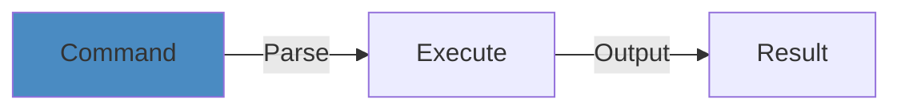

# System Design Numbers Cheat Sheet


## Overview





Key quantities and capacity estimates for system design interviews and production planning.

## Storage Units


| Unit | Size |
|------|------|
| 1 Byte | 8 bits |
| 1 KB | 10³ Bytes |
| 1 MB | 10⁶ Bytes |
| 1 GB | 10⁹ Bytes |
| 1 TB | 10¹² Bytes |
| 1 PB | 10¹⁵ Bytes |

## Network Bandwidth


| Type | Speed |
|------|-------|
| 1 Mbps | 125 KB/sec |
| 10 Mbps | 1.25 MB/sec |
| 100 Mbps | 12.5 MB/sec |
| 1 Gbps | 125 MB/sec |
| 10 Gbps | 1.25 GB/sec |

## Time Units (in seconds)


| Unit | Seconds |
|------|---------|
| 1 millisecond (ms) | 10⁻³ |
| 1 microsecond (μs) | 10⁻⁶ |
| 1 nanosecond (ns) | 10⁻⁹ |

## Typical QPS (Queries Per Second)


| Service | Typical QPS | Peak QPS |
|---------|-------------|----------|
| Small startup | 100-1,000 | 1,000-10,000 |
| Medium web service | 10,000-100,000 | 100,000-1,000,000 |
| Large-scale service (Facebook, Google) | 1M+ | 10M+ |
| Real-time systems | Variable | Bursty |

## Users & Requests


### Daily Active Users (DAU) to QPS


```
1 million DAU ≈ 12 QPS (if evenly distributed)
10 million DAU ≈ 120 QPS
100 million DAU ≈ 1,200 QPS
1 billion DAU ≈ 12,000 QPS
```

**Conversion factor**: DAU × average requests per user per day / 86,400 seconds

### Traffic Patterns


- Peak traffic: 2-3x average
- Burst: 5-10x average
- Plan capacity for peak + 50% headroom

## Database Numbers


### Storage Estimation


**User profile (1M users)**
- Per user: ~2 KB (ID, name, email, metadata)
- Total: 2 GB

**Social media posts (100M users, 10 posts/user/year)**
- Per post: ~1 KB (ID, timestamp, content, metadata)
- Per year: 1 billion posts = 1 TB
- 10 years: 10 TB

**Logs/metrics (1M requests/sec)**
- Per request log: ~500 bytes
- Per second: 500 MB
- Per day: 43 TB
- Per month: 1.3 PB

### Query Performance Targets


| Operation | Target Latency |
|-----------|-----------------|
| Database lookup (indexed) | 1-10 ms |
| Database query (full scan) | 100-1000 ms |
| Cache hit | <1 ms |
| Cache miss + DB | 10-50 ms |

### Replication & Sharding


**Master-Slave Replication**
- Replication lag: 10-100 ms (LAN)
- Replication lag: 100-1000 ms (WAN)

**Database Sharding**
- Shard key distribution: < 10% skew acceptable
- Resharding time: hours to days (depending on size)

## Cache Numbers


### Cache Performance


| Cache Type | Hit Ratio | Latency |
|-----------|-----------|---------|
| CPU L1 cache | N/A | 4 cycles (~1 ns) |
| CPU L2 cache | N/A | 10 cycles (~3 ns) |
| CPU L3 cache | N/A | 40-75 cycles (~15 ns) |
| RAM | N/A | 100-300 cycles (~100 ns) |
| Disk SSD | 80-95% | 1-10 ms |
| Memcached/Redis | 95%+ | <1 ms |

### Cache TTL Guidelines


| Data Type | TTL |
|-----------|-----|
| User session | 1 hour |
| User profile | 1 day |
| Config/settings | 1 week |
| Frequently accessed | 24 hours |
| Rarely changing data | 1 month |
| Hot data | 5-15 minutes |

## Message Queue Numbers


### Throughput Targets


| Queue Type | QPS |
|-----------|-----|
| In-memory queue | 100,000+ |
| RabbitMQ | 50,000+ |
| Kafka | 1,000,000+ |
| AWS SQS | Distributed, auto-scaling |

### Lag/Latency


| Operation | Latency |
|-----------|---------|
| Produce message | 1-10 ms |
| Consume message | 1-10 ms |
| End-to-end | 10-100 ms |

## Server Capacity


### Single Server Limits


| Metric | Typical Value |
|--------|---|
| Max connections | 65,535 (socket limit) |
| Max open files | 65,536 (ulimit) |
| Threads per server | 100-1,000 |
| Processes per server | 100-10,000 |
| Memory | 64-512 GB |
| CPU cores | 8-64 |
| Network bandwidth | 1-10 Gbps |

### Throughput per Server


| Technology | QPS |
|-----------|-----|
| Apache/nginx | 1,000-10,000 |
| Node.js | 5,000-50,000 |
| Java Spring Boot | 5,000-50,000 |
| Go | 10,000-100,000 |
| Rust | 10,000-100,000 |

## Latency Breakdown


### Typical Request Flow (100 ms total)


```
Client network latency:     5 ms
DNS lookup:                 5 ms
TCP connection:             5 ms
Server processing:         50 ms
  └─ Auth:                 5 ms
  └─ Business logic:      30 ms
  └─ Database query:      10 ms
  └─ Cache operations:     5 ms
Response transmission:      5 ms
Client processing:         20 ms
────────────────────────────────
Total:                    100 ms
```

## Scalability Numbers


### Horizontal Scaling


| Metric | Guideline |
|--------|-----------|
| Load balancer capacity | 100k-1M connections/sec |
| Server replication | 10-100 servers for HA |
| Geographic distribution | 3-5 regions |
| Database replicas | 3-5 (1 master + N replicas) |

### Vertical Scaling Limits


CPU bound: 64-256 cores
Memory bound: 1-4 TB
Network bound: 25-100 Gbps

## Mobile & Web Numbers


### Mobile App


- Typical data transfer: 1-5 MB per session
- Battery impact: 5-10% per hour of use
- Typical requests: 50-200 per user per day

### Web Browser


- Page load time target: < 3 seconds
- Time to interactive: < 5 seconds
- Assets per page: 50-100 resources
- Average page size: 2-5 MB

## Estimation Template


```
1. Clarify requirements
   - DAU: X million
   - Requests per user per day: Y
   - Average request size: Z KB
   
2. Calculate QPS
   - (DAU × Y) / 86,400 = base QPS
   - Peak QPS = base × 2-3
   
3. Storage needs
   - Per user: A KB
   - Total users: X million
   - Data retention: N years
   
4. Server count
   - QPS per server: B
   - Servers needed = Peak QPS / B
   - Add 2x for redundancy/failover
   
5. Database sizing
   - Write QPS × 10KB average write size = write bandwidth
   - Choose DB based on scale
   
6. Cache needs
   - Hot data set: C%
   - Total cache needed = Total Data × C%
```

## Quick Estimation Rules


- **Memory for 1B records**: ~1 TB (1 KB per record)
- **Disk for 1B records**: ~100 GB (compressed)
- **Network bandwidth for 1M QPS**: 100 Mbps (assuming 100 bytes per request)
- **Servers for 1M QPS**: 100 (at 10k QPS per server)
- **Database connections**: 100-1000 per server


## Practical Example


See code examples above for practical usage patterns.