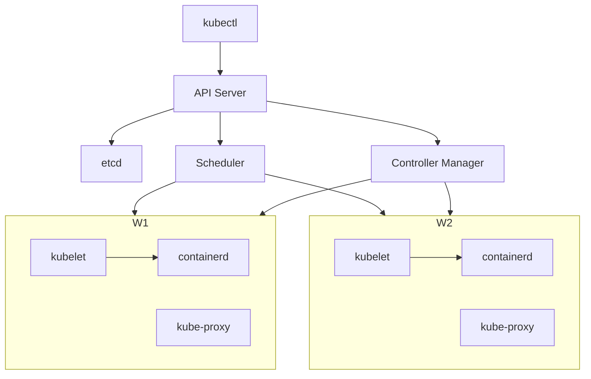
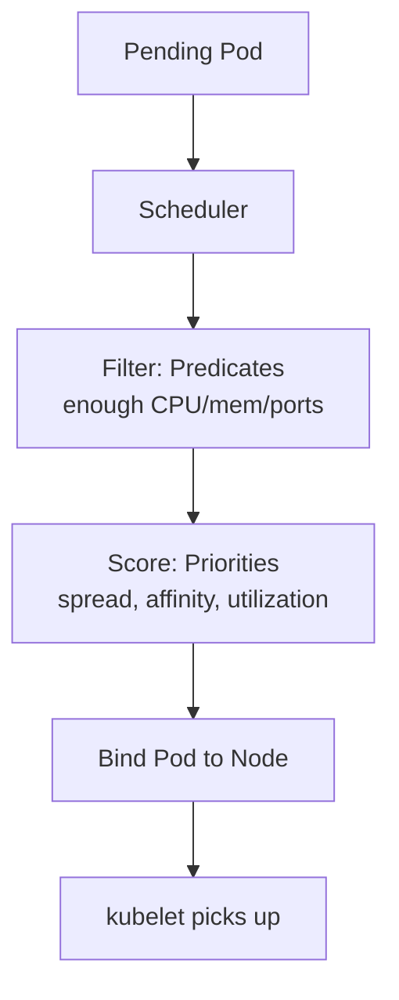
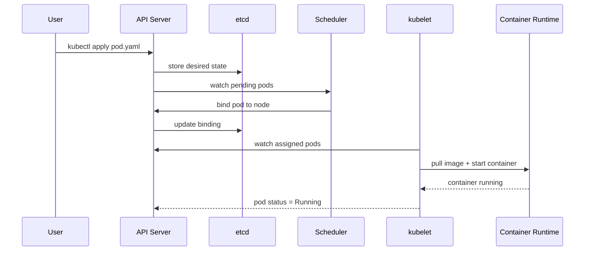
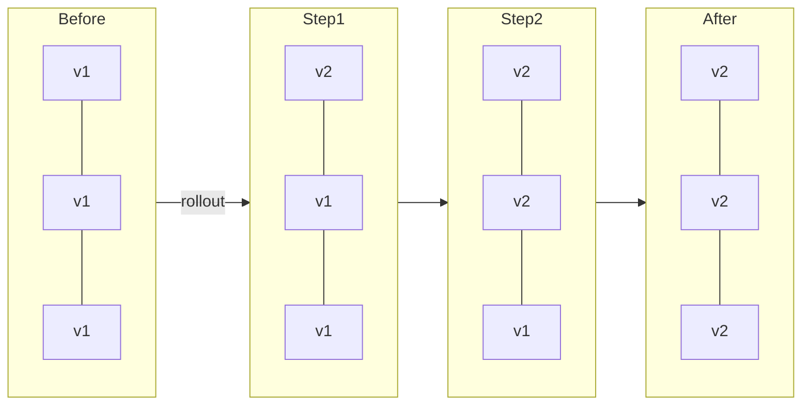
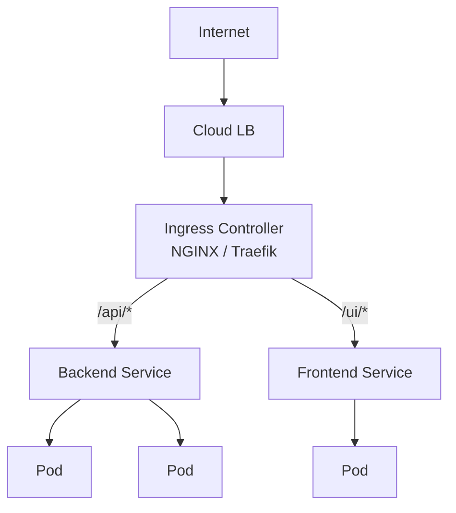
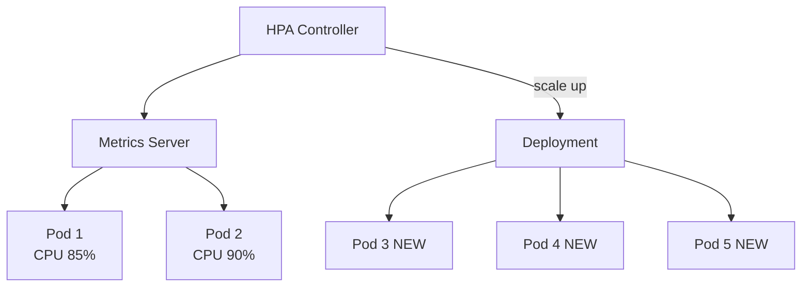
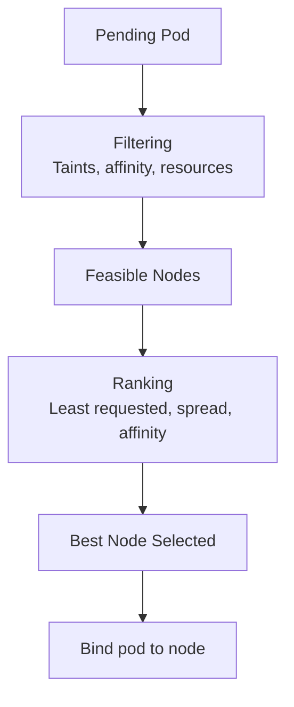
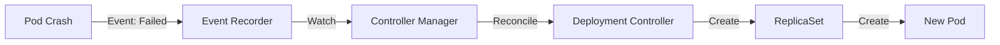

# ☸️ Kubernetes — Complete Flow & Component Deep Dive

Kubernetes is basically a **distributed operating system for containers**.

Think like this:

```text
Developer → Kubernetes API → Scheduler → Worker Nodes → Containers Running
```

But internally…

⚡ Thousands of tiny control loops
⚡ Continuous reconciliation
⚡ Distributed state synchronization
⚡ Networking + storage orchestration
⚡ Self healing automation

**Related**: [Microservices & K8s Production](MICROSERVICES_SYSTEM_DESIGN.md#13-kubernetes-production) · [Load Balancers & Ingress](loadbalancer.md#19-kubernetes-load-balancing-) · [Protocols & Watch API](protocols.md)

---

## Table of Contents

- [Big Picture Architecture](#-big-picture-architecture)
- [Core Components Explained](#-core-components-explained)
  - [1. API Server](#1-api-server)
  - [2. etcd](#2-etcd)
  - [3. Scheduler](#3-scheduler)
  - [4. Controller Manager](#4-controller-manager)
  - [5. kubelet](#5-kubelet)
  - [6. Container Runtime](#6-container-runtime)
  - [7. kube-proxy](#7-kube-proxy)
- [Complete Flows](#-complete-flows)
  - [Flow 1 — Pod Creation](#flow-1--pod-creation-flow)
  - [Flow 2 — Deployment](#flow-2--deployment-flow)
  - [Flow 3 — Rolling Update](#flow-3--rolling-update-flow)
  - [Flow 4 — Service Networking](#flow-4--service-networking-flow)
  - [Flow 5 — Ingress](#flow-5--ingress-flow)
  - [Flow 6 — DNS](#flow-6--dns-flow)
  - [Flow 7 — ConfigMap & Secret](#flow-7--configmap--secret-flow)
  - [Flow 8 — Volume Mount](#flow-8--volume-mount-flow)
  - [Flow 9 — Autoscaling](#flow-9--autoscaling-flow)
  - [Flow 10 — Self-Healing](#flow-10--self-healing-flow)
  - [Flow 11 — Scheduling](#flow-11--scheduling-flow)
  - [Flow 12 — StatefulSet](#flow-12--statefulset-flow)
  - [Flow 13 — Job & CronJob](#flow-13--job--cronjob-flow)
  - [Flow 14 — Networking Deep Dive](#flow-14--kubernetes-networking-deep-dive)
  - [Flow 15 — API Request Internal](#flow-15--api-request-internal-flow)
  - [Flow 16 — Operator](#flow-16--operator-flow)
  - [Flow 17 — Helm](#flow-17--helm-flow)
  - [Flow 18 — Cluster Bootstrap](#flow-18--cluster-bootstrap-flow)
  - [Flow 19 — Event](#flow-19--kubernetes-event-flow)
  - [Flow 20 — Observability](#flow-20--observability-flow)
- [Master Component Map](#-master-component-map)
- [Most Important Kubernetes Concept](#-most-important-kubernetes-concept)
- [Real Production Stack](#-real-production-stack)
- [Most Important Things to Master](#-most-important-things-to-master)
- [Ultimate Mental Model](#-ultimate-mental-model)

---

# 🧠 Big Picture Architecture

## Kubernetes Cluster Architecture

```text
                ┌─────────────────────┐
                │     kubectl         │
                │  (CLI / API Calls)  │
                └─────────┬───────────┘
                          │
                          ▼
              ┌──────────────────────┐
              │     API Server       │
              │ (Cluster Gateway)    │
              └─────────┬────────────┘
                        │
        ┌───────────────┼────────────────┐
        ▼               ▼                ▼
 ┌────────────┐  ┌────────────┐  ┌────────────┐
 │ Scheduler  │  │ Controller │  │   etcd     │
 │ Assign Pods│  │ Reconciler │  │ Cluster DB │
 └────────────┘  └────────────┘  └────────────┘
                        │
                        ▼
         ┌─────────────────────────────┐
         │         Worker Nodes        │
         └─────────────────────────────┘
              │               │
      ┌───────┘               └────────┐
      ▼                                 ▼
┌──────────────┐               ┌──────────────┐
│ kubelet      │               │ kubelet      │
│ containerd   │               │ containerd   │
│ kube-proxy   │               │ kube-proxy   │
└──────────────┘               └──────────────┘
```



---

# 🧩 Core Components Explained

# 1. API Server

## Brain Entry Point

Component:

* `kube-apiserver`

Everything goes through this.

## Responsibilities

* Authentication
* Authorization
* Validation
* REST API exposure
* Cluster state updates
* Talks to etcd

---

## Example

You run:

```bash
kubectl apply -f deployment.yaml
```

Actually:

```text
kubectl → HTTPS Request → API Server
```

---

# 2. etcd

## Distributed Key-Value Database

Stores:

* Pods
* Deployments
* Secrets
* ConfigMaps
* Node info
* Cluster state

---

## Think Like

```text
Kubernetes Memory
```

Without etcd:

❌ cluster dies

---

## Flow

```text
API Server
    ↓
Writes desired state
    ↓
etcd persists cluster state
```

### ⚠️ etcd Reality Check

etcd is the source of truth but also the **single biggest failure domain**. etcd requires a majority (quorum) — 3 nodes need 2 alive, 5 need 3 alive. Network partition that splits 3 nodes 2-1 makes the 1-side unavailable. Monitor etcd disk sync time (>10ms = trouble) and leader changes.

---

# 3. Scheduler

## Job

Find BEST node for pod.

---

## Scheduler Checks

| Check         | Example          |
| ------------- | ---------------- |
| CPU           | Enough CPU?      |
| Memory        | Enough RAM?      |
| Affinity      | Preferred node?  |
| Taints        | Allowed?         |
| Anti-affinity | Avoid same node? |
| GPU           | GPU available?   |

---

## Flow

```text
New Pod Created
        ↓
Scheduler Detects Pending Pod
        ↓
Find Suitable Node
        ↓
Bind Pod to Node
```



---

# 4. Controller Manager

## The Reconciliation Engine

This is Kubernetes magic.

---

## Main Idea

```text
Desired State != Current State
```

Controller continuously fixes it.

---

## Example

Desired:

```text
3 replicas
```

Current:

```text
2 replicas
```

Controller:

```text
Creates 1 more pod
```

---

## Types of Controllers

| Controller          | Purpose            |
| ------------------- | ------------------ |
| Deployment          | Manage replicas    |
| ReplicaSet          | Maintain pod count |
| Node Controller     | Monitor nodes      |
| Job Controller      | Batch jobs         |
| CronJob Controller  | Scheduled jobs     |
| Endpoint Controller | Service endpoints  |

---

# 5. kubelet

## Node Agent

Runs on every node.

---

## Responsibilities

* Receives pod instructions
* Pulls images
* Starts containers
* Reports health
* Mounts volumes

---

## Flow

```text
API Server
    ↓
kubelet sees assigned pod
    ↓
container runtime starts container
```

---

# 6. Container Runtime

Examples:

* containerd
* CRI-O

Old:

* Docker Shim

---

## Responsibilities

* Pull images
* Create containers
* Start/stop containers

---

# 7. kube-proxy

## Networking Brain

Handles service routing.

---

## Responsibilities

* iptables rules
* IPVS rules
* Service discovery
* Load balancing

---

# 🚀 COMPLETE FLOWS

---

# FLOW 1 — Pod Creation Flow

# Step-by-Step

```text
Developer writes YAML
        ↓
kubectl apply
        ↓
API Server validates
        ↓
Store in etcd
        ↓
Scheduler picks node
        ↓
kubelet notices pod
        ↓
container runtime pulls image
        ↓
Container starts
        ↓
Pod running
```

---

# Visual

```text
kubectl
   ↓
API Server
   ↓
etcd
   ↓
Scheduler
   ↓
Worker Node
   ↓
kubelet
   ↓
containerd
   ↓
Running Pod
```



---

# FLOW 2 — Deployment Flow

# What Deployment Does

Manages:

* replicas
* rolling updates
* rollbacks

---

# Flow

```text
Deployment Created
        ↓
Deployment Controller
        ↓
Creates ReplicaSet
        ↓
ReplicaSet Creates Pods
        ↓
Scheduler assigns nodes
        ↓
Pods running
```

---

# Visual

```text
Deployment
    ↓
ReplicaSet
    ↓
Pods
```

---

# FLOW 3 — Rolling Update Flow

Suppose:

```text
v1 → v2
```

---

# Process

```text
Create new pod (v2)
        ↓
Wait healthy
        ↓
Delete old pod (v1)
        ↓
Repeat
```

---

# Why?

Zero downtime.

---

# Visual

```text
OLD: [v1][v1][v1]

STEP1:
[v2][v1][v1]

STEP2:
[v2][v2][v1]

FINAL:
[v2][v2][v2]
```



---

# FLOW 4 — Service Networking Flow

# Problem

Pods change IPs constantly.

Need stable access.

---

# Solution

Service.

---

# Flow

```text
Client
   ↓
Service ClusterIP
   ↓
kube-proxy
   ↓
Pod selected via labels
```

---

# Visual

```text
Service
   ↓
┌─────────────┐
│ kube-proxy  │
└──────┬──────┘
       │
 ┌─────┴─────┐
 ▼           ▼
Pod A      Pod B
```

---

# FLOW 5 — Ingress Flow

Ingress = HTTP/HTTPS entry.

---

# Flow

```text
Internet
    ↓
Load Balancer
    ↓
Ingress Controller
    ↓
Service
    ↓
Pods
```

---

# Example

```text
/api → backend service
/ui  → frontend service
```



---

# FLOW 6 — DNS Flow

Kubernetes has internal DNS.

---

# Example

```text
backend.default.svc.cluster.local
```

---

# Flow

```text
Pod wants service
        ↓
DNS query
        ↓
CoreDNS resolves
        ↓
Returns ClusterIP
```

---

# FLOW 7 — ConfigMap & Secret Flow

---

# ConfigMap

Non-sensitive config.

# Secret

Sensitive data.

---

# Flow

```text
Pod starts
    ↓
kubelet mounts config
    ↓
Container reads env vars/files
```

---

# FLOW 8 — Volume Mount Flow

# Problem

Containers are ephemeral.

Need persistent data.

---

# Flow

```text
PVC Created
    ↓
PV Bound
    ↓
Storage attached
    ↓
Mounted into pod
```

---

# Storage Components

| Component    | Purpose              |
| ------------ | -------------------- |
| PV           | Physical storage     |
| PVC          | Storage request      |
| StorageClass | Dynamic provisioning |

---

# FLOW 9 — Autoscaling Flow

# HPA

Horizontal Pod Autoscaler

---

# Flow

```text
CPU usage high
        ↓
Metrics Server detects
        ↓
HPA increases replicas
```

---

# Visual

```text
2 Pods
  ↓ high load
5 Pods
```



---

# FLOW 10 — Self-Healing Flow

# Pod Crashes

```text
Container dies
      ↓
kubelet detects
      ↓
Restart container
```

---

# Node Dies

```text
Node unreachable
      ↓
Node controller detects
      ↓
Pods rescheduled
```

---

# FLOW 11 — Scheduling Flow

# Advanced Scheduling

---

## Node Selector

```yaml
nodeSelector:
  gpu: true
```

---

## Taints

```text
Do not schedule here
```

---

## Tolerations

```text
This pod allowed
```

---

# Flow

```text
Scheduler filters nodes
        ↓
Ranks nodes
        ↓
Chooses best node
```



---

# FLOW 12 — StatefulSet Flow

Used for:

* databases
* Kafka
* Redis clusters

---

# Features

* Stable hostname
* Stable storage
* Ordered deployment

---

# Example

```text
mysql-0
mysql-1
mysql-2
```

---

# FLOW 13 — Job & CronJob Flow

# Job

Run once.

---

# CronJob

Run on schedule.

---

# Flow

```text
Cron trigger
      ↓
Job created
      ↓
Pod created
      ↓
Task runs
      ↓
Exit
```

---

# FLOW 14 — Kubernetes Networking Deep Dive

Every pod gets IP.

---

# Pod-to-Pod Flow

```text
Pod A
   ↓
CNI Plugin
   ↓
Virtual Network
   ↓
Pod B
```

---

# CNI Plugins

| Plugin  | Description     |
| ------- | --------------- |
| Calico  | Network policy  |
| Flannel | Simple overlay  |
| Cilium  | eBPF networking |
| Weave   | Mesh networking |

### 🔮 CNI Trend

Cilium (eBPF-based) is becoming the default for new clusters. It replaces kube-proxy entirely, offers network policies at kernel speed, and provides observability without sidecars. Calico remains strong for network policy compliance (Tigera). Flannel is simplest but being phased out.

---

# FLOW 15 — API Request Internal Flow

```text
kubectl get pods
       ↓
API Server authenticates
       ↓
Authorization checks RBAC
       ↓
Reads from etcd
       ↓
Returns JSON
```

---

# FLOW 16 — Operator Flow

Operators automate apps.

---

# Example

Postgres Operator.

---

# Flow

```text
Custom Resource Created
        ↓
Operator watches CRD
        ↓
Creates StatefulSet
        ↓
Configures DB cluster
```

---

# FLOW 17 — Helm Flow

Helm = Kubernetes package manager.

---

# Flow

```text
helm install
      ↓
Templates rendered
      ↓
YAML generated
      ↓
Applied to cluster
```

---

# FLOW 18 — Cluster Bootstrap Flow

# kubeadm init

---

# Process

```text
Certificates generated
        ↓
API server starts
        ↓
etcd starts
        ↓
Controller manager starts
        ↓
Scheduler starts
```

Then workers join.

---

# FLOW 19 — Kubernetes Event Flow

Everything event-driven.

---

# Example

```text
Pod failed
   ↓
Event emitted
   ↓
Controller reacts
   ↓
New pod created
```



---

# FLOW 20 — Observability Flow

---

# Logging

```text
Container logs
    ↓
FluentBit
    ↓
ElasticSearch
```

---

# Metrics

```text
Prometheus scrapes metrics
        ↓
Grafana dashboards
```

---

# Tracing

```text
Jaeger / Tempo
```

---

# 🔥 MASTER COMPONENT MAP

```text
                CONTROL PLANE
┌───────────────────────────────────────────┐
│ API Server                               │
│ Scheduler                                │
│ Controller Manager                       │
│ etcd                                     │
└───────────────────────────────────────────┘

                    ↓

                WORKER NODES
┌───────────────────────────────────────────┐
│ kubelet                                  │
│ kube-proxy                               │
│ container runtime                        │
│ pods                                     │
└───────────────────────────────────────────┘
```

---

# 🔥 MOST IMPORTANT KUBERNETES CONCEPT

Kubernetes is:

# A giant reconciliation engine.

You declare:

```yaml
I WANT THIS STATE
```

Kubernetes continuously tries to make reality match that state.

### 💡 The Core Loop

Every controller follows: **Observe → Diff → Act**. It reads current state from API server, compares to desired state (from specs), and takes action to converge them. This is the fundamental pattern — if you understand this, you understand Kubernetes.

---

# REAL PRODUCTION STACK

Typical production stack:

```text
Users
  ↓
CDN
  ↓
Load Balancer
  ↓
Ingress
  ↓
Services
  ↓
Pods
  ↓
Databases
```

---

# 🔥 MOST IMPORTANT THINGS TO MASTER

## Beginner

* Pods
* Deployments
* Services
* ConfigMaps
* Secrets

---

## Intermediate

* Ingress
* StatefulSets
* Volumes
* Autoscaling
* RBAC

---

## Advanced

* Scheduler internals
* CNI
* CSI
* Operators
* eBPF
* Service Mesh
* Controller patterns
* CRDs
* Runtime internals

---

# ⚡ Ultimate Mental Model

```text
API Server = Gateway Brain

etcd = Memory

Scheduler = Placement Engine

Controller Manager = Desired State Enforcer

kubelet = Node Agent

containerd = Container Executor

kube-proxy = Traffic Router

Pods = Running Applications
```
