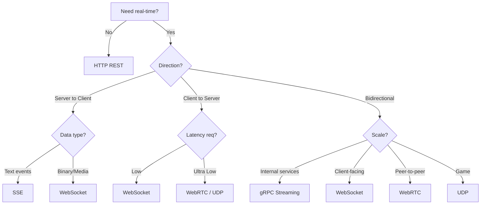

# Real-Time Communication Protocols — Comparison

> Quick reference: protocols, server models, and real-world mappings.

**Related**: [Microservices & System Design](MICROSERVICES_SYSTEM_DESIGN.md) · [Load Balancers](loadbalancer.md) · [Kubernetes](k8s.md)

---

## Table of Contents

- [Protocol Comparison Table](#protocol-comparison-table)
- [Server Model Comparison](#server-model-comparison)
- [Real-World Application Mapping](#real-world-application-mapping)
- [Protocol Selection Flow](#protocol-selection-flow)

---

## Protocol Selection Flow

---

## Protocol Comparison Table

| Feature | Short Polling | Long Polling | SSE | WebSocket | WebRTC | gRPC Streaming | UDP/Game Protocols |
|---|---|---|---|---|---|---|---|
| Communication Type | Request/Response | Request waits | Server -> Client | Full Duplex | Peer <-> Peer | Stream-based | Datagram |
| Direction | Client asks | Mostly Server Push | One Way | Two Way | Two Way | Two Way | Two Way |
| Persistent Connection | No | Temporary | Yes | Yes | Yes | Yes | Yes |
| Transport | HTTP/TCP | HTTP/TCP | HTTP/TCP | TCP | UDP | HTTP/2 | UDP |
| Latency | High | Medium | Low | Very Low | Ultra Low | Low | Ultra Low |
| Binary Support | No | No | No | Yes | Yes | Yes | Yes |
| Browser Support | Yes | Yes | Yes | Yes | Yes | No Directly | No Directly |
| Reconnect Needed | Every Request | Every Request | Auto | Manual Logic | Complex | Stream Retry | Custom |
| Stateful | No | Partial | Partial | Yes | Yes | Yes | Minimal |
| Scaling Difficulty | Easy | Medium | Medium | Hard | Very Hard | Medium | Hard |
| Infra Cost | High | Medium | Low | Medium | High | Medium | Medium |
| Best For | Refresh pages | Old chats | Notifications | Chat/apps | Video calls | Backend streams | Games |
| Example Apps | Old Gmail | Old Facebook Chat | Live scores | WhatsApp | Zoom | Internal microservices | PUBG |
| Message Format | HTTP | HTTP | Text events | Frames | Media/Data packets | Protobuf | Binary packets |
| Header Overhead | Huge | Huge | Low | Tiny | Tiny | Low | Tiny |
| Duplex Support | No | No | No | Yes | Yes | Yes | Yes |
| Firewall Friendly | Yes | Yes | Yes | Mostly | Sometimes | Internal | Sometimes |
| Mobile Friendly | Poor | Medium | Good | Good | Hard | Good | Medium |
| Ordering Guarantee | Yes | Yes | Yes | Yes | Partial | Yes | No |
| Reliability | High | High | High | High | Medium | High | Low |
| Packet Loss Tolerance | Poor | Poor | Poor | Poor | Good | Medium | Excellent |
| Real-Time Capability | No | Partial | Yes | Yes | Yes | Yes | Yes |

---

## Server Model Comparison

| Protocol | Server Model | OS Mechanism | Typical Runtime |
|---|---|---|---|
| Polling | Thread per request | Blocking I/O | Apache |
| Long Polling | Async request hold | epoll/kqueue | Node.js |
| SSE | Streaming response | Event loop | NGINX |
| WebSocket | Event driven sockets | epoll/netpoll | Netty/Go |
| WebRTC | ICE/STUN/TURN | UDP stack | Browser engines |
| gRPC | HTTP/2 multiplexing | Async streams | Go/Java |
| UDP Gaming | Custom networking | Raw UDP sockets | C++/Rust |

---

## Real-World Application Mapping

| Application | Protocol Used |
|---|---|
| WhatsApp | WebSocket |
| Slack | WebSocket |
| Discord | WebSocket + WebRTC |
| Zoom | WebRTC |
| Uber | WebSocket + gRPC |
| Google Docs | WebSocket |
| PUBG Mobile | UDP |
| Netflix | HTTP Streaming |
| Stock Trading Apps | SSE/WebSocket |
| Kubernetes Watch API | HTTP Streaming |
| AI Service Meshes | gRPC Streaming |
