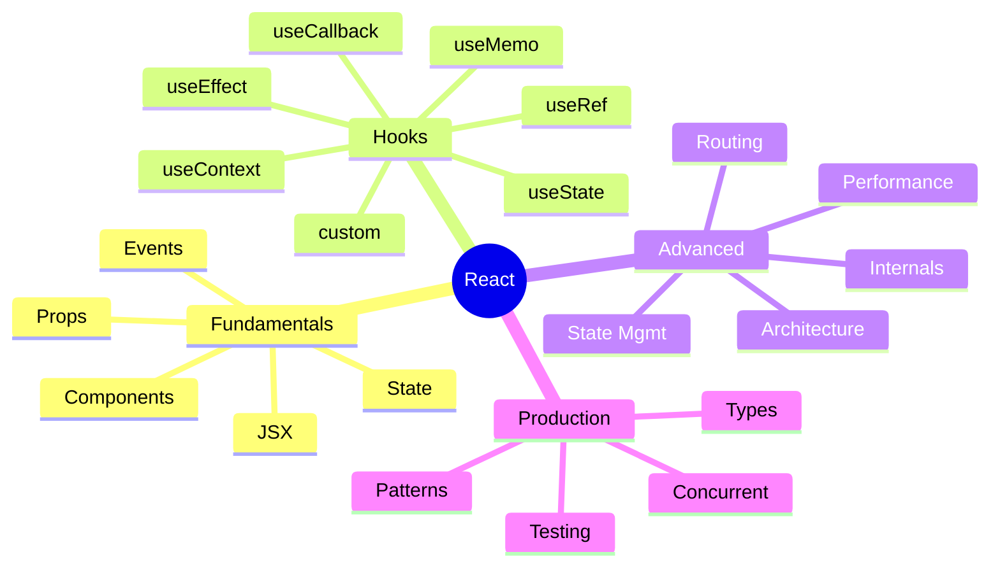
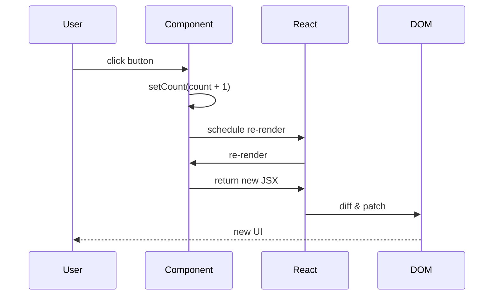
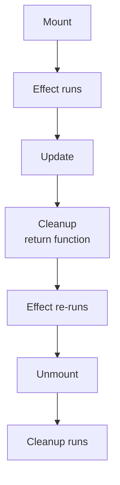
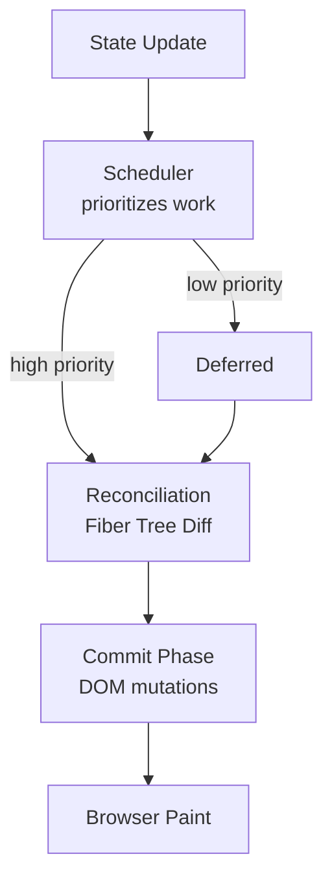
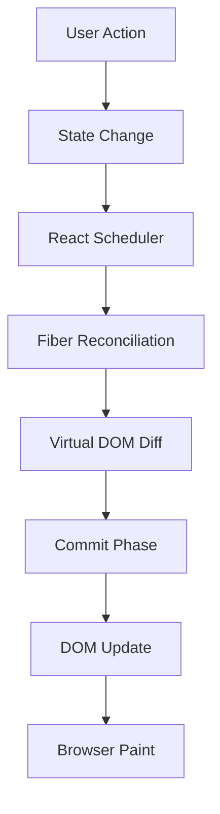

# Complete React Roadmap 🚀

*From Zero → Advanced → Production Architecture*

React is not "just a library".
It is a **UI rendering engine + state synchronization model**.

Think like this:

```text
User Action → State Changes → React Detects Change → Re-renders UI
```

**Related**: [Design Patterns (Observer, MVC)](designpatterns.md) · [Data Model Context Pattern](../inputs/ff/self-study-app/docs/DATA_MODEL.md#topicmapscontext) · [Microservices Backend](MICROSERVICES_SYSTEM_DESIGN.md#4-networking--protocols)

---

## Table of Contents

- [What is React?](#1-what-is-react-)
- [Why React Exists](#2-why-react-exists)
- [React Mental Model](#3-react-mental-model-)
- [Core React Topics Map](#4-core-react-topics-map-)
- [JSX](#5-jsx-)
- [Components](#6-components-)
- [Props](#7-props-)
- [State](#8-state-)
- [Event Handling](#9-event-handling-)
- [Conditional Rendering](#10-conditional-rendering-)
- [Lists & Keys](#11-lists--keys-)
- [Forms](#12-forms-)
- [useEffect](#13-useeffect-)
- [useRef](#14-useref-)
- [useMemo](#15-usememo-)
- [useCallback](#16-usecallback-)
- [useContext](#17-usecontext-)
- [Custom Hooks](#18-custom-hooks-)
- [React Router](#19-react-router-)
- [State Management](#20-state-management-)
- [React Rendering Internals](#21-react-rendering-internals-)
- [React Lifecycle](#22-react-lifecycle-)
- [Performance Optimization](#23-performance-optimization-)
- [React Architecture](#24-react-architecture-)
- [API Communication](#25-api-communication-)
- [React + Backend Architecture](#26-react--backend-architecture-)
- [React Rendering Types](#27-react-rendering-types-)
- [React Concurrent Features](#28-react-concurrent-features-)
- [React Testing](#29-react-testing-)
- [React Patterns](#30-react-patterns-)
- [React Anti Patterns](#31-react-anti-patterns-)
- [Real Production React Flow](#32-real-production-react-flow-)
- [React Interview Topics](#33-react-interview-topics-)
- [Complete Learning Order](#34-complete-learning-order-)
- [Real Enterprise Stack](#35-real-enterprise-stack-)
- [Ultimate React Mindset](#36-ultimate-react-mindset-)
- [Final Visualization](#final-visualization-)
- [Best Resources](#best-resources-)
- [Suggested Advanced Topics](#suggested-advanced-topics-for-you-)

---

# 1. What is React? 🧠

React is a JavaScript library for building UI.

Created by: Meta

Official site: [React Official Docs](https://react.dev?utm_source=chatgpt.com)

---

# 2. Why React Exists

Before React:

```text
HTML + jQuery
```

Problem:

```text
DOM updates became messy
```

Example:

```javascript
document.getElementById("count").innerHTML = count
```

Large apps became:

* hard to maintain
* unpredictable
* tightly coupled

React solution:

```text
UI = Function(State)
```

---

# 3. React Mental Model 🔥

```text
State changes
      ↓
React creates Virtual DOM
      ↓
Diffing Algorithm
      ↓
Minimal DOM updates
      ↓
Fast UI updates
```

### React's Core Equation

```
UI = f(state)
```

This is the single most important concept in React. Your entire app is a **function of state** — state drives the UI, not DOM manipulations. This is the paradigm shift from jQuery to React.

---

# 4. Core React Topics Map 🗺️

```text
React Fundamentals
│
├── JSX
├── Components
├── Props
├── State
├── Events
├── Conditional Rendering
├── Lists & Keys
├── Forms
├── Hooks
│   ├── useState
│   ├── useEffect
│   ├── useRef
│   ├── useMemo
│   ├── useCallback
│   ├── useContext
│   └── custom hooks
│
├── Routing
├── State Management
├── Performance
├── React Internals
├── Architecture
├── Testing
└── Production Scaling
```



---

# 5. JSX 🌈

JSX = JavaScript XML

Looks like HTML inside JS.

---

## Example

```jsx
const element = <h1>Hello React</h1>
```

Actually becomes:

```javascript
React.createElement("h1", null, "Hello React")
```

---

# JSX Flow

```text
JSX
 ↓
Babel Transpiles
 ↓
React.createElement()
 ↓
JS Object
 ↓
Virtual DOM
```

---

## Multiple JSX Examples

---

### Example 1

```jsx
function App() {
  return <h1>Hello</h1>
}
```

---

### Example 2

```jsx
function App() {
  const name = "Prem"

  return <h1>Hello {name}</h1>
}
```

---

### Example 3

```jsx
function App() {
  return (
    <div>
      <h1>Title</h1>
      <p>Description</p>
    </div>
  )
}
```

---

# 6. Components 🧩

Component = reusable UI block.

---

# Types

```text
1. Functional Components
2. Class Components (older)
```

Modern React:

✅ Functional Components

---

# Example

```jsx
function Welcome() {
  return <h1>Welcome</h1>
}
```

Usage:

```jsx
<Welcome />
```

---

# Component Tree

```text
App
├── Header
├── Sidebar
├── Feed
│   ├── Post
│   ├── Post
│   └── Post
└── Footer
```

---

# Real World Example

Instagram:

```text
App
├── Navbar
├── Stories
├── Feed
│   └── Post
│       ├── Image
│       ├── LikeButton
│       └── Comments
└── Chat
```

---

# 7. Props 📦

Props = data passed from parent → child.

---

# Example

```jsx
function User(props) {
  return <h1>{props.name}</h1>
}

function App() {
  return <User name="Prem" />
}
```

---

# Flow

```text
Parent
  ↓ props
Child
```

---

# Multiple Props Example

```jsx
function Product({ name, price }) {
  return (
    <div>
      <h2>{name}</h2>
      <p>{price}</p>
    </div>
  )
}
```

---

# Important

Props are:

✅ Read-only
❌ Cannot modify

---

# 8. State 🔥

State = component memory.

Without state:

```text
UI static
```

With state:

```text
UI dynamic
```

---

# useState Hook

```jsx
const [count, setCount] = useState(0)
```

---

# Visualization

```text
count = current value

setCount = update function
```

---

# Counter Example

```jsx
import { useState } from "react"

function Counter() {
  const [count, setCount] = useState(0)

  return (
    <div>
      <h1>{count}</h1>

      <button onClick={() => setCount(count + 1)}>
        Increment
      </button>
    </div>
  )
}
```

---

# Internal Flow

```text
Button Click
    ↓
setCount()
    ↓
React schedules update
    ↓
Component re-renders
    ↓
New UI appears
```



---

# 9. Event Handling 🎯

---

# Example

```jsx
<button onClick={handleClick}>
  Click
</button>
```

---

# Multiple Event Examples

```jsx
onClick
onChange
onSubmit
onMouseEnter
onKeyDown
```

---

# Input Example

```jsx
function App() {
  const [text, setText] = useState("")

  return (
    <input
      value={text}
      onChange={(e) => setText(e.target.value)}
    />
  )
}
```

---

# 10. Conditional Rendering 🔀

---

# Example 1

```jsx
{isLoggedIn ? <Home /> : <Login />}
```

---

# Example 2

```jsx
{loading && <Spinner />}
```

---

# Example 3

```jsx
if (error) {
  return <Error />
}
```

---

# Real Example

Netflix:

```text
Loading → Spinner
Success → Movies
Error → Retry Screen
```

---

# 11. Lists & Keys 📋

---

# Rendering Arrays

```jsx
const users = ["Prem", "John"]

return (
  <ul>
    {users.map(user => (
      <li>{user}</li>
    ))}
  </ul>
)
```

---

# Keys

React needs unique keys.

```jsx
<li key={user.id}>
```

---

# Why?

Helps React diff efficiently.

---

# Bad

```jsx
key={index}
```

Problems:

* wrong re-renders
* bugs
* animation issues

### 💡 Key Best Practice

Use a **stable ID** from your data (DB primary key, UUID). Never use `key={index}` for lists that can be reordered, filtered, or have items added/removed — it causes incorrect state binding and broken animations.

---

# 12. Forms 📝

---

# Controlled Component

```jsx
function Login() {
  const [email, setEmail] = useState("")

  return (
    <input
      value={email}
      onChange={(e) => setEmail(e.target.value)}
    />
  )
}
```

---

# Flow

```text
Input Change
   ↓
State Updates
   ↓
React Re-renders
   ↓
Input Shows New Value
```

---

# 13. useEffect 🔥

Most important hook after useState.

Used for:

* API calls
* subscriptions
* timers
* DOM updates

---

# Example

```jsx
useEffect(() => {
  console.log("Mounted")
}, [])
```

---

# Dependency Array

---

## Run Once

```jsx
useEffect(() => {}, [])
```

---

## Run on State Change

```jsx
useEffect(() => {}, [count])
```

---

## Run Every Render

```jsx
useEffect(() => {})
```

---

# API Example

```jsx
useEffect(() => {
  fetch("/users")
    .then(res => res.json())
    .then(data => setUsers(data))
}, [])
```

---

# Effect Lifecycle

```text
Render
 ↓
Effect Runs
 ↓
Cleanup Runs
 ↓
Effect Re-runs
```



---

# Cleanup Example

```jsx
useEffect(() => {
  const timer = setInterval(() => {
    console.log("running")
  }, 1000)

  return () => clearInterval(timer)
}, [])
```

---

# 14. useRef 🧠

Stores mutable value without re-render.

---

# DOM Example

```jsx
const inputRef = useRef()

function focusInput() {
  inputRef.current.focus()
}
```

---

# Memory Example

```jsx
const countRef = useRef(0)
```

---

# Difference

| Hook     | Causes Re-render |
| -------- | ---------------- |
| useState | ✅                |
| useRef   | ❌                |

---

# 15. useMemo ⚡

Optimization hook.

Caches expensive calculations.

---

# Example

```jsx
const expensiveValue = useMemo(() => {
  return heavyCalculation(data)
}, [data])
```

---

# Without useMemo

```text
Every render:
    expensive calculation runs
```

---

# With useMemo

```text
Only recalculates when dependency changes
```

---

# 16. useCallback 🔥

Caches functions.

---

# Example

```jsx
const handleClick = useCallback(() => {
  console.log("clicked")
}, [])
```

---

# Why?

Prevents unnecessary child re-renders.

---

# Real Scenario

```text
Parent re-renders
    ↓
New function created
    ↓
Child thinks prop changed
    ↓
Child re-renders
```

---

# 17. useContext 🌍

Avoids prop drilling.

---

# Problem

```text
App
 ↓
A
 ↓
B
 ↓
C
```

Passing props through all layers is painful.

---

# Solution

Context API

---

# Example

```jsx
const ThemeContext = createContext()

function App() {
  return (
    <ThemeContext.Provider value="dark">
      <Home />
    </ThemeContext.Provider>
  )
}
```

---

# Consume

```jsx
const theme = useContext(ThemeContext)
```

### 🧠 Context vs State Management

Context is NOT a state management solution — it is a **dependency injection** mechanism. It triggers re-renders in ALL consumers when the value changes, regardless of what they consume. For high-frequency updates, use Zustand/Redux which have finer-grained subscriptions.

---

# 18. Custom Hooks 🪝

Reusable logic.

---

# Example

```jsx
function useCounter() {
  const [count, setCount] = useState(0)

  function increment() {
    setCount(c => c + 1)
  }

  return { count, increment }
}
```

---

# Usage

```jsx
const { count, increment } = useCounter()
```

---

# Real Examples

```text
useAuth()
useFetch()
useDebounce()
useSocket()
```

---

# 19. React Router 🛣️

SPA navigation.

Official site: [React Router](https://reactrouter.com?utm_source=chatgpt.com)

---

# Example

```jsx
<Routes>
  <Route path="/" element={<Home />} />
  <Route path="/about" element={<About />} />
</Routes>
```

---

# Flow

```text
URL Change
   ↓
Router Matches Route
   ↓
Correct Component Rendered
```

---

# 20. State Management 🧠

---

# Types

| Type        | Use                 |
| ----------- | ------------------- |
| Local State | Component-only      |
| Context     | Small global state  |
| Redux       | Large apps          |
| Zustand     | Simple global state |
| Recoil      | Atom-based          |
| MobX        | Reactive            |

---

# Redux Flow

```text
UI
 ↓ dispatch
Action
 ↓
Reducer
 ↓
Store Updated
 ↓
UI Re-renders
```

```mermaid
flowchart LR
    UI[UI Component] -->|dispatch action| A[Action<br/>{type, payload}]
    A --> R[Reducer<br/>pure function]
    R --> S[Store<br/>single source of truth]
    S -->|subscribe| UI
    S -->|state| UI
```

---

# Redux Example

```javascript
dispatch({
  type: "ADD_TODO"
})
```

---

# 21. React Rendering Internals ⚙️

---

# Virtual DOM

React creates lightweight JS representation.

---

# Example

```text
Old Virtual DOM
      vs
New Virtual DOM
```

React compares both.

Called:

```text
Diffing Algorithm
```

---

# Reconciliation

```text
Find differences
    ↓
Update only changed parts
```

---

# Fiber Architecture

React 16 introduced Fiber.

Benefits:

* interruptible rendering
* priorities
* concurrent rendering

---

# Flow

```text
State Update
    ↓
Fiber Tree
    ↓
Reconciliation
    ↓
Commit Phase
    ↓
DOM Updated
```



---

# 22. React Lifecycle 🔄

Functional components use hooks instead.

---

# Old Class Lifecycle

```text
Mount
Update
Unmount
```

---

# Hook Equivalent

| Lifecycle            | Hook      |
| -------------------- | --------- |
| componentDidMount    | useEffect |
| componentDidUpdate   | useEffect |
| componentWillUnmount | cleanup   |

---

# 23. Performance Optimization 🚀

---

# Techniques

```text
React.memo
useMemo
useCallback
Code Splitting
Lazy Loading
Virtualization
Debouncing
Throttling
```

---

# React.memo

```jsx
export default React.memo(Component)
```

Prevents unnecessary re-renders.

---

# Lazy Loading

```jsx
const Home = lazy(() => import("./Home"))
```

---

# Suspense

```jsx
<Suspense fallback={<Spinner />}>
  <Home />
</Suspense>
```

---

# 24. React Architecture 🏗️

---

# Small App

```text
components/
pages/
hooks/
utils/
services/
```

---

# Large Scale Architecture

```text
src/
├── app/
├── modules/
├── shared/
├── services/
├── hooks/
├── store/
├── routes/
├── layouts/
└── utils/
```

---

# Feature-Based Architecture

```text
auth/
├── components
├── hooks
├── services
├── store
└── pages
```

Best for scaling.

---

# 25. API Communication 🌐

---

# Fetch Example

```jsx
async function getUsers() {
  const res = await fetch("/api/users")
  return res.json()
}
```

---

# Axios

```javascript
axios.get("/users")
```

Company: [Axios](https://axios-http.com?utm_source=chatgpt.com)

---

# Data Fetching Libraries

| Library     | Purpose      |
| ----------- | ------------ |
| React Query | server state |
| SWR         | caching      |
| Apollo      | GraphQL      |

---

# React Query Flow

```text
Request
 ↓
Cache
 ↓
Background Refetch
 ↓
UI Updates
```

---

# 26. React + Backend Architecture 🌍

---

# Typical Flow

```text
React Frontend
     ↓
API Gateway
     ↓
Microservices
     ↓
Databases
```

---

# Example

Instagram:

```text
React App
   ↓
Feed API
   ↓
Redis Cache
   ↓
Post Service
   ↓
DB
```

---

# 27. React Rendering Types 🔥

---

# CSR

Client Side Rendering

```text
Browser downloads JS
     ↓
React renders UI
```

---

# SSR

Server Side Rendering

```text
Server renders HTML
     ↓
Browser hydrates React
```

---

# SSG

Static Site Generation

```text
Build time HTML generation
```

---

# ISR

Incremental Static Regeneration.

Popular framework:

Vercel's [Next.js](https://nextjs.org?utm_source=chatgpt.com)

### 📊 Rendering Strategy Comparison

| Strategy | SEO | TTFB | Interactivity | Use Case |
|----------|-----|------|---------------|----------|
| CSR | Poor | Fast | After JS load | Dashboards, apps behind auth |
| SSR | Good | Slower | After hydration | Content sites, e-commerce |
| SSG | Best | Fastest | After hydration | Blogs, marketing sites |
| ISR | Best | Fast | After hydration | Large content sites |

---

# 28. React Concurrent Features ⚡

React 18 introduced concurrency.

---

# Features

```text
useTransition
Suspense
Streaming
Concurrent Rendering
```

---

# Example

```jsx
const [isPending, startTransition] = useTransition()
```

---

# Purpose

Keep UI responsive during heavy rendering.

---

# 29. React Testing 🧪

---

# Libraries

| Library | Purpose    |
| ------- | ---------- |
| Jest    | testing    |
| RTL     | UI testing |
| Cypress | E2E        |

---

# Example

```jsx
test("renders button", () => {
  render(<Button />)

  expect(screen.getByText("Click"))
    .toBeInTheDocument()
})
```

---

# 30. React Patterns 🧠

---

# Common Patterns

```text
Container/Presenter
Compound Components
Render Props
HOC
Hooks Pattern
Provider Pattern
```

---

# HOC Example

```jsx
withAuth(Component)
```

---

# Compound Component Example

```jsx
<Tabs>
  <Tabs.List />
  <Tabs.Panel />
</Tabs>
```

---

# 31. React Anti Patterns ❌

---

# Bad Practices

```text
Too much prop drilling
Huge components
Mutating state
Using index as key
Too many effects
Business logic inside UI
```

---

# Bad Mutation

```javascript
state.name = "Prem"
```

---

# Good

```javascript
setState({
  ...state,
  name: "Prem"
})
```

---

# 32. Real Production React Flow 🌍

```text
User Opens App
      ↓
React Bootstraps
      ↓
Router Loads Page
      ↓
API Calls Trigger
      ↓
Cache Layer Checks
      ↓
Backend Responds
      ↓
State Updates
      ↓
UI Re-renders
```

---

# 33. React Interview Topics 🎯

---

# Beginner

* JSX
* props vs state
* hooks
* controlled components

---

# Intermediate

* reconciliation
* useEffect lifecycle
* context
* optimization

---

# Advanced

* Fiber
* concurrent rendering
* hydration
* rendering strategies
* performance bottlenecks
* memoization internals

---

# 34. Complete Learning Order 📚

```text
1. JavaScript ES6
2. JSX
3. Components
4. Props
5. State
6. Events
7. Hooks
8. Routing
9. API calls
10. Forms
11. Context
12. Performance
13. State management
14. Testing
15. Next.js
16. Architecture
17. Internals
18. Scaling systems
```

---

# 35. Real Enterprise Stack 🏢

```text
Frontend:
React + TypeScript + Next.js

State:
Redux Toolkit / Zustand

API:
GraphQL / REST

Testing:
Jest + Cypress

Infra:
Docker + Kubernetes

Deployment:
Vercel / AWS
```

---

# 36. Ultimate React Mindset 🧠

React is basically:

```text
State Machine + Rendering Engine
```

Core philosophy:

```text
Describe UI for a given state
```

NOT:

```text
Manually manipulate DOM
```

---

# Final Visualization 🌟

```text
User Action
    ↓
State Change
    ↓
React Scheduler
    ↓
Fiber Reconciliation
    ↓
Virtual DOM Diff
    ↓
Commit Phase
    ↓
DOM Update
    ↓
Browser Paint
```



---

# Best Resources 📘

* [React Docs](https://react.dev?utm_source=chatgpt.com)
* [Next.js Docs](https://nextjs.org/docs?utm_source=chatgpt.com)
* [Redux Toolkit](https://redux-toolkit.js.org?utm_source=chatgpt.com)
* [React Query](https://tanstack.com/query/latest?utm_source=chatgpt.com)
* [Vite](https://vitejs.dev?utm_source=chatgpt.com)

---

# Suggested Advanced Topics For You 🚀

Based on your backend + systems background:

1. React Fiber internals
2. Concurrent rendering
3. React scheduler
4. Hydration internals
5. Next.js architecture
6. React compiler
7. Server components
8. React caching model
9. State normalization
10. Rendering performance profiling
11. React + WebSockets
12. React microfrontends
13. Design systems
14. Runtime rendering pipeline
15. React event delegation internals
