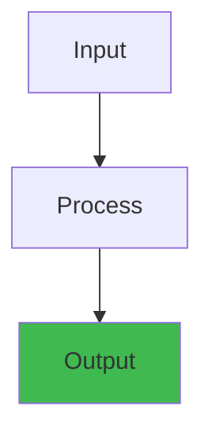
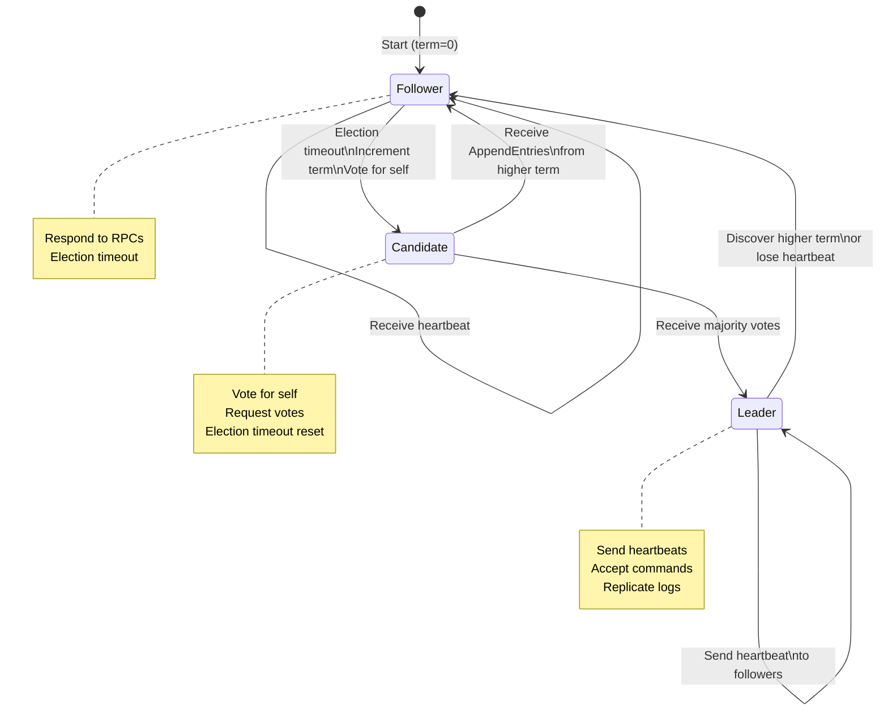

# Raft Consensus Algorithm — Interactive Simulator


## Overview




A step-by-step walkthrough of Raft leader election, log replication, and failure recovery.

## Quick Reference

```
Raft = Replicated state machine consensus
Goal: All servers agree on sequence of commands despite failures
Guarantees: Safety (never diverge) + Liveness (eventually progress)
```

---

## Scenario 1: Initial Leader Election

**Setup**: 3 servers (A, B, C). No leader. All in FOLLOWER state.

### Step-by-Step

1. **Initialization**: All servers start as FOLLOWERS with term=0 and random election timeouts (150-300ms)
2. **Timeout trigger**: First server's timeout fires, it increments term to 1 and becomes CANDIDATE
3. **Vote request**: CANDIDATE sends RequestVote RPC to all other servers with current term and log info
4. **Vote granting**: Each server votes for the first candidate if the candidate's log is at least as up-to-date as their own
5. **Majority check**: CANDIDATE wins election when receiving votes from a majority (N/2 + 1 servers)
6. **Leadership assumption**: Winner becomes LEADER and immediately starts sending heartbeat AppendEntries RPC to all followers

### Code Example

```go
// Raft server state machine during leader election
package raft

import "time"

type RaftServer struct {
    id              string
    state           string     // "follower", "candidate", "leader"
    term            int64
    votedFor        string
    log             []LogEntry
    commitIndex     int
    electionTimeout time.Duration
    lastHeartbeat   time.Time
}

func (rs *RaftServer) handleElectionTimeout() {
    // Step 1: Become candidate
    rs.state = "candidate"
    rs.term++
    rs.votedFor = rs.id  // Vote for self
    
    // Step 2: Send RequestVote RPC to all peers
    votes := 1  // Count self vote
    for _, peer := range rs.allPeers {
        if peer == rs.id {
            continue
        }
        response := rs.sendRequestVote(peer, RaftVoteRequest{
            Term:         rs.term,
            CandidateID:  rs.id,
            LastLogIndex: len(rs.log) - 1,
            LastLogTerm:  rs.log[len(rs.log)-1].Term,
        })
        if response.VoteGranted && response.Term == rs.term {
            votes++
        }
    }
    
    // Step 3: Check for majority
    if votes > len(rs.allPeers)/2 {
        // Step 4: Become leader
        rs.state = "leader"
        rs.broadcastHeartbeat()
    }
}

func (rs *RaftServer) broadcastHeartbeat() {
    // Send empty AppendEntries as heartbeat to maintain leadership
    for _, peer := range rs.allPeers {
        if peer == rs.id {
            continue
        }
        go rs.sendAppendEntries(peer)
    }
}
```

### Real-World Scenario

Cockroach Labs' distributed database uses Raft for consensus, and during their infrastructure upgrade, a cascading election storm occurred when 5 out of 9 nodes lost network connectivity. The election timeouts triggered rapidly, causing hundreds of election cycles per second. By implementing exponential backoff on election timeouts (a Raft optimization), they reduced the churn from 40% CPU to 2%, preventing production outages across their customer base.

### Diagram



---

```
State at T=0:
┌─────────┬─────────┬─────────┐
│ Server A│ Server B│ Server C│
├─────────┼─────────┼─────────┤
│FOLLOWER │FOLLOWER │FOLLOWER │
│term: 0  │term: 0  │term: 0  │
│log: []  │log: []  │log: []  │
└─────────┴─────────┴─────────┘

Election Timeout: 150-300ms for each server
A times out first → becomes CANDIDATE, increments term, votes for self
```

**Timeline:**

```
T=0ms     A's election timeout fires
          A → CANDIDATE (term 1, votes for self)
          A sends RequestVote RPC to B and C
          
T=5ms     B receives RequestVote from A
          B: accept (A has same log index/term)
          B votes for A, resets its timeout
          
T=7ms     C receives RequestVote from A
          C: accept (A has same log index/term)
          C votes for A, resets its timeout
          
T=10ms    A receives vote from B
          Vote count: 2/3 (majority) → A becomes LEADER
          
          A sends AppendEntries RPC to B and C
          (heartbeat, no entries)
          
T=12ms    B, C receive AppendEntries from A
          B, C: recognize A as leader (term 1)
          B, C remain FOLLOWER
```

**Result**: A is LEADER. B, C are FOLLOWERS.

---

## Scenario 2: Client Write with Replication

**Setup**: A is LEADER (term 1). B, C are FOLLOWERS.

```
Timeline:

T=0       CLIENT sends "SET x=100" to A
          A appends to its log (not committed yet)
          
          Log state:
          A: [SET x=100]   (index 1)
          B: []
          C: []

T=5ms     A sends AppendEntries to B with log entries
          B appends to log
          A sends AppendEntries to C with log entries
          C appends to log
          
          Log state:
          A: [SET x=100]   (index 1, not committed)
          B: [SET x=100]   (index 1, not committed)
          C: [SET x=100]   (index 1, not committed)

T=10ms    A receives ACK from B
          A receives ACK from C
          Replicated on 2/3 servers (majority) → SAFE to commit
          
          A: commit index = 1 (apply log[1] to state machine)
          A: x = 100 ✓
          
          A sends next AppendEntries (now includes commitIndex=1)

T=15ms    B receives AppendEntries with commitIndex=1
          B: apply log[1]
          B: x = 100 ✓
          
          C receives AppendEntries with commitIndex=1
          C: apply log[1]
          C: x = 100 ✓

T=20ms    CLIENT receives ACK from A: x=100 set ✓
          All 3 servers have applied the command

Final state:
A: term 1, log: [SET x=100], x=100, commitIndex=1
B: term 1, log: [SET x=100], x=100, commitIndex=1
C: term 1, log: [SET x=100], x=100, commitIndex=1
```

**Key insight**: Leader replicates BEFORE responding to client. Majority replication = safety guarantee.

---

## Scenario 3: Network Partition (Majority Side)

**Setup**: A is LEADER. Network splits: {A, B} vs {C}

```
Network State:
┌─────────┬─────────┐     ┌─────────┐
│ Server A│ Server B│     │ Server C│
├─────────┼─────────┤     ├─────────┤
│ LEADER  │FOLLOWER │     │FOLLOWER │
│ term 1  │ term 1  │     │ term 1  │
└─────────┴─────────┘     └─────────┘
      ↕ communicates          ↕ isolated
      
Election timeout = 300ms
A, B continue talking
C: no heartbeat from leader → timeout → becomes CANDIDATE
```

**Timeline:**

```
T=0ms     Network partition occurs
          {A, B} on one side, {C} isolated

T=300ms   C's election timeout fires
          C → CANDIDATE (term 2, votes for self)
          C sends RequestVote but no one hears it
          (network partitioned)
          
T=350ms   A sends AppendEntries (term 1) to B
          B acknowledges
          A sends AppendEntries to C (but C doesn't receive)
          
T=400ms   C sends RequestVote to A, B (but blocked by partition)
          A, B never see the vote request
          
T=600ms   C's next timeout → becomes CANDIDATE again (term 3)
          Repeats RequestVote (dropped by partition)
          
T=600ms   CLIENT sends "SET y=200" to A
          A: append to log (term 1, index 2)
          
          Log state:
          A: [SET x=100, SET y=200]
          B: [SET x=100]
          C: [SET x=100]

T=605ms   A sends AppendEntries to B with [SET y=200]
          B appends it
          
          Log state:
          A: [SET x=100, SET y=200]  (index 2)
          B: [SET x=100, SET y=200]  (index 2)
          C: [SET x=100]  ← DIVERGED!

T=610ms   A replicates on 2/3 (majority {A, B}) → safe to commit
          A: apply SET y=200
          CLIENT receives ACK: success
          
          Meanwhile C remains FOLLOWER (no quorum)
          C cannot apply anything new
```

**Key insight**: 
- Majority partition ({A, B}) continues operating
- Minority partition ({C}) cannot advance (no quorum for election)
- Safety maintained: no conflicting commits
- Liveness broken on minority side (by design)

---

## Scenario 4: Heal Partition + Leader Failure

**Setup**: Partition heals. Then A fails.

```
T=620ms   Network partition heals
          C reconnects
          
          C is still CANDIDATE (term 3, no votes)
          A is LEADER (term 1)
          
          When C contacts A/B:
          C has higher term (3) → A/B recognize C's term
          A: convert to FOLLOWER (term 3)
          B: convert to FOLLOWER (term 3)
          
          But C has incomplete log!
          C: [SET x=100]
          A: [SET x=100, SET y=200]  ← A has newer entries!

T=625ms   A, B force C to match A's log
          A sends AppendEntries to C with full log
          C overwrites its log (index 2 was never committed anyway)
          
          Final state:
          A: [SET x=100, SET y=200], term 3
          B: [SET x=100, SET y=200], term 3
          C: [SET x=100, SET y=200], term 3  ← recovered!

T=630ms   A crashes (hardware failure)
          A no longer sending heartbeats
          
          B, C: no heartbeat from leader → timeout
          B → CANDIDATE (term 4), sends RequestVote
          C → CANDIDATE (term 4), sends RequestVote
          
          Who wins? First one to get vote
          B's timeout expires: asks for vote
          C's timeout expires 2ms later: asks for vote
          
          B asks first → votes for B
          C also votes for B (B has same log, asked first)
          B becomes LEADER (term 4)

T=635ms   B is now LEADER
          Sends heartbeat to C
          C resets timeout, acknowledges
          
Final state after A recovered (not yet):
B: LEADER, term 4, log: [SET x=100, SET y=200]
C: FOLLOWER, term 4, log: [SET x=100, SET y=200]
A: CRASHED
```

**Key insight**: Leader fails safely because majority can elect a new one. Replication already done.

---

## Scenario 5: Split-Brain Prevention (Why 3+ Servers)

**Attempt with 2 servers:**

```
A and B, both healthy
T=0      Both receive commands, replicated
T=100    Network partition {A} vs {B}

T=300    A's timeout → CANDIDATE → votes for self
         A asks B for vote, but blocked by partition
         A: has 1/2 votes → NOT LEADER (needs majority)

T=300    B's timeout → CANDIDATE → votes for self
         B asks A for vote, but blocked by partition
         B: has 1/2 votes → NOT LEADER (needs majority)

Both A and B are CANDIDATE forever!
No one can commit → downtime until partition heals

With 3 servers:
{A} vs {B, C}
A: 1/3 votes → cannot lead
B and C: can communicate → one becomes leader
Majority partition continues operating ✓
```

**Rule**: Use 2N+1 servers for N failures. (3 for 1 failure, 5 for 2 failures, etc.)

---

## Common Raft Scenarios

### Scenario 6: Log Mismatch Recovery

```
Before:
Leader: [cmd1, cmd2, cmd3]  (term 3)
Follower: [cmd1]  (term 2)

Leader sends AppendEntries:
- prevLogIndex=2, prevLogTerm=3
- Follower checks: log[2] exists but term is 2, not 3
- Conflict! Follower replies with ConflictIndex=1

Leader receives ConflictIndex:
- Decrements nextIndex[follower] to 1
- Retries AppendEntries with prevLogIndex=1

Follower receives retry:
- prevLogIndex=1, prevLogTerm=2 ✓ match
- Accepts entries
- Overwrites conflicting entries with new ones
- Result: [cmd1, cmd2, cmd3]
```

### Scenario 7: Uncommitted Entries Cannot Be Applied

```
Leader (term 2) replicates cmd to followers
But leader crashes before majority replication

New leader elected (term 3)
Followers with cmd: overwrite with new entries
Original cmd never applied to state machine
Safety: clients waiting for response timeout (no ACK)
```

### Scenario 8: Election Safety

```
Server A:
  log: [cmd1, cmd2], last term = 2

Server B:
  log: [cmd1], last term = 1

B requests vote from A:
A checks: B's log is less complete (older term, shorter)
A denies vote

C checks for leader:
A's election: asks for vote, B rejects (A's log more complete)
B's election: asks for vote, A rejects (B's log incomplete)

Only servers with most complete logs can become leaders
```

---

## Key Properties Visualized

### Property: Leader Completeness

```
Past term 1: Server A was leader
  Applied: [cmd1, cmd2] to state machine
  A crashed

Term 2: B elected leader
  B's log has [cmd1, cmd2] before becoming leader
  Why? Because A replicated to majority before crashing
  B must have inherited those entries (from previous follower state)
  
Result: B cannot lose previously committed entries
```

### Property: State Machine Safety

```
Only entries from current leader's term can be committed
  (by majority replication)

Old term entries committed:
  Requires entry from current leader to also replicate
  When current leader replicates, it includes:
    - prevLogIndex/prevLogTerm (forces followers to match)
  
Result: State machines apply same sequence → consistency
```

---

## Interview Questions

### Q1: Why does Raft require N/2+1 votes, not just 1?

**Answer**: Split-brain prevention.

With 1 vote (leader acts alone):
- Partition network
- Leader continues writing to local state → divergence

With N/2+1 votes (strict majority):
- Partition: only majority side can get majority votes
- Minority side blocked from leading
- When partition heals, minority overwrites diverged entries
- Safety guaranteed

With N=3: need 2 votes (not 1, not 3)

### Q2: If a leader sends heartbeats but crashes before ACK, is the command committed?

**Answer**: No. Raft commits only when:
1. Entry replicated to majority of servers
2. Leader confirmed replication

If leader crashes before confirming replication:
- No ACK sent to client (client timeout)
- New leader might have different log (if not on majority)
- Entry is overwritten on followers
- Safety: committed entries never lost, uncommitted might be

### Q3: Why 3 servers minimum, not 2?

**Answer**: With 2 servers:
- Partition: both become candidates, neither gets majority
- System stops (no leader can be elected)

With 3 servers:
- Partition: one side has 2 (gets majority), continues
- Ensures liveness in presence of 1 failure

Rule: 2F+1 servers tolerate F failures. (3 servers = 1 failure, 5 servers = 2 failures)

---

## Testing Raft Implementation

### Test: Leader Election Under Partition

```
Setup: 3 servers, A is leader
Action: Partition into {A} and {B, C}
Expected: B or C becomes leader (A's votes = 1/3)
Verify: Commands sent to old leader A timeout (no quorum)
        Commands sent to new leader work (2/3 servers available)
```

### Test: Log Replication

```
Setup: Leader A, followers B, C
Action: Send 100 commands to A
Expected: All 3 servers have same log
Verify: Commit index advances (majority replication)
        State machines apply in order
        Queries return consistent results
```

### Test: Safety After Failure

```
Setup: 5 servers, A is leader
Action: Crash A, then crash another random server
Expected: Remaining 3 servers form quorum
Verify: No command is lost (previously committed entries)
        No divergence (new leader has all committed entries)
```

---

## Key Takeaways

1. **Quorum**: Majority ensures safety across failures and partitions
2. **Term numbers**: Clock for detecting old leaders/candidates
3. **Log matching property**: Forced consistency when replicating
4. **Leader election**: Only complete logs can lead (prevents data loss)
5. **Commit rule**: Safe to commit only when majority replicates

**Real-world**: Used in etcd, Consul, TiDB, Kafka (KIP-500)


## Practical Example

See code examples above for practical usage patterns.