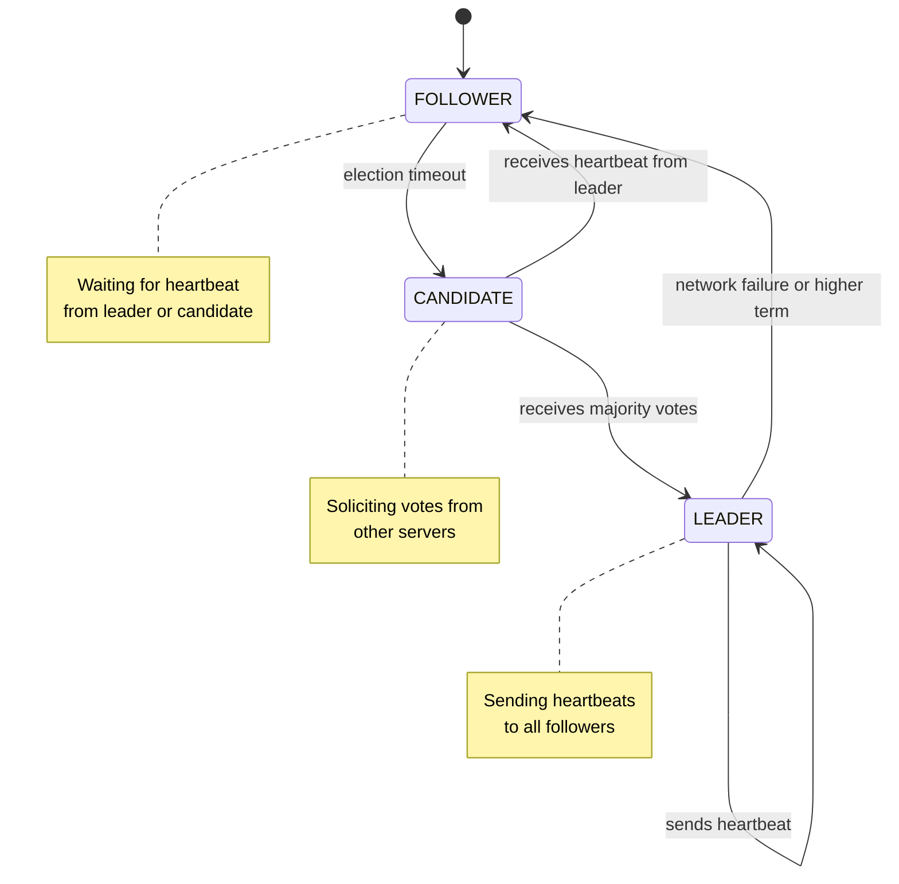

# Raft Consensus Algorithm

## Overview

Raft is a consensus algorithm that allows a cluster of servers to agree on a sequence of commands despite server failures. It's the foundation for distributed databases, configuration management, and replicated state machines.

## State Machine

## Key Concepts

### 1. Terms
- Logical clock for the cluster
- Each term has at most one leader
- Servers update term when receiving higher term

### 2. Election Timeout
- Each follower has random timeout (150-300ms)
- If no heartbeat received → become candidate
- Send RequestVote RPC to all servers
- Win election with majority votes

### 3. Leader Heartbeat
- Leader sends periodic AppendEntries RPC
- Keeps followers from timing out
- Replicates log entries to all servers

### 4. Log Replication
- Leader appends new entry to its log
- Sends entry to all followers
- Once majority acknowledged → entry is committed
- Committed entries applied to state machine

## Failure Scenarios

### Network Partition
- Leader in minority partition steps down
- Majority partition elects new leader
- Minority partition cannot commit new entries
- When healed: old leader syncs from new leader

### Server Crash & Recovery
- Crashed server comes back as follower
- Catches up from leader's log
- No data loss for committed entries

### Split Vote
- Two candidates timeout simultaneously
- Each gets partial votes, neither reaches majority
- New election timeout triggers → retry

## Learning Objectives

- Understand how Raft ensures safety (consistency)
- Learn liveness guarantees (eventual progress)
- Compare with other consensus algorithms (Paxos, PBFT)
- Recognize Raft in production systems (etcd, Consul, etc.)

---

## 🎮 Interactive Simulator

Try the Raft leader election in real time:

**[→ Launch Interactive Raft Simulator](raft-consensus.html)**

Simulate:
- Multiple election rounds
- Network partitions
- Vote granting
- Term advancement

---

## Real-World Usage

| System | Role | Replicas |
|--------|------|----------|
| etcd | Configuration/service discovery | 3-7 |
| Consul | Service mesh coordination | 3-5 |
| NATS | Message streaming | 3+ |
| CockroachDB | Database consensus | 3+ |
| TiDB | Distributed SQL | 3+ |

## References

- [Raft Paper](https://raft.github.io/)
- [Raft Visualization](https://raft.github.io/raftscope/)
- [etcd Raft Documentation](https://github.com/etcd-io/etcd/tree/main/raft)
