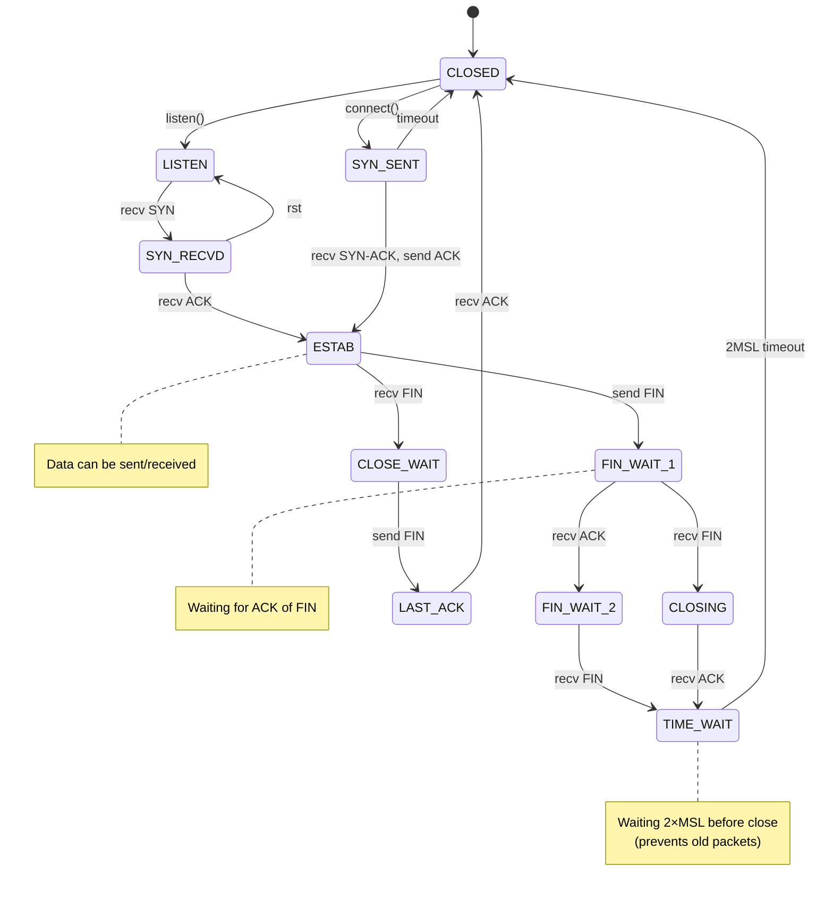

# TCP Connection Lifecycle — 3-Way Handshake & Teardown

## Overview

TCP connections require a **3-way handshake** to establish state on both ends. Similarly, graceful shutdown requires a **4-way termination**. Understanding these state machines is critical for debugging connection issues, timeouts, and resource leaks.

## Full State Machine



## 3-Way Handshake (Connection Setup)

### Step 1: SYN (Client → Server)
```
Client                              Server
  │                                   │
  ├──── SYN, seq=x, ack=0 ───────────>│
  │                              SYN_RECVD
SYN_SENT
  │
```
- Client sends **SYN** with initial sequence number `x`
- ACK field is 0 (no data yet)
- Client transitions to `SYN_SENT`

### Step 2: SYN-ACK (Server → Client)
```
Client                              Server
  │                                   │
  │<──── SYN-ACK, seq=y, ack=x+1 ─────┤
  │                                   │
```
- Server responds with **SYN-ACK**
- Server's sequence number: `y`
- Server acknowledges client's `x` by setting `ack=x+1`
- Server transitions to `SYN_RECVD`

### Step 3: ACK (Client → Server)
```
Client                              Server
  │                                   │
  ├──── ACK, seq=x+1, ack=y+1 ───────>│
  │                                ESTAB
ESTAB
  │
```
- Client sends **ACK** acknowledging server's `y`
- Sets `seq=x+1, ack=y+1`
- Both sides now in `ESTAB` (established)
- **Data transfer can begin**

## 4-Way Teardown (Connection Close)

### Graceful Close Sequence

```
Client                              Server
  │                                   │
  ├──── FIN ─────────────────────────>│
FIN_WAIT_1                      CLOSE_WAIT
  │                                   │
  │<──── ACK ─────────────────────────┤
FIN_WAIT_2                       CLOSE_WAIT
  │                                   │
  │<──── FIN ─────────────────────────┤
  │                              LAST_ACK
TIME_WAIT                           │
  │                                   │
  ├──── ACK ─────────────────────────>│
  │                              CLOSED
  │
 2MSL wait
  │
 CLOSED
```

**Why 4 steps?**
- Each side independently sends FIN and gets ACK
- Allows graceful shutdown even if one side crashes
- `TIME_WAIT` prevents old packets from new connections

## Key Transitions

| State | Trigger | Next State | Notes |
|-------|---------|-----------|-------|
| CLOSED | listen() | LISTEN | Passive open |
| CLOSED | connect() | SYN_SENT | Active open |
| SYN_SENT | recv SYN-ACK | ESTAB | Connection ready |
| ESTAB | send FIN | FIN_WAIT_1 | Close initiator |
| ESTAB | recv FIN | CLOSE_WAIT | Close responder |
| FIN_WAIT_1 | recv ACK | FIN_WAIT_2 | Waiting for peer FIN |
| FIN_WAIT_2 | recv FIN | TIME_WAIT | Nearly closed |
| TIME_WAIT | 2×MSL | CLOSED | Fully closed |

## Sequence Numbers & ACK

- **Sequence (SEQ)**: Byte position in stream
- **Acknowledgment (ACK)**: Next expected byte
- `ack = seq + 1` for SYN packets (counts as 1 byte)
- `ack = seq + data_len` for data packets

## Common Issues

### Connection Hangs in FIN_WAIT_1
- Server crashed → FIN never sent back
- Network loss → timeout (usually 60s)
- Use `SO_LINGER` to control behavior

### TIME_WAIT Accumulation
- Many closed connections in TIME_WAIT
- Holds socket resources for 2×MSL (~60s on Linux)
- Use `SO_REUSEADDR` to reuse port
- Can't reconnect immediately to same port/IP

### Half-Open Connections
- Client crashes → connection stays in ESTAB on server
- Server detects via TCP keepalive (2 hours default)
- Application should use heartbeats instead

---

## 🎮 Interactive Simulator

Step through the handshake and teardown:

**[→ Launch TCP State Machine Simulator](tcp-state-machine.html)**

Try:
- Open connection step-by-step
- Watch sequence/ACK numbers
- Close connection gracefully
- See all state transitions

---

## Real-World Debugging

### Check Connection States
```bash
# Linux: See all TCP states
ss -tan | grep -E 'ESTAB|TIME_WAIT|FIN_WAIT'

# Count by state
ss -tan | tail -n +2 | awk '{print $1}' | sort | uniq -c

# macOS
netstat -tan | grep tcp
```

### Analyze Packet Capture
```bash
# Capture TCP traffic
tcpdump -i eth0 -w capture.pcap 'tcp'

# Analyze with Wireshark
# Look for SYN/SYN-ACK/ACK sequence
# Check SEQ/ACK numbers matching
```

### Socket Options
```c
// Disable TIME_WAIT
setsockopt(sock, SOL_SOCKET, SO_REUSEADDR, &one, sizeof(one));

// Enable TCP keepalive
setsockopt(sock, SOL_SOCKET, SO_KEEPALIVE, &one, sizeof(one));

// Set connection timeout
struct timeval tv = {5, 0};  // 5 seconds
setsockopt(sock, SOL_SOCKET, SO_RCVTIMEO, &tv, sizeof(tv));
```

## References

- [RFC 793 — TCP Specification](https://tools.ietf.org/html/rfc793)
- [TCP State Machine Diagram](https://www.oreilly.com/library/view/tcpip-illustrated-volume-1/0201633469/)
- [Linux TCP States](https://www.kernel.org/doc/html/latest/networking/ss-stats.html)
