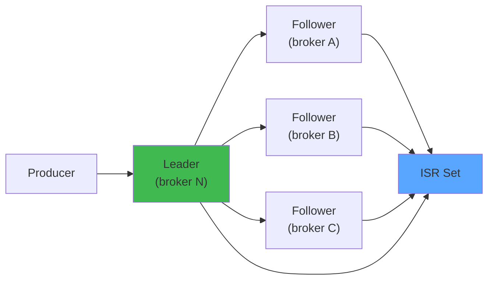
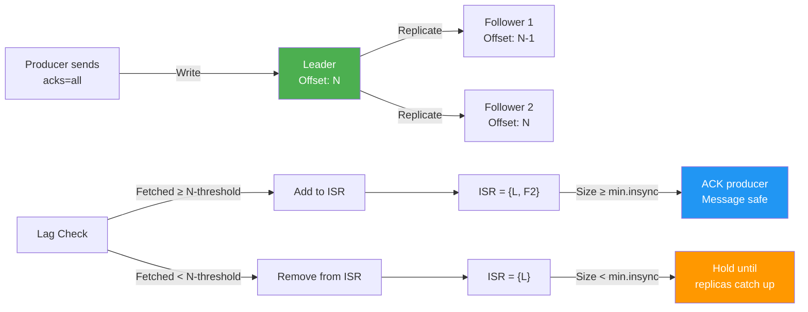

# Kafka Partition Replication — Interactive Simulator

> **Run the live simulator**: [kafka-replication.html](/kafka-replication.html) — produce messages, kill leaders, watch ISR management in real-time.

## Overview



Simulate Kafka partition replication: leader election, ISR management, producer acks, and failure recovery across a multi-broker cluster. Topics: leader election, ISR shrink/expand, acks=all vs acks=1, min.insync.replicas.

**Learning Objectives:**
- Understand how Kafka maintains consistency across replicas
- See how ISR (In-Sync Replica) set expands and contracts
- Compare durability guarantees of different acks settings
- Observe leader election and its impact on availability

### Step-by-Step


1. **Producer sends message** to partition leader with configurable acks (0, 1, or all)
2. **Leader appends to log** at offset N, waits for acknowledgments based on acks setting
3. **Followers fetch** asynchronously, updating their log offsets with a configurable lag tolerance
4. **ISR tracking**: If a follower falls behind the configured lag threshold (replica.lag.time.max.ms), it's removed from ISR
5. **Acknowledgment logic**: acks=0 (no wait), acks=1 (leader only), acks=all (all ISR replicas)
6. **Leader election**: If leader fails, the first follower in ISR becomes new leader, and replicas re-sync
7. **Durability guarantee**: Message is safe when ISR size >= min.insync.replicas

### Code Example


```python
# Kafka replication state machine simulation
from enum import Enum
from dataclasses import dataclass, field
from typing import Set

class ReplicaState(Enum):
    ONLINE = "online"
    SYNCING = "syncing"
    OUT_OF_SYNC = "out_of_sync"
    OFFLINE = "offline"

@dataclass
class KafkaReplica:
    broker_id: int
    partition_id: int
    is_leader: bool
    committed_offset: int = 0
    fetched_offset: int = 0
    state: ReplicaState = ReplicaState.ONLINE

@dataclass
class KafkaPartition:
    partition_id: int
    leader: KafkaReplica
    replicas: list[KafkaReplica] = field(default_factory=list)
    isr: Set[int] = field(default_factory=set)  # In-Sync Replicas
    acks_config: str = "all"  # "all", "1", or "0"
    min_insync_replicas: int = 2
    replica_lag_threshold_ms: int = 10000

    def __post_init__(self):
        # Initialize ISR with leader
        self.isr = {r.broker_id for r in [self.leader] + self.replicas}

    def produce_message(self, offset: int) -> bool:
        """
        Append message to leader and replicate to followers.
        Returns True if message is safely replicated.
        """
        # Leader appends
        self.leader.committed_offset = offset
        
        # Determine required acks based on config
        if self.acks_config == "0":
            # Fire and forget
            return True
        elif self.acks_config == "1":
            # Wait for leader only
            return True
        elif self.acks_config == "all":
            # Wait for all ISR replicas
            replicas_acked = 1  # Leader counts as 1
            for replica in self.replicas:
                if replica.broker_id in self.isr and replica.state == ReplicaState.ONLINE:
                    replica.fetched_offset = offset
                    replicas_acked += 1
            
            # Check if we have minimum required replicas
            return replicas_acked >= self.min_insync_replicas
        
        return False

    def check_isr_health(self, current_time_ms: int, last_fetch_time: dict):
        """
        Check each replica's lag and update ISR.
        Replicas are removed if they fall behind the threshold.
        """
        new_isr = {self.leader.broker_id}
        
        for replica in self.replicas:
            time_since_fetch = current_time_ms - last_fetch_time.get(replica.broker_id, 0)
            lag = self.leader.committed_offset - replica.fetched_offset
            
            if lag > 0 and time_since_fetch > self.replica_lag_threshold_ms:
                # Replica is lagging too far
                replica.state = ReplicaState.OUT_OF_SYNC
            else:
                # Replica is caught up
                replica.state = ReplicaState.SYNCING
                new_isr.add(replica.broker_id)
        
        self.isr = new_isr

    def elect_new_leader(self):
        """
        Elect a new leader from the ISR after current leader failure.
        First broker in ISR becomes the new leader.
        """
        if not self.isr:
            raise Exception("No replicas available for election")
        
        new_leader_id = sorted(self.isr)[0]
        
        # Find and promote the replica
        for replica in self.replicas:
            if replica.broker_id == new_leader_id:
                replica.is_leader = True
                self.leader = replica
                break

# Simulation example
partition = KafkaPartition(
    partition_id=0,
    leader=KafkaReplica(broker_id=1, partition_id=0, is_leader=True),
    replicas=[
        KafkaReplica(broker_id=2, partition_id=0, is_leader=False),
        KafkaReplica(broker_id=3, partition_id=0, is_leader=False),
    ],
    acks_config="all",
    min_insync_replicas=2
)

# Produce with acks=all
success = partition.produce_message(offset=0)
print(f"Message 0 replicated: {success}, ISR size: {len(partition.isr)}")

# Simulate lag on broker 2
success = partition.produce_message(offset=1)
print(f"Message 1 replicated: {success}, ISR size: {len(partition.isr)}")

# Leader fails
print(f"\nLeader {partition.leader.broker_id} fails")
partition.elect_new_leader()
print(f"New leader elected: {partition.leader.broker_id}")
```

### Real-World Scenario


LinkedIn experienced a Kafka outage where a broker's disk filled up, causing it to fall out of the ISR. With min.insync.replicas=2 and only 2 other healthy replicas, producers with acks=all started blocking, causing cascading failures in upstream services. The Kafka cluster's availability directly impacted the entire recommendation engine. They fixed it by: 1) immediately evicting the disk-full broker, 2) temporarily lowering min.insync.replicas to 1, 3) adding a new broker and rebalancing partitions. This incident led to automated disk usage monitoring and alerting.

### ISR Management Diagram




---

## Actors/Components


| Actor | Role |
|-------|------|
| **Topic** | Logical channel; has N partitions |
| **Partition** | Unit of parallelism; has 1 leader + M followers |
| **Leader** | Handles all reads/writes for a partition |
| **Follower** | Replicates from leader; takes over if leader fails |
| **ISR** | Set of in-sync replicas; determines durability |
| **Producer** | Writes records with configurable acks |
| **Consumer** | Reads from leader (or follower with rack-aware config) |
| **Controller** | Cluster-wide leader for partition reassignment |
| **ZooKeeper/KRaft** | Stores cluster metadata, elects controller |

---

## State Machine


### Broker/Replica States


```
                    ┌──────────┐
                    │  ONLINE   │ ◄─── Leader or Follower
                    └────┬─────┘
                         │
                    ┌────▼─────┐
                    │   ISR    │ ◄─── Fully caught-up with leader
                    └────┬─────┘
                         │
          ┌──────────────┼──────────────┐
          │              │              │
    ┌─────▼────┐  ┌──────▼──────┐  ┌───▼──────┐
    │  SYNCING │  │ OUT OF SYNC │  │  OFFLINE │
    └──────────┘  └─────────────┘  └──────────┘
```

### ISR Transitions


```
                    ┌────────┐
                    │  ISR   │
                    │(in-sync)│
                    └───┬────┘
                   ┌────┴────┐
                   │         │
              ┌────▼──┐  ┌───▼────┐
              │ SHRINK │  │ EXPAND │
              │(lag >  │  │(caught │
              │config) │  │  up)   │
              └────────┘  └────────┘
              ISR size:  ISR size:
              R-1,R-2...  R+1,R+2...
```

### ISR State Machine (Detailed)


```
         replica.catch = True
    ┌─────────────────────────────────────┐
    │                                      │
    ▼                                      │
┌──────────┐  fetch lag >  ┌───────────┐   │
│  ISR IN  │ ─────────►   │ ISR OUT   │───┘
│ (synced) │              │ (lagging) │
└──────────┘ ◄─────────── └───────────┘
               fetch lag = 0
               (caught up)

Also:
  - replica.fetch.max.bytes exceeded? → SHRINK
  - replica.lag.time.max.ms exceeded? → SHRINK
  - Follower reconnects after failure? → rejoin ISR when caught up
```

---

## Animation Frames


### Frame 1: Normal Replication (ISR = [L, F1, F2, F3])


```
Broker-1 [Leader]        Broker-2 [Follower]      Broker-3 [Follower]
┌──────────────────┐    ┌──────────────────┐      ┌──────────────────┐
│ Partition-0      │    │ Partition-0      │      │ Partition-0      │
│ leader=Broker-1  │    │ follower-of: 1   │      │ follower-of: 1   │
│                  │    │                  │      │                  │
│ LOG:             │    │ LOG:             │      │ LOG:             │
│ [0] msg-0        │    │ [0] msg-0        │      │ [0] msg-0        │
│ [1] msg-1        │◄──►│ [1] msg-1        │◄──►  │ [1] msg-1        │
│ [2] msg-2        │    │ [2] msg-2        │      │ [2] msg-2        │
│ LEO: 3           │    │ LEO: 3           │      │ LEO: 3           │
│ HW: 3            │    │ HW: 3            │      │ HW: 3            │
└──────────────────┘    └──────────────────┘      └──────────────────┘
    ▲                                               ISR: [1, 2, 3]
    │  acks=all                                      min.insync: 2
┌───┴──────────┐
│  Producer    │
│  sent msg-3  │
└──────────────┘
```

**What happens:**
1. Producer sends msg-3 with acks=all
2. Leader appends to log, LEO=3
3. Followers fetch and append (LEO=3)
4. Leader sees all ISR members at LEO → advances HW to 3
5. Leader responds to producer

### Frame 2: Follower Lag → ISR Shrink


```
Broker-1 [Leader]        Broker-2 [Stalled]         Broker-3 [Follower]
┌──────────────────┐    ┌──────────────────┐      ┌──────────────────┐
│ LOG:             │    │ LOG:             │      │ LOG:             │
│ [0] msg-0        │    │ [0] msg-0        │      │ [0] msg-0        │
│ [1] msg-1        │    │ [1] msg-1        │      │ [1] msg-1        │
│ [2] msg-2        │    │ [2] msg-2        │      │ [2] msg-2        │
│ [3] msg-3        │    │ [3] ---          │      │ [3] msg-3        │
│ [4] msg-4        │    │ [4] ---          │      │ [4] msg-4        │
│ [5] msg-5        │    │ [5] ---          │      │ [5] msg-5        │
│ LEO: 6           │    │ LEO: 3 (stalled) │      │ LEO: 6           │
│ HW: 3 ← stuck   │    │ lag = 3          │      │ HW: 3            │
│                  │    │                  │      │                  │
│ ISR: [1, 3]     │    │ ISR: kicked!     │      │ ISR: [1, 3]      │
└──────────────────┘    └──────────────────┘      └──────────────────┘
```

**What happens:**
1. Broker-2 stalls (GC pause, network issue)
2. Leader detects lag > replica.lag.time.max.ms
3. Leader removes Broker-2 from ISR → ISR = [1, 3]
4. HW advances on ISR majority: leader sees 2/2 ISR at LEO=6 → HW=6
5. Producer continues uninterrupted (ISR size 2 ≥ min.insync 2)

### Frame 3: ISR Below Min → Producer Failure


```
Broker-1 [Leader]        Broker-2 [Failed]          Broker-3 [Stalled]
┌──────────────────┐    ┌──────────────────┐      ┌──────────────────┐
│ LOG:             │    │ [dead]           │      │ LOG:             │
│ [0] msg-0        │                          │    │ [0] msg-0        │
│ [1] msg-1        │                          │    │ [1] msg-1        │
│ [2] msg-2        │                          │    │ [2] msg-2        │
│ [3] msg-3        │                          │    │ [3] ---          │
│ LEO: 4           │                          │    │ LEO: 3 (stalled) │
│                  │                          │    │ lag = 1          │
│ ISR: [1]         │                          │    │ ISR: kicked?     │
│ min.insync=2     │                          │    │                  │
│ NOT_ENOUGH_REPLI │                          │    │                  │
│ CATIONS error!   │                          │    │                  │
└──────────────────┘                          │    └──────────────────┘
```

**What happens:**
1. Broker-2 goes down completely
2. Broker-3 falls behind → removed from ISR
3. ISR = [1] (only leader), size = 1 < min.insync.replicas = 2
4. Producer send with acks=all → NOT_ENOUGH_REPLICATIONS exception
5. System still serving reads; writes blocked

---

## User Interactions


| Control | Type | Range/Options | Effect |
|---------|------|---------------|--------|
| **Broker count** | slider | 1-7 | Number of brokers in cluster |
| **Replication factor** | slider | 1-5 | Copies of each partition |
| **min.insync.replicas** | slider | 1-5 | Minimum ISR for write acceptance |
| **acks** | dropdown | 0, 1, all | Producer durability setting |
| **Inject failure** | button | - | Kill selected broker |
| **Recover broker** | button | - | Restart failed broker |
| **Stall broker** | button | - | Freeze a follower (simulate GC) |
| **Produce message** | button | - | Send N messages at configurable rate |
| **replica.lag.time.max.ms** | slider | 100-30000ms | Max time before ISR eviction |
| **Simulation speed** | slider | 0.1x-10x | Speed up/slow down time |

---

## Visual Transitions


| Event | Visual Effect |
|-------|---------------|
| **Leader elected** | Gold glow on leader; arrow from leader to followers |
| **Follower syncs** | Blue pulse along arrow; follower log grows |
| **ISR add** | Green checkmark appears on replica card |
| **ISR remove** | Red X on replica card; replica dims |
| **Leader failure** | Red flash on leader; countdown for new election |
| **New leader elected** | Gold glow transfers to new broker |
| **acks=all response** | Green checkmark on producer after all ISR confirm |
| **acks=1 response** | Yellow checkmark after leader alone confirms |
| **acks=0 response** | Gray checkmark; no replication shown |
| **NOT_ENOUGH_REPLICAS** | Red error banner on producer side |
| **Broker offline** | Gray out broker; connection lines dashed |
| **Broker recovers** | Broker fades in; starts syncing (blue progress bar) |
| **High watermark** | Annotated line on log showing committed position |
| **LEO position** | Marker at end of each replica's log |
| **Under-replicated** | Warning icon on partition; orange border |
| **ISR size=RF** | Green border (fully replicated) |
| **ISR size < RF** | Yellow border (degraded) |

---

## Edge Cases


| Edge Case | Behavior |
|-----------|----------|
| **Preferred leader election** | Controller reassigns leadership back to original leader when it rejoins |
| **Unclean leader election** | If all ISR members down, leader elected from non-ISR replicas (data loss risk) |
| **ISR = {leader only}** | Leader alone in ISR; writes succeed if min.insync=1, fail if higher |
| **RF > broker count** | Replication factor can't exceed broker count; assignment fails |
| **Simultaneous multiple failures** | If 2/3 brokers fail, remaining may or may not have a complete ISR |
| **Log truncation** | If leader was a non-ISR replica, its log may diverge and need truncation |
| **Exactly-once semantics** | Idempotent producer + transactional coordinator = EOS |
| **Rolling restart** | Brokers restart one by one; ISR shrinks and expands |
| **Disk failure** | Broker stays up but log is corrupted; must be re-replicated |
| **Throttled replication** | replica.fetch.max.bytes limits per-follower throughput |
| **ISR flapping** | Follower repeatedly joins, lags, gets kicked, rejoins |

---

## Failure Modes


| Failure | Symptom | Recovery |
|---------|---------|----------|
| **Leader crash** | Writes stall; producer timeouts | Controller elects new leader from ISR |
| **Follower crash** | ISR shrinks; no write impact | Follower re-syncs on restart |
| **Network partition** | Follower lags out of ISR | When partition heals, follower catches up, rejoins ISR |
| **Disk full (leader)** | Leader unbale to write; still serving reads | Requires manual intervention |
| **Disk full (follower)** | Follower stops replicating | Removed from ISR; catch up when space freed |
| **Chronic GC pause** | Follower appears dead; removed from ISR | Rejoin when GC finishes |
| **Corrupt log segment** | Replica fails to read log file | Re-replicate partition from leader |
| **Controller failure** | Partition reassignment blocked; existing ops continue | New controller elected from ZK/KRaft |
| **ZooKeeper down** | Metadata operations blocked; existing reads/writes continue | Restore ZK quorum |
| **ISR exhaustion** | All replicas lag; writes to leader still work depending on min.insync | Wait for any replica to catch up |
| **acks=all timeout** | Producer gets timeout waiting for follower confirm | Retry; may cause duplicates if message was committed |

---

## Metrics to Display


| Metric | Unit | Source |
|--------|------|--------|
| **ISR count** | integer | Per-partition, visible on each broker card |
| **High Watermark (HW)** | offset | Lagging indicator of committed position |
| **Log End Offset (LEO)** | offset | End of each replica's log |
| **Follower lag** | messages | LEO(leader) - LEO(follower) |
| **Follower lag (time)** | ms | How far behind in time |
| **Under-replicated partitions** | count | partitions where ISR < RF |
| **Leader count** | integer | Partitions for which this broker is leader |
| **Bytes in/out** | bytes/sec | Replication traffic |
| **Produce request rate** | req/s | Incoming write rate |
| **Produce latency (acks=0/1/all)** | ms | Per-ack-mode latency |
| **ISR shrink rate** | events/min | How often followers get kicked |
| **ISR expand rate** | events/min | How often followers rejoin |
| **Leader election rate** | events/min | How often leadership changes |
| **Active controller** | boolean | Whether this broker is the controller |
| **Replication quota utilization** | % | Throttle usage if quotas enabled |
| **Not-enough-replicas error count** | count | Rate of NOT_ENOUGH_REPLICATIONS |

---

## Scenario Walkthroughs


### Scenario 1: Healthy Cluster — Normal Produce with acks=all


**Setup:** 3 brokers, RF=3, min.insync=2, acks=all

```
Timeline:
T=0ms    Cluster healthy. Partition-0 leader on Broker-1.
         ISR = [1, 2, 3], HW = 100, LEO = 100 on all.

T=10ms   Producer sends "msg-101" (acks=all)
         Producer buffer: [msg-101]

T=12ms   Leader (B1) appends msg-101 → LEO = 101
         B1 sends Fetch response to waiting followers
         B1 does NOT respond to producer yet

T=15ms   B2 fetches msg-101 → LEO = 101
         B2 acknowledges to B1

T=18ms   B3 fetches msg-101 → LEO = 101
         B3 acknowledges to B1

T=20ms   Leader sees all 3 ISR at LEO 101
         HW advances from 100 to 101
         Leader responds to Producer: SUCCESS

Latency: 20ms (1 network RTT to followers)
Durability: msg-101 on all 3 brokers before producer gets ACK
```

### Scenario 2: Single Replica Loss — ISR Shrink and Recovery


**Setup:** 3 brokers, RF=3, min.insync=2, acks=all

```
Timeline:

Phase A: Follower stalls

T=0ms    ISR = [1, 2, 3], HW = 200

T=5ms    Broker-2 hits GC pause (30 seconds)
         B2 stops fetching; lag starts growing

T=100ms  Producer sends msgs 201-210 (acks=all)
         B1 appends, LEO=210
         B3 appends, LEO=210
         B2 stuck at LEO=200

T=500ms  B2's lag exceeds replica.lag.time.max.ms (default 10s)
         Leader removes B2 from ISR → ISR = [1, 3]
         Warning on partition: under replicated

T=510ms  Producer sends msg-211
         B1 appends, B3 appends
         ISR size = 2 (B1 + B3) ≥ min.insync = 2 → still OK
         HW advances: 211

Phase B: Follower recovers

T=30s    B2 finishes GC. Resumes fetching.

T=30.5s  B2 catches up (fetches msgs 201-211)
         B2 LEO = 211, lag = 0

T=31s    Leader adds B2 back to ISR → ISR = [1, 2, 3]
         Warning clears. Full replication restored.

Total disruption: ~30s of under-replication, 0s of write downtime
```

### Scenario 3: ISR Depletion (min.insync Violation)


**Setup:** 3 brokers, RF=3, min.insync=2, acks=all

```
Timeline:

T=0ms    ISR = [1, 2, 3]

T=5ms    Broker-2 crashes (power failure)
         B2 disappears from cluster
         Leader detects ZK session timeout → ISR = [1, 3]

T=10ms   Broker-3 has network blip (50% packet loss)
         B3's replication slows drastically

T=15s    B3 lag exceeds max lag (10s timeout)
         Leader kicks B3 from ISR → ISR = [1]
         ISR size = 1 < min.insync = 2

T=16ms   Producer sends msg-301 (acks=all)
         Leader receives, appends, LEO=301
         Leader checks ISR: size 1, min.insync=2
         → NOT_ENOUGH_REPLICATIONS exception

T=17ms   Producer sends msg-302 (acks=1)
         Leader appends, responds immediately → SUCCESS
         Risk: msg-302 only on B1! If B1 dies, lost.

T=18ms   Producer sends msg-303 (acks=0)
         Leader doesn't wait → SUCCESS (fire and forget)
         Even less durable

T=20s    B3 recovers network, catches up
         ISR = [1, 3] → size 2 = min.insync

T=21s    B2 still down (permanent)
         Writes with acks=all resume

Loss during this period:
- msgs 302, 303 at risk if B1 also fails before B3 catches up
```

### Scenario 4: Leader Failure + Election


**Setup:** 3 brokers, RF=3, min.insync=2, acks=all

```
Timeline:

T=0ms    Partition leader = B1. ISR = [1, 2, 3].

T=5ms    B1 crashes.
         B2 and B3 detect no leader metadata in ZK/KRaft

T=7ms    Controller elects new leader from ISR
         Candidates: B2, B3 (both in ISR)
         Controller picks B2 (next in order)

T=8ms    Partition-0 leader = B2
         Follower B3 starts replicating from B2

T=12ms   Producer detects leader change (metadata refresh)
         Producer sends next message to B2 → SUCCESS

Total write downtime: ~12ms (metadata refresh latency)

What about unacked messages?
- msgs sent to B1 but not acked: they WERE committed if HW moved
- msgs sent but uncommitted: lost (no one has them but crashed B1)
- Msgs in flight: Producer gets LeaderNotAvailable → retry → sent to B2

Durability analysis:
- Committed messages: safe (on all ISR)
- Uncommitted messages: risk of loss
- idempotent producer: no duplicates even on retry
```

### Scenario 5: Unclean Leader Election (Data Loss)


**Setup:** 3 brokers, RF=3, min.insync=1 (relaxed), unclean.leader.election.enable=true

```
Timeline:

T=0ms    ISR = [1, 2, 3]. Leader = B1. HW = 500.

T=5ms    All 3 brokers in ISR crash simultaneously
         (datacenter power event)
         No replicas available

T=30s    B2 comes back online first
         B2 log: LEO = 480 (was 20 msgs behind when it crashed)
         B2's log ended at offset 480, not 500
         B2 was NOT in ISR at time of crash? Actually it was.
         But B2 missed last 20 msgs

T=35s    Controller needs to elect a leader for partition-0
         Options:
           a) Wait for a fully in-sync replica (B1 or B3) — indefinite
           b) Elect B2 with unclean election — possible data loss

T=36s    Controller elects B2 (unclean election)
         B2 becomes leader with log length 480
         Messages 481-500 are lost (not on any live broker)

T=40s    B1 comes back
         B1 has LEO = 500 (was fully caught up)
         But B1 is now a follower of B2
         B1 truncates its log to match B2's log!
         Messages 481-500 permanently gone.

T=45s    B3 comes back, truncates to 480

Loss: messages 481-500 (20 messages)
Detection: producer timeouts for those messages
Mitigation: unclean.leader.election.enable=false (reject election, await ISR)

Trade-off:
- unclean=true: faster recovery, possible data loss
- unclean=false: no data loss, longer downtime
```

---

## Implementation Notes


**State Management:**
- Maintain a map of `PartitionId -> {leader, isr: Set<BrokerId>, hw, leos: Map<BrokerId, Offset>}`
- Each broker has internal state: `online, offline, lagging`
- ISR shrink happens when `current_time - last_fetch_time[follower] > replica.lag.time.max.ms`
- Leader election: controller picks first broker from sorted(ISR) that's online

**Data Structures:**
```python
@dataclass
class PartitionReplica:
    broker_id: int
    leo: int               # log end offset
    last_fetch_time: int   # ms timestamp
    in_isr: bool
    online: bool

@dataclass
class Partition:
    partition_id: int
    topic: str
    leader_id: Optional[int]
    isr: Set[int]
    hw: int                # high watermark
    replicas: Dict[int, PartitionReplica]
    min_insync: int
    rf: int

@dataclass
class Producer:
    acks: str              # "0", "1", "all"
    idempotent: bool
```

**Simulation Loop:**
```
while running:
    t += 1 (1ms step)
    for each producer: produce messages per rate config
    for each leader: process produce requests
        if acks=0: respond immediately
        if acks=1: respond after local append
        if acks=all: respond after ISR majority confirms
    for each follower: fetch from leader (throttle by network simulation)
    check ISR: evaluate lag for each replica
    check failure timers: bring brokers back online if recovery_delay elapsed
    update metrics
    render frame
```

**Timing model:** Each fetch/replicate operation takes simulated network latency (1-5ms configurable). Failure detection is configurable. Use discrete event simulation or fixed time-step.

**Key edge to implement:** When a new leader is elected and a former leader comes back, the former leader truncates its log to the new leader's HW.
