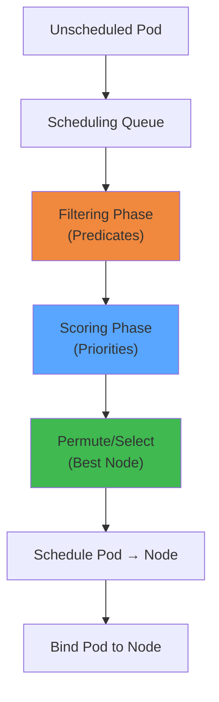

# Kubernetes Scheduling Algorithm — Interactive Simulator

## Overview




Simulate how the Kubernetes scheduler places pods onto nodes. Covers the two-phase scheduling algorithm: filtering (predicates) and scoring (priorities), plus advanced features like taints/tolerations, node affinity, pod anti-affinity, and resource fit.

**Learning Objectives:**
- Understand the two-phase scheduling algorithm (filter + score)
- See how resource requests and limits affect placement
- Observe taints/tolerations and node affinity in action
- Learn about scoring plugins and their weights
- Understand pod priority and preemption

---

## Actors/Components


| Actor | Role |
|-------|------|
| **API Server** | Stores all cluster state; scheduler watches via pod spec |
| **Scheduler** | Watches unscheduled pods, assigns to nodes |
| **Scheduling Queue** | Priority queue of pending pods (sorted by priority) |
| **Node** | Worker machine with CPU/memory/storage capacity |
| **Pod** | Unit of work; has resource requests, affinity rules, tolerations |
| **kubelet** | Executes scheduled pods on each node |
| **Preemptor** | Evicts lower-priority pods to free resources |

---

## State Machine


### Pod Scheduling State


```
┌────────────┐
│  Pending   │ ◄── Created but not yet scheduled
└──────┬─────┘
       │ scheduler picks up
       ▼
┌────────────┐
│ Scheduling │ ◄── In scheduling queue
└──────┬─────┘
       │
       ├──► Filter phase ──→ No nodes fit ──→ Backoff / Preempt
       │                                         │
       ▼                                         ▼
┌────────────┐                           ┌──────────────┐
│  Scored    │                           │  Preempting  │
└──────┬─────┘                           └──────┬───────┘
       │                                        │
       ▼                                        ▼
┌────────────┐                           ┌────────────┐
│  Bound    │                            │  Pending   │
└──────┬─────┘                           │  (retry)   │
       │                                  └────────────┘
       ▼
┌────────────┐
│  Running   │
└────────────┘
```

### Scheduling Cycle (Internal Scheduler State)


```
        ┌──────────────┐
        │  Next()      │ ← Pop next pod from queue
        └──────┬───────┘
               ▼
        ┌──────────────┐
        │  Filter()    │ ← Run predicates against all nodes
        └──────┬───────┘
               │
       ┌───────┴───────┐
       ▼               ▼
  ┌──────────┐   ┌──────────────┐
  │ Feasible │   │ No feasible  │
  │  Nodes   │   │    Nodes     │
  └────┬─────┘   └──────┬───────┘
       │                │
       ▼                ├── PostFilter (Preempt)
  ┌──────────┐         │
  │ Score()  │          │
  └────┬─────┘          │
       │                │
       ▼                ▼
  ┌──────────┐   ┌──────────────┐
  │ Permute  │   │  Backoff &   │
  │ (select) │   │  Re-queue    │
  └────┬─────┘   └──────────────┘
       │
       ▼
  ┌──────────┐
  │ Reserve  │ ← Assume node (bind to node in cache)
  └────┬─────┘
       │
       ▼
  ┌──────────┐
  │  Bind    │ ← API call to assign pod to node
  └──────────┘
```

---

## Animation Frames


### Frame 1: Pod Requested — Filtering Phase


```
Scheduler sees Pending Pod:
  Name: web-server-7b9f6c
  CPU request: 500m   CPU limit: 1000m
  Mem request: 512Mi  Mem limit: 1Gi
  Priority: 1000 (default)

Available Nodes:
┌──────────┐  ┌──────────┐  ┌──────────┐  ┌──────────┐
│ Node-A   │  │ Node-B   │  │ Node-C   │  │ Node-D   │
│ CPU: 2/4 │  │ CPU: 1/4 │  │ CPU: 3/4 │  │ CPU: 4/4 │
│ Mem: 1/8 │  │ Mem: 2/8 │  │ Mem: 3/8 │  │ Mem: 8/8 │
│ taint: - │  │ taint: - │  │ taint:   │  │ taint: - │
│          │  │          │  │ gpu=true │  │          │
└──────────┘  └──────────┘  └──────────┘  └──────────┘

Filter Phase (Predicates):
  Node-D: FAIL (InsufficientMemory — 8/8 used, needs 512Mi)
  Node-C: FAIL (Untainted — pod has no toleration for gpu=true)
  Node-A: PASS (sufficient resources, no taints)
  Node-B: PASS (sufficient resources, no taints)

Feasible nodes: [Node-A, Node-B]
```

### Frame 2: Scoring Phase — Priority Calculation


```
Scoring plugins (default weights):

1. NodeResourcesBalancedAllocation (weight=1)
   Measures how balanced CPU vs memory usage is
   Node-A: CPU=50%, Mem=12.5% → score = |0.5-0.125| = 0.375 → 3/10
   Node-B: CPU=25%, Mem=25%   → score = |0.25-0.25| = 0.0    → 10/10

2. NodeResourcesLeastAllocated (weight=1)
   Favors nodes with more free resources
   Node-A: free CPU=2, free Mem=7Gi → 2+7=9Gi total → 9/10
   Node-B: free CPU=3, free Mem=6Gi → 3+6=9Gi total → 9/10

3. ImageLocality (weight=1)
   Node-A: nginx image exists → 10/10
   Node-B: nginx image not local → 0/10

4. TaintToleration (weight=1):
   Both untolated nodes: 0/10

Score Calculation:
  Node-A: (3 + 9 + 10 + 0) / 4 = 5.5
  Node-B: (10 + 9 + 0 + 0) / 4 = 4.75

Winner: Node-A (higher score)
```

### Frame 3: Taints & Toleration Rules


```
Node-C has taint: "gpu=true:NoSchedule"

Pod types and their fate:

Pod-A: No tolerations
  Filter: FAIL (NoSchedule — taint not tolerated)
  └► Not scheduled on Node-C

Pod-B: Has toleration
    tolerations:
    - key: "gpu"
      operator: "Equal"
      value: "true"
      effect: "NoSchedule"
  Filter: PASS
  └► Can be scheduled on Node-C

Pod-C: Tolerates but doesn't need GPU
    tolerations:
    - key: "gpu"
      operator: "Exists"
  Filter: PASS
  └► Will schedule on Node-C if scoring favors it

Effect types:
  NoSchedule:        Pod not scheduled unless tolerated
  PreferNoSchedule:  Scheduler tries to avoid; no guarantee
  NoExecute:         Existing pods evicted if not tolerated
```

### Frame 4: Node Affinity


```
Pod spec has node affinity:
  requiredDuringSchedulingIgnoredDuringExecution:
    nodeSelectorTerms:
    - matchExpressions:
      - key: "topology.kubernetes.io/zone"
        operator: In
        values: ["us-west-1a", "us-west-1b"]

Available Nodes:
  Node-A: zone=us-west-1a  ◄── PASS
  Node-B: zone=us-west-1a  ◄── PASS
  Node-C: zone=us-west-2a  ◄── FAIL (not in required values)
  Node-D: zone=us-east-1a  ◄── FAIL

Preferred (weighted) affinity:
  preferredDuringSchedulingIgnoredDuringExecution:
  - weight: 100
    preference:
      matchExpressions:
      - key: "disktype"
        operator: In
        values: ["ssd"]
  
  Node-A: disktype=hdd → +0 (no match)
  Node-B: disktype=ssd → +100 to score!

Score becomes: Node-B = base + 100 affinity bonus
```

---

## User Interactions


| Control | Type | Range/Options | Effect |
|---------|------|---------------|--------|
| **Cluster size** | slider | 1-10 nodes | Add/remove worker nodes |
| **Node resources** | sliders per node | CPU 1-32, Mem 1-256 Gi | Set node capacity |
| **Pod CPU request** | slider | 100m-16 | Resource request per pod |
| **Pod mem request** | slider | 64Mi-128Gi | Memory request per pod |
| **Priority** | slider | 0-100 | Pod priority class |
| **Taints** | per-node toggle | key/value/effect | Add taint to node |
| **Tolerations** | pod config | key/operator/value | Add toleration to pod |
| **Node affinity** | pod config | required/preferred | Add affinity rules |
| **Pod anti-affinity** | pod config | required/preferred | Spread pods across topology |
| **Score plugin weights** | sliders | 0-10 | Customize scoring weights |
| **Scheduling policy** | dropdown | Default, BinPacking, Spread | High-level strategy |
| **Add unscheduled pod** | button | - | New pod to schedule |
| **Simulation speed** | slider | 0.1x-10x | Time scale |

---

## Visual Transitions


| Event | Visual Effect |
|-------|---------------|
| **Pod enters queue** | Pod icon appears in queue list; "Pending" badge |
| **Filter phase starts** | Pod pulses; beam sweeps across nodes |
| **Filter: node passes** | Green checkmark on node; fades to gray if fails |
| **Filter: node fails** | Red X; reason text appears (e.g., "insufficient memory") |
| **Feasible set** | Remaining nodes highlighted with blue border |
| **Scoring** | Meter bars appear on each feasible node; animate to score |
| **Score comparison** | Bar chart compares scores visibly |
| **Pod bound** | Pod animates from queue to node; "Running" badge |
| **Taint blocks** | Red shield icon on node; pod bounces off |
| **Toleration match** | Shield icon changes to green check; pod passes |
| **Affinity match** | Chain link icon connects pod affinity to matching node label |
| **Preemption** | Lower-priority pod fades out; new pod takes its place |
| **Backoff** | Pod fades in queue; "backoff" label with timer |
| **Priority queue** | Pods visually sort by priority; higher ones move to front |

---

## Edge Cases


| Edge Case | Behavior |
|-----------|----------|
| **Zero feasible nodes** | Pod stays pending; scheduler backs off (exponential delay) |
| **Multiple matching taints** | Pod must tolerate ALL to pass |
| **Taint with NoExecute** | Existing pods evicted; simulator should show this |
| **Affinity with no match** | Required: pod stays pending. Preferred: pod schedules elsewhere |
| **Cross-topology anti-affinity** | Pods must spread across nodes/zones; hard to satisfy if not enough nodes |
| **Resource fragmentation** | Each node has enough resources individually but combined they're fragmented |
| **GPU/accelerator taints** | Special node types reserved for specific workloads |
| **Pod with init containers** | Init containers' resource requests added to total |
| **Overcommit** | Nodes can have sum(requests) > capacity; scheduler still works |
| **Node cordoning** | Cordoned nodes pass filter but get last-choice score (or excluded) |
| **Node conditions** | DiskPressure, MemoryPressure → PodCondition predicates fail |
| **Inter-pod affinity** | Pod A co-locates with Pod B: if Pod B not scheduled yet, Pod A can't place |
| **Pod overhead** | RuntimeClass overhead added to resource requests |

---

## Failure Modes


| Failure | Symptom | Recovery |
|---------|---------|----------|
| **No feasible nodes** | Pod stays in Pending | Scale up cluster; add toleration; relax constraints |
| **Scheduler down** | Pods stay Pending forever | Scheduler HA (leader election between replicas) |
| **Taint-toleration mismatch** | Pod can't schedule on specialized node | Add toleration to pod spec |
| **Affinity impossible to satisfy** | Pod stuck Pending | Check topology matches; increase cluster |
| **Resource starvation** | All nodes near capacity; new pods pending | Auto-scaling; reduce requests; preempt lower-priority |
| **Node failure during scheduling** | Bind fails; pod re-queued | Watch node status; skip failed nodes |
| **Race: two schedulers** | Two schedulers assign to same node (overcommit) | Scheduler uses `spec.schedulerName` + leader election |
| **Preemption cascade** | Preempting one pod triggers chain evictions | Priority classes must be well-designed |
| **Cache staleness** | Scheduler info outdated (binding conflicts) | Informer cache resync |
| **Volume topology mismatch** | Pod can't schedule near its required PV | Topology-aware scheduling; delayed PV binding |

---

## Metrics to Display


| Metric | Unit | Source |
|--------|------|--------|
| **Pending pods count** | count | Total unscheduled in queue |
| **Scheduling attempt count** | count | Attempts per pod |
| **Scheduling latency (per pod)** | ms | Queue → Bound time |
| **Filter phase duration** | ms | Time spent evaluating predicates |
| **Score phase duration** | ms | Time spent scoring feasible nodes |
| **Feasible nodes per pod** | count | Nodes passing filter |
| **Preemptions triggered** | count | Evictions caused by higher-priority pods |
| **Node utilization (CPU)** | % | Per-node and cluster-wide |
| **Node utilization (memory)** | % | Per-node and cluster-wide |
| **Score distribution** | chart | Scores across feasible nodes |
| **Binding errors** | count | Failed API server bind calls |
| **Backoff count** | count | Pods in backoff state |
| **Average queue depth** | count | Mean unscheduled pods over time |
| **Scheduling rate** | pods/sec | Throughput of successful schedules |
| **Preemption victim count** | count | Pods evicted by preemption |

---

## Scenario Walkthroughs


### Scenario 1: Basic Pod Scheduling — Default Strategy


**Setup:** 4 nodes (Node-A through Node-D), one unscheduled pod

```
Timeline:

T=0ms    Pod "nginx-a" enters scheduling queue
         Pod priority: 0 (default)
         Pod requests: 250m CPU, 256Mi memory

T=1ms    Scheduler picks up pod from queue

T=2ms    Filtering phase:
         Evaluate all 4 nodes against predicates:
         
         Predicate: PodFitsResources
           Node-A: CPU 2/4 used, Mem 1/8Gi used → fits ✓
           Node-B: CPU 1/4 used, Mem 2/8Gi used → fits ✓ 
           Node-C: CPU 3/4 used, Mem 3/8Gi used → fits ✓
           Node-D: CPU 4/4 used, Mem 8/8Gi used → FAIL ✗
         
         Predicate: PodFitsHostPorts (no host ports)
           All pass ✓
         
         Predicate: NodeUnschedulable (none cordoned)
           All pass ✓
         
         Predicate: NodeCondition (no MemoryPressure/DiskPressure)
           All pass ✓
         
         Predicate: NoDiskConflict (no volumes)
           All pass ✓

         Feasible nodes: [Node-A, Node-B, Node-C]

T=5ms    Scoring phase:
         DefaultScorePlugins:

         BalancedAllocation (weight=1):
           Node-A: CPU=50%, Mem=12.5% → diff=37.5% → score=3
           Node-B: CPU=25%, Mem=25%   → diff=0%    → score=10
           Node-C: CPU=75%, Mem=37.5% → diff=37.5% → score=3

         LeastAllocated (weight=1):
           Node-A: free=2CPU + 7Gi → 9/10 
           Node-B: free=3CPU + 6Gi → 9/10
           Node-C: free=1CPU + 5Gi → 6/10

         ImageLocality:
           Node-A: nginx cached → 10
           Node-B: nginx not cached → 0
           Node-C: nginx cached → 10

         Total scores:
           Node-A: (3 + 9 + 10) / 3 = 7.33
           Node-B: (10 + 9 + 0) / 3 = 6.33
           Node-C: (3 + 6 + 10) / 3 = 6.33

T=7ms    Normalize: sort by score
         Winner: Node-A (score 7.33)
         Pod assigned to Node-A

T=10ms   API Server binding: success
         Pod status: Running on Node-A
         
Total scheduling time: ~10ms
```

### Scenario 2: Taint/Toleration — GPU Node Reservation


**Setup:** 4 nodes; Node-C has `gpu=true:NoSchedule` taint

```
Timeline:

T=0ms    Two pending pods:
         Pod-A: "web-server" — no tolerations
         Pod-B: "gpu-job" — tolerates gpu=true

T=1ms    Filter Pod-A (web-server):
         Node-C: FAIL (NoSchedule — taint not tolerated)
         Other nodes: PASS (no taints)
         Feasible: [Node-A, Node-B, Node-D]

         Filter Pod-B (gpu-job):
         Node-C: PASS (toleration matches taint gpu=true)
         All others: PASS
         Feasible: [Node-A, Node-B, Node-C, Node-D]

T=3ms    Score Pod-B:
         All 4 feasible
         BalancedAllocation:
           Node-C: CPU=3/4, Mem=3/8 → 75% CPU, 37.5% Mem → diff=37.5 → 3
           Node-A: CPU=2/4, Mem=1/8 → 50% CPU, 12.5% Mem → diff=37.5 → 3
           Node-B: CPU=1/4, Mem=2/8 → 25% CPU, 25% Mem   → diff=0    → 10
           Node-D: CPU=0/4, Mem=0/8 → 0% CPU, 0% Mem     → diff=0    → 10
         
         TaintToleration plugin (weight=1):
           Node-C: +10 (matches taint)
           Others: 0

         Pod-B final scores:
           Node-A: (3 + 10 + 0) / 3 = 4.33
           Node-B: (10 + 9 + 0) / 3 = 6.33
           Node-C: (3 + 10 + 10) / 3 = 7.67 ← highest!
           Node-D: (10 + 10 + 0) / 3 = 6.67

         Pod-B → Node-C (GPU node, best fit)

         Pod-A scores (among [A, B, D]):
           Node-A: 7.33 ← highest
         Pod-A → Node-A

Visual demonstration:
  GPU pod naturally gravitates to GPU-tolated node
  Non-GPU pods can't schedule there (taint blocks)
  Result: GPU resources reserved for GPU workloads
```

### Scenario 3: Node Affinity — Zonal Scheduling


**Setup:** 6 nodes spread across 3 zones; pod has zone affinity

```
Cluster topology:
  Zone us-west-1a: Node-A, Node-B
  Zone us-west-1b: Node-C, Node-D
  Zone us-west-1c: Node-E, Node-F

Pod spec:
  affinity:
    nodeAffinity:
      requiredDuringSchedulingIgnoredDuringExecution:
        nodeSelectorTerms:
        - matchExpressions:
          - key: topology.kubernetes.io/zone
            operator: In
            values: [us-west-1a, us-west-1b]

Timeline:

T=0ms    Filter pod with zone affinity
         Node-E: FAIL (zone=us-west-1c, not in allowed values)
         Node-F: FAIL (zone=us-west-1c)
         Node-A: PASS (zone=us-west-1a)
         Node-B: PASS (zone=us-west-1a)
         Node-C: PASS (zone=us-west-1b)
         Node-D: PASS (zone=us-west-1b)
         Feasible: [Node-A, Node-B, Node-C, Node-D]

T=3ms    Scoring:
         Default plugins + InterPodAffinity if applicable
         
         Extra: preferred affinity weight 100
           Preferred: disktype=ssd
           Node-A: hdd → 0
           Node-B: ssd → +100
           Node-C: hdd → 0
           Node-D: hdd → 0

         Node-B wins: +100 bonus for ssd preference

T=5ms    Pod scheduled on Node-B (zone=us-west-1a, ssd)

Now add anti-affinity to spread replicas:
  Pod replicas: 3
  podAntiAffinity:
    preferredDuringSchedulingIgnoredDuringExecution:
    - weight: 100
      podAffinityTerm:
        labelSelector: app=web
        topologyKey: topology.kubernetes.io/zone

First replica → Node-B (winner)
Second replica → score reduces in us-west-1a (already has app=web)
  Node-A gets penalized → Node-C wins (different zone)
Third replica → Node-A or Node-D (whichever scores higher)
  Node-D wins: different zone from others
Final distribution: {Node-B, Node-C, Node-D} → 3 zones!

Demonstrates: anti-affinity spreads across zones for HA
```

### Scenario 4: Pod Priority and Preemption


**Setup:** 3 nodes, all near capacity; high-priority pod arrives

```
Current state:
  Node-A: 90% CPU, 80% Mem — running "low-pri-pod-1"
  Node-B: 85% CPU, 75% Mem — running "low-pri-pod-2"
  Node-C: 95% CPU, 90% Mem — running "low-pri-pod-3"

All pods:
  low-pri-pod-1: priority=100, requests 500m CPU, 512Mi Mem
  low-pri-pod-2: priority=100, requests 500m CPU, 512Mi Mem  
  low-pri-pod-3: priority=100, requests 500m CPU, 512Mi Mem

Incoming pod:
  high-pri-pod: priority=1000, requests 3 CPU, 4Gi Mem

Timeline:

T=0ms    high-pri-pod enters queue
         Filter all nodes:
         ALL FAIL — no node has enough free resources

T=2ms    PostFilter (Preemption) triggered:
         Scheduler finds victims to evict:
         
         For each node, simulate evicting lower-priority pods:

         Node-A: evict low-pri-pod-1 (pri=100, 500m/512Mi)
           Free after eviction: 90%-50%=40% → 1.5 CPU freed
           But need 3 CPU total → not enough → skip
         
         Node-B: evict low-pri-pod-2 (pri=100, 500m/512Mi)
           Free: CPU 15% → 0.6 + 0.5 = 1.1 CPU → not enough
         
         Node-C: evict low-pri-pod-3 (pri=100, 500m/512Mi)
           Free: CPU 5% → 0.2 + 0.5 = 0.7 CPU → not enough
         
         Need more victims: try evicting ALL low-pri pods on one node
         
         Node-A: evict nothing else available → 1.5 CPU still < 3 CPU
         Node-B: evict nothing else → 1.1 CPU < 3 CPU
         Node-C: evict nothing else → 0.7 CPU < 3 CPU

T=5ms    Scheduler cannot find enough resources on any single node
         even with preemption.
         high-pri-pod stays Pending.
         
         Wait for cluster scale-up.

vs. If Node-A had:
  Running pods: 2 × priority=100 pods each requesting 2 CPU
  Evicting both: frees 4 CPU → high-pri-pod fits!
  Both victims evicted → high-pri-pod scheduled.
```

### Scenario 5: Bin Packing vs. Spread Strategy


**Setup:** 4 empty nodes, 8 identical pods

```
Simulate two different scoring strategies:

STRATEGY A: SPREAD (LeastAllocated weight=10)
  Goal: Distribute pods evenly
  Scores favor nodes with more free resources

  Pod-1: Node-A (scores tied, first in sort)
  Pod-2: Node-B (A has 1 pod, B empty → B wins least-allocated)
  Pod-3: Node-C (A, B both have 1, C empty → C wins)
  Pod-4: Node-D (last empty node)
  Pod-5: Node-A (all have 1, random/next sorted)
  Pod-6: Node-B (all have ~1-2, balance)
  Pod-7: Node-C
  Pod-8: Node-D

  Result: 2 pods per node. Even distribution. Balanced load.

STRATEGY B: BINPACK (MostAllocated weight=10)
  Goal: Fill nodes as full as possible (leave room)
  Scores favor nodes with less free resources

  Pod-1: Node-A (scores tied, first)
  Pod-2: Node-A (A has 1 pod → more allocated → higher score)
  Pod-3: Node-A (A has 2 → still highest)
  Pod-4: Node-A (A now has 3, fills up at 4 total based on request)
  Pod-5: Node-B (A is full or can't fit more)
  Pod-6: Node-B
  Pod-7: Node-B
  Pod-8: Node-B

  Result: 4 pods on Node-A, 4 on Node-B. Nodes C and D empty!

Visual comparison:
  Spread: [2, 2, 2, 2] — balanced, good HA
  BinPack: [4, 4, 0, 0] — efficient, can power-save empty nodes

Trade-off: BinPack saves energy, spread gives fault tolerance
```

---

## Implementation Notes


**State Management:**
- Node states: `capacity` and `allocated` resources (CPU, memory, ephemeral storage)
- Pod states: `Pending` (in queue), `Scheduling` (active), `Bound` (assigned), `Running` (applied)
- Queue: sorted by priority descending; FIFO within priority
- Scheduler runs in a loop: `Next() → Filter() → Score() → NormalizeScore() → Select() → Reserve() → Bind()`

**Scoring Architecture:**
```python
class Scheduler:
    def schedule(self, pod, nodes):
        feasible = []
        for node in nodes:
            if all(predicate(pod, node) for predicate in self.predicates):
                feasible.append(node)
        
        if not feasible:
            return self.post_filter(pod, nodes)
        
        scores = {}
        for node in feasible:
            total = sum(plugin.score(pod, node) * plugin.weight 
                        for plugin in self.scoring_plugins)
            scores[node] = total
        
        return max(scores, key=scores.get)
```

**Predicate list (filter plugins):**
- PodFitsResources — resource requests ≤ node allocatable
- PodFitsHost — hostPort conflict check
- PodFitsHostPorts — port availability
- PodSelectorMatches — node labels match pod nodeSelector
- NoDiskConflict — volume conflict check
- NodeUnschedulable — node.Spec.Unschedulable
- TaintToleration — toleration matches taints
- CheckNodeCondition — node has no DiskPressure/MemoryPressure

**Scoring plugins:**
- NodeResourcesLeastAllocated — favor nodes with more free (spread)
- NodeResourcesMostAllocated — favor nodes with less free (binpack)
- NodeResourcesBalancedAllocation — favor balanced CPU/Mem usage
- ImageLocality — node already has container image
- TaintToleration — prefer nodes with matched taints
- NodeAffinity — affinity and anti-affinity scoring
- InterPodAffinity — pod-to-pod affinity/anti-affinity

**Priority and Preemption:**
```python
def preempt(pod, nodes):
    for node in sorted(nodes, key=lambda n: total_resource(n)):
        victims = []
        available = node_available_resources(node)
        needed = pod_requested_resources(pod)
        
        for existing in sorted(node.pods, key=lambda p: p.priority):
            if existing.priority >= pod.priority:
                continue  # can't preempt higher priority
            victims.append(existing)
            available += pod_requested_resources(existing)
            if available >= needed:
                return node, victims  # found candidate
    return None, []  # no preemption possible
```

**Simulation loop:** Each tick (configurable, e.g., 10ms simulated), check for new pods in the queue, invoke scheduler cycle, and update node/pod states accordingly.
