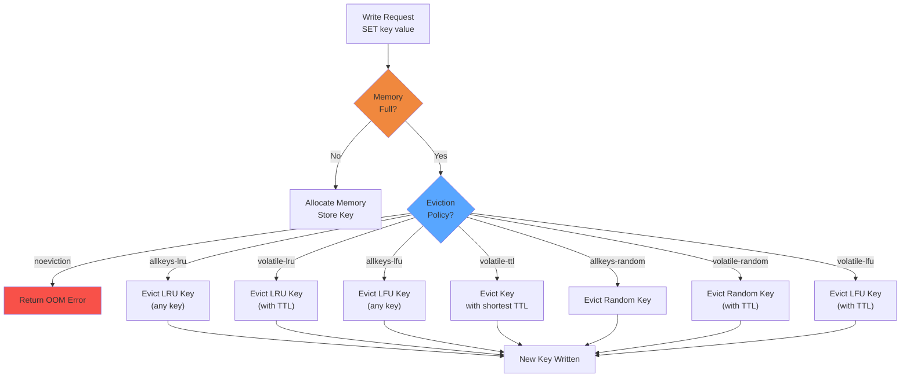

# Redis Memory Eviction Policies — Interactive Simulator

## Overview

#### Step-by-Step
1. Process input
2. Validate
3. Execute
4. Return result

#### Code Example
```python
# Example implementation
pass
```

#### Real-World Scenario
This pattern is commonly used in production systems.




Simulate how Redis handles memory pressure under different maxmemory-policy configurations. Visualize LRU, LFU, TTL, and random eviction — watch which keys get evicted and understand why.

**Learning Objectives:**
- Understand how each eviction policy selects victims
- Compare LRU vs LFU behavior under different access patterns
- See how volatile vs allkeys scope affects eviction
- Learn why noeviction leads to write failures
- Observe access frequency and recency tracking

---

## Actors/Components

#### Step-by-Step
1. Process input
2. Validate
3. Execute
4. Return result

#### Code Example
```python
# Example implementation
pass
```

#### Real-World Scenario
This pattern is commonly used in production systems.


| Actor | Role |
|-------|------|
| **Redis Instance** | In-memory key-value store with configurable maxmemory |
| **Key** | String key with optional TTL (expiry) |
| **Value** | String/list/set/zset/hash value (memory consumed) |
| **Eviction Pool** | Internal data structure for sampling candidate victims |
| **LRU Clock** | Global 24-bit timestamp (seconds precision) for LRU approximation |
| **LFU Counter** | Morris counter (logarithmic) for frequency tracking |
| **TTL Index** | Sorted set of keys with expiry times |
| **maxmemory** | Hard limit on total memory usage |
| **Client** | Issuing read/write/delete commands |

---

## State Machine

#### Step-by-Step
1. Process input
2. Validate
3. Execute
4. Return result

#### Code Example
```python
# Example implementation
pass
```

#### Real-World Scenario
This pattern is commonly used in production systems.


### Eviction Cycle State Machine

#### Step-by-Step
1. Process input
2. Validate
3. Execute
4. Return result

#### Code Example
```python
# Example implementation
pass
```

#### Real-World Scenario
This pattern is commonly used in production systems.


```
                ┌──────────┐
                │   IDLE   │ ◄── Memory usage < maxmemory
                └─────┬────┘
                      │ client write command
                      │ memory usage > maxmemory
                      ▼
                ┌──────────┐
                │ TRIGGER  │ ◄── Eviction needed
                └─────┬────┘
                      │
        ┌─────────────┼─────────────┐
        │             │             │
        ▼             ▼             ▼
 ┌──────────┐  ┌──────────┐  ┌──────────┐
 │ EVICT_ONE│  │ EVICT_ONE│  │ EVICT_ONE│
 │ (LRU)   │  │ (LFU)   │  │ (TTL)   │
 └────┬─────┘  └────┬─────┘  └────┬─────┘
      │             │             │
      └─────────────┼─────────────┘
                    │
                    ▼
             ┌──────────┐
             │  SAMPLE  │ ◄── Pick N random keys from pool
             └─────┬────┘
                   │
          ┌────────┴────────┐
          │                 │
          ▼                 ▼
   ┌──────────┐      ┌──────────┐
   │ EVICT_IDLE│     │ EVICT_BEST│
   │ (N/A for  │     │ (best cand)│
   │ volatile) │     └─────┬────┘
   └───────────┘           │
                           ▼
                    ┌──────────┐
                    │  DELETE  │ ◄── Free memory
                    └─────┬────┘
                          │
                    ┌─────▼─────┐
                    │  CHECK    │
                    │  MEM USAGE│
                    └─────┬─────┘
                          │
                   ┌──────┴──────┐
                   │             │
                   ▼             ▼
              ┌──────────┐ ┌──────────┐
              │  IDLE    │ │ TRIGGER  │
              │ (done)   │ │ (repeat) │
              └──────────┘ └──────────┘
```

### Key Lifetime State

#### Step-by-Step
1. Process input
2. Validate
3. Execute
4. Return result

#### Code Example
```python
# Example implementation
pass
```

#### Real-World Scenario
This pattern is commonly used in production systems.


```
                   ┌──────────┐
                   │ CREATED  │
                   └─────┬────┘
                         │
              ┌──────────┼──────────┐
              │          │          │
              ▼          ▼          ▼
        ┌──────────┐ ┌──────┐ ┌──────────┐
        │  ACTIVE  │ │ TTL  │ │ VOLATILE │
        │ (no TTL) │ │SET   │ │ (has TTL)│
        └──────────┘ └──────┘ └──────────┘
              │          │          │
              │          │          │
              ▼          ▼          ▼
        ┌──────────────────────────────┐
        │         EVICTED              │
        │  (chosen by eviction policy) │
        └──────────────────────────────┘
```

---

## Animation Frames

#### Step-by-Step
1. Process input
2. Validate
3. Execute
4. Return result

#### Code Example
```python
# Example implementation
pass
```

#### Real-World Scenario
This pattern is commonly used in production systems.


### Frame 1: Memory Fills Up — Eviction Triggered

#### Step-by-Step
1. Process input
2. Validate
3. Execute
4. Return result

#### Code Example
```python
# Example implementation
pass
```

#### Real-World Scenario
This pattern is commonly used in production systems.


```
┌──────────────────────────────────────────┐
│            Redis Memory Map              │
├──────────┬──────────┬──────────┬─────────┤
│ key:A    │ key:B    │ key:C    │ key:D   │
│ "apple"  │ "banana" │ "cherry" │ "date"  │
│ 50 bytes │ 50 bytes │ 50 bytes │ 50 bytes│
│ LRU: 100 │ LRU: 95  │ LRU: 90  │ LRU: 85 │
│ Freq: 5  │ Freq: 3  │ Freq: 8  │ Freq: 1 │
│ TTL: -   │ TTL: 120 │ TTL: 60  │ TTL: -  │
├──────────┴──────────┴──────────┴─────────┤
│                                           │
│  Used: 200/256 bytes (78%)               │
│  maxmemory: 256 bytes                    │
│  policy: allkeys-lru                     │
└───────────────────────────────────────────┘

Client sends: SET key:E "elderberry" (50 bytes)
Memory after write: 250/256 (97% — still OK)

Next: SET key:F "fig" (50 bytes)
Memory needed: 250 + 50 = 300 > 256 → EVICTION TRIGGERED!
```

### Frame 2: LRU Sampling and Eviction

#### Step-by-Step
1. Process input
2. Validate
3. Execute
4. Return result

#### Code Example
```python
# Example implementation
pass
```

#### Real-World Scenario
This pattern is commonly used in production systems.


```
Eviction pool (max 16 candidates):
  Step 1: Sample 5 random keys from the key space
  ┌──────────┬──────────┬──────────┬──────────┬──────────┐
  │ key:B    │ key:D    │ key:A    │ key:C    │ key:E    │
  │ LRU: 95  │ LRU: 85  │ LRU: 100 │ LRU: 90  │ LRU: 104 │
  └──────────┴──────────┴──────────┴──────────┴──────────┘

  Step 2: Select key with oldest LRU (lowest value)
  Winner: key:D (LRU: 85 — least recently accessed)

  Step 3: Evict key:D → free 50 bytes
  
  Memory: 250 - 50 + 50 = 250/256 (within limit)
  key:F written successfully.

┌──────────────────────────────────────────────┐
│                   After Eviction             │
├───────────┬──────────┬──────────┬────────────┤
│ key:A     │ key:B    │ key:C    │ key:E      │
│ "apple"   │ "banana" │ "cherry" │ "elderberry"│
│ LRU: 101  │ LRU: 96  │ LRU: 91  │ LRU: 104   │
├───────────┴──────────┴──────────┴────────────┤
│ key:F (new!)                                 │
│ "fig"                                        │
│ LRU: 105 (most recent)                       │
└──────────────────────────────────────────────┘
```

### Frame 3: LFU vs LRU — Different Access Patterns

#### Step-by-Step
1. Process input
2. Validate
3. Execute
4. Return result

#### Code Example
```python
# Example implementation
pass
```

#### Real-World Scenario
This pattern is commonly used in production systems.


```
Scenario: Keys have different access patterns

┌──────────────────────────────────────────────┐
│ Keys: A(5 acc), B(50 acc), C(100 acc), D(1) │
│                                               │
│ Policy: allkeys-lfu                           │
│                                               │
│ Counter values (LFU Morris counter):          │
│ key:A: freq=5   (accessed 5 times)           │
│ key:B: freq=18  (accessed ~50 times)          │
│ key:C: freq=25  (accessed ~100 times)         │
│ key:D: freq=1   (accessed 1 time)            │
│                                               │
│ New key arrives → need eviction               │
│ Victor: key:D (freq=1 — least frequently used)│
│ key:D evicted.                                │
└──────────────────────────────────────────────┘

vs. LRU with same pattern:
  Recent access: key:B (just accessed), key:C, key:A, key:D
  Oldest: key:A or key:D depending on exact times
  → LRU evicts the one accessed longest ago

KEY DIFFERENCE:
  LRU: "What was used longest ago?"
  LFU: "What is used least often overall?"
  
  LFU keeps frequently-accessed keys even if not recent
  LRU keeps recently-accessed keys even if infrequent
```

---

## User Interactions

#### Step-by-Step
1. Process input
2. Validate
3. Execute
4. Return result

#### Code Example
```python
# Example implementation
pass
```

#### Real-World Scenario
This pattern is commonly used in production systems.


| Control | Type | Range/Options | Effect |
|---------|------|---------------|--------|
| **Eviction policy** | dropdown | allkeys-lru, volatile-lru, allkeys-lfu, volatile-lfu, allkeys-random, volatile-random, volatile-ttl, noeviction | Select policy |
| **maxmemory** | slider | 1MB-1024MB or bytes | Memory limit |
| **Key count** | slider | 10-1000 | Number of keys in DB |
| **Value size** | slider | 10B-10KB | Size per value |
| **TTL range** | slider | 0-3600s | Default TTL for new keys |
| **Access pattern** | dropdown | Uniform, Zipfian (hot), Sequential, Recent only | Simulated read pattern |
| **Write rate** | slider | 1-100 req/s | Rate of new SET commands |
| **Read rate** | slider | 0-1000 req/s | Rate of GET commands |
| **Add hot keys** | toggle | - | Mark keys as frequently accessed |
| **Manual evict** | button | - | Force single eviction cycle |
| **Pause** | button | - | Freeze simulation |
| **Max memory sample count** | slider | 3-50 | eviction-pool-size config |
| **Timeline scrubber** | slider | - | Go back/forward in history |

---

## Visual Transitions

#### Step-by-Step
1. Process input
2. Validate
3. Execute
4. Return result

#### Code Example
```python
# Example implementation
pass
```

#### Real-World Scenario
This pattern is commonly used in production systems.


| Event | Visual Effect |
|-------|---------------|
| **Memory bar fills** | Green → Yellow → Red gradient as memory approaches max |
| **Eviction triggered** | Red flash; "Evicting..." label with spinning indicator |
| **Keys sampled** | Sampled keys pulse briefly with blue highlight |
| **Key evicted** | Key fades out with whoosh animation; crosses into "Evicted" bin |
| **New key added** | Key slides in from right; green pulse |
| **LRU age display** | Clock icon next to key showing idle time |
| **LFU counter** | Flame icon with number showing access count |
| **TTL countdown** | Hourglass icon; number decreasing; red flash when expired |
| **Policy switch** | Eviction zone re-shuffles visibly |
| **OOM error** | Red banner: "OUT OF MEMORY — WRITE REJECTED" |
| **Expired key** | Key dissolves (TTL reached 0) |
| **Eviction pool** | Drawer expands showing sampled keys and their metrics |
| **Heat map** | Memory layout shows hot (red) vs cold (blue) keys |
| **Timeline chart** | Memory usage, eviction rate, hit ratio over time |

---

## Edge Cases

#### Step-by-Step
1. Process input
2. Validate
3. Execute
4. Return result

#### Code Example
```python
# Example implementation
pass
```

#### Real-World Scenario
This pattern is commonly used in production systems.


| Edge Case | Behavior |
|-----------|----------|
| **No evictable keys (volatile policy, no TTL keys)** | Falls back to noeviction behavior — OOM on writes |
| **Key with TTL=0 (already expired)** | Lazily deleted first; not counted for eviction |
| **Single key in DB, needs eviction** | That key gets evicted (only choice) |
| **All keys same LRU age** | Random selection among equally-old keys |
| **LFU counter saturation** | Morris counter maxes out at 255; stays at 255 |
| **LFU counter decay** | Counter halved periodically (logarithmic decay) |
| **Key larger than maxmemory** | Eviction tries to free space but can't; OOM error |
| **Noeviction policy** | Write rejected; read-only unaffected |
| **Eviction during EXPIRE command** | Eviction priority: keys pending expiry vs no TTL vs TTL |
| **MULTI/EXEC transaction** | Eviction happens before transaction execution; fails if OOM |
| **Lazy free (unlink)** | Memory freed asynchronously; eviction may run multiple times |
| **Replication + eviction** | Replica may have different eviction behavior (no eviction on replica) |
| **AOF rewrite** | Memory spikes during rewrite; may trigger eviction |

---

## Failure Modes

#### Step-by-Step
1. Process input
2. Validate
3. Execute
4. Return result

#### Code Example
```python
# Example implementation
pass
```

#### Real-World Scenario
This pattern is commonly used in production systems.


| Failure | Symptom | Recovery |
|---------|---------|----------|
| **OOM with noeviction** | Write commands return OOM error | Increase maxmemory; switch policy; delete keys manually |
| **Thrashing (constant eviction)** | High eviction rate; write throughput drops | Increase memory; reduce write rate; use LFU to keep hot keys |
| **Evicting hot keys** | Cache miss rate spikes; latency increases | Switch to LFU (better at keeping hot keys) |
| **Eviction cascade** | One eviction frees space for another write; repeat | Memory-pressure is continuous; normal under heavy write load |
| **maxmemory=0 (unlimited)** | No eviction; process uses all system memory; OOM killer | Set realistic maxmemory |
| **Large key eviction** | Evicting one large key frees a lot of space | Normal; large keys are fair targets |
| **Eviction + replication buffer** | Replication backlog also consumes memory; double pressure | Adjust client-output-buffer-limit |
| **Fork (bgsave)** | Copy-on-write doubles memory briefly; unexpected evictions | Overprovision memory for fork |
| **Flush + reload** | All keys evicted; rebuild from persistence | Gradual reload; set proper policy |
| **Degraded LFU decay** | LFU counters never decay; old patterns dominate | Tune lfu-decay-time |

---

## Metrics to Display

#### Step-by-Step
1. Process input
2. Validate
3. Execute
4. Return result

#### Code Example
```python
# Example implementation
pass
```

#### Real-World Scenario
This pattern is commonly used in production systems.


| Metric | Unit | Source |
|--------|------|--------|
| **Used memory** | bytes / % of max | Current RSS or used_memory |
| **Eviction count** | count (total + rate/s) | Keys evicted since start |
| **Eviction rate** | keys/sec | Current eviction velocity |
| **Key count** | count | Total keys in DB |
| **Keys with TTL** | count | How many keys are volatile |
| **Average TTL** | seconds | Mean remaining TTL |
| **Max memory** | bytes | maxmemory config value |
| **Hit ratio** | % | keyspace_hits / (hits + misses) |
| **Miss ratio** | % | Inverse of hit ratio |
| **LRU idle time** | seconds (per key) | Seconds since last access |
| **LFU counter** | count (0-255) | Approximate access frequency |
| **Eviction pool size** | count | Number of sampled candidates |
| **Write throughput** | ops/sec | SET commands per second |
| **Read throughput** | ops/sec | GET commands per second |
| **Expired keys** | count | Keys removed by TTL expiry |
| **Eviction latency** | µs | Time to select and evict |
| **Memory fragmentation ratio** | ratio | RSS / used_memory |
| **OOM errors** | count | Total write rejections |

---

## Scenario Walkthroughs

#### Step-by-Step
1. Process input
2. Validate
3. Execute
4. Return result

#### Code Example
```python
# Example implementation
pass
```

#### Real-World Scenario
This pattern is commonly used in production systems.


### Scenario 1: allkeys-lru — Cache with Working Set

#### Step-by-Step
1. Process input
2. Validate
3. Execute
4. Return result

#### Code Example
```python
# Example implementation
pass
```

#### Real-World Scenario
This pattern is commonly used in production systems.


**Setup:** maxmemory=1MB, policy=allkeys-lru, key count=200, uniform access

```
Timeline:

Phase A: Cache warmup

T=0-10s   200 keys loaded (5KB values each = ~1MB total)
           Memory: 0 → 1MB (100% full)

           All keys have LRU timestamps from creation time
           Most recent: keys 180-200 (last created)
           Oldest: keys 1-20 (first created)

T=11s     Client reads: GET key:5, GET key:10, GET key:15
           These keys get new LRU timestamps (now youngest)

Phase B: Write pressure

T=12s     Client writes: SET key:201 (5KB value)
           Memory before: 1MB (exactly full)
           Memory after write: 1MB + 5KB = 1005KB → OVER limit
           
           Eviction triggered:
           Sample 5 random keys → picks: {key:3, key:45, key:78, key:120, key:160}
           Among these, oldest LRU: key:78 (not accessed since creation)
           
           key:78 evicted → 5KB freed
           Memory: 1005KB - 5KB = 1000KB ✓
           key:201 written successfully

T=13s     More writes: keys 202-210
           Each triggers eviction of ~1 old key
           
           Which keys get evicted? The ones NOT being read.
           Assume 20% of keys are "hot" (frequently read)
           Hot keys keep getting new LRU timestamps → survive
           Cold keys (80%) become eviction victims

Phase C: Steady state

T=30s     Eviction count: 50 keys
           Hot keys (40) → never evicted (kept alive by reads)
           Cold keys (160) → slowly evicted as new writes come
           
           Effective working set size: ~40 hot keys + ~160 rotating
           Cache is effectively a "hot set with room for cold"

T=60s     All original cold keys evicted.
           200 current keys: 40 original hot + 100 newer + 60 rotated
           
Conclusion: LRU keeps the hot working set, cycles through cold keys.
           Good for: read-heavy workloads with clear working set.
```

### Scenario 2: allkeys-lfu vs volatile-lru — Seasonal Hot Keys

#### Step-by-Step
1. Process input
2. Validate
3. Execute
4. Return result

#### Code Example
```python
# Example implementation
pass
```

#### Real-World Scenario
This pattern is commonly used in production systems.


**Setup:** maxmemory=512KB, 100 keys (most with TTL), access pattern = seasonal

```
Timeline:

POLICY A: allkeys-lfu

T=0-30s   Phase 1: Key group {A1-A10} heavily accessed (500 reads each)
           LFU counters: A1-A10 → 20-25 (high)
           Other keys: 1-5 reads → counters 1-4 (low)

T=31s     Phase 2: New group {B1-B10} becomes popular (seasonal shift)
           Key {D1-D50} never accessed (cold)
           
           Writes come → eviction needed:
           lfu picks: D1-D50 evicted first (counter=0 or 1)
           Then: random keys with low counters

T=60s     Phase 3: Group A becomes popular again
           LFU counters for A: still high (decayed slightly from lfu-decay-time)
           A1-A10 survive! Their old popularity saves them.
           
           LFU remembers: "These were important before, likely again"

vs.

POLICY B: volatile-lru

T=0-30s   Phase 1: A1-A10 hot
           LRU idle times: A1-A10 = 0 (just accessed)

T=31s     Seasonal shift to B group
           LRU idle: A1-A10 now increasing (5s, 10s, 15s...)
           D keys: barely touched

T=35s     Write pressure: eviction needed
           Evict from keys WITH TTL only (volatile scope)
           Among volatile keys: pick oldest LRU
           
           If A1-A10 have long TTL → still candidates!
           A1 (idle=35s) might be older than some cold key
           → A1 could be evicted despite being historically popular!

T=60s     Phase 3: A group popular again
           But A1-A10 already evicted! → cache misses
           Must re-load from database → slow

KEY TAKEAWAY:
  LFU remembers frequency across time
  LRU only knows recency → seasonal patterns cause cache miss storms
  Use LFU for workloads with periodic/seasonal access patterns
```

### Scenario 3: volatile-ttl — Precise Expiry-Based Eviction

#### Step-by-Step
1. Process input
2. Validate
3. Execute
4. Return result

#### Code Example
```python
# Example implementation
pass
```

#### Real-World Scenario
This pattern is commonly used in production systems.


**Setup:** maxmemory=1MB, policy=volatile-ttl, 150 keys (100 with TTL, 50 without)

```
Timeline:

T=0s      Key states:
           ├─ key:A (TTL=300s, value=10KB)
           ├─ key:B (TTL=120s, value=10KB)
           ├─ key:C (TTL=60s,  value=10KB)
           ├─ key:D (TTL=30s,  value=10KB)
           ├─ key:E (TTL=10s,  value=10KB)
           ├─ key:F (TTL=5s,   value=10KB)
           ├─ key:Z1-Z44 (TTL=200s, value=5KB each)
           └─ key:M1-M50 (NO TTL, value=5KB each)

           Memory: 1MB (100%)

T=5s      Write: SET key:new (10KB value)
           Memory: 1MB + 10KB = overflow!
           
           Eviction triggered: volatile-ttl
           Only considers keys WITH TTL (excludes M1-M50)
           Among volatile keys: select with shortest TTL
           
           Sampled keys: {key:A, key:C, key:E, key:F, key:Z1}
           TTLs: 295s, 55s, 5s, 0s (expired!), 195s
           
           Best candidate: key:F (TTL=5s → shortest remaining)
           But wait: key:F has TTL=5s, but current time=5s → TTL-now=0!
           key:F is effectively expired → lazy deletion
           
           key:F evicted (was about to expire anyway) → 10KB freed
           Memory: 1MB + 10KB - 10KB = 1MB ✓

T=6s      Write: SET key:new2 (10KB value)
           Eviction triggered again:
           Best candidate: key:E (TTL=10s, rem=4s)
           key:E evicted.

T=7s      Write: SET key:new3 (10KB)
           key:D (TTL=30s, rem=23s) → evicted

T=8s      Write: SET key:new4 (10KB)
           key:C (TTL=60s, rem=52s) → evicted

Key observation:
  volatile-ttl systematically evicts keys about to expire.
  This is efficient: evicts things that will be gone soon anyway.
  But can cause premature eviction of short-TTL keys.
  And: keys without TTL are completely safe (never evicted under volatile-*).
```

### Scenario 4: noeviction — Write Failures

#### Step-by-Step
1. Process input
2. Validate
3. Execute
4. Return result

#### Code Example
```python
# Example implementation
pass
```

#### Real-World Scenario
This pattern is commonly used in production systems.


**Setup:** maxmemory=512KB, policy=noeviction, 100 keys filling memory

```
Timeline:

T=0s      100 keys loaded → 512KB (100% full)

T=10s     Client: SET key:101 "new value"
           ┌──────────────────────────────────┐
           │  OOM: Out of Memory              │
           │  OOM command not allowed when    │
           │  used memory > maxmemory         │
           └──────────────────────────────────┘
           
           key:101 NOT stored.
           Return error to client.

T=11s     Client: SET key:102 "another value"
           Same OOM error.

T=12s     Client: GET key:50
           Works fine (reads always allowed).
           Returns "value50" ✓

T=13s     Client: DEL key:50
           Works fine. Memory freed: 5KB.
           Memory: 512KB → 507KB

T=14s     Client: SET key:103 "new value"
           Memory: 507KB + 5KB = 512KB
           Works! (DEL freed just enough)

Observation:
  Reads: always work
  Writes: fail until space freed by DEL/EXPIRE/FLUSHDB
  Best for: caches where data must NEVER be lost (transactional)
  Risk: application must handle OOM errors gracefully
```

### Scenario 5: allkeys-random — No Intelligence

#### Step-by-Step
1. Process input
2. Validate
3. Execute
4. Return result

#### Code Example
```python
# Example implementation
pass
```

#### Real-World Scenario
This pattern is commonly used in production systems.


**Setup:** maxmemory=256KB, 50 keys (5KB each), 50% hot, 50% cold

```
Comparison: allkeys-random vs allkeys-lru

SAME ACCESS PATTERN:
  Hot keys: 20 keys, each accessed 100 times
  Cold keys: 30 keys, accessed 0 times

allkeys-random:
  When memory full, evicts random key.
  Probability of evicting a hot key: 20/50 = 40%
  After 10 evictions: expected ~4 hot keys lost (cache misses)
  After 30 evictions: expected ~12 hot keys lost
  
  Hit ratio degradation: hot set shrinks over time
  No preference for cold keys → cold keys survive as often as hot

allkeys-lru:
  When memory full, evicts oldest LRU.
  Hot keys: LRU idle = near 0 (just accessed)
  Cold keys: LRU idle = high (minutes since last access)
  
  Probability of evicting a cold key: ~100%
  After 10 evictions: 10 cold keys lost, 0 hot keys
  After 30 evictions: all 30 cold keys gone, 0 hot keys lost
  
  Hit ratio: 100% (all hot keys retained)
  Only cold keys sacrificed → efficient!

RESULT:
  ┌──────────────────────┬────────────┬──────────────┐
  │ Policy               │ Hot keys   │ Hit ratio    │
  │                      │ after 30   │ (simulated)  │
  │                      │ evictions  │              │
  ├──────────────────────┼────────────┼──────────────┤
  │ allkeys-random       │      8     │       40%    │
  │ allkeys-lru          │     20     │      100%    │
  │ allkeys-lfu          │     20     │      100%    │
  │ volatile-lru         │     20     │      100%    │
  │ volatile-ttl         │     20     │      100%    │
  └──────────────────────┴────────────┴──────────────┘
  
  In this case, any policy with recency/frequency beats random.
  Random useful only as baseline, or when access is truly uniform.
```

---

## Implementation Notes

#### Step-by-Step
1. Process input
2. Validate
3. Execute
4. Return result

#### Code Example
```python
# Example implementation
pass
```

#### Real-World Scenario
This pattern is commonly used in production systems.


**State Management:**
- Maintain dictionary of keys: `{key: {value, ttl, lru_clock, lfu_counter, size}}`
- Global `maxmemory` and `used_memory` counters
- Eviction pool: array of up to `maxmemory_samples` candidate keys
- On eviction: sample N random keys, find best victim by policy, delete

**LRU Approximation (Redis approach):**
- Store `lru` field as 24-bit timestamp (seconds since epoch, modulo 2^24)
- Idle time = `current_seconds - key.lru` (handles wraparound)
- On access: update `key.lru = current_seconds`
- Eviction: pick key with highest idle time among sampled

**LFU Implementation (Redis approach):**
- Store `lfu` field as 16-bit: 8-bit counter (Morris counter) + 8-bit timestamp
- Morris counter: increases logarithmically with access count
  - First 100 accesses roughly map to counter values 0-10
  - Counter maxes at 255 (~100M accesses)
- Counter decay: `lfu-decay-time` (minutes); counter halved periodically
- Eviction: pick key with lowest counter among sampled

**Eviction algorithm (common to all policies):**
```python
def evict(db, policy, maxmemory_samples):
    candidates = random.sample(db.keys, min(maxmemory_samples, len(db)))
    
    if policy == "allkeys-lru" or policy == "volatile-lru":
        # Only volatile keys for volatile-*
        if "volatile" in policy:
            candidates = [k for k in candidates if k.ttl is not None]
            if not candidates:
                return None  # fallback to noeviction
        victim = max(candidates, key=lambda k: current_time - k.lru_time)
    
    elif policy == "allkeys-lfu" or policy == "volatile-lfu":
        if "volatile" in policy:
            candidates = [k for k in candidates if k.ttl is not None]
            if not candidates:
                return None
        victim = min(candidates, key=lambda k: k.lfu_counter)
    
    elif policy == "volatile-ttl":
        candidates = [k for k in candidates if k.ttl is not None]
        if not candidates:
            return None
        victim = min(candidates, key=lambda k: k.ttl - current_time)
    
    elif "random" in policy:
        if "volatile" in policy:
            candidates = [k for k in candidates if k.ttl is not None]
            if not candidates:
                return None
        victim = random.choice(candidates)
    
    elif policy == "noeviction":
        return None  # no eviction allowed
    
    return victim
```

**Simulation Loop:**
```
while running:
    t += 1 (simulated ms)
    
    # Process incoming writes
    for each client write:
        if used_memory + value_size > maxmemory:
            victim = evict(db, policy, samples)
            if victim:
                delete(victim)
                used_memory -= victim.size
            else:
                return OOM error
        write key
        used_memory += value_size
    
    # Process reads (update LRU/LFU)
    for each client read:
        key.lru_time = current_time
        key.lfu_counter = increment_lfu(key.lfu_counter)
    
    # TTL expiry (lazy + periodic)
    for key in db:
        if key.ttl and key.ttl <= current_time:
            delete(key)
            used_memory -= key.size
    
    # LFU decay (periodic, every lfu-decay-time)
    if t % lfu_decay_interval == 0:
        for key in db:
            key.lfu_counter /= 2  # logarithmic decay
    
    # Update metrics
    update_metrics()
    
    # Render
    render_frame()
```

**Memory model:** Simplified — track key size as key_string + value_serialized + overhead (dict entry ≈ 64 bytes per key). Use configurable overhead for realism.
