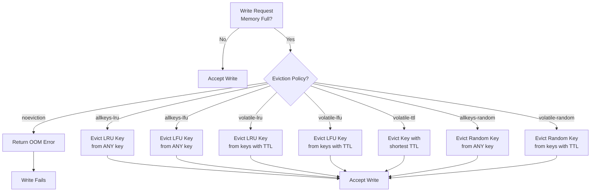

# Redis Memory Eviction Policies

## Overview

When Redis reaches maxmemory limit, it must evict keys to free space for new writes. The eviction policy determines **which keys get evicted**. Choosing the right policy is critical for application performance and cache hit ratios.

## Eviction Policies



## Policy Comparison

| Policy | Scope | Metric | Use Case |
|--------|-------|--------|----------|
| **noeviction** | — | — | Never evict (fail on full) |
| **allkeys-lru** | All keys | Recency | General-purpose cache |
| **allkeys-lfu** | All keys | Frequency | Hot/cold key patterns |
| **volatile-lru** | TTL keys | Recency | Mixed cache + DB |
| **volatile-lfu** | TTL keys | Frequency | Hot items with expiry |
| **volatile-ttl** | TTL keys | TTL | Session data |
| **allkeys-random** | All keys | Random | Low-cost eviction |
| **volatile-random** | TTL keys | Random | Minimal overhead |

## Concepts

### LRU (Least Recently Used)
- Evicts key not accessed for longest time
- Good for temporal locality
- Default choice for most caches
- Approximation: 24-bit timestamp (millisecond precision lost)

### LFU (Least Frequently Used)
- Evicts key accessed least often
- Distinguishes hot vs cold data
- Better than LRU for non-temporal patterns
- Morris counter: logarithmic frequency tracking

### TTL vs Allkeys
- **volatile-***: Only evict keys with `EXPIRE` set
  - Preserves permanent keys (database data)
  - Smaller eviction pool = faster eviction
- **allkeys-***: Evict any key, even permanent ones
  - All keys are candidates
  - Larger eviction pool, more CPU

### Scope & Precision
- Eviction pool: Samples ~20 random keys (not all)
- Trade-off: accuracy vs CPU cost
- `maxmemory-samples` config tunes sample size

## Decision Tree

```
Is your Redis role...?

  └─ Pure Cache
      └─ Hot/Cold access patterns? → allkeys-lfu
      └─ Temporal access patterns? → allkeys-lru

  └─ Mixed (Cache + DB)
      └─ Hot/Cold patterns? → volatile-lfu
      └─ Temporal patterns? → volatile-lru
      └─ Session data? → volatile-ttl

  └─ Never evict (in-memory DB)
      └─ Use noeviction + replication
```

## Memory Pressure Calculation

```
Eviction Overhead = Samples × Policy Complexity
  allkeys-random: 1x (minimal)
  allkeys-lru:    2x (timestamp compare)
  allkeys-lfu:    3x (counter tracking + decay)
  allkeys-lru:    2x
  volatile-*:     1-3x (filter + metric)
```

---

## 🎮 Interactive Simulator

Watch eviction policies in action with memory pressure:

**[→ Launch Redis Eviction Simulator](redis-eviction.html)**

Try:
- Fill memory with random accesses
- Compare LRU vs LFU vs random eviction
- See TTL vs allkeys differences
- Monitor OOM errors with noeviction

---

## Real-World Configuration

### For Cache Layer
```
maxmemory 2gb
maxmemory-policy allkeys-lru
maxmemory-samples 5  # Fast, good accuracy
```

### For Session Store
```
maxmemory 512mb
maxmemory-policy volatile-ttl
maxmemory-samples 3  # Sessions are short-lived
```

### For Hot Data
```
maxmemory 1gb
maxmemory-policy allkeys-lfu
maxmemory-samples 10  # Needs higher accuracy
```

## Performance Impact

| Policy | CPU | Latency | Accuracy |
|--------|-----|---------|----------|
| allkeys-random | Low | ~0.1ms | Low |
| allkeys-lru | Medium | ~0.2ms | High |
| allkeys-lfu | High | ~0.3ms | Very High |

## Monitoring

```bash
# Redis info stats
INFO memory
# Key metrics:
#   used_memory: Current usage
#   maxmemory: Limit
#   evicted_keys: Total evicted
#   evicted_*: Specific policy stats
```

## References

- [Redis Memory Management](https://redis.io/topics/memory-optimization)
- [Eviction Policies Docs](https://redis.io/topics/lru-cache)
- [LFU Implementation Details](https://redis.io/topics/lfu-cache)
