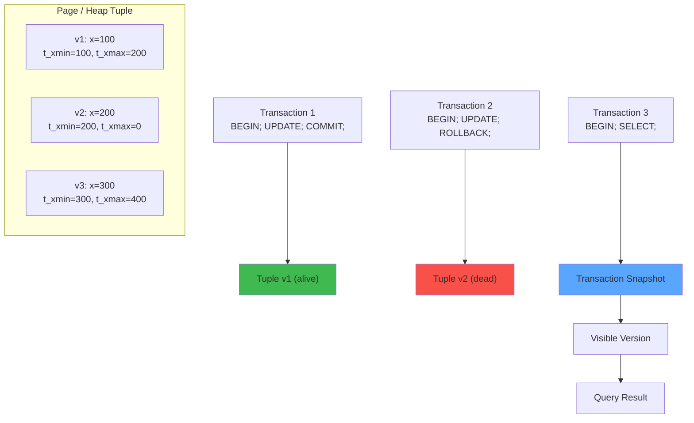

# MVCC (Multi-Version Concurrency Control) — Interactive Visualization

## Overview

#### Step-by-Step
1. Process input
2. Validate
3. Execute
4. Return result

#### Code Example
```python
# Example implementation
pass
```

#### Real-World Scenario
This pattern is commonly used in production systems.




Simulate PostgreSQL-style MVCC: visualize tuple versions, transaction snapshots, visibility rules, and vacuum. See how concurrent transactions see consistent snapshots without blocking each other.

**Learning Objectives:**
- Understand how MVCC enables concurrent reads and writes without conflicts
- See tuple version chains and how visibility is determined
- Learn about snapshot isolation and repeatable reads
- Understand why vacuum is needed and what it does
- Compare isolation levels (Read Committed vs Repeatable Read vs Serializable)

---

## Actors/Components

#### Step-by-Step
1. Process input
2. Validate
3. Execute
4. Return result

#### Code Example
```python
# Example implementation
pass
```

#### Real-World Scenario
This pattern is commonly used in production systems.


| Actor | Role |
|-------|------|
| **Transaction** | Atomic unit of work; has xid (transaction ID) |
| **Tuple** | Row version with xmin (creator xid) and xmax (deleter/updater xid) |
| **Page** | 8KB disk page containing tuples |
| **Heap** | Physical storage of all tuple versions |
| **Snapshot** | Transaction's view of which tuples are visible |
| **CLOG** | Commit log recording which xids committed |
| **Visibility Map** | Per-page bitmask of all-visible tuples |
| **Vacuum** | Background process that removes dead tuples |
| **HOT Update** | Heap-Only Tuple update (same page optimization) |

---

## State Machine

#### Step-by-Step
1. Process input
2. Validate
3. Execute
4. Return result

#### Code Example
```python
# Example implementation
pass
```

#### Real-World Scenario
This pattern is commonly used in production systems.


### Transaction State

#### Step-by-Step
1. Process input
2. Validate
3. Execute
4. Return result

#### Code Example
```python
# Example implementation
pass
```

#### Real-World Scenario
This pattern is commonly used in production systems.


```
┌──────────┐
│  BEGIN   │ ◄── Assign xid
└────┬─────┘
     │
     ▼
┌──────────┐
│  ACTIVE  │ ◄── Running queries
└────┬─────┘
     │
     ├────────────────────┐
     ▼                    ▼
┌──────────┐       ┌──────────┐
│  COMMIT  │       │ ROLLBACK │
└────┬─────┘       └────┬─────┘
     │                  │
     ▼                  ▼
┌──────────┐       ┌──────────┐
│ COMMITTED│       │ ABORTED  │
└──────────┘       └──────────┘
```

### Tuple Version Lifecycle

#### Step-by-Step
1. Process input
2. Validate
3. Execute
4. Return result

#### Code Example
```python
# Example implementation
pass
```

#### Real-World Scenario
This pattern is commonly used in production systems.


```
         ┌──────────┐
         │  INSERT  │ ◄── t_xmin = current xid
         └────┬─────┘
              │
         ┌────▼─────┐
         │  UPDATED │ ◄── New tuple created; old gets t_xmax
         └────┬─────┘
              │
              ├────────────────┐
              │                │
         ┌────▼─────┐   ┌─────▼────┐
         │  DEAD    │   │  DELETED │
         │ (replaced│   │ t_xmax = │
         │  by new) │   │ deleter  │
         └────┬─────┘   └────┬─────┘
              │              │
              ▼              ▼
         ┌──────────────────────┐
         │   VACUUM REMOVED     │
         │ (physically deleted) │
         └──────────────────────┘
```

### Snapshot State (per query)

#### Step-by-Step
1. Process input
2. Validate
3. Execute
4. Return result

#### Code Example
```python
# Example implementation
pass
```

#### Real-World Scenario
This pattern is commonly used in production systems.


```
         ┌──────────────┐
         │  TAKE SNAPSHOT│
         └──────┬───────┘
                │
       ┌────────┴────────┐
       │                 │
       ▼                 ▼
┌────────────┐   ┌──────────────┐
│ Read       │   │ Serialized   │
│ Committed  │   │ Anomaly-Free │
│ Snap       │   │ Snap         │
└──────┬─────┘   └──────┬───────┘
       │                │
       ▼                ▼
┌──────────────────────────────────┐
│ For each tuple version:          │
│   xmin visible?  xmax invisible? │
│   → Include in result           │
└──────────────────────────────────┘
```

---

## Animation Frames

#### Step-by-Step
1. Process input
2. Validate
3. Execute
4. Return result

#### Code Example
```python
# Example implementation
pass
```

#### Real-World Scenario
This pattern is commonly used in production systems.


### Frame 1: Single Transaction — Insert and Read

#### Step-by-Step
1. Process input
2. Validate
3. Execute
4. Return result

#### Code Example
```python
# Example implementation
pass
```

#### Real-World Scenario
This pattern is commonly used in production systems.


```
┌──────────────────────────────────────────┐
│ Heap Page - Table "accounts"             │
├──────────┬──────────┬──────────┬─────────┤
│ Tuple #  │ xmin     │ xmax     │ balance │
├──────────┼──────────┼──────────┼─────────┤
│    1     │    100   │    0     │   1000  │
│    2     │    101   │    0     │   2000  │
│    3     │    102   │    0     │   3000  │
└──────────┴──────────┴──────────┴─────────┘

Transaction 103: BEGIN;
  INSERT INTO accounts VALUES (4, 4000);
  
  After INSERT:
  ┌──────────┬──────────┬──────────┬─────────┐
  │    4     │    103   │    0     │   4000  │
  └──────────┴──────────┴──────────┴─────────┘

Self-read: SELECT * FROM accounts;
  xmin=103 (self) → visible
  Sees all 4 rows.

Before commit — another transaction reads:
  Transaction 104 reads:
  Snapshot: [100, 101, 102 committed; 103 active]
  Tuple 4: xmin=103 (active) → NOT visible!
  Sees only 3 rows.

After Transaction 103 commits:
  CLOG: xid=103 → COMMITTED
  Transaction 105 starts, reads:
  Snapshot: [100, 101, 102, 103 committed]
  Tuple 4: xmin=103 (committed) → visible
  Sees all 4 rows.
```

### Frame 2: UPDATE Creating a New Tuple Version

#### Step-by-Step
1. Process input
2. Validate
3. Execute
4. Return result

#### Code Example
```python
# Example implementation
pass
```

#### Real-World Scenario
This pattern is commonly used in production systems.


```
Initial row: id=1, balance=1000, xmin=100, xmax=0

Transaction 200: BEGIN;
  UPDATE accounts SET balance = 1500 WHERE id = 1;

  What happens:
  1. Original tuple: t_xmax = 200 (marked as deleted by xid 200)
  2. New tuple created: t_xmin = 200, balance = 1500, t_xmax = 0

┌───────────────────────────────────────────────────────┐
│ Page Status After UPDATE:                             │
│                                                       │
│ Tuple 1 (old): xmin=100, xmax=200, balance=1000      │
│   └── Dead? Not yet — depends on transaction state    │
│                                                       │
│ Tuple 1b (new): xmin=200, xmax=0, balance=1500       │
│   └── This is the current version                     │
└───────────────────────────────────────────────────────┘

┌─────────┐    ┌─────────┐
│ v1: 1000│───►│ v2: 1500│  (version chain via ctid)
│ xmin=100│    │ xmin=200│
│ xmax=200│    │ xmax=0  │
└─────────┘    └─────────┘

If Transaction 200 ROLLBACKs:
  CLOG: xid=200 → ABORTED
  Tuple 1b: xmin=200 (aborted) → INVISIBLE
  Tuple 1: xmax=200 (aborted) → xmax NOT considered committed
  → Tuple 1 is the current version again!

If Transaction 200 COMMITs:
  CLOG: xid=200 → COMMITTED
  Tuple 1b: xmin=200 (committed) → VISIBLE
  Tuple 1: xmax=200 (committed) → DELETED → DEAD
```

### Frame 3: Concurrent Transactions — Snapshot Visibility

#### Step-by-Step
1. Process input
2. Validate
3. Execute
4. Return result

#### Code Example
```python
# Example implementation
pass
```

#### Real-World Scenario
This pattern is commonly used in production systems.


```
Transaction A (xid=200): BEGIN ISOLATION LEVEL REPEATABLE READ
  SELECT balance FROM accounts WHERE id = 1;
  → 1000 (current committed version)

Transaction B (xid=201): BEGIN;
  UPDATE accounts SET balance = 2000 WHERE id = 1;
  COMMIT;
  → New version: balance=2000, xmin=201, xmax=0

Transaction A continues:
  SELECT balance FROM accounts WHERE id = 1;

┌────────────────────────────────────────────────┐
│ Snapshot for Transaction A (xid=200):          │
│   xmin snapshot: 200 last snapshot taken       │
│   xip list: [] at snapshot time                │
│   (In repeatable read: snapshot frozen at      │
│    first query time)                           │
│                                                │
│ Visibility check for tuple v2 (balance=2000): │
│   xmin=201                                     │
│   Is xmin < snapshot.xmin?  201 < 200? NO      │
│   Is xmin in xip list? 201 NOT IN []           │
│   Is xmin committed? YES (CLOG says committed) │
│   → For RR: visibility depends on whether      │
│     xmin committed BEFORE snapshot was taken   │
│     vs AFTER                                   │
│                                                │
│ RESULT (RR): balance = 1000 (old version)!     │
│   Transaction A sees its snapshot-time view    │
│   Transaction B's update is invisible          │
└────────────────────────────────────────────────┘

vs. READ COMMITTED:
┌────────────────────────────────────────────────┐
│ Snapshot for Transaction A (xid=200, RC):      │
│   New snapshot per STATEMENT                   │
│   At second query time:                        │
│   xip list: []  (xid=201 already committed)    │
│                                                │
│ Visibility check for tuple v2:                │
│   xmin=201, committed                          │
│   → VISIBLE (committed before this statement)  │
│                                                │
│ RESULT (RC): balance = 2000 (new version)!     │
└────────────────────────────────────────────────┘

Key difference:
  REPEATABLE READ: first-query snapshot, consistent throughout
  READ COMMITTED: per-statement snapshot, sees latest commits
```

---

## User Interactions

#### Step-by-Step
1. Process input
2. Validate
3. Execute
4. Return result

#### Code Example
```python
# Example implementation
pass
```

#### Real-World Scenario
This pattern is commonly used in production systems.


| Control | Type | Range/Options | Effect |
|---------|------|---------------|--------|
| **Transaction count** | slider | 1-10 | Number of concurrent transactions |
| **Isolation level** | per-txn dropdown | Read Committed, Repeatable Read, Serializable | Visibility behavior |
| **Operation type** | per-txn button | SELECT, INSERT, UPDATE, DELETE | What transaction does |
| **Commit/Rollback** | button per txn | - | Finalize transaction |
| **Start transaction** | button | - | Spawn new transaction |
| **Tuple count** | slider | 1-50 | Initial row count |
| **Page layout** | toggle | Logical / Physical | Show logical versions or page layout |
| **Vacuum now** | button | - | Trigger manual vacuum |
| **Auto-vacuum** | toggle | on/off | Simulate autovacuum |
| **Lock contention** | toggle | - | Show lock waits |
| **Simulation speed** | slider | 0.1x-10x | Time scale |
| **Show CLOG** | toggle | on/off | Show commit log table |

---

## Visual Transitions

#### Step-by-Step
1. Process input
2. Validate
3. Execute
4. Return result

#### Code Example
```python
# Example implementation
pass
```

#### Real-World Scenario
This pattern is commonly used in production systems.


| Event | Visual Effect |
|-------|---------------|
| **BEGIN transaction** | New transaction card appears with xid; "ACTIVE" badge |
| **INSERT** | New tuple slides into page; xmin tag appears |
| **UPDATE** | Old tuple dims; new version appears with arrow connecting them |
| **DELETE** | Tuple marked with red X; t_xmax set |
| **SELECT (RR)** | Camera flash on snapshot; frozen timestamp icon |
| **SELECT (RC)** | Camera flash per statement; second flash on re-read |
| **Version chain** | Dotted arrows linking old → new tuple versions |
| **Dead tuple** | Tuple turns gray; "DEAD" label |
| **Vacuum** | Vacuum cleaner icon sweeps across page; dead tuples disappear |
| **xmin visible** | Green check on xmin field |
| **xmin invisible** | Red X on xmin field |
| **Commit** | Green checkmark on transaction; CLOG entry turns green |
| **Rollback** | Red X on transaction; CLOG entry turns red |
| **Snapshot freeze** | Snapshot card pinned with timestamp |
| **Serialization failure** | Red flash; "SERIALIZATION FAILURE — RETRY" message |
| **Lock conflict** | Yellow warning; transaction waiting for another |
| **HOT update** | Same-page update shown with green arrow (no off-page) |

---

## Edge Cases

#### Step-by-Step
1. Process input
2. Validate
3. Execute
4. Return result

#### Code Example
```python
# Example implementation
pass
```

#### Real-World Scenario
This pattern is commonly used in production systems.


| Edge Case | Behavior |
|-----------|----------|
| **Read-your-own-writes** | xmin = own xid → always visible (even if uncommitted) |
| **Concurrent DELETE + INSERT** | New tuple is a different row; no conflict |
| **Cross-page update** | Old tuple stays; new tuple on different page; full version chain |
| **Update of just-updated row** | Chain: v1 → v2 → v3; intermediate becomes dead |
| **Snapshot too old** | If snapshot holds long enough, needed dead tuple may be vacuumed |
| **Subxact (savepoint)** | Subtransaction IDs tracked; rollback of subxact shown |
| **Hot standby conflicts** | Read-only queries on replica may conflict with replay |
| **Serializable anomaly** | SI anomaly (write skew) detected; forced rollback |
| **Prepared transaction (2PC)** | PREPARE: "prepared" state; COMMIT PREPARED later |
| **DDL under MVCC** | ALTER TABLE uses newer relversion; old snapshots see old schema |
| **Page full — no space for new tuple** | Updated tuple goes to a new page; chain crosses pages |
| **CLOG wraparound** | Transaction ID wraparound (≈2B); freeze needed |

---

## Failure Modes

#### Step-by-Step
1. Process input
2. Validate
3. Execute
4. Return result

#### Code Example
```python
# Example implementation
pass
```

#### Real-World Scenario
This pattern is commonly used in production systems.


| Failure | Symptom | Recovery |
|---------|---------|----------|
| **Serialization failure** | Serializable isolation; write skew detected | Retry transaction |
| **Deadlock** | Two transactions waiting on each other | One is chosen as victim and rolled back |
| **Snapshot too old** | Query fails after long-running txn | Reduce query duration; increase vacuum |
| **Transaction ID wraparound** | DB shuts down to prevent data loss | Force vacuum freeze |
| **Lock queue overload** | Many transactions waiting for same row | Optimize query; use NOWAIT |
| **Vacuum I/O storm** | Heavy vacuum causes disk contention | Tune autovacuum; use throttling |
| **Page corruption** | Tuple checksum mismatch on read | Restore from replica/backup |
| **Bloat (dead tuple explosion)** | Table grows large; performance degrades | Manual VACUUM; tune autovacuum |
| **Long-running read txn** | Prevents vacuum of dead tuples; table bloat | Set statement_timeout |
| **Concurrent DDL + DML** | Catalog mismatch on ALTER during txn | Serialize DDL; use lock_timeout |

---

## Metrics to Display

#### Step-by-Step
1. Process input
2. Validate
3. Execute
4. Return result

#### Code Example
```python
# Example implementation
pass
```

#### Real-World Scenario
This pattern is commonly used in production systems.


| Metric | Unit | Source |
|--------|------|--------|
| **Live tuples** | count | Tuples visible to current transactions |
| **Dead tuples** | count | Tuples no longer visible (vacuum candidates) |
| **Total tuples** | count | All versions (live + dead) |
| **Bloat ratio** | % | dead / (live + dead) |
| **Transaction ID** | integer | Current xid counter |
| **XID wraparound %** | % | How close to wraparound limit |
| **Vacuum count** | count | Total vacuums performed |
| **Dead tuple removal** | count | Tuples removed in last vacuum |
| **Snapshot age** | ms/commands | Age of oldest active snapshot |
| **Visibility check time** | µs | Average time per tuple visibility check |
| **Commit rate** | txns/sec | Transactions committed per second |
| **Rollback rate** | txns/sec | Transactions rolled back per second |
| **Lock wait time** | ms | Average time waiting for locks |
| **Deadlock count** | count | Number of deadlocks detected |
| **Page reads** | count | Tuples read from pages |
| **HOT update ratio** | % | HOT updates / total updates |
| **CLOG size** | pages | Commit log page count |

---

## Scenario Walkthroughs

#### Step-by-Step
1. Process input
2. Validate
3. Execute
4. Return result

#### Code Example
```python
# Example implementation
pass
```

#### Real-World Scenario
This pattern is commonly used in production systems.


### Scenario 1: Lost Update Prevention (MVCC vs No MVCC)

#### Step-by-Step
1. Process input
2. Validate
3. Execute
4. Return result

#### Code Example
```python
# Example implementation
pass
```

#### Real-World Scenario
This pattern is commonly used in production systems.


**Setup:** 2 concurrent transactions updating the same balance

```
Without MVCC (pessimistic locking):

T0: Txn A reads balance = 1000
T1: Txn B reads balance = 1000
T2: Txn A: SET balance = 1000 + 500 = 1500 → WRITE
T3: Txn B: SET balance = 1000 + 200 = 1200 → WRITE (overwrites A!)
T4: Final balance = 1200
    Txn A's update is LOST!

With MVCC (PostgreSQL):

T0: Txn A (xid=300): BEGIN;
    SELECT balance FROM accounts WHERE id=1; → 1000

T1: Txn B (xid=301): BEGIN;
    SELECT balance FROM accounts WHERE id=1; → 1000

T2: Txn A: UPDATE accounts SET balance = 1500 WHERE id=1;
    Creates new tuple: v2 (xmin=300, balance=1500)
    Old tuple v1: xmax set to 300
    Txn A's own snapshot → sees v2 immediately

T3: Txn B: UPDATE accounts SET balance = 1200 WHERE id=1;
    Tuple v1 has xmax=300 (uncommitted at this point!)
    Txn B's UPDATE checks:
      - Current version is v1 (xmin=100, xmax=300)
      - xmax=300 is ACTIVE (Txn A not yet committed)
      - v1 is locked by Txn A → Txn B WAITS
    Txn B blocks on row-level lock

T4: Txn A: COMMIT;
    v1: xmax=300 → COMMITTED
    v2: xmin=300 → COMMITTED (current version)
    Txn B unblocks

T5: Txn B's UPDATE continues:
    Now v1 is dead (xmax committed)
    Current version is v2 (balance=1500)
    Txn B's UPDATE must update based on NEW current version!
    
    If Txn B retries its read:
    SELECT balance → 1500 (sees Txn A's committed update)
    
    Txn B: UPDATE accounts SET balance = 1500 + 200 = 1700
    Creates v3 (xmin=301, balance=1700)
    
T6: Txn B: COMMIT;
    Final balance = 1700
    Both updates preserved! ✓

RESULT: MVCC with row-level locking prevents lost updates.
  Txn B automatically sees Txn A's committed changes.
  No manual locking needed (compared to SELECT...FOR UPDATE).
```

### Scenario 2: Repeatable Read — Snapshot Isolation

#### Step-by-Step
1. Process input
2. Validate
3. Execute
4. Return result

#### Code Example
```python
# Example implementation
pass
```

#### Real-World Scenario
This pattern is commonly used in production systems.


**Setup:** 3 concurrent transactions in REPEATABLE READ

```
Initial: account 1: 1000, account 2: 1000

Txn A (xid=400, RR): BEGIN;
  SELECT SUM(balance) FROM accounts; → 2000

Txn B (xid=401, RR): BEGIN;
  UPDATE accounts SET balance = balance + 500 WHERE id = 1;
  COMMIT;

Txn C (xid=402, RR): BEGIN;
  UPDATE accounts SET balance = balance + 300 WHERE id = 2;
  COMMIT;

Now:
  account 1: balance=1500 (xmin=401)
  account 2: balance=1300 (xmin=402)

Txn A continues:
  SELECT SUM(balance) FROM accounts;
  
  Snapshot for Txn A (taken at first query time):
    xmin: 400
    xip list: [400] (self, but treated as visible)
  
  Version chain for account 1:
    v1: balance=1000, xmin=100, xmax=401
    v2: balance=1500, xmin=401, xmax=0
    
    Visibility: v1 has xmax=401 (committed, but AFTER snapshot!)
    v1 is the version visible to Txn A
    → balance = 1000
  
  Version chain for account 2:
    v1: balance=1000, xmin=100, xmax=402
    v2: balance=1300, xmin=402, xmax=0
    
    Visibility: v1 has xmax=402 (committed, but AFTER snapshot!)
    → balance = 1000
  
  Result: SUM = 2000 (old value!)
  
  Txn A sees a SNAPSHOT of the database at its start time.
  Later commits by B and C are invisible.

vs. Read Committed:

  Txn A (RC):
  Second SELECT:
    New snapshot taken:
      xmin: 400
      xip list: []
      (401 and 402 are committed)
    
    account 1: current version v2 with xmin=401 (committed) → visible
      → balance = 1500
    account 2: current version v2 with xmin=402 (committed) → visible
      → balance = 1300
    
    Result: SUM = 2800 ✓ (sees latest committed data)
```

### Scenario 3: Write Skew — Serializable Anomaly

#### Step-by-Step
1. Process input
2. Validate
3. Execute
4. Return result

#### Code Example
```python
# Example implementation
pass
```

#### Real-World Scenario
This pattern is commonly used in production systems.


**Setup:** Two doctors must be on call; at least one must be on duty

```
Initial state:
  Doctor A: on_call = true
  Doctor B: on_call = true
  Constraint: at least one doctor must be on_call at all times

REPEATABLE READ scenario:

Txn 1 (xid=500): BEGIN RR;
  SELECT on_call FROM doctors WHERE name = 'A';
  → true (can go off duty)

Txn 2 (xid=501): BEGIN RR;
  SELECT on_call FROM doctors WHERE name = 'B';
  → true (can go off duty)

Txn 1: UPDATE doctors SET on_call = false WHERE name = 'A';
  → OK (current version: Txn 1 sees v1 with xmax=0)
  Creates v1b (xmin=500, on_call=false)

Txn 2: UPDATE doctors SET on_call = false WHERE name = 'B';
  → OK (current version: Txn 1 sees v1 with xmax=0)
  Creates v2b (xmin=501, on_call=false)

Txn 1: COMMIT → OK

Txn 2: COMMIT → OK

FINAL STATE: A=false, B=false → BOTH OFF DUTY! CONSTRAINT VIOLATED!

This is WRITE SKEW — a serialization anomaly.
Both transactions read the "true" snapshot, wrote based on that,
and the final state violates the constraint.

WITH SERIALIZABLE isolation:

Txn 1 (xid=500): BEGIN SERIALIZABLE;
  SELECT on_call FROM doctors WHERE name = 'A'; → true

Txn 2 (xid=501): BEGIN SERIALIZABLE;
  SELECT on_call FROM doctors WHERE name = 'B'; → true

Txn 1: UPDATE doctors SET on_call = false WHERE name = 'A';
  → OK (writes new tuple)

Txn 2: UPDATE doctors SET on_call = false WHERE name = 'B';
  → OK (writes new tuple)

Txn 1: COMMIT → OK

Txn 2: COMMIT → SERIALIZATION FAILURE! ERROR!
  → "could not serialize access due to read/write dependencies among transactions"
  → Txn 2 must RETRY

In SERIALIZABLE mode, PostgreSQL detects that Txn 1 and Txn 2
read overlapping data and wrote overlapping data in a way
that would be impossible in any serial (one-at-a-time) execution.

Forcing a real serial order:
  Either Txn 1 before Txn 2 → A goes off, B stays on → OK
  Or Txn 2 before Txn 1 → B goes off, A stays on → OK
  Both impossible → one must retry.
```

### Scenario 4: Vacuum — Removing Dead Tuples

#### Step-by-Step
1. Process input
2. Validate
3. Execute
4. Return result

#### Code Example
```python
# Example implementation
pass
```

#### Real-World Scenario
This pattern is commonly used in production systems.


**Setup:** 1 table, many updates, no active snapshots

```
Initial:
  accounts: 1000 live tuples, 0 dead

Heavy update workload:
  1000 UPDATEs → 2000 total tuples (1000 live + 1000 dead)

Heap state:
  ┌───────────────┬────────────────┬─────────────────┐
  │ Page 1        │ Page 2         │ Page N           │
  ├───────────────┼────────────────┼─────────────────┤
  │ v1 (dead)     │ v1 (dead)      │ v1 (dead)        │
  │ v1' (live)    │ v1' (live)     │ v1' (live)       │
  │ v2 (dead)     │ v2 (dead)      │                  │
  │ v2' (live)    │ v2' (live)     │                  │
  └───────────────┴────────────────┴─────────────────┘

Table size: 100 pages (live) + 100 pages (dead tuple space)

Invoke VACUUM:

  Phase 1: Scan heap
    - Build list of dead tuples
    - Scan visibility map
  
  Phase 2: Remove dead tuples
    ┌───────────────┬────────────────┐
    │ Page 1        │ Page 2         │
    ├───────────────┼────────────────┤
    │ v1' (live)    │ v1' (live)     │
    │ v2' (live)    │ v2' (live)     │
    │               │                │  ← Dead space reclaimed
    │               │                │
    └───────────────┴────────────────┘
  
  Phase 3: Update visibility map
    - Mark all-visible pages
  
  Phase 4: Update free space map
    - Record available space per page

  Phase 5: Truncate empty pages (if any)
    - Some pages may be completely empty → removed

After VACUUM:
  1000 live tuples, 0 dead
  Pages: 100 (was 200)
  Query now scans half the pages → 2x faster!

If auto-vacuum is disabled:
  1000 updates → bloat continues
  After 10000 updates: 11000 tuples, 10000 dead!
  Table size: 1100 pages (10x original)
  Queries scan 1100 pages instead of 100 → very slow
```

### Scenario 5: UPDATE Chain + HOT Update

#### Step-by-Step
1. Process input
2. Validate
3. Execute
4. Return result

#### Code Example
```python
# Example implementation
pass
```

#### Real-World Scenario
This pattern is commonly used in production systems.


**Setup:** Multiple updates to same row, same page

```
Non-HOT UPDATE (cross-page, index columns changed):

  Row id=1, name='Alice', balance=1000
  Index on id (PK), index on balance

  UPDATE accounts SET balance = 1200 WHERE id = 1;
    Old tuple: page 5, offset 10
    New tuple: page 12, offset 5 (different page, no space on page 5)
    Index entry updated: balance index now points to page 12

  UPDATE accounts SET balance = 1500 WHERE id = 1;
    Old v2: page 12, offset 5
    New v3: page 18, offset 3 (if page 12 full)
    Balance index updated again

  Version chain: v1(page5) → v2(page12) → v3(page18)
  Each index update is expensive!

HOT UPDATE (same page, no indexed column change):

  Row id=1, name='Alice', balance=1000
  Index on id (PK) only

  UPDATE accounts SET balance = 1200 WHERE id = 1;
    Old tuple: page 5, offset 10
    New tuple: page 5, offset 11 (same page, had space!)
    No index update needed (same page, same id)
    Version chain: v1 → v2 (same page, linked via ctid)

  UPDATE accounts SET balance = 1500 WHERE id = 1;
    v2 at offset 11, v3 at offset 12 (still same page)
    Version chain: v1 → v2 → v3

  No index updates → much faster writes!
  PostgreSQL prefers HOT when possible
  Condition: no indexed columns changed AND enough space on page
  
  Even faster: target page must have free space
  Fillfactor (e.g., 90%) reserves space for HOT updates
```

---

## Implementation Notes

#### Step-by-Step
1. Process input
2. Validate
3. Execute
4. Return result

#### Code Example
```python
# Example implementation
pass
```

#### Real-World Scenario
This pattern is commonly used in production systems.


**State Management:**
- Global counter for transaction IDs (xid) — monotonically increasing
- Each transaction has: `{xid, status (active/committed/aborted), isolation_level, snapshot, lock_queue}`
- CLOG: array of `(xid, status)` pairs (can be compacted)
- Tuples stored in pages; each page has `PageHeader {pd_lsn, pd_checksum, pd_lower, pd_upper}`

**Data Structures:**
```python
@dataclass
class Tuple:
    t_xmin: int          # creator xid
    t_xmax: int          # deletor/updater xid (0 = current)
    t_ctid: Tuple[int]    # (page_no, offset) → next version or self
    t_infomask: int       # flags (has_oid, xmin_committed, etc.)
    data: Dict[str, Any]  # row data

@dataclass
class Page:
    page_id: int
    tuples: List[Tuple]
    free_space: int
    all_visible: bool

@dataclass 
class Snapshot:
    xmin: int             # oldest xid that might be in-progress
    xmax: int             # newest completed xid + 1
    xip_list: Set[int]    # active xids at snapshot time
    taken_at: int         # command ID or timestamp

class Transaction:
    xid: int
    status: str           # active, committed, aborted
    isolation: str        # read_committed, repeatable_read, serializable
    snapshot: Optional[Snapshot]
    lock_waiting: Optional[int]  # xid we're waiting for
    queries: List[str]
```

**Visibility check algorithm:**
```python
def is_visible(tuple, snapshot, xid_status):
    # Created by self? Always visible.
    if tuple.t_xmin == my_xid:
        return tuple.t_xmax == 0  # not deleted by self
    
    # Check xmin visibility
    xmin_visible = is_xid_visible(tuple.t_xmin, snapshot, xid_status)
    if not xmin_visible:
        return False
    
    # If xmax is 0, tuple is current version → visible
    if tuple.t_xmax == 0:
        return True
    
    # Check xmax visibility: if deletor is visible, tuple is dead
    xmax_visible = is_xid_visible(tuple.t_xmax, snapshot, xid_status)
    return not xmax_visible

def is_xid_visible(xid, snapshot, xid_status):
    status = xid_status.get(xid)
    if xid == my_xid:
        return True
    if status == 'aborted':
        return False
    if status == 'in_progress':
        return False
    # status == 'committed'
    if isolation == 'repeatable_read':
        # Was it committed before snapshot?
        return xid < snapshot.xmax and xid not in snapshot.xip_list
    else:  # read_committed
        # Only check if it's committed now
        return status == 'committed'
```

**Simulation Loop:**
```
while running:
    t += 1 (simulated ms)
    for each active transaction:
        execute current command (if not blocked on lock)
        if command is SELECT:
            compute visibility against snapshot
            return visible tuples
        if command is UPDATE:
            mark old tuple with t_xmax = self.xid
            create new tuple with t_xmin = self.xid
            if same page + no indexed change → HOT update
            else → non-HOT update (update indexes)
        if command is DELETE:
            mark tuple t_xmax = self.xid
            (tuple becomes dead when t_xmax committed)
        if command is COMMIT:
            update CLOG: self.xid → committed
            wake up waiting transactions
        if command is ROLLBACK:
            update CLOG: self.xid → aborted
            wake up waiting transactions
    
    # Vacuum simulation (periodic or on demand)
    run_vacuum()
    
    # Update metrics
    update_metrics()
    
    # Render
    render_frame()
```
